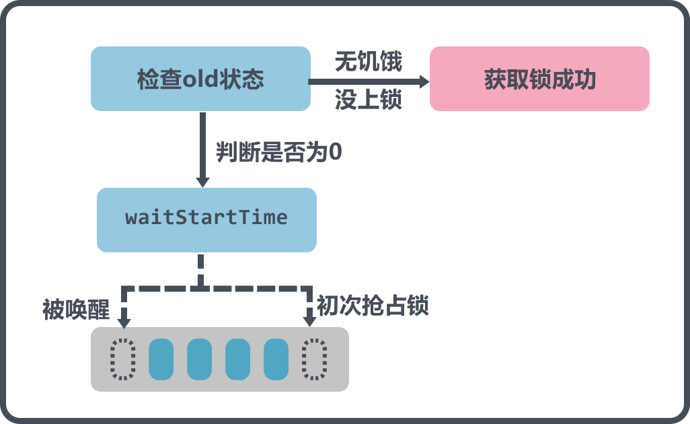
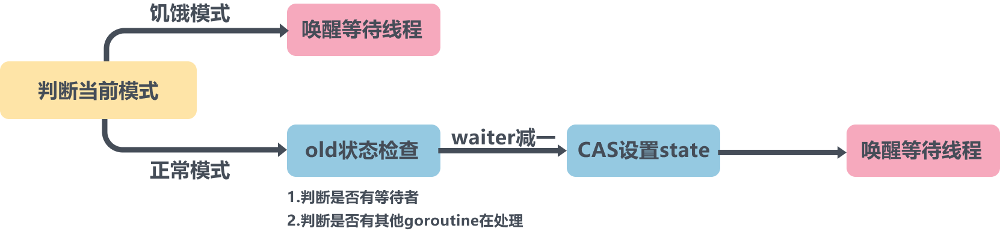

# 多图详解Go的互斥锁Mutex

> 转载请声明出处哦~，本篇文章发布于luozhiyun的博客：https://www.luozhiyun.com
>
> 本文使用的go的源码时14.4

## Mutex介绍

Mutex 结构体包含两个字段：

* 字段state：表示当前互斥锁的状态。

* 字段 sema：是个信号量变量，用来控制等待 goroutine 的阻塞休眠和唤醒。

```go
type Mutex struct {
	state int32
	sema  uint32
}
```

在Go的1.9版本中，为了解决等待中的 goroutine 可能会一直获取不到锁，增加了饥饿模式，让锁变得更公平，不公平的等待时间限制在 1 毫秒。

state状态字段所表示的含义较为复杂，如下图所示，最低三位分别表示mutexLocked、mutexWoken、mutexStarving，state总共是32位长度，所以剩下的位置，用来表示可以有1<<(32-3)个Goroutine 等待互斥锁的释放：


代码表示如下：

```go
const (
	mutexLocked = 1 << iota // mutex is locked
	mutexWoken
	mutexStarving
)
```

## 加锁流程

### fast path

```go
func (m *Mutex) Lock() { 
	if atomic.CompareAndSwapInt32(&m.state, 0, mutexLocked) {
		if race.Enabled {
			race.Acquire(unsafe.Pointer(m))
		}
		return
	} 
	m.lockSlow()
}
```

加锁的时候，一开始会通过CAS看一下能不能直接获取锁，如果可以的话，那么直接获取锁成功。

### lockSlow

```go
// 等待时间
var waitStartTime int64
// 饥饿标记
starving := false
// 唤醒标记
awoke := false
// 自旋次数
iter := 0
// 当前的锁的状态
old := m.state
for { 
    // 锁是非饥饿状态，锁还没被释放，尝试自旋
	if old&(mutexLocked|mutexStarving) == mutexLocked && runtime_canSpin(iter) {
		if !awoke && old&mutexWoken == 0 && old>>mutexWaiterShift != 0 &&
			atomic.CompareAndSwapInt32(&m.state, old, old|mutexWoken) {
			awoke = true
		}
		// 自旋
		runtime_doSpin()
		// 自旋次数加1
		iter++
		// 设置当前锁的状态
		old = m.state
		continue
	}
	...
}
```

进入到lockSlow方法之后首先会判断以下能否可以自旋，判断依据就是通过计算：

```
old&(mutexLocked|mutexStarving) == mutexLocked
```

可以知道当前锁的状态必须是上锁，并且不能处于饥饿状态，这个判断才为true，然后再看看iter是否满足次数的限制，如果都为true，那么则往下继续。

内层if包含了四个判断：

* 首先判断了awoke是不是唤醒状态；

* `old&mutexWoken == 0`为真表示没有其他正在唤醒的节点；

* `old>>mutexWaiterShift != 0`表明当前有正在等待的goroutine；

* CAS将state的mutexWoken状态位设置为`old|mutexWoken`，即为1是否成功。

如果都满足，那么将awoke状态设置为真，然后将自旋次数加一，并重新设置状态。

继续往下看：

```go
new := old
if old&mutexStarving == 0 {
	// 如果当前不是饥饿模式，那么将mutexLocked状态位设置1，表示加锁
	new |= mutexLocked
}
if old&(mutexLocked|mutexStarving) != 0 {
	// 如果当前被锁定或者处于饥饿模式，则waiter加一，表示等待一个等待计数
	new += 1 << mutexWaiterShift
}
// 如果是饥饿状态，并且已经上锁了，那么mutexStarving状态位设置为1，设置为饥饿状态
if starving && old&mutexLocked != 0 {
	new |= mutexStarving
}
// awoke为true则表明当前线程在上面自旋的时候，修改mutexWoken状态成功
if awoke { 
	if new&mutexWoken == 0 {
		throw("sync: inconsistent mutex state")
	}
	// 清除唤醒标志位
	new &^= mutexWoken
}
```

走到这里有两种情况：1. 自旋超过了次数；2. 目前锁没有被持有。

所以第一个判断，如果当前加了锁，但是没有处于饥饿状态，也会重复设置`new |= mutexLocked`，即将mutexLocked状态设置为1；

如果是old已经是饥饿状态或者已经被上锁了，那么需要设置Waiter加一，表示这个goroutine下面不会获取锁，会等待；

如果starving为真，表示当前goroutine是饥饿状态，并且old已经被上锁了，那么设置`new |= mutexStarving`，即将mutexStarving状态位设置为1；

awoke如果在自旋时设置成功，那么在这里要`new &^= mutexWoken`消除mutexWoken标志位。因为后续流程很有可能当前线程会被挂起,就需要等待其他释放锁的goroutine来唤醒，如果unlock的时候发现mutexWoken的位置不是0，则就不会去唤醒，则该线程就无法再醒来加锁。

继续往下：

```go
if atomic.CompareAndSwapInt32(&m.state, old, new) {
	// 1.如果原来状态没有上锁，也没有饥饿，那么直接返回，表示获取到锁
	if old&(mutexLocked|mutexStarving) == 0 {
		break // locked the mutex with CAS
	}
	// 2.到这里是没有获取到锁，判断一下等待时长是否不为0
	// 如果不为0，那么加入到队列头部
	queueLifo := waitStartTime != 0
	// 3.如果等待时间为0，那么初始化等待时间
	if waitStartTime == 0 {
		waitStartTime = runtime_nanotime()
	}
	// 4.阻塞等待
	runtime_SemacquireMutex(&m.sema, queueLifo, 1)
	// 5.唤醒之后检查锁是否应该处于饥饿状态
	starving = starving || runtime_nanotime()-waitStartTime > starvationThresholdNs
	old = m.state
	// 6.判断是否已经处于饥饿状态
	if old&mutexStarving != 0 { 
		if old&(mutexLocked|mutexWoken) != 0 || old>>mutexWaiterShift == 0 {
			throw("sync: inconsistent mutex state")
		}
		// 7.加锁并且将waiter数减1
		delta := int32(mutexLocked - 1<<mutexWaiterShift)
		if !starving || old>>mutexWaiterShift == 1 { 
			// 8.如果当前goroutine不是饥饿状态，就从饥饿模式切换会正常模式
			delta -= mutexStarving
		}
		// 9.设置状态
		atomic.AddInt32(&m.state, delta)
		break
	}
	awoke = true
	iter = 0
} else {
	old = m.state
}
```

到这里，首先会CAS设置新的状态，如果设置成功则往下走，否则返回之后循环设置状态。设置成功之后：

1. 首先会判断old状态，如果没有饥饿，也没有获取到锁，那么直接返回，因为这种情况在进入到这段代码之前会将new状态设置为mutexLocked，表示已经获取到锁。这里还判断了一下old状态不能为饥饿状态，否则也不能获取到锁；
2. 判断waitStartTime是否已经初始化过了，如果是新的goroutine来抢占锁，那么queueLifo会返回false；如果不是新的goroutine来抢占锁，那么加入到等待队列头部，这样等待最久的 goroutine 优先能够获取到锁；
3. 如果等待时间为0，那么初始化等待时间；
4. 阻塞等待，当前goroutine进行休眠；
5. 唤醒之后检查锁是否应该处于饥饿状态，并设置starving变量值；
6. 判断是否已经处于饥饿状态，如果不处于饥饿状态，那么这里直接进入到下一个for循环中获取锁；
7. 加锁并且将waiter数减1，这里我看了一会，没用懂什么意思，其实需要分两步来理解，相当于state+mutexLocked，然后state再将waiter部分的数减一；
8. 如果当前goroutine不是饥饿状态或者waiter只有一个，就从饥饿模式切换会正常模式；
9. 设置状态；

下面用图例来解释：

这部分的图解是休眠前的操作，休眠前会根据old的状态来判断能不能直接获取到锁，如果old状态没有上锁，也没有饥饿，那么直接break返回，因为这种情况会在CAS中设置加上锁；

接着往下判断，waitStartTime是否等于0，如果不等于，说明不是第一次来了，而是被唤醒后来到这里，那么就不能直接放到队尾再休眠了，而是要放到队首，防止长时间抢不到锁；



下面这张图是处于唤醒后的示意图，如何被唤醒的可以直接到跳到解锁部分看完再回来。

被唤醒一开始是需要判断一下当前的starving状态以及等待的时间如果超过了1ms，那么会将starving设置为true；

接下来会有一个if判断， 这里有个细节，因为是被唤醒的，所以判断前需要重新获取一下锁，如果当前不是饥饿模式，那么会直接返回，然后重新进入到for循环中；

如果当前是处于饥饿模式，那么会计算一下delta为加锁，并且当前的goroutine是可以直接抢占锁的，所以需要将waiter减一，如果starving不为饥饿，或者等待时间没有超过1ms，或者waiter只有一个了，那么还需要将delta减去mutexStarving，表示退出饥饿模式；

最后通过AddInt32将state加上delta，这里之所以可以直接加上，因为这时候state的mutexLocked值肯定为0，并且mutexStarving位肯定为1，并且在获取锁之前至少还有当前一个goroutine在等待队列中，所以waiter可以直接减1。


## 解锁流程

### fast path

```go
func (m *Mutex) Unlock() {
	if race.Enabled {
		_ = m.state
		race.Release(unsafe.Pointer(m))
	}
 	//返回一个state被减后的值	
	new := atomic.AddInt32(&m.state, -mutexLocked)
	if new != 0 { 
        //如果返回的state值不为0，那么进入到unlockSlow中
		m.unlockSlow(new)
	}
}
```

这里主要就是AddInt32重新设置state的mutexLocked位为0，然后判断新的state值是否不为0，不为0则调用unlockSlow方法。

### unlockSlow



unlockSlow方法里面也分为正常模式和饥饿模式下的解锁：

```go
func (m *Mutex) unlockSlow(new int32) {
	if (new+mutexLocked)&mutexLocked == 0 {
		throw("sync: unlock of unlocked mutex")
	}
    // 正常模式
	if new&mutexStarving == 0 {
		old := new
		for { 
			// 如果没有 waiter，或者已经有在处理的情况，直接返回
			if old>>mutexWaiterShift == 0 || old&(mutexLocked|mutexWoken|mutexStarving) != 0 {
				return
			} 
			// waiter 数减 1，mutexWoken 标志设置上，通过 CAS 更新 state 的值
			new = (old - 1<<mutexWaiterShift) | mutexWoken
			if atomic.CompareAndSwapInt32(&m.state, old, new) {
				// 直接唤醒等待队列中的 waiter
				runtime_Semrelease(&m.sema, false, 1)
				return
			}
			old = m.state
		}
	} else { // 饥饿模式
		// 直接唤醒等待队列中的 waiter
		runtime_Semrelease(&m.sema, true, 1)
	}
}
```

在正常模式下，如果没有 waiter，或者mutexLocked、mutexStarving、mutexWoken有一个不为零说明已经有其他goroutine在处理了，直接返回；如果互斥锁存在等待者，那么通过runtime_Semrelease直接唤醒等待队列中的 waiter；

在饥饿模式，直接调用runtime_Semrelease方法将当前锁交给下一个正在尝试获取锁的等待者，等待者被唤醒后会得到锁。

## 总结

Mutex的设计非常的简洁的，从代码可以看出为了设计出这么简洁的代码state一个字段可以当4个字段使用。并且为了解决goroutine饥饿问题，在1.9 中 Mutex 增加了饥饿模式让锁变得更公平，不公平的等待时间限制在 1 毫秒，但同时，代码也变得越来越难懂了，所以要理解它上面的思想需要慢慢的废些时间细细的体会一下了。


