# Go语言GC实现原理及源码分析

> 转载请声明出处哦~，本篇文章发布于luozhiyun的博客：https://www.luozhiyun.com
>
> 本文使用的 Go 的源码1.15.7 


## 介绍

### 三色标记法

三色标记法将对象的颜色分为了黑、灰、白，三种颜色。

- 黑色：该对象已经被标记过了，且该对象下的属性也全部都被标记过了（程序所需要的对象）；
- 灰色：该对象已经被标记过了，但该对象下的属性没有全被标记完（GC需要从此对象中去寻找垃圾）；
- 白色：该对象没有被标记过（对象垃圾）；

在垃圾收集器开始工作时，从 GC Roots 开始进行遍历访问，访问步骤可以分为下面几步：

1. GC Roots 根对象会被标记成灰色；
2. 然后从灰色集合中获取对象，将其标记为黑色，将该对象引用到的对象标记为灰色；
3. 重复步骤2，直到没有灰色集合可以标记为止；
4. 结束后，剩下的没有被标记的白色对象即为 GC Roots 不可达，可以进行回收。

流程大概如下：

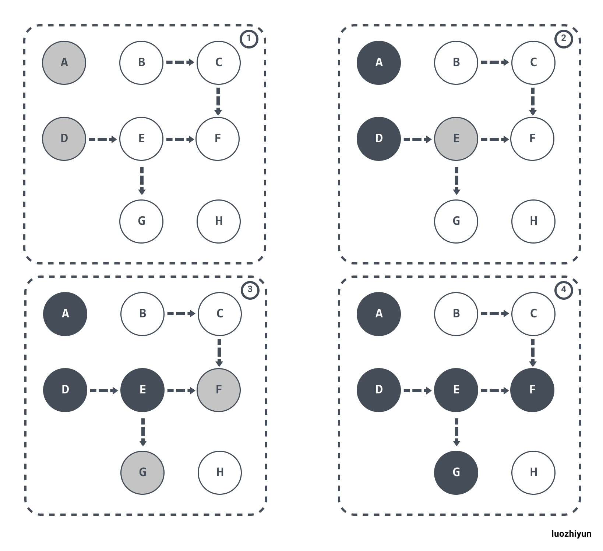

下面我们来说说三色标记法会存在的问题。

### 三色标记法所存在问题

#### 多标-浮动垃圾问题

假设 E 已经被标记过了（变成灰色了），此时 D 和 E 断开了引用，按理来说对象 E/F/G 应该被回收的，但是因为 E 已经变为灰色了，其仍会被当作存活对象继续遍历下去。最终的结果是：这部分对象仍会被标记为存活，即本轮 GC 不会回收这部分内存。

这部分本应该回收 但是没有回收到的内存，被称之为“浮动垃圾”。过程如下图所示：

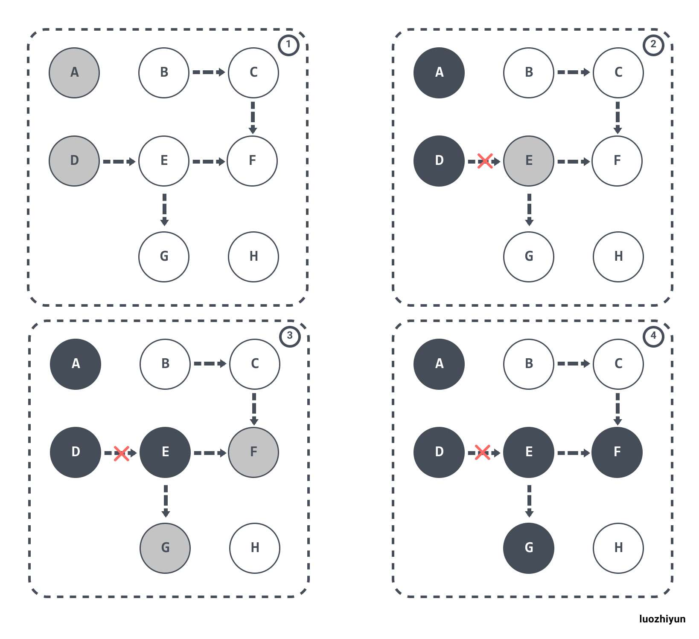

#### 漏标-悬挂指针问题

除了上面多标的问题，还有就是漏标问题。当 GC 线程已经遍历到 E 变成灰色，D变成黑色时，灰色 E 断开引用白色 G ，黑色 D 引用了白色 G。此时切回 GC 线程继续跑，因为 E 已经没有对 G 的引用了，所以不会将 G 放到灰色集合。尽管因为 D 重新引用了 G，但因为 D 已经是黑色了，不会再重新做遍历处理。

最终导致的结果是：G 会一直停留在白色集合中，最后被当作垃圾进行清除。这直接影响到了应用程序的正确性，是不可接受的，这也是 Go 需要在 GC 时解决的问题。

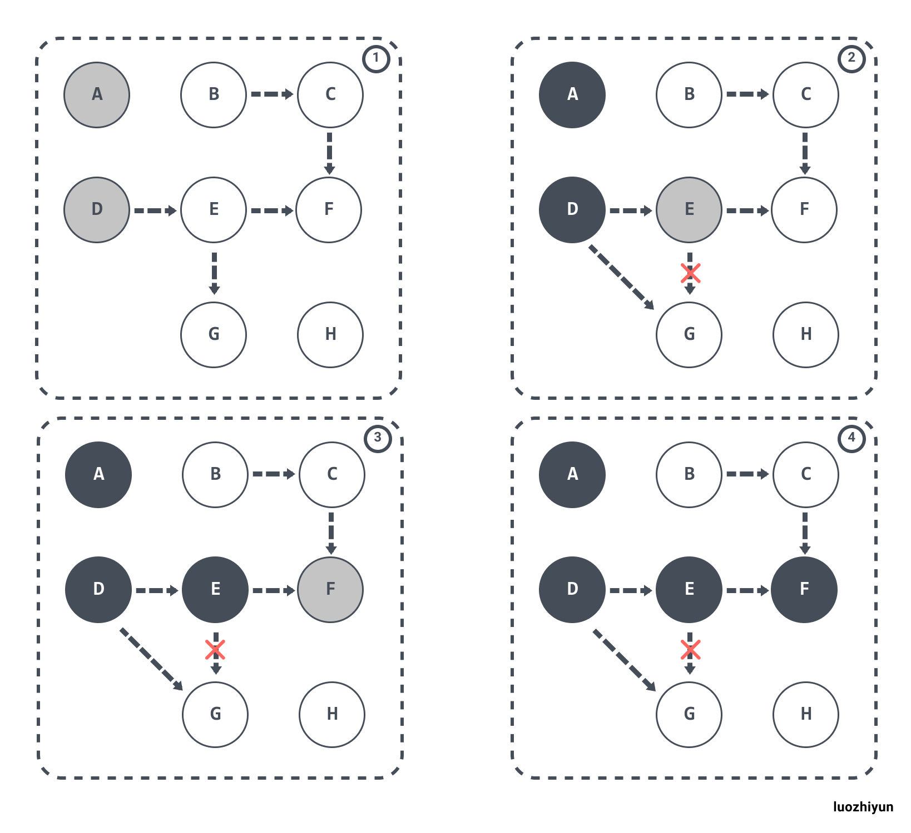

### 内存屏障

为了**解决**上面的悬挂指针问题，我们需要引入屏障技术来保障数据的一致性。

> A **memory barrier**,  is a type of [barrier](https://en.wikipedia.org/wiki/Barrier_(computer_science)) [instruction](https://en.wikipedia.org/wiki/Instruction_(computer_science)) that causes a [central processing unit](https://en.wikipedia.org/wiki/Central_processing_unit) (CPU) or [compiler](https://en.wikipedia.org/wiki/Compiler) to enforce an [ordering](https://en.wikipedia.org/wiki/Memory_ordering) constraint on [memory](https://en.wikipedia.org/wiki/Random-access_memory) operations issued before and after the barrier instruction. This typically means that operations issued prior to the barrier are guaranteed to be performed before operations issued after the barrier.

内存屏障，是一种屏障指令，它能使CPU或编译器对在该屏障指令之前和之后发出的内存操作强制执行**排序约束**，在内存屏障前执行的操作一定会先于内存屏障后执行的操作。

那么为了在标记算法中保证正确性，那么我们需要达成下面任意一个条件：

* 强三色不变性（strong tri-color invariant）：黑色对象不会指向白色对象，只会指向灰色对象或者黑色对象；
* 弱三色不变性（weak tri-color invariant）：即便黑色对象指向白色对象，那么从灰色对象出发，总存在一条可以找到该白色对象的路径；

根据操作类型的不同，我们可以将内存屏障分成 Read barrier（读屏障）和 Write barrier（写屏障）两种，在 Go 中都是使用 Write barrier（写屏障），原因在《Uniprocessor Garbage Collection Techniques》也提到了：

> If a non copying collector is used  the use of a read barrier is an unnecessary expense.there is no need to protect the mutator from seeing an invalid version of a pointer. Write barrier techniques are cheaper, because heap writes are several times less common than heap reads

对于一个不需要对象拷贝的垃圾回收器来说， Read barrier（读屏障）代价是很高的，因为对于这类垃圾回收器来说是不需要保存读操作的版本指针问题。相对来说 Write barrier（写屏障）代码更小，因为堆中的写操作远远小于堆中的读操作。

来下面我们看看 Write barrier（写屏障）是如何做到这一点的。

#### Dijkstra Write barrier

Go 1.7 之前使用的是 Dijkstra Write barrier（写屏障），使用的实现类似下面伪代码：

```go
writePointer(slot, ptr):
    shade(ptr)
    *slot = ptr
```

如果该对象是白色的话，`shade(ptr)`会将对象标记成灰色。这样可以保证强三色不变性，它会保证 ptr 指针指向的对象在赋值给 `*slot` 前不是白色。

如下，根对象指向的 D 对象标记成黑色并将 D 对象指向的对象 E 标记成灰色；如果 D 断开对 E 的引用，改成引用 B 对象，那么这时触发写屏障将 B 对象标记成灰色。

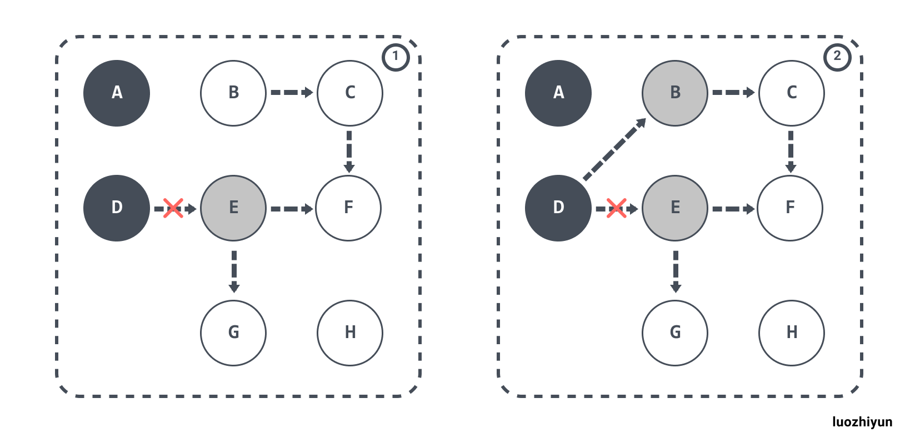

Dijkstra Write barrier虽然实现非常的简单，并且也能保证强三色不变性，但是在《Proposal: Eliminate STW stack re-scanning》中也提出了它具有一些缺点：

> In particular, it presents a trade-off for pointers on stacks: either writes to pointers on the stack must have write barriers, which is prohibitively expensive, or stacks must be permagrey. 

因为栈上的对象在垃圾收集中也会被认为是根对象，所以要么为栈上的对象增加写屏障，但这会大幅度增加写入指针的额外开销；要么当发生栈上的写操作时，将栈标记为恒灰（permagrey）。

Go 1.7 的时候选择的是将栈标记为恒灰，但需要在标记终止阶段 STW 时对这些栈进行重新扫描（re-scan）。原因如下所描述：

> without stack write barriers, we can‘t ensure that the stack won’t later contain a reference to a white object, so a scanned stack is only black until its goroutine executes again, at which point it conservatively reverts to grey. Thus, at the end of the cycle, the garbage collector must re-scan grey stacks to blacken them and finish marking any remaining heap pointers.

#### Yuasa Write barrier

Yuasa Write barrier 是 Yuasa 在《Real-time garbage collection on general-purpose machines》中提出的一种删除屏障（deletion barrier）技术。其思想是当赋值器从灰色或白色对象中删除白色指针时，通过写屏障将这一行为通知给并发执行的回收器。

该算法会使用如下所示的写屏障保证增量或者并发执行垃圾收集时程序的正确性，伪代码实现如下：

```
writePointer(slot, ptr)
    shade(*slot)
    *slot = ptr
```

为了防止丢失从灰色对象到白色对象的路径，应该假设 *slot 可能会变为黑色， 为了确保 ptr 不会在被赋值到 *slot 前变为白色，shade(*slot) 会先将 *slot 标记为灰色， 进而该写操作总是创造了一条灰色到灰色或者灰色到白色对象的路径，这样删除写屏障就可以保证弱三色不变性，老对象引用的下游对象一定可以被灰色对象引用。

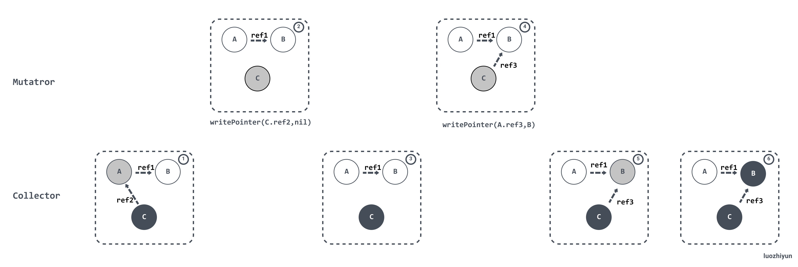

#### Hybrid write barrier

上面说了在 Go 1.7 之前使用的是 Dijkstra Write barrier（写屏障）来保证三色不变性。Go 在重新扫描的时候必须保证对象的引用不会改变，因此会进行暂停程序（STW）、将所有栈对象标记为灰色并重新扫描，这通常会消耗10～100 毫秒的时间。

通过 Proposal: Eliminate STW stack re-scanning https://go.googlesource.com/proposal/+/master/design/17503-eliminate-rescan.md 的介绍，可以知道为了消除重新扫描所带来的性能损耗，Go 在 1.8 的时候使用 Hybrid write barrier（混合写屏障），结合了 Yuasa write barrier 和 Dijkstra write barrier ，实现的伪代码如下：

```
writePointer(slot, ptr):
    shade(*slot)
    if current stack is grey:
        shade(ptr)
    *slot = ptr
```

这样做不仅简化 GC 的流程，同时减少标记终止阶段的重扫成本。混合写屏障的基本思想是：

>  the write barrier shades the object whose reference is being overwritten, and, if the current goroutine's stack has not yet been scanned, also shades the reference being installed.

翻译过来就是：对正在被覆盖的对象进行着色，且如果当前栈未扫描完成， 则同样对指针进行着色。

同时，在GC的过程中所有新分配的对象都会立刻变为黑色，在内存分配的时候 `go\src\runtime\malloc.go` 的 mallocgc 函数中可以看到：

```go
func mallocgc(size uintptr, typ *_type, needzero bool) unsafe.Pointer { 
	...  
	dataSize := size
	// 获取mcache，用于处理微对象和小对象的分配
	c := gomcache()
	var x unsafe.Pointer
	// 表示对象是否包含指针，true表示对象里没有指针
	noscan := typ == nil || typ.ptrdata == 0
	// maxSmallSize=32768 32k
	if size <= maxSmallSize {
		// maxTinySize= 16 bytes 
		if noscan && size < maxTinySize {
			...
		} else {
			...
		}
		// 大于 32 Kb 的内存分配,通过 mheap 分配
	} else {
		...
	} 
	...
	// 在 GC 期间分配的新对象都会被标记成黑色
	if gcphase != _GCoff {
		gcmarknewobject(span, uintptr(x), size, scanSize)
	}
	...
	return x
}
```

在垃圾收集的标记阶段，将新建的对象标记成黑色，防止新分配的栈内存和堆内存中的对象被错误地回收。

## 分析

### GC phase 垃圾收集阶段

GC 相关的代码在`runtime/mgc.go`文件下。通过注释介绍我们可以知道 GC 一共分为4个阶段：

1. sweep termination（清理终止）
   1. 会触发 STW ，所有的 P（处理器） 都会进入 safe-point（安全点）；
   2. 清理未被清理的 span ，不知道什么是 span 的同学可以看看我的：详解Go中内存分配源码实现 https://www.luozhiyun.com/archives/434；
2. the mark phase（标记阶段）
   1. 将 `_GCoff` GC 状态 改成  `_GCmark`，开启 Write Barrier （写入屏障）、mutator  assists（协助线程），将根对象入队；
   2. 恢复程序执行，mark workers（标记进程）和 mutator  assists（协助线程）会开始并发标记内存中的对象。对于任何指针写入和新的指针值，都会被写屏障覆盖，而所有新创建的对象都会被直接标记成黑色；
   3. GC 执行根节点的标记，这包括扫描所有的栈、全局对象以及不在堆中的运行时数据结构。扫描goroutine 栈绘导致 goroutine 停止，并对栈上找到的所有指针加置灰，然后继续执行 goroutine。
   4. GC 在遍历灰色对象队列的时候，会将灰色对象变成黑色，并将该对象指向的对象置灰；
   5. GC 会使用分布式终止算法（distributed termination algorithm）来检测何时不再有根标记作业或灰色对象，如果没有了 GC 会转为mark termination（标记终止）；
3. mark termination（标记终止）
   1. STW，然后将 GC 阶段转为 `_GCmarktermination`,关闭 GC 工作线程以及 mutator  assists（协助线程）；
   2. 执行清理，如 flush mcache；

4. the sweep phase（清理阶段）
   1. 将 GC 状态转变至 `_GCoff`，初始化清理状态并关闭 Write Barrier（写入屏障）；
   2. 恢复程序执行，从此开始新创建的对象都是白色的；
   3. 后台并发清理所有的内存管理单元

需要注意的是，上面提到了 mutator  assists，因为有一种情况：

> during the collection that the Goroutine dedicated to GC will not finish the Marking work before the heap memory in-use reaches its limit

因为 GC 标记的工作是分配 25% 的 CPU 来进行 GC 操作，所以有可能 GC 的标记工作线程比应用程序的分配内存慢，导致永远标记不完，那么这个时候就需要应用程序的线程来协助完成标记工作：

> If the collector determines that it needs to slow down allocations, it will recruit the application Goroutines to assist with the Marking work. This is called a Mutator Assist. One positive side effect of Mutator Assist is that it helps to finish the collection faster.

### 下次 GC 时机

下次 GC 的时机可以通过一个环境变量 GOGC 来控制，默认是 100 ，即增长 100% 的堆内存才会触发 GC。

> This value represents a ratio of how much new heap memory can be allocated before the next collection has to start.

官方的解释是，如果当前使用了 4M 内存，那么下次 GC 将会在内存达到 8M 的时候。下面我们看看一个具体的例子：

```go
package main

import (
	"fmt"
)

func main() {
	fmt.Println("start.")

	container := make([]int, 8)
	fmt.Println("> loop.")
	for i := 0; i < 32*1000*1000; i++ {
		container = append(container, i)
	}
	fmt.Println("< loop.")
}
```

需要注意的是，大家在做实验的时候推荐使用 Linux 环境，如果没有 Linux 环境可以像我一样在 win10 下跑了一个虚拟机，然后用 vscode 远程到 Linux 进行实验的，大家不妨试一下。

编译好之后，可以使用 gctrace 跟踪 GC 情况：

```
[root@localhost gotest]# go build main.go 
[root@localhost gotest]# GODEBUG=gctrace=1 ./main
start.
> loop.
gc 1 @0.004s 4%: 0.22+1.4+0.021 ms clock, 1.7+0.009/0.40/0.073+0.16 ms cpu, 4->5->1 MB, 5 MB goal, 8 P
gc 2 @0.006s 4%: 0.10+1.6+0.020 ms clock, 0.83+0.12/0/0+0.16 ms cpu, 4->6->1 MB, 5 MB goal, 8 P
gc 3 @0.009s 16%: 0.035+5.5+2.2 ms clock, 0.28+0/0.47/0.007+18 ms cpu, 4->15->15 MB, 5 MB goal, 8 P
...
< loop.
```

上面展示了 3 次 GC 的情况，下面我们看看具体的含义是什么：

```
gc 1 @0.004s 4%: 0.22+1.4+0.021 ms clock, 1.7+0.009/0.40/0.073+0.16 ms cpu, 4->5->1 MB, 5 MB goal, 8 P

gc 1 ：程序启动以来第1次GC
@0.004s：距离程序启动到现在的时间
4%：当目前为止，GC 的标记工作所用的CPU时间占总CPU的百分比

垃圾回收的时间
0.22 ms：标记开始 STW 时间
1.4 ms：并发标记时间
0.021 ms：标记终止 STW 时间

垃圾回收占用cpu时间
1.7 ms：标记开始 STW 时间
0.009 ms：mutator assists占用的时间
0.40 ms：标记线程占用的时间
0.073 ms：idle mark workers占用的时间
0.16 ms：标记终止 STW 时间

内存
4 MB：标记开始前堆占用大小
5 MB：标记结束后堆占用大小
1 MB：标记完成后存活堆的大小
5 MB goal：标记完成后正在使用的堆内存的目标大小

8 P：使用了多少处理器
```

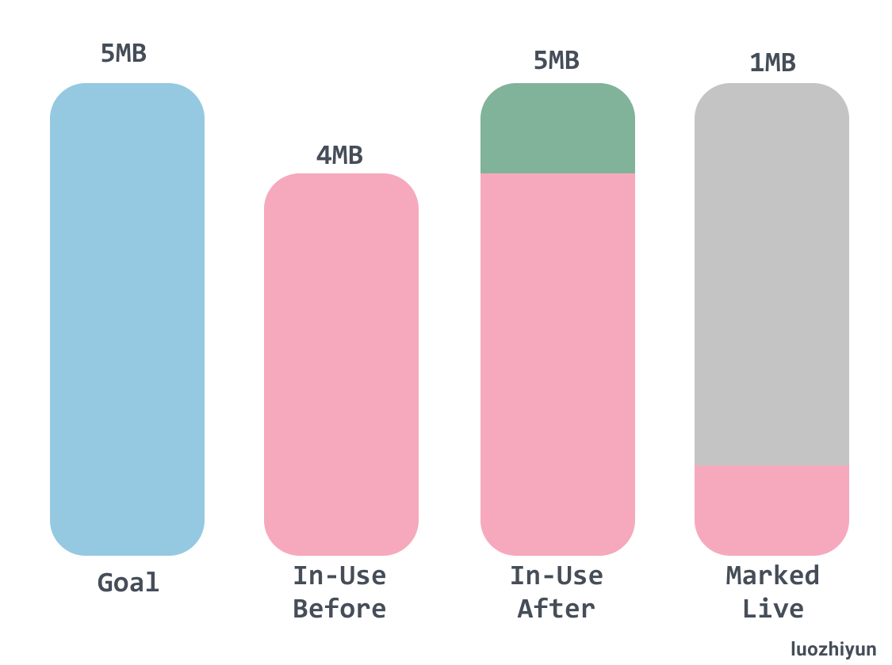

从上面的 GC 内存信息中可以看到，在 GC 标记开始之前的时候堆大小是 4MB，由于标记工作是并发进行的，所以当标记完成的时候堆中被使用的大小是 5MB，这表示有 1MB 的内存分配是发生在 GC 期间。最后我们可以看到 GC 标记完之后存活的堆大小只有 1MB，这也表示可以在堆占用内存达到 2MB 的时候开始下一轮 GC。

从上面我们可以看到 Goal 部分的内存大小是 5MB，和实际的 In-Use After 部分的内存占用情况相等，但是在很多复杂的情况下是不相等的，因为 Goal 部分的内存大小是基于当前内存的使用情况进行推算的。

> the goal is calculated based on the current amount of the heap memory in-use, the amount of heap memory marked as live, and timing calculations about the additional allocations that will occur while the collection is running. 

### 触发 GC 条件

触发 GC 条件是由 `gcTrigger.test`来进行校验的，下面我们看看 `gcTrigger.test`如何判定是否需要触发垃圾收集：

```go
func (t gcTrigger) test() bool {
	if !memstats.enablegc || panicking != 0 || gcphase != _GCoff {
		return false
	}
	switch t.kind {
	case gcTriggerHeap: 
		// 堆内存的分配达到达控制器计算的触发堆大小
		return memstats.heap_live >= memstats.gc_trigger
	case gcTriggerTime:
		if gcpercent < 0 {
			return false
		}
		lastgc := int64(atomic.Load64(&memstats.last_gc_nanotime))
		// 如果一定时间内没有触发，就会触发新的循环
		return lastgc != 0 && t.now-lastgc > forcegcperiod
	case gcTriggerCycle:
		// 要求启动新一轮的GC, 已启动则跳过
		return int32(t.n-work.cycles) > 0
	}
	return true
}
```

gcTriggerTime 的触发时间是由 forcegcperiod 决定的，默认是2分钟。下面我们主要看看堆内存大小触发 GC 的情况。

gcTriggerHeap 堆内存的分配达到达控制器计算的触发堆大小，heap_live 值会在内存分配的时候进行计算，gc_trigger 的计算是在 `runtime.gcSetTriggerRatio`函数中进行的。

```go
func gcSetTriggerRatio(triggerRatio float64) { 
	// gcpercent 由环境变量 GOGC 决定
	if gcpercent >= 0 {
		// 默认是 1
		scalingFactor := float64(gcpercent) / 100 
		// 最大的 maxTriggerRatio 是 0.95
		maxTriggerRatio := 0.95 * scalingFactor
		if triggerRatio > maxTriggerRatio {
			triggerRatio = maxTriggerRatio
		}

		// 最大的 minTriggerRatio 是 0.6
		minTriggerRatio := 0.6 * scalingFactor
		if triggerRatio < minTriggerRatio {
			triggerRatio = minTriggerRatio
		}
	} else if triggerRatio < 0 { 
		triggerRatio = 0
	}
	memstats.triggerRatio = triggerRatio

	trigger := ^uint64(0)
	if gcpercent >= 0 {
        // 当前标记存活的大小乘以1+系数triggerRatio
		trigger = uint64(float64(memstats.heap_marked) * (1 + triggerRatio))
		...
	}
	memstats.gc_trigger = trigger
	...
}
```

gcSetTriggerRatio 函数会根据计算出来的 triggerRatio 来获取下次触发 GC 的堆大小是多少。triggerRatio 每次GC后都会调整，计算 triggerRatio 的函数是 `gcControllerState.endCycle`中进行的，`gcControllerState.endCycle` 会在 MarkDone 中被调用的。

```go
func (c *gcControllerState) endCycle() float64 {
	const triggerGain = 0.5
	// 目标Heap增长率 = （下次 GC 完后堆大小 - 堆存活大小）/ 堆存活大小
	goalGrowthRatio := float64(memstats.next_gc-memstats.heap_marked) / float64(memstats.heap_marked)
	// 实际Heap增长率, 等于总大小/存活大小-1
	actualGrowthRatio := float64(memstats.heap_live)/float64(memstats.heap_marked) - 1
	// GC标记阶段的使用时间
	assistDuration := nanotime() - c.markStartTime
	// GC标记阶段的CPU占用率, 目标值是0.25
	utilization := gcBackgroundUtilization
	// Add assist utilization; avoid divide by zero.
	if assistDuration > 0 {
		// assistTime 是G辅助GC标记对象所使用的时间合计
		// 额外的CPU占用率 = 辅助GC标记对象的总时间 / (GC标记使用时间 * P的数量)// 额外的CPU占用率 = 辅助GC标记对象的总时间 / (GC标记使用时间 * P的数量)
		utilization += float64(c.assistTime) / float64(assistDuration*int64(gomaxprocs))
	}
	// 触发系数偏移值 = 目标增长率 - 原触发系数 - CPU占用率 / 目标CPU占用率 * (实际增长率 - 原触发系数)
	triggerError := goalGrowthRatio - memstats.triggerRatio - utilization/gcGoalUtilization*(actualGrowthRatio-memstats.triggerRatio)

	// 根据偏移值调整触发系数, 每次只调整偏移值的一半
	triggerRatio := memstats.triggerRatio + triggerGain*triggerError
 
	return triggerRatio
}
```

对于 triggerRatio 总体来说还是比较复杂的，我们可以根据偏离值来得知：

* 实际增长率越大, 触发系数偏移值越小, 小于0时下次触发GC会提早；
* CPU占用率越大, 触发系数偏移值越小, 小于0时下次触发GC会提早；
* 原触发系数越大, 触发系数偏移值越小, 小于0时下次触发GC会提早；

通过上面的分析，也解释了为什么在 `GODEBUG=gctrace=1`分析中明明堆内存还没达到 2倍却被提前执行了，主要还是受 triggerError 偏移量的影响导致的。

### 开始 GC

我们在测试的时候可以调用 `runtime.GC`来手动的触发 GC。但实际上，触发 GC 的入口一般不会手动调用。正常触发 GC 应该是在申请内存时会调用 `runtime.mallocgc`或者是 Go 后台的监控线程 sysmon 定时检查调用 `runtime.forcegchelper`。

```go
func GC() {
	// 获取 GC 循环次数
	n := atomic.Load(&work.cycles)
	// 等待上一个循环的标记终止、标记和清除终止阶段完成
	gcWaitOnMark(n)
	// 触发新一轮的 GC
	gcStart(gcTrigger{kind: gcTriggerCycle, n: n + 1})
	// 同上
	gcWaitOnMark(n + 1) 
	// 等待清理全部待处理的内存管理单元
	for atomic.Load(&work.cycles) == n+1 && sweepone() != ^uintptr(0) {
		sweep.nbgsweep++
		// 让出 P
		Gosched()
	} 

	for atomic.Load(&work.cycles) == n+1 && atomic.Load(&mheap_.sweepers) != 0 {
		Gosched()
	}
 
	mp := acquirem()
	cycle := atomic.Load(&work.cycles)
	if cycle == n+1 || (gcphase == _GCmark && cycle == n+2) {
		// 将该阶段的堆内存状态快照发布出来（ heap profile）
		mProf_PostSweep()
	}
	releasem(mp)
}
```

1. 首先会获取 GC 的循环次数，然后调用 gcWaitOnMark 等待上一个循环的标记终止、标记和清除终止阶段完成；
2. 调用 gcStart 触发新一轮的 GC，并且会调用 gcWaitOnMark 等待当前的循环的标记终止、标记和清除终止阶段完成；
3. 调用 sweepone 等待清理全部待处理的内存管理单元，然后调用 Gosched 让出 P；
4. 完成本轮垃圾收集的清理工作后，调用 mProf_PostSweep 将该阶段的堆内存状态快照发布出来；

### GC 启动

下图是比较完整的GC流程，可作为看源码时候的导航：

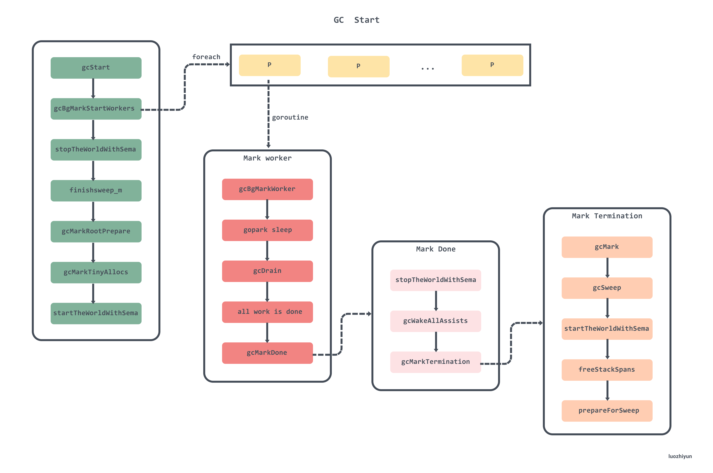

gcStart 函数比较长，下面分段来看看 gcStart：

```go
func gcStart(trigger gcTrigger) {
	...
	// 验证垃圾收集条件 ,并清理已经被标记的内存单元
	for trigger.test() && sweepone() != ^uintptr(0) {
		sweep.nbgsweep++
	} 
	// 获取全局的 startSema信号量
	semacquire(&work.startSema) 
	// 再次验证垃圾收集条件
	if !trigger.test() {
		semrelease(&work.startSema)
		return
	}
	// 检查是不是手动调用了 runtime.GC
	work.userForced = trigger.kind == gcTriggerCycle 
 
	semacquire(&gcsema)
	semacquire(&worldsema) 
	// 启动后台标记任务
	gcBgMarkStartWorkers()
	// 重置标记相关的状态
	systemstack(gcResetMarkState)

	// work 初始化工作
	work.stwprocs, work.maxprocs = gomaxprocs, gomaxprocs
	if work.stwprocs > ncpu { 
		work.stwprocs = ncpu
	} 
	work.heap0 = atomic.Load64(&memstats.heap_live)
	work.pauseNS = 0
	work.mode = mode 
	// 记录开始时间
	now := nanotime()
	work.tSweepTerm = now
	work.pauseStart = now
	// 暂停程序 STW
	systemstack(stopTheWorldWithSema) 
	// 在并发标记前，确保清理结束
	systemstack(func() {
		finishsweep_m()
	})
	// 清理sched.sudogcache 以及 sync.Pools
	clearpools()
	// GC 次数
	work.cycles++
	// 在开始 GC 之前清理控制器的状态,标记新一轮GC已开始
	gcController.startCycle()
	work.heapGoal = memstats.next_gc 
	// 设置全局变量中的GC状态为_GCmark
	// 然后启用写屏障
	setGCPhase(_GCmark)
	// 初始化后台扫描需要的状态
	gcBgMarkPrepare() // Must happen before assist enable.
	// 扫描栈上、全局变量等根对象并将它们加入队列
	gcMarkRootPrepare() 
	// 标记所有tiny alloc等待合并的对象
	gcMarkTinyAllocs() 
	// 启用 mutator  assists（协助线程）
	atomic.Store(&gcBlackenEnabled, 1)
	// 记录标记开始的时间
	gcController.markStartTime = now
	mp = acquirem()
	// 启动程序，后台任务也会开始标记堆中的对象
	systemstack(func() {
		now = startTheWorldWithSema(trace.enabled)
		// 记录停止了多久, 和标记阶段开始的时间
		work.pauseNS += now - work.pauseStart
		work.tMark = now
	}) 
	semrelease(&worldsema)
	...
}
```

1. 两次调用 `trigger.test`检查是否满足垃圾收集的条件，这个函数我们在上面讲过了；
2. 调用 `semacquire(&work.startSema) `上锁，调用 `gcBgMarkStartWorkers`启动后台标记任务，这个我们后面重点说；
3. 对 work 结构体做初始化工作，设置垃圾收集需要的 Goroutine 数量以及已完成的GC 次数等；
4. 在开始 GC 之前调用 `gcController.startCycle` 清理控制器的状态，标记新一轮GC已开始；
5. 调用 setGCPhase 设置全局变量中的GC状态为 _GCmark ，然后启用写屏障；
6. 调用 gcBgMarkPrepare 初始化后台扫描需要的状态；
7. 调用 gcMarkRootPrepare 将扫描栈上、全局变量等根对象并将它们加入队列；
8. 调用 gcMarkTinyAllocs 标记所有 tiny alloc 内存块；
9. 设置 gcBlackenEnabled ，启用 mutator  assists（协助线程）；
10. 记录完标记开始的时间后，调用 startTheWorldWithSema 启动程序，后台任务也会开始标记堆中的对象；

下面这张图显示了 gcStart 过程中状态变化，以及 STW 停顿的方法，写屏障启用的周期：

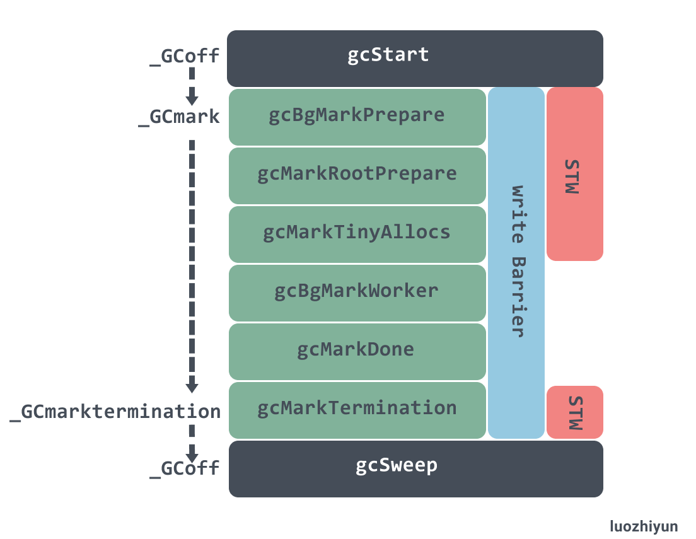

上面只是粗略的说一下各个函数的作用，下面来分析一些重要的函数。

#### startCycle

```go
func (c *gcControllerState) startCycle() {
	c.scanWork = 0
	c.bgScanCredit = 0
	c.assistTime = 0
	c.dedicatedMarkTime = 0
	c.fractionalMarkTime = 0
	c.idleMarkTime = 0
	// 设置 next_gc 最小值 
	if memstats.next_gc < memstats.heap_live+1024*1024 {
		memstats.next_gc = memstats.heap_live + 1024*1024
	}
	// gcBackgroundUtilization 默认是 0.25
	// 是GC所占的P的目标值
	totalUtilizationGoal := float64(gomaxprocs) * gcBackgroundUtilization
	// dedicatedMarkWorkersNeeded 等于P的数量的25% 加上 0.5 去掉小数点
	c.dedicatedMarkWorkersNeeded = int64(totalUtilizationGoal + 0.5)
	utilError := float64(c.dedicatedMarkWorkersNeeded)/totalUtilizationGoal - 1
	const maxUtilError = 0.3
	if utilError < -maxUtilError || utilError > maxUtilError {
		if float64(c.dedicatedMarkWorkersNeeded) > totalUtilizationGoal {
			c.dedicatedMarkWorkersNeeded--
		}
		// 是 gcMarkWorkerFractionalMode 的任务所占的P的目标值(
		c.fractionalUtilizationGoal = (totalUtilizationGoal - float64(c.dedicatedMarkWorkersNeeded)) / float64(gomaxprocs)
	} else {
		c.fractionalUtilizationGoal = 0
	}

	if debug.gcstoptheworld > 0 {
		c.dedicatedMarkWorkersNeeded = int64(gomaxprocs)
		c.fractionalUtilizationGoal = 0
	}
	for _, p := range allp {
		p.gcAssistTime = 0
		p.gcFractionalMarkTime = 0
	}
	// 计算协助GC的参数
	c.revise()
}
```

这里需要注意的是 dedicatedMarkWorkersNeeded 与 fractionalUtilizationGoal 的计算过程，这个会在计算 work 工作模式的用到。

#### 标记 tiny alloc

```go
func gcMarkTinyAllocs() {
	for _, p := range allp {
        // 标记各个 P 中的 mcache 中的 tiny
		c := p.mcache
		if c == nil || c.tiny == 0 {
			continue
		}
		_, span, objIndex := findObject(c.tiny, 0, 0)
		gcw := &p.gcw
        // 标记存活对象，并把它加到 gcwork 标记队列
		greyobject(c.tiny, 0, 0, span, gcw, objIndex)
	}
}
```

tiny block 这个数据结构也在内存分配那一节讲过了，这里主要是会把所有  P 中的 mcache 中的 tiny 找到并进行标记，然后把它加到 gcwork 标记队列，至于什么是 gcwork 标记队列，我们下面在执行标记的地方会讲到。

#### write Barrier 写屏障

在设置 GC 阶段标记的时候会根据当前的设置的值来判断是否需要开启 write Barrier ：

```go
func setGCPhase(x uint32) {
	atomic.Store(&gcphase, x)
	writeBarrier.needed = gcphase == _GCmark || gcphase == _GCmarktermination
	writeBarrier.enabled = writeBarrier.needed || writeBarrier.cgo
}
```

编译器会在`src\cmd\compile\internal\ssa\writebarrier.go`中调用 writebarrier 函数，就如同它的注释所说：

> // writebarrier pass inserts write barriers for store ops (Store, Move, Zero)
> // when necessary (the condition above). It rewrites store ops to branches
> // and runtime calls, like
> //
> // if writeBarrier.enabled {
> //   gcWriteBarrier(ptr, val)  // Not a regular Go call
> // } else {
> //   *ptr = val
> // }

在执行 Store, Move, Zero 等汇编操作的时候加入写屏障。

我们可以通过 dlv 断点找到 gcWriteBarrier 汇编代码的位置在 `go/src/runtime/asm_amd64.s:1395`。该汇编函数会调用 `runtime.wbBufFlush`将  write barrier 的缓存任务添加到 GC 的工作队列中进行处理。

```go
func wbBufFlush(dst *uintptr, src uintptr) {
	...
	systemstack(func() {
		...
		wbBufFlush1(getg().m.p.ptr())
	})
}

func wbBufFlush1(_p_ *p) {
	// 获取缓存的指针
	start := uintptr(unsafe.Pointer(&_p_.wbBuf.buf[0]))
	n := (_p_.wbBuf.next - start) / unsafe.Sizeof(_p_.wbBuf.buf[0])
	ptrs := _p_.wbBuf.buf[:n]

	_p_.wbBuf.next = 0

	  
	gcw := &_p_.gcw
	pos := 0
	for _, ptr := range ptrs {
		// 查找到对象
		obj, span, objIndex := findObject(ptr, 0, 0)
		if obj == 0 {
			continue
		} 
		mbits := span.markBitsForIndex(objIndex)
		// 判断是否已被标记
		if mbits.isMarked() {
			continue
		}
		// 进行标记
		mbits.setMarked()

		// 标记 span.
		arena, pageIdx, pageMask := pageIndexOf(span.base())
		if arena.pageMarks[pageIdx]&pageMask == 0 {
			atomic.Or8(&arena.pageMarks[pageIdx], pageMask)
		}

		if span.spanclass.noscan() {
			gcw.bytesMarked += uint64(span.elemsize)
			continue
		}
		ptrs[pos] = obj
		pos++
	}

	// 将对象加入到 gcWork队列中
	gcw.putBatch(ptrs[:pos]) 
	// 重置 write barrier 缓存
	_p_.wbBuf.reset()
}
```

写屏障这里其实也是和并发标记是一样的套路，可以看完并发标记再过来看。wbBufFlush1 会遍历write barrier 缓存，然后调用 findObject 查找到对象之后使用标志位进行标记，最后将对象加入到 gcWork队列中进行扫描，并 重置 write barrier 缓存。

#### stopTheWorldWithSema 与 startTheWorldWithSema

stopTheWorldWithSema 与 startTheWorldWithSema 是一对用于暂停和恢复程序的核心函数。

```go
func stopTheWorldWithSema() {
	_g_ := getg() 

	lock(&sched.lock)
	sched.stopwait = gomaxprocs
	// 标记 gcwaiting，调度时看见此标记会进入等待
	atomic.Store(&sched.gcwaiting, 1)
	// 发送抢占信号
	preemptall() 
	// 暂停当前 P
	_g_.m.p.ptr().status = _Pgcstop // Pgcstop is only diagnostic.
	sched.stopwait--
	// 遍历所有的 P ，修改 P 的状态为 _Pgcstop 停止运行
	for _, p := range allp {
		s := p.status
		if s == _Psyscall && atomic.Cas(&p.status, s, _Pgcstop) {
			if trace.enabled {
				traceGoSysBlock(p)
				traceProcStop(p)
			}
			p.syscalltick++
			sched.stopwait--
		}
	}
	// 停止空闲的 P 列表
	for {
		p := pidleget()
		if p == nil {
			break
		}
		p.status = _Pgcstop
		sched.stopwait--
	}
	wait := sched.stopwait > 0
	unlock(&sched.lock)
	if wait {
		for {
			//  等待 100 us
			if notetsleep(&sched.stopnote, 100*1000) {
				noteclear(&sched.stopnote)
				break
			}
			// 再次进行发送抢占信号
			preemptall()
		}
	}
	// 安全检测
	bad := ""
	if sched.stopwait != 0 {
		bad = "stopTheWorld: not stopped (stopwait != 0)"
	} else {
		for _, p := range allp {
			if p.status != _Pgcstop {
				bad = "stopTheWorld: not stopped (status != _Pgcstop)"
			}
		}
	}
	if atomic.Load(&freezing) != 0 {
		lock(&deadlock)
		lock(&deadlock)
	}
	if bad != "" {
		throw(bad)
	}
}
```

这个方法会通过` sched.stopwait`来检测是否所有的 P 都已暂停。首先会通过调用 preemptall 发送抢占信号进行抢占所有运行中的 G，然后遍历 P 将所有状态为 _Psyscall、空闲的 P 都暂停，如果仍有需要停止的P, 则等待它们停止。

```go
func startTheWorldWithSema(emitTraceEvent bool) int64 {
	mp := acquirem() // disable preemption because it can be holding p in a local var
	// 判断收到的 netpoll 事件并添加对应的G到待运行队列
	if netpollinited() {
		list := netpoll(0) // non-blocking
		injectglist(&list)
	}
	lock(&sched.lock)

	procs := gomaxprocs
	if newprocs != 0 {
		procs = newprocs
		newprocs = 0
	}
  // 扩容或者缩容全局的处理器
	p1 := procresize(procs)
	// 取消GC等待标记
	sched.gcwaiting = 0
	// 如果 sysmon （后台监控线程） 在等待则唤醒它
	if sched.sysmonwait != 0 {
		sched.sysmonwait = 0
		notewakeup(&sched.sysmonnote)
	}
	unlock(&sched.lock)
	// 唤醒有可运行任务的P
	for p1 != nil {
		p := p1
		p1 = p1.link.ptr()
		if p.m != 0 {
			mp := p.m.ptr()
			p.m = 0
			if mp.nextp != 0 {
				throw("startTheWorld: inconsistent mp->nextp")
			}
			mp.nextp.set(p)
			notewakeup(&mp.park)
		} else {
			// Start M to run P 
			newm(nil, p, -1)
		}
	} 
	startTime := nanotime()
	if emitTraceEvent {
		traceGCSTWDone()
	}
 	// 如果有空闲的P，并且没有自旋中的M则唤醒或者创建一个M
	wakep() 
	releasem(mp) 
	return startTime
}
```

startTheWorldWithSema 就显得简单的多，首先从 netpoller 中获取待处理的任务并加入全局队列；然后遍历 P 链表，唤醒有可运行任务的P。

### 创建后台标记 Worker

```go
func gcBgMarkStartWorkers() {
	// 遍历所有 P
	for _, p := range allp {
        // 如果已启动则不重复启动
		if p.gcBgMarkWorker == 0 {
            // 为全局每个处理器创建用于执行后台标记任务的 Goroutine
			go gcBgMarkWorker(p)
            // 启动后等待该任务通知信号量 bgMarkReady 再继续
			notetsleepg(&work.bgMarkReady, -1)
			noteclear(&work.bgMarkReady)
		}
	}
}
```

gcBgMarkStartWorkers 会为全局每个 P 创建用于执行后台标记任务的 Goroutine，每一个 Goroutine 都会运行 gcBgMarkWorker，notetsleepg 会等待  gcBgMarkWorker 通知信号量 bgMarkReady 再继续。

这里虽然为每个 P 启动了一个后台标记任务, 但是可以同时工作的只有 25%，调度器在调度循环 `runtime.schedule`中通过调用 `gcController.findRunnableGCWorker`方法进行控制。

在看这个方法之前，先来了解一个概念， Mark Worker Mode 标记工作模式，目前来说有三种，这三种是为了保证后台的标记线程的利用率。

```go
type gcMarkWorkerMode int

const (
	// gcMarkWorkerDedicatedMode indicates that the P of a mark
	// worker is dedicated to running that mark worker. The mark
	// worker should run without preemption.
	gcMarkWorkerDedicatedMode gcMarkWorkerMode = iota

	// gcMarkWorkerFractionalMode indicates that a P is currently
	// running the "fractional" mark worker. The fractional worker
	// is necessary when GOMAXPROCS*gcBackgroundUtilization is not
	// an integer. The fractional worker should run until it is
	// preempted and will be scheduled to pick up the fractional
	// part of GOMAXPROCS*gcBackgroundUtilization.
	gcMarkWorkerFractionalMode

	// gcMarkWorkerIdleMode indicates that a P is running the mark
	// worker because it has nothing else to do. The idle worker
	// should run until it is preempted and account its time
	// against gcController.idleMarkTime.
	gcMarkWorkerIdleMode
)
```

通过代码注释可以知道：

* gcMarkWorkerDedicatedMode ：P 专门负责标记对象，不会被调度器抢占；
* gcMarkWorkerFractionalMode：主要是由于现在默认标记线程的占用率要为 25%，所以如果 CPU 核数不是4的倍数，就无法除得整数，启动该类型的工作模式帮助垃圾收集达到利用率的目标；
* gcMarkWorkerIdleMode：表示 P 当前只有标记线程在跑，没有其他可以执行的 G ，它会运行垃圾收集的标记任务直到被抢占；

```go
func (c *gcControllerState) findRunnableGCWorker(_p_ *p) *g {
	...
	// 原子减少对应的值, 如果减少后大于等于0则返回true, 否则返回false
	decIfPositive := func(ptr *int64) bool {
		if *ptr > 0 {
			if atomic.Xaddint64(ptr, -1) >= 0 {
				return true
			}
			// We lost a race
			atomic.Xaddint64(ptr, +1)
		}
		return false
	}
	// 减少dedicatedMarkWorkersNeeded, 成功时后台标记任务的模式是Dedicated
	if decIfPositive(&c.dedicatedMarkWorkersNeeded) { 
		_p_.gcMarkWorkerMode = gcMarkWorkerDedicatedMode
	} else if c.fractionalUtilizationGoal == 0 {
		// No need for fractional workers.
		return nil
	} else {
		// 执行标记任务的时间
		delta := nanotime() - gcController.markStartTime 
		if delta > 0 && float64(_p_.gcFractionalMarkTime)/float64(delta) > c.fractionalUtilizationGoal {
			// Nope. No need to run a fractional worker.
			return nil
		}
		_p_.gcMarkWorkerMode = gcMarkWorkerFractionalMode
	}
 
	gp := _p_.gcBgMarkWorker.ptr()
	casgstatus(gp, _Gwaiting, _Grunnable) 
	return gp
}
```

在 findRunnableGCWorker 会通过  dedicatedMarkWorkersNeeded 来决定是否采用 gcMarkWorkerDedicatedMode 的 Mark Worker Mode 标记工作模式。dedicatedMarkWorkersNeeded 是在 `gcControllerState.startCycle`中进行初始化。

公式我就不贴了，在 `gcControllerState.startCycle`已经讲过了，通俗来说如果当前是 8 核 CPU，那么 dedicatedMarkWorkersNeeded 为 2 ，如果是 6 核 CPU，因为无法被 4 整除，计算得 dedicatedMarkWorkersNeeded 为 1，所以需要上面得 gcMarkWorkerFractionalMode 模式来保证 CPU 的利用率。

gcMarkWorkerIdleMode 会在调度器执行 findrunnable 抢占的时候调用：

```go
func findrunnable() (gp *g, inheritTime bool) {
	...
stop:
    // 处于 GC 阶段的话，获取执行GC标记任务的G
    if gcBlackenEnabled != 0 && _p_.gcBgMarkWorker != 0 && gcMarkWorkAvailable(_p_) {
        _p_.gcMarkWorkerMode = gcMarkWorkerIdleMode
        gp := _p_.gcBgMarkWorker.ptr()
        //将本地 P 的 GC 标记专用 G 职位 Grunnable
        casgstatus(gp, _Gwaiting, _Grunnable) 
        return gp, false
    }
	...
}
```

看过我的《详解Go语言调度循环源码实现》的同学应该都知道，抢占调度运行到这里的时候，通常是 P 抢占不到 G 了，打算进行休眠了，因此在休眠之前可以安全的进行标记任务的执行。

没看过调度循环的同学可以看这里：详解Go语言调度循环源码实现 https://www.luozhiyun.com/archives/448 。

### 并发扫描标记

并发扫描标记可以大概概括为以下几个部分：

1. 将当前传入的 P 打包成 parkInfo ，然后调用 gopark  让当前 G 进入休眠，在休眠前会将 P 的 gcBgMarkWorker 与 G 进行绑定，等待唤醒；
2. 根据 Mark Worker Mode 调用不同的策略调用 gcDrain 执行标记；
3. 判断是否所有后台标记任务都完成, 并且没有更多的任务，调用 gcMarkDone 准备进入完成标记阶段；

#### 后台标记休眠等待

```go
func gcBgMarkWorker(_p_ *p) {
	gp := getg()

	type parkInfo struct {
		m      muintptr  
		attach puintptr  
	}  
	gp.m.preemptoff = "GC worker init"
	// 初始化 park
	park := new(parkInfo)
	gp.m.preemptoff = ""
	// 设置当前的M并禁止抢占
	park.m.set(acquirem())
	// 设置当前的P
	park.attach.set(_p_) 
	// 通知gcBgMarkStartWorkers可以继续处理
	notewakeup(&work.bgMarkReady)

	for { 
		// 让当前 G 进入休眠
		gopark(func(g *g, parkp unsafe.Pointer) bool {
			park := (*parkInfo)(parkp)
 
			releasem(park.m.ptr()) 
			// 设置关联的 P
			if park.attach != 0 {
				p := park.attach.ptr()
				park.attach.set(nil) 
				// 把当前的G设到P的gcBgMarkWorker成员
				if !p.gcBgMarkWorker.cas(0, guintptr(unsafe.Pointer(g))) { 
					return false
				}
			}
			return true
		}, unsafe.Pointer(park), waitReasonGCWorkerIdle, traceEvGoBlock, 0)
		...
    }
}
```

在 gcBgMarkStartWorkers  中我们看到，它会遍历所有的 P ，然后为每个 P 创建一个负责 Mark Work 的 G，这里虽然为每个 P 启动了一个后台标记任务, 但是不可能每个 P 都会去执行标记任务，后台标记任务默认资源占用率是 25%，所以 gcBgMarkWorker 中会初始化 park 并将 G 和 P 的  gcBgMarkWorker 进行绑定后进行休眠。

调度器在调度循环 `runtime.schedule`中通过调用 `gcController.findRunnableGCWorker`方法进行控制，让哪些 Mark Work 可以执行，上面代码已经贴过了，这里就不重复了。

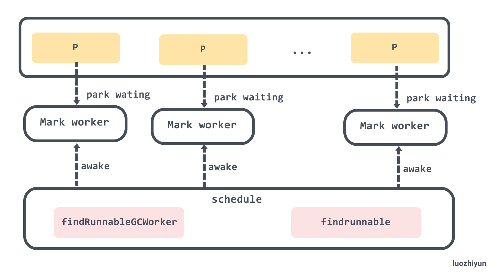

####  后台标记

在唤醒后，我们会根据 gcMarkWorkerMode 选择不同的标记执行策略，不同的执行策略都会调用 `runtime.gcDrain` :

```go
func gcBgMarkWorker(_p_ *p) {
	gp := getg()
	...
	for { 
		...
		// 检查P的gcBgMarkWorker是否和当前的G一致, 不一致时结束当前的任务
		if _p_.gcBgMarkWorker.ptr() != gp {
			break
		}
		// 禁止G被抢占
		park.m.set(acquirem())

		// 记录开始时间
		startTime := nanotime()
		_p_.gcMarkWorkerStartTime = startTime

		decnwait := atomic.Xadd(&work.nwait, -1)

		systemstack(func() { 
			// 设置G的状态为等待中这样它的栈可以被扫描
			casgstatus(gp, _Grunning, _Gwaiting)
			// 判断后台标记任务的模式
			switch _p_.gcMarkWorkerMode {
			default:
				throw("gcBgMarkWorker: unexpected gcMarkWorkerMode")
			case gcMarkWorkerDedicatedMode:
				// 这个模式下P应该专心执行标记
				gcDrain(&_p_.gcw, gcDrainUntilPreempt|gcDrainFlushBgCredit)
				if gp.preempt { 
					// 被抢占时把本地运行队列中的所有G都踢到全局运行队列
					lock(&sched.lock)
					for {
						gp, _ := runqget(_p_)
						if gp == nil {
							break
						}
						globrunqput(gp)
					}
					unlock(&sched.lock)
				}
				// 继续执行标记
				gcDrain(&_p_.gcw, gcDrainFlushBgCredit)
			case gcMarkWorkerFractionalMode:
				// 执行标记
				gcDrain(&_p_.gcw, gcDrainFractional|gcDrainUntilPreempt|gcDrainFlushBgCredit)
			case gcMarkWorkerIdleMode:
				// 执行标记, 直到被抢占或者达到一定的量
				gcDrain(&_p_.gcw, gcDrainIdle|gcDrainUntilPreempt|gcDrainFlushBgCredit)
			}
			// 恢复G的状态到运行中
			casgstatus(gp, _Gwaiting, _Grunning)
		}) 
		...
	}
}
```

在上面已经讲了不同的 Mark Worker Mode 的区别，不记得的同学可以往上翻一下。执行标记这部分主要在 switch 判断中，根据不同的模式传入不同的参数到 gcDrain 函数中执行。

需要注意的是，传入到 gcDrain 中的是一个 gcWork 的结构体，它相当于每个 P 的私有缓存空间，存放需要被扫描的对象，为垃圾收集器提供了生产和消费任务的抽象，，该结构体持有了两个重要的工作缓冲区 `wbuf1` 和 `wbuf2`：

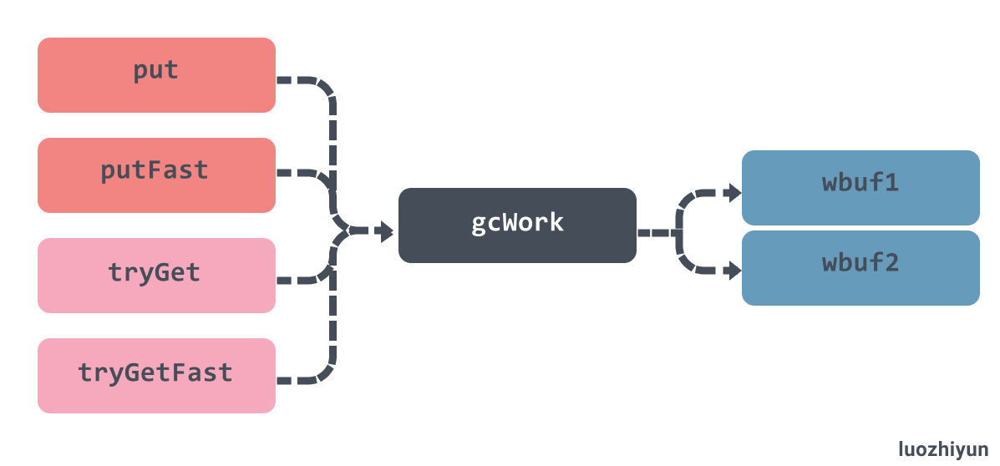

当我们向该结构体中增加或者删除对象时，它总会先操作 `wbuf1` 缓冲区，一旦 `wbuf1` 缓冲区空间不足或者没有对象，会触发缓冲区的切换，而当两个缓冲区空间都不足或者都为空时，会从全局的工作缓冲区中插入或者获取对象：

```go
func (w *gcWork) tryGet() uintptr {
	wbuf := w.wbuf1
	...
	// wbuf1缓冲区无数据时
	if wbuf.nobj == 0 {
		// wbuf1 与 wbuf2 进行对象互换
		w.wbuf1, w.wbuf2 = w.wbuf2, w.wbuf1
		wbuf = w.wbuf1
		if wbuf.nobj == 0 {
			owbuf := wbuf
			// 从 work 的 full 队列中获取
			wbuf = trygetfull()
			...
		}
	} 
	wbuf.nobj--
	return wbuf.obj[wbuf.nobj]
}
```

继续上面的 gcBgMarkWorker 方法，在标记完之后就要进行标记完成：

```go
func gcBgMarkWorker(_p_ *p) {
	gp := getg()
	...
	for { 
		...  
		// 累加所用时间
		duration := nanotime() - startTime
		switch _p_.gcMarkWorkerMode {
		case gcMarkWorkerDedicatedMode:
			atomic.Xaddint64(&gcController.dedicatedMarkTime, duration)
			atomic.Xaddint64(&gcController.dedicatedMarkWorkersNeeded, 1)
		case gcMarkWorkerFractionalMode:
			atomic.Xaddint64(&gcController.fractionalMarkTime, duration)
			atomic.Xaddint64(&_p_.gcFractionalMarkTime, duration)
		case gcMarkWorkerIdleMode:
			atomic.Xaddint64(&gcController.idleMarkTime, duration)
		}

		incnwait := atomic.Xadd(&work.nwait, +1)
 
		// 判断是否所有后台标记任务都完成, 并且没有更多的任务
		if incnwait == work.nproc && !gcMarkWorkAvailable(nil) { 
			// 取消和P的关联
			_p_.gcBgMarkWorker.set(nil)
			// 允许G被抢占
			releasem(park.m.ptr())
			// 准备进入完成标记阶段
			gcMarkDone()

			// 休眠之前会重新关联P
			// 因为上面允许被抢占, 到这里的时候可能就会变成其他P
			// 如果重新关联P失败则这个任务会结束
			park.m.set(acquirem())
			park.attach.set(_p_)
		}
	}
}
```

gcBgMarkWorker 会根据 incnwait 来检查是否是最后一个 worker，然后调用 gcMarkWorkAvailable 函数来校验 gcwork的任务和全局任务是否已经全部都处理完了，如果都确认没问题，那么调用 gcMarkDone 进入完成标记阶段。

#### 标记扫描

下面我们来看看 gcDrain：

```go
func gcDrain(gcw *gcWork, flags gcDrainFlags) {
	gp := getg().m.curg
	// 看到抢占标志时是否要返回
	preemptible := flags&gcDrainUntilPreempt != 0
	// 是否计算后台的扫描量来减少协助线程和唤醒等待中的G
	flushBgCredit := flags&gcDrainFlushBgCredit != 0
	// 是否只执行一定量的工作
	idle := flags&gcDrainIdle != 0
	// 记录初始的已扫描数量
	initScanWork := gcw.scanWork
 
	checkWork := int64(1<<63 - 1)
	var check func() bool
	if flags&(gcDrainIdle|gcDrainFractional) != 0 {
        // drainCheckThreshold 默认 100000
		checkWork = initScanWork + drainCheckThreshold
		if idle {
			check = pollWork
		} else if flags&gcDrainFractional != 0 {
			check = pollFractionalWorkerExit
		}
	} 
	// 如果根对象未扫描完, 则先扫描根对象
	if work.markrootNext < work.markrootJobs {
		// 一直循环直到被抢占或 STW
		for !(gp.preempt && (preemptible || atomic.Load(&sched.gcwaiting) != 0)) {
			// 从根对象扫描队列取出一个值
			job := atomic.Xadd(&work.markrootNext, +1) - 1
			if job >= work.markrootJobs {
				break
			}
			// 执行根对象扫描工作
			markroot(gcw, job)
			if check != nil && check() {
				goto done
			}
		}
	} 
	...
}
```

gcDrain 函数在开始的时候，会根据 flags 不同而选择不同的策略。

* gcDrainUntilPreempt：当 G 被抢占时返回；
* gcDrainIdle：调用 `runtime.pollWork`，当 P 上包含其他待执行 G 时返回；
* gcDrainFractional：调用 `runtime.pollFractionalWorkerExit`，当 CPU 的占用率超过 `fractionalUtilizationGoal` 的 20% 时返回；

设置完 check 变量后就可以执行 `runtime.markroot`进行根对象扫描，每次扫描完毕都会调用 check 函数校验是否应该退出标记任务，如果是那么就跳到 done 代码块中退出标记。

完成标记后会获取待执行的任务：

```go
func gcDrain(gcw *gcWork, flags gcDrainFlags) {
	...
	// 根对象已经在标记队列中, 消费标记队列
	// 一直循环直到被抢占或 STW
	for !(gp.preempt && (preemptible || atomic.Load(&sched.gcwaiting) != 0)) { 
		// 将本地一部分工作放回全局队列中
		if work.full == 0 {
			gcw.balance()
		}
		// 获取任务
		b := gcw.tryGetFast()
		if b == 0 {
			b = gcw.tryGet()
			if b == 0 { 
				wbBufFlush(nil, 0)
				b = gcw.tryGet()
			}
		}
		// 获取不到对象, 标记队列已为空, 跳出循环
		if b == 0 { 
			break
		}
		// 扫描获取到的对象
		scanobject(b, gcw)
 
		// 如果已经扫描了一定数量的对象，gcCreditSlack值是2000
		if gcw.scanWork >= gcCreditSlack {
			// 把扫描的对象数量添加到全局
			atomic.Xaddint64(&gcController.scanWork, gcw.scanWork)
			if flushBgCredit {
				// 记录这次扫描的内存字节数用于减少辅助标记的工作量
				gcFlushBgCredit(gcw.scanWork - initScanWork)
				initScanWork = 0
			}
			checkWork -= gcw.scanWork
			gcw.scanWork = 0

			if checkWork <= 0 {
				checkWork += drainCheckThreshold
				if check != nil && check() {
					break
				}
			}
		}
	}

done:
	// 把扫描的对象数量添加到全局
	if gcw.scanWork > 0 {
		atomic.Xaddint64(&gcController.scanWork, gcw.scanWork)
		if flushBgCredit {
			// 记录这次扫描的内存字节数用于减少辅助标记的工作量
			gcFlushBgCredit(gcw.scanWork - initScanWork)
		}
		gcw.scanWork = 0
	}
}
```

这里在获取缓存队列之前会调用 `runtime.gcWork.balance`，会将 gcWork 缓存一部分工作放回全局队列中，这个方法主要是用来平衡一下不同 P 的负载情况。

然后获取 gcWork 的缓存任务，并将获取到的任务交给 scanobject 执行，该函数会从传入的位置开始扫描，并会给找到的活跃对象上色。`runtime.gcFlushBgCredit` 会记录这次扫描的内存字节数用于减少辅助标记的工作量。

这里我来总结一下 gcWork 出入队情况。gcWork 的出队就是我们上面的 scanobject 方法，会获取到 gcWork 缓存对象并执行，但是同时如果找到活跃对象也会再次的入队到 gcWork 中。

除了 scanobject 以外，写屏障、根对象扫描和栈扫描都会向 gcWork 中增加额外的灰色对象等待处理。

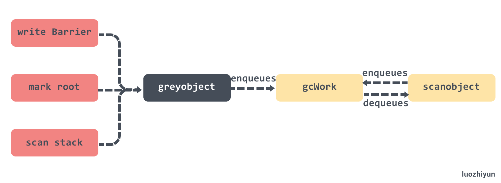

**根标记** 

```go
func markroot(gcw *gcWork, i uint32) { 
	baseFlushCache := uint32(fixedRootCount)
	baseData := baseFlushCache + uint32(work.nFlushCacheRoots)
	baseBSS := baseData + uint32(work.nDataRoots)
	baseSpans := baseBSS + uint32(work.nBSSRoots)
	baseStacks := baseSpans + uint32(work.nSpanRoots)
	end := baseStacks + uint32(work.nStackRoots)

 	switch {
		// 释放mcache中的所有span, 要求STW
	case baseFlushCache <= i && i < baseData:
		flushmcache(int(i - baseFlushCache)) 
		// 扫描可读写的全局变量
	case baseData <= i && i < baseBSS:
		for _, datap := range activeModules() {
			markrootBlock(datap.data, datap.edata-datap.data, datap.gcdatamask.bytedata, gcw, int(i-baseData))
		}
		// 扫描未初始化的全局变量	
	case baseBSS <= i && i < baseSpans:
		for _, datap := range activeModules() {
			markrootBlock(datap.bss, datap.ebss-datap.bss, datap.gcbssmask.bytedata, gcw, int(i-baseBSS))
		}
		// 扫描 finalizers 队列
	case i == fixedRootFinalizers:
		for fb := allfin; fb != nil; fb = fb.alllink {
			cnt := uintptr(atomic.Load(&fb.cnt))
			scanblock(uintptr(unsafe.Pointer(&fb.fin[0])), cnt*unsafe.Sizeof(fb.fin[0]), &finptrmask[0], gcw, nil)
		}
		// 释放已中止的 G 的栈
	case i == fixedRootFreeGStacks: 
		systemstack(markrootFreeGStacks)
		// 扫描 MSpan.specials
	case baseSpans <= i && i < baseStacks: 
		markrootSpans(gcw, int(i-baseSpans))
	// 扫描各个 G 的栈
	default: 
		// 获取需要扫描的 G
		var gp *g
		if baseStacks <= i && i < end {
			gp = allgs[i-baseStacks]
		} else {
			throw("markroot: bad index")
		}
 
		// 记录等待开始的时间
		status := readgstatus(gp) // We are not in a scan state
		if (status == _Gwaiting || status == _Gsyscall) && gp.waitsince == 0 {
			gp.waitsince = work.tstart
		}
 
		// 转交给g0进行扫描
		systemstack(func() { 
			userG := getg().m.curg
			selfScan := gp == userG && readgstatus(userG) == _Grunning
			// 如果是扫描自己的，则转换自己的g的状态
			if selfScan {
				casgstatus(userG, _Grunning, _Gwaiting)
				userG.waitreason = waitReasonGarbageCollectionScan
			}
 
			// 挂起 G，让对应的 G 停止运行
			stopped := suspendG(gp)
			if stopped.dead {
				gp.gcscandone = true
				return
			}
			if gp.gcscandone {
				throw("g already scanned")
			}
			// 扫描g的栈
			scanstack(gp, gcw)
			gp.gcscandone = true
			resumeG(stopped)

			if selfScan {
				casgstatus(userG, _Gwaiting, _Grunning)
			}
		})
	}
}
```

看到上面扫描的BSS和Date相关的内存块的时候我也是感到非常的疑惑，我们结合维基百科 Data segment https://en.wikipedia.org/wiki/Data_segment 的解释可以看到：

> The *.data* segment contains any global or static variables which have a pre-defined value and can be modified.
>
> The BSS segment, also known as *uninitialized data*, is usually adjacent to the data segment.

 Data 段通常是提前被初始化的全局变量，BSS 段通常是没有被初始化的数据。

因为涉及到太多缓存、数据段、栈内存的扫，很多位操作和指针操作，相关代码实现比较复杂。下面简单看看 scanblock，scanstack。

**scanblock**

```go
func scanblock(b0, n0 uintptr, ptrmask *uint8, gcw *gcWork, stk *stackScanState) {
	 
	b := b0
	n := n0
	// 遍历扫描的地址
	for i := uintptr(0); i < n; {
		// 找到bitmap中对应的byte
		bits := uint32(*addb(ptrmask, i/(sys.PtrSize*8)))
		if bits == 0 {
			i += sys.PtrSize * 8
			continue
		}
		// 遍历 byte
		for j := 0; j < 8 && i < n; j++ {
			// 如果该地址包含指针
			if bits&1 != 0 { 
				p := *(*uintptr)(unsafe.Pointer(b + i))
				if p != 0 {
					// 标记在该地址的对象存活, 并把它加到标记队列
					if obj, span, objIndex := findObject(p, b, i); obj != 0 {
						greyobject(obj, b, i, span, gcw, objIndex)
					} else if stk != nil && p >= stk.stack.lo && p < stk.stack.hi {
						stk.putPtr(p, false)
					}
				}
			}
			bits >>= 1
			i += sys.PtrSize
		}
	}
}
```

**scanstack**

```go
func scanstack(gp *g, gcw *gcWork) {
	...
	// 判断是否可以安全的进行 收缩栈
	if isShrinkStackSafe(gp) {
		// Shrink the stack if not much of it is being used.
		// 收缩栈
		shrinkstack(gp)
	} else {
		// Otherwise, shrink the stack at the next sync safe point.
		// 否则下次安全点再进行收缩栈
		gp.preemptShrink = true
	}

	var state stackScanState
	state.stack = gp.stack
  
	if gp.sched.ctxt != nil {
		scanblock(uintptr(unsafe.Pointer(&gp.sched.ctxt)), sys.PtrSize, &oneptrmask[0], gcw, &state)
	}
 
	scanframe := func(frame *stkframe, unused unsafe.Pointer) bool {
		scanframeworker(frame, &state, gcw)
		return true
	}
	// 枚举所有调用帧
	gentraceback(^uintptr(0), ^uintptr(0), 0, gp, 0, nil, 0x7fffffff, scanframe, nil, 0)
	// 枚举所有defer的调用帧
	tracebackdefers(gp, scanframe, nil)
	// Find and trace other pointers in defer records.
	// 扫描defer中的代码块
	for d := gp._defer; d != nil; d = d.link {
		...
	}
	if gp._panic != nil {
		state.putPtr(uintptr(unsafe.Pointer(gp._panic)), false)
	}

	// 扫描并找到所有可达的栈对象
	state.buildIndex()
	for {
		p, conservative := state.getPtr()
		if p == 0 {
			break
		}
		obj := state.findObject(p)
		if obj == nil {
			continue
		}
		t := obj.typ
		// 已被扫描过
		if t == nil {
			continue
		}
		// 标记扫描
		obj.setType(nil) 
		gcdata := t.gcdata
		var s *mspan
		if t.kind&kindGCProg != 0 {
			s = materializeGCProg(t.ptrdata, gcdata)
			gcdata = (*byte)(unsafe.Pointer(s.startAddr))
		}

		b := state.stack.lo + uintptr(obj.off)
		if conservative {
			scanConservative(b, t.ptrdata, gcdata, gcw, &state)
		} else {
			scanblock(b, t.ptrdata, gcdata, gcw, &state)
		}

		if s != nil {
			dematerializeGCProg(s)
		}
	}
	
	for state.head != nil {
		x := state.head
		state.head = x.next
		
		x.nobj = 0
		putempty((*workbuf)(unsafe.Pointer(x)))
	}
	if state.buf != nil || state.cbuf != nil || state.freeBuf != nil {
		throw("remaining pointer buffers")
	}
}
```

**greyobject**

```go
func greyobject(obj, base, off uintptr, span *mspan, gcw *gcWork, objIndex uintptr) {
	// obj should be start of allocation, and so must be at least pointer-aligned.
	if obj&(sys.PtrSize-1) != 0 {
		throw("greyobject: obj not pointer-aligned")
	}
	mbits := span.markBitsForIndex(objIndex)
	// 检查是否所有可到达的对象都被正确标记的机制, 仅除错使用
	if useCheckmark {
		...
	} else {
		...
		// 被标记过了直接返回
		if mbits.isMarked() {
			return
		}
		// 设置标记
		mbits.setMarked()

		// 标记 span
		arena, pageIdx, pageMask := pageIndexOf(span.base())
		if arena.pageMarks[pageIdx]&pageMask == 0 {
			atomic.Or8(&arena.pageMarks[pageIdx], pageMask)
		}

		// span的类型是noscan, 则不需要把对象放入标记队列
		if span.spanclass.noscan() {
			gcw.bytesMarked += uint64(span.elemsize)
			return
		}
	}

	// 尝试存入gcwork的缓存中，或全局队列中
	if !gcw.putFast(obj) {
		gcw.put(obj)
	}
}
```

**对象扫描**  

```go
func scanobject(b uintptr, gcw *gcWork) { 
	// 获取 b 的 heapBits 对象
	hbits := heapBitsForAddr(b)
	// 获取 span
	s := spanOfUnchecked(b)
	// span 对应的对象大小
	n := s.elemsize
	if n == 0 {
		throw("scanobject n == 0")
	}
	// 每次最大只扫描128KB
	if n > maxObletBytes {
		// Large object. Break into oblets for better
		// parallelism and lower latency.
		if b == s.base() { 
			if s.spanclass.noscan() {
				// Bypass the whole scan.
				gcw.bytesMarked += uint64(n)
				return
			}
			// 把多于128KB的对象重新放回gcworker中，下次再扫描
			for oblet := b + maxObletBytes; oblet < s.base()+s.elemsize; oblet += maxObletBytes {
				if !gcw.putFast(oblet) {
					gcw.put(oblet)
				}
			}
		}

		n = s.base() + s.elemsize - b
		if n > maxObletBytes {
			n = maxObletBytes
		}
	}

	var i uintptr
	for i = 0; i < n; i += sys.PtrSize {
		// 获取对应的bit
		// Find bits for this word.
		if i != 0 { 
			hbits = hbits.next()
		} 
		bits := hbits.bits() 
		// 检查scan bit判断是否继续扫描
		if i != 1*sys.PtrSize && bits&bitScan == 0 {
			break // no more pointers in this object
		}
		// 如果不是指针则继续
		if bits&bitPointer == 0 {
			continue // not a pointer
		}
 
		// 取出指针的值
		obj := *(*uintptr)(unsafe.Pointer(b + i))
 
		if obj != 0 && obj-b >= n { 
			// 根据地址值去堆中查找对象
			if obj, span, objIndex := findObject(obj, b, i); obj != 0 {
				// 调用 greyobject 标记对象并把对象放到标记队列中
				greyobject(obj, b, i, span, gcw, objIndex)
			}
		}
	}
	gcw.bytesMarked += uint64(n)
	gcw.scanWork += int64(i)
}
```

#### 辅助标记 mutator  assists

在分析的一开始也提到了一些关于 mutator  assists 的作用，主要是为了防止 heap 增速太快, 在GC 执行的过程中如果同时运行的 G 分配了内存, 那么这个 G 会被要求辅助 GC 做一部分的工作，它遵循一条非常简单并且朴实的原则，**分配多少内存就需要完成多少标记任务**。

mutator  assists 的入口是在 `go\src\runtime\malloc.go` 的mallocgc 函数中：

```go
func mallocgc(size uintptr, typ *_type, needzero bool) unsafe.Pointer {
	...
	var assistG *g
	if gcBlackenEnabled != 0 {
		assistG = getg()
		if assistG.m.curg != nil {
			assistG = assistG.m.curg
		}
        // 减去内存值
		assistG.gcAssistBytes -= int64(size)

		if assistG.gcAssistBytes < 0 {
            // This G is in debt.
			gcAssistAlloc(assistG)
		}
	}
	...
	return x
}
```

mallocgc 在分配内存的时候每次都会检查 gcAssistBytes 字段是否为负值，这个字段存储了当前 Goroutine 辅助标记的对象字节数。如果为负数，那么会调用 gcAssistAlloc 从全局信用 bgScanCredit 中获取：

```go
func gcAssistAlloc(gp *g) {
	 ...
retry:  
	// 计算需要完成的标记任务数量
	debtBytes := -gp.gcAssistBytes
	scanWork := int64(gcController.assistWorkPerByte * float64(debtBytes))
	if scanWork < gcOverAssistWork {
		scanWork = gcOverAssistWork
		debtBytes = int64(gcController.assistBytesPerWork * float64(scanWork))
	}

	// 获取全局辅助标记的字节数
	bgScanCredit := atomic.Loadint64(&gcController.bgScanCredit)
	stolen := int64(0)
	if bgScanCredit > 0 {
		if bgScanCredit < scanWork {
			stolen = bgScanCredit
			gp.gcAssistBytes += 1 + int64(gcController.assistBytesPerWork*float64(stolen))
		} else {
			stolen = scanWork
			gp.gcAssistBytes += debtBytes
		}
		// 全局信用扣除stolen点数
		atomic.Xaddint64(&gcController.bgScanCredit, -stolen) 
		scanWork -= stolen 
		// 减到 0 说明 bgScanCredit 是由足够的信用可以处理 scanWork
		if scanWork == 0 { 
			return
		}
	} 
	// 到这里说明 bgScanCredit 小于 scanWork
	// 需要调用 gcDrainN 完成指定数量的标记任务并返回
	systemstack(func() {
		// 执行标记任务
		gcAssistAlloc1(gp, scanWork) 
	})

	completed := gp.param != nil
	gp.param = nil
	if completed {
		gcMarkDone()
	}

	if gp.gcAssistBytes < 0 { 
		if gp.preempt {
			Gosched()
			goto retry
		}
		// 如果全局信用仍然不足将当前 Goroutine 陷入休眠 
		// 加入全局的辅助标记队列并等待后台标记任务的唤醒
		if !gcParkAssist() {
			goto retry
		} 
	}  
}
```

如果全局信用仍然不足将当前 Goroutine 陷入休眠 ，加入全局的辅助标记队列并等待后台标记任务的唤醒。

扫描内存时调用 gcFlushBgCredit 会负责唤醒辅助标记 Goroutine ：

```go
func gcFlushBgCredit(scanWork int64) {
	// 辅助队列中不存在等待的 Goroutine 
	if work.assistQueue.q.empty() {
		// 当前的信用会直接加到全局信用 bgScanCredit
		atomic.Xaddint64(&gcController.bgScanCredit, scanWork)
		return
	}

	scanBytes := int64(float64(scanWork) * gcController.assistBytesPerWork)

	lock(&work.assistQueue.lock)
	// 如果辅助队列不为空
	for !work.assistQueue.q.empty() && scanBytes > 0 {
		gp := work.assistQueue.q.pop()
		// 唤醒 Goroutine
		if scanBytes+gp.gcAssistBytes >= 0 { 
			scanBytes += gp.gcAssistBytes
			gp.gcAssistBytes = 0 
			ready(gp, 0, false)
		} else { 
			gp.gcAssistBytes += scanBytes
			scanBytes = 0 
			work.assistQueue.q.pushBack(gp)
			break
		}
	}
	// 标记任务量仍然有剩余，这些标记任务都会加入全局信用
	if scanBytes > 0 { 
		scanWork = int64(float64(scanBytes) * gcController.assistWorkPerByte)
		atomic.Xaddint64(&gcController.bgScanCredit, scanWork)
	}
	unlock(&work.assistQueue.lock)
}
```

gcFlushBgCredit 会获取睡眠的辅助队列 Goroutine ，如果当前信用足够，那么就会将辅助 Goroutine 唤醒，如果还有剩余的，那么就会将这些标记任务都会加入全局信用。

总体来说是如下的一套机制：

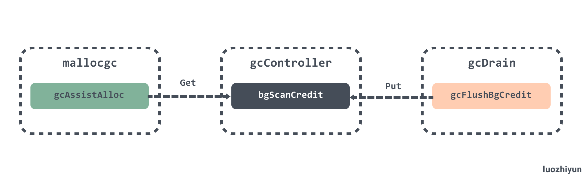

### 完成标记

上面我们在 gcBgMarkWorker 中分析了，在标记完成后会调用 gcMarkDone 执行标记完成操作。

```go
func gcMarkDone() {
	
	semacquire(&work.markDoneSema)

top: 
	// 再次检查任务是否已执行完毕
	if !(gcphase == _GCmark && work.nwait == work.nproc && !gcMarkWorkAvailable(nil)) {
		semrelease(&work.markDoneSema)
		return
	}
 
	semacquire(&worldsema)
 
	gcMarkDoneFlushed = 0 
	systemstack(func() {
		gp := getg().m.curg 
		casgstatus(gp, _Grunning, _Gwaiting)
		// 遍历所有的 P
		forEachP(func(_p_ *p) {
			// 将 P 对应的write barrier buffer 中的对象加入到 gcWork 中
			wbBufFlush1(_p_)
			// 将 gcWork 中的缓存对象加入到全局队列中
			_p_.gcw.dispose()
			// 表示 gcWork 的数据都已迁移到 全局队列中
			if _p_.gcw.flushedWork {
				atomic.Xadd(&gcMarkDoneFlushed, 1)
				_p_.gcw.flushedWork = false
			} else if debugCachedWork {
				...
			}
			...
		})
		casgstatus(gp, _Gwaiting, _Grunning)
	})

	if gcMarkDoneFlushed != 0 {
		if debugCachedWork {
			// Release paused gcWorks.
			atomic.Xadd(&gcWorkPauseGen, 1)
		}
		semrelease(&worldsema)
		goto top
	}
	// 记录完成标记阶段开始的时间和STW开始的时间
	now := nanotime()
	work.tMarkTerm = now
	work.pauseStart = now
	// 禁止G被抢占
	getg().m.preemptoff = "gcing" 
	// STW
	systemstack(stopTheWorldWithSema) 
	...   
	// 禁止辅助GC和后台标记任务的运行
	atomic.Store(&gcBlackenEnabled, 0) 
	// 唤醒所有因为辅助GC而休眠的G
	gcWakeAllAssists() 
	semrelease(&work.markDoneSema) 
	schedEnableUser(true) 
	// 计算下一次触发gc需要的heap大小
	nextTriggerRatio := gcController.endCycle() 
	// 执行标记终止
	gcMarkTermination(nextTriggerRatio)
}
```

gcMarkDone 会调用 forEachP 函数遍历所有的 P ，并将对应 P 中的 gcWork 中的任务移动到全局队列中，如果 gcWork 中有任务那么会将 gcMarkDoneFlushed 加1，遍历完所有的 P 之后会判断如果 gcMarkDoneFlushed 不为0，那么跳转到 top 标记位继续循环执行，直到本地队列中没有任务为止。

接下来会关将 gcBlackenEnabled 设置为0，表示关闭辅助标记协程以及后台标记；唤醒被阻塞的辅助标记协程；调用 schedEnableUser 恢复用户 Goroutine 的调度；需要注意的是，目前处在 STW 阶段，所以被唤醒的 Goroutine 不会立马执行，会等到 STW 结束后才执行。

最后调用 gcMarkTermination 执行标记终止。

### 标记终止

```go
func gcMarkTermination(nextTriggerRatio float64) { 
	// 禁止辅助GC和后台标记任务的运行
	atomic.Store(&gcBlackenEnabled, 0)
	// 将 GC 阶段切换到 _GCmarktermination
	setGCPhase(_GCmarktermination)
	work.heap1 = memstats.heap_live
	// 记录开始时间
	startTime := nanotime()
	mp := acquirem()
	mp.preemptoff = "gcing"
	_g_ := getg()
	_g_.m.traceback = 2
	gp := _g_.m.curg
	// 设置 G 的状态为等待中
	casgstatus(gp, _Grunning, _Gwaiting)
	gp.waitreason = waitReasonGarbageCollection 
	// 切换到 g0 运行
	systemstack(func() {
		// 开始 STW 中的标记
		gcMark(startTime) 
	})

	systemstack(func() {
		work.heap2 = work.bytesMarked
		...
		// 设置当前GC阶段到关闭, 并禁用写屏障
		setGCPhase(_GCoff)
		// 唤醒后台清扫任务
		gcSweep(work.mode)
	}) 
	_g_.m.traceback = 0
	casgstatus(gp, _Gwaiting, _Grunning) 
	// 统计以及重置清扫状态相关代码 
	... 
	// 统计执行GC的次数然后唤醒等待清扫的G
	lock(&work.sweepWaiters.lock)
	memstats.numgc++
	injectglist(&work.sweepWaiters.list)
	unlock(&work.sweepWaiters.lock)
 	// 性能统计 
	mProf_NextCycle()
	// 重新  start The World
	systemstack(func() { startTheWorldWithSema(true) })
	// 性能统计 
	mProf_Flush() 
	// 移动标记队列使用的 workbuf 到 free list, 使得它们可以被回收
	prepareFreeWorkbufs()
	// 释放未使用的栈
	systemstack(freeStackSpans) 
	// 确保每个 P 的 mcache 都被 flush 
	systemstack(func() {
		forEachP(func(_p_ *p) {
			_p_.mcache.prepareForSweep()
		})
	}) 
	...
	semrelease(&worldsema)
	semrelease(&gcsema) 
	releasem(mp)
	mp = nil 
}
```

gcMarkTermination 主要是做一些确认工作以及统计工作。进入到这个方法首先会将 GC 阶段设置到 `_GCmarktermination`，然后调用 gcMark 方法确认是否所有的 GC 标记工作已经完成。接着将 GC 阶段设置到 `_GCoff`，调用 gcSweep 开始清理工作。接着就是省略的数据统计相关的代码，包括正在使用的内存大小、GC 时间、CPU 利用率等。最后做一些确认工作，如确保每个 P 的 mcache 都被 flush ，栈都释放了，workbuf 都转移到 free list 以便回收等。

### 后台清扫

```go
func gcSweep(mode gcMode) {
	if gcphase != _GCoff {
		throw("gcSweep being done but phase is not GCoff")
	}
	lock(&mheap_.lock)
	mheap_.sweepgen += 2
	// 重置标记位
	mheap_.sweepdone = 0
	...
	mheap_.pagesSwept = 0
	mheap_.sweepArenas = mheap_.allArenas
	mheap_.reclaimIndex = 0
	mheap_.reclaimCredit = 0
	unlock(&mheap_.lock)

	if go115NewMCentralImpl {
		sweep.centralIndex.clear()
	}
	// 如果非并行GC 
	if !_ConcurrentSweep || mode == gcForceBlockMode {
		...
		return
	}

	// 唤醒后台清扫任务
	lock(&sweep.lock)
	if sweep.parked {
		sweep.parked = false
		ready(sweep.g, 0, true)
	}
	unlock(&sweep.lock)
}
```

gcSweep 主要做的是重置清理阶段的相关状态，然后唤醒 sweep 清扫 Goroutine 。后台清扫任务是在初始化 main Goroutine 的时候调用 bgsweep 设置的：

**gcenable**

```go
func gcenable() {
	// Kick off sweeping and scavenging.
	c := make(chan int, 2)
    // 设置异步清扫
	go bgsweep(c) 
	<-c 
}
```

**bgsweep**

```go
func bgsweep(c chan int) {
	// 设置清扫 Goroutine 
	sweep.g = getg()
	// 等待唤醒 
	lockInit(&sweep.lock, lockRankSweep)
	lock(&sweep.lock)
	sweep.parked = true
	c <- 1
	goparkunlock(&sweep.lock, waitReasonGCSweepWait, traceEvGoBlock, 1)

	// 循环清扫
	for {
		// 清扫一个span, 然后进入调度
		for sweepone() != ^uintptr(0) {
			sweep.nbgsweep++
			Gosched()
		}
		// 释放一些未使用的标记队列缓冲区到heap
		for freeSomeWbufs(true) {
			Gosched()
		}
		lock(&sweep.lock)
		// 判断 sweepdone 标志位是否等于 0
		// 如果清扫未完成则继续循环
		if !isSweepDone() { 
			unlock(&sweep.lock)
			continue
		}
		// 否则让后台清扫任务进入休眠
		sweep.parked = true
		goparkunlock(&sweep.lock, waitReasonGCSweepWait, traceEvGoBlock, 1)
	}
}
```

bgsweep 的清扫任务实际上是由 sweepone 进行的，它会在堆内存中查找待清理的 span，并且会返回清扫了多少 page 到 heap 中，返回 `^uintptr(0)`表示没有东西需要清扫：

```go
func sweepone() uintptr {
	_g_ := getg()
	sweepRatio := mheap_.sweepPagesPerByte // For debugging 
	_g_.m.locks++
	// 校验是否清扫已完成
	if atomic.Load(&mheap_.sweepdone) != 0 {
		_g_.m.locks--
		return ^uintptr(0)
	}
	atomic.Xadd(&mheap_.sweepers, +1)

	//查找一个 span 并释放
	var s *mspan
	sg := mheap_.sweepgen
	for {
		if go115NewMCentralImpl {
			s = mheap_.nextSpanForSweep()
		} else {
			s = mheap_.sweepSpans[1-sg/2%2].pop()
		}
		if s == nil {
			atomic.Store(&mheap_.sweepdone, 1)
			break
		}
		if state := s.state.get(); state != mSpanInUse { 
			continue
		}
		// span 的 sweepgen 等于 mheap.sweepgen - 2，那么意味着当前单元需要清理
		if s.sweepgen == sg-2 && atomic.Cas(&s.sweepgen, sg-2, sg-1) {
			break
		}
	}

	// 清理 span
	npages := ^uintptr(0)
	if s != nil {
		npages = s.npages
		// 回收内存
		if s.sweep(false) { 
			atomic.Xadduintptr(&mheap_.reclaimCredit, npages)
		} else {
			 
			npages = 0
		}
	} 
	_g_.m.locks--
	return npages
}
```

在查找 span 的时候会通过 state 状态以及 sweepgen 是否等于 `mheap.sweepgen - 2` 来判断是否需要清扫该 span。最终会通过 `mspan.sweep` 来进行清扫。

下面简单看一下 sweep的实现：

```go
func (s *mspan) sweep(preserve bool) bool {
	if !go115NewMCentralImpl {
		return s.oldSweep(preserve)
	} 
	_g_ := getg() 
	sweepgen := mheap_.sweepgen
	// 统计已清理的页数
	atomic.Xadd64(&mheap_.pagesSwept, int64(s.npages))

	spc := s.spanclass
	size := s.elemsize

	c := _g_.m.p.ptr().mcache  
	...
	// 计算释放的对象数量 
	nalloc := uint16(s.countAlloc())
	nfreed := s.allocCount - nalloc
	 
	s.allocCount = nalloc
	s.freeindex = 0 // reset allocation index to start of span.
	  
	s.allocBits = s.gcmarkBits
	s.gcmarkBits = newMarkBits(s.nelems)
 
	s.refillAllocCache(0) 
	// 设置 span.sweepgen 和 mheap.sweepgen 相等
	atomic.Store(&s.sweepgen, sweepgen)

	if spc.sizeclass() != 0 {
		// 处理小对象的回收
		// Handle spans for small objects.
		if nfreed > 0 { 
			s.needzero = 1
			c.local_nsmallfree[spc.sizeclass()] += uintptr(nfreed)
		}
		if !preserve { 
			if nalloc == 0 { 
				// 直接释放 span 到堆中
				mheap_.freeSpan(s)
				return true
			} 
			// 将 span 释放到 mcentral 中
			if uintptr(nalloc) == s.nelems {
				mheap_.central[spc].mcentral.fullSwept(sweepgen).push(s)
			} else {
				mheap_.central[spc].mcentral.partialSwept(sweepgen).push(s)
			}
		}
	} else if !preserve { 
		// 处理大对象的回收
		if nfreed != 0 {
			// Free large object span to heap. 
			if debug.efence > 0 {
				s.limit = 0 // prevent mlookup from finding this span
				sysFault(unsafe.Pointer(s.base()), size)
			} else {
				// 直接释放 span 到堆中
				mheap_.freeSpan(s)
			}
			c.local_nlargefree++
			c.local_largefree += size
			return true
		}

		// Add a large span directly onto the full+swept list.
		mheap_.central[spc].mcentral.fullSwept(sweepgen).push(s)
	}
	return false
}
```

## 总结

以前我在使用 java 的时候只是粗浅的了解了一下标记清除算法，这是第一次去深入理解 Go 语言的三色算法给我带来的收益非常的巨大。这篇文章过了很久才写出来是因为这篇文章和内存分配、循环调度的关联关系非常的大，所以必须要弄懂前两篇才能理解 GC 的原理。

限于我自己工作与学习时间的关系，没有很清楚的讲解好根标记相关的代码，如果自己感兴趣的话不妨可以从 gcBgMarkWorker 来研究一下。

## Reference

Garbage Collection In Go https://www.ardanlabs.com/blog/2018/12/garbage-collection-in-go-part1-semantics.html

Visualizing Garbage Collection Algorithms https://spin.atomicobject.com/2014/09/03/visualizing-garbage-collection-algorithms/

Memory barrier https://en.wikipedia.org/wiki/Memory_barrier

Proposal: Eliminate STW stack re-scanning https://go.googlesource.com/proposal/+/master/design/17503-eliminate-rescan.md

Uniprocessor Garbage Collection Techniques https://www.cs.cmu.edu/~fp/courses/15411-f14/misc/wilson94-gc.pdf

https://golang.design/under-the-hood/zh-cn/part2runtime/ch08gc/barrier/

Golang源码探索(三) GC的实现原理  https://www.cnblogs.com/zkweb/p/7880099.html

Data segment https://en.wikipedia.org/wiki/Data_segment

 Real-time garbage collection on general-purpose machines  http://www.yuasa.kuis.kyoto-u.ac.jp/~yuasa/YuasasSnapshot.pdf

On-the-Fly Garbage Collection: An Exercise in Cooperation https://lamport.azurewebsites.net/pubs/garbage.pdf

Write Barrier Elision for Concurrent Garbage Collectors https://www.semanticscholar.org/paper/Write-barrier-elision-for-concurrent-garbage-Vechev-Bacon/c046c3388ee506028f0e68f8636b3cd22420ddc0

Garbage-First Garbage Collection  http://citeseerx.ist.psu.edu/viewdoc/download?doi=10.1.1.63.6386&rep=rep1&type=pdf

https://github.com/golang-design/under-the-hood/issues/20

garbage-collection https://github.com/ardanlabs/gotraining/tree/master/reading#garbage-collection 
