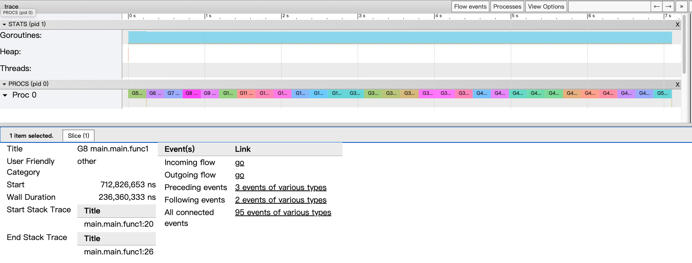
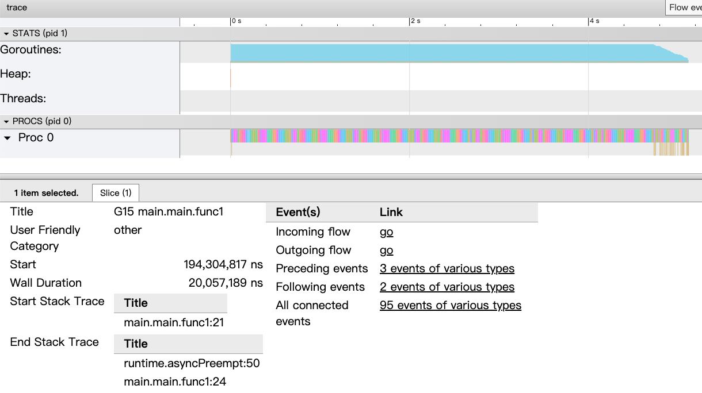
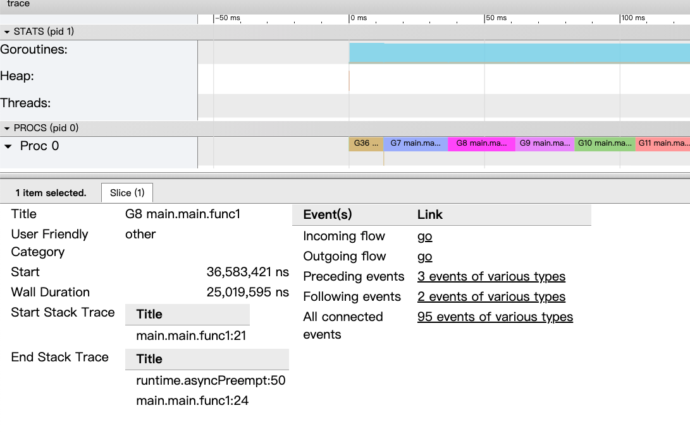
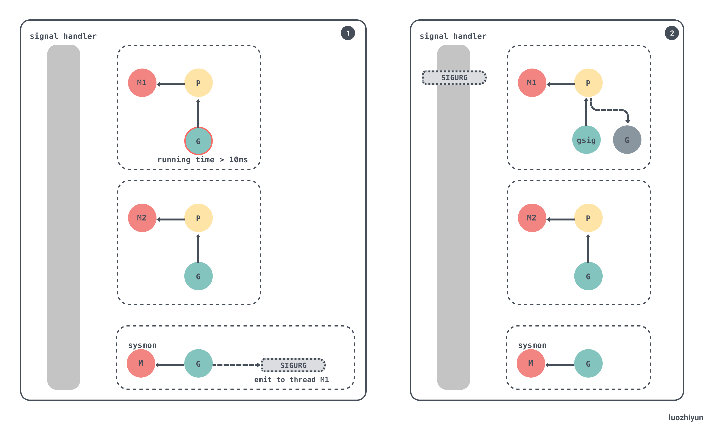
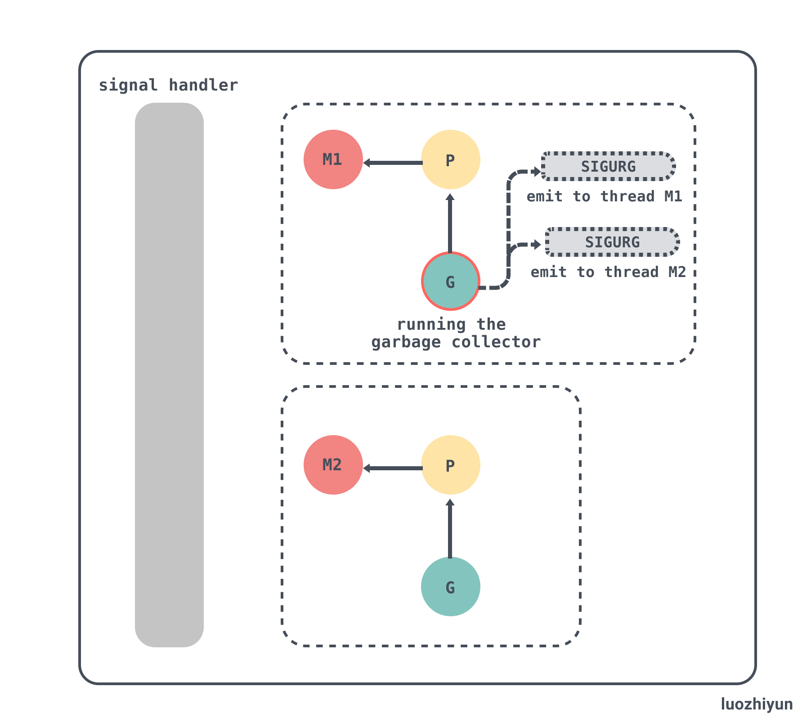
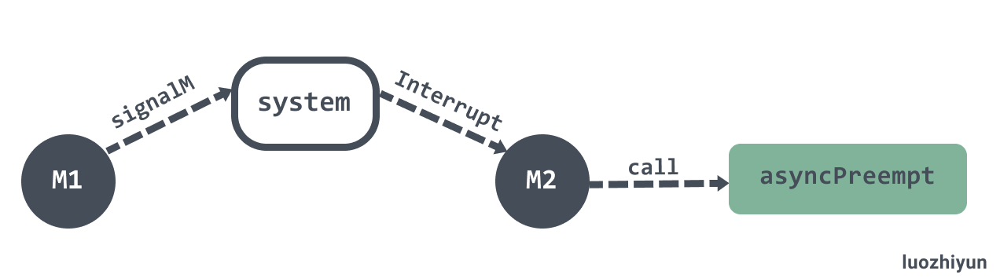

# 从源码剖析Go语言基于信号式抢占式调度

> 转载请声明出处哦~，本篇文章发布于luozhiyun的博客：https://www.luozhiyun.com
>
> 本文使用的go的源码15.7


## 介绍

在 Go 的 1.14 版本之前抢占试调度都是基于协作的，需要自己主动的让出执行，但是这样是无法处理一些无法被抢占的边缘情况。例如：for 循环或者垃圾回收长时间占用线程，这些问题中的一部分直到 1.14 才被基于信号的抢占式调度解决。

下面我们通过一个例子来验证一下1.14 版本和 1.13 版本之间的抢占差异：

```go
package main

import (
	"fmt"
	"os"
	"runtime"
	"runtime/trace"
	"sync"
)

func main() {
	runtime.GOMAXPROCS(1)
	f, _ := os.Create("trace.output")
	defer f.Close()
	_ = trace.Start(f)
	defer trace.Stop()
	var wg sync.WaitGroup
	for i := 0; i < 30; i++ {
		wg.Add(1)
		go func() {
			defer wg.Done()
			t := 0
			for i:=0;i<1e8;i++ {
				t+=2
			}
			fmt.Println("total:", t)
		}()
	}
	wg.Wait()
}
```

这个例子中会通过 go trace 来进行执行过程的调用跟踪。在代码中指定 `runtime.GOMAXPROCS(1)`设置最大的可同时使用的  CPU  核数为1，只用一个 P（处理器），这样就确保是单处理器的场景。然后调用一个 for 循环开启 30 个 goroutines 来执行 func 函数，这是一个纯计算且耗时的函数，防止 goroutines 空闲让出执行。

下面我们编译程序分析 trace 输出：

```
$ go build -gcflags "-N -l" main.go 
-N表示禁用优化
-l禁用内联

$ ./main 
```

然后我们获取到 trace.output 文件后进行可视化展示：

```
$ go tool trace -http=":6060" ./trace.output
```

### Go1.13 trace 分析



从上面的这个图可以看出：

1. 因为我们限定了只有一个 P，所以在 PROCS 这一栏里面只有一个 Proc0；
2. 我们在 for 循环里面启动了 30 个 goroutines ，所以我们可以数一下 Proc0 里面的颜色框框，刚好30 个；
3. 30 个 goroutines 在 Proc0 里面是串行执行的，一个执行完再执行另一个，没有进行抢占；
4. 随便点击一个 goroutines 的详情栏可以看到 Wall Duration 为 0.23s 左右，表示这个 goroutines 持续执行了 0.23s，总共 10 个 goroutines 执行时间是 7s 左右；
5. 切入调用栈 Start Stack Trace 是 main.main.func1:20，在代码上面是 func 函数执行头： `go func() `；
6. 切走调用栈 End Stack Trace 是 main.main.func1:26，在代码上是 func 函数最后执行打印：`fmt.Println("total:", t)`；

从上面的 trace 分析可以知道，Go 的协作式调度对 calcSum 函数是毫无作用的，一旦执行开始，只能等执行结束。每个 goroutine 耗费了 0.23s 这么长的时间，也无法抢占它的执行权。

### Go 1.14 以上 trace 分析



在 Go 1.14 之后引入了基于信号的抢占式调度，从上面的图可以看到 Proc0 这一栏中密密麻麻都是 goroutines 在切换时的调用情况，不会再出现 goroutines 一旦执行开始，只能等执行结束这种情况。

上面跑动的时间是 4s 左右这个情况可以忽略，因为我是在两台配置不同的机器上跑的（主要是我嫌麻烦要找两台一样的机器）。

下面我们拉近了看一下明细情况：



通过这个明细可以看出：

1. 这个 goroutine 运行了 0.025s 就让出执行了；
2. 切入调用栈 Start Stack Trace 是 main.main.func1:21，和上面一样；
3. 切走调用栈 End Stack Trace 是 runtime.asyncPreempt:50 ，这个函数是收到抢占信号时执行的函数，从这个地方也能明确的知道，被异步抢占了；

## 分析

### 抢占信号的安装

runtime/signal_unix.go

程序启动时，在`runtime.sighandler`中注册 `SIGURG` 信号的处理函数`runtime.doSigPreempt`。

**initsig**

```go
func initsig(preinit bool) {
	// 预初始化
	if !preinit { 
		signalsOK = true
	} 
	//遍历信号数组
	for i := uint32(0); i < _NSIG; i++ {
		t := &sigtable[i]
		//略过信号：SIGKILL、SIGSTOP、SIGTSTP、SIGCONT、SIGTTIN、SIGTTOU
		if t.flags == 0 || t.flags&_SigDefault != 0 {
			continue
		} 
		...  
		setsig(i, funcPC(sighandler))
	}
}
 

```

在 initsig 函数里面会遍历所有的信号量，然后调用 setsig 函数进行注册。我们可以查看 sigtable 这个全局变量看看有什么信息：

```go
var sigtable = [...]sigTabT{
	/* 0 */ {0, "SIGNONE: no trap"},
	/* 1 */ {_SigNotify + _SigKill, "SIGHUP: terminal line hangup"},
	/* 2 */ {_SigNotify + _SigKill, "SIGINT: interrupt"},
	/* 3 */ {_SigNotify + _SigThrow, "SIGQUIT: quit"},
	/* 4 */ {_SigThrow + _SigUnblock, "SIGILL: illegal instruction"},
	/* 5 */ {_SigThrow + _SigUnblock, "SIGTRAP: trace trap"},
	/* 6 */ {_SigNotify + _SigThrow, "SIGABRT: abort"},
	/* 7 */ {_SigPanic + _SigUnblock, "SIGBUS: bus error"},
	/* 8 */ {_SigPanic + _SigUnblock, "SIGFPE: floating-point exception"},
	/* 9 */ {0, "SIGKILL: kill"},
	/* 10 */ {_SigNotify, "SIGUSR1: user-defined signal 1"},
	/* 11 */ {_SigPanic + _SigUnblock, "SIGSEGV: segmentation violation"},
	/* 12 */ {_SigNotify, "SIGUSR2: user-defined signal 2"},
	/* 13 */ {_SigNotify, "SIGPIPE: write to broken pipe"},
	/* 14 */ {_SigNotify, "SIGALRM: alarm clock"},
	/* 15 */ {_SigNotify + _SigKill, "SIGTERM: termination"},
	/* 16 */ {_SigThrow + _SigUnblock, "SIGSTKFLT: stack fault"},
	/* 17 */ {_SigNotify + _SigUnblock + _SigIgn, "SIGCHLD: child status has changed"},
	/* 18 */ {_SigNotify + _SigDefault + _SigIgn, "SIGCONT: continue"},
	/* 19 */ {0, "SIGSTOP: stop, unblockable"},
	/* 20 */ {_SigNotify + _SigDefault + _SigIgn, "SIGTSTP: keyboard stop"},
	/* 21 */ {_SigNotify + _SigDefault + _SigIgn, "SIGTTIN: background read from tty"},
	/* 22 */ {_SigNotify + _SigDefault + _SigIgn, "SIGTTOU: background write to tty"},
  				 
	/* 23 */ {_SigNotify + _SigIgn, "SIGURG: urgent condition on socket"},
	/* 24 */ {_SigNotify, "SIGXCPU: cpu limit exceeded"},
	/* 25 */ {_SigNotify, "SIGXFSZ: file size limit exceeded"},
	/* 26 */ {_SigNotify, "SIGVTALRM: virtual alarm clock"},
	/* 27 */ {_SigNotify + _SigUnblock, "SIGPROF: profiling alarm clock"},
	/* 28 */ {_SigNotify + _SigIgn, "SIGWINCH: window size change"},
	/* 29 */ {_SigNotify, "SIGIO: i/o now possible"},
	/* 30 */ {_SigNotify, "SIGPWR: power failure restart"},
	/* 31 */ {_SigThrow, "SIGSYS: bad system call"},
	/* 32 */ {_SigSetStack + _SigUnblock, "signal 32"}, /* SIGCANCEL; see issue 6997 */
	/* 33 */ {_SigSetStack + _SigUnblock, "signal 33"}, /* SIGSETXID; see issues 3871, 9400, 12498 */
	...
}
```

具体的信号含义可以看这个介绍：Unix信号 https://zh.wikipedia.org/wiki/Unix%E4%BF%A1%E5%8F%B7。需要注意的是，抢占信号在这里是 ` _SigNotify + _SigIgn`  如下：

```
{_SigNotify + _SigIgn, "SIGURG: urgent condition on socket"}
```

下面我们看一下 setsig 函数，这个函数是在 `runtime/os_linux.go`文件里面：

**setsig**

```go
func setsig(i uint32, fn uintptr) {
	var sa sigactiont
	sa.sa_flags = _SA_SIGINFO | _SA_ONSTACK | _SA_RESTORER | _SA_RESTART
	sigfillset(&sa.sa_mask)
	...
	if fn == funcPC(sighandler) {
        // CGO 相关
		if iscgo {
			fn = funcPC(cgoSigtramp)
		} else {
            // 替换为调用 sigtramp
			fn = funcPC(sigtramp)
		}
	}
	sa.sa_handler = fn
	sigaction(i, &sa, nil)
}
```

这里需要注意的是，当 fn 等于 sighandler 的时候，调用的函数会被替换成 sigtramp。sigaction 函数在 Linux 下会调用系统调用函数 sys_signal 以及 sys_rt_sigaction 实现安装信号。

### 执行抢占信号

到了这里是信号发生的时候进行信号的处理，原本应该是在发送抢占信号之后，但是这里我先顺着安装信号往下先讲了。大家可以跳到发送抢占信号后再回来。

上面分析可以看到当 fn 等于 sighandler 的时候，调用的函数会被替换成 sigtramp，sigtramp是汇编实现，下面我们看看。

`src/runtime/sys_linux_amd64.s`:

```
TEXT runtime·sigtramp<ABIInternal>(SB),NOSPLIT,$72
	...
	// We don't save mxcsr or the x87 control word because sigtrampgo doesn't
	// modify them.

	MOVQ	DX, ctx-56(SP)
	MOVQ	SI, info-64(SP)
	MOVQ	DI, signum-72(SP)
	MOVQ	$runtime·sigtrampgo(SB), AX
	CALL AX

	...
	RET
```

这里会被调用说明信号已经发送响应了，`runtime·sigtramp`会进行信号的处理。`runtime·sigtramp`会继续调用 `runtime·sigtrampgo` 。

这个函数在` runtime/signal_unix.go`文件中：

**sigtrampgo&sighandler**

```go
func sigtrampgo(sig uint32, info *siginfo, ctx unsafe.Pointer) {
	if sigfwdgo(sig, info, ctx) {
		return
	}
	c := &sigctxt{info, ctx}
	g := sigFetchG(c)
	... 
	sighandler(sig, info, ctx, g)
	setg(g)
	if setStack {
		restoreGsignalStack(&gsignalStack)
	}
}


func sighandler(sig uint32, info *siginfo, ctxt unsafe.Pointer, gp *g) {
	_g_ := getg()
	c := &sigctxt{info, ctxt}
	... 
  // 如果是一个抢占信号
	if sig == sigPreempt && debug.asyncpreemptoff == 0 { 
   		// 处理抢占信号
		doSigPreempt(gp, c) 
	}

	...
}
```

sighandler 方法里面做了很多其他信号的处理工作，我们只关心抢占部分的代码，这里最终会通过 doSigPreempt 方法执行抢占。

这个函数在` runtime/signal_unix.go`文件中：

**doSigPreempt**

```go
func doSigPreempt(gp *g, ctxt *sigctxt) { 
	// 检查此 G 是否要被抢占并且可以安全地抢占
	if wantAsyncPreempt(gp) { 
		// 检查是否能安全的进行抢占
		if ok, newpc := isAsyncSafePoint(gp, ctxt.sigpc(), ctxt.sigsp(), ctxt.siglr()); ok {
			// 修改寄存器,并执行抢占调用
			ctxt.pushCall(funcPC(asyncPreempt), newpc)
		}
	}
 
	// 更新一下抢占相关字段
	atomic.Xadd(&gp.m.preemptGen, 1)
	atomic.Store(&gp.m.signalPending, 0) 
}


```

函数会处理抢占信号，获取当前的 SP 和 PC 寄存器并调用 `ctxt.pushCall`修改寄存器，并调用  `runtime/preempt.go` 的 asyncPreempt 函数。

```go
// 保存用户态寄存器后调用asyncPreempt2
func asyncPreempt()
```

asyncPreempt 的汇编代码在` src/runtime/preempt_amd64.s`中，该函数会保存用户态寄存器后调用 `runtime/preempt.go` 的 asyncPreempt2 函数中：

**asyncPreempt2**

```go
func asyncPreempt2() {
	gp := getg()
	gp.asyncSafePoint = true
	// 该 G 是否可以被抢占 
	if gp.preemptStop { 
		mcall(preemptPark)
	} else { 
    	// 让 G 放弃当前在 M 上的执行权利,将 G 放入全局队列等待后续调度
		mcall(gopreempt_m)
	}
	gp.asyncSafePoint = false
}
```

该函数会获取当前 G ，然后判断 G 的 preemptStop 值，preemptStop 会在调用 `runtime/preempt.go`的 suspendG 函数的时候将 `_Grunning` 状态的 Goroutine 标记成可以被抢占 `gp.preemptStop = true`，表示该 G 可以被抢占。

下面我们看一下执行抢占任务会调用的 `runtime/proc.go`的 preemptPark函数：

**preemptPark**

```go
func preemptPark(gp *g) {
	
	status := readgstatus(gp)
	if status&^_Gscan != _Grunning {
		dumpgstatus(gp)
		throw("bad g status")
	}
	gp.waitreason = waitReasonPreempted 
	casGToPreemptScan(gp, _Grunning, _Gscan|_Gpreempted)
    // 使当前 m 放弃 g，让出线程
	dropg()
    // 修改当前 Goroutine 的状态到 _Gpreempted
	casfrom_Gscanstatus(gp, _Gscan|_Gpreempted, _Gpreempted)
    // 并继续执行调度
	schedule()
}
```

preemptPark 会修改当前 Goroutine 的状态到 `_Gpreempted` ，调用 dropg 让出线程，最后调用 schedule 函数继续执行其他 Goroutine 的任务循环调度。

**gopreempt_m**

gopreempt_m 方法比起抢占更像是主动让权，然后重新加入到执行队列中等待调度。

```go
func gopreempt_m(gp *g) { 
	goschedImpl(gp)
}

func goschedImpl(gp *g) {
	status := readgstatus(gp)
	...
  // 更新状态为 _Grunnable
	casgstatus(gp, _Grunning, _Grunnable)
  // 使当前 m 放弃 g，让出线程
	dropg()
	lock(&sched.lock)
  // 重新加入到全局执行队列中
	globrunqput(gp)
	unlock(&sched.lock)
	// 并继续执行调度
	schedule()
}
```

### 抢占信号发送

抢占信号的发送是由 preemptM 进行的。

这个函数在`runtime/signal_unix.go`文件中： 

 **preemptM**

```go
const sigPreempt = _SIGURG

func preemptM(mp *m) {
	...
	if atomic.Cas(&mp.signalPending, 0, 1) { 
		
		// preemptM 向 M 发送抢占请求。
		// 接收到该请求后，如果正在运行的 G 或 P 被标记为抢占，并且 Goroutine 处于异步安全点，
		// 它将抢占 Goroutine。
		signalM(mp, sigPreempt)
	}
}
```

preemptM 这个函数会调用 signalM 将在初始化的安装的 `_SIGURG` 信号发送到指定的 M 上。

使用 preemptM 发送抢占信号的地方主要有下面几个：

1. Go 后台监控 runtime.sysmon 检测超时发送抢占信号；
2. Go GC 栈扫描发送抢占信号；
3. Go GC STW 的时候调用 preemptall 抢占所有 P，让其暂停；

#### Go 后台监控执行抢占

系统监控 `runtime.sysmon` 会在循环中调用 `runtime.retake`抢占处于运行或者系统调用中的处理器，该函数会遍历运行时的全局处理器。

系统监控通过在循环中抢占主要是为了避免 G 占用 M 的时间过长造成饥饿。

 `runtime.retake`主要分为两部分：

1. 调用 preemptone 抢占当前处理器；
2. 调用 handoffp 让出处理器的使用权；

 **抢占当前处理器**

```go
func retake(now int64) uint32 {
	n := 0
	 
	lock(&allpLock) 
	// 遍历 allp 数组
	for i := 0; i < len(allp); i++ {
		_p_ := allp[i]
		if _p_ == nil { 
			continue
		}
		pd := &_p_.sysmontick
		s := _p_.status
		sysretake := false
		if s == _Prunning || s == _Psyscall {
			// 调度次数
			t := int64(_p_.schedtick)
			if int64(pd.schedtick) != t {
				pd.schedtick = uint32(t)
				// 处理器上次调度时间
				pd.schedwhen = now
			// 抢占 G 的执行，如果上一次触发调度的时间已经过去了 10ms
			} else if pd.schedwhen+forcePreemptNS <= now {
				preemptone(_p_)
				sysretake = true
			}
		}
		...
	}
	unlock(&allpLock)
	return uint32(n)
}
```

这一过程会获取当前 P 的状态，如果处于 `_Prunning` 或者 `_Psyscall` 状态时，并且上一次触发调度的时间已经过去了 10ms，那么会调用 preemptone 进行抢占信号的发送，preemptone 在上面我们已经讲过了，这里就不再复述。



**调用 handoffp 让出处理器的使用权**

```go
func retake(now int64) uint32 {
	n := 0
	lock(&allpLock) 
	// 遍历 allp 数组
	for i := 0; i < len(allp); i++ {
		_p_ := allp[i]
		if _p_ == nil { 
			continue
		}
		pd := &_p_.sysmontick
		s := _p_.status
		sysretake := false
		...
		if s == _Psyscall { 
			// 系统调用的次数
			t := int64(_p_.syscalltick)
			if !sysretake && int64(pd.syscalltick) != t {
				pd.syscalltick = uint32(t)
				// 系统调用的时间
				pd.syscallwhen = now
				continue
			} 
			if runqempty(_p_) && atomic.Load(&sched.nmspinning)+atomic.Load(&sched.npidle) > 0 && pd.syscallwhen+10*1000*1000 > now {
				continue
			} 
			unlock(&allpLock) 
			incidlelocked(-1)
			if atomic.Cas(&_p_.status, s, _Pidle) { 
				n++
				_p_.syscalltick++
				// 让出处理器的使用权
				handoffp(_p_)
			}
			incidlelocked(1)
			lock(&allpLock)
		}
	}
	unlock(&allpLock)
	return uint32(n)
}
```

这一过程会判断 P 的状态如果处于 `_Psyscall` 状态时，会进行一个判断，有一个不满足则调用 handoffp 让出 P 的使用权：

1. `runqempty(_p_)` ：判断 P 的任务队列是否为空；
2. `atomic.Load(&sched.nmspinning)+atomic.Load(&sched.npidle)`：nmspinning 表示正在窃取 G 的数量，npidle 表示空闲 P 的数量，判断是否存在空闲 P 和正在进行调度窃取 G 的 P；
3. `pd.syscallwhen+10*1000*1000 > now`：判断是否系统调用时间超过了 10ms ；

#### Go GC 栈扫描发送抢占信号

GC 相关的内容可以看这篇：《Go语言GC实现原理及源码分析 https://www.luozhiyun.com/archives/475》。Go 在 GC 时对 GC Root 进行标记的时候会扫描 G 的栈，扫描之前会调用 suspendG 挂起 G 的执行才进行扫描，扫描完毕之后再次调用 resumeG 恢复执行。

该函数在：`runtime/mgcmark.go`:

**markroot**

```go
func markroot(gcw *gcWork, i uint32) { 
	...
 	switch { 
	...
	// 扫描各个 G 的栈
	default: 
		// 获取需要扫描的 G
		var gp *g
		if baseStacks <= i && i < end {
			gp = allgs[i-baseStacks]
		} else {
			throw("markroot: bad index")
		} 
		...
		// 转交给g0进行扫描
		systemstack(func() {  
			...
			// 挂起 G，让对应的 G 停止运行
			stopped := suspendG(gp)
			if stopped.dead {
				gp.gcscandone = true
				return
			}
			if gp.gcscandone {
				throw("g already scanned")
			}
			// 扫描g的栈
			scanstack(gp, gcw)
			gp.gcscandone = true
			// 恢复该 G 的执行
			resumeG(stopped) 
		})
	}
}
```

markroot 在扫描栈之前会切换到 G0 转交给g0进行扫描，然后调用 suspendG 会判断 G 的运行状态，如果该 G 处于 运行状态 `_Grunning`，那么会设置 preemptStop 为 true 并发送抢占信号。

该函数在：`runtime/preempt.go`:

**suspendG**

```go
func suspendG(gp *g) suspendGState {
	...
	const yieldDelay = 10 * 1000

	var nextPreemptM int64
	for i := 0; ; i++ {
		switch s := readgstatus(gp); s { 
		... 
		case _Grunning:
			if gp.preemptStop && gp.preempt && gp.stackguard0 == stackPreempt && asyncM == gp.m && atomic.Load(&asyncM.preemptGen) == asyncGen {
				break
			}
			if !castogscanstatus(gp, _Grunning, _Gscanrunning) {
				break
			}
			// 设置抢占字段
			gp.preemptStop = true
			gp.preempt = true
			gp.stackguard0 = stackPreempt
 
			asyncM2 := gp.m
			asyncGen2 := atomic.Load(&asyncM2.preemptGen)
			// asyncM 与 asyncGen 标记的是循环里 上次抢占的信息，用来校验不能重复抢占
			needAsync := asyncM != asyncM2 || asyncGen != asyncGen2
			asyncM = asyncM2
			asyncGen = asyncGen2

			casfrom_Gscanstatus(gp, _Gscanrunning, _Grunning)
 
			if preemptMSupported && debug.asyncpreemptoff == 0 && needAsync { 
				now := nanotime()
				// 限制抢占的频率
				if now >= nextPreemptM {
					nextPreemptM = now + yieldDelay/2
					// 执行抢占信号发送
					preemptM(asyncM)
				}
			}
		}
		...
	}
}
```

对于 suspendG 函数我只截取出了 G 在 `_Grunning` 状态下的处理情况。该状态下会将 preemptStop 设置为 true，也是唯一一个地方设置为 true 的地方。preemptStop 和抢占信号的执行有关，忘记的同学可以翻到上面的 asyncPreempt2 函数中。

#### Go GC StopTheWorld 抢占所有 P

Go GC STW 是通过 stopTheWorldWithSema 函数来执行的，该函数在 `runtime/proc.go`:

**stopTheWorldWithSema**

```go
func stopTheWorldWithSema() {
	_g_ := getg() 

	lock(&sched.lock)
	sched.stopwait = gomaxprocs
	// 标记 gcwaiting，调度时看见此标记会进入等待
	atomic.Store(&sched.gcwaiting, 1)
	// 发送抢占信号
	preemptall() 
	// 暂停当前 P
	_g_.m.p.ptr().status = _Pgcstop // Pgcstop is only diagnostic.
	...
	wait := sched.stopwait > 0
	unlock(&sched.lock)
	if wait {
		for {
			//  等待 100 us
			if notetsleep(&sched.stopnote, 100*1000) {
				noteclear(&sched.stopnote)
				break
			}
			// 再次进行发送抢占信号
			preemptall()
		}
	}
	...
}
```

stopTheWorldWithSema 函数会调用 preemptall 对所有的 P 发送抢占信号。

preemptall 函数的文件位置在 `runtime/proc.go`:

**preemptall**

```go
func preemptall() bool {
   res := false
   // 遍历所有的 P
   for _, _p_ := range allp {
      if _p_.status != _Prunning {
         continue
      }
      // 对正在运行的 P 发送抢占信号
      if preemptone(_p_) {
         res = true
      }
   }
   return res
}
```

preemptall 调用的 preemptone 会将 P 对应的 M 中正在执行的 G 并标记为正在执行抢占；最后会调用 preemptM 向 M 发送抢占信号。

该函数的文件位置在 `runtime/proc.go`:

**preemptone**

```go
func preemptone(_p_ *p) bool {
	// 获取 P 对应的 M
	mp := _p_.m.ptr()
	if mp == nil || mp == getg().m {
		return false
	}
	// 获取 M 正在执行的 G
	gp := mp.curg
	if gp == nil || gp == mp.g0 {
		return false
	}
	// 将 G 标记为抢占
	gp.preempt = true

	// 在栈扩张的时候会检测是否被抢占
	gp.stackguard0 = stackPreempt

	// 请求该 P 的异步抢占
	if preemptMSupported && debug.asyncpreemptoff == 0 {
		_p_.preempt = true
		preemptM(mp)
	} 
	return true
}
```




## 总结

到这里，我们完整的看了一下基于信号的抢占调度过程。总结一下具体的逻辑：

1. 程序启动时，在注册 `_SIGURG` 信号的处理函数 `runtime.doSigPreempt`;
2. 此时有一个 M1 通过 signalM 函数向 M2 发送中断信号 `_SIGURG`；
3. M2 收到信号，操作系统中断其执行代码，并切换到信号处理函数`runtime.doSigPreempt`；
4. M2 调用 `runtime.asyncPreempt` 修改执行的上下文，重新进入调度循环进而调度其他 G；



## Reference

Linux用户抢占和内核抢占详解 https://blog.csdn.net/gatieme/article/details/51872618

sysmon 后台监控线程做了什么 https://www.bookstack.cn/read/qcrao-Go-Questions/goroutine%20%E8%B0%83%E5%BA%A6%E5%99%A8-sysmon%20%E5%90%8E%E5%8F%B0%E7%9B%91%E6%8E%A7%E7%BA%BF%E7%A8%8B%E5%81%9A%E4%BA%86%E4%BB%80%E4%B9%88.md

Go: Asynchronous Preemption https://medium.com/a-journey-with-go/go-asynchronous-preemption-b5194227371c

Unix信号 https://zh.wikipedia.org/wiki/Unix%E4%BF%A1%E5%8F%B7

Linux信号(signal)机制 http://gityuan.com/2015/12/20/signal/

Golang 大杀器之跟踪剖析 trace https://juejin.cn/post/6844903887757901831

详解Go语言调度循环源码实现 https://www.luozhiyun.com/archives/448

信号处理机制 https://golang.design/under-the-hood/zh-cn/part2runtime/ch06sched/signal/#662- 


