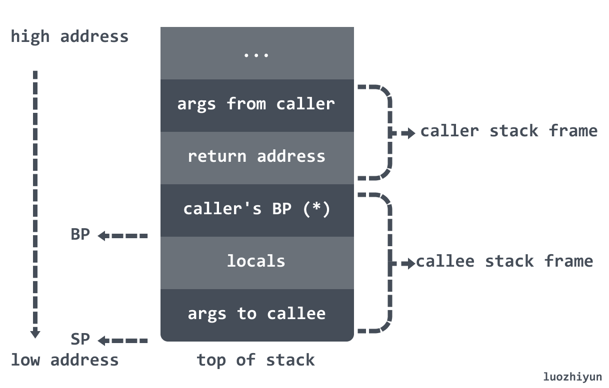
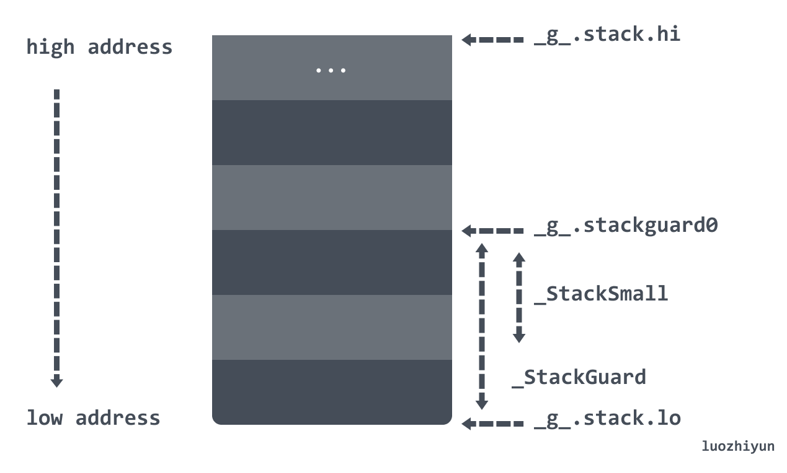
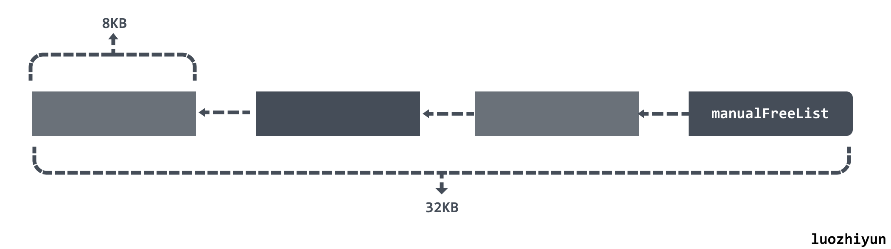
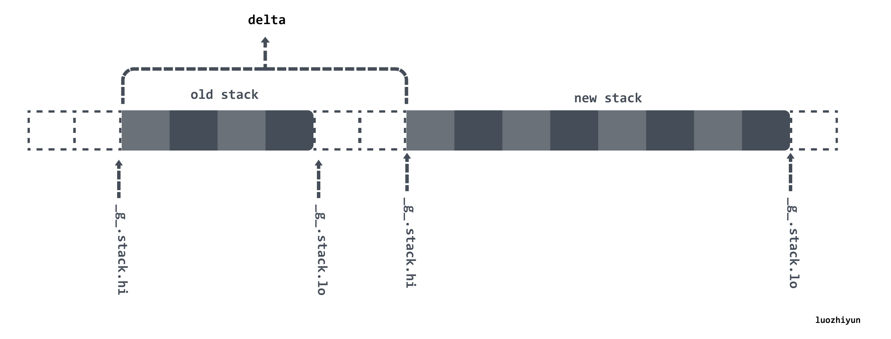

# 一文教你搞懂 Go 中栈操作

> 转载请声明出处哦~，本篇文章发布于luozhiyun的博客：https://www.luozhiyun.com
>
> 本文使用的go的源码1.15.7

## 知识点

### Linux 进程在内存布局


多任务操作系统中的每个进程都在自己的内存沙盒中运行。在32位模式下，它总是4GB内存地址空间，内存分配是分配虚拟内存给进程，当进程真正访问某一虚拟内存地址时，操作系统通过触发缺页中断，在物理内存上分配一段相应的空间再与之建立映射关系，这样进程访问的虚拟内存地址，会被自动转换变成有效物理内存地址，便可以进行数据的存储与访问了。

**Kernel space**：操作系统内核地址空间；

**Stack**：栈空间，是用户存放程序临时创建的局部变量，栈的增长方向是从高位地址到地位地址向下进行增长。在现代主流机器架构上（例如`x86`）中，栈都是向下生长的。然而，也有一些处理器（例如`B5000`）栈是向上生长的，还有一些架构（例如`System Z`）允许自定义栈的生长方向，甚至还有一些处理器（例如`SPARC`）是循环栈的处理方式；

**Heap**：堆空间，堆是用于存放进程运行中被动态分配的内存段，它的大小并不固定，可动态扩张或缩减；

**BBS segment**：BSS段，存放的是全局或者静态数据，但是存放的是全局/静态未初始化数据；

**Data segment：**数据段，通常是指用来存放程序中已初始化的全局变量的一块内存区域；

**Text segment**：代码段，指用来存放程序执行代码的一块内存区域。这部分区域的大小在程序运行前就已经确定，并且内存区域属于只读。

### 栈的相关概念

> In computer science, a call stack is a stack data structure that stores information about the active subroutines of a computer program. 
>
> In computer programming, a subroutine is a sequence of program instructions that performs a specific task, packaged as a unit. 

调用栈`call stack`，简称栈，是一种栈数据结构，用于存储有关计算机程序的活动 subroutines 信息。在计算机编程中，subroutines 是执行特定任务的一系列程序指令，打包为一个单元。

>  A stack frame is a frame of data that gets pushed onto the stack. In the case of a call stack, a stack frame would represent a function call and its argument data.

栈帧`stack frame`又常被称为帧`frame`是在调用栈中储存的函数之间的调用关系，每一帧对应了函数调用以及它的参数数据。

有了函数调用自然就要有调用者 caller 和被调用者 callee ，如在 函数 A 里 调用 函数 B，A 是 caller，B 是 callee。

调用者与被调用者的栈帧结构如下图所示：



Go 语言的汇编代码中栈寄存器解释的非常模糊，我们大概只要知道两个寄存器 BP 和 SP 的作用就可以了：

BP：**基准指针寄存器**，维护当前栈帧的基准地址，以便用来索引变量和参数，就像一个锚点一样，在其它架构中它等价于帧指针`FP`，只是在x86架构下，变量和参数都可以通过SP来索引；

SP：**栈指针寄存器**，总是指向栈顶；

### Goroutine 栈操作



在 Goroutine 中有一个 stack 数据结构，里面有两个属性 lo 与 hi，描述了实际的栈内存地址：

- stack.lo：栈空间的低地址；
- stack.hi：栈空间的高地址；

在 Goroutine 中会通过 stackguard0 来判断是否要进行栈增长：

- stackguard0：`stack.lo + StackGuard`, 用于stack overlow的检测；
- StackGuard：保护区大小，常量Linux上为 928 字节；
- StackSmall：常量大小为 128 字节，用于小函数调用的优化；
- StackBig：常量大小为 4096 字节；

根据被调用函数栈帧的大小来判断是否需要扩容：

1. 当栈帧大小（FramSzie）小于等于 StackSmall（128）时，如果 SP **小于** stackguard0 那么就执行栈扩容；
2. 当栈帧大小（FramSzie）大于 StackSmall（128）时，就会根据公式 `SP - FramSzie + StackSmall` 和 stackguard0 比较，如果**小于** stackguard0 则执行扩容；
3. 当栈帧大小（FramSzie）大于StackBig（4096）时，首先会检查 stackguard0 是否已转变成 StackPreempt 状态了；然后根据公式 `SP-stackguard0+StackGuard <= framesize + (StackGuard-StackSmall)`判断，如果是 true 则执行扩容；

需要注意的是，由于栈是由高地址向低地址增长的，所以对比的时候，都是小于才执行扩容，这里需要大家品品。

当执行栈扩容时，会在内存空间中分配更大的栈内存空间，然后将旧栈中的所有内容复制到新栈中，并修改指向旧栈对应变量的指针重新指向新栈，最后销毁并回收旧栈的内存空间，从而实现栈的动态扩容。

### 汇编

这里简单讲解一下后面分析中会用到的一些 Go 语言使用的 Plan 9 汇编，以免看不太明白。

#### 汇编函数

我们先来看看 plan9 的汇编函数的定义：


stack frame size：包含局部变量以及额外调用函数的参数空间；

arguments size：包含参数以及返回值大小，例如入参是 3 个 int64 类型，返回值是 1 个 int64 类型，那么返回值就是 sizeof(int64) * 4；

#### 栈调整

栈的调整是通过对硬件 SP 寄存器进行运算来实现的，例如:

```
SUBQ    $24, SP  // 对 sp 做减法，为函数分配函数栈帧 
...
ADDQ    $24, SP  // 对 sp 做加法 ，清除函数栈帧
```

由于栈是往下增长的，所以 SUBQ 对 SP 做减法的时候实际上是为函数分配栈帧，ADDQ 则是清除栈帧。

#### 常见指令

**加减法操作**：

```
ADDQ  AX, BX   // BX += AX
SUBQ  AX, BX   // BX -= AX
```

**数据搬运**：

常数在 plan9 汇编用 $num 表示，可以为负数，默认情况下为十进制。搬运的长度是由 MOV 的后缀决定。

```
MOVB $1, DI      // 1 byte
MOVW $0x10, BX   // 2 bytes
MOVD $1, DX      // 4 bytes
MOVQ $-10, AX     // 8 bytes
```

还有一点区别是在使用 MOVQ 的时候会由看到带括号和不带括号的区别。

```
// 加括号代表是指针的引用
MOVQ (AX), BX   // => BX = *AX 将AX指向的内存区域8byte赋值给BX
MOVQ 16(AX), BX // => BX = *(AX + 16)

//不加括号是值的引用
MOVQ AX, BX     // => BX = AX 将AX中存储的内容赋值给BX，注意区别
```

**跳转**：

```
// 无条件跳转
JMP addr   // 跳转到地址，地址可为代码中的地址
JMP label  // 跳转到标签，可以跳转到同一函数内的标签位置
JMP 2(PC)  // 以当前指令为基础，向前/后跳转 x 行

// 有条件跳转
JLS addr
```

地址运算：

```
LEAQ (AX)(AX*2), CX // => CX = AX + (AX * 2) = AX * 3
```

上面代码中的 2 代表 scale，scale 只能是 0、2、4、8。

## 解析


### G 的创建

因为栈都是在 Goroutine 上的，所以先从 G 的创建开始看如何创建以及初始化栈空间的。由于我在《详解Go语言调度循环源码实现 https://www.luozhiyun.com/archives/448》中已经讲过 G 的创建，所以这里只对栈的初始化部分的代码进行讲解。

G 的创建会调用 `runtime·newproc`进行创建：

**runtime.newproc**

```go
func newproc(siz int32, fn *funcval) {
	argp := add(unsafe.Pointer(&fn), sys.PtrSize)
	gp := getg()
	// 获取 caller 的 PC 寄存器
	pc := getcallerpc()
    // 切换到 G0 进行创建
	systemstack(func() {
		newg := newproc1(fn, argp, siz, gp, pc)
		...
	})
}
```

newproc 方法会切换到 G0 上调用 newproc1 函数进行 G 的创建。

**runtime.newproc1**

```go
const _StackMin = 2048
func newproc1(fn *funcval, argp unsafe.Pointer, narg int32, callergp *g, callerpc uintptr) *g {
	_g_ := getg()
	...
	_p_ := _g_.m.p.ptr()
	// 从 P 的空闲链表中获取一个新的 G
	newg := gfget(_p_)
	// 获取不到则调用 malg 进行创建
	if newg == nil {
		newg = malg(_StackMin)
		casgstatus(newg, _Gidle, _Gdead)
		allgadd(newg) // publishes with a g->status of Gdead so GC scanner doesn't look at uninitialized stack.
	}
	...
	return newg
}
```

newproc1 方法很长，里面主要是获取 G ，然后对获取到的 G 做一些初始化的工作。我们这里只看 malg 函数的调用。

在调用 malg 函数的时候会传入一个最小栈大小的值：_StackMin（2048）。

**runtime.malg**

```go
func malg(stacksize int32) *g {
	// 创建 G 结构体
	newg := new(g)
	if stacksize >= 0 {
		// 这里会在 stacksize 的基础上为每个栈预留系统调用所需的内存大小 _StackSystem
        // 在 Linux/Darwin 上（ _StackSystem == 0 ）本行不改变 stacksize 的大小
		stacksize = round2(_StackSystem + stacksize)
		// 切换到 G0 为 newg 初始化栈内存
		systemstack(func() {
			newg.stack = stackalloc(uint32(stacksize))
		})
		// 设置 stackguard0 ，用来判断是否要进行栈扩容
		newg.stackguard0 = newg.stack.lo + _StackGuard
		newg.stackguard1 = ^uintptr(0) 
		*(*uintptr)(unsafe.Pointer(newg.stack.lo)) = 0
	}
	return newg
}
```

在调用 malg 的时候会将传入的内存大小加上一个 _StackSystem 值预留给系统调用使用，round2 函数会将传入的值舍入为 2 的指数。然后会切换到 G0 执行 stackalloc 函数进行栈内存分配。

分配完毕之后会设置 stackguard0 为 `stack.lo + _StackGuard`，作为判断是否需要进行栈扩容使用，下面会谈到。

### 栈的初始化

文件位置：src/runtime/stack.go

```go
// 全局的栈缓存，分配 32KB以下内存
var stackpool [_NumStackOrders]struct {
	item stackpoolItem
	_    [cpu.CacheLinePadSize - unsafe.Sizeof(stackpoolItem{})%cpu.CacheLinePadSize]byte
}

//go:notinheap
type stackpoolItem struct {
	mu   mutex
	span mSpanList
} 

// 全局的栈缓存，分配 32KB 以上内存
var stackLarge struct {
	lock mutex
	free [heapAddrBits - pageShift]mSpanList // free lists by log_2(s.npages)
}

// 初始化stackpool/stackLarge全局变量
func stackinit() {
	if _StackCacheSize&_PageMask != 0 {
		throw("cache size must be a multiple of page size")
	}
	for i := range stackpool {
		stackpool[i].item.span.init()
		lockInit(&stackpool[i].item.mu, lockRankStackpool)
	}
	for i := range stackLarge.free {
		stackLarge.free[i].init()
		lockInit(&stackLarge.lock, lockRankStackLarge)
	}
}
```

在进行栈分配之前我们先来看看栈初始化的时候会做什么，需要注意的是，stackinit 是在调用 `runtime·schedinit`初始化的，是在调用 `runtime·newproc`之前进行的。

在执行栈初始化的时候会初始化两个全局变量 stackpool 和 stackLarge。stackpool 可以分配小于 32KB 的内存，stackLarge 用来分配大于 32KB 的栈空间。

### 栈的分配

从初始化的两个两个全局变量我们也可以知道，栈会根据大小的不同从不同的位置进行分配。

#### 小栈内存分配

文件位置：src/runtime/stack.go

```go
func stackalloc(n uint32) stack { 
    // 这里的 G 是 G0
	thisg := getg()
	...
	var v unsafe.Pointer
	// 在 Linux 上，_FixedStack = 2048、_NumStackOrders = 4、_StackCacheSize = 32768
	// 如果申请的栈空间小于 32KB
	if n < _FixedStack<<_NumStackOrders && n < _StackCacheSize {
		order := uint8(0)
		n2 := n
		// 大于 2048 ,那么 for 循环 将 n2 除 2,直到 n 小于等于 2048
		for n2 > _FixedStack {
			// order 表示除了多少次
			order++
			n2 >>= 1
		}
		var x gclinkptr
		//preemptoff != "", 在 GC 的时候会进行设置,表示如果在 GC 那么从 stackpool 分配
		// thisg.m.p = 0 会在系统调用和 改变 P 的个数的时候调用,如果发生,那么也从 stackpool 分配
		if stackNoCache != 0 || thisg.m.p == 0 || thisg.m.preemptoff != "" { 
			lock(&stackpool[order].item.mu)
			// 从 stackpool 分配
			x = stackpoolalloc(order)
			unlock(&stackpool[order].item.mu)
		} else {
			// 从 P 的 mcache 分配内存
			c := thisg.m.p.ptr().mcache
			x = c.stackcache[order].list
			if x.ptr() == nil {
				// 从堆上申请一片内存空间填充到stackcache中
				stackcacherefill(c, order)
				x = c.stackcache[order].list
			}
			// 移除链表的头节点
			c.stackcache[order].list = x.ptr().next
			c.stackcache[order].size -= uintptr(n)
		}
		// 获取到分配的span内存块
		v = unsafe.Pointer(x)
	} else {
		...
	}
    ...
	return stack{uintptr(v), uintptr(v) + uintptr(n)}
}
```

stackalloc 会根据传入的参数 n 的大小进行分配，在 Linux 上如果 n 小于 32768 bytes，也就是 32KB ，那么会进入到小栈的分配逻辑中。

小栈指大小为 2K/4K/8K/16K 的栈，在分配的时候，会根据大小计算不同的 order 值，如果栈大小是 2K，那么 order 就是 0，4K 对应 order 就是 1，以此类推。这样一方面可以减少不同 Goroutine 获取不同栈大小的锁冲突，另一方面可以预先缓存对应大小的 span ，以便快速获取。

`thisg.m.p == 0`可能发生在系统调用 exitsyscall 或改变 P 的个数 procresize 时，`thisg.m.preemptoff != ""`会发生在 GC 的时候。也就是说在发生在系统调用 exitsyscall 或改变 P 的个数在变动，亦或是在 GC 的时候，会从 stackpool 分配栈空间，否则从 mcache 中获取。

如果 mcache 对应的 stackcache 获取不到，那么调用 stackcacherefill 从堆上申请一片内存空间填充到stackcache中。

主要注意的是，stackalloc 由于切换到 G0 进行调用，所以 thisg 是 G0，我们也可以通过《如何编译调试 Go runtime 源码 https://www.luozhiyun.com/archives/506》这一篇文章的方法来进行调试：

```go
func stackalloc(n uint32) stack { 
	thisg := getg()
	// 添加一行打印
	if debug.schedtrace > 0 {
		print("stackalloc runtime: gp: gp=", thisg, ", goid=", thisg.goid, ", gp->atomicstatus=", readgstatus(thisg), "\n")
	}
	...
}
```

下面我们分别看一下 stackpoolalloc 与 stackcacherefill 函数。

**runtime.stackpoolalloc**

```go
func stackpoolalloc(order uint8) gclinkptr {
	list := &stackpool[order].item.span
	s := list.first
	lockWithRankMayAcquire(&mheap_.lock, lockRankMheap)
	if s == nil {
		// no free stacks. Allocate another span worth.
		// 从堆上分配 mspan
        // _StackCacheSize = 32 * 1024
		s = mheap_.allocManual(_StackCacheSize>>_PageShift, &memstats.stacks_inuse)
		if s == nil {
			throw("out of memory")
		}
		// 刚分配的 span 里面分配对象个数肯定为 0
		if s.allocCount != 0 {
			throw("bad allocCount")
		}
		if s.manualFreeList.ptr() != nil {
			throw("bad manualFreeList")
		}
		//OpenBSD 6.4+ 系统需要做额外处理
		osStackAlloc(s)
		// Linux 中 _FixedStack = 2048
		s.elemsize = _FixedStack << order
		//_StackCacheSize =  32 * 1024
		// 这里是将 32KB 大小的内存块分成了elemsize大小块，用单向链表进行连接
		// 最后 s.manualFreeList 指向的是这块内存的尾部
		for i := uintptr(0); i < _StackCacheSize; i += s.elemsize {
			x := gclinkptr(s.base() + i)
			x.ptr().next = s.manualFreeList
			s.manualFreeList = x
		}
		// 插入到 list 链表头部
		list.insert(s)
	}
	x := s.manualFreeList
	// 代表被分配完毕
	if x.ptr() == nil {
		throw("span has no free stacks")
	}
	// 将 manualFreeList 往后移动一个单位
	s.manualFreeList = x.ptr().next
	// 统计被分配的内存块
	s.allocCount++
	// 因为分配的时候第一个内存块是 nil
	// 所以当指针为nil 的时候代表被分配完毕
	// 那么需要将该对象从 list 的头节点移除
	if s.manualFreeList.ptr() == nil {
		// all stacks in s are allocated.
		list.remove(s)
	}
	return x
}
```

在 stackpoolalloc 函数中会去找 stackpool 对应 order 下标的 span 链表的头节点，如果不为空，那么直接将头节点的属性 manualFreeList 指向的节点从链表中移除，并返回；

如果 `list.first`为空，那么调用 mheap_的 allocManual 函数从堆中分配 mspan，具体的内存分配相关的文章可以看我这篇：《详解Go中内存分配源码实现 https://www.luozhiyun.com/archives/434》。

从  allocManual 函数会分配 32KB 大小的内存块，分配好新的 span 之后会根据 elemsize 大小将 32KB 内存进行切割，然后通过单向链表串起来并将最后一块内存地址赋值给 manualFreeList 。

比如当前的 elemsize 所代表的内存大小是 8KB大小：



**runtime.stackcacherefill**

```go
func stackcacherefill(c *mcache, order uint8) { 
	var list gclinkptr
	var size uintptr
	lock(&stackpool[order].item.mu)
	//_StackCacheSize = 32 * 1024
	// 将 stackpool 分配的内存组成一个单向链表 list
	for size < _StackCacheSize/2 {
		x := stackpoolalloc(order)
		x.ptr().next = list
		list = x
		// _FixedStack = 2048
		size += _FixedStack << order
	}
	unlock(&stackpool[order].item.mu)
	c.stackcache[order].list = list
	c.stackcache[order].size = size
}
```

stackcacherefill 函数会调用 stackpoolalloc 从 stackpool 中获取一半的空间组装成 list 链表，然后放入到 stackcache 数组中。

#### 大栈内存分配

```go
func stackalloc(n uint32) stack { 
	thisg := getg() 
	var v unsafe.Pointer
	 
	if n < _FixedStack<<_NumStackOrders && n < _StackCacheSize {
		...
	} else {
		// 申请的内存空间过大，从 runtime.stackLarge 中检查是否有剩余的空间
		var s *mspan
		// 计算需要分配多少个 span 页， 8KB 为一页
		npage := uintptr(n) >> _PageShift
		// 计算 npage 能够被2整除几次，用来作为不同大小内存的块的索引
		log2npage := stacklog2(npage)
 
		lock(&stackLarge.lock)
		// 如果 stackLarge 对应的链表不为空
		if !stackLarge.free[log2npage].isEmpty() {
			//获取链表的头节点，并将其从链表中移除
			s = stackLarge.free[log2npage].first
			stackLarge.free[log2npage].remove(s)
		}
		unlock(&stackLarge.lock)

		lockWithRankMayAcquire(&mheap_.lock, lockRankMheap)
		//这里是stackLarge为空的情况
		if s == nil {
			// 从堆上申请新的内存 span
			s = mheap_.allocManual(npage, &memstats.stacks_inuse)
			if s == nil {
				throw("out of memory")
			}
			// OpenBSD 6.4+ 系统需要做额外处理
			osStackAlloc(s)
			s.elemsize = uintptr(n)
		}
		v = unsafe.Pointer(s.base())
	}
	...
	return stack{uintptr(v), uintptr(v) + uintptr(n)}
}
```

对于大栈内存分配，运行时会查看 stackLarge 中是否有剩余的空间，如果不存在剩余空间，它也会调用  `mheap_.allocManual` 从堆上申请新的内存。

### 栈的扩容

#### 栈溢出检测

编译器会在目标代码生成的时候执行：src/cmd/internal/obj/x86/obj6.go:stacksplit 根据函数栈帧大小插入相应的指令，检查当前 goroutine 的栈空间是否足够。

1. 当栈帧大小（FramSzie）小于等于 StackSmall（128）时，如果 SP **小于** stackguard0 那么就执行栈扩容；
2. 当栈帧大小（FramSzie）大于 StackSmall（128）时，就会根据公式 `SP - FramSzie + StackSmall` 和 stackguard0 比较，如果**小于** stackguard0 则执行扩容；
3. 当栈帧大小（FramSzie）大于StackBig（4096）时，首先会检查 stackguard0 是否已转变成 StackPreempt 状态了；然后根据公式 `SP-stackguard0+StackGuard <= framesize + (StackGuard-StackSmall)`判断，如果是 true 则执行扩容；

我们先来看看**伪代码**会更清楚一些：

**当栈帧大小（FramSzie）小于等于 StackSmall（128）时**：

```
CMPQ SP, stackguard
JEQ	label-of-call-to-morestack
```

当栈帧大小（FramSzie）大于 StackSmall（128）时：

```
LEAQ -xxx(SP), AX 
CMPQ AX, stackguard
JEQ	label-of-call-to-morestack
```

这里 AX = SP - framesize + StackSmall，然后执行 CMPQ 指令让 AX 与 stackguard 比较；

**当栈帧大小（FramSzie）大于StackBig（4096）时**：

```
MOVQ	stackguard, SI // SI = stackguard
CMPQ	SI, $StackPreempt // compare SI ,StackPreempt
JEQ	label-of-call-to-morestack
LEAQ	StackGuard(SP), AX // AX = SP + StackGuard
SUBQ	SI, AX // AX = AX - SI =  SP + StackGuard -stackguard
CMPQ	AX, $(framesize+(StackGuard-StackSmall))
```

这里的伪代码会相对复杂一些，由于 G 里面的 stackguard0 在抢占的时候可能会赋值成 StackPreempt，所以明确有没有被抢占，那么需要将 stackguard0 和 StackPreempt进行比较。然后将执行比较： `SP-stackguard+StackGuard <= framesize + (StackGuard-StackSmall)`，两边都加上 StackGuard 是为了保证左边的值是正数。

希望在理解完上面的代码之前不要继续往下看。

主要注意的是，在一些函数的执行代码中，编译器很智能的加上了`NOSPLIT`标记，打了这个标记之后就会禁用栈溢出检测，可以在如下代码中发现这个标记的踪影：

代码位置：cmd/internal/obj/x86/obj6.go

```go
...
	if ctxt.Arch.Family == sys.AMD64 && autoffset < objabi.StackSmall && !p.From.Sym.NoSplit() {
		leaf := true
	LeafSearch:
		for q := p; q != nil; q = q.Link {
			...
		}

		if leaf {
			p.From.Sym.Set(obj.AttrNoSplit, true)
		}
	}
...
```

大致代码逻辑应该是：当函数处于调用链的叶子节点，且栈帧小于StackSmall字节时，则自动标记为NOSPLIT。同样的，我们在写代码的时候也可以自己在函数上面加上`//go:nosplit`强制指定NOSPLIT属性。

**栈溢出实例**

下面我们写一个简单的例子：

```go
func main() {
	a, b := 1, 2
	_ = add1(a, b)
	_ = add2(a, b)
	_ = add3(a, b)
}

func add1(x, y int) int {
	_ = make([]byte, 20)
	return x + y
}

func add2(x, y int) int {
	_ = make([]byte, 200)
	return x + y
}

func add3(x, y int) int {
	_ = make([]byte, 5000)
	return x + y
}
```

然后打印出它的汇编：

```sh
$ GOOS=linux GOARCH=amd64 go tool compile -S -N -l main.go
```

上面这个例子用三个方法调用解释了上面所说的三种情况：

**main 函数**

```
        0x0000 00000 (main.go:3)        TEXT    "".main(SB), ABIInternal, $48-0
        0x0000 00000 (main.go:3)        MOVQ    (TLS), CX 
        0x0009 00009 (main.go:3)        CMPQ    SP, 16(CX) // SP < stackguard 则跳到 129执行
        0x0009 00009 (main.go:3)        CMPQ    SP, 16(CX)
        0x000d 00013 (main.go:3)        PCDATA  $0, $-2
        0x000d 00013 (main.go:3)        JLS     129
    	... 
        0x0081 00129 (main.go:3)        CALL    runtime.morestack_noctxt(SB)
         
```

首先，我们从 TLS ( thread local storage) 变量中加载一个值至 CX 寄存器，然后将 SP 和 16(CX) 进行比较，那什么是 TLS？16(CX) 又代表什么？

其实`TLS`是一个伪寄存器，表示的是thread-local storage，它存放了 G 结构体。我们看一看 runtime 源代码中对于 G 的定义:

```go
type g struct { 
	stack       stack   // offset known to runtime/cgo
	stackguard0 uintptr // offset known to liblink
	...
}
type stack struct {
	lo uintptr
	hi uintptr
}
```

可以看到 stack 占了 16bytes，所以 `16(CX)` 对应的是  `g.stackguard0`。所以  `CMPQ    SP, 16(CX)`这一行代码实际上是比较 SP 和 stackguard 大小。如果 SP 小于 stackguard ，那么说明到了增长的阈值，会执行 JLS 跳到 129 行，调用 runtime.morestack_noctxt 执行下一步栈扩容操作。

**add1**

```
        0x0000 00000 (main.go:10)       TEXT    "".add1(SB), NOSPLIT|ABIInternal, $32-24
```

我们看到 add1 的汇编函数，可以看到它的栈大小只有 32 ，没有到达 StackSmall 128 bytes 的大小，并且它又是一个 callee 被调用者，所以可以发它加上了`NOSPLIT`标记，也就印证了我上面结论。

**add2**

```
"".add2 STEXT size=148 args=0x18 locals=0xd0
        0x0000 00000 (main.go:15)       TEXT    "".add2(SB), ABIInternal, $208-24
        0x0000 00000 (main.go:15)       MOVQ    (TLS), CX
		// AX = SP  - 208 + 128 = SP -80
        0x0009 00009 (main.go:15)       LEAQ    -80(SP), AX // 栈大小大于StackSmall =128, 计算 SP - FramSzie + StackSmall 并放入AX寄存器							
        0x000e 00014 (main.go:15)       CMPQ    AX, 16(CX) // AX < stackguard 则跳到 138 执行
        0x0012 00018 (main.go:15)       PCDATA  $0, $-2
        0x0012 00018 (main.go:15)       JLS     138
		...
        0x008a 00138 (main.go:15)       CALL    runtime.morestack_noctxt(SB)
```

add2 函数的栈帧大小是 208，大于 StackSmall 128 bytes ，所以可以看到首先从 TLS 变量中加载一个值至 CX 寄存器。

然后执行指令 `LEAQ    -80(SP), AX`，但是这里为什么是 -80 其实当时让我蛮疑惑的，但是需要注意的是这里的计算公式是：   `SP - FramSzie + StackSmall`，直接代入之后会发现它就是 -80，然后将这个数值加载到 AX 寄存器中。

最后调用 `CMPQ    AX, 16(CX)`，16(CX) 我们在上面已经讲过了是等于 stackguard0 ，所以这里是比较 AX 与 stackguard0 的小大，如果小于则直接跳转到 138 行执行 `runtime.morestack_noctxt`。

**add3**

```
"".add3 STEXT size=157 args=0x18 locals=0x1390
        0x0000 00000 (main.go:20)       TEXT    "".add3(SB), ABIInternal, $5008-24
        0x0000 00000 (main.go:20)       MOVQ    (TLS), CX 
        0x0009 00009 (main.go:20)       MOVQ    16(CX), SI // 将 stackguard 赋值给  SI
        0x000d 00013 (main.go:20)       PCDATA  $0, $-2 
        0x000d 00013 (main.go:20)       CMPQ    SI, $-1314 // 将 stackguard < stackPreempt 则跳转到 147 执行
        0x0014 00020 (main.go:20)       JEQ     147 
        0x0016 00022 (main.go:20)       LEAQ    928(SP), AX // AX = SP +928
        0x001e 00030 (main.go:20)       SUBQ    SI, AX // AX -= stackguard
        0x0021 00033 (main.go:20)       CMPQ    AX, $5808 // framesize + 928 -128  = 5808,比较 AX < 5808,则执行147
        0x0027 00039 (main.go:20)       JLS     147
        ...
        0x0093 00147 (main.go:20)       CALL    runtime.morestack_noctxt(SB)
```

add3 函数是直接分配了一个 5000 bytes 的数组在栈上，所以开头还是一样的，将从 TLS 变量中加载一个值至 CX 寄存器，然后将 stackguard0 赋值给 SI 寄存器；

接下来会执行指令 `CMPQ    SI, $-1314`，这里实际上比较 stackguard0 和 StackPreempt 的大小，至于为啥是 -1314 其实是直接在插入汇编代码的时候会调用 StackPreempt 变量，这个变量是在代码里面写死的：

代码位置：cmd/internal/objabi/stack.go

```go
const (
	StackPreempt = -1314 // 0xfff...fade
)
```

如果没有被抢占，那么直接往下执行`LEAQ    928(SP), AX`，这句指令等于 `AX = SP +_StackGuard`，在 Linux 中 _StackGuard 等于 928；

接下来执行 `SUBQ    SI, AX`，这一句指令等于 `AX -= stackguard0` ；

最后执行 `CMPQ    AX, $5808`，这个 5808 实际上是 `framesize + _StackGuard -  _StackSmall`，如果 AX 小于 5808 那么跳转到 147 行执行 runtime.morestack_noctxt 函数。

到这里栈溢出检测就讲解完毕了，我看了其他的文章，应该都没有我讲解的全面，特别是栈帧大小大于 _StackBig 时的溢出检测。

#### 栈的扩张

runtime.morestack_noctxt 是用汇编实现的，它会调用到 runtime·morestack，下面我们看看它的实现：

代码位置：src/runtime/asm_amd64.s

```
TEXT runtime·morestack(SB),NOSPLIT,$0-0
	// Cannot grow scheduler stack (m->g0).
	// 无法增长调度器的栈(m->g0)
	get_tls(CX)
	MOVQ	g(CX), BX
	MOVQ	g_m(BX), BX
	MOVQ	m_g0(BX), SI
	CMPQ	g(CX), SI
	JNE	3(PC)
	CALL	runtime·badmorestackg0(SB)
	CALL	runtime·abort(SB)
	// 省略signal stack、morebuf和sched的处理
	...
	// Call newstack on m->g0's stack.
	// 在 m->g0 栈上调用 newstack.
	MOVQ	m_g0(BX), BX
	MOVQ	BX, g(CX)
	MOVQ	(g_sched+gobuf_sp)(BX), SP
	CALL	runtime·newstack(SB)
	CALL	runtime·abort(SB)	// 如果 newstack 返回则崩溃 crash if newstack returns
	RET
```

runtime·morestack 做完校验和赋值操作后会切换到 G0 调用 `runtime·newstack`来完成扩容的操作。

**runtime·newstack**

```go
func newstack() {
	thisg := getg() 

	gp := thisg.m.curg
	 
	// 初始化寄存器相关变量
	morebuf := thisg.m.morebuf
	thisg.m.morebuf.pc = 0
	thisg.m.morebuf.lr = 0
	thisg.m.morebuf.sp = 0
	thisg.m.morebuf.g = 0
	...
	// 校验是否被抢占
	preempt := atomic.Loaduintptr(&gp.stackguard0) == stackPreempt
 
	// 如果被抢占
	if preempt {
		// 校验是否可以安全的被抢占
		// 如果 M 上有锁
		// 如果正在进行内存分配
		// 如果明确禁止抢占
		// 如果 P 的状态不是 running
		// 那么就不执行抢占了
		if !canPreemptM(thisg.m) {
			// 到这里表示不能被抢占？
			// Let the goroutine keep running for now.
			// gp->preempt is set, so it will be preempted next time.
			gp.stackguard0 = gp.stack.lo + _StackGuard
			// 触发调度器的调度
			gogo(&gp.sched) // never return
		}
	}

	if gp.stack.lo == 0 {
		throw("missing stack in newstack")
	}
	// 寄存器 sp
	sp := gp.sched.sp
	if sys.ArchFamily == sys.AMD64 || sys.ArchFamily == sys.I386 || sys.ArchFamily == sys.WASM {
		// The call to morestack cost a word.
		sp -= sys.PtrSize
	} 
	...
	if preempt {
		//需要收缩栈
		if gp.preemptShrink { 
			gp.preemptShrink = false
			shrinkstack(gp)
		}
		// 被 runtime.suspendG 函数挂起
		if gp.preemptStop {
			// 被动让出当前处理器的控制权
			preemptPark(gp) // never returns
		}
 
		//主动让出当前处理器的控制权
		gopreempt_m(gp) // never return
	}
 
	// 计算新的栈空间是原来的两倍
	oldsize := gp.stack.hi - gp.stack.lo
	newsize := oldsize * 2 
	... 
	//将 Goroutine 切换至 _Gcopystack 状态
	casgstatus(gp, _Grunning, _Gcopystack)
 
	//开始栈拷贝
	copystack(gp, newsize) 
	casgstatus(gp, _Gcopystack, _Grunning)
	gogo(&gp.sched)
}
```

newstack 函数的前半部分承担了对 Goroutine 进行抢占的任务,对于任务抢占还不清楚的可以看我这篇：《从源码剖析Go语言基于信号抢占式调度 https://www.luozhiyun.com/archives/485》。

在开始执行栈拷贝之前会先计算新栈的大小是原来的两倍，然后将 Goroutine 状态切换至 _Gcopystack 状态。

#### 栈拷贝

```go
func copystack(gp *g, newsize uintptr) { 
	old := gp.stack 
	// 当前已使用的栈空间大小
	used := old.hi - gp.sched.sp
 
	//分配新的栈空间
	new := stackalloc(uint32(newsize))
	...
 
	// 计算调整的幅度
	var adjinfo adjustinfo
	adjinfo.old = old
	// 新栈和旧栈的幅度来控制指针的移动
	adjinfo.delta = new.hi - old.hi
 
	// 调整 sudogs, 必要时与 channel 操作同步
	ncopy := used
	if !gp.activeStackChans {
		...
		adjustsudogs(gp, &adjinfo)
	} else {
		// 到这里代表有被阻塞的 G 在当前 G 的channel 中，所以要防止并发操作，需要获取 channel 的锁
		 
		// 在所有 sudog 中找到地址最大的指针
		adjinfo.sghi = findsghi(gp, old) 
		// 对所有 sudog 关联的 channel 上锁，然后调整指针，并且复制 sudog 指向的部分旧栈的数据到新的栈上
		ncopy -= syncadjustsudogs(gp, used, &adjinfo)
	} 
	// 将源栈中的整片内存拷贝到新的栈中
	memmove(unsafe.Pointer(new.hi-ncopy), unsafe.Pointer(old.hi-ncopy), ncopy)
	// 继续调整栈中 txt、defer、panic 位置的指针
	adjustctxt(gp, &adjinfo)
	adjustdefers(gp, &adjinfo)
	adjustpanics(gp, &adjinfo)
	if adjinfo.sghi != 0 {
		adjinfo.sghi += adjinfo.delta
	} 
	// 将 G 上的栈引用切换成新栈
	gp.stack = new
	gp.stackguard0 = new.lo + _StackGuard // NOTE: might clobber a preempt request
	gp.sched.sp = new.hi - used
	gp.stktopsp += adjinfo.delta
 
	// 在新栈重调整指针
	gentraceback(^uintptr(0), ^uintptr(0), 0, gp, 0, nil, 0x7fffffff, adjustframe, noescape(unsafe.Pointer(&adjinfo)), 0)
 
	if stackPoisonCopy != 0 {
		fillstack(old, 0xfc)
	}
	//释放原始栈的内存空间
	stackfree(old)
}
```

1. copystack 首先会计算一下使用栈空间大小，那么在进行栈复制的时候只需要复制已使用的空间就好了；
2. 然后调用 stackalloc 函数从堆上分配一片内存块；
3. 然后对比新旧栈的 hi 的值计算出两块内存占之间的差值 delta，这个 delta 会在调用 adjustsudogs、adjustctxt 等函数的时候判断旧栈的内存指针位置，然后加上 delta 然后就获取到了新栈的指针位置，这样就可以将指针也调整到新栈了；



4. 调用 memmove 将源栈中的整片内存拷贝到新的栈中；
5. 然后继续调用调整指针的函数继续调整栈中 txt、defer、panic 位置的指针；
6. 接下来将 G 上的栈引用切换成新栈；
7. 最后调用 stackfree 释放原始栈的内存空间；

### 栈的收缩

栈的收缩发生在 GC 时对栈进行扫描的阶段：

```go
func scanstack(gp *g, gcw *gcWork) {
	... 
	// 进行栈收缩
	shrinkstack(gp)
	...
}
```

如果还不清楚 GC 的话不妨看一下我这篇文章：《Go语言GC实现原理及源码分析 https://www.luozhiyun.com/archives/475》。

**runtime.shrinkstack**

shrinkstack 这个函数我屏蔽了一些校验函数，只留下面的核心逻辑：

```go
func shrinkstack(gp *g) {
	...
	oldsize := gp.stack.hi - gp.stack.lo
	newsize := oldsize / 2 
	// 当收缩后的大小小于最小的栈的大小时，不再进行收缩
	if newsize < _FixedStack {
		return
	}
	avail := gp.stack.hi - gp.stack.lo
	// 计算当前正在使用的栈数量，如果 gp 使用的当前栈少于四分之一，则对栈进行收缩
	// 当前使用的栈包括到 SP 的所有内容以及栈保护空间，以确保有 nosplit 功能的空间
	if used := gp.stack.hi - gp.sched.sp + _StackLimit; used >= avail/4 {
		return
	}
	// 将旧栈拷贝到新收缩后的栈上
	copystack(gp, newsize)
}
```

新栈的大小会缩小至原来的一半，如果小于 _FixedStack （2KB）那么不再进行收缩。除此之外还会计算一下当前栈的使用情况是否不足 1/4 ，如果使用超过 1/4 那么也不会进行收缩。

最后判断确定要进行收缩则调用 copystack 函数进行栈拷贝的逻辑。

## 总结

如果对于没有了解过内存布局的同学，理解起来可能会比较吃力，因为我们在看堆的时候内存增长都是从小往大增长，而栈的增长方向是相反的，导致在做栈指令操作的时候将 SP 减小反而是将栈帧增大。

除此之外就是 Go 使用的是 plan9 这种汇编，资料比较少，看起来很麻烦，想要更深入了解这种汇编的可以看我下面的 Reference 的资料。

## Reference

聊一聊goroutine stack https://kirk91.github.io/posts/2d571d09/

Anatomy of a Program in Memory https://manybutfinite.com/post/anatomy-of-a-program-in-memory/

stack-frame-layout-on-x86-64 https://eli.thegreenplace.net/2011/09/06/stack-frame-layout-on-x86-64

深入研究goroutine栈 http://www.huamo.online/2019/06/25/%E6%B7%B1%E5%85%A5%E7%A0%94%E7%A9%B6goroutine%E6%A0%88/

x86-64 下函数调用及栈帧原理 https://zhuanlan.zhihu.com/p/27339191

Call stack https://en.wikipedia.org/wiki/Call_stack

plan9 assembly 完全解析 https://github.com/cch123/golang-notes/blob/master/assembly.md

Go语言内幕（5）：运行时启动过程 https://studygolang.com/articles/7211

Go 汇编入门 https://github.com/go-internals-cn/go-internals/blob/master/chapter1_assembly_primer/README.md

Go Assembly by Example https://davidwong.fr/goasm/

https://golang.org/doc/asm 

