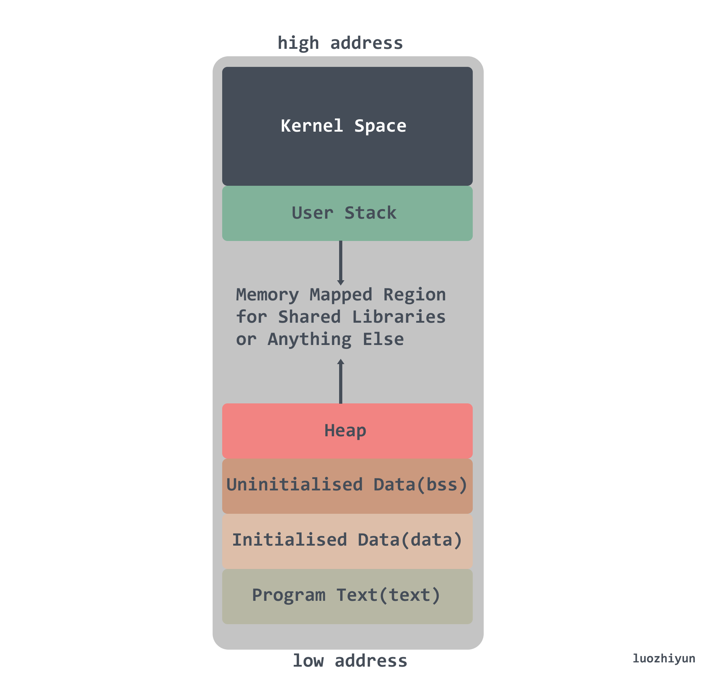
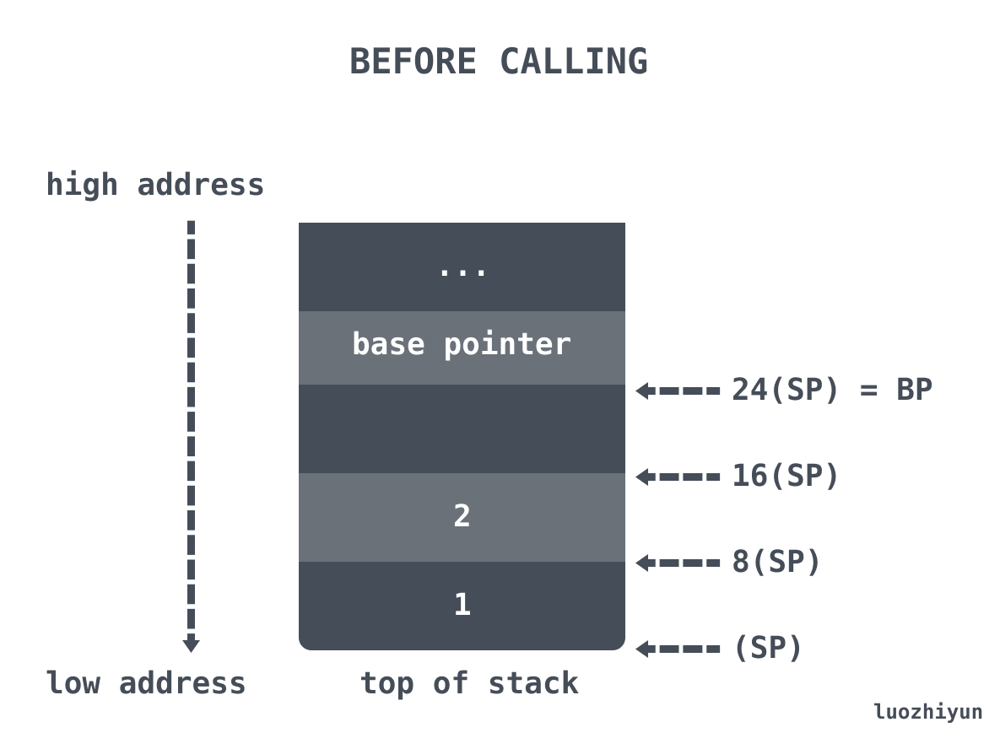
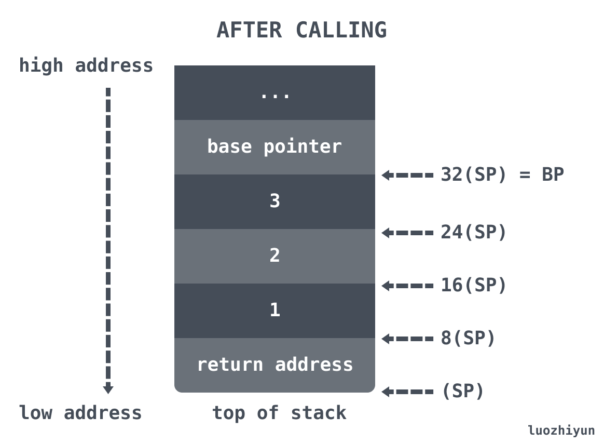
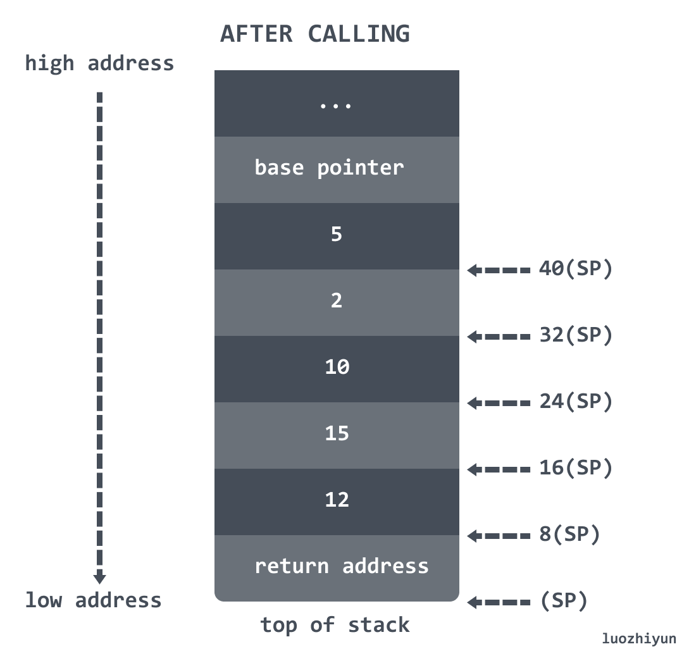
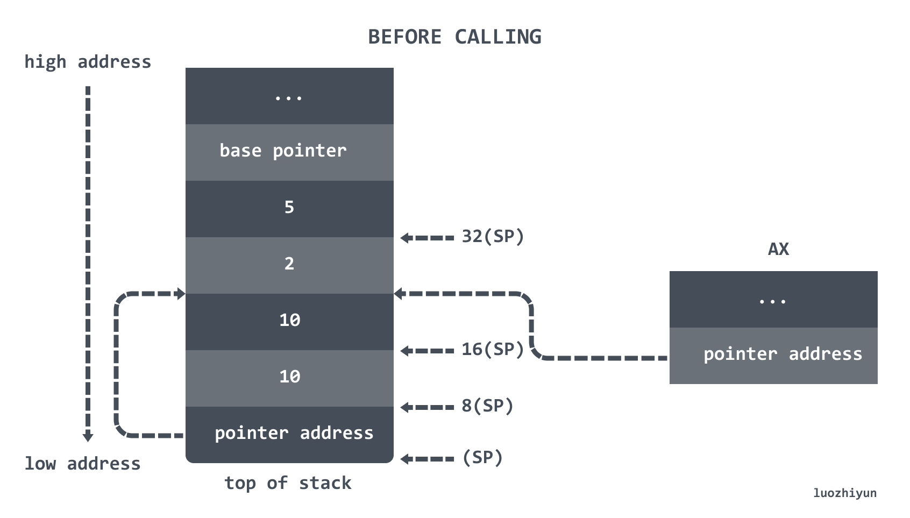
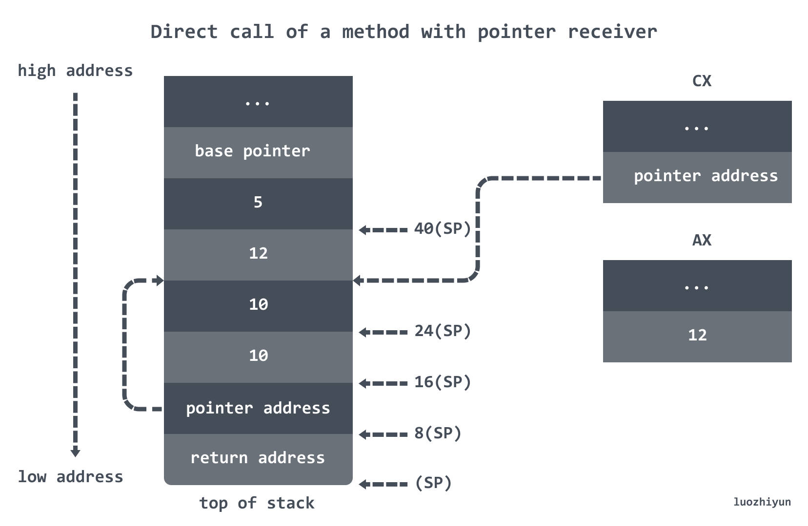
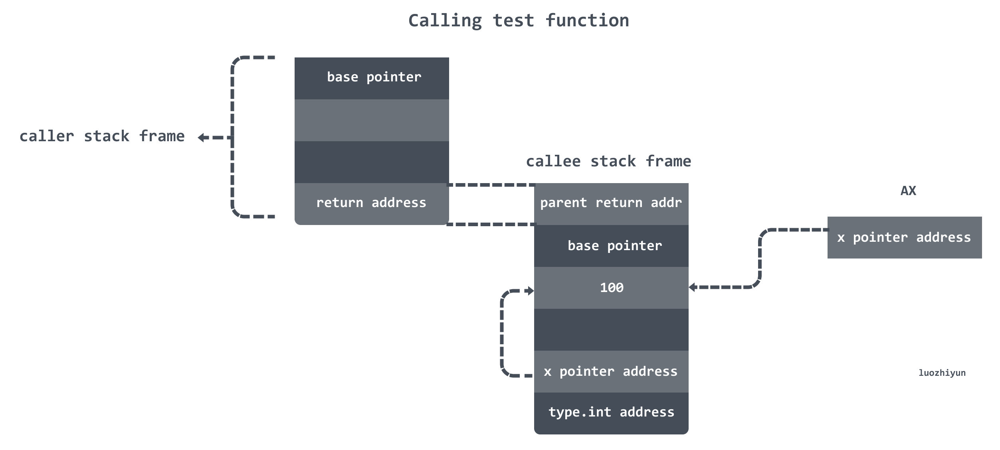
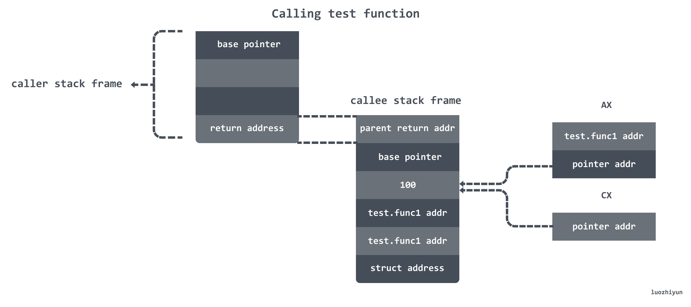
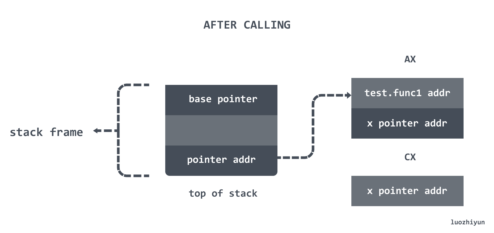

# 从汇编出发深入 Go语言函数调用 

> 转载请声明出处哦~，本篇文章发布于luozhiyun的博客：https://www.luozhiyun.com
>
> 本文使用的go的源码 1.15.7

## 前言

### 函数调用类型

这篇文章中函数调用（Function Calls）中的函数指的是 Go 中的任意可执行代码块。在 《**Go 1.1 Function Calls**》中提到了，在 Go 中有这四类函数：

> - top-level func
> - method with value receiver
> - method with pointer receiver
> - func literal

top-level func 就是我们平常写的普通函数：

```go
func TopLevel(x int) {}
```

而 method with value receiver & method with pointer receiver 指的是结构体方法的**值接收者方法**与**指针接收者**方法。

结构体方法能给用户自定义的类型添加新的行为。它和函数的区别在于方法有一个接收者，给一个函数添加一个接收者，那么它就变成了方法。接收者可以是`值接收者 value receiver`，也可以是`指针接收者 pointer receiver`。

我们拿`Man`和`Woman`两个简单的结构体举例：

```go
type Man struct {
}
type Woman struct {
}
 
func (*Man) Say() {
}
 
func (Woman) Say() {
}
```

上面的例子中：`(*Man).Say()`使用的是`指针接收者 pointer receiver`；`(Woman) Say()`是`值接收者 value receiver`；

function literal 的定义如下：

> A function literal represents an anonymous function.

也就是说包含匿名函数和闭包。

下面在分析的时候也是按照这几种类型进行展开。

### 基础知识

在 《一文教你搞懂 Go 中栈操作 https://www.luozhiyun.com/archives/513》中讲解了栈操作，但是对于栈上的函数调用来说还有很多知识点直接被忽略了，所以在这里继续看看函数调用相关知识。

如果没有看过上面提到这篇文章，我这边也写一下基础知识，看过的同学可以跳过。



在现代主流机器架构上（例如`x86`）中，栈都是向下生长的。栈的增长方向是从高位地址到地位地址向下进行增长。

我们先来看看 plan9 的汇编函数的定义： 

#### 汇编函数

我们先来看看 plan9 的汇编函数的定义：


stack frame size：包含局部变量以及额外调用函数的参数空间；

arguments size：包含参数以及返回值大小，例如入参是 3 个 int64 类型，返回值是 1 个 int64 类型，那么返回值就是 sizeof(int64) * 4；

#### 栈调整

栈的调整是通过对硬件 SP 寄存器进行运算来实现的，例如:

```
SUBQ    $24, SP  // 对 sp 做减法，为函数分配函数栈帧 
...
ADDQ    $24, SP  // 对 sp 做加法 ，清除函数栈帧
```

由于栈是往下增长的，所以 SUBQ 对 SP 做减法的时候实际上是为函数分配栈帧，ADDQ 则是清除栈帧。

#### 常见指令

**加减法操作**：

```
ADDQ  AX, BX   // BX += AX
SUBQ  AX, BX   // BX -= AX
```

**数据搬运**：

常数在 plan9 汇编用 $num 表示，可以为负数，默认情况下为十进制。搬运的长度是由 MOV 的后缀决定。

```
MOVB $1, DI      // 1 byte
MOVW $0x10, BX   // 2 bytes
MOVD $1, DX      // 4 bytes
MOVQ $-10, AX     // 8 bytes
```

还有一点区别是在使用 MOVQ 的时候会由看到带括号和不带括号的区别。

```
// 加括号代表是指针的引用
MOVQ (AX), BX   // => BX = *AX 将AX指向的内存区域8byte赋值给BX
MOVQ 16(AX), BX // => BX = *(AX + 16)

// 不加括号是值的引用
MOVQ AX, BX     // => BX = AX 将AX中存储的内容赋值给BX，注意区别
```

地址运算：

```
LEAQ (AX)(AX*2), CX // => CX = AX + (AX * 2) = AX * 3
```

上面代码中的 2 代表 scale，scale 只能是 0、2、4、8。

## 函数调用分析

### 直接函数调用

我们这里定义一个简单的函数：

```go
package main

func main() {
	add(1, 2)
}

func add(a, b int) int {
	return a + b
}
```

然后使用命令打印出汇编：

```
GOOS=linux GOARCH=amd64 go tool compile -S -N -l main.go
```

下面我们分段来看一下汇编指令以及栈的情况。先从 main 方法的调用开始：

```assembly
"".main STEXT size=71 args=0x0 locals=0x20
0x0000 00000 (main.go:3)        TEXT    "".main(SB), ABIInternal, $32-0
0x0000 00000 (main.go:3)        MOVQ    (TLS), CX
0x0009 00009 (main.go:3)        CMPQ    SP, 16(CX)   ; 栈溢出检测
0x000d 00013 (main.go:3)        PCDATA  $0, $-2      ; GC 相关
0x000d 00013 (main.go:3)        JLS     64
0x000f 00015 (main.go:3)        PCDATA  $0, $-1      ; GC 相关
0x000f 00015 (main.go:3)        SUBQ    $32, SP      ; 分配了 32bytes 的栈地址
0x0013 00019 (main.go:3)        MOVQ    BP, 24(SP)   ; 将 BP 的值存储到栈上
0x0018 00024 (main.go:3)        LEAQ    24(SP), BP   ; 将刚分配的栈空间 8bytes 的地址赋值给BP
0x001d 00029 (main.go:3)        FUNCDATA        $0, gclocals·33cdeccccebe80329f1fdbee7f5874cb(SB) ; GC 相关
0x001d 00029 (main.go:3)        FUNCDATA        $1, gclocals·33cdeccccebe80329f1fdbee7f5874cb(SB) ; GC 相关
0x001d 00029 (main.go:4)        MOVQ    $1, (SP)     ; 将给add函数的第一个参数1，写到SP
0x0025 00037 (main.go:4)        MOVQ    $2, 8(SP)    ; 将给add函数的第二个参数2，写到SP 
0x002e 00046 (main.go:4)        PCDATA  $1, $0
0x002e 00046 (main.go:4)        CALL    "".add(SB)   ; 调用 add 函数 
0x0033 00051 (main.go:5)        MOVQ    24(SP), BP   ; 将栈上储存的值恢复BP
0x0038 00056 (main.go:5)        ADDQ    $32, SP      ; 增加SP的值，栈收缩，收回 32 bytes的栈空间 
0x003c 00060 (main.go:5)        RET
```

下面来具体看看上面的汇编做了些什么：

```assembly
0x0000 00000 (main.go:3)        TEXT    "".main(SB), ABIInternal, $32-0
```

`0x0000`: 当前指令相对于当前函数的偏移量；

`TEXT`:由于程序代码在运行期会放在内存的 .text 段中，所以TEXT 是一个指令，用来定义一个函数；

`"".main(SB)`: 表示的是包名.函数名，这里省略了包名。SB是一个虚拟寄存器，保存了静态基地址(static-base) 指针，即我们程序地址空间的开始地址；

`$32-0`:$32表即将分配的栈帧大小；0指定了调用方传入的参数大小。

```assembly
0x000d 00013 (main.go:3)        PCDATA  $0, $-2      ; GC 相关
0x000f 00015 (main.go:3)        PCDATA  $0, $-1      ; GC 相关

0x001d 00029 (main.go:3)        FUNCDATA        $0, gclocals·33cdeccccebe80329f1fdbee7f5874cb(SB) ; GC 相关
0x001d 00029 (main.go:3)        FUNCDATA        $1, gclocals·33cdeccccebe80329f1fdbee7f5874cb(SB) ; GC 相关
```

> The FUNCDATA and PCDATA directives contain information for use by the garbage collector; they are introduced by the compiler.

FUNCDATA以及PCDATA指令包含有被垃圾回收所使用的信息；这些指令是被编译器加入的。

```assembly
0x000f 00015 (main.go:3)        SUBQ    $32, SP
```

在执行栈上调用的时候由于栈是从内存地址高位向低位增长的，所以会根据当前的栈帧大小调用` SUBQ    $32, SP `表示分配 32bytes 的栈内存；

```assembly
0x0013 00019 (main.go:3)        MOVQ    BP, 24(SP)   ; 将 BP 的值存储到栈上
0x0018 00024 (main.go:3)        LEAQ    24(SP), BP   ; 将刚分配的栈空间 8bytes 的地址赋值给BP
```

这里会用8 个字节(24(SP)-32(SP)) 来存储当前帧指针 BP。

```assembly
0x001d 00029 (main.go:4)        MOVQ    $1, (SP)     ; 将给add函数的第一个参数1，写到SP
0x0025 00037 (main.go:4)        MOVQ    $2, 8(SP)    ; 将给add函数的第二个参数2，写到SP 
```

参数值1会被压入到栈的(0(SP)-8(SP)) 位置；

参数值2会被压入到栈的(8(SP)-16(SP)) 位置；

需要**注意**的是我们这里的参数类型是 int，在 64 位中 int 是 8byte 大小。虽然栈的增长是从高地址位到低地址位，但是栈内的数据块的存放还是从低地址位到高地址位，指针指向的位置也是数据块的低地址位的起始位置。

综上在函数调用中，关于参数的传递我们可以知道两个信息：

1. **参数完全通过栈传递**
2. **从参数列表的右至左压栈**

下面是调用 add 函数之前的调用栈的调用详情：



当我们准备好函数的入参之后，会调用汇编指令`CALL "".add(SB)`，这个指令首先会将 main 的返回地址 (8 bytes) 存入栈中，然后改变当前的栈指针 SP 并执行 add 的汇编指令。

下面我们进入到 add 函数：

```assembly
"".add STEXT nosplit size=25 args=0x18 locals=0x0
0x0000 00000 (main.go:7)        TEXT    "".add(SB), NOSPLIT|ABIInternal, $0-24
0x0000 00000 (main.go:7)        FUNCDATA        $0, gclocals·33cdeccccebe80329f1fdbee7f5874cb(SB) ; GC 相关
0x0000 00000 (main.go:7)        FUNCDATA        $1, gclocals·33cdeccccebe80329f1fdbee7f5874cb(SB) ; GC 相关
0x0000 00000 (main.go:7)        MOVQ    $0, "".~r2+24(SP)   ; 初始化返回值
0x0009 00009 (main.go:8)        MOVQ    "".a+8(SP), AX      ; AX = 1
0x000e 00014 (main.go:8)        ADDQ    "".b+16(SP), AX     ; AX = AX + 2
0x0013 00019 (main.go:8)        MOVQ    AX, "".~r2+24(SP)   ; (24)SP = AX = 3
0x0018 00024 (main.go:8)        RET 
```

由于会改变当前的栈指针 SP，所以在看这个函数的汇编代码之前我们先看一下栈中的数据情况，这里我们可以实际 dlv 操作一下：

在**进入到 add 函数之前**的时候我们可以用 regs 打印一下当前的 Rsp 和 Rbp 寄存器：

```
(dlv) regs 
   Rsp = 0x000000c000044760
   Rbp = 0x000000c000044778
 	 ...

(dlv)  print uintptr(0x000000c000044778)
824634001272
(dlv)  print uintptr(0x000000c000044760)
824634001248
```

Rsp 和 Rbp 的地址值是相差 24 bytes ，是符合我们上面图例的。

然后**进入到 add 函数之后**，我们可以用 regs 打印一下当前的 Rsp 和 Rbp 寄存器：

```
(dlv) regs
   Rsp = 0x000000c000044758
   Rbp = 0x000000c000044778
   ...

(dlv)  print uintptr(0x000000c000044778)
824634001272
(dlv)  print uintptr(0x000000c000044758)
824634001240
```

Rsp 和 Rbp 的地址值是相差 32 bytes。因为在调用 CALL 指令的时候将函数的返回地址(8 字节值)推到栈顶。

那么这个时候，本来参数值1和参数值2的位置也会改变：

本来参数值1在栈的(0(SP)-8(SP)) 位置，会移动到栈的(8(SP)-16(SP)) 位置；

本来参数值2在栈的(8(SP)-16(SP)) 位置，会移动到栈的(16(SP)-24(SP)) 位置；

我们也可以通过 dlv 将参数值打印出来：

```
(dlv) print *(*int)(uintptr(0x000000c000044758)+8)
1
(dlv) print *(*int)(uintptr(0x000000c000044758)+16)
2
```

下面是调用 add 函数之后的调用栈的调用详情：



从上面的 add 函数调用分析我们也可以得出以下结论：

* **返回值通过栈传递，返回值的栈空间在参数之前**

调用完毕之后我们看一下 add 函数的返回：

```assembly
0x002e 00046 (main.go:4)        CALL    "".add(SB)   ; 调用 add 函数 
0x0033 00051 (main.go:5)        MOVQ    24(SP), BP   ; 将栈上储存的值恢复BP
0x0038 00056 (main.go:5)        ADDQ    $32, SP      ; 增加SP的值，栈收缩，收回 32 bytes的栈空间 
0x003c 00060 (main.go:5)        RET
```

在调用完 add 函数之后会恢复 BP 指针，然后调用 ADDQ 指令将增加SP的值，执行栈收缩。从这里可以看出最后调用方（caller）会负责栈的清理工作。

小结以下栈的调用规则：

1. **参数完全通过栈传递**
2. **从参数列表的右至左压栈**
3. **返回值通过栈传递，返回值的栈空间在参数之前**
4. **函数调用完毕后，调用方（caller）会负责栈的清理工作**

### 结构体方法：值接收者与指针接收者

上面我们也讲到了，Go 的方法接收者有两种，一种是`值接收者(value receiver)`，一种是`指针接收者(pointer receiver)`。下面我们通过一个例子来进行说明：

```go
package main

func main() { 
	p := Point{2, 5} 
	p.VIncr(10)
	p.PIncr(10)
}

type Point struct {
	X int
	Y int
}

func (p Point) VIncr(factor int) {
	p.X += factor
	p.Y += factor
}

func (p *Point) PIncr(factor int) {
	p.X += factor
	p.Y += factor
} 
```

自己可以手动的汇编输出结合文章一起看。

#### 调用值接收者(value receiver)方法

在汇编中，我们的结构体在汇编层面实际上就是一段连续内存，所以`p := Point{2, 5}` 初始化如下：

```assembly
0x001d 00029 (main.go:5)        XORPS   X0, X0                  ;; 初始化寄存器 X0
0x0020 00032 (main.go:5)        MOVUPS  X0, "".p+24(SP)         ;; 初始化大小为16bytes连续内存块
0x0025 00037 (main.go:5)        MOVQ    $2, "".p+24(SP)         ;; 初始化结构体 p 参数 x
0x002e 00046 (main.go:5)        MOVQ    $5, "".p+32(SP)         ;; 初始化结构体 p 参数 y
```

我们这里的结构体 Point 参数是两个 int 组成，int 在 64 位机器上是 8bytes，所以这里使用 XORPS 先初始化 128-bit 大小的 X0 寄存器，然后使用 MOVUPS 将 128-bit 大小的 X0 赋值给 24(SP) 申请一块 16bytes 内存块。然后初始化 Point 的两个参数 2 和 5。

接下来就是初始化变量，然后调用 `p.VIncr` 方法：

```assembly
0x0037 00055 (main.go:7)        MOVQ    $2, (SP)                ;; 初始化变量2
0x003f 00063 (main.go:7)        MOVQ    $5, 8(SP)               ;; 初始化变量5
0x0048 00072 (main.go:7)        MOVQ    $10, 16(SP)             ;; 初始化变量10
0x0051 00081 (main.go:7)        PCDATA  $1, $0
0x0051 00081 (main.go:7)        CALL    "".Point.VIncr(SB)      ;; 调用 value receiver 方法
```

到这里，调用前的栈帧结构大概是这样：


再看 `p.VIncr`的汇编代码：：

```assembly
"".Point.VIncr STEXT nosplit size=31 args=0x18 locals=0x0
        0x0000 00000 (main.go:16)       TEXT    "".Point.VIncr(SB), NOSPLIT|ABIInternal, $0-24
        0x0000 00000 (main.go:16)       FUNCDATA        $0, gclocals·33cdeccccebe80329f1fdbee7f5874cb(SB)
        0x0000 00000 (main.go:16)       FUNCDATA        $1, gclocals·33cdeccccebe80329f1fdbee7f5874cb(SB)
        0x0000 00000 (main.go:17)       MOVQ    "".p+8(SP), AX          ;; AX = 8(SP) = 2
        0x0005 00005 (main.go:17)       ADDQ    "".factor+24(SP), AX    ;; AX = AX + 24(SP) = 2+10
        0x000a 00010 (main.go:17)       MOVQ    AX, "".p+8(SP)          ;; 8(SP) = AX = 12
        0x000f 00015 (main.go:18)       MOVQ    "".p+16(SP), AX         ;; AX = 16(SP) = 5
        0x0014 00020 (main.go:18)       ADDQ    "".factor+24(SP), AX    ;; AX = AX + 24(SP) = 5+10
        0x0019 00025 (main.go:18)       MOVQ    AX, "".p+16(SP)         ;; 16(SP) = AX  = 15
        0x001e 00030 (main.go:19)       RET 
```

到这里调用后的栈帧结构大概是这样：



从这上面的分析我们可以看到，caller 在调用 VIncr 方法的时候实际上是将值赋值到栈上给 VIncr 当作参数在调用，对于在 VIncr 中的修改实际上都是修改栈上最后两个参数值。

#### 调用指针接收者(pointer receiver)方法

在main里面，调用的指令是：

```assembly
0x0056 00086 (main.go:8)        LEAQ    "".p+24(SP), AX         ;; 将 24(SP) 地址值赋值到 AX
0x005b 00091 (main.go:8)        MOVQ    AX, (SP)                ;; 将AX的值作为第一个参数,参数值是 2
0x005f 00095 (main.go:8)        MOVQ    $10, 8(SP)              ;; 将 10 作为第二个参数
0x0068 00104 (main.go:8)        CALL    "".(*Point).PIncr(SB)   ;; 调用 pointer receiver 方法
```

从上面的汇编我们知道，AX 里面实际上是存放的 24(SP) 的地址值，并且将 AX 存放的指针也赋值给了 SP 的第一个参数。也就是 AX 和 SP 的第一个参数的值都是 24(SP) 的地址值。

整个栈帧结构应该如下图所示：



再看 `p.PIncr`的汇编代码：

```assembly
"".(*Point).PIncr STEXT nosplit size=53 args=0x10 locals=0x0
        0x0000 00000 (main.go:21)       TEXT    "".(*Point).PIncr(SB), NOSPLIT|ABIInternal, $0-16
        0x0000 00000 (main.go:21)       FUNCDATA        $0, gclocals·1a65e721a2ccc325b382662e7ffee780(SB)
        0x0000 00000 (main.go:21)       FUNCDATA        $1, gclocals·69c1753bd5f81501d95132d08af04464(SB)
        0x0000 00000 (main.go:22)       MOVQ    "".p+8(SP), AX          ;; 将8(SP) 处存放地址值赋值到 AX  
        0x0005 00005 (main.go:22)       TESTB   AL, (AX)
        0x0007 00007 (main.go:22)       MOVQ    "".p+8(SP), CX          ;; 将8(SP) 处存放地址值赋值到 CX 
        0x000c 00012 (main.go:22)       TESTB   AL, (CX)
        0x000e 00014 (main.go:22)       MOVQ    (AX), AX                ;; 从 AX 里读到内存地址，从内存地址里拿到值，再读到AX
        0x0011 00017 (main.go:22)       ADDQ    "".factor+16(SP), AX    ;; 将参数值 10 加到 AX 里, AX = AX + 10 =12
        0x0016 00022 (main.go:22)       MOVQ    AX, (CX)                ;; 将计算结果写入到 CX 的内存地址
        0x0019 00025 (main.go:23)       MOVQ    "".p+8(SP), AX          ;; 将 8(SP) 处的地址值赋值给 AX
        0x001e 00030 (main.go:23)       TESTB   AL, (AX)
        0x0020 00032 (main.go:23)       MOVQ    "".p+8(SP), CX          ;; 将 8(SP) 处的地址值赋值给 CX
        0x0025 00037 (main.go:23)       TESTB   AL, (CX)
        0x0027 00039 (main.go:23)       MOVQ    8(AX), AX               ;; 从 AX 里读到内存地址值+8 ，然后从内存地址里拿到值，再读到AX
        0x002b 00043 (main.go:23)       ADDQ    "".factor+16(SP), AX    ;; AX = 5+10
        0x0030 00048 (main.go:23)       MOVQ    AX, 8(CX)               ;; 将计算结果 15 写入到 CX+8 的内存地址
        0x0034 00052 (main.go:24)       RET
```

在这个方法里面实际上还是有点意思的，并且有点绕，因为很多地方实际上都是对指针的操作，从而做到任意一方做出的修改都会影响另一方。

下面我们一步步分析：

```assembly
0x0000 00000 (main.go:22)       MOVQ    "".p+8(SP), AX
0x0007 00007 (main.go:22)       MOVQ    "".p+8(SP), CX 
0x000e 00014 (main.go:22)       MOVQ    (AX), AX
```

这两句指令分别是将 8(SP) 里面存放的指针赋值给了 AX 和 CX，然后从 AX内存地址里拿到值，再写到 AX。

```assembly
0x0011 00017 (main.go:22)       ADDQ    "".factor+16(SP), AX 
0x0016 00022 (main.go:22)       MOVQ    AX, (CX)
```

这里会将传入的 16(SP) 参数与 AX 相加，那么这个时候 AX 存放的值应该是 12。然后将 AX 赋值给 CX 的内存地址指向的值，通过上面的汇编我们可以知道 CX 指向的是 8(SP) 存放的指针，所以这里会同时将 8(SP) 指针指向的值也修改了。

我们可以使用使用 dlv 输出 regs 进行验证一下：

```
(dlv) regs
	Rsp = 0x000000c000056748
	Rax = 0x000000000000000c
	Rcx = 0x000000c000056768
```

然后我们可以查看 8(SP) 和 CX 所存放的值：

```
(dlv) print *(*int)(uintptr(0x000000c000056748) +8  ) 
824634074984
(dlv) print uintptr(0x000000c000056768)
824634074984

```

可以看到它们都指向了同一个  32(SP) 的指针：

```
(dlv) print uintptr(0x000000c000056748) +32
824634074984
```

然后我们可以打印出这个指针具体指向的值：

```
(dlv) print *(*int)(824634074984) 
12
```

这个时候栈帧的情况如下所示：



我们继续往下：

```assembly
0x0019 00025 (main.go:23)       MOVQ    "".p+8(SP), AX
0x0020 00032 (main.go:23)       MOVQ    "".p+8(SP), CX
```

这里会将将 8(SP) 处存放的地址值赋值给 AX 和 CX；

这里我们通过单步的 step-instruction 命令让代码运行到 `MOVQ  "".p+8(SP), CX`执行行之后，然后再查看 AX 指针位置：

```
(dlv) disassemble
		...
        main.go:21      0x467980        488b4c2408      mov rcx, qword ptr [rsp+0x8]
=>      main.go:21      0x467985        8401            test byte ptr [rcx], al
        main.go:21      0x467987        488b4008        mov rax, qword ptr [rax+0x8]
        ...
        
(dlv) regs
    Rsp = 0x000000c000056748
    Rax = 0x000000c000056768 
    Rcx = 0x000000c000056768

(dlv) print uintptr(0x000000c000056768)
824634074984
```

可以看到 AX 与 CX 指向了同一个内存地址位置。然后我们进入到下面：

```assembly
0x0027 00039 (main.go:23)       MOVQ    8(AX), AX
```

在前面也说过，对于结构体来说分配的是连续的代码块，在栈上 32(SP)~48(SP)都是指向变量 p 所实例化的结构体，所以在上面的打印结果中 824634074984 代表的是 变量 p.X 的值，那么 p.Y 的地址值就是 `824634074984+8`，我们也可以通过 dlv 打印出地址代表的值：

```
(dlv) print *(*int)(824634074984+8) 
5
```

所以`MOVQ    8(AX), AX`实际上就是做了将地址值加 8，然后取出结果 5 赋值到 AX 上。

```assembly
0x002b 00043 (main.go:23)       ADDQ    "".factor+16(SP), AX ;; AX = AX +10
0x0030 00048 (main.go:23)       MOVQ    AX, 8(CX)
```

到这里其实就是计算出 AX 等于 15，然后将计算结果 15 写入到 CX+8 的内存地址值指向的空间，也就做到了同时修改了 40(SP) 处指针指向的值。

到这个方法结束的时候，栈帧如下：


从上面的分析我们可以看到一件有趣的事情，在进行调用指针接收者(pointer receiver)方法调用的时候，实际上是先复制了结构体的指针到栈中，然后在方法调用中全都是基于指针的操作。

#### 小结

通过分析我们知道在调用值接收者(value receiver)方法的时候，调用者 caller 会将参数值写入到栈上，调用函数 callee 实际上操作的是调用者 caller 栈帧上的参数值。

进行调用指针接收者(pointer receiver)方法调用的时候，和 value receiver 方法的区别是调用者 caller 写入栈的是参数的地址值，所以调用完之后可以直接体现在 receiver 的结构体中。

### 字面量方法 func literal

 func literal 我也不知道怎么准确翻译，就叫字面量方法吧，在 Go 中这类方法主要包括匿名函数以及闭包。

#### 匿名函数

我这里还是通过一个简单的例子来进行分析：

```go
package main

func main() {
	f := func(x int) int {
		x += x
		return x
	}
	f(100)
}
```

下面我们看一下它的汇编：

```assembly
        0x0000 00000 (main.go:3)        TEXT    "".main(SB), ABIInternal, $32-0
        ...
        0x001d 00029 (main.go:4)        LEAQ    "".main.func1·f(SB), DX
        0x0024 00036 (main.go:4)        MOVQ    DX, "".f+16(SP)
        0x0029 00041 (main.go:8)        MOVQ    $100, (SP)
        0x0031 00049 (main.go:8)        MOVQ    "".main.func1·f(SB), AX
        0x0038 00056 (main.go:8)        PCDATA  $1, $0
        0x0038 00056 (main.go:8)        CALL    AX
        0x003a 00058 (main.go:9)        MOVQ    24(SP), BP
        0x003f 00063 (main.go:9)        ADDQ    $32, SP
        0x0043 00067 (main.go:9)        RET
```

通过上面的分析相信大家应该都能看懂这段汇编是在做什么了，匿名函数实际上传递的是匿名函数的入口地址。

#### 闭包

什么是闭包呢？在 Wikipedia 上有这么一段话形容闭包：

> a **closure** is a record storing **a function** together with **an environment**.

**闭包**是由**函数**和与其相关的引用**环境**组合而成的实体，需要打起精神的是下面的闭包分析会复杂很多。

我这里还是通过一个简单的例子来进行分析：

```go
package main

func test() func() {
	x := 100
	return func() {
		x += 100
	}
}

func main() {
	f := test()
	f() //x= 200
	f() //x= 300
	f() //x= 400
} 
```

由于闭包是有上下文的，我们以测试例子为例，每调用一次 f() 函数，变量 x 都会发生变化。但是我们通过其他的方法调用都知道，如果变量保存在栈上那么变量会随这栈帧的退出而失效，所以闭包的变量会逃逸到堆上。

我们可以进行逃逸分析进行证明：

```sh
[root@localhost gotest]$ go run -gcflags "-m -l" main.go 
# command-line-arguments
./main.go:4:2: moved to heap: x
./main.go:5:9: func literal escapes to heap
```

可以看到变量 x 逃逸到了堆中。

下面我们直接来看看汇编：

先来看看 main 函数：

```assembly
"".main STEXT size=88 args=0x0 locals=0x18
        0x0000 00000 (main.go:10)       TEXT    "".main(SB), ABIInternal, $24-0
        0x0000 00000 (main.go:10)       MOVQ    (TLS), CX
        0x0009 00009 (main.go:10)       CMPQ    SP, 16(CX)
        0x000d 00013 (main.go:10)       PCDATA  $0, $-2
        0x000d 00013 (main.go:10)       JLS     81
        0x000f 00015 (main.go:10)       PCDATA  $0, $-1
        0x000f 00015 (main.go:10)       SUBQ    $24, SP
        0x0013 00019 (main.go:10)       MOVQ    BP, 16(SP)
        0x0018 00024 (main.go:10)       LEAQ    16(SP), BP
        0x001d 00029 (main.go:10)       FUNCDATA        $0, gclocals·69c1753bd5f81501d95132d08af04464(SB)
        0x001d 00029 (main.go:10)       FUNCDATA        $1, gclocals·9fb7f0986f647f17cb53dda1484e0f7a(SB)
        0x001d 00029 (main.go:11)       PCDATA  $1, $0
        0x001d 00029 (main.go:11)       NOP
        0x0020 00032 (main.go:11)       CALL    "".test(SB)
        ...
```

其实这段汇编和其他的函数调用的汇编是一样的，没啥好讲的，在调用 test 函数之前就是做了一些栈的初始化工作。

下面直接看看 test 函数：

```assembly
0x0000 00000 (main.go:3)        TEXT    "".test(SB), ABIInternal, $40-8
0x0000 00000 (main.go:3)        MOVQ    (TLS), CX
0x0009 00009 (main.go:3)        CMPQ    SP, 16(CX)
0x000d 00013 (main.go:3)        PCDATA  $0, $-2
0x000d 00013 (main.go:3)        JLS     171
0x0013 00019 (main.go:3)        PCDATA  $0, $-1
0x0013 00019 (main.go:3)        SUBQ    $40, SP
0x0017 00023 (main.go:3)        MOVQ    BP, 32(SP)
0x001c 00028 (main.go:3)        LEAQ    32(SP), BP
0x0021 00033 (main.go:3)        FUNCDATA        $0, gclocals·263043c8f03e3241528dfae4e2812ef4(SB)
0x0021 00033 (main.go:3)        FUNCDATA        $1, gclocals·568470801006e5c0dc3947ea998fe279(SB)
0x0021 00033 (main.go:3)        MOVQ    $0, "".~r0+48(SP)
0x002a 00042 (main.go:4)        LEAQ    type.int(SB), AX
0x0031 00049 (main.go:4)        MOVQ    AX, (SP)
0x0035 00053 (main.go:4)        PCDATA  $1, $0
0x0035 00053 (main.go:4)        CALL    runtime.newobject(SB)           ;; 申请内存
0x003a 00058 (main.go:4)        MOVQ    8(SP), AX                       ;; 将申请的内存地址写到 AX 中
0x003f 00063 (main.go:4)        MOVQ    AX, "".&x+24(SP)                ;; 将内存地址写到 24(SP) 中
0x0044 00068 (main.go:4)        MOVQ    $100, (AX)                      ;; 将100 写到 AX 保存的内存地址指向的内存中
0x004b 00075 (main.go:5)        LEAQ    type.noalg.struct { F uintptr; "".x *int }(SB), AX ;; 创建闭包结构体,并将函数地址写到 AX
0x0052 00082 (main.go:5)        MOVQ    AX, (SP)                        ;; 将 AX 中保存的函数地址写到 (SP)   
0x0056 00086 (main.go:5)        PCDATA  $1, $1
0x0056 00086 (main.go:5)        CALL    runtime.newobject(SB)           ;; 申请内存
0x005b 00091 (main.go:5)        MOVQ    8(SP), AX                       ;; 将申请的内存地址写到 AX 中
0x0060 00096 (main.go:5)        MOVQ    AX, ""..autotmp_4+16(SP)        ;; 将内存地址写到 16(SP) 中
0x0065 00101 (main.go:5)        LEAQ    "".test.func1(SB), CX           ;; 将 test.func1 函数地址写到 CX
0x006c 00108 (main.go:5)        MOVQ    CX, (AX)                        ;; 将 CX 中保存的函数地址写到 AX 保存的内存地址指向的内存中
0x006f 00111 (main.go:5)        MOVQ    ""..autotmp_4+16(SP), AX        ;; 将 16(SP) 保存的内存地址写到 AX 
0x0074 00116 (main.go:5)        TESTB   AL, (AX)
0x0076 00118 (main.go:5)        MOVQ    "".&x+24(SP), CX                ;; 将 24(SP) 保存的地址值写到 CX
0x007b 00123 (main.go:5)        LEAQ    8(AX), DI                       ;; 将 AX + 8 写到 DI
0x007f 00127 (main.go:5)        PCDATA  $0, $-2
0x007f 00127 (main.go:5)        CMPL    runtime.writeBarrier(SB), $0
0x0086 00134 (main.go:5)        JEQ     138
0x0088 00136 (main.go:5)        JMP     164
0x008a 00138 (main.go:5)        MOVQ    CX, 8(AX)                       ;; 将 CX 中保存的函数地址写到 AX+8
0x008e 00142 (main.go:5)        JMP     144
0x0090 00144 (main.go:5)        PCDATA  $0, $-1
0x0090 00144 (main.go:5)        MOVQ    ""..autotmp_4+16(SP), AX
0x0095 00149 (main.go:5)        MOVQ    AX, "".~r0+48(SP)
0x009a 00154 (main.go:5)        MOVQ    32(SP), BP
0x009f 00159 (main.go:5)        ADDQ    $40, SP
0x00a3 00163 (main.go:5)        RET
```

下面我们一步步看这段汇编：

```assembly
0x002a 00042 (main.go:4)        LEAQ    type.int(SB), AX                ;; 将 type.int 函数地址值写到 AX
0x0031 00049 (main.go:4)        MOVQ    AX, (SP)                        ;; 将 AX 保存的函数地址值写到 (SP)  
0x0035 00053 (main.go:4)        PCDATA  $1, $0
0x0035 00053 (main.go:4)        CALL    runtime.newobject(SB)           ;; 申请内存
0x003a 00058 (main.go:4)        MOVQ    8(SP), AX                       ;; 将申请的内存地址写到 AX 中
0x003f 00063 (main.go:4)        MOVQ    AX, "".&x+24(SP)                ;; 将内存地址写到 24(SP) 中
0x0044 00068 (main.go:4)        MOVQ    $100, (AX)
```

这一步其实就是将 type.int 函数地址值通过 AX 写到 (SP) 的位置，然后再调用 runtime.newobject 申请一段内存块，通过 AX 将内存地址值写到 24(SP) 相当于给变量 x 分配内存空间，最后将 x 的值设置为 100。

这个时候栈帧结构应该是这样：



```assembly
0x004b 00075 (main.go:5)        LEAQ    type.noalg.struct { F uintptr; "".x *int }(SB), AX
```

这个结构体代表了一个闭包，然后将创建好的结构体的内存地址放到了 AX 寄存器中。

```assembly
0x0052 00082 (main.go:5)        MOVQ    AX, (SP)
```

然后这一个汇编指令会将 AX 中保存的内存地址写入到 (SP)中。

```assembly
0x0056 00086 (main.go:5)        CALL    runtime.newobject(SB)           ;; 申请内存
0x005b 00091 (main.go:5)        MOVQ    8(SP), AX                       ;; 将申请的内存地址写到 AX 中
0x0060 00096 (main.go:5)        MOVQ    AX, ""..autotmp_4+16(SP)        ;; 将内存地址写到 16(SP) 中
```

这里会重新申请一块内存，然后将内存地址由 AX 写入到 16(SP) 中。

```assembly
0x0065 00101 (main.go:5)        LEAQ    "".test.func1(SB), CX           ;; 将 test.func1 函数地址写到 CX
0x006c 00108 (main.go:5)        MOVQ    CX, (AX)                        ;; 将 CX 中保存的函数地址写到 AX 保存的内存地址指向的内存中
0x006f 00111 (main.go:5)        MOVQ    ""..autotmp_4+16(SP), AX        ;; 将 16(SP) 保存的内存地址写到 AX
```

这里是将 test.func1 函数地址值写入到 CX，然后将 CX 存放的地址值写入到 AX 保存的内存地址所指向的内存。然后还将 16(SP) 保存的地址值写入 AX，其实这里 AX 保存的值并没有变，不知道为啥要生成一个这样的汇编指令。

由于 AX 内存地址是 8(SP) 写入的， 16(SP) 的内存地址是 AX 写入的，所以这一次性实际上修改了三个地方的值，具体的栈帧结构如下：



```assembly
        0x0076 00118 (main.go:5)        MOVQ    "".&x+24(SP), CX                ;; 将 24(SP) 保存的地址值写到 CX
        0x007b 00123 (main.go:5)        LEAQ    8(AX), DI                       ;; 将 AX + 8 写到 DI
        0x007f 00127 (main.go:5)        CMPL    runtime.writeBarrier(SB), $0	;; 写屏障
        0x0086 00134 (main.go:5)        JEQ     138
        0x0088 00136 (main.go:5)        JMP     164
        0x008a 00138 (main.go:5)        MOVQ    CX, 8(AX)                       ;; 将 CX 中保存的地址写到 AX+8
```

24(SP) 实际上保存的是 x 变量的指针地址，这里会将这个指针地址写入到 CX 中。然后将 8(AX) 保存的值转移到 DI 中，最后将 CX 保存的值写入到 8(AX)。

到这里稍微再说一下 AX 此时的引用情况：

AX ->  test.func1的地址值，也就是AX 此时指向的是 test.func1的地址值；

8(AX) ->  24(SP) 地址值 -> 100，也就是 8(AX) 保存的地址值指向的是 24(SP) 地址值， 24(SP) 地址值指向的内存保存的是100；

```assembly
0x0090 00144 (main.go:5)        MOVQ    ""..autotmp_4+16(SP), AX        ;; 16(SP) 中保存的地址写入 AX
0x0095 00149 (main.go:5)        MOVQ    AX, "".~r0+48(SP)               ;; 将 AX 中保存的地址写到 48(SP)   
0x009a 00154 (main.go:5)        MOVQ    32(SP), BP
0x009f 00159 (main.go:5)        ADDQ    $40, SP
```

这里最后会将 16(SP) 的值借 AX 写入到上 caller 的栈帧 48(SP) 上，最后做栈的收缩，callee 栈调用完毕。

调用完毕之后会回到 main 函数中，这个时候的栈帧如下：



下面再回到 main 函数的 test 函数调用后的位置：

```assembly
0x0020 00032 (main.go:11)       CALL    "".test(SB)
0x0025 00037 (main.go:11)       MOVQ    (SP), DX                ;; 将(SP)保存的函数地址值写到 DX 
0x0029 00041 (main.go:11)       MOVQ    DX, "".f+8(SP)          ;; 将 DX 保存的函数地址值写到 8(SP)   
0x002e 00046 (main.go:12)       MOVQ    (DX), AX                ;; 将 DX 保存的函数地址值写到 AX
```

test 函数调用完毕之后会返回一个 test.func1 函数地址值存在栈 main 调用栈的栈顶，然后调用完 test 函数之后会将存放在 (SP) 的 test.func1 函数地址值写入到 AX 中，然后执行调用下面的指令进行调用：

```assembly
0x0031 00049 (main.go:12)       CALL    AX
```

在进入到  test.func1 函数之前，我们现在应该知道  (SP) 里面保存的是指向 AX 的地址值。

 test.func1 函数是 test 函数里封装返回的函数：

```assembly
"".test.func1 STEXT nosplit size=36 args=0x0 locals=0x10
        0x0000 00000 (main.go:5)        TEXT    "".test.func1(SB), NOSPLIT|NEEDCTXT|ABIInternal, $16-0
        0x0000 00000 (main.go:5)        SUBQ    $16, SP
        0x0004 00004 (main.go:5)        MOVQ    BP, 8(SP)
        0x0009 00009 (main.go:5)        LEAQ    8(SP), BP
        0x000e 00014 (main.go:5)        MOVQ    8(DX), AX       ;; 这里实际上是获取变量 x 的地址值
        0x0012 00018 (main.go:5)        MOVQ    AX, "".&x(SP)
        0x0016 00022 (main.go:6)        ADDQ    $100, (AX)		;; 将x地址指向的值加100
        0x001a 00026 (main.go:7)        MOVQ    8(SP), BP
        0x001f 00031 (main.go:7)        ADDQ    $16, SP
        0x0023 00035 (main.go:7)        RET
```

由于 DX 保存的就是 AX 地址值，所以通过 8(DX) 可以获取到变量 x 的地址值写入到 AX 中。然后调用 ADDQ 指令将x地址指向的值加100。

#### 小结

通过上面的分析，可以发现其实匿名函数就是闭包的一种，只是没有传递变量信息而已。而在闭包的调用中，会将上下文信息逃逸到堆上，避免因为栈帧调用结束而被回收。

在上面的例子闭包函数 test 的调用中，非常复杂的做了很多变量的传递，其实就是做了这几件事：

1. 为上下文信息初始化内存块；
2. 将上下文信息的地址值保存到 AX 寄存器中；
3. 将闭包函数封装好的 test.func1 调用函数地址写入到 caller 的栈顶；

这里的上下文信息指的是 x 变量以及 test.func1 函数。将这两个信息地址写入到 AX 寄存器之后回到 main 函数，获取到栈顶的函数地址写入到 AX 执行 `CALL  AX` 进行调用。

因为 x 变量地址是写入到 AX + 8 的位置上，所以在调用  test.func1 函数的时候是通过获取 AX + 8 的位置上的值从而获取到 x 变量地址从而做到改变闭包上下文信息的目的。

## 总结 

这篇文章中，首先和大家分享了函数调用的过程是怎样的，包括参数的传递、参数压栈的顺序、函数返回值的传递。然后分析了结构体方法传递之间的区别以及闭包函数调用是怎样的。

在分析闭包的时候的时候 dlv 工具的 regs 命令和 step-instruction 命令帮助了很多，要不然指针在寄存器之间传递调用很容易绕晕，建议在看的时候可以动动手在纸上画画。

## Reference

Go 函数调用 ━ 栈和寄存器视角 https://segmentfault.com/a/1190000019753885

函数 https://chai2010.cn/advanced-go-programming-book/ch3-asm/ch3-04-func.html

https://berryjam.github.io/2018/12/golang%E6%9B%BF%E6%8D%A2%E8%BF%90%E8%A1%8C%E6%97%B6%E5%87%BD%E6%95%B0%E4%BD%93%E5%8F%8A%E5%85%B6%E5%8E%9F%E7%90%86/

Go 汇编入门 https://github.com/go-internals-cn/go-internals/blob/master/chapter1_assembly_primer/README.md

plan9 assembly 完全解析 https://github.com/cch123/golang-notes/blob/master/assembly.md

Go Assembly by Example https://davidwong.fr/goasm/

https://golang.org/doc/asm 

x86-64 下函数调用及栈帧原理 https://zhuanlan.zhihu.com/p/27339191

https://www.cnblogs.com/binHome/p/13034103.html

https://chai2010.cn/advanced-go-programming-book/ch3-asm/ch3-01-basic.html

Interfaces https://github.com/teh-cmc/go-internals/blob/master/chapter2_interfaces/README.md 

Go 1.1 Function Calls  https://docs.google.com/document/d/1bMwCey-gmqZVTpRax-ESeVuZGmjwbocYs1iHplK-cjo/pub

What is the difference between MOV and LEA? https://stackoverflow.com/questions/1699748/what-is-the-difference-between-mov-and-lea/1699778#1699778

Function literals https://golang.org/ref/spec#Function_literals 

闭包 https://hjlarry.github.io/docs/go/closure/