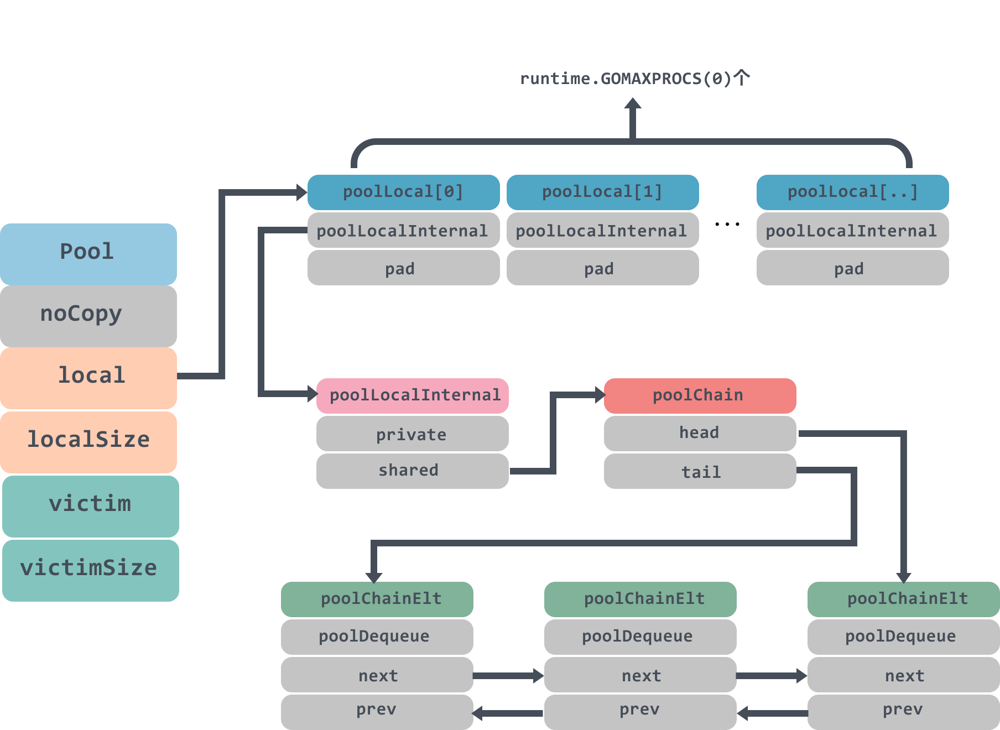
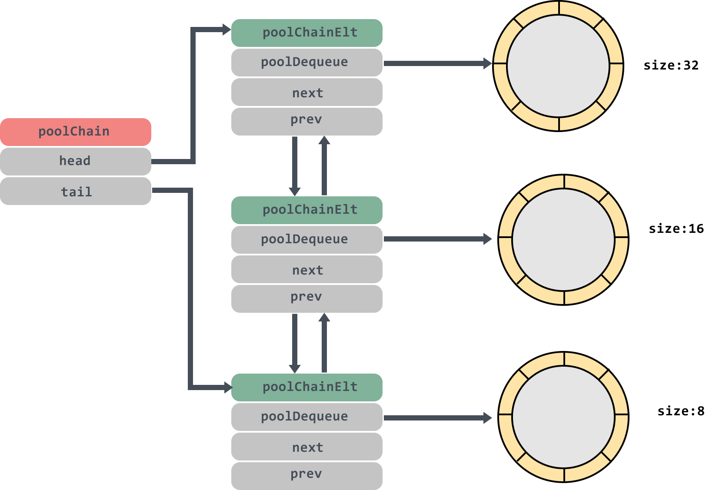
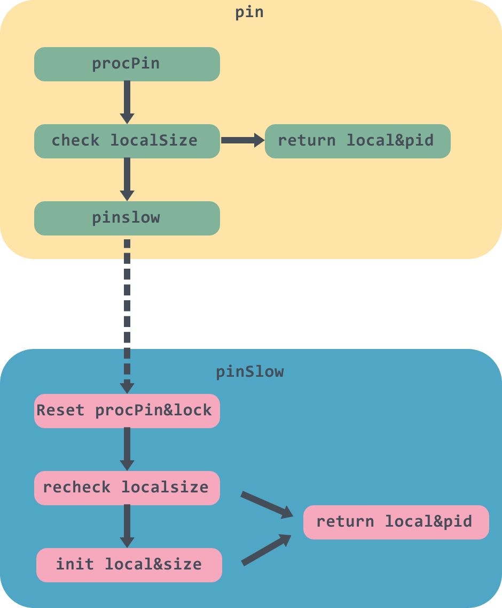
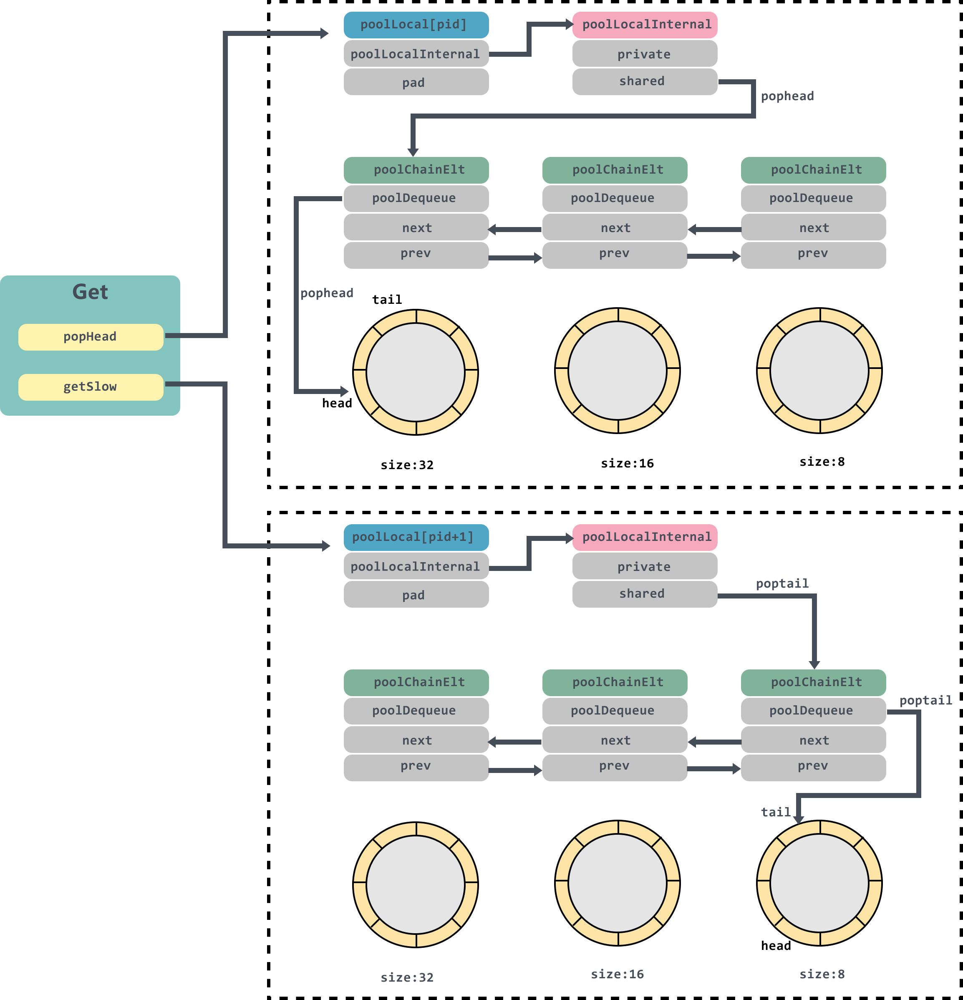

# 多图详解Go的sync.Pool源码

> 转载请声明出处哦~，本篇文章发布于luozhiyun的博客：https://www.luozhiyun.com
>
> 本文使用的go的源码时14.4

### Pool介绍

总所周知Go 是一个自动垃圾回收的编程语言，采用三色并发标记算法标记对象并回收。如果你想使用 Go 开发一个高性能的应用程序的话，就必须考虑垃圾回收给性能带来的影响。因为Go 在垃圾回收的时候会有一个STW（stop-the-world，程序暂停）的时间，并且如果对象太多，做标记也需要时间。

所以如果采用对象池来创建对象，增加对象的重复利用率，使用的时候就不必在堆上重新创建对象可以节省开销。

在Go中，sync.Pool提供了对象池的功能。它对外提供了三个方法：New、Get 和 Put。下面用一个简短的例子来说明一下Pool使用：

```go
var pool *sync.Pool
type Person struct {
	Name string
}

func init() {
	pool = &sync.Pool{
		New: func() interface{}{
			fmt.Println("creating a new person")
			return new(Person)
		},
	}
}

func main() {

	person := pool.Get().(*Person)
	fmt.Println("Get Pool Object：", person)

	person.Name = "first"
	pool.Put(person)

	fmt.Println("Get Pool Object：",pool.Get().(*Person))
	fmt.Println("Get Pool Object：",pool.Get().(*Person))

}
```

结果：

```
creating a new person
Get Pool Object： &{}
Get Pool Object： &{first}
creating a new person
Get Pool Object： &{}
```

这里我用了init方法初始化了一个pool，然后get了三次，put了一次到pool中，如果pool中没有对象，那么会调用New函数创建一个新的对象，否则会重put进去的对象中获取。

## 源码分析

```go
type Pool struct {
	noCopy noCopy 
	local     unsafe.Pointer  
	localSize uintptr 
	victim     unsafe.Pointer 
	victimSize uintptr 
	New func() interface{}
}
```

Pool结构体里面noCopy代表这个结构体是禁止拷贝的，它可以在我们使用 `go vet` 工具的时候生效；

local是一个poolLocal数组的指针，localSize代表这个数组的大小；同样victim也是一个poolLocal数组的指针，每次垃圾回收的时候，Pool 会把 victim 中的对象移除，然后把 local 的数据给 victim；local和victim的逻辑我们下面会详细介绍到。

New函数是在创建pool的时候设置的，当pool没有缓存对象的时候，会调用New方法生成一个新的对象。

下面我们对照着pool的结构图往下讲，避免找不到北：




```go
type poolLocal struct {
	poolLocalInternal 
	pad [128 - unsafe.Sizeof(poolLocalInternal{})%128]byte
}
```

local字段存储的是一个poolLocal数组的指针，poolLocal数组大小是goroutine中P的数量，访问时，P的id对应poolLocal数组下标索引，所以Pool的最大个数runtime.GOMAXPROCS(0)。

通过这样的设计，每个P都有了自己的本地空间，多个 goroutine 使用同一个 Pool 时，减少了竞争，提升了性能。如果对goroutine的P、G、M有疑惑的同学不妨看看这篇文章：[The Go scheduler](https://morsmachine.dk/go-scheduler)。

poolLocal里面有一个pad数组用来占位用，防止在 cache line 上分配多个 poolLocalInternal从而造成false sharing，有关于false sharing可以看看这篇文章：

[What’s false sharing and how to solve it](https://medium.com/@genchilu/whats-false-sharing-and-how-to-solve-it-using-golang-as-example-ef978a305e10) ，文中对于false sharing的定义：

> That’s what false sharing is: one core update a variable would force other cores to update cache either. 

```go
type poolLocalInternal struct {
	private interface{} // Can be used only by the respective P.
	shared  poolChain   // Local P can pushHead/popHead; any P can popTail.
}
```

poolLocalInternal包含两个字段private和shared。

private代表缓存的一个元素，只能由相应的一个 P 存取。因为一个 P 同时只能执行一个 goroutine，所以不会有并发的问题；

shared则可以由任意的 P 访问，但是只有本地的 P 才能 pushHead/popHead，其它 P 可以 popTail。

```go
type poolChain struct { 
	head *poolChainElt 
	tail *poolChainElt
}

type poolChainElt struct {
	poolDequeue 
	next, prev *poolChainElt
}

type poolDequeue struct { 
	headTail uint64 
	vals []eface
}
```

poolChain是一个双端队列，里面的head和tail分别指向队列头尾；poolDequeue里面存放真正的数据，是一个单生产者、多消费者的固定大小的无锁的环状队列，headTail是环状队列的首位位置的指针，可以通过位运算解析出首尾的位置，生产者可以从 head 插入、head 删除，而消费者仅可从 tail 删除。

这个双端队列的模型大概是这个样子：



poolDequeue里面的环状队列大小是固定的，后面分析源码我们会看到，当环状队列满了的时候会创建一个size是原来两倍大小的环状队列。大家这张图好好体会一下，会反复用到。

### Get方法

```go
func (p *Pool) Get() interface{} {
	...
    //1.把当前goroutine绑定在当前的P上
	l, pid := p.pin()
    //2.优先从local的private中获取
	x := l.private
	l.private = nil
	if x == nil { 
        //3，private没有，那么从shared的头部获取
		x, _ = l.shared.popHead()
        //4. 如果都没有，那么去别的local上去偷一个
		if x == nil {
			x = p.getSlow(pid)
		}
	}
    //解除抢占
	runtime_procUnpin()
	...
    //5. 如果没有获取到，尝试使用New函数生成一个新的
	if x == nil && p.New != nil {
		x = p.New()
	}
	return x
}
```

* 这一段代码首先会将当前goroutine绑定在当前的P上返回对应的local，然后尝试从local的private中获取，然后需要把private字段置空，因为已经拿到了想要的对象；

* private中获取不到，那么就去shared的头部获取；

* shared也没有，那么尝试遍历所有的 local，尝试从它们的 shared 弹出一个元素；

* 最后如果还是没有，那么就直接调用预先设置好的 New 函数，创建一个出来。

#### pin

```go
func (p *Pool) pin() (*poolLocal, int) {
	pid := runtime_procPin() 
	s := atomic.LoadUintptr(&p.localSize) // load-acquire
	l := p.local                          // load-consume
	if uintptr(pid) < s {
		return indexLocal(l, pid), pid
	}
	return p.pinSlow()
}
```

pin方法里面首先会调用runtime_procPin方法会先获取当前goroutine，然后绑定到对应的M上，然后返回M目前绑定的P的id，因为这个pid后面会用到，防止在使用途中P被抢占，具体的细节可以看这篇：https://zhuanlan.zhihu.com/p/99710992。

接下来会使用原子操作取出localSize，如果当前pid大于localSize，那么就表示Pool还没创建对应的poolLocal，那么调用pinSlow进行创建工作，否则调用indexLocal取出pid对应的poolLocal返回。

```go
func indexLocal(l unsafe.Pointer, i int) *poolLocal {
	lp := unsafe.Pointer(uintptr(l) + uintptr(i)*unsafe.Sizeof(poolLocal{}))
	return (*poolLocal)(lp)
}
```

indexLocal里面是使用了地址操作，传入的i是数组的index值，所以需要获取poolLocal{}的size做一下地址的位移操作，然后再转成转成poolLocal地址返回。

#### pinSlow

```go
func (p *Pool) pinSlow() (*poolLocal, int) { 
	// 解除pin
	runtime_procUnpin()
	// 加上全局锁
	allPoolsMu.Lock()
	defer allPoolsMu.Unlock()
	// pin住
	pid := runtime_procPin() 
	s := p.localSize
	l := p.local
	// 重新对pid进行检查
	if uintptr(pid) < s {
		return indexLocal(l, pid), pid
	}
	// 初始化local前会将pool放入到allPools数组中
	if p.local == nil {
		allPools = append(allPools, p)
	} 
	// 当前P的数量
	size := runtime.GOMAXPROCS(0)
	local := make([]poolLocal, size)
	atomic.StorePointer(&p.local, unsafe.Pointer(&local[0]))  
	atomic.StoreUintptr(&p.localSize, uintptr(size))         
	return &local[pid], pid
}
```

因为allPoolsMu是一个全局Mutex锁，因此上锁会比较慢可能被阻塞，所以上锁前调用runtime_procUnpin方法解除pin的操作；

在解除绑定后，pinSlow 可能被其他的线程调用过了，p.local 可能会发生变化。因此这时候需要再次对 pid 进行检查。

最后初始化local，并使用原子操作对local和localSize设值，返回当前P对应的local。

到这里pin方法终于讲完了。画一个简单的图描述一下这整个流程：



下面我们再回到Get方法中往下走，代码我再贴一遍，以便阅读：

```go
func (p *Pool) Get() interface{} {
	...
    //2.优先从local的private中获取
	x := l.private
	l.private = nil
	if x == nil { 
        //3，private没有，那么从shared的头部获取
		x, _ = l.shared.popHead()
        //4. 如果都没有，那么去别的local上去偷一个
		if x == nil {
			x = p.getSlow(pid)
		}
	}
    ...
	return x
}
```

如果private中没有值，那么会调用shared的popHead方法获取值。

#### popHead

```go
func (c *poolChain) popHead() (interface{}, bool) {
	// 这里头部是一个poolChainElt
	d := c.head
	// 遍历poolChain链表
	for d != nil {
		// 从poolChainElt的环状列表中获取值
		if val, ok := d.popHead(); ok {
			return val, ok
		} 
		// load poolChain下一个对象
		d = loadPoolChainElt(&d.prev)
	}
	return nil, false
}
```

popHead方法里面会获取到poolChain的头结点，不记得poolChain数据结构的同学建议往上面翻一下再回来。

接着有个for循环会挨个从poolChain的头结点往下遍历，直到获取对象返回。

```go
func (d *poolDequeue) popHead() (interface{}, bool) {
	var slot *eface
	for {
		ptrs := atomic.LoadUint64(&d.headTail)
		// headTail的高32位为head，低32位为tail
		head, tail := d.unpack(ptrs)
		// 首尾相等，那么这个队列就是空的
		if tail == head { 
			return nil, false
		} 
		// 这里需要head--之后再获取slot
		head--
		ptrs2 := d.pack(head, tail)
		if atomic.CompareAndSwapUint64(&d.headTail, ptrs, ptrs2) { 
			slot = &d.vals[head&uint32(len(d.vals)-1)]
			break
		}
	} 
	val := *(*interface{})(unsafe.Pointer(slot))
	// 说明没取到缓存的对象，返回 nil
	if val == dequeueNil(nil) {
		val = nil
	} 
	// 重置slot 
	*slot = eface{}
	return val, true
}
```

* poolDequeue的popHead方法首先会获取到headTail的值，然后调用unpack解包，headTail是一个64位的值，高32位表示head，低32位表示tail。

* 判断head和tail是否相等，相等那么这个队列就是空的；
* 如果队列不是空的，那么将head减一之后再使用，因为head当前指的位置是空值，表示下一个新对象存放的位置；
* CAS重新设值新的headTail，成功之后获取slot，这里因为vals大小是2的n 次幂，因此`len(d.vals)-1)`之后低n位全是1，和head取与之后可以获取到head的低n位的值；
* 如果slot所对应的对象是dequeueNil，那么表示是空值，直接返回，否则将slot指针对应位置的值置空，返回val。

如果shared的popHead方法也没获取到值，那么就需要调用getSlow方法获取了。

#### getSlow

```go
func (p *Pool) getSlow(pid int) interface{} { 
	size := atomic.LoadUintptr(&p.localSize) // load-acquire
	locals := p.local                        // load-consume 
	// 遍历locals列表，从其他的local的shared列表尾部获取对象
	for i := 0; i < int(size); i++ {
		l := indexLocal(locals, (pid+i+1)%int(size))
		if x, _ := l.shared.popTail(); x != nil {
			return x
		}
	} 
	size = atomic.LoadUintptr(&p.victimSize)
	if uintptr(pid) >= size {
		return nil
	}
	locals = p.victim
	l := indexLocal(locals, pid)
	// victim的private不为空则返回
	if x := l.private; x != nil {
		l.private = nil
		return x
	}
	//  遍历victim对应的locals列表，从其他的local的shared列表尾部获取对象
	for i := 0; i < int(size); i++ {
		l := indexLocal(locals, (pid+i)%int(size))
		if x, _ := l.shared.popTail(); x != nil {
			return x
		}
	} 
	// 获取不到，将victimSize置为0
	atomic.StoreUintptr(&p.victimSize, 0)
	return nil
}
```

getSlow方法会遍历locals列表，这里需要注意的是，遍历是从索引为 pid+1 的 poolLocal 处开始，尝试调用shared的popTail方法获取对象；如果没有拿到，则从 victim 里找。如果都没找到，那么就将victimSize置为0，下次就不找victim了。

#### poolChain&popTail

```go
func (c *poolChain) popTail() (interface{}, bool) {
	d := loadPoolChainElt(&c.tail)
	// 如果最后一个节点是空的，那么直接返回
	if d == nil {
		return nil, false
	}

	for { 
		// 这里获取的是next节点，与一般的双向链表是相反的
		d2 := loadPoolChainElt(&d.next)
		// 获取尾部对象
		if val, ok := d.popTail(); ok {
			return val, ok
		}

		if d2 == nil { 
			return nil, false
		} 
		// 因为d已经没有数据了，所以重置tail为d2，并删除d2的上一个节点
		if atomic.CompareAndSwapPointer((*unsafe.Pointer)(unsafe.Pointer(&c.tail)), unsafe.Pointer(d), unsafe.Pointer(d2)) {
			storePoolChainElt(&d2.prev, nil)
		}
		d = d2
	}
}
```

* 判断poolChain，如果最后一个节点是空的，那么直接返回；
* 进入for循环，获取tail的next节点，这里需要注意的是这个双向链表与一般的链表是反向的，不清楚的可以再去看看第一张图；
* 调用popTail获取poolDequeue列表的对象，有对象直接返回；
* d2为空则表示已经遍历完整个poolChain双向列表了，都为空，那么直接返回；
* 通过CAS将tail重置为d2，因为d已经没有数据了，并将d2的prev节点置为nil，然后将d置为d2，进入下一个循环；

#### poolDequeue&popTail

```go
func (d *poolDequeue) popTail() (interface{}, bool) {
	var slot *eface
	for {
		ptrs := atomic.LoadUint64(&d.headTail)
		// 和pophead一样，将headTail解包
		head, tail := d.unpack(ptrs)
		// 首位相等，表示列表中没有数据，返回
		if tail == head { 
			return nil, false
		} 
		ptrs2 := d.pack(head, tail+1)
		// CAS重置tail位置
		if atomic.CompareAndSwapUint64(&d.headTail, ptrs, ptrs2) { 
			// 获取tail位置对象
			slot = &d.vals[tail&uint32(len(d.vals)-1)]
			break
		}
	} 
	val := *(*interface{})(unsafe.Pointer(slot))
	// 判断对象是不是为空
	if val == dequeueNil(nil) {
		val = nil
	} 
	// 将slot置空
	slot.val = nil
	atomic.StorePointer(&slot.typ, nil) 
	return val, true
}
```

如果看懂了popHead，那么这个popTail方法是和它非常的相近的。

popTail简单来说也是从队列尾部移除一个元素，如果队列为空，返回 false。但是需要注意的是，这个popTail可能会被多个消费者调用，所以需要循环CAS获取对象；在poolDequeue环状列表中tail是有数据的，不必像popHead中`head--`。

最后，需要将slot置空。

大家可以再对照一下图回顾一下代码：



### Put方法

```go
func (p *Pool) Put(x interface{}) {
	if x == nil {
		return
	}
	...
	l, _ := p.pin()
	if l.private == nil {
		l.private = x
		x = nil
	}
	if x != nil {
		l.shared.pushHead(x)
	}
    runtime_procUnpin()
	...
}
```

看完了Get方法，看Put方法就容易多了。同样Put方法首先会去Pin住当前goroutine和P，然后尝试将 x 赋值给 private 字段。如果private不为空，那么就调用pushHead将其放入到shared队列中。

#### poolChain&pushHead

```go
func (c *poolChain) pushHead(val interface{}) {
	d := c.head
	// 头节点没有初始化，那么设值一下
	if d == nil {
		const initSize = 8 // Must be a power of 2
		d = new(poolChainElt)
		d.vals = make([]eface, initSize)
		c.head = d
		storePoolChainElt(&c.tail, d)
	}
	// 将对象加入到环状队列中
	if d.pushHead(val) {
		return
	}
	newSize := len(d.vals) * 2
	// 这里做了限制，单个环状队列不能超过2的30次方大小
	if newSize >= dequeueLimit {
		newSize = dequeueLimit
	}
	// 初始化新的环状列表，大小是d的两倍
	d2 := &poolChainElt{prev: d}
	d2.vals = make([]eface, newSize)
	c.head = d2
	storePoolChainElt(&d.next, d2)
	// push到新的队列中
	d2.pushHead(val)
}
```

如果头节点为空，那么需要创建一个新的poolChainElt对象作为头节点，大小为8；然后调用pushHead放入到环状队列中；

如果放置失败，那么创建一个 poolChainElt 节点，并且双端队列的长度翻倍，当然长度也不能超过dequeueLimit，即2的30次方；

然后将新的节点d2和d互相绑定一下，并将d2设值为头节点，将传入的对象push到d2中；

#### poolDequeue&pushHead

```go
func (d *poolDequeue) pushHead(val interface{}) bool {
	ptrs := atomic.LoadUint64(&d.headTail)
	// 解包headTail
	head, tail := d.unpack(ptrs)
	// 判断队列是否已满
	if (tail+uint32(len(d.vals)))&(1<<dequeueBits-1) == head { 
		return false
	}
	// 找到head的槽位
	slot := &d.vals[head&uint32(len(d.vals)-1)] 
	// 检查slot是否和popTail有冲突
	typ := atomic.LoadPointer(&slot.typ)
	if typ != nil { 
		return false
	} 
	if val == nil {
		val = dequeueNil(nil)
	}
	// 将 val 赋值到 slot，并将 head 指针值加 1
	*(*interface{})(unsafe.Pointer(slot)) = val 
	atomic.AddUint64(&d.headTail, 1<<dequeueBits)
	return true
}
```

首先通过位运算判断队列是否已满，也就是将尾部指针加上 `len(d.vals)` ，因为head指向的是将要被填充的位置，所以head和tail位置是相隔`len(d.vals)`，然后再取低 31 位，看它是否和 head 相等。如果队列满了，直接返回 false；

然后找到找到head的槽位slot，并判断typ是否为空，因为popTail 是先设置 val，再将 typ 设置为 nil，所以如果有冲突，那么直接返回；

最后设值slot，并将head加1返回；

### GC

在pool.go文件的 init 函数里，注册了 GC 发生时，如何清理 Pool 的函数:

```go
func init() {
	runtime_registerPoolCleanup(poolCleanup)
}

func poolCleanup() { 
	for _, p := range oldPools {
		p.victim = nil
		p.victimSize = 0
	} 
	for _, p := range allPools {
		p.victim = p.local
		p.victimSize = p.localSize
		p.local = nil
		p.localSize = 0
	} 
	oldPools, allPools = allPools, nil
}
```

`poolCleanup` 会在 STW 阶段被调用。主要是将 local 和 victim 作交换，那么不至于GC 把所有的 Pool 都清空了，而是需要两个 `GC` 周期才会被释放。如果 `sync.Pool` 的获取、释放速度稳定，那么就不会有新的池对象进行分配。

## 总结

Pool这个概念在后台优化中是一个非常重要的手段，比如说在使用Http的时候会使用Http连接池，使用数据库的时候，也会用到数据库连接池。这些通过对象重用和预先分配可以减少服务器的压力。

当我们在后期的项目开发中，如果发现GC耗时很高，有大量临时对象时不妨可以考虑使用Pool。

例如发现现系统中的 goroutine 数量非常多，由于一个goroutine初始栈是2048字节，所以一个服务器上运行数十万的goroutine 也是非常耗时的；这时候就可以考虑使用Worker Pool 来减少 goroutine 的使用。

## Reference

https://medium.com/@genchilu/whats-false-sharing-and-how-to-solve-it-using-golang-as-example-ef978a305e10

https://mp.weixin.qq.com/s?__biz=MzA4ODg0NDkzOA==&mid=2247487149&idx=1&sn=f38f2d72fd7112e19e97d5a2cd304430&source=41#wechat_redirect

https://zhuanlan.zhihu.com/p/99710992

https://github.com/golang/go/commit/d5fd2dd6a17a816b7dfd99d4df70a85f1bf0de31#diff-491b0013c82345bf6cfa937bd78b690d

https://morsmachine.dk/go-scheduler