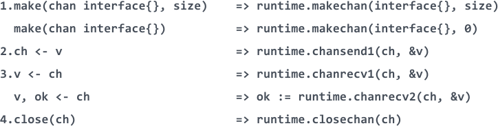
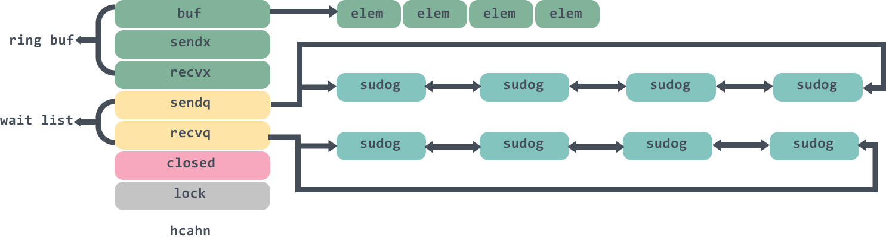
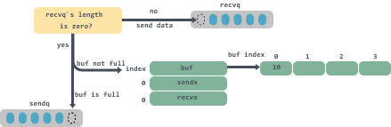

# 多图详解Go中的Channel源码

> 转载请声明出处哦~，本篇文章发布于luozhiyun的博客：https://www.luozhiyun.com
>
> 本文使用的go的源码时14.4

## chan介绍

```go
package main
import "fmt"

func main() {
    c := make(chan int)

    go func() {
        c <- 1 // send to channel
    }()

    x := <-c // recv from channel

    fmt.Println(x)
}
```

我们可以这样查看汇编结果：

```
go tool compile -N -l -S hello.go
-N表示禁用优化
-l禁用内联
-S打印结果
```

通过上面这样的方式，我们可以直到chan是调用的哪些函数：



## 源码分析

### 结构体与创建

```go
type hchan struct {
	qcount   uint           // 循环列表元素个数
	dataqsiz uint           // 循环队列的大小
	buf      unsafe.Pointer // 循环队列的指针
	elemsize uint16			// chan中元素的大小
	closed   uint32			// 是否已close
	elemtype *_type 		// chan中元素类型
	sendx    uint   		// send在buffer中的索引
	recvx    uint   		// recv在buffer中的索引
	recvq    waitq 	 		// receiver的等待队列
	sendq    waitq  		// sender的等待队列 
	// 互拆锁
	lock mutex
}
```

qcount代表chan 中已经接收但还没被取走的元素的个数，函数 len 可以返回这个字段的值；

dataqsiz和buf分别代表队列buffer的大小，cap函数可以返回这个字段的值以及队列buffer的指针，是一个定长的环形数组；

elemtype 和 elemsiz表示chan 中元素的类型和 元素的大小；

sendx：发送数据的指针在 buffer中的位置；

recvx：接收请求时的指针在 buffer 中的位置；

recvq和sendq分别表示等待接收数据的 goroutine 与等待发送数据的 goroutine；

sendq和recvq的类型是waitq的结构体：

```go
type waitq struct {
	first *sudog
	last  *sudog
}
```

waitq里面连接的是一个sudog双向链表，保存的是等待的goroutine 。整个chan的图例大概是这样：



下面看一下创建chan，我们通过汇编结果也可以查看到`make(chan int)`这句代码会调用到runtime的makechan函数中：

```go
const (
	maxAlign  = 8
	hchanSize = unsafe.Sizeof(hchan{}) + uintptr(-int(unsafe.Sizeof(hchan{}))&(maxAlign-1)) 
)

func makechan(t *chantype, size int) *hchan {
	elem := t.elem

	// 略去检查代码
	... 
    //计算需要分配的buf空间
	mem, overflow := math.MulUintptr(elem.size, uintptr(size))
	if overflow || mem > maxAlloc-hchanSize || size < 0 {
		panic(plainError("makechan: size out of range"))
	}
 
	var c *hchan
	switch {
	case mem == 0:
		// chan的size或者元素的size是0，不必创建buf
		c = (*hchan)(mallocgc(hchanSize, nil, true))
		// Race detector 
		c.buf = c.raceaddr()
	case elem.ptrdata == 0:
		// 元素不是指针，分配一块连续的内存给hchan数据结构和buf
		c = (*hchan)(mallocgc(hchanSize+mem, nil, true))
		// 表示hchan后面在内存里紧跟着就是buf
		c.buf = add(unsafe.Pointer(c), hchanSize)
	default:
		// 元素包含指针，那么单独分配buf
		c = new(hchan)
		c.buf = mallocgc(mem, elem, true)
	}

	c.elemsize = uint16(elem.size)
	c.elemtype = elem
	c.dataqsiz = uint(size)
 
	return c
}
```

首先我们可以看到计算hchanSize：

```go
	maxAlign  = 8
	hchanSize = unsafe.Sizeof(hchan{}) + uintptr(-int(unsafe.Sizeof(hchan{}))&(maxAlign-1))
```

maxAlign是8，那么maxAlign-1的二进制就是111，然后和int(unsafe.Sizeof(hchan{}))取与就是取它的低三位，hchanSize就得到的是8的整数倍，做对齐使用。

这里switch有三种情况，第一种情况是缓冲区所需大小为 0，那么在为 hchan 分配内存时，只需要分配 sizeof(hchan) 大小的内存；

第二种情况是缓冲区所需大小不为 0，而且数据类型不包含指针，那么就分配连续的内存。注意的是，我们在创建channel的时候可以指定类型为指针类型：

```go
//chan里存入的是int的指针
c := make(chan *int)
//chan里存入的是int的值
c := make(chan int)
```

第三种情况是缓冲区所需大小不为 0，而且数据类型包含指针，那么就不使用add的方式让hchan和buf放在一起了，而是单独的为buf申请一块内存。

### 发送数据

#### channel的阻塞非阻塞

在看发送数据的代码之前，我们先看一下什么是channel的阻塞和非阻塞。

一般情况下，传入的参数都是 `block=true`，即阻塞调用，一个往 channel 中插入数据的 goroutine 会阻塞到插入成功为止。

非阻塞是只这种情况：

```go
select {
case c <- v:
	... foo
default:
	... bar
}
```

编译器会将其改为：

```go
if selectnbsend(c, v) {
	... foo
} else {
	... bar
}
```

selectnbsend方法传入的block就是false：

```go
func selectnbsend(c *hchan, elem unsafe.Pointer) (selected bool) {
	return chansend(c, elem, false, getcallerpc())
}
```

#### chansend方法

向通道发送数据我们通过汇编结果可以发现是在runtime 中通过 **chansend** 实现的，方法比较长下面我们分段来进行理解：

```go
func chansend(c *hchan, ep unsafe.Pointer, block bool, callerpc uintptr) bool {
	if c == nil {
		// 对于非阻塞的发送,直接返回
		if !block {
			return false
		}
		// 对于阻塞的通道，将 goroutine 挂起
		gopark(nil, nil, waitReasonChanSendNilChan, traceEvGoStop, 2)
		throw("unreachable")
	}
	...
}
```

这里会对chan做一个判断，如果它是空的，那么对于非阻塞的发送，直接返回 false；对于阻塞的通道，将 goroutine 挂起，并且永远不会返回。

```go
func chansend(c *hchan, ep unsafe.Pointer, block bool, callerpc uintptr) bool {
	...
	// 非阻塞的情况下，如果通道没有关闭，满足以下一条：
	// 1.没有缓冲区并且当前没有接收者   
	// 2.缓冲区不为0，并且已满
	if !block && c.closed == 0 && ((c.dataqsiz == 0 && c.recvq.first == nil) ||
		(c.dataqsiz > 0 && c.qcount == c.dataqsiz)) {
		return false
	}
	...
}
```

需要注意的是这里是没有加锁的，go虽然在使用指针读取单个值的时候原子性的，但是读取多个值并不能保证，所以在判断完closed虽然是没有关闭的，那么在读取完之后依然可能在这一瞬间从未关闭状态转变成关闭状态。那么就有两种可能：

* 通道没有关闭，而且已经满了，那么需要返回false，没有问题；
* 通道关闭，而且已经满了，但是在非阻塞的发送中返回false，也没有问题；

有关go的一致性原语，可以看这篇：[The Go Memory Model](https://golang.org/ref/mem)。

上面的这些判断被称为 fast path，因为加锁的操作是一个很重的操作，所以能够在加锁之前返回的判断就在加锁之前做好是最好的。

下面接着看看加锁部分的代码：

```go
func chansend(c *hchan, ep unsafe.Pointer, block bool, callerpc uintptr) bool {
	...
	//加锁
	lock(&c.lock)
	// 是否关闭的判断
	if c.closed != 0 {
		unlock(&c.lock)
		panic(plainError("send on closed channel"))
	}
	// 从 recvq 中取出一个接收者
	if sg := c.recvq.dequeue(); sg != nil { 
		// 如果接收者存在，直接向该接收者发送数据，绕过buffer
		send(c, sg, ep, func() { unlock(&c.lock) }, 3)
		return true
	}
	...
}
```

进入了lock区域之后还需要再判断以下close的状态，然后从recvq 中取出一个接收者，如果已经有接收者，那么就向第一个接收者发送当前enqueue的消息。这里需要注意的是如果有接收者在队列中等待，则说明此时的缓冲区是空的。

既然是一行行分析代码，那么我们再进入到send看一下实现：

```go
func send(c *hchan, sg *sudog, ep unsafe.Pointer, unlockf func(), skip int) {
	...
	if sg.elem != nil {
		// 直接把要发送的数据copy到reciever的栈空间
		sendDirect(c.elemtype, sg, ep)
		sg.elem = nil
	}
	gp := sg.g
	unlockf()
	gp.param = unsafe.Pointer(sg)
	if sg.releasetime != 0 {
		sg.releasetime = cputicks()
	}
	// 唤醒对应的 goroutine
	goready(gp, skip+1)
}
```

在send方法里，sg就是goroutine打包好的对象，ep是对应要发送数据的指针，sendDirect方法会调用memmove进行数据的内存拷贝。然后goready函数会唤醒对应的 goroutine进行调度。

回到chansend方法，继续往下看：

```go
func chansend(c *hchan, ep unsafe.Pointer, block bool, callerpc uintptr) bool {
	...
	// 如果缓冲区没有满，直接将要发送的数据复制到缓冲区
	if c.qcount < c.dataqsiz {
		// 找到buf要填充数据的索引位置
		qp := chanbuf(c, c.sendx)
		...
		// 将数据拷贝到 buffer 中
		typedmemmove(c.elemtype, qp, ep)
		// 数据索引前移，如果到了末尾，又从0开始
		c.sendx++
		if c.sendx == c.dataqsiz {
			c.sendx = 0
		}
		// 元素个数加1，释放锁并返回
		c.qcount++
		unlock(&c.lock)
		return true
	}
	...
}
```

这里会判断buf缓冲区有没有满，如果没有满，那么就找到buf要填充数据的索引位置，调用typedmemmove方法将数据拷贝到buf中，然后重新设值sendx偏移量。

```go
func chansend(c *hchan, ep unsafe.Pointer, block bool, callerpc uintptr) bool {
	...
	// 缓冲区没有空间了，所以对于非阻塞调用直接返回
	if !block {
		unlock(&c.lock)
		return false
	}
	// 创建 sudog 对象
	gp := getg()
	mysg := acquireSudog()
	mysg.releasetime = 0
	if t0 != 0 {
		mysg.releasetime = -1
	}
	mysg.elem = ep
	mysg.waitlink = nil
	mysg.g = gp
	mysg.isSelect = false
	mysg.c = c
	gp.waiting = mysg
	gp.param = nil
	// 将sudog 对象入队
	c.sendq.enqueue(mysg)
	// 进入等待状态
	gopark(chanparkcommit, unsafe.Pointer(&c.lock), waitReasonChanSend, traceEvGoBlockSend, 2)
	...
}
```

这里会做两部分的操作，对于非阻塞的调用会直接返回；对于阻塞的调用会创建sudog 对象，然后将sudog对象入队之后gopark将 goroutine 转入 waiting 状态，并解锁。调用gopark之后，在使用者看来该向 channel 发送数据的代码语句会进行阻塞。

这里也需要注意一下，如果缓冲区为0，那么也会进入到这里，会调用到gopark立马阻塞，所以在使用的时候需要记得接收数据，防止向chan发送数据的那一端永远阻塞，如：

```go
func process(timeout time.Duration) bool {
    ch := make(chan bool)

    go func() {
        // 模拟处理耗时的业务
        time.Sleep((timeout + time.Second))
        ch <- true // block
        fmt.Println("exit goroutine")
    }()
    select {
    case result := <-ch:
        return result
    case <-time.After(timeout):
        return false
    }
}
```

如果这里在select的时候直接timeout返回了，而没有调用` result := <-ch`，那么goroutine 就会永远阻塞。

到这里发送的代码就讲解完了，整个流程大致如下：

比如我要执行：`ch<-10`



1. 检查 recvq 是否为空，如果不为空，则从 recvq 头部取一个 goroutine，将数据发送过去；
2. 如果 recvq 为空，，并且buf没有满，则将数据放入到 buf中；
3. 如果 buf已满，则将要发送的数据和当前 goroutine 打包成sudog，然后入队到sendq队列中，并将当前 goroutine 置为 waiting 状态进行阻塞。

### 接收数据

从chan获取数据实现函数为 chanrecv。下面我们看一下代码实现：

```go
func chanrecv(c *hchan, ep unsafe.Pointer, block bool) (selected, received bool) {
	...
	if c == nil {
		// 如果 c 为空且是非阻塞调用，那么直接返回 (false,false)
		if !block {
			return
		}
		// 阻塞调用直接等待
		gopark(nil, nil, waitReasonChanReceiveNilChan, traceEvGoStop, 2)
		throw("unreachable")
	}
	// 对于非阻塞的情况，并且没有关闭的情况
	// 如果是无缓冲chan或者是chan中没有数据，那么直接返回 (false,false)
	if !block && (c.dataqsiz == 0 && c.sendq.first == nil ||
		c.dataqsiz > 0 && atomic.Loaduint(&c.qcount) == 0) &&
		atomic.Load(&c.closed) == 0 {
		return
	}
	// 上锁
	lock(&c.lock)
	// 如果已经关闭，并且chan中没有数据，返回 (true,false)
	if c.closed != 0 && c.qcount == 0 {
		if raceenabled {
			raceacquire(c.raceaddr())
		}
		unlock(&c.lock)
		if ep != nil {
			typedmemclr(c.elemtype, ep)
		}
		return true, false
	}
	...
}
```

chanrecv方法和chansend方法是一样的，首先也是做非空判断，如果chan没有初始化，那么如果是非阻塞调用，那么直接返回 (false,false)，阻塞调用会直接等待；

下面的两个if判断我放在一起来进行讲解，因为这里和chansend是不一样的，chanrecv要根据不同条件需要返回不同的结果。

在上锁之前的判断是边界条件的判断：如果是非阻塞调用会判断chan没有发送方（dataqsiz为空且发送队列为空），或chan的缓冲为空（dataqsiz>0 并且qcount==0）并且chan是没有close，那么需要返回 (false,false)；而chan已经关闭了，并且buf中没有数据，需要返回 (true,false)；

为了实现这个需求，所以在chanrecv方法里面边界条件的判断都使用atomic方法进行了获取。

因为需要正确的得到chan已关闭，并且 buf 空会返回 （true, false），而不是 （false,false），所以在lock上锁之前需要使用atomic来获取参数防止重排序（Happens Before），因此必须使此处的 qcount 和 closed 的读取操作的顺序通过原子操作得到**顺序保障**。

```go
func chanrecv(c *hchan, ep unsafe.Pointer, block bool) (selected, received bool) {
	...
	// 从发送者队列获取数据
	if sg := c.sendq.dequeue(); sg != nil { 
		// 发送者队列不为空，直接从发送者那里提取数据
		recv(c, sg, ep, func() { unlock(&c.lock) }, 3)
		return true, true
	} 
	...
}

func recv(c *hchan, sg *sudog, ep unsafe.Pointer, unlockf func(), skip int) {
	// 如果是无缓冲区chan
	if c.dataqsiz == 0 {
		...
		if ep != nil {
			// 直接从发送者拷贝数据
			recvDirect(c.elemtype, sg, ep)
		}
	// 有缓冲区chan
	} else { 
		// 获取buf的存放数据指针
		qp := chanbuf(c, c.recvx) 
		...
		// 直接从缓冲区拷贝数据给接收者
		if ep != nil {
			typedmemmove(c.elemtype, ep, qp)
		} 
		// 从发送者拷贝数据到缓冲区
		typedmemmove(c.elemtype, qp, sg.elem)
		c.recvx++
		if c.recvx == c.dataqsiz {
			c.recvx = 0
		}
		c.sendx = c.recvx // c.sendx = (c.sendx+1) % c.dataqsiz
	}
	sg.elem = nil
	gp := sg.g
	unlockf()
	gp.param = unsafe.Pointer(sg)
	if sg.releasetime != 0 {
		sg.releasetime = cputicks()
	}
	// 将发送者唤醒
	goready(gp, skip+1)
}
```

在这里如果有发送者在队列等待，那么直接从发送者那里提取数据，并且唤醒这个发送者。需要注意的是由于有发送者在等待，**所以如果有缓冲区，那么缓冲区一定是满的**。

在唤醒发送者之前需要对缓冲区做判断，如果是无缓冲区，那么直接从发送者那里提取数据；如果有缓冲区首先会获取recvx的指针，然后将从缓冲区拷贝数据给接收者，再将发送者数据拷贝到缓冲区。

然后将recvx加1，相当于将新的数据移到了队尾，再将recvx的值赋值给sendx，最后调用goready将发送者唤醒，这里有些绕，我们通过图片来展示：


这里展示的是在chansend中将数据拷贝到缓冲区中，当数据满的时候会将sendx的指针置为0，所以当buf环形队列是满的时候sendx等于recvx。

然后再来看看chanrecv中发送者队列有数据的时候移交缓冲区的数据是怎么做的：


这里会将recvx为0处的数据直接从缓存区拷贝数据给接收者，然后将发送者拷贝数据到缓冲区recvx指针处，然后将recvx指针加1并将recvx赋值给sendx，由于是满的所以用recvx加1的效果实现了将新加入的数据入库到队尾的操作。

接着往下看：

```go
func chanrecv(c *hchan, ep unsafe.Pointer, block bool) (selected, received bool) {
	...
	// 如果缓冲区中有数据
	if c.qcount > 0 { 
		qp := chanbuf(c, c.recvx)
		...
		// 从缓冲区复制数据到 ep
		if ep != nil {
			typedmemmove(c.elemtype, ep, qp)
		}
		typedmemclr(c.elemtype, qp)
		// 接收数据的指针前移
		c.recvx++
		// 环形队列，如果到了末尾，再从0开始
		if c.recvx == c.dataqsiz {
			c.recvx = 0
		}
		// 缓冲区中现存数据减一
		c.qcount--
		unlock(&c.lock)
		return true, true
	}
	...
}
```

到了这里，说明缓冲区中有数据，但是发送者队列没有数据，那么将数据拷贝到接收数据的协程，然后将接收数据的指针前移，如果已经到了队尾，那么就从0开始，最后将缓冲区中现存数据减一并解锁。

下面就是缓冲区中没有数据的情况：

```go
func chanrecv(c *hchan, ep unsafe.Pointer, block bool) (selected, received bool) {
	...
	// 非阻塞，直接返回
	if !block {
		unlock(&c.lock)
		return false, false
	} 
	// 创建sudog
	gp := getg()
	mysg := acquireSudog()
	mysg.releasetime = 0
	if t0 != 0 {
		mysg.releasetime = -1
	} 
	mysg.elem = ep
	mysg.waitlink = nil
	gp.waiting = mysg
	mysg.g = gp
	mysg.isSelect = false
	mysg.c = c
	gp.param = nil
	// 将sudog添加到接收队列中
	c.recvq.enqueue(mysg)
	// 阻塞住goroutine，等待被唤醒
	gopark(chanparkcommit, unsafe.Pointer(&c.lock), waitReasonChanReceive, traceEvGoBlockRecv, 2)
	...
}
```

如果是非阻塞调用，直接返回；阻塞调用会将当前goroutine 封装成sudog，然后将sudog添加到接收队列中，调用gopark阻塞住goroutine，等待被唤醒。

### 关闭通道

关闭通道会调用到closechan方法：

```go
func closechan(c *hchan) {
	// 1. 校验chan是否已初始化
	if c == nil {
		panic(plainError("close of nil channel"))
	}
	// 加锁
	lock(&c.lock)
	// 如果已关闭了，那么不能被再次关闭
	if c.closed != 0 {
		unlock(&c.lock)
		panic(plainError("close of closed channel"))
	}
	...
	// 设置chan已关闭
	c.closed = 1
	// 申明一个存放g的list，用于存放在等待队列中的groutine
	var glist gList

	// 2. 获取所有接收者
	for {
		sg := c.recvq.dequeue()
		if sg == nil {
			break
		}
		if sg.elem != nil {
			typedmemclr(c.elemtype, sg.elem)
			sg.elem = nil
		}
		if sg.releasetime != 0 {
			sg.releasetime = cputicks()
		}
		gp := sg.g
		gp.param = nil
		if raceenabled {
			raceacquireg(gp, c.raceaddr())
		}
		// 加入队列中
		glist.push(gp)
	}

	// 获取所有发送者
	for {
		sg := c.sendq.dequeue()
		if sg == nil {
			break
		}
		sg.elem = nil
		if sg.releasetime != 0 {
			sg.releasetime = cputicks()
		}
		gp := sg.g
		gp.param = nil
		if raceenabled {
			raceacquireg(gp, c.raceaddr())
		}
		// 加入队列中
		glist.push(gp)
	}
	unlock(&c.lock)

	// 3.唤醒所有的glist中的goroutine 
	for !glist.empty() {
		gp := glist.pop()
		gp.schedlink = 0
		goready(gp, 3)
	}
}
 
```

1. 这个方法首先会校验chan是否已被初始化，然后加锁之后再校验是否已被关闭过，如果校验都通过了，那么将closed字段设值为1；
2. 遍历所有的接收者和发送者，并将其goroutine 加入到glist中；
3. 将所有glist中的goroutine加入调度队列，等待被唤醒，这里需要注意的是发送者在被唤醒之后会panic；

## 总结

chan在go中是一个非常强大的工具，使用它可以实现很多功能，但是为了能够高效的使用它，我们也应该去了解里面是如何实现的。这篇文章通过一步步分析从零开始了解go的chan是如何实现的，以及在使用过程中有什么需要注意的事项，chan的buf环形队列是怎样维护的，希望能对你有所帮助~

## Reference

https://speakerdeck.com/kavya719/understanding-channels

https://golang.org/ref/mem

https://github.com/talkgo/night/issues/450

https://codeburst.io/diving-deep-into-the-golang-channels-549fd4ed21a8