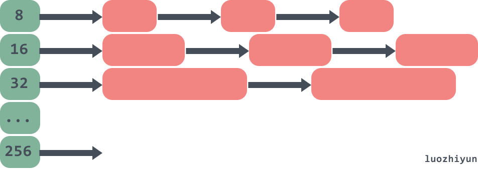
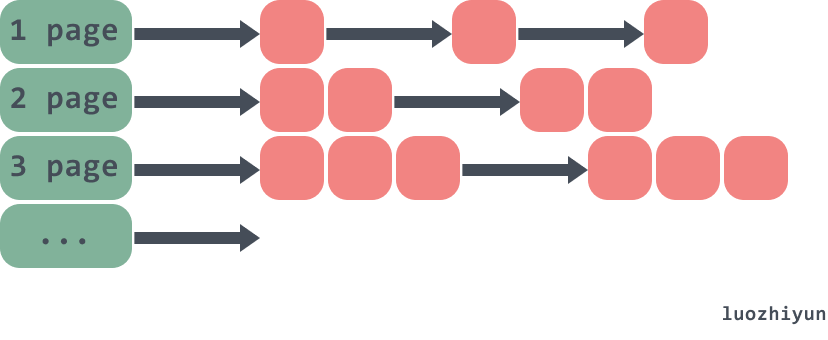
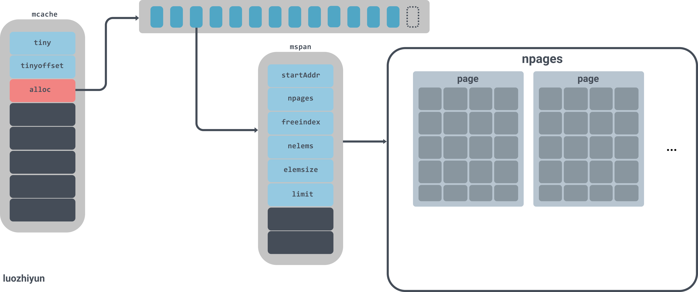
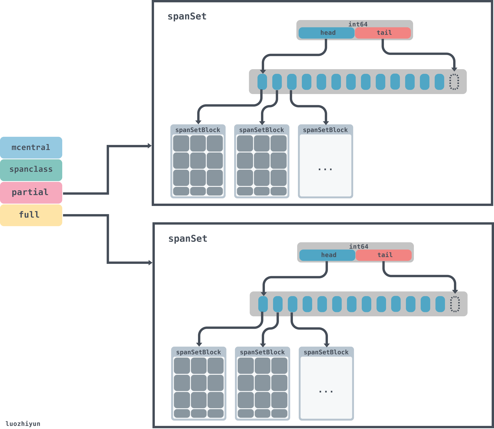
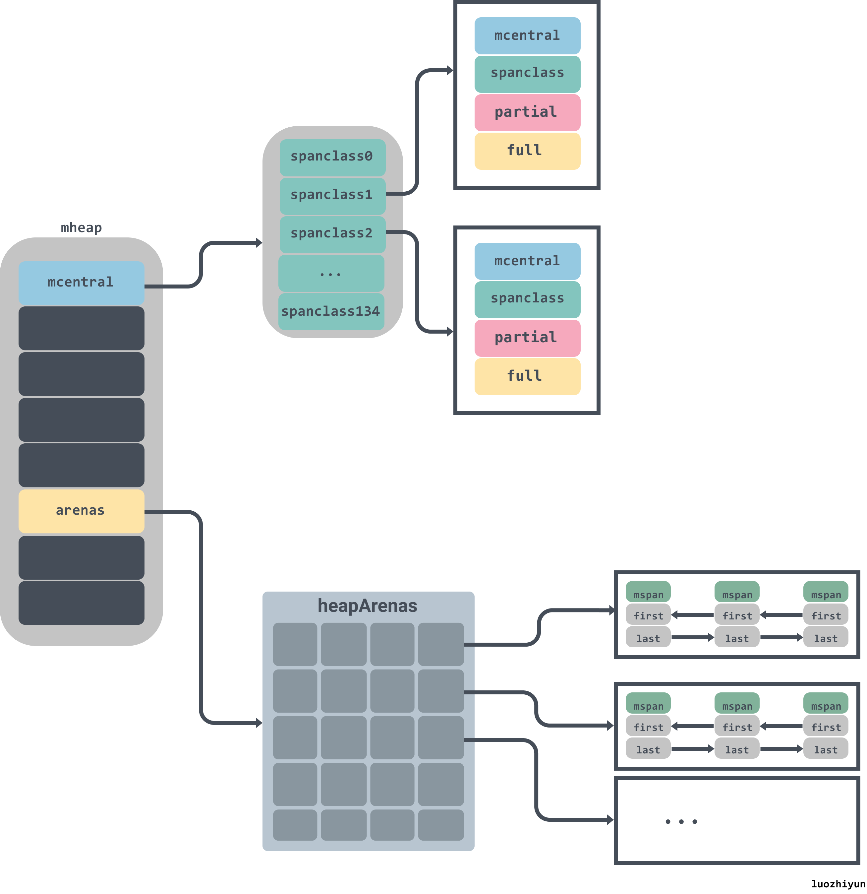
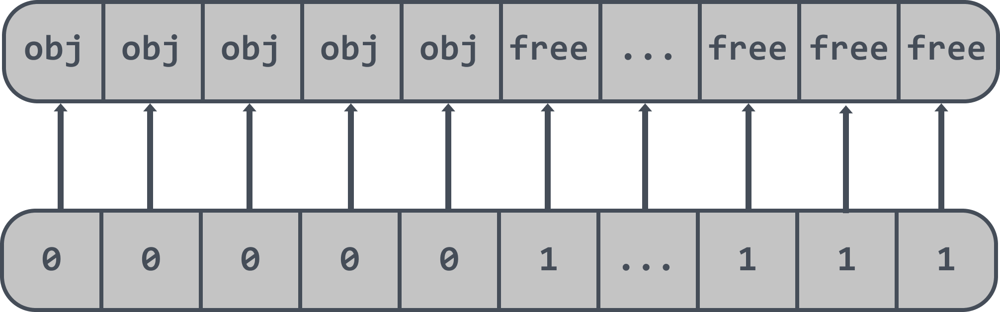
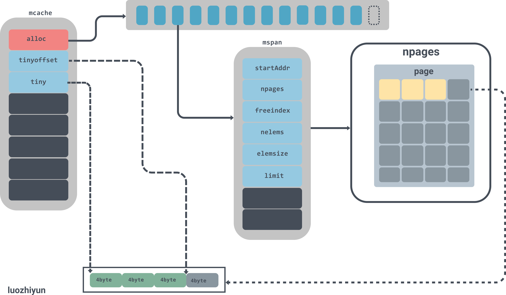

# 详解Go中内存分配源码实现

> 转载请声明出处哦~，本篇文章发布于luozhiyun的博客：https://www.luozhiyun.com
>
> 本文使用的go的源码15.7

## 介绍

Go 语言的内存分配器就借鉴了 TCMalloc 的设计实现高速的内存分配，它的核心理念是使用多级缓存将对象根据大小分类，并按照类别实施不同的分配策略。TCMalloc 相关的信息可以看这里：http://goog-perftools.sourceforge.net/doc/tcmalloc.html。

 即如果要分配的对象是个小对象（<= 32k），在每个线程中都会有一个无锁的小对象缓存，可以直接高效的无锁的方式进行分配；

如下：对象被分到不同的内存大小组中的链表中。



如果是个大对象（>32k），那么页堆进行分配。如下：



虽然go内存分配器最初是基于tcmalloc的，但是现在已经有了很大的不同。所以上面的一些结构会有些许变化，下面再慢慢絮叨。

因为内存分配的源码比较复杂，为了方便大家调试，所以在进行源码分析之前，先看看是如何断点汇编来进行调试的。

### 断点调试汇编

目前Go语言支持GDB、LLDB和Delve几种调试器。只有Delve是专门为Go语言设计开发的调试工具。而且Delve本身也是采用Go语言开发，对Windows平台也提供了一样的支持。本节我们基于Delve简单解释如何调试Go汇编程序。项目地址：https://github.com/go-delve/delve

安装：

```
go get github.com/go-delve/delve/cmd/dlv
```

首先编写一个test.go的一个例子：

```go
package main

import "fmt"

type A struct {
	test string
}
func main() {
	a := new(A)
	fmt.Println(a)
}
```

然后命令行进入包所在目录，然后输入`dlv debug`命令进入调试：

```powershell
PS C:\document\code\test_go\src> dlv debug
Type 'help' for list of commands.
```

然后可以使用break命令在main包的main方法上设置一个断点：

```powershell
(dlv) break main.main
Breakpoint 1 set at 0x4bd30a for main.main() c:/document/code/test_go/src/test.go:8
```

通过breakpoints查看已经设置的所有断点：

```powershell
(dlv) breakpoints
Breakpoint runtime-fatal-throw at 0x4377e0 for runtime.fatalthrow() c:/software/go/src/runtime/panic.go:1162 (0)
Breakpoint unrecovered-panic at 0x437860 for runtime.fatalpanic() c:/software/go/src/runtime/panic.go:1189 (0)
        print runtime.curg._panic.arg
Breakpoint 1 at 0x4bd30a for main.main() c:/document/code/test_go/src/test.go:8 (0)
```

通过continue命令让程序运行到下一个断点处：

```powershell
(dlv) continue
> main.main() c:/document/code/test_go/src/test.go:8 (hits goroutine(1):1 total:1) (PC: 0x4bd30a)
     3: import "fmt"
     4:
     5: type A struct {
     6:         test string
     7: }
=>   8: func main() {
     9:         a := new(A)
    10:         fmt.Println(a)
    11: }
    12:
    13:
```

通过disassemble反汇编命令查看main函数对应的汇编代码：

```powershell
(dlv) disassemble
TEXT main.main(SB) C:/document/code/test_go/src/test.go
        test.go:8       0x4bd2f0        65488b0c2528000000      mov rcx, qword ptr gs:[0x28]
        test.go:8       0x4bd2f9        488b8900000000          mov rcx, qword ptr [rcx]
        test.go:8       0x4bd300        483b6110                cmp rsp, qword ptr [rcx+0x10]
        test.go:8       0x4bd304        0f8697000000            jbe 0x4bd3a1
=>      test.go:8       0x4bd30a*       4883ec78                sub rsp, 0x78
        test.go:8       0x4bd30e        48896c2470              mov qword ptr [rsp+0x70], rbp
        test.go:8       0x4bd313        488d6c2470              lea rbp, ptr [rsp+0x70]
        test.go:9       0x4bd318        488d0581860100          lea rax, ptr [__image_base__+874912]
        test.go:9       0x4bd31f        48890424                mov qword ptr [rsp], rax
        test.go:9       0x4bd323        e8e800f5ff              call $runtime.newobject
        test.go:9       0x4bd328        488b442408              mov rax, qword ptr [rsp+0x8]
        test.go:9       0x4bd32d        4889442430              mov qword ptr [rsp+0x30], rax
        test.go:10      0x4bd332        4889442440              mov qword ptr [rsp+0x40], rax
        test.go:10      0x4bd337        0f57c0                  xorps xmm0, xmm0
        test.go:10      0x4bd33a        0f11442448              movups xmmword ptr [rsp+0x48], xmm0
        test.go:10      0x4bd33f        488d442448              lea rax, ptr [rsp+0x48]
        test.go:10      0x4bd344        4889442438              mov qword ptr [rsp+0x38], rax
        test.go:10      0x4bd349        8400                    test byte ptr [rax], al
        test.go:10      0x4bd34b        488b4c2440              mov rcx, qword ptr [rsp+0x40]
        test.go:10      0x4bd350        488d15099f0000          lea rdx, ptr [__image_base__+815712]
        test.go:10      0x4bd357        4889542448              mov qword ptr [rsp+0x48], rdx
        test.go:10      0x4bd35c        48894c2450              mov qword ptr [rsp+0x50], rcx
        test.go:10      0x4bd361        8400                    test byte ptr [rax], al
        test.go:10      0x4bd363        eb00                    jmp 0x4bd365
        test.go:10      0x4bd365        4889442458              mov qword ptr [rsp+0x58], rax
        test.go:10      0x4bd36a        48c744246001000000      mov qword ptr [rsp+0x60], 0x1
        test.go:10      0x4bd373        48c744246801000000      mov qword ptr [rsp+0x68], 0x1
        test.go:10      0x4bd37c        48890424                mov qword ptr [rsp], rax
        test.go:10      0x4bd380        48c744240801000000      mov qword ptr [rsp+0x8], 0x1
        test.go:10      0x4bd389        48c744241001000000      mov qword ptr [rsp+0x10], 0x1
        test.go:10      0x4bd392        e869a0ffff              call $fmt.Println
        test.go:11      0x4bd397        488b6c2470              mov rbp, qword ptr [rsp+0x70]
        test.go:11      0x4bd39c        4883c478                add rsp, 0x78
        test.go:11      0x4bd3a0        c3                      ret
        test.go:8       0x4bd3a1        e82a50faff              call $runtime.morestack_noctxt
        .:0             0x4bd3a6        e945ffffff              jmp $main.main
```

现在我们可以使用break断点到runtime.newobject函数的调用上：

```powershell
(dlv) break runtime.newobject
Breakpoint 2 set at 0x40d426 for runtime.newobject() c:/software/go/src/runtime/malloc.go:1164
```

输入continue跳到断点的位置：

```powershell
(dlv) continue
> runtime.newobject() c:/software/go/src/runtime/malloc.go:1164 (hits goroutine(1):1 total:1) (PC: 0x40d426)
Warning: debugging optimized function
  1159: }
  1160:
  1161: // implementation of new builtin
  1162: // compiler (both frontend and SSA backend) knows the signature
  1163: // of this function
=>1164: func newobject(typ *_type) unsafe.Pointer {
  1165:         return mallocgc(typ.size, typ, true)
  1166: }
  1167:
  1168: //go:linkname reflect_unsafe_New reflect.unsafe_New
  1169: func reflect_unsafe_New(typ *_type) unsafe.Pointer {
```

print命令来查看typ的数据：

```powershell
(dlv) print typ
*runtime._type {size: 16, ptrdata: 8, hash: 875453117, tflag: tflagUncommon|tflagExtraStar|tflagNamed (7), align: 8, fieldAlign: 8, kind: 25, equal: runtime.strequal, gcdata: *1, str: 5418, ptrToThis: 37472}
```

可以看到这里打印的size是16bytes，因为我们A结构体里面就一个string类型的field。

进入到mallocgc方法后，通过args和locals命令查看函数的参数和局部变量：

```powershell
(dlv) args
size = (unreadable could not find loclist entry at 0x8b40 for address 0x40ca73)
typ = (*runtime._type)(0x4d59a0)
needzero = true
~r3 = (unreadable empty OP stack)
(dlv) locals
(no locals)
```

### 各个对象入口

我们根据汇编可以判断，所有的函数入口都是`runtime.mallocgc`，但是下面两个对象需要注意一下：

### int64对象

`runtime.convT64`

```go
func convT64(val uint64) (x unsafe.Pointer) {
	if val < uint64(len(staticuint64s)) {
		x = unsafe.Pointer(&staticuint64s[val])
	} else {
		x = mallocgc(8, uint64Type, false)
		*(*uint64)(x) = val
	}
	return
}
```

这段代码表示如果一个int64类型的值小于256，直接十三姨的是缓存值，那么这个值不会进行内存分配。

### string对象

`runtime.convTstring`

```go
func convTstring(val string) (x unsafe.Pointer) {
	if val == "" {
		x = unsafe.Pointer(&zeroVal[0])
	} else {
		x = mallocgc(unsafe.Sizeof(val), stringType, true)
		*(*string)(x) = val
	}
	return
}
```

由这段代码显示，如果是创建一个为”“的string对象，那么会直接返回一个固定的地址值，不会进行内存分配。

### 调试用例

大家在调试的时候也可以使用下面的例子来进行调试，因为go里面的对象分配是分为大对象、小对象、微对象的，所以下面准备了三个方法分别对应三种对象的创建时的调试。

```go
type smallobj struct {
	arr [1 << 10]byte
}

type largeobj struct {
	arr [1 << 26]byte
}

func tiny()   {
	y := 100000
	fmt.Println(y)
}

func large() {
	large := largeobj{}
	println(&large)
}

func small() {
	small := smallobj{}
	print(&small)
}

func main() {
	//tiny()
	//small()
	//large() 
}
```

## 分析

### 分配器的组件

内存分配是由内存分配器完成，分配器由3种组件构成：`runtime.mspan`、`runtime.mcache`、`runtime.mcentral`、`runtime.mheap`。

**runtime.mspan**

```go
type mspan struct {
	// 上一个节点
	next *mspan     
	// 下一个节点
	prev *mspan      
	// span集合
	list *mSpanList  
	// span开始的地址值
	startAddr uintptr  
	// span管理的页数
	npages    uintptr  
 
	// Object n starts at address n*elemsize + (start << pageShift).
	// 空闲节点的索引
	freeindex uintptr 
	// span中存放的对象数量
	nelems uintptr  
 
	// 用于快速查找内存中未被使用的内存
	allocCache uint64 
  // 用于计算mspan管理了多少内存
  elemsize    uintptr
  // span的结束地址值
  limit       uintptr
  
	...
}
```

`runtime.mspan`是内存管理器里面的最小粒度单元，所有的对象都是被管理在mspan下面。

mspan是一个链表，有上下指针；

npages代表mspan管理的堆页的数量；

freeindex是空闲对象的索引；

nelems代表这个mspan中可以存放多少对象，等于`(npages * pageSize)/elemsize`；

allocCache用于快速的查找未被使用的内存地址；

elemsize表示一个对象会占用多个个bytes，等于`class_to_size[sizeclass]`，需要注意的是sizeclass每次获取的时候会sizeclass方法，将`sizeclass>>1`；

limit表示span结束的地址值，等于`startAddr+ npages*pageSize`；

实例图如下：



图中alloc是一个拥有137个元素的mspan数组，mspan数组管理数个page大小的内存，每个page是8k，page的数量由spanclass规格决定。

**runtime.mcache**

```go
type mcache struct { 
	...
	// 申请小对象的起始地址
	tiny             uintptr
	// 从起始地址tiny开始的偏移量
	tinyoffset       uintptr
	// tiny对象分配的数量
	local_tinyallocs uintptr // number of tiny allocs not counted in other stats
	// mspan对象集合，numSpanClasses=134
	alloc [numSpanClasses]*mspan // spans to allocate from, indexed by spanClass
	...
}
```

`runtime.mcache`是绑在并发模型GPM的P上，在分配微对象和小对象的时候会先去`runtime.mcache`中获取，每一个处理器都会被分配一个线程缓存`runtime.mcache`，因此从`runtime.mcache`进行分配时无需加锁。

在`runtime.mcache`中有一个alloc数组，是`runtime.mspan`的集合，`runtime.mspan`是 Go 语言内存管理的基本单元。对于[16B,32KB]的对象会使用这部分span进行内存分配，所以所有在这区间大小的对象都会从alloc这个数组里寻找，下面会分析到。

**runtime.mcentral**

```go
type mcentral struct { 
	//spanClass Id
	spanclass spanClass
	// 空闲的span列表
	partial [2]spanSet // list of spans with a free object
	// 已经被使用的span列表
	full    [2]spanSet // list of spans with no free objects

	//分配mspan的累积计数
	nmalloc uint64
} 
```

当`runtime.mcache`中空间不足的时候，会去`runtime.mcentral`中申请对应规格的mspan。获取mspan的时候会从partial列表和full列表中获取，获取的时候会使用无锁的方式获取。

在`runtime.mcentral`中，有spanclass标识，spanclass表示这个mcentral的类型，下面我们会看到，在分配[16B,32KB]大小对象的时候，会将对象的大小分成67组：

```go
var class_to_size = [_NumSizeClasses]uint16{0, 8, 16, 32, 48, 64, 80, 96, 112, 128, 144, 160, 176, 192, 208, 224, 240, 256, 288, 320, 352, 384, 416, 448, 480, 512, 576, 640, 704, 768, 896, 1024, 1152, 1280, 1408, 1536, 1792, 2048, 2304, 2688, 3072, 3200, 3456, 4096, 4864, 5376, 6144, 6528, 6784, 6912, 8192, 9472, 9728, 10240, 10880, 12288, 13568, 14336, 16384, 18432, 19072, 20480, 21760, 24576, 27264, 28672, 32768}
```

所以`runtime.mcentral`只负责一种spanclass规格类型。

`runtime.mcentral`的数据会由两个spanSet托管，partial负责空闲的列表，full负责已被使用的列表。

```go
type headTailIndex uint64

type spanSet struct { 
	// lock
	spineLock mutex
	// 数据块的指针
	spine     unsafe.Pointer // *[N]*spanSetBlock, accessed atomically
	// len
	spineLen  uintptr        // Spine array length, accessed atomically
	// cap
	spineCap  uintptr        // Spine array cap, accessed under lock

	// 头尾的指针，前32位是头指针，后32位是尾指针
	index headTailIndex
}
```

spanSet这个数据结构里面有一个由index组成的头尾指针，pop数据的时候会从头获取，push数据的时候从tail放入，spine相当于数据块的指针，通过head和tail的位置可以算出每个数据块的具体位置，数据块由spanSetBlock表示：

```go
const spanSetBlockEntries = 512
type spanSetBlock struct {
	...
	spans [spanSetBlockEntries]*mspan
}
```

spanSetBlock是一个存放mspan的数据块，里面会包含一个存放512个mspan的数据指针。所以mcentral的总体数据结构如下：




**runtime.mheap**

```go
type mheap struct { 
	lock      mutex
	pages     pageAlloc // page allocation data structure 
	
	//arenas数组集合,一个二维数组
	arenas [1 << arenaL1Bits]*[1 << arenaL2Bits]*heapArena

	//各个规格的mcentral集合
	central [numSpanClasses]struct {
		mcentral mcentral
		pad      [cpu.CacheLinePadSize - unsafe.Sizeof(mcentral{})%cpu.CacheLinePadSize]byte
	}
	...
}
```

对于`runtime.mheap`需要关注central和arenas。central是各个规格的mcentral集合，在初始化的时候会通过遍历class_to_size来进行创建；arenas是一个二维数组，用来管理内存空间。arenas由多个`runtime.heapArena`组成，每个单元都会管理 64MB 的内存空间：

```go
const (
	pageSize             = 8192                       // 8KB
	heapArenaBytes       = 67108864                   // 64MB 
	pagesPerArena        = heapArenaBytes / pageSize  // 8192
)

type heapArena struct {
	bitmap [heapArenaBitmapBytes]byte
	spans [pagesPerArena]*mspan
	pageInUse [pagesPerArena / 8]uint8
	pageMarks [pagesPerArena / 8]uint8
	zeroedBase uintptr
}
```

需要注意的是，上面的heapArenaBytes代表的64M只是在除windows以外的 64 位机器才会显示，在windows机器上显示的是4MB。具体的可以看下面的官方注释：

```go
	//       Platform  Addr bits  Arena size  L1 entries   L2 entries
	// --------------  ---------  ----------  ----------  -----------
	//       */64-bit         48        64MB           1    4M (32MB)
	// windows/64-bit         48         4MB          64    1M  (8MB)
	//       */32-bit         32         4MB           1  1024  (4KB)
	//     */mips(le)         31         4MB           1   512  (2KB)
```

L1 entries、L2 entries分别代表的是`runtime.mheap`中arenas一维、二维的值。



### 给对象分配内存

我们通过对源码的反编译可以知道，堆上所有的对象都会通过调用`runtime.newobject`函数分配内存，该函数会调用`runtime.mallocgc`:

```go
//创建一个新的对象
func newobject(typ *_type) unsafe.Pointer {
    //size表示该对象的大小
	return mallocgc(typ.size, typ, true)
}

func mallocgc(size uintptr, typ *_type, needzero bool) unsafe.Pointer { 
	...  
	dataSize := size
	// 获取mcache，用于处理微对象和小对象的分配
	c := gomcache()
	var x unsafe.Pointer
	// 表示对象是否包含指针，true表示对象里没有指针
	noscan := typ == nil || typ.ptrdata == 0
	// maxSmallSize=32768 32k
	if size <= maxSmallSize {
		// maxTinySize= 16 bytes 
		if noscan && size < maxTinySize {
			...
		} else {
			...
		}
		// 大于 32 Kb 的内存分配,通过 mheap 分配
	} else {
		...
	} 
	... 
	return x
}
```

通过mallocgc的代码可以知道，mallocgc在分配内存的时候，会按照对象的大小分为3档来进行分配：

1. 小于16bytes的小对象；
2. 在16bytes与32k之间的微对象；
3. 大于 32 Kb的大对象；

### 大对象分配

```go
func mallocgc(size uintptr, typ *_type, needzero bool) unsafe.Pointer { 
	...  
	var s *mspan
	shouldhelpgc = true
	systemstack(func() {
		s = largeAlloc(size, needzero, noscan)
	})
	s.freeindex = 1
	s.allocCount = 1
	x = unsafe.Pointer(s.base())
	size = s.elemsize
	... 
	return x
}
```

从上面我们可以看到分配大于32KB的空间时，直接使用largeAlloc来分配一个mspan。

```go
func largeAlloc(size uintptr, needzero bool, noscan bool) *mspan {
	// _PageSize=8k,也就是表明对象太大，溢出
	if size+_PageSize < size {
		throw("out of memory")
	}
	// _PageShift==13，计算需要分配的页数
	npages := size >> _PageShift
	// 如果不是整数，多出来一些，需要加1
	if size&_PageMask != 0 {
		npages++
	} 
	...
	// 从堆上分配
	s := mheap_.alloc(npages, makeSpanClass(0, noscan), needzero)
	if s == nil {
		throw("out of memory")
	}
	...
	return s
}
```

在分配内存的时候是按页来进行分配的，每个页的大小是_PageSize（8K），然后需要根据传入的size来判断需要分多少页，最后调用alloc从堆上分配。

```go
func (h *mheap) alloc(npages uintptr, spanclass spanClass, needzero bool) *mspan {
	var s *mspan
	systemstack(func() { 
		if h.sweepdone == 0 {
			// 回收一部分内存
			h.reclaim(npages)
		}
		// 进行内存分配
		s = h.allocSpan(npages, false, spanclass, &memstats.heap_inuse)
	}) 
	...
	return s
}
```

继续看allocSpan的实现：

```go
const pageCachePages = 8 * unsafe.Sizeof(pageCache{}.cache)

func (h *mheap) allocSpan(npages uintptr, manual bool, spanclass spanClass, sysStat *uint64) (s *mspan) {
	// Function-global state.
	gp := getg()
	base, scav := uintptr(0), uintptr(0)
 
	pp := gp.m.p.ptr()
	// 申请的内存比较小,尝试从pcache申请内存
	if pp != nil && npages < pageCachePages/4 {
		c := &pp.pcache
 
		if c.empty() {
			lock(&h.lock)
			*c = h.pages.allocToCache()
			unlock(&h.lock)
		} 

		base, scav = c.alloc(npages)
		if base != 0 {
			s = h.tryAllocMSpan()

			if s != nil && gcBlackenEnabled == 0 && (manual || spanclass.sizeclass() != 0) {
				goto HaveSpan
			} 
		}
	} 
	lock(&h.lock)
	// 内存比较大或者线程的页缓存中内存不足，从mheap的pages上获取内存
	if base == 0 { 
		base, scav = h.pages.alloc(npages)
		// 内存也不够，那么进行扩容
		if base == 0 {
			if !h.grow(npages) {
				unlock(&h.lock)
				return nil
			}
			// 重新申请内存
			base, scav = h.pages.alloc(npages)
			// 内存不足，抛出异常
			if base == 0 {
				throw("grew heap, but no adequate free space found")
			}
		}
	}
	if s == nil { 
		// 分配一个mspan对象
		s = h.allocMSpanLocked()
	}
 
	unlock(&h.lock)

HaveSpan: 
	// 设置参数初始化
	s.init(base, npages) 
	...
	// 建立mheap与mspan之间的联系
	h.setSpans(s.base(), npages, s)
	...
	return s
}
```

这里会根据需要分配的内存大小再判断一次：

* 如果要分配的页数小于`pageCachePages/4=64/4=16`页，那么就尝试从pcache申请内存；
* 如果申请的内存比较大或者线程的页缓存中内存不足，会通过`runtime.pageAlloc.alloc`从页堆分配内存；
* 如果页堆上内存不足，那么就mheap的grow方法从系统上申请内存，然后再调用pageAlloc的alloc分配内存；

下面来看看grow的向操作系统申请内存：

```go
func (h *mheap) grow(npage uintptr) bool {
	// We must grow the heap in whole palloc chunks.
	ask := alignUp(npage, pallocChunkPages) * pageSize

	totalGrowth := uintptr(0)
	nBase := alignUp(h.curArena.base+ask, physPageSize)
	// 内存不够则调用sysAlloc申请内存
	if nBase > h.curArena.end { 
		av, asize := h.sysAlloc(ask)
		if av == nil {
			print("runtime: out of memory: cannot allocate ", ask, "-byte block (", memstats.heap_sys, " in use)\n")
			return false
		}
		// 重新设置curArena的值
		if uintptr(av) == h.curArena.end { 
			h.curArena.end = uintptr(av) + asize
		} else { 
			if size := h.curArena.end - h.curArena.base; size != 0 {
				h.pages.grow(h.curArena.base, size)
				totalGrowth += size
			} 
			h.curArena.base = uintptr(av)
			h.curArena.end = uintptr(av) + asize
		} 
		nBase = alignUp(h.curArena.base+ask, physPageSize)
	} 
	...
	return true
}
```

grow会通过curArena的end值来判断是不是需要从系统申请内存；如果end小于nBase那么会调用`runtime.mheap.sysAlloc`方法从操作系统中申请更多的内存；

```go
func (h *mheap) sysAlloc(n uintptr) (v unsafe.Pointer, size uintptr) {
	n = alignUp(n, heapArenaBytes)
 
	// 在预先保留的内存中申请一块可以使用的空间
	v = h.arena.alloc(n, heapArenaBytes, &memstats.heap_sys)
	if v != nil {
		size = n
		goto mapped
	} 
	// 根据页堆的arenaHints在目标地址上尝试扩容
	for h.arenaHints != nil {
		hint := h.arenaHints
		p := hint.addr
		if hint.down {
			p -= n
		}
		if p+n < p {
			// We can't use this, so don't ask.
			v = nil
		} else if arenaIndex(p+n-1) >= 1<<arenaBits {
			// Outside addressable heap. Can't use.
			v = nil
		} else {
			// 从操作系统中申请内存
			v = sysReserve(unsafe.Pointer(p), n)
		}
		if p == uintptr(v) {
			// Success. Update the hint.
			if !hint.down {
				p += n
			}
			hint.addr = p
			size = n
			break
		} 
		if v != nil {
			sysFree(v, n, nil)
		}
		h.arenaHints = hint.next
		h.arenaHintAlloc.free(unsafe.Pointer(hint))
	}  
	...
	// 将内存由Reserved转为Prepared
	sysMap(v, size, &memstats.heap_sys)

mapped:
	// Create arena metadata.
	// 初始化一个heapArena来管理刚刚申请的内存
	for ri := arenaIndex(uintptr(v)); ri <= arenaIndex(uintptr(v)+size-1); ri++ {
		l2 := h.arenas[ri.l1()]
		if l2 == nil { 
			l2 = (*[1 << arenaL2Bits]*heapArena)(persistentalloc(unsafe.Sizeof(*l2), sys.PtrSize, nil))
			if l2 == nil {
				throw("out of memory allocating heap arena map")
			}
			atomic.StorepNoWB(unsafe.Pointer(&h.arenas[ri.l1()]), unsafe.Pointer(l2))
		}  
		var r *heapArena
		r = (*heapArena)(h.heapArenaAlloc.alloc(unsafe.Sizeof(*r), sys.PtrSize, &memstats.gc_sys))
		...  
		// 将创建heapArena放入到arenas列表中
		h.allArenas = h.allArenas[:len(h.allArenas)+1]
		h.allArenas[len(h.allArenas)-1] = ri
		atomic.StorepNoWB(unsafe.Pointer(&l2[ri.l2()]), unsafe.Pointer(r))
	}
	return
}
```

sysAlloc方法会调用`runtime.linearAlloc.alloc`预先保留的内存中申请一块可以使用的空间；如果没有会调用sysReserve方法会从操作系统中申请内存；最后初始化一个heapArena来管理刚刚申请的内存，然后将创建heapArena放入到arenas列表中。

至此，大对象的分配流程至此结束。

### 小对象分配

对于介于16bytes~32K的对象分配如下：

```go
func mallocgc(size uintptr, typ *_type, needzero bool) unsafe.Pointer {
	...
	dataSize := size
	// 获取mcache，用于处理微对象和小对象的分配
	c := gomcache()
	var x unsafe.Pointer
	// 表示对象是否包含指针，true表示对象里没有指针
	noscan := typ == nil || typ.ptrdata == 0
	// maxSmallSize=32768 32k
	if size <= maxSmallSize {
		// maxTinySize= 16 bytes 
		if noscan && size < maxTinySize { 
			...
		} else {
			var sizeclass uint8
			//计算 sizeclass
			// smallSizeMax=1024
			if size <= smallSizeMax-8 {
				// smallSizeDiv=8
				sizeclass = size_to_class8[(size+smallSizeDiv-1)/smallSizeDiv]
			} else {
				// largeSizeDiv=128,smallSizeMax = 1024
				sizeclass = size_to_class128[(size-smallSizeMax+largeSizeDiv-1)/largeSizeDiv]
			}
			size = uintptr(class_to_size[sizeclass])
			spc := makeSpanClass(sizeclass, noscan)
			span := c.alloc[spc]
			//从对应的 span 里面分配一个 object 
			v := nextFreeFast(span)
			if v == 0 {
				// mcache不够用了，则从 mcentral 申请内存到 mcache
				v, span, shouldhelpgc = c.nextFree(spc)
			}
			x = unsafe.Pointer(v)
			if needzero && span.needzero != 0 {
				memclrNoHeapPointers(unsafe.Pointer(v), size)
			}
		} 
		...
	}  
	...
	return x
}
```

首先会先计算sizeclass 大小，计算 sizeclass 是通过预先定义两个数组：size_to_class8 和 size_to_class128。小于 1024 - 8 = 1016 （smallSizeMax=1024），使用 size_to_class8，否则使用数组 size_to_class128。

举个例子，比如要分配 20 byte 的内存，那么sizeclass = size_to_calss8[(20+7)/8] = size_to_class8[3] = 3。然后通过class_to_size[3]获取到对应的值32，表示应该要分配32bytes的内存值。

接着会从alloc数组中获取一个span的指针，通过调用nextFreeFast尝试从mcache中获取内存，如果mcache不够用了，则尝试调用nextFree从 mcentral 申请内存到 mcache。 

下面看看nextFreeFast：

```go
func nextFreeFast(s *mspan) gclinkptr {
    // 获取allocCache二进制中0的个数
	theBit := sys.Ctz64(s.allocCache) // Is there a free object in the allocCache?
	if theBit < 64 {
		result := s.freeindex + uintptr(theBit)
		if result < s.nelems {
			freeidx := result + 1
			if freeidx%64 == 0 && freeidx != s.nelems {
				return 0
			}
			s.allocCache >>= uint(theBit + 1)
			s.freeindex = freeidx
			s.allocCount++
			return gclinkptr(result*s.elemsize + s.base())
		}
	}
	return 0
}
```

allocCache在初始化的时候会初始化成`^uint64(0)`，换算成二进制，如果为0则表示被占用，通过allocCache可以快速的定位待分配的空间：



```go
func (c *mcache) nextFree(spc spanClass) (v gclinkptr, s *mspan, shouldhelpgc bool) {
	s = c.alloc[spc]
	shouldhelpgc = false
	// 当前span中找到合适的index索引
	freeIndex := s.nextFreeIndex()
	// 当前span已经满了
	if freeIndex == s.nelems { 
		if uintptr(s.allocCount) != s.nelems {
			println("runtime: s.allocCount=", s.allocCount, "s.nelems=", s.nelems)
			throw("s.allocCount != s.nelems && freeIndex == s.nelems")
		}
		// 从 mcentral 中获取可用的span，并替换掉当前 mcache里面的span
		c.refill(spc)
		shouldhelpgc = true
		s = c.alloc[spc]
		// 再次到新的span里面查找合适的index
		freeIndex = s.nextFreeIndex()
	}

	if freeIndex >= s.nelems {
		throw("freeIndex is not valid")
	}
	// 计算出来内存地址，并更新span的属性
	v = gclinkptr(freeIndex*s.elemsize + s.base())
	s.allocCount++
	if uintptr(s.allocCount) > s.nelems {
		println("s.allocCount=", s.allocCount, "s.nelems=", s.nelems)
		throw("s.allocCount > s.nelems")
	}
	return
}
```

nextFree中会判断当前span是不是已经满了，如果满了就调用refill方法从 mcentral 中获取可用的span，并替换掉当前 mcache里面的span。

```go
func (c *mcache) refill(spc spanClass) { 
	s := c.alloc[spc]
	...
	s = mheap_.central[spc].mcentral.cacheSpan()
	if s == nil {
		throw("out of memory")
	} 
	...
	c.alloc[spc] = s
}
```

Refill 根据指定的sizeclass获取对应的span，并作为 mcache的新的sizeclass对应的span。

```go
func (c *mcentral) cacheSpan() *mspan {
	...
	sg := mheap_.sweepgen
	spanBudget := 100

	var s *mspan
 
	// 从清理过的、包含空闲空间的spanSet结构中查找可以使用的内存管理单元
	if s = c.partialSwept(sg).pop(); s != nil {
		goto havespan
	} 
	for ; spanBudget >= 0; spanBudget-- {
		// 从未被清理过的、有空闲对象的spanSet查找可用的span
		s = c.partialUnswept(sg).pop()
		if s == nil {
			break
		}
		if atomic.Load(&s.sweepgen) == sg-2 && atomic.Cas(&s.sweepgen, sg-2, sg-1) {
			// 找到要回收的span，触发sweep进行清理
			s.sweep(true)
			goto havespan
		}
	}
	for ; spanBudget >= 0; spanBudget-- {
		// 获取未被清理的、不包含空闲空间的spanSet查找可用的span
		s = c.fullUnswept(sg).pop()
		if s == nil {
			break
		}
		if atomic.Load(&s.sweepgen) == sg-2 && atomic.Cas(&s.sweepgen, sg-2, sg-1) {
			s.sweep(true)
			freeIndex := s.nextFreeIndex()
			if freeIndex != s.nelems {
				s.freeindex = freeIndex
				goto havespan
			}
			c.fullSwept(sg).push(s)
		}
	}
	// 从堆中申请新的内存管理单元
	s = c.grow()
	if s == nil {
		return nil
	} 
havespan:
	n := int(s.nelems) - int(s.allocCount)
	if n == 0 || s.freeindex == s.nelems || uintptr(s.allocCount) == s.nelems {
		throw("span has no free objects")
	} 
	//更新 nmalloc
	atomic.Xadd64(&c.nmalloc, int64(n))
	usedBytes := uintptr(s.allocCount) * s.elemsize
	atomic.Xadd64(&memstats.heap_live, int64(spanBytes)-int64(usedBytes))
	if trace.enabled {
		// heap_live changed.
		traceHeapAlloc()
	}
	if gcBlackenEnabled != 0 {
		// heap_live changed.
		gcController.revise()
	}
	freeByteBase := s.freeindex &^ (64 - 1)
	whichByte := freeByteBase / 8 
	// 更新allocCache
	s.refillAllocCache(whichByte) 
 	// s.allocCache.
	s.allocCache >>= s.freeindex % 64 
	return s
}
```

cacheSpan主要是从mcentral的spanset中去寻找可用的span，如果没找到那么调用grow方法从堆中申请新的内存管理单元。

获取到后更新nmalloc、allocCache等字段。

`runtime.mcentral.grow`触发扩容操作从堆中申请新的内存:

```go
func (c *mcentral) grow() *mspan {
	// 获取待分配的页数
	npages := uintptr(class_to_allocnpages[c.spanclass.sizeclass()])
	size := uintptr(class_to_size[c.spanclass.sizeclass()])
	// 获取新的span
	s := mheap_.alloc(npages, c.spanclass, true)
	if s == nil {
		return nil
	}

	// Use division by multiplication and shifts to quickly compute:
	// n := (npages << _PageShift) / size
	n := (npages << _PageShift) >> s.divShift * uintptr(s.divMul) >> s.divShift2
	// 初始化limit 
	s.limit = s.base() + size*n
	heapBitsForAddr(s.base()).initSpan(s)
	return s
}
```

grow里面会调用`runtime.mheap.alloc`方法获取span，这个方法在上面已经讲过了，不记得的同学可以翻一下文章上面。

到这里小对象的分配就讲解完毕了。

### 微对象分配

```go
func mallocgc(size uintptr, typ *_type, needzero bool) unsafe.Pointer {
	...
	dataSize := size
	// 获取mcache，用于处理微对象和小对象的分配
	c := gomcache()
	var x unsafe.Pointer
	// 表示对象是否包含指针，true表示对象里没有指针
	noscan := typ == nil || typ.ptrdata == 0
	// maxSmallSize=32768 32k
	if size <= maxSmallSize {
		// maxTinySize= 16 bytes 
		if noscan && size < maxTinySize { 
			off := c.tinyoffset 
			// 指针内存对齐
			if size&7 == 0 {
				off = alignUp(off, 8)
			} else if size&3 == 0 {
				off = alignUp(off, 4)
			} else if size&1 == 0 {
				off = alignUp(off, 2)
			}
			// 判断指针大小相加是否超过16
			if off+size <= maxTinySize && c.tiny != 0 {
				// 获取tiny空闲内存的起始位置
				x = unsafe.Pointer(c.tiny + off)
				// 重设偏移量
				c.tinyoffset = off + size
				// 统计数量
				c.local_tinyallocs++
				mp.mallocing = 0
				releasem(mp)
				return x
			}  
			// 重新分配一个内存块
			span := c.alloc[tinySpanClass]
			v := nextFreeFast(span)
			if v == 0 {
				v, _, shouldhelpgc = c.nextFree(tinySpanClass)
			}
			x = unsafe.Pointer(v)
			//将申请的内存块全置为 0
			(*[2]uint64)(x)[0] = 0
			(*[2]uint64)(x)[1] = 0 
			// 如果申请的内存块用不完，则将剩下的给 tiny，用 tinyoffset 记录分配了多少。
			if size < c.tinyoffset || c.tiny == 0 {
				c.tiny = uintptr(x)
				c.tinyoffset = size
			}
			size = maxTinySize
		}  
		...
	}  
	...
	return x
}
```

在分配对象内存的时候做了一个判断， 如果该对象的大小小于16bytes，并且是不包含指针的，那么就可以看作是微对象。

在分配微对象的时候，会先判断一下tiny指向的内存块够不够用，如果tiny剩余的空间超过了size大小，那么就直接在tiny上分配内存返回；



这里我再次使用我上面的图来加以解释。首先会去mcache数组里面找到对应的span，tinySpanClass对应的span的属性如下：

```
startAddr: 824635752448,
npages: 1,
manualFreeList: 0,
freeindex: 128,
nelems: 512,
elemsize: 16,
limit: 824635760640,
allocCount: 128,
spanclass: tinySpanClass (5),
...
```

tinySpanClass对应的mspan里面只有一个page，里面的元素可以装512（nelems）个；page里面每个对象的大小是16bytes（elemsize），目前已分配了128个对象（allocCount），当然我上面的page画不了这么多，象征性的画了一下。

上面的图中还画了在page里面其中的一个object已经被使用了12bytes，还剩下4bytes没有被使用，所以会更新tinyoffset与tiny的值。

## 总结

本文先是介绍了如何对go的汇编进行调试，然后分了三个层次来讲解go中的内存分配是如何进行的。对于小于32k的对象来说，go通过无锁的方式可以直接从mcache获取到了对应的内存，如果mcache内存不够的话，先是会到mcentral中获取内存，最后才到mheap中申请内存。对于大对象（>32k）来说可以直接mheap中申请，但是对于大对象来说也是有一定优化，当大对象需要分配的页小于16页的时候会直接从pageCache中分配，否则才会从堆页中获取。

## Reference

https://chai2010.cn/advanced-go-programming-book/ch3-asm/ch3-09-debug.html

https://deepu.tech/memory-management-in-golang/

https://medium.com/@ankur_anand/a-visual-guide-to-golang-memory-allocator-from-ground-up-e132258453ed

http://goog-perftools.sourceforge.net/doc/tcmalloc.html

https://draveness.me/golang/docs/part3-runtime/ch07-memory/golang-memory-allocator
