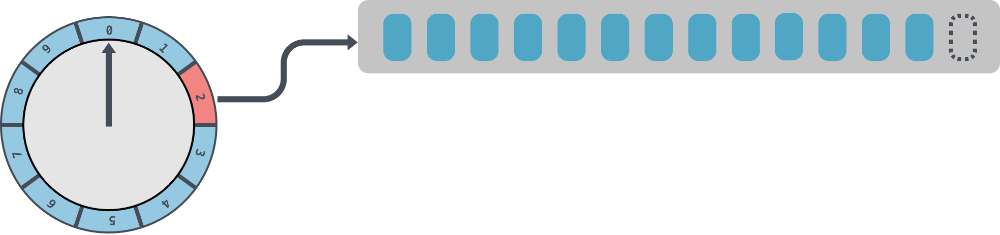
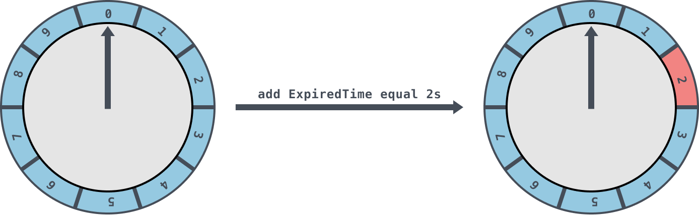
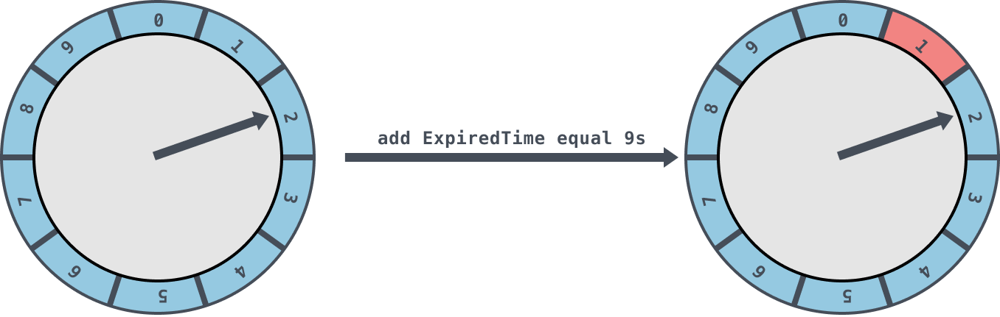
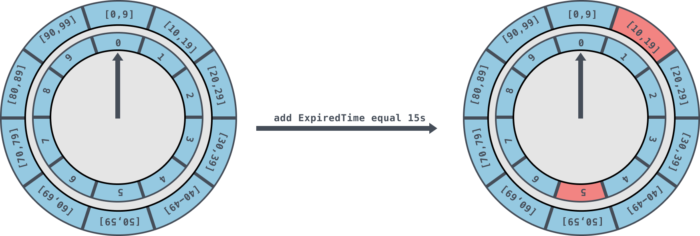
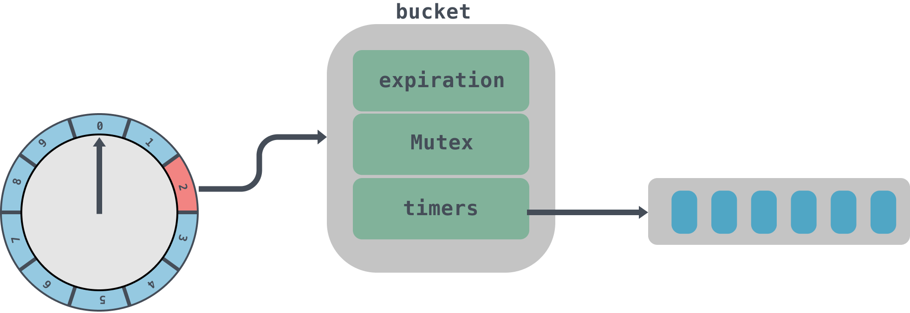
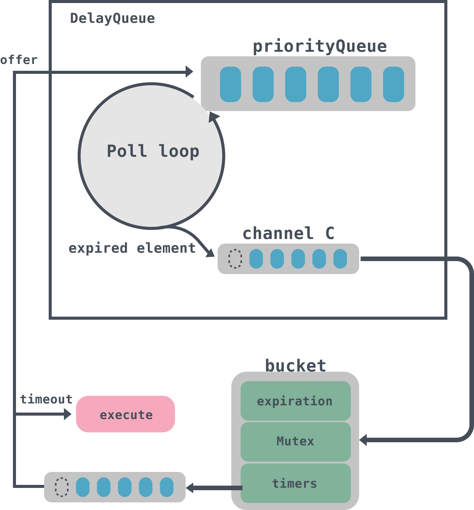

# Go语言中时间轮的实现

最近在工作中有一个需求，简单来说就是在短时间内会创建上百万个定时任务，创建的时候会将对应的金额相加，防止超售，需要过半个小时再去核对数据，如果数据对不上就需要将加上的金额再减回去。

这个需求如果用Go内置的Timer来做的话性能比较低下，因为Timer是使用最小堆来实现的，创建和删除的时间复杂度都为 O(log n)。如果使用时间轮的话则是O(1)性能会好很多。

对于时间轮来说，我以前写过一篇java版的时间轮算法分析：https://www.luozhiyun.com/archives/59，这次来看看Go语言的时间轮实现，顺便大家有兴趣的也可以对比一下两者的区别，以及我写文章的水平和一年多前有没有提升，哈哈哈。

时间轮的运用其实是非常的广泛的，在 Netty、Akka、Quartz、ZooKeeper、Kafka 等组件中都存在时间轮的踪影。下面用Go实现的时间轮是以Kafka的代码为原型来实现的，完整代码：https://github.com/devYun/timingwheel。

## 介绍

### 简单时间轮

在时间轮中存储任务的是一个环形队列，底层采用数组实现，数组中的每个元素可以存放一个定时任务列表。定时任务列表是一个环形的双向链表，链表中的每一项表示的都是定时任务项，其中封装了真正的定时任务。

时间轮由多个时间格组成，每个时间格代表当前时间轮的基本时间跨度（tickMs）。时间轮的时间格个数是固定的，可用 wheelSize 来表示，那么整个时间轮的总体时间跨度（interval）可以通过公式 tickMs×wheelSize 计算得出。

时间轮还有一个表盘指针（currentTime），用来表示时间轮当前所处的时间，currentTime 是 tickMs 的整数倍。currentTime指向的地方是表示到期的时间格，表示需要处理的时间格所对应的链表中的所有任务。

如下图是一个tickMs为1s，wheelSize等于10的时间轮，每一格里面放的是一个定时任务链表，链表里面存有真正的任务项：



初始情况下表盘指针 currentTime 指向时间格0，若时间轮的 tickMs 为 1ms 且 wheelSize 等于10，那么interval则等于10s。如下图此时有一个定时为2s的任务插进来会存放到时间格为2的任务链表中，用红色标记。随着时间的不断推移，指针 currentTime 不断向前推进，如果过了2s，那么 currentTime 会指向时间格2的位置，会将此时间格的任务链表获取出来处理。



如果当前的指针 currentTime 指向的是2，此时如果插入一个9s的任务进来，那么新来的任务会服用原来的时间格链表，会存放到时间格1中



这里所讲的时间轮都是简单时间轮，只有一层，总体时间范围在 currentTime 和 currentTime+interval 之间。如果现在有一个15s的定时任务是需要重新开启一个时间轮，设置一个时间跨度至少为15s的时间轮才够用。但是这样扩充是没有底线的，如果需要一个1万秒的时间轮，那么就需要一个这么大的数组去存放，不仅占用很大的内存空间，而且也会因为需要遍历这么大的数组从而拉低效率。

因此引入了层级时间轮的概念。

### 层级时间轮

如图是一个两层的时间轮，第二层时间轮也是由10个时间格组成，每个时间格的跨度是10s。第二层的时间轮的 tickMs 为第一层时间轮的 interval，即10s。每一层时间轮的 wheelSize 是固定的，都是10，那么第二层的时间轮的总体时间跨度 interval 为100s。

图中展示了每个时间格对应的过期时间范围， 我们可以清晰地看到， 第二层时间轮的第0个时间格的过期时间范围是 [0,9]。也就是说, 第二层时间轮的一个时间格就可以表示第一层时间轮的所有(10个)时间格；

如果向该时间轮中添加一个15s的任务，那么当第一层时间轮容纳不下时，进入第二层时间轮，并插入到过期时间为[10，19]的时间格中。



随着时间的流逝，当原本15s的任务还剩下5s的时候，这里就有一个时间轮降级的操作，此时第一层时间轮的总体时间跨度已足够，此任务被添加到第一层时间轮到期时间为5的时间格中，之后再经历5s后，此任务真正到期，最终执行相应的到期操作。

## 代码实现

因为我们这个Go语言版本的时间轮代码是仿照Kafka写的，所以在具体实现时间轮 TimingWheel 时还有一些小细节：

* 时间轮的时间格中每个链表会有一个root节点用于简化边界条件。它是一个附加的链表节点，该节点作为第一个节点，它的值域中并不存储任何东西，只是为了操作的方便而引入的；
* 除了第一层时间轮，其余高层时间轮的起始时间（startMs）都设置为创建此层时间轮时前面第一轮的 currentTime。每一层的 currentTime 都必须是 tickMs 的整数倍，如果不满足则会将 currentTime 修剪为 tickMs 的整数倍。修剪方法为：currentTime = startMs - (startMs % tickMs)；
* Kafka 中的定时器只需持有 TimingWheel 的第一层时间轮的引用，并不会直接持有其他高层的时间轮，但每一层时间轮都会有一个引用（overflowWheel）指向更高一层的应用；
* Kafka 中的定时器使用了 DelayQueue 来协助推进时间轮。在操作中会将每个使用到的时间格中每个链表都加入 DelayQueue，DelayQueue 会根据时间轮对应的过期时间 expiration 来排序，最短 expiration 的任务会被排在 DelayQueue 的队头，通过单独线程来获取 DelayQueue 中到期的任务；

### 结构体

```go
type TimingWheel struct {
	// 时间跨度,单位是毫秒
	tick      int64 // in milliseconds
	// 时间轮个数
	wheelSize int64
	// 总跨度
	interval    int64 // in milliseconds
	// 当前指针指向时间
	currentTime int64 // in milliseconds
	// 时间格列表
	buckets     []*bucket
	// 延迟队列
	queue       *delayqueue.DelayQueue 
	// 上级的时间轮引用
	overflowWheel unsafe.Pointer // type: *TimingWheel

	exitC     chan struct{}
	waitGroup waitGroupWrapper
}
```

tick、wheelSize、interval、currentTime都比较好理解，buckets字段代表的是时间格列表，queue是一个延迟队列，所有的任务都是通过延迟队列来进行触发，overflowWheel是上层时间轮的引用。

```go
type bucket struct {
	// 任务的过期时间
	expiration int64

	mu     sync.Mutex
	// 相同过期时间的任务队列
	timers *list.List
}
```

bucket里面实际上封装的是时间格里面的任务队列，里面放入的是相同过期时间的任务，到期后会将队列timers拿出来进行处理。这里有个有意思的地方是由于会有多个线程并发的访问bucket，所以需要用到原子类来获取int64位的值，为了保证32位系统上面读取64位数据的一致性，需要进行64位对齐。具体的可以看这篇：https://www.luozhiyun.com/archives/429，讲的是对内存对齐的思考。

```go
type Timer struct {
  // 到期时间
	expiration int64 // in milliseconds
  // 要被执行的具体任务
	task       func()
	// Timer所在bucket的指针
	b unsafe.Pointer // type: *bucket
	// bucket列表中对应的元素
	element *list.Element
}
```

 Timer是时间轮的最小执行单元，是定时任务的封装，到期后会调用task来执行任务。



### 初始化时间轮

例如现在初始化一个tick是1s，wheelSize是10的时间轮：

```go
func main() {
	tw := timingwheel.NewTimingWheel(time.Second, 10)
	tw.Start() 
}

func NewTimingWheel(tick time.Duration, wheelSize int64) *TimingWheel {
  // 将传入的tick转化成毫秒
	tickMs := int64(tick / time.Millisecond)
  // 如果小于零，那么panic
	if tickMs <= 0 {
		panic(errors.New("tick must be greater than or equal to 1ms"))
	}
	// 设置开始时间
	startMs := timeToMs(time.Now().UTC())
	// 初始化TimingWheel
	return newTimingWheel(
		tickMs,
		wheelSize,
		startMs,
		delayqueue.New(int(wheelSize)),
	)
}

func newTimingWheel(tickMs int64, wheelSize int64, startMs int64, queue *delayqueue.DelayQueue) *TimingWheel {
  // 初始化buckets的大小
	buckets := make([]*bucket, wheelSize)
	for i := range buckets {
		buckets[i] = newBucket()
	}
  // 实例化TimingWheel
	return &TimingWheel{
		tick:        tickMs,
		wheelSize:   wheelSize,
    // currentTime必须是tickMs的倍数，所以这里使用truncate进行修剪
		currentTime: truncate(startMs, tickMs),
		interval:    tickMs * wheelSize,
		buckets:     buckets,
		queue:       queue,
		exitC:       make(chan struct{}),
	}
}
```

初始化十分简单，大家可以看看上面的代码注释即可。

### 启动时间轮

下面我们看看start方法：

```go
func (tw *TimingWheel) Start() {
	// Poll会执行一个无限循环，将到期的元素放入到queue的C管道中
	tw.waitGroup.Wrap(func() {
		tw.queue.Poll(tw.exitC, func() int64 {
			return timeToMs(time.Now().UTC())
		})
	})
	// 开启无限循环获取queue中C的数据
	tw.waitGroup.Wrap(func() {
		for {
			select {
			// 从队列里面出来的数据都是到期的bucket
			case elem := <-tw.queue.C:
				b := elem.(*bucket)
				// 时间轮会将当前时间 currentTime 往前移动到 bucket的到期时间
				tw.advanceClock(b.Expiration())
				// 取出bucket队列的数据，并调用addOrRun方法执行
				b.Flush(tw.addOrRun)
			case <-tw.exitC:
				return
			}
		}
	})
}
```

这里使用了util封装的一个Wrap方法，这个方法会起一个goroutines异步执行传入的函数，具体的可以到我上面给出的链接去看源码。

Start方法会启动两个goroutines。第一个goroutines用来调用延迟队列的queue的Poll方法，这个方法会一直循环获取队列里面的数据，然后将到期的数据放入到queue的C管道中；第二个goroutines会无限循环获取queue中C的数据，如果C中有数据表示已经到期，那么会先调用advanceClock方法将当前时间 currentTime 往前移动到 bucket的到期时间，然后再调用Flush方法取出bucket中的队列，并调用addOrRun方法执行。

```go
func (tw *TimingWheel) advanceClock(expiration int64) {
	currentTime := atomic.LoadInt64(&tw.currentTime)
	// 过期时间大于等于（当前时间+tick）
	if expiration >= currentTime+tw.tick {
		// 将currentTime设置为expiration，从而推进currentTime
		currentTime = truncate(expiration, tw.tick)
		atomic.StoreInt64(&tw.currentTime, currentTime)

		// Try to advance the clock of the overflow wheel if present
		// 如果有上层时间轮，那么递归调用上层时间轮的引用
		overflowWheel := atomic.LoadPointer(&tw.overflowWheel)
		if overflowWheel != nil {
			(*TimingWheel)(overflowWheel).advanceClock(currentTime)
		}
	}
}
```

advanceClock方法会根据到期时间来从新设置currentTime，从而推进时间轮前进。

```go
func (b *bucket) Flush(reinsert func(*Timer)) {
	var ts []*Timer

	b.mu.Lock()
	// 循环获取bucket队列节点
	for e := b.timers.Front(); e != nil; {
		next := e.Next()

		t := e.Value.(*Timer)
		// 将头节点移除bucket队列
		b.remove(t)
		ts = append(ts, t)

		e = next
	}
	b.mu.Unlock()

	b.SetExpiration(-1) // TODO: Improve the coordination with b.Add()

	for _, t := range ts {
		reinsert(t)
	}
}
```

Flush方法会根据bucket里面timers列表进行遍历插入到ts数组中，然后调用reinsert方法，这里是调用的addOrRun方法。

```go
func (tw *TimingWheel) addOrRun(t *Timer) {
	// 如果已经过期，那么直接执行
	if !tw.add(t) { 
		// 异步执行定时任务
		go t.task()
	}
}
```

addOrRun会调用add方法检查传入的定时任务Timer是否已经到期，如果到期那么异步调用task方法直接执行。add方法我们下面会接着分析。

整个start执行流程如图：



1. start方法回启动一个goroutines调用poll来处理DelayQueue中到期的数据，并将数据放入到管道C中；
2. start方法启动第二个goroutines方法会循环获取DelayQueue中管道C的数据，管道C中实际上存放的是一个bucket，然后遍历bucket的timers列表，如果任务已经到期，那么异步执行，没有到期则重新放入到DelayQueue中。

### add task

```go
func main() {
	tw := timingwheel.NewTimingWheel(time.Second, 10)
	tw.Start() 
	// 添加任务
	tw.AfterFunc(time.Second*15, func() {
		fmt.Println("The timer fires")
		exitC <- time.Now().UTC()
	})
}
```

我们通过AfterFunc方法添加一个15s的定时任务，如果到期了，那么执行传入的函数。

```go
func (tw *TimingWheel) AfterFunc(d time.Duration, f func()) *Timer {
	t := &Timer{
		expiration: timeToMs(time.Now().UTC().Add(d)),
		task:       f,
	}
	tw.addOrRun(t)
	return t
}
```

AfterFunc方法回根据传入的任务到期时间，以及到期需要执行的函数封装成Timer，调用addOrRun方法。addOrRun方法我们上面已经看过了，会根据到期时间来决定是否需要执行定时任务。

下面我们来看一下add方法：

```go
func (tw *TimingWheel) add(t *Timer) bool {
	currentTime := atomic.LoadInt64(&tw.currentTime)
	// 已经过期
	if t.expiration < currentTime+tw.tick {
		// Already expired
		return false
	// 	到期时间在第一层环内
	} else if t.expiration < currentTime+tw.interval {
		// Put it into its own bucket
		// 获取时间轮的位置
		virtualID := t.expiration / tw.tick
		b := tw.buckets[virtualID%tw.wheelSize]
		// 将任务放入到bucket队列中
		b.Add(t) 
		// 如果是相同的时间，那么返回false，防止被多次插入到队列中
		if b.SetExpiration(virtualID * tw.tick) { 
			// 将该bucket加入到延迟队列中
			tw.queue.Offer(b, b.Expiration())
		}

		return true
	} else {
		// Out of the interval. Put it into the overflow wheel
		// 如果放入的到期时间超过第一层时间轮，那么放到上一层中去
		overflowWheel := atomic.LoadPointer(&tw.overflowWheel)
		if overflowWheel == nil {
			atomic.CompareAndSwapPointer(
				&tw.overflowWheel,
				nil,
				// 需要注意的是，这里tick变成了interval
				unsafe.Pointer(newTimingWheel(
					tw.interval,
					tw.wheelSize,
					currentTime,
					tw.queue,
				)),
			)
			overflowWheel = atomic.LoadPointer(&tw.overflowWheel)
		}
		// 往上递归
		return (*TimingWheel)(overflowWheel).add(t)
	}
}
```

add方法根据到期时间来分成了三部分，第一部分是小于当前时间+tick，表示已经到期，那么返回false执行任务即可；

第二部分的判断会根据expiration是否小于时间轮的跨度，如果小于的话表示该定时任务可以放入到当前时间轮中，通过取模找到buckets对应的时间格并放入到bucket队列中，SetExpiration方法会根据传入的参数来判断是否已经执行过延迟队列的Offer方法，防止重复插入；

第三部分表示该定时任务的时间跨度超过了当前时间轮，需要升级到上一层的时间轮中。需要注意的是，上一层的时间轮的tick是当前时间轮的interval，延迟队列还是同一个，然后设置为指针overflowWheel，并调用add方法往上层递归。

到这里时间轮已经讲完了，不过还有需要注意的地方，我们在用上面的时间轮实现中，使用了DelayQueue加环形队列的方式实现了时间轮。对定时任务项的插入和删除操作而言，TimingWheel时间复杂度为 O(1)，在DelayQueue中的队列使用的是优先队列，时间复杂度是O(log n)，但是由于buckets列表实际上是非常小的，所以并不会影响性能。

## Reference

https://github.com/RussellLuo/timingwheel

https://zhuanlan.zhihu.com/p/121483218

https://github.com/apache/kafka/tree/3cdc78e6bb1f83973a14ce1550fe3874f7348b05/core/src/main/scala/kafka/utils/timer