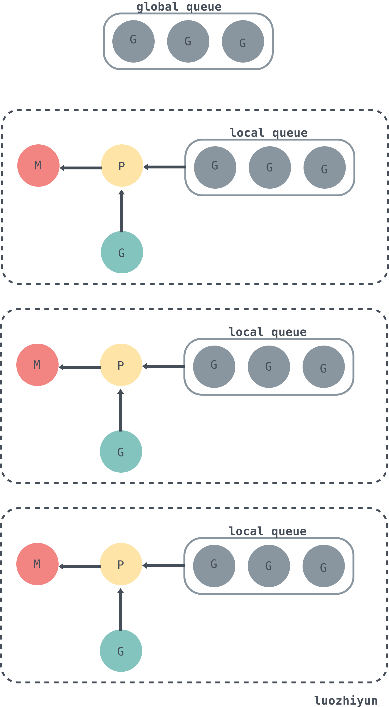
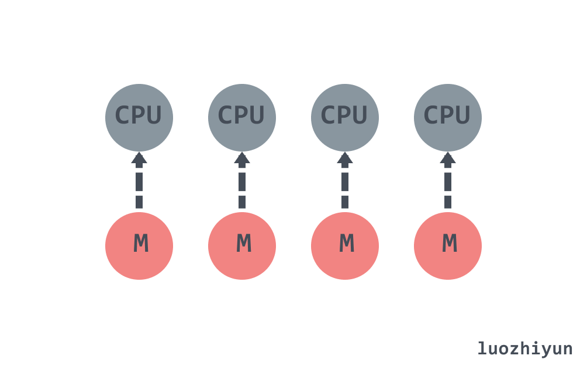
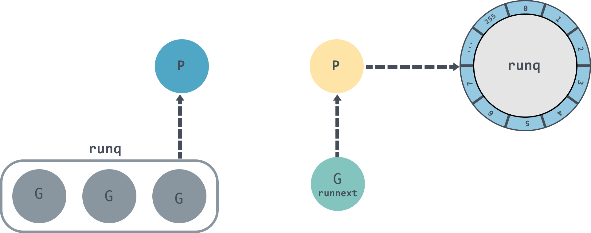
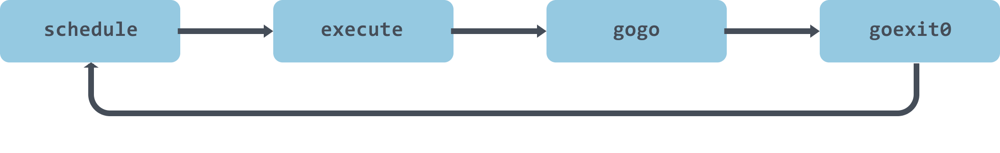
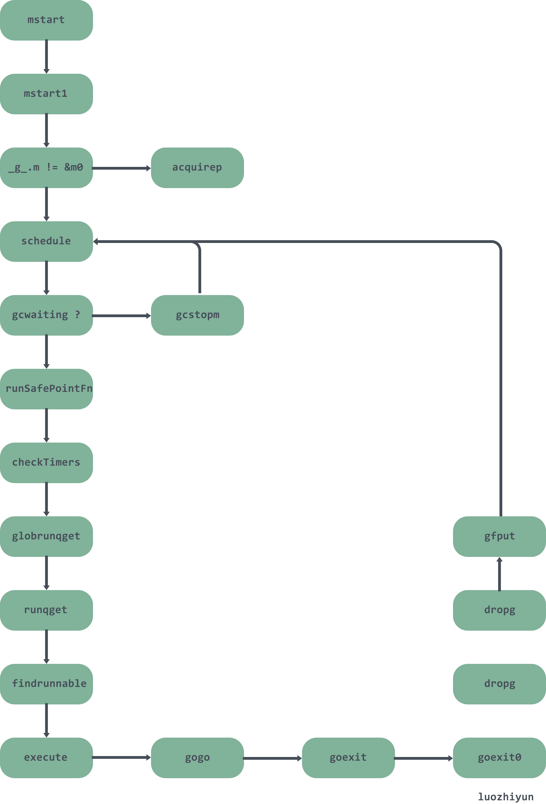

# 详解Go语言调度循环源码实现

> 转载请声明出处哦~，本篇文章发布于luozhiyun的博客：https://www.luozhiyun.com
>
> 本文使用的go的源码15.7

## 概述

提到"调度"，我们首先想到的就是操作系统对进程、线程的调度。操作系统调度器会将系统中的多个线程按照一定算法调度到物理CPU上去运行。虽然线程比较轻量，但是在调度时也有比较大的额外开销。每个线程会都占用 1M 以上的内存空间，线程切换和恢复寄存器中的内容也需要向系统申请资源。

Go 语言的 Goroutine 可以看作对 thread 加的一层抽象，它更轻量级，不仅减少了上下文切换带来的额外开销，Goroutine 占用的资源也会更少。如创建一个 Goroutine 的栈内存消耗为 2 KB，而 thread 占用 1M 以上空间；thread 创建和销毀是内核级的，所以都会有巨大的消耗，而 Goroutine 由 Go runtime 负责管理的，创建和销毁的消耗非常小；Goroutine 的切换成本也比 thread 要小得多。

### G M P 模型

Go 的调度器使用三个结构体来实现 Goroutine 的调度：G M P。

**G**：代表一个 Goroutine，每个 Goroutine 都有自己独立的栈存放当前的运行内存及状态。可以把一个 G 当做一个任务，当 Goroutine 被调离 CPU 时，调度器代码负责把 CPU 寄存器的值保存在 G 对象的成员变量之中，当 Goroutine 被调度起来运行时，调度器代码又负责把 G 对象的成员变量所保存的寄存器的值恢复到 CPU 的寄存器。

**M**：表示内核线程，它本身就与一个内核线程进行绑定，每个工作线程都有唯一的一个 M 结构体的实例对象与之对应。M 结构体对象除了记录着工作线程的诸如栈的起止位置、当前正在执行的Goroutine 以及是否空闲等等状态信息之外，还通过指针维持着与 P 结构体的实例对象之间的绑定关系。

**P**：代表一个虚拟的 Processor 处理器，它维护一个局部 Goroutine 可运行 G 队列，工作线程优先使用自己的局部运行队列，只有必要时才会去访问全局运行队列，这大大减少了锁冲突，提高了工作线程的并发性。每个 G 要想真正运行起来，首先需要被分配一个 P。

除了上面三个结构体以外，还有一个存放所有Runnable 可运行 Goroutine 的容器 schedt。每个Go程序中schedt结构体只有一个实例对象，在代码中是一个共享的全局变量，每个工作线程都可以访问它以及它所拥有的 Goroutine 运行队列。

下面是G、P、M以及schedt中的全局队列的关系：



从上图可以看出，每个 m 都绑定了一个 P，每个 P 都有一个私有的本地 Goroutine 队列，m对应的线程从本地和全局 Goroutine 队列中获取 Goroutine 并运行，绿色的 G 代表正在运行的 G。

在默认情况下，运行时会将 `GOMAXPROCS` 设置成当前机器的核数，假设一个四核机器会创建四个活跃的操作系统线程，每一个线程都对应一个运行时中的 M。



## 详解

### 结构体

G M P 结构体定义于src/runtime/runtime2.go

#### G

```go
type g struct { 
	// 当前 Goroutine 的栈内存范围 [stack.lo, stack.hi)
	stack       stack 
	// 用于调度器抢占式调度  
	stackguard0 uintptr   

	_panic       *_panic  
	_defer       *_defer  
	// 当前 Goroutine 占用的线程
	m            *m       
	// 存储 Goroutine 的调度相关的数据
	sched        gobuf 
	// Goroutine 的状态
	atomicstatus uint32 
	// 抢占信号
	preempt       bool // preemption signal, duplicates stackguard0 = stackpreempt
	// 抢占时将状态修改成 `_Gpreempted`
	preemptStop   bool // transition to _Gpreempted on preemption; otherwise, just deschedule
	// 在同步安全点收缩栈
	preemptShrink bool // shrink stack at synchronous safe point
	...
}
```

下面看看gobuf结构体，主要在调度器保存或者恢复上下文的时候用到：

```go
type gobuf struct {
	// 栈指针
	sp   uintptr
	// 程序计数器
	pc   uintptr
	// gobuf对应的Goroutine
	g    guintptr 
	// 系统调用的返回值
	ret  sys.Uintreg
	...
}
```

在执行过程中，G可能处于以下几种状态：

```go
const (
	//  刚刚被分配并且还没有被初始化
	_Gidle = iota // 0 
	// 没有执行代码，没有栈的所有权，存储在运行队列中
	_Grunnable // 1 
	// 可以执行代码，拥有栈的所有权，被赋予了内核线程 M 和处理器 P
	_Grunning // 2 
	// 正在执行系统调用，拥有栈的所有权，没有执行用户代码，
	// 被赋予了内核线程 M 但是不在运行队列上
	_Gsyscall // 3 
	// 由于运行时而被阻塞，没有执行用户代码并且不在运行队列上，
	// 但是可能存在于 Channel 的等待队列上
	_Gwaiting // 4  
	// 表示当前goroutine没有被使用，没有执行代码，可能有分配的栈
	_Gdead // 6  
	// 栈正在被拷贝，没有执行代码，不在运行队列上
	_Gcopystack // 8 
	// 由于抢占而被阻塞，没有执行用户代码并且不在运行队列上，等待唤醒
	_Gpreempted // 9 
	// GC 正在扫描栈空间，没有执行代码，可以与其他状态同时存在
	_Gscan          = 0x1000 
	...
)
```

上面的状态看起来很多，但是实际上只需要关注下面几种就好了：

* 等待中：_ Gwaiting、_Gsyscall 和 _Gpreempted，这几个状态表示G没有在执行；
* 可运行：_Grunnable，表示G已经准备就绪，可以在线程运行;
* 运行中：_Grunning，表示G正在运行；

#### M

Go 语言并发模型中的 M 是操作系统线程，最多只会有 `GOMAXPROCS` 个活跃线程能够正常运行。

```go
type m struct {
	// 持有调度栈的 Goroutine
	g0      *g       
	// 处理 signal 的 G
	gsignal       *g           
	// 线程本地存储 thread-local
	tls           [6]uintptr   // thread-local storage (for x86 extern register)
	// 当前运行的G
	curg          *g       // current running goroutine
	caughtsig     guintptr // goroutine running during fatal signal
	// 正在运行代码的P
	p             puintptr // attached p for executing go code (nil if not executing go code)
	nextp         puintptr
	// 之前使用的P
	oldp          puintptr  
	...
}
```

#### P

调度器中的处理器 P 是线程 M 和 G 的中间层，用于调度 G 在 M 上执行。

```go
type p struct {
	id          int32
	// p 的状态
	status      uint32  
    // 调度器调用会+1
	schedtick   uint32     // incremented on every scheduler call
    // 系统调用会+1
	syscalltick uint32     // incremented on every system call
	// 对应关联的 M
	m           muintptr    
	mcache      *mcache
	pcache      pageCache 
	// defer 结构池
	deferpool    [5][]*_defer  
	deferpoolbuf [5][32]*_defer  
	// 可运行的 Goroutine 队列，可无锁访问
	runqhead uint32
	runqtail uint32
	runq     [256]guintptr
	// 缓存可立即执行的 G
	runnext guintptr 
	// 可用的 G 列表，G 状态等于 Gdead 
	gFree struct {
		gList
		n int32
	}
	...
}
```

下面看看P的几个状态：

```go
const ( 
	// 表示P没有运行用户代码或者调度器 
	_Pidle = iota 
	// 被线程 M 持有，并且正在执行用户代码或者调度器
	_Prunning 
	// 没有执行用户代码，当前线程陷入系统调用
	_Psyscall
	// 被线程 M 持有，当前处理器由于垃圾回收 STW 被停止
	_Pgcstop 
	// 当前处理器已经不被使用
	_Pdead
)
```

#### sched

sched 我们在上面也提到了，主要存放了调度器持有的全局资源，如空闲的 P 链表、 G 的全局队列等。

```go
type schedt struct {
	...
	lock mutex 
	// 空闲的 M 列表
	midle        muintptr  
	// 空闲的 M 列表数量
	nmidle       int32      
	// 下一个被创建的 M 的 id
	mnext        int64  
	// 能拥有的最大数量的 M  
	maxmcount    int32    
	// 空闲 p 链表
	pidle      puintptr // idle p's
	// 空闲 p 数量
	npidle     uint32
	// 处于 spinning 状态的 M 的数量
	nmspinning uint32   
	// 全局 runnable G 队列
	runq     gQueue
	runqsize int32  
	// 有效 dead G 的全局缓存.
	gFree struct {
		lock    mutex
		stack   gList // Gs with stacks
		noStack gList // Gs without stacks
		n       int32
	} 
	// sudog 结构的集中缓存
	sudoglock  mutex
	sudogcache *sudog 
	// defer 结构的池
	deferlock mutex
	deferpool [5]*_defer 
	...
}
```

### 从Go程序启动讲起

这里还是借助dlv来进行调试。有关 dlv 如何断点汇编的内容我在这一篇：https://www.luozhiyun.com/archives/434 《详解Go中内存分配源码实现》已经有很详细的介绍了，感兴趣的可以去看看。需要注意的是这里有个坑，下面的例子是在Linux中进行的。

首先我们写一个非常简单的例子：

```go
package main

import "fmt"

func main() {
	fmt.Println("hello world")
}
```

然后进行构建：

```
go build main.go
dlv exec ./main
```

开打程序后按步骤输入下面的命令：

```
(dlv) r
Process restarted with PID 33191
(dlv) list
> _rt0_amd64_linux() /usr/local/go/src/runtime/rt0_linux_amd64.s:8 (PC: 0x4648c0)
Warning: debugging optimized function
Warning: listing may not match stale executable
     3: // license that can be found in the LICENSE file.
     4:
     5: #include "textflag.h"
     6:
     7: TEXT _rt0_amd64_linux(SB),NOSPLIT,$-8
=>   8:         JMP     _rt0_amd64(SB)
     9:
    10: TEXT _rt0_amd64_linux_lib(SB),NOSPLIT,$0
    11:         JMP     _rt0_amd64_lib(SB) 
(dlv) si
> _rt0_amd64() /usr/local/go/src/runtime/asm_amd64.s:15 (PC: 0x4613e0)
Warning: debugging optimized function
Warning: listing may not match stale executable
    10: // _rt0_amd64 is common startup code for most amd64 systems when using
    11: // internal linking. This is the entry point for the program from the
    12: // kernel for an ordinary -buildmode=exe program. The stack holds the
    13: // number of arguments and the C-style argv.
    14: TEXT _rt0_amd64(SB),NOSPLIT,$-8
=>  15:         MOVQ    0(SP), DI       // argc
    16:         LEAQ    8(SP), SI       // argv
    17:         JMP     runtime·rt0_go(SB)
    18:
    19: // main is common startup code for most amd64 systems when using
    20: // external linking. The C startup code will call the symbol "main"
(dlv)
```

通过上面的断点可以知道在linux amd64系统的启动函数是在asm_amd64.s的runtime·rt0_go函数中。当然，不同的平台有不同的程序入口，感兴趣的同学可以自行去了解。

下面我们看看`runtime·rt0_go`：

```
TEXT runtime·rt0_go(SB),NOSPLIT,$0
	...
	// 初始化执行文件的绝对路径
	CALL	runtime·args(SB)
	// 初始化 CPU 个数和内存页大小
	CALL	runtime·osinit(SB)
	// 调度器初始化
	CALL	runtime·schedinit(SB) 
	// 创建一个新的 goroutine 来启动程序
	MOVQ	$runtime·mainPC(SB), AX		// entry
	// 新建一个 goroutine，该 goroutine 绑定 runtime.main
	CALL	runtime·newproc(SB) 
	// 启动M，开始调度goroutine
	CALL	runtime·mstart(SB)
	...
```

上面的CALL方法中：

schedinit进行各种运行时组件初始化工作，这包括我们的调度器与内存分配器、回收器的初始化；

newproc负责根据主 G 入口地址创建可被运行时调度的执行单元；

mstart开始启动调度器的调度循环；

#### 调度初始化 runtime.schedinit

```go
func schedinit() {
	...
	_g_ := getg()
	...
	// 最大线程数10000
	sched.maxmcount = 10000 
	// M0 初始化
	mcommoninit(_g_.m, -1)
	...	  
    // 垃圾回收器初始化
	gcinit()

	sched.lastpoll = uint64(nanotime())
    // 通过 CPU 核心数和 GOMAXPROCS 环境变量确定 P 的数量
	procs := ncpu
	if n, ok := atoi32(gogetenv("GOMAXPROCS")); ok && n > 0 {
		procs = n
	}
	// P 初始化
	if procresize(procs) != nil {
		throw("unknown runnable goroutine during bootstrap")
	}
    ...
}
```

schedinit函数会将 maxmcount 设置成10000，这也就是一个 Go 语言程序能够创建的最大线程数。然后调用 mcommoninit 对 M0 进行初始化，通过 CPU 核心数和 GOMAXPROCS 环境变量确定 P 的数量之后就会调用 procresize 函数对 P 进行初始化。

#### M0 初始化

```go
func mcommoninit(mp *m, id int64) {
	_g_ := getg()
	...
	lock(&sched.lock)
	// 如果传入id小于0，那么id则从mReserveID获取，初次从mReserveID获取id为0
	if id >= 0 {
		mp.id = id
	} else {
		mp.id = mReserveID()
	}
	//random初始化，用于窃取 G
	mp.fastrand[0] = uint32(int64Hash(uint64(mp.id), fastrandseed))
	mp.fastrand[1] = uint32(int64Hash(uint64(cputicks()), ^fastrandseed))
	if mp.fastrand[0]|mp.fastrand[1] == 0 {
		mp.fastrand[1] = 1
	}
	// 创建用于信号处理的gsignal，只是简单的从堆上分配一个g结构体对象,然后把栈设置好就返回了
	mpreinit(mp)
	if mp.gsignal != nil {
		mp.gsignal.stackguard1 = mp.gsignal.stack.lo + _StackGuard
	}

	// 把 M 挂入全局链表allm之中
	mp.alllink = allm
	...
}
```

这里传入的 id 是-1，初次调用会将 id 设置为 0，这里并未对m0做什么关于调度相关的初始化，所以可以简单的认为这个函数只是把m0放入全局链表allm之中就返回了。

#### P 初始化

**runtime.procresize**

```go
var allp       []*p 

func procresize(nprocs int32) *p {
	// 获取先前的 P 个数
	old := gomaxprocs
	// 更新统计信息
	now := nanotime()
	if sched.procresizetime != 0 {
		sched.totaltime += int64(old) * (now - sched.procresizetime)
	}
	sched.procresizetime = now
	// 根据 runtime.MAXGOPROCS 调整 p 的数量,因为 runtime.MAXGOPROCS 用户可以自行设定
	if nprocs > int32(len(allp)) { 
		lock(&allpLock)
		if nprocs <= int32(cap(allp)) {
			allp = allp[:nprocs]
		} else {
			nallp := make([]*p, nprocs) 
			copy(nallp, allp[:cap(allp)])
			allp = nallp
		}
		unlock(&allpLock)
	}
 
	// 初始化新的 P
	for i := old; i < nprocs; i++ {
		pp := allp[i]
		// 为空,则申请新的 P 对象
		if pp == nil {
			pp = new(p)
		}
		pp.init(i)
		atomicstorep(unsafe.Pointer(&allp[i]), unsafe.Pointer(pp))
	}

	_g_ := getg()
	// P 不为空,并且 id 小于 nprocs ,那么可以继续使用当前 P
	if _g_.m.p != 0 && _g_.m.p.ptr().id < nprocs {
		// continue to use the current P
		_g_.m.p.ptr().status = _Prunning
		_g_.m.p.ptr().mcache.prepareForSweep()
	} else { 
		// 释放当前 P，因为已失效
		if _g_.m.p != 0 { 
			_g_.m.p.ptr().m = 0
		}
		_g_.m.p = 0
		p := allp[0]
		p.m = 0
		p.status = _Pidle
		// P0 绑定到当前的 M0
		acquirep(p) 
	}
	// 从未使用的 P 释放资源
	for i := nprocs; i < old; i++ {
		p := allp[i]
		p.destroy() 
		// 不能释放 p 本身，因为他可能在 m 进入系统调用时被引用
	}
	// 释放完 P 之后重置allp的长度
	if int32(len(allp)) != nprocs {
		lock(&allpLock)
		allp = allp[:nprocs]
		unlock(&allpLock)
	}
	var runnablePs *p
	// 将没有本地任务的 P 放到空闲链表中
	for i := nprocs - 1; i >= 0; i-- {
		p := allp[i]
		// 当前正在使用的 P 略过
		if _g_.m.p.ptr() == p {
			continue
		}
		// 设置状态为 _Pidle 
		p.status = _Pidle
		// P 的任务列表是否为空
		if runqempty(p) {
			// 放入到空闲列表中
			pidleput(p)
		} else {
			// 获取空闲 M 绑定到 P 上
			p.m.set(mget())
            // 
			p.link.set(runnablePs)
			runnablePs = p
		}
	}
	stealOrder.reset(uint32(nprocs))
	var int32p *int32 = &gomaxprocs // make compiler check that gomaxprocs is an int32
	atomic.Store((*uint32)(unsafe.Pointer(int32p)), uint32(nprocs))
	return runnablePs
}
```

procresize方法的执行过程如下：

1. allp 是全局变量 P 的资源池，如果 allp 的切片中的处理器数量少于期望数量，会对切片进行扩容；
2. 扩容的时候会使用 new 申请一个新的 P ，然后使用 init 初始化，需要注意的是初始化的 P 的 id 就是传入的 i 的值，状态为 _Pgcstop；
3. 然后通过 `_g_.m.p` 获取 M0，如果 M0 已与有效的 P 绑定上，则将 被绑定的 P 的状态修改为 _Prunning。否则获取 `allp[0]` 作为 P0 调用 `runtime.acquirep` 与 M0 进行绑定；
4. 超过处理器个数的 P 通过`p.destroy`释放资源，`p.destroy`会将与 P 相关的资源释放，并将 P 状态设置为 _Pdead；
5. 通过截断改变全局变量 allp 的长度保证与期望处理器数量相等；
6. 遍历 allp 检查 P 的是否处于空闲状态，是的话放入到空闲列表中；

**P.init**

```go
func (pp *p) init(id int32) {
	// 设置id
	pp.id = id
	// 设置状态为 _Pgcstop
	pp.status = _Pgcstop
	// 与 sudog 相关
	pp.sudogcache = pp.sudogbuf[:0]
	for i := range pp.deferpool {
		pp.deferpool[i] = pp.deferpoolbuf[i][:0]
	}
	pp.wbBuf.reset()
	// mcache 初始化
	if pp.mcache == nil {
		if id == 0 {
			if mcache0 == nil {
				throw("missing mcache?")
			} 
			pp.mcache = mcache0
		} else {
			pp.mcache = allocmcache()
		}
	}
	...
	lockInit(&pp.timersLock, lockRankTimers)
}
```

这里会初始化一些 P 的字段值，如设置 id、status、sudogcache、mcache、lock相关 。

初始化 sudogcache 这个字段存的是 sudog 的集合与 Channel 相关，可以看这里：多图详解Go中的Channel源码 https://www.luozhiyun.com/archives/427。

每个 P 中会保存相应的 mcache ，能快速的进行分配微对象和小对象的分配，具体的可以看这里：详解Go中内存分配源码实现 https://www.luozhiyun.com/archives/434。

下面再来看看 `runtime.acquirep` 是如何将 P 与 M 绑定的：

**runtime.acquirep**

```go
func acquirep(_p_ *p) { 
	wirep(_p_)
	...
}

func wirep(_p_ *p) {
	_g_ := getg()

	...
	// 将 P 与 M 相互绑定
	_g_.m.p.set(_p_)
	_p_.m.set(_g_.m)
	// 设置 P 状态为 _Prunning
	_p_.status = _Prunning
}
```

这个方法十分简单，就不解释了。下面再看看 `runtime.pidleput`将 P 放入空闲列表：

```go
func pidleput(_p_ *p) {
	// 如果 P 运行队列不为空，那么不能放入空闲列表
	if !runqempty(_p_) {
		throw("pidleput: P has non-empty run queue")
	}
	// 将 P 与 pidle 列表关联
	_p_.link = sched.pidle
	sched.pidle.set(_p_)
	atomic.Xadd(&sched.npidle, 1) // TODO: fast atomic
}
```

#### G 初始化

从汇编可以知道执行完`runtime·schedinit`后就会执行 `runtime.newproc`是创建G的入口。

**runtime.newproc**

```go
func newproc(siz int32, fn *funcval) {
	argp := add(unsafe.Pointer(&fn), sys.PtrSize)
	// 获取当前的 G 
	gp := getg()
	// 获取调用者的程序计数器 PC
	pc := getcallerpc() 
	systemstack(func() {
		// 获取新的 G 结构体
		newg := newproc1(fn, argp, siz, gp, pc)
		_p_ := getg().m.p.ptr()
        // 将 G 加入到 P 的运行队列
		runqput(_p_, newg, true)
		// mainStarted 为 True 表示主M已经启动
		if mainStarted {
			// 唤醒新的  P 执行 G
			wakep()
		}
	})
}
```

 `runtime.newproc`会获取 当前 G 以及调用方的程序计数器，然后调用 newproc1 获取新的 G 结构体；然后将 G 放入到 P 的 runnext 字段中。

**runtime.newproc1**

```go
func newproc1(fn *funcval, argp unsafe.Pointer, narg int32, callergp *g, callerpc uintptr) *g {
	_g_ := getg()

	if fn == nil {
		_g_.m.throwing = -1 // do not dump full stacks
		throw("go of nil func value")
	}
	// 加锁，禁止 G 的 M 被抢占
	acquirem() // disable preemption because it can be holding p in a local var
	siz := narg
	siz = (siz + 7) &^ 7 

	_p_ := _g_.m.p.ptr()
	// 从 P 的空闲列表 gFree 查找空闲 G
	newg := gfget(_p_)
	if newg == nil {
		// 创建一个栈大小为 2K 大小的 G
		newg = malg(_StackMin)
		// CAS 改变 G 状态为 _Gdead
		casgstatus(newg, _Gidle, _Gdead)
		// 将 G 加入到全局 allgs 列表中
		allgadd(newg) // publishes with a g->status of Gdead so GC scanner doesn't look at uninitialized stack.
	}
	...
	// 计算运行空间大小
	totalSize := 4*sys.RegSize + uintptr(siz) + sys.MinFrameSize // extra space in case of reads slightly beyond frame
	totalSize += -totalSize & (sys.SpAlign - 1)                  // align to spAlign
	sp := newg.stack.hi - totalSize
	spArg := sp
	...
	if narg > 0 {
		// 从 argp 参数开始的位置，复制 narg 个字节到 spArg（参数拷贝）
		memmove(unsafe.Pointer(spArg), argp, uintptr(narg))
		...
	}
	// 清理、创建并初始化的 G
	memclrNoHeapPointers(unsafe.Pointer(&newg.sched), unsafe.Sizeof(newg.sched))
	newg.sched.sp = sp
	newg.stktopsp = sp
	newg.sched.pc = funcPC(goexit) + sys.PCQuantum // +PCQuantum so that previous instruction is in same function
	newg.sched.g = guintptr(unsafe.Pointer(newg))
	gostartcallfn(&newg.sched, fn)
	newg.gopc = callerpc
	newg.ancestors = saveAncestors(callergp)
	newg.startpc = fn.fn
	if _g_.m.curg != nil {
		newg.labels = _g_.m.curg.labels
	}
	if isSystemGoroutine(newg, false) {
		atomic.Xadd(&sched.ngsys, +1)
	}
	// 将 G 状态CAS为 _Grunnable 状态
	casgstatus(newg, _Gdead, _Grunnable) 
	newg.goid = int64(_p_.goidcache)
	_p_.goidcache++
	...
	// 释放锁，对应上面 acquirem
	releasem(_g_.m)

	return newg
}
```

newproc1函数比较长，下面总结一下主要做了哪几件事：

1. 从 P 的空闲列表 gFree 查找空闲 G；
2. 如果获取不到 G ，那么调用 malg 创建创建一个新的 G ，需要注意的是 _StackMin 为2048，表示创建的 G 的栈上内存占用为2K。然后 CAS 改变 G 状态为 _Gdead，并加入到全局 allgs 列表中；
3. 根据要执行函数的入口地址和参数，初始化执行栈的 SP 和参数的入栈位置，调用 memmove 进行参数拷贝；
4. 清理、创建并初始化的 G，将 G 状态CAS为 _Grunnable 状态，返回；

下面看看 `runtime.gfget`是如何查找 G：

**runtime.gfget**

```go
func gfget(_p_ *p) *g {
	retry:
		// 如果 P 的空闲列表 gFree 为空，sched 的的空闲列表 gFree 不为空
		if _p_.gFree.empty() && (!sched.gFree.stack.empty() || !sched.gFree.noStack.empty()) {
			lock(&sched.gFree.lock) 
			// 从sched 的 gFree 列表中移动 32 个到 P 的 gFree 中
			for _p_.gFree.n < 32 { 
				gp := sched.gFree.stack.pop()
				if gp == nil {
					gp = sched.gFree.noStack.pop()
					if gp == nil {
						break
					}
				}
				sched.gFree.n--
				_p_.gFree.push(gp)
				_p_.gFree.n++
			}
			unlock(&sched.gFree.lock)
			goto retry
		}
		// 此时如果 gFree 列表还是为空，返回空 
		gp := _p_.gFree.pop()
		if gp == nil {
			return nil
		}
		...
		return gp
}
```

1. 当 P 的空闲列表 gFree 为空时会从 sched 持有的空闲列表 gFree  转移32个 G 到当前的 P 的空闲列表上；
2. 然后从 P 的 gFree 列表头返回一个 G；

当 newproc 运行完 newproc1 后会调用 `runtime.runqput`将 G 放入到运行列表中：

**runtime.runqput**

```go
func runqput(_p_ *p, gp *g, next bool) {
	if randomizeScheduler && next && fastrand()%2 == 0 {
		next = false
	} 
	if next {
	retryNext:
	// 将 G 放入到 runnext 中作为下一个处理器执行的任务
		oldnext := _p_.runnext
		if !_p_.runnext.cas(oldnext, guintptr(unsafe.Pointer(gp))) {
			goto retryNext
		}
		if oldnext == 0 {
			return
		} 
		// 将原来 runnext 的 G 放入到运行队列中
		gp = oldnext.ptr()
	}

retry:
	h := atomic.LoadAcq(&_p_.runqhead)  
	t := _p_.runqtail
	// 放入到 P 本地运行队列中
	if t-h < uint32(len(_p_.runq)) {
		_p_.runq[t%uint32(len(_p_.runq))].set(gp)
		atomic.StoreRel(&_p_.runqtail, t+1)  
		return
	}
	// P 本地队列放不下了，放入到全局的运行队列中
	if runqputslow(_p_, gp, h, t) {
		return
	} 
	goto retry
}
```

1. `runtime.runqput`会根据 next 来判断是否要将 G 放入到 runnext 中；

2. next 为 false 的时候会将传入的 G 尝试放入到本地队列中，本地队列时一个大小为256的环形链表，如果放不下了则调用 `runqputslow`函数将 G 放入到全局队列的 `runq` 中。



### 调度循环

我们继续回到`runtime·rt0_go`中，在初始化工作完成后，会调用`runtime·mstart`开始调度 G

```
TEXT runtime·rt0_go(SB),NOSPLIT,$0
	...
	// 初始化执行文件的绝对路径
	CALL	runtime·args(SB)
	// 初始化 CPU 个数和内存页大小
	CALL	runtime·osinit(SB)
	// 调度器初始化
	CALL	runtime·schedinit(SB) 
	// 创建一个新的 goroutine 来启动程序
	MOVQ	$runtime·mainPC(SB), AX		// entry
	// 新建一个 goroutine，该 goroutine 绑定 runtime.main
	CALL	runtime·newproc(SB) 
	// 启动M，开始调度goroutine
	CALL	runtime·mstart(SB)
	...
```

`runtime·mstart`会调用到`runtime·mstart1`会初始化 M0 并调用`runtime.schedule`进入调度循环。


```go
func mstart1() {
	_g_ := getg()

	if _g_ != _g_.m.g0 {
		throw("bad runtime·mstart")
	} 
	// 一旦调用 schedule 就不会返回，所以需要保存一下栈帧
	save(getcallerpc(), getcallersp())
	asminit()
	minit() 
	// 设置信号 handler
	if _g_.m == &m0 {
		mstartm0()
	}
	// 执行启动函数
	if fn := _g_.m.mstartfn; fn != nil {
		fn()
	}
	// 如果当前 m 并非 m0，则要求绑定 p
	if _g_.m != &m0 {
		acquirep(_g_.m.nextp.ptr())
		_g_.m.nextp = 0
	}
	// 开始调度
	schedule()
}
```

mstart1保存调度信息后，会调用schedule进入调度循环，寻找一个可执行的 G 并执行。下面看看schedule执行函数。

#### schedule

```go
func schedule() {
	_g_ := getg()

	if _g_.m.locks != 0 {
		throw("schedule: holding locks")
	} 
	... 
top:
	pp := _g_.m.p.ptr()
	pp.preempt = false
	// GC 等待
	if sched.gcwaiting != 0 {
		gcstopm()
		goto top
	}
	// 不等于0，说明在安全点
	if pp.runSafePointFn != 0 {
		runSafePointFn()
	}

	// 如果在 spinning ，那么运行队列应该为空，
	if _g_.m.spinning && (pp.runnext != 0 || pp.runqhead != pp.runqtail) {
		throw("schedule: spinning with local work")
	}
	// 运行 P 上准备就绪的 Timer
	checkTimers(pp, 0)

	var gp *g
	var inheritTime bool 
	...
	if gp == nil { 
		// 为了公平，每调用 schedule 函数 61 次就要从全局可运行 G 队列中获取
		if _g_.m.p.ptr().schedtick%61 == 0 && sched.runqsize > 0 {
			lock(&sched.lock)
			// 从全局队列获取1个 G
			gp = globrunqget(_g_.m.p.ptr(), 1)
			unlock(&sched.lock)
		}
	}
	// 从 P 本地获取 G 任务
	if gp == nil {
		gp, inheritTime = runqget(_g_.m.p.ptr()) 
	}
	// 运行到这里表示从本地运行队列和全局运行队列都没有找到需要运行的 G
	if gp == nil {
		// 阻塞地查找可用 G
		gp, inheritTime = findrunnable() // blocks until work is available
	}
	...
	// 执行 G 任务函数
	execute(gp, inheritTime)
}
```

在这个函数中，我们只关注调度有关的代码。从上面的代码可以知道主要是从下面几个方向去寻找可用的 G：

1. 为了保证公平，当全局运行队列中有待执行的 G 时，通过对 schedtick 取模 61 ，表示调度器每调度 61 次的时候，都会尝试从全局队列里取出待运行的 G 来运行；
2. 调用 runqget 从 P 本地的运行队列中查找待执行的 G；
3. 如果前两种方法都没有找到 G ，会通过 findrunnable 函数去其他 P 里面去“偷”一些 G 来执行，如果“偷”不到，就阻塞直到有可运行的 G；

#### 全局队列获取 G

```go
func globrunqget(_p_ *p, max int32) *g {
	// 如果全局队列中没有 G 直接返回
	if sched.runqsize == 0 {
		return nil
	}
	// 计算 n 的个数
	n := sched.runqsize/gomaxprocs + 1
	if n > sched.runqsize {
		n = sched.runqsize
	}
	// n 的最大个数
	if max > 0 && n > max {
		n = max
	}
	if n > int32(len(_p_.runq))/2 {
		n = int32(len(_p_.runq)) / 2
	}

	sched.runqsize -= n
	// 拿到全局队列队头 G
	gp := sched.runq.pop()
	n--
	// 将其余 n-1 个 G 从全局队列放入本地队列
	for ; n > 0; n-- {
		gp1 := sched.runq.pop()
		runqput(_p_, gp1, false)
	}
	return gp
}
```

globrunqget 会从全局 runq 队列中获取 n 个 G ，其中第一个 G 用于执行，n-1 个 G 从全局队列放入本地队列。

#### 本地队列获取 G

```go
func runqget(_p_ *p) (gp *g, inheritTime bool) {
	// 如果 runnext 不为空，直接获取返回
	for {
		next := _p_.runnext
		if next == 0 {
			break
		}
		if _p_.runnext.cas(next, 0) {
			return next.ptr(), true
		}
	}
	// 从本地队列头指针遍历本地队列
	for {
		h := atomic.LoadAcq(&_p_.runqhead)  
		t := _p_.runqtail
		// 表示本地队列为空
		if t == h {
			return nil, false
		}
		gp := _p_.runq[h%uint32(len(_p_.runq))].ptr()
		if atomic.CasRel(&_p_.runqhead, h, h+1) { // cas-release, commits consume
			return gp, false
		}
	}
}
```

本地队列的获取会先从 P 的 runnext 字段中获取，如果不为空则直接返回。如果 runnext 为空，那么从本地队列头指针遍历本地队列，本地队列是一个环形队列，方便复用。

#### 任务窃取 G

任务窃取方法 findrunnable 非常的复杂，足足有300行之多，我们慢慢来分析：

```go
func findrunnable() (gp *g, inheritTime bool) {
	_g_ := getg()
top:
	_p_ := _g_.m.p.ptr()
	// 如果在 GC，则休眠当前 M，直到复始后回到 top
	if sched.gcwaiting != 0 {
		gcstopm()
		goto top
	}
	// 运行到安全点
	if _p_.runSafePointFn != 0 {
		runSafePointFn()
	}

	now, pollUntil, _ := checkTimers(_p_, 0)
	...
	// 从本地 P 的可运行队列获取 G
	if gp, inheritTime := runqget(_p_); gp != nil {
		return gp, inheritTime
	}

	// 从全局的可运行队列获取 G
	if sched.runqsize != 0 {
		lock(&sched.lock)
		gp := globrunqget(_p_, 0)
		unlock(&sched.lock)
		if gp != nil {
			return gp, false
		}
	} 
	// 从I/O轮询器获取 G
	if netpollinited() && atomic.Load(&netpollWaiters) > 0 && atomic.Load64(&sched.lastpoll) != 0 {
		// 尝试从netpoller获取Glist
		if list := netpoll(0); !list.empty() { // non-blocking
			gp := list.pop()
			//将其余队列放入 P 的可运行G队列
			injectglist(&list)
			casgstatus(gp, _Gwaiting, _Grunnable)
			if trace.enabled {
				traceGoUnpark(gp, 0)
			}
			return gp, false
		}
	}
	...
	if !_g_.m.spinning {
		// 设置 spinning ，表示正在窃取 G
		_g_.m.spinning = true
		atomic.Xadd(&sched.nmspinning, 1)
	}
	// 开始窃取
	for i := 0; i < 4; i++ {
		for enum := stealOrder.start(fastrand()); !enum.done(); enum.next() {
			if sched.gcwaiting != 0 {
				goto top
			}
			// 如果 i>2 表示如果其他 P 运行队列中没有 G ，将要从其他队列的 runnext 中获取
			stealRunNextG := i > 2 // first look for ready queues with more than 1 g
			// 随机获取一个 P
			p2 := allp[enum.position()]
			if _p_ == p2 {
				continue
			}
			// 从其他 P 的运行队列中获取一般的 G 到当前队列中
			if gp := runqsteal(_p_, p2, stealRunNextG); gp != nil {
				return gp, false
			}

			// 如果运行队列中没有 G，那么从 timers 中获取可执行的定时器
			if i > 2 || (i > 1 && shouldStealTimers(p2)) {
				tnow, w, ran := checkTimers(p2, now)
				now = tnow
				if w != 0 && (pollUntil == 0 || w < pollUntil) {
					pollUntil = w
				}
				if ran {
					if gp, inheritTime := runqget(_p_); gp != nil {
						return gp, inheritTime
					}
					ranTimer = true
				}
			}
		}
	}
	if ranTimer {
		goto top
	}

stop: 
	// 处于 GC 阶段的话，获取执行GC标记任务的G
	if gcBlackenEnabled != 0 && _p_.gcBgMarkWorker != 0 && gcMarkWorkAvailable(_p_) {
		_p_.gcMarkWorkerMode = gcMarkWorkerIdleMode
		gp := _p_.gcBgMarkWorker.ptr()
		//将本地 P 的 GC 标记专用 G 职位 Grunnable
		casgstatus(gp, _Gwaiting, _Grunnable)
		if trace.enabled {
			traceGoUnpark(gp, 0)
		}
		return gp, false
	}

	...
	// 放弃当前的 P 之前，对 allp 做一个快照
	allpSnapshot := allp

	// return P and block
	lock(&sched.lock)
	// 进入了 gc，回到顶部并阻塞
	if sched.gcwaiting != 0 || _p_.runSafePointFn != 0 {
		unlock(&sched.lock)
		goto top
	}
	// 全局队列中又发现了任务
	if sched.runqsize != 0 {
		gp := globrunqget(_p_, 0)
		unlock(&sched.lock)
		return gp, false
	}
	if releasep() != _p_ {
		throw("findrunnable: wrong p")
	}
	// 将 p 放入 idle 空闲链表
	pidleput(_p_)
	unlock(&sched.lock)
 
	wasSpinning := _g_.m.spinning
	if _g_.m.spinning {
		// M 即将睡眠，状态不再是 spinning
		_g_.m.spinning = false
		if int32(atomic.Xadd(&sched.nmspinning, -1)) < 0 {
			throw("findrunnable: negative nmspinning")
		}
	}
 
	// 休眠之前再次检查全局 P 列表
	//遍历全局 P 列表的 P，并检查他们的可运行G队列
	for _, _p_ := range allpSnapshot {
		// 如果这时本地队列不空
		if !runqempty(_p_) {
			lock(&sched.lock)
			// 重新获取 P
			_p_ = pidleget()
			unlock(&sched.lock)
			if _p_ != nil {
				// M 绑定 P
				acquirep(_p_)
				if wasSpinning {
					// spinning 重新切换为 true
					_g_.m.spinning = true
					atomic.Xadd(&sched.nmspinning, 1)
				}
				// 这时候是有 work 的，回到顶部寻找 G
				goto top
			}
			break
		}
	}
 
	// 休眠前再次检查 GC work
	if gcBlackenEnabled != 0 && gcMarkWorkAvailable(nil) {
		lock(&sched.lock)
		_p_ = pidleget()
		if _p_ != nil && _p_.gcBgMarkWorker == 0 {
			pidleput(_p_)
			_p_ = nil
		}
		unlock(&sched.lock)
		if _p_ != nil {
			acquirep(_p_)
			if wasSpinning {
				_g_.m.spinning = true
				atomic.Xadd(&sched.nmspinning, 1)
			}
			// Go back to idle GC check.
			goto stop
		}
	}

	// poll network
	// 休眠前再次检查 poll 网络
	if netpollinited() && (atomic.Load(&netpollWaiters) > 0 || pollUntil != 0) && atomic.Xchg64(&sched.lastpoll, 0) != 0 {
		...
		lock(&sched.lock)
		_p_ = pidleget()
		unlock(&sched.lock)
		if _p_ == nil {
			injectglist(&list)
		} else {
			acquirep(_p_)
			if !list.empty() {
				gp := list.pop()
				injectglist(&list)
				casgstatus(gp, _Gwaiting, _Grunnable)
				if trace.enabled {
					traceGoUnpark(gp, 0)
				}
				return gp, false
			}
			if wasSpinning {
				_g_.m.spinning = true
				atomic.Xadd(&sched.nmspinning, 1)
			}
			goto top
		}
	} else if pollUntil != 0 && netpollinited() {
		pollerPollUntil := int64(atomic.Load64(&sched.pollUntil))
		if pollerPollUntil == 0 || pollerPollUntil > pollUntil {
			netpollBreak()
		}
	}
	// 休眠当前 M
	stopm()
	goto top
}
```

这个函数需要注意一下，工作线程M的自旋状态(spinning)。工作线程在从其它工作线程的本地运行队列中盗取 G 时的状态称为自旋状态。有关netpoller的知识可以到这里看：详解Go语言I/O多路复用netpoller模型 https://www.luozhiyun.com/archives/439。

下面我们看一下 findrunnable 做了什么：

1. 首先检查是是否正在进行 GC，如果是则暂止当前的 M 并阻塞休眠；

2. 从本地运行队列、全局运行队列中查找 G；

3. 从网络轮询器中查找是否有 G 等待运行；

4. 将 spinning 设置为 true 表示开始窃取 G。窃取过程用了两个嵌套for循环，内层循环遍历 allp 中的所有 P ，查看其运行队列是否有 G，如果有，则取其一半到当前工作线程的运行队列，然后从 findrunnable 返回，如果没有则继续遍历下一个 P 。需要注意的是，遍历 allp 时是从随机位置上的 P 开始，防止每次遍历时使用同样的顺序访问allp中的元素；
5. 所有的可能性都尝试过了，在准备休眠 M 之前，还要进行额外的检查；
6. 首先检查此时是否是 GC mark 阶段，如果是，则直接返回 mark 阶段的 G；
7. 休眠之前再次检查全局 P 列表，遍历全局 P 列表的 P，并检查他们的可运行G队列；
8. 还需要再检查是否有 GC mark 的 G 出现，如果有，获取 P 并回到第一步，重新执行偷取工作；
9. 再检查是否存在 poll 网络的 G，如果有，则直接返回；
10. 什么都没找到，那么休眠当前的 M ；

#### 任务执行

`schedule` 运行到到这里表示终于找到了可以运行的 G：

```go
func execute(gp *g, inheritTime bool) {
	_g_ := getg()

	// 将 G 绑定到当前 M 上
	_g_.m.curg = gp
	gp.m = _g_.m
	// 将 g 正式切换为 _Grunning 状态
	casgstatus(gp, _Grunnable, _Grunning)
	gp.waitsince = 0
	// 抢占信号
	gp.preempt = false
	gp.stackguard0 = gp.stack.lo + _StackGuard
	if !inheritTime {
		// 调度器调度次数增加 1
		_g_.m.p.ptr().schedtick++
	} 
	... 
    // gogo 完成从 g0 到 gp 真正的切换
	gogo(&gp.sched)
}
```

当开始执行 `execute` 后，G 会被切换到 `_Grunning` 状态，并将 M 和 G 进行绑定，最终调用 `runtime.gogo` 开始执行。

`runtime.gogo` 中会从 `runtime.gobuf` 中取出  `runtime.goexit`  的程序计数器和待执行函数的程序计数器，然后跳转到  `runtime.goexit`  中并执行：

```go
TEXT runtime·goexit(SB),NOSPLIT,$0-0
	CALL	runtime·goexit1(SB)
	
func goexit1() {
    // 调用goexit0函数 
	mcall(goexit0)
}
```

`goexit1` 通过 `mcall` 完成 `goexit0` 的调用 ：

```go
func goexit0(gp *g) {
	_g_ := getg()
	// 设置当前 G 状态为 _Gdead
	casgstatus(gp, _Grunning, _Gdead) 
	// 清理 G
	gp.m = nil
	...
	gp.writebuf = nil
	gp.waitreason = 0
	gp.param = nil
	gp.labels = nil
	gp.timer = nil
 
	// 解绑 M 和 G
	dropg() 
	...
	// 将 G 扔进 gfree 链表中等待复用
	gfput(_g_.m.p.ptr(), gp)
	// 再次进行调度
	schedule()
}
```

`goexit0` 会对 G 进行复位操作，解绑 M 和 G 的关联关系，将其 放入 gfree 链表中等待其他的 go 语句创建新的 g。在最后，`goexit0` 会重新调用 `schedule`触发新一轮的调度。



## 总结

下面用一张图大致总结一下调度过程：



## Reference

调度器 https://draveness.me/golang/docs/part3-runtime/ch06-concurrency/golang-goroutine/#m

MPG 模型与并发调度单元 https://golang.design/under-the-hood/zh-cn/part2runtime/ch06sched/mpg/

Scheduling In Go https://www.ardanlabs.com/blog/2018/08/scheduling-in-go-part2.html  

golang的启动原理 https://blog.csdn.net/byxiaoyuonly/article/details/103882201

Go语言调度器之盗取goroutine https://zhuanlan.zhihu.com/p/66090420

