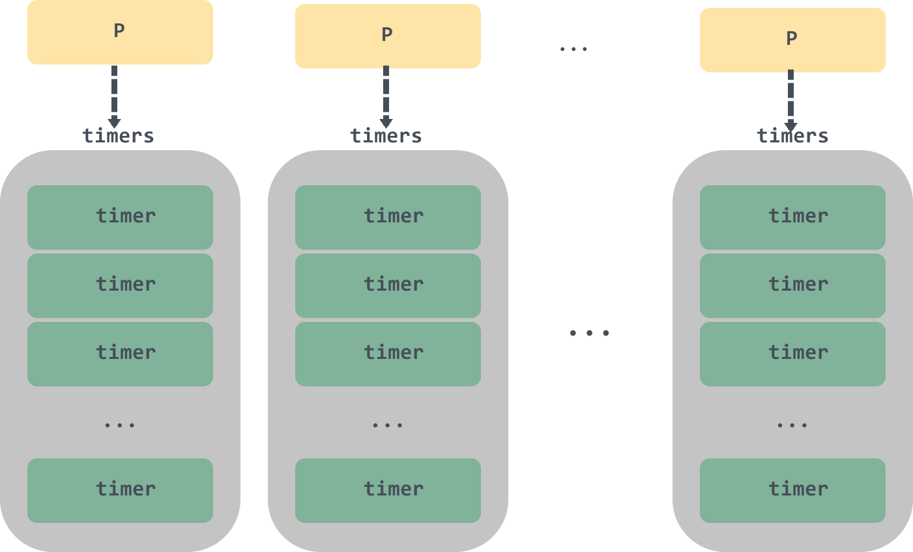

# Go中定时器实现原理及源码解析

> 转载请声明出处哦~，本篇文章发布于luozhiyun的博客：https://www.luozhiyun.com
>
> 本文使用的go的源码15.7，需要注意的是由于timer是1.14版本进行改版，但是1.14和1.15版本的timer并无很大区别

我在春节期间写了一篇文章有关时间轮的：https://www.luozhiyun.com/archives/444。后来有同学建议我去看看 1.14版本之后的 timer 优化。然后我就自己就时间轮和 timer 也做了个 benchmark：

```
goos: darwin
goarch: amd64
pkg: gin-test/api/main
BenchmarkTimingWheel_StartStop/N-1m-12   4582120               254 ns/op              85 B/op          2 allocs/op
BenchmarkTimingWheel_StartStop/N-5m-12   3356630               427 ns/op              46 B/op          1 allocs/op
BenchmarkTimingWheel_StartStop/N-10m-12                  2474842               483 ns/op              60 B/op          1 allocs/op
BenchmarkStandardTimer_StartStop/N-1m-12                 6777975               179 ns/op              84 B/op          1 allocs/op
BenchmarkStandardTimer_StartStop/N-5m-12                 6431217               231 ns/op              85 B/op          1 allocs/op
BenchmarkStandardTimer_StartStop/N-10m-12                5374492               266 ns/op              83 B/op          1 allocs/op
PASS
ok      gin-test/api/main       60.414s
```

从上面可以直接看出，在添加了一千万个定时器后，时间轮的单次调用时间有明显的上涨，但是 timer 却依然很稳。

从官方的一个数据显示：

```
name                      old time/op  new time/op  delta
AfterFunc-12              1.57ms ± 1%  0.07ms ± 1%  -95.42%  (p=0.000 n=10+8)
After-12                  1.63ms ± 3%  0.11ms ± 1%  -93.54%  (p=0.000 n=9+10)
Stop-12                   78.3µs ± 3%  73.6µs ± 3%   -6.01%  (p=0.000 n=9+10)
SimultaneousAfterFunc-12   138µs ± 1%   111µs ± 1%  -19.57%  (p=0.000 n=10+9)
StartStop-12              28.7µs ± 1%  31.5µs ± 5%   +9.64%  (p=0.000 n=10+7)
Reset-12                  6.78µs ± 1%  4.24µs ± 7%  -37.45%  (p=0.000 n=9+10)
Sleep-12                   183µs ± 1%   125µs ± 1%  -31.67%  (p=0.000 n=10+9)
Ticker-12                 5.40ms ± 2%  0.03ms ± 1%  -99.43%  (p=0.000 n=10+10)
...
```

在很多项测试中，性能确实得到了很大的增强。下面也就一起看看性能暴涨的原因。

## 介绍

### 1.13 版本的 timer

Go 在1.14版本之前是使用 64 个最小堆，运行时创建的所有计时器都会加入到最小堆中，每个处理器（P）创建的计时器会由对应的最小堆维护。


下面是1.13版本 `runtime.time`源码：

```go
const timersLen = 64

var timers [timersLen]struct {
	timersBucket
	// padding， 防止false sharing 
	pad [sys.CacheLineSize - unsafe.Sizeof(timersBucket{})%sys.CacheLineSize]byte
}
// 获取 P 对应的 Bucket
func (t *timer) assignBucket() *timersBucket {
	id := uint8(getg().m.p.ptr().id) % timersLen
	t.tb = &timers[id].timersBucket
	return t.tb
}

type timersBucket struct {
	lock         mutex
	gp           *g
	created      bool
	sleeping     bool
	rescheduling bool
	sleepUntil   int64
	waitnote     note
    // timer 列表
	t            []*timer
}
```

通过上面的 assignBucket 方法可以知道，如果当前机器上的处理器 P 的个数超过了 64，多个处理器上的计时器就可能存储在同一个桶 timersBucket 中。

每个桶负责管理一堆这样有序的 timer，同时每个桶都会有一个对应的 timerproc 异步任务来负责不断调度这些 timer。t

imerproc 会从 timersBucket 不断取堆顶元素，如果堆顶的 timer 已到期则执行，没有任务到期则 sleep，所有任务都消耗完了，那么调用 gopark 挂起，直到有新的 timer 被添加到桶中时，才会被重新唤醒。

timerproc 在 sleep 的时候会调用 notetsleepg ，继而引发entersyscallblock调用，该方法会主动调用 handoffp ，解绑 M 和 P。当下一个定时时间到来时，又会进行 M 和 P 的绑定，处理器 P 和线程 M 之间频繁的上下文切换也是 timer 的首要性能影响因素之一。

### 1.14 版本后 timer 的变化

在Go 在1.14版本之后，移除了timersBucket，所有的计时器都以最小四叉堆的形式存储 P 中。

```go
type p struct {
	... 
	// 互斥锁
	timersLock mutex
	// 存储计时器的最小四叉堆
	timers []*timer
	// 计时器数量
	numTimers uint32
	// 处于 timerModifiedEarlier 状态的计时器数量
	adjustTimers uint32
	// 处于 timerDeleted 状态的计时器数量
	deletedTimers uint32
	...
}
```



timer 不再使用 timerproc 异步任务来调度，而是改用调度循环或系统监控调度的时候进行触发执行，减少了线程之间上下文切换带来的性能损失，并且通过使用 netpoll 阻塞唤醒机制可以让 timer 更加及时的得到执行。

### timer的使用

`time.Timer`计时器必须通过`time.NewTimer`、`time.AfterFunc`或者 `time.After` 函数创建。

如下`time.NewTimer`：

通过定时器的字段C,我们可以及时得知定时器到期的这个事件来临，C是一个chan time.Time类型的缓冲通道，一旦触及到期时间，定时器就会向自己的C字段发送一个time.Time类型的元素值

```go
func main() {
	//初始化定时器
	t := time.NewTimer(2 * time.Second)
	//当前时间
	now := time.Now()
	fmt.Printf("Now time : %v.\n", now)

	expire := <- t.C
	fmt.Printf("Expiration time: %v.\n", expire)
}

```

`time.After`一般是配合select来使用：

```go
func main() { 
	ch1 := make(chan int, 1)
	select {
	case e1 := <-ch1:
		//如果ch1通道成功读取数据，则执行该case处理语句
		fmt.Printf("1th case is selected. e1=%v",e1)
	case <- time.After(2 * time.Second):
		fmt.Println("Timed out")
	}
}
```

`time.Afterfunc`可以在设置时间过后执行一个函数：

```go
func main() {
	f := func(){
		fmt.Printf("Expiration time : %v.\n", time.Now())
	}
	time.AfterFunc(1*time.Second, f)
 	time.Sleep(2 * time.Second)
}
```

## 分析

### 初始化&Timer结构体

我们先看看NewTimer方法是如何创建一个Timer的：

```go
type Timer struct {
    C <-chan Time
    r runtimeTimer
}

func NewTimer(d Duration) *Timer {
	// 初始化一个channel，用于返回
	c := make(chan Time, 1)
	t := &Timer{
		C: c,
		r: runtimeTimer{
			when: when(d),
			f:    sendTime,
			arg:  c,
		},
	}
	// 调用runtime.time的startTimer方法
	startTimer(&t.r)
	return t
}

func startTimer(*runtimeTimer)
```

NewTimer方法主要是初始化一个Timer，然后调用startTimer方法，并返回Timer。startTimer方法的真正逻辑并不在time包里面，我们可以使用到上一节提到的使用dlv调试汇编代码：

```
sleep.go:94     0xd8ea09        e872c7faff              call $time.startTimer
```

得知startTimer实际上调用的是`runtime.time.startTimer`方法。也就是说`time.Timer`只是对runtime包中timer的一层wrap。这层自身实现的最核心功能是将底层的超时回调转换为发送channel消息。

下面我们看看`runtime.startTimer`：

```go
func startTimer(t *timer) {
	...
	addtimer(t)
}
```

startTimer方法会将传入的runtimeTimer转为timer，然后调用addtimer方法。

在NewTimer方法中会初始化一个runtimeTimer结构体，这个结构体实际上会被当做`runtime.time`中的timer结构体传入到startTimer方法中，所以下面我们来看看timer：

```go
type timer struct {
	// 对应处理器P的指针
	pp puintptr 
	// 定时器被唤醒的时间
	when   int64
    // 唤醒的间隔时间
	period int64
	// 唤醒时被调用的函数
	f      func(interface{}, uintptr)
	// 被调用的函数的参数
	arg    interface{} 
	seq    uintptr
	// 处于timerModifiedXX状态时用于设置when字段 
	nextwhen int64 
	// 定时器的状态
	status uint32
}
```

除此之外，timer还有一些标志位来表示 status 状态：

```go
const (
	// 初始化状态
	timerNoStatus = iota

	// 等待被调用
	// timer 已在 P 的列表中
	timerWaiting

	// 表示 timer 在运行中 
	timerRunning

	// timer 已被删除 
	timerDeleted

	// timer 正在被移除 
	timerRemoving

	// timer 已被移除，并停止运行 
	timerRemoved

	// timer 被修改了 
	timerModifying
 
  	// 被修改到了更早的时间 
	timerModifiedEarlier 
  
  	// 被修改到了更晚的时间
	timerModifiedLater
 
  // 已经被修改，并且正在被移动
	timerMoving
)
```

### addtimer 新增 timer

**runtime.addtimer**

```go
func addtimer(t *timer) {
	// 定时器被唤醒的时间的时间不能为负数
	if t.when < 0 {
		t.when = maxWhen
	}
	// 状态必须为初始化
	if t.status != timerNoStatus {
		throw("addtimer called with initialized timer")
	}
	// 设置为等待调度
	t.status = timerWaiting

	when := t.when
	// 获取当前 P
	pp := getg().m.p.ptr()
	lock(&pp.timersLock)
	// 清理 P 的 timer 列表头中的 timer
	cleantimers(pp)
	// 将 timer 加入到 P 的最小堆中
	doaddtimer(pp, t)
	unlock(&pp.timersLock)
	// 唤醒 netpoller 中休眠的线程
	wakeNetPoller(when)
}
```

1. addtimer 会对 timer 被唤醒的时间 when 进行校验，以及校验 status 必须是新出初始化的 timer；
2. 接着会在加锁后调用 cleantimers 对 P 中对应的 timer 列表的头节点进行清理工作，清理完后调用 doaddtimer 将 timer 加入到 P 的最小堆中，并释放锁；
3. 调用 wakeNetPoller 唤醒 netpoller 中休眠的线程。

下面分别来看看 addtimer 中几个重要函数的具体实现：

**runtime.cleantimers**

```go
func cleantimers(pp *p) {
	gp := getg()
	for {
		// 调度器列表为空，直接返回
		if len(pp.timers) == 0 {
			return
		}
		// 如果当前 G 被抢占了，直接返回
		if gp.preemptStop {
			return
		}
		// 获取第一个 timer
		t := pp.timers[0]
		if t.pp.ptr() != pp {
			throw("cleantimers: bad p")
		}
		switch s := atomic.Load(&t.status); s {
		case timerDeleted:
			// 设置 timer 的状态
			if !atomic.Cas(&t.status, s, timerRemoving) {
				continue
			}
			// 删除第一个 timer
			dodeltimer0(pp)
			// 删除完毕后重置状态为 timerRemoved
			if !atomic.Cas(&t.status, timerRemoving, timerRemoved) {
				badTimer()
			}
			atomic.Xadd(&pp.deletedTimers, -1)
		// timer 被修改到了更早或更晚的时间
		case timerModifiedEarlier, timerModifiedLater:
			// 将 timer 状态设置为 timerMoving
			if !atomic.Cas(&t.status, s, timerMoving) {
				continue
			}
			// 重新设置 when 字段
			t.when = t.nextwhen
			// 在列表中删除后重新加入 
			dodeltimer0(pp)
			doaddtimer(pp, t)
			if s == timerModifiedEarlier {
				atomic.Xadd(&pp.adjustTimers, -1)
			}
			// 设置状态为 timerWaiting
			if !atomic.Cas(&t.status, timerMoving, timerWaiting) {
				badTimer()
			}
		default: 
			return
		}
	}
}
```

cleantimers 函数中使用了一个无限循环来获取头节点。如果头节点的状态是 timerDeleted ，那么需要从 timer 列表中删除；如果头节点的状态是 timerModifiedEarlier 或 timerModifiedLater ，表示头节点的触发的时间被修改到了更早或更晚的时间，那么就先从 timer队列中删除再重新添加。

**runtime.doaddtimer**

```go
func doaddtimer(pp *p, t *timer) { 
	// Timers 依赖于 netpoller
	// 所以如果 netpoller 没有启动，需要启动一下
	if netpollInited == 0 {
		netpollGenericInit()
	}
	// 校验是否早已在 timer 列表中
	if t.pp != 0 {
		throw("doaddtimer: P already set in timer")
	}
	// 设置 timer 与 P 的关联
	t.pp.set(pp)
	i := len(pp.timers)
	// 将 timer 加入到 P 的 timer 列表中
	pp.timers = append(pp.timers, t)
	// 维护 timer 在 最小堆中的位置
	siftupTimer(pp.timers, i)
	// 如果 timer 是列表中头节点，需要设置一下 timer0When
	if t == pp.timers[0] {
		atomic.Store64(&pp.timer0When, uint64(t.when))
	}
	atomic.Xadd(&pp.numTimers, 1)
}
```

doaddtimer 函数实际上很简单，主要是将 timer 与 P 设置关联关系，并将 timer 加入到 P 的 timer 列表中，并维护 timer 列表最小堆的顺序。

**runtime.wakeNetPoller**

```go
func wakeNetPoller(when int64) {
	if atomic.Load64(&sched.lastpoll) == 0 {  
		pollerPollUntil := int64(atomic.Load64(&sched.pollUntil))
		// 如果计时器的触发时间小于netpoller的下一次轮询时间
		if pollerPollUntil == 0 || pollerPollUntil > when {
			// 向netpollBreakWr里面写入数据，立即中断netpoll
			netpollBreak()
		}
	}
}

func netpollBreak() {
	if atomic.Cas(&netpollWakeSig, 0, 1) {
		for {
			var b byte
            // 向 netpollBreakWr 里面写入数据
			n := write(netpollBreakWr, unsafe.Pointer(&b), 1)
			if n == 1 {
				break
			}
			if n == -_EINTR {
				continue
			}
			if n == -_EAGAIN {
				return
			}
			println("runtime: netpollBreak write failed with", -n)
			throw("runtime: netpollBreak write failed")
		}
	}
}
```

wakeNetPoller 主要是将 timer 下次调度的时间和 netpoller 的下一次轮询时间相比，如果小于的话，调用 netpollBreak 向 netpollBreakWr 里面写入数据，立即中断netpoll。具体如何中断的，我们下面再聊。

### stopTimer 终止 timer

终止 timer 的逻辑主要是 timer 的状态的变更：

如果该timer处于 timerWaiting 或 timerModifiedLater 或 timerModifiedEarlier：

* timerModifying -> timerDeleted

如果该timer处于 其他状态:

* 待状态改变或者直接返回

所以在终止 timer 的过程中不会去删除 timer，而是标记一个状态，等待被删除。

### modTimer 修改 timer

```go
func modtimer(t *timer, when, period int64, f func(interface{}, uintptr), arg interface{}, seq uintptr) bool {
	if when < 0 {
		when = maxWhen
	} 
	status := uint32(timerNoStatus)
	wasRemoved := false
	var pending bool
	var mp *m
loop:
	for {
		// 修改 timer 状态
		switch status = atomic.Load(&t.status); status {
		...
	} 
	t.period = period
	t.f = f
	t.arg = arg
	t.seq = seq
	// 如果 timer 已被删除，那么需要重新添加到 timer 列表中
	if wasRemoved {
		t.when = when
		pp := getg().m.p.ptr()
		lock(&pp.timersLock)
		doaddtimer(pp, t)
		unlock(&pp.timersLock)
		if !atomic.Cas(&t.status, timerModifying, timerWaiting) {
			badTimer()
		}
		releasem(mp)
		wakeNetPoller(when)
	} else {
		
		t.nextwhen = when

		newStatus := uint32(timerModifiedLater)
		// 如果修改后的时间小于修改前的时间，将状态设置为 timerModifiedEarlier
		if when < t.when {
			newStatus = timerModifiedEarlier
		} 
		... 
		if !atomic.Cas(&t.status, timerModifying, newStatus) {
			badTimer()
		}
		releasem(mp)

		// 如果修改时间提前，那么触发 netpoll 中断
		if newStatus == timerModifiedEarlier {
			wakeNetPoller(when)
		}
	}

	return pending
}
```

modtimer 进入到 for 循环后会根据不同的状态做状态设置以及必要字段的处理；如果是 timer 已被删除，那么需要重新添加到 timer 列表中；如果 timer 修改后的时间小于修改前的时间，将状态设置为 timerModifiedEarlier，修改时间提前，还需要触发 netpoll 中断。

### timer 的运行

聊完了如何添加 timer，下面我们来看看 timer 是如何运行的。timer 的运行是交给 `runtime.runtimer`函数执行的，这个函数会检查 P 上最小堆的最顶上的 timer 的状态，根据状态做不同的处理。

```go
func runtimer(pp *p, now int64) int64 {
	for {
		// 获取最小堆的第一个元素
		t := pp.timers[0]
		if t.pp.ptr() != pp {
			throw("runtimer: bad p")
		}
		// 获取 timer 状态
		switch s := atomic.Load(&t.status); s {
		// timerWaiting
		case timerWaiting:
			// 还没到时间，返回下次执行时间
			if t.when > now {
				// Not ready to run.
				return t.when
			}
			// 修改状态为 timerRunning
			if !atomic.Cas(&t.status, s, timerRunning) {
				continue
			}
			// 运行该 timer
			runOneTimer(pp, t, now)
			return 0
		// timerDeleted
		case timerDeleted:
			if !atomic.Cas(&t.status, s, timerRemoving) {
				continue
			}
			// 删除最小堆的第一个 timer
			dodeltimer0(pp)
			if !atomic.Cas(&t.status, timerRemoving, timerRemoved) {
				badTimer()
			}
			atomic.Xadd(&pp.deletedTimers, -1)
			if len(pp.timers) == 0 {
				return -1
			}
		// 需要重新移动位置的 timer
		case timerModifiedEarlier, timerModifiedLater:
			if !atomic.Cas(&t.status, s, timerMoving) {
				continue
			}
			t.when = t.nextwhen
			// 删除最小堆的第一个 timer
			dodeltimer0(pp)
			// 将该 timer 重新添加到最小堆
			doaddtimer(pp, t)
			if s == timerModifiedEarlier {
				atomic.Xadd(&pp.adjustTimers, -1)
			}
			if !atomic.Cas(&t.status, timerMoving, timerWaiting) {
				badTimer()
			}

		case timerModifying: 
			osyield()

		case timerNoStatus, timerRemoved: 
			badTimer()
		case timerRunning, timerRemoving, timerMoving: 
			badTimer()
		default:
			badTimer()
		}
	}
}
```

runtimer 里面会启动一个 for 循环，不停的检查 P 的 timer 列表的第一个元素的状态。

* 如果该 timer 处于 timerWaiting，那么判断当前的时间大于 timer 执行的时间，则调用 runOneTimer 执行；
* 如果该 timer 处于 timerDeleted，表示该 timer 是需要被删除的，那么调用 dodeltimer0 删除最小堆的第一个 timer ，并修改其状态；
* 如果该 timer 状态是 timerModifiedEarlier 、timerModifiedLater，那么表示该 timer 的执行时间被修改过，需要重新调整它在最小堆中的位置，所以先调用 dodeltimer0 删除该 timer，再调用 doaddtimer 将该 timer 重新添加到最小堆。

**runtime.runOneTimer**

```go
func runOneTimer(pp *p, t *timer, now int64) {
	... 
	// 需要被执行的函数
	f := t.f
	// 被执行函数的参数
	arg := t.arg
	seq := t.seq
	// 表示该 timer 为 ticker，需要再次触发
	if t.period > 0 { 
		// 放入堆中并调整触发时间
		delta := t.when - now
		t.when += t.period * (1 + -delta/t.period)
		siftdownTimer(pp.timers, 0)
		if !atomic.Cas(&t.status, timerRunning, timerWaiting) {
			badTimer()
		}
		updateTimer0When(pp)
	// 一次性 timer
	} else {
		// 删除该 timer.
		dodeltimer0(pp)
		if !atomic.Cas(&t.status, timerRunning, timerNoStatus) {
			badTimer()
		}
	}  
	unlock(&pp.timersLock)
	// 运行该函数
	f(arg, seq)
	lock(&pp.timersLock)
	...
}
```

runOneTimer 会根据 period 是否大于0判断该 timer 是否需要反复执行，如果是的话需要重新调整 when 下次执行时间后重新调整该 timer 在堆中的位置。一次性 timer 的话会执行 dodeltimer0 删除该 timer ，最后运行 timer 中的函数；

### timer 的触发

下面这里是我觉得比较有意思的地方，timer 的触发有两种：

* 从调度循环中直接触发；

* 另一种是Go语言的后台系统监控中会定时触发；

#### 调度循环触发

调度循环，我在这篇文章 https://www.luozhiyun.com/archives/448 已经讲的很清楚了，不明白的同学可以自己再去看看。

整个调度循环会有三个地方去检查是否有可执行的 timer：

1. 调用 `runtime.schedule` 执行调度时；
2. 调用`runtime.findrunnable`获取可执行函数时；
3. 调用`runtime.findrunnable`执行抢占时；

**runtime.schedule**

```go
func schedule() {
	_g_ := getg()
	...
top:
	pp := _g_.m.p.ptr()
	...
	// 检查是否有可执行 timer 并执行
	checkTimers(pp, 0) 
	var gp *g
	...
	if gp == nil {
		gp, inheritTime = findrunnable() // blocks until work is available
	}
	... 
	execute(gp, inheritTime)
}
```

下面我们看看 checkTimers 做了什么：

**runtime.checkTimers**

```go
func checkTimers(pp *p, now int64) (rnow, pollUntil int64, ran bool) { 
	// 如果没有需要调整的 timer
	if atomic.Load(&pp.adjustTimers) == 0 {
		// 获取 timer0 的执行时间 
		next := int64(atomic.Load64(&pp.timer0When))
		if next == 0 {
			return now, 0, false
		}
		if now == 0 {
			now = nanotime()
		}
		// 下次执行大于当前时间，
		if now < next { 
			// 需要删除的 timer 个数小于 timer列表个数的4分之1，直接返回
			if pp != getg().m.p.ptr() || int(atomic.Load(&pp.deletedTimers)) <= int(atomic.Load(&pp.numTimers)/4) {
				return now, next, false
			}
		}
	} 
	lock(&pp.timersLock)
	// 进行调整 timer
	adjusttimers(pp) 
	rnow = now
	if len(pp.timers) > 0 {
		if rnow == 0 {
			rnow = nanotime()
		}
		for len(pp.timers) > 0 { 
			// 查找堆中是否存在需要执行的 timer
			if tw := runtimer(pp, rnow); tw != 0 {
				if tw > 0 {
					pollUntil = tw
				}
				break
			}
			ran = true
		}
	}

	// 如果需要删除的 timer 超过了 timer 列表数量的四分之一，那么清理需要删除的 timer
	if pp == getg().m.p.ptr() && int(atomic.Load(&pp.deletedTimers)) > len(pp.timers)/4 {
		clearDeletedTimers(pp)
	}

	unlock(&pp.timersLock)

	return rnow, pollUntil, ran
}
```

checkTimers 中主要做了这么几件事：

1. 检查是否有需要进行调整的 timer， 如果没有需要执行的计时器时，直接返回；如果下一个要执行的 timer 没有到期并且需要删除的计时器较少（四分之一）时也会直接返回；
2. 调用 adjusttimers 进行 timer 列表的调整，主要是维护 timer 列表的最小堆的顺序；
3. 调用 `runtime.runtimer`查找堆中是否存在需要执行的timer， `runtime.runtimer`上面已经讲过了，这里不再赘述；
4. 如果当前 Goroutine 的 P 和传入的  P 相同，并且需要删除的 timer 超过了 timer 列表数量的四分之一，那么调用 clearDeletedTimers 清理需要删除的 timer；

**runtime.findrunnable**

```go
func findrunnable() (gp *g, inheritTime bool) {
	_g_ := getg()
top:
	_p_ := _g_.m.p.ptr()
	...
	// 检查 P 中可执行的 timer
	now, pollUntil, _ := checkTimers(_p_, 0)
	... 
    // 如果 netpoll 已被初始化，并且 Waiters 大于零，并且 lastpoll 不为0
	if netpollinited() && atomic.Load(&netpollWaiters) > 0 && atomic.Load64(&sched.lastpoll) != 0 {
		// 尝试从netpoller获取Glist
		if list := netpoll(0); !list.empty() { // 无阻塞
			gp := list.pop()
			//将其余队列放入 P 的可运行G队列
			injectglist(&list)
			casgstatus(gp, _Gwaiting, _Grunnable)
			if trace.enabled {
				traceGoUnpark(gp, 0)
			}
			return gp, false
		}
	}
	...
	// 开始窃取
	for i := 0; i < 4; i++ {
		for enum := stealOrder.start(fastrand()); !enum.done(); enum.next() {
			if sched.gcwaiting != 0 {
				goto top
			}
			// 如果 i>2 表示如果其他 P 运行队列中没有 G ，将要从其他队列的 runnext 中获取
			stealRunNextG := i > 2 // first look for ready queues with more than 1 g
			// 随机获取一个 P
			p2 := allp[enum.position()]
			if _p_ == p2 {
				continue
			}
			// 从其他 P 的运行队列中获取一般的 G 到当前队列中
			if gp := runqsteal(_p_, p2, stealRunNextG); gp != nil {
				return gp, false
			}

			// 如果运行队列中没有 G，那么从 timers 中获取可执行的 timer
			if i > 2 || (i > 1 && shouldStealTimers(p2)) {
				// ran 为 true 表示有执行过 timer
				tnow, w, ran := checkTimers(p2, now)
				now = tnow
				if w != 0 && (pollUntil == 0 || w < pollUntil) {
					pollUntil = w
				}
				if ran {
					// 因为已经运行过 timer 了，说不定已经有准备就绪的 G 了
					// 再次检查本地队列尝试获取 G
					if gp, inheritTime := runqget(_p_); gp != nil {
						return gp, inheritTime
					}
					ranTimer = true
				}
			}
		}
	} 

	if ranTimer {
		// 执行完一个 timer 后可能存在已经就绪的 G
		goto top
	}

stop:  
	...
	delta := int64(-1)
	if pollUntil != 0 {
		// checkTimers ensures that polluntil > now.
		delta = pollUntil - now
	}
	...
	// poll network
	// 休眠前再次检查 poll 网络
	if netpollinited() && (atomic.Load(&netpollWaiters) > 0 || pollUntil != 0) && atomic.Xchg64(&sched.lastpoll, 0) != 0 {
		...
		list := netpoll(delta) // 阻塞调用
		lock(&sched.lock)
		_p_ = pidleget()
		unlock(&sched.lock)
		if _p_ == nil {
			injectglist(&list)
		} else {
			acquirep(_p_)
			if !list.empty() {
				gp := list.pop()
				injectglist(&list)
				casgstatus(gp, _Gwaiting, _Grunnable)
				if trace.enabled {
					traceGoUnpark(gp, 0)
				}
				return gp, false
			}
			 
			goto top
		}
	} else if pollUntil != 0 && netpollinited() {
		pollerPollUntil := int64(atomic.Load64(&sched.pollUntil))
		if pollerPollUntil == 0 || pollerPollUntil > pollUntil {
			netpollBreak()
		}
	}
	// 休眠当前 M
	stopm()
	goto top
}
```

findrunnable 我在这篇文章 https://www.luozhiyun.com/archives/448 已经讲的很清楚了，这里提取 timer 相关的代码分析一下：

1. findrunnable 在窃取前先会调用 checkTimers  检查 P 中可执行的 timer；
2. 如果 netpoll 中有等待的 waiter，那么会调用 netpoll 尝试无阻塞的从netpoller获取Glist；
3. 如果获取不到可执行的 G，那么就会开始执行窃取。窃取的时候会调用 checkTimers 随机从其他的 P 中获取 timer；
4. 窃取完毕后也没有可执行的 timer，那么会继续往下，休眠前再次检查 netpoll 网络，调用 netpoll(delta) 函数进行阻塞调用。

#### 系统监控触发

系统监控其实就是 Go 语言的守护进程，它们能够在后台监控系统的运行状态，在出现意外情况时及时响应。它会每隔一段时间检查 Go 语言运行时状态，确保没有异常发生。我们这里不主要去讲系统监控，只抽离出其中的和 timer 相关的代码进行讲解。

**runtime.sysmon**

```go
func sysmon() {
	...
	for {
		...
		now := nanotime()
		// 返回下次需要调度 timer 到期时间
		next, _ := timeSleepUntil()
		...  
		// 如果超过 10ms 没有 poll，则 poll 一下网络
		lastpoll := int64(atomic.Load64(&sched.lastpoll))
		if netpollinited() && lastpoll != 0 && lastpoll+10*1000*1000 < now {
			atomic.Cas64(&sched.lastpoll, uint64(lastpoll), uint64(now))
			list := netpoll(0) // 非阻塞，返回 G 列表
			// G 列表不为空
			if !list.empty() { 
				incidlelocked(-1)
				// 将获取到的 G 列表插入到空闲的 P 中或全局列表中
				injectglist(&list)
				incidlelocked(1)
			}
		}
		// 如果有 timer 到期
		if next < now {
			// 启动新的 M 处理 timer
			startm(nil, false)
		}
		...
	}
}
```

1. sysmon 会通过 timeSleepUntil 遍历所有的 P 的 timer 列表，找到下一个需要执行的 timer；
2. 如果超过 10ms 没有 poll，则 poll 一下网络；
3. 如果有 timer 到期，这个时候直接启动新的 M 处理 timer；

### netpoll 的作用

我们从一开始调用 `runtime.addtimer` 添加 timer 的时候，就会 `runtime.wakeNetPoller`来中断 netpoll ，那么它是如何做到的？我们下面先来看一个官方的例子：

```go
func TestNetpollBreak(t *testing.T) {
	if runtime.GOMAXPROCS(0) == 1 {
		t.Skip("skipping: GOMAXPROCS=1")
	}
	// 初始化 netpoll
	runtime.NetpollGenericInit()

	start := time.Now()
	c := make(chan bool, 2)
	go func() {
		c <- true
		// netpoll 等待时间
		runtime.Netpoll(10 * time.Second.Nanoseconds())
		c <- true
	}()
	<-c 
loop:
	for {
		runtime.Usleep(100)
		// 中断netpoll 等待
		runtime.NetpollBreak()
		runtime.NetpollBreak()
		select {
		case <-c:
			break loop
		default:
		}
	}
	if dur := time.Since(start); dur > 5*time.Second {
		t.Errorf("netpollBreak did not interrupt netpoll: slept for: %v", dur)
	}
}
```

在上面这个例子中，首先会调用 `runtime.Netpoll`进行阻塞等待，然后循环调度 `runtime.NetpollBreak`进行中断阻塞。

**runtime.netpoll**

```go
func netpoll(delay int64) gList {
	if epfd == -1 {
		return gList{}
	}
	var waitms int32
	// 因为传入delay单位是纳秒，下面将纳秒转换成毫秒
	if delay < 0 {
		waitms = -1
	} else if delay == 0 {
		waitms = 0
	} else if delay < 1e6 {
		waitms = 1
	} else if delay < 1e15 {
		waitms = int32(delay / 1e6)
	} else { 
		waitms = 1e9
	}
	var events [128]epollevent
retry:
	// 等待文件描述符转换成可读或者可写
	n := epollwait(epfd, &events[0], int32(len(events)), waitms)
	// 返回负值，那么重新调用epollwait进行等待
	if n < 0 {
		...
		goto retry
	}
	var toRun gList
	for i := int32(0); i < n; i++ {
		ev := &events[i]
		if ev.events == 0 {
			continue
		}
		// 如果是 NetpollBreak 中断的，那么执行 continue 跳过
		if *(**uintptr)(unsafe.Pointer(&ev.data)) == &netpollBreakRd {
			if ev.events != _EPOLLIN {
				println("runtime: netpoll: break fd ready for", ev.events)
				throw("runtime: netpoll: break fd ready for something unexpected")
			}
			if delay != 0 { 
				var tmp [16]byte
				read(int32(netpollBreakRd), noescape(unsafe.Pointer(&tmp[0])), int32(len(tmp)))
				atomic.Store(&netpollWakeSig, 0)
			}
			continue
		} 
		...
	}
	return toRun
}
```

在 调用`runtime.findrunnable`执行抢占时，最后会传入一个时间，超时阻塞调用 netpoll，如果没有事件中断，那么循环调度会一直等待直到 netpoll 超时后才往下进行：

```go
func findrunnable() (gp *g, inheritTime bool) {
	...
	delta := int64(-1)
	if pollUntil != 0 {
		// checkTimers ensures that polluntil > now.
		delta = pollUntil - now
	}
	...
	// poll network
	// 休眠前再次检查 poll 网络
	if netpollinited() && (atomic.Load(&netpollWaiters) > 0 || pollUntil != 0) && atomic.Xchg64(&sched.lastpoll, 0) != 0 {
		...
		// 阻塞调用
		list := netpoll(delta) 
		
	}  
	...
	// 休眠当前 M
	stopm()
	goto top
}
```

所以在调用 `runtime.addtimer` 添加 timer 的时候进行 netpoll 的中断操作可以更加灵敏的响应 timer 这类时间敏感的任务。

## 总结

我们通过 timer 的 1.13版本以及1.14版本后的对比可以发现，即使是一个定时器 go 语言都做了相当多的优化工作。从原来的需要维护 64 个桶，然后每个桶里面跑异步任务，到现在的将 timer列表直接挂到了 P 上面，这不仅减少了上下文切换带来的性能损耗，也减少了在锁之间的争抢问题，通过这些优化后有了可以媲美时间轮的性能表现。

## Reference

go1.14基于netpoll优化timer定时器实现原理 http://xiaorui.cc/archives/6483

https://github.com/golang/go/commit/6becb033341602f2df9d7c55cc23e64b925bbee2

https://github.com/golang/go/commit/76f4fd8a5251b4f63ea14a3c1e2fe2e78eb74f81

计时器 https://golang.design/under-the-hood/zh-cn/part2runtime/ch06sched/timer/

《Golang》Netpoll解析 https://www.pefish.club/2020/05/04/Golang/1011Netpoll%E8%A7%A3%E6%9E%90/

time.Timer 源码分析 https://docs.google.com/presentation/d/1c2mRWA-FiihgpbGsE4uducou7X5d4WoiiLVab-ewsT8/edit#slide=id.g6d01ce596e_0_77

