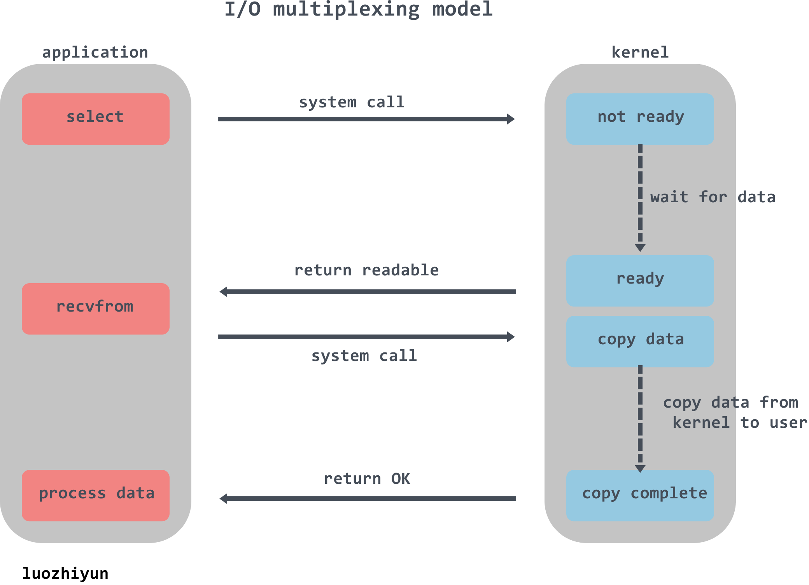
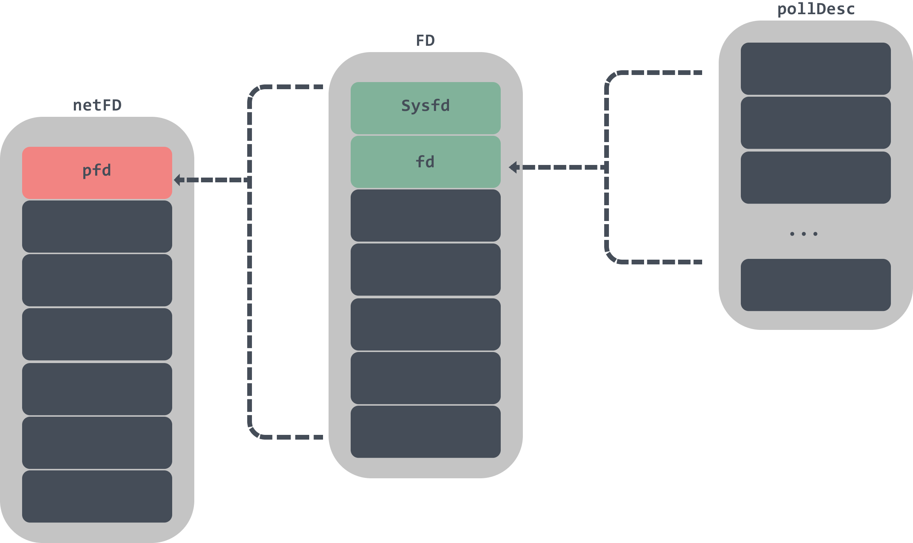
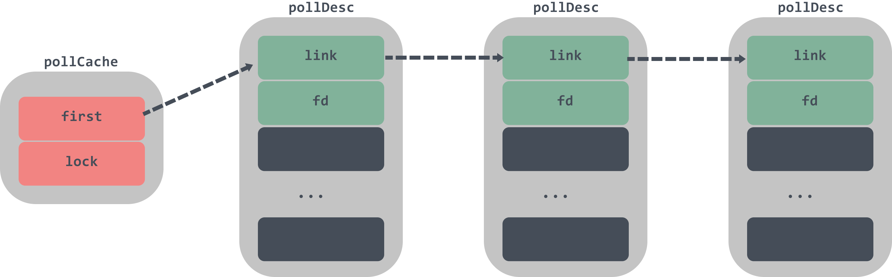

# 详解Go语言I/O多路复用netpoller模型

> 转载请声明出处哦~，本篇文章发布于luozhiyun的博客：https://www.luozhiyun.com
>
> 本文使用的go的源码1.15.7

可以从 Go 源码目录结构和对应代码文件了解 Go 在不同平台下的网络 I/O 模式的实现。比如，在 Linux 系统下基于 epoll，freeBSD 系统下基于 kqueue，以及 Windows 系统下基于 iocp。

因为我们的代码都是部署在Linux上的，所以本文以epoll封装实现为例子来讲解Go语言中I/O多路复用的源码实现。

## 介绍

### I/O多路复用

所谓 I/O 多路复用指的就是 select/epoll 这一系列的多路选择器：支持单一线程同时监听多个文件描述符（I/O 事件），阻塞等待，并在其中某个文件描述符可读写时收到通知。以防很多同学对select或epoll不那么熟悉，所以下面先来讲讲这两个选择器。

首先我们先说一下什么是文件描述符（File descriptor），根据它的英文首字母也简称FD，它是一个用于表述指向文件的引用的抽象化概念。它是一个索引值，指向内核为每一个进程所维护的该进程打开文件的记录表。当程序打开一个现有文件或者创建一个新文件时，内核向进程返回一个文件描述符。

#### select

```go
int select(int nfds,
            fd_set *restrict readfds,
            fd_set *restrict writefds,
            fd_set *restrict errorfds,
            struct timeval *restrict timeout);
```

writefds、readfds、和exceptfds是三个文件描述符集合。select会遍历每个集合的前nfds个描述符，分别找到可以读取、可以写入、发生错误的描述符，统称为就绪的描述符。

timeout参数表示调用select时的阻塞时长。如果所有文件描述符都未就绪，就阻塞调用进程，直到某个描述符就绪，或者阻塞超过设置的 timeout 后，返回。如果timeout参数设为 NULL，会无限阻塞直到某个描述符就绪；如果timeout参数设为 0，会立即返回，不阻塞。

当select函数返回后，可以通过遍历fdset，来找到就绪的描述符。



select的缺点也列举一下：

1. select最大的缺陷就是单个进程所打开的FD是有一定限制的，它由FD_SETSIZE设置，默认值是1024;
2. 每次调用 select，都需要把 fd 集合从用户态拷贝到内核态，这个开销在 fd 很多时会很大;
3. 每次 kernel 都需要线性扫描整个 fd_set，所以随着监控的描述符 fd 数量增长，其 I/O 性能会线性下降;

#### epoll

epoll是selec的增强版本，避免了“性能开销大”和“文件描述符数量少”两个缺点。

为方便理解后续的内容，先看一下epoll的用法：

```
int listenfd = socket(AF_INET, SOCK_STREAM, 0);   
bind(listenfd, ...)
listen(listenfd, ...)

int epfd = epoll_create(...);
epoll_ctl(epfd, ...); //将所有需要监听的fd添加到epfd中

while(1){
    int n = epoll_wait(...)
    for(接收到数据的socket){
        //处理
    }
}
```

先用epoll_create创建一个epoll对象实例epfd，同时返回一个引用该实例的文件描述符，返回的文件描述符仅仅指向对应的epoll实例，并不表示真实的磁盘文件节点。

epoll实例内部存储：

- 监听列表：所有要监听的文件描述符，使用红黑树；
- 就绪列表：所有就绪的文件描述符，使用链表；

再通过epoll_ctl将需要监视的fd添加到epfd中，同时为fd设置一个回调函数，并监听事件event，并添加到监听列表中。当有事件发生时，会调用回调函数，并将fd添加到epoll实例的就绪队列上。

最后调用epoll_wait阻塞监听 epoll 实例上所有的fd的 I/O 事件。当就绪列表中已有数据，那么epoll_wait直接返回，解决了select每次都需要轮询一遍的问题。

epoll的优点：

epoll的监听列表使用红黑树存储，epoll_ctl 函数添加进来的 fd 都会被放在红黑树的某个节点内，而红黑树本身插入和删除性能比较稳定，时间复杂度 O(logN)，并且可以存储大量的的fd，避免了只能存储1024个fd的限制；

epoll_ctl 中为每个文件描述符指定了回调函数，并在就绪时将其加入到就绪列表，因此不需要像select一样历检测每个文件描述符，只需要判断就绪列表是否为空即可；

## 解析

netpoll本质上时对 I/O 多路复用技术的封装，所以自然也是和epoll一样脱离不了下面几步：

1. netpoll创建及其初始化；
2. 向netpoll中加入待监控的任务；
3. 从netpoll获取触发的事件；

在go中对epoll提供的三个函数进行了封装：

```
func netpollinit()
func netpollopen(fd uintptr, pd *pollDesc) int32
func netpoll(delay int64) gList
```

netpollinit函数负责初始化netpoll；

netpollopen负责监听文件描述符上的事件；

netpoll会阻塞等待返回一组已经准备就绪的 Goroutine；

下面是Go语言中编写的一个TCP server：

```go
func main() {
    listen, err := net.Listen("tcp", ":8888")
    if err != nil {
        fmt.Println("listen error: ", err)
        return
    } 
    for {
        conn, err := listen.Accept()
        if err != nil {
            fmt.Println("accept error: ", err)
            break
        } 
        // 创建一个goroutine来负责处理读写任务
        go HandleConn(conn)
    }
} 
```

下面我们跟着这个TCP server的源码一起看看是在哪里使用了netpoll来完成epoll的调用。 

### net.Listen

这个TCP server中会调用`net.Listen`创建一个socket同时返回与之对应的fd，该fd用来初始化listener的netFD(go层面封装的网络文件描述符)，接着调用 netFD的listenStream方法完成对 socket 的 bind&listen和netFD的初始化。

调用过程如下：


```go
func socket(ctx context.Context, net string, family, sotype, proto int, ipv6only bool, laddr, raddr sockaddr, ctrlFn func(string, string, syscall.RawConn) error) (fd *netFD, err error) {
	// 创建一个socket
	s, err := sysSocket(family, sotype, proto)
	if err != nil {
		return nil, err
	}
	...
	// 创建fd
	if fd, err = newFD(s, family, sotype, net); err != nil {
		poll.CloseFunc(s)
		return nil, err
	} 
	if laddr != nil && raddr == nil {
		switch sotype {
		case syscall.SOCK_STREAM, syscall.SOCK_SEQPACKET:
			// 调用 netFD的listenStream方法完成对 socket 的 bind&listen和netFD的初始化
			if err := fd.listenStream(laddr, listenerBacklog(), ctrlFn); err != nil {
				fd.Close()
				return nil, err
			}
			return fd, nil
		case syscall.SOCK_DGRAM:
			...
		}
	}
	...
	return fd, nil
}

func newFD(sysfd syscall.Handle, family, sotype int, net string) (*netFD, error) {
	ret := &netFD{
		pfd: poll.FD{
			Sysfd:         sysfd,
			IsStream:      sotype == syscall.SOCK_STREAM,
			ZeroReadIsEOF: sotype != syscall.SOCK_DGRAM && sotype != syscall.SOCK_RAW,
		},
		family: family,
		sotype: sotype,
		net:    net,
	}
	return ret, nil
}
```

sysSocket方法会发起一个系统调用创建一个socket，newFD会创建一个netFD，然后调用netFD的listenStream方法进行bind&listen操作，并对netFD进行init。



netFD是一个文件描述符的封装，netFD中包含一个FD数据结构，FD中包含了Sysfd 和pollDesc两个重要的数据结构，Sysfd是sysSocket返回的socket系统文件描述符，pollDesc用于监控文件描述符的可读或者可写。

我们继续看listenStream：

```go
func (fd *netFD) listenStream(laddr sockaddr, backlog int, ctrlFn func(string, string, syscall.RawConn) error) error {
	...
	// 完成绑定操作
	if err = syscall.Bind(fd.pfd.Sysfd, lsa); err != nil {
		return os.NewSyscallError("bind", err)
	}
	// 进行监听操作
	if err = listenFunc(fd.pfd.Sysfd, backlog); err != nil {
		return os.NewSyscallError("listen", err)
	}
	// 初始化fd
	if err = fd.init(); err != nil {
		return err
	}
	lsa, _ = syscall.Getsockname(fd.pfd.Sysfd)
	fd.setAddr(fd.addrFunc()(lsa), nil)
	return nil
}
```

listenStream方法会调用Bind方法完成fd的绑定操作，然后调用listenFunc进行监听，接着调用fd的init方法，完成FD、pollDesc初始化。

```go
func (pd *pollDesc) init(fd *FD) error {
	// 调用到runtime.poll_runtime_pollServerInit
	serverInit.Do(runtime_pollServerInit)
	// 调用到runtime.poll_runtime_pollOpen
	ctx, errno := runtime_pollOpen(uintptr(fd.Sysfd))
	...
	return nil
}
```

runtime_pollServerInit用Once封装保证只能被调用一次，这个函数在Linux平台上会创建一个epoll文件描述符实例；

poll_runtime_pollOpen调用了netpollopen会将fd注册到 epoll实例中，并返回一个pollDesc；

#### netpollinit初始化

```go
func poll_runtime_pollServerInit() {
	netpollGenericInit()
}

func netpollGenericInit() {
	if atomic.Load(&netpollInited) == 0 {
		lock(&netpollInitLock)
		if netpollInited == 0 {
			netpollinit()
			atomic.Store(&netpollInited, 1)
		}
		unlock(&netpollInitLock)
	}
}
```

netpollGenericInit会调用平台上特定实现的netpollinit，在Linux中会调用到netpoll_epoll.go的netpollinit方法：

```go
var (
	epfd int32 = -1 // epoll descriptor 
)

func netpollinit() {
	// 创建一个新的 epoll 文件描述符
	epfd = epollcreate1(_EPOLL_CLOEXEC)
	...
	// 创建一个用于通信的管道
	r, w, errno := nonblockingPipe()
	...
	ev := epollevent{
		events: _EPOLLIN,
	}
	*(**uintptr)(unsafe.Pointer(&ev.data)) = &netpollBreakRd
	// 将读取数据的文件描述符加入监听
	errno = epollctl(epfd, _EPOLL_CTL_ADD, r, &ev)
	...
	netpollBreakRd = uintptr(r)
	netpollBreakWr = uintptr(w)
}
```

调用epollcreate1方法会创建一个epoll文件描述符实例，需要注意的是epfd是一个全局的属性。然后创建一个用于通信的管道，调用epollctl将读取数据的文件描述符加入监听。

#### netpollopen加入事件监听

下面再看看poll_runtime_pollOpen方法：

```go
func poll_runtime_pollOpen(fd uintptr) (*pollDesc, int) {
	pd := pollcache.alloc()
	lock(&pd.lock)
	if pd.wg != 0 && pd.wg != pdReady {
		throw("runtime: blocked write on free polldesc")
	}
	if pd.rg != 0 && pd.rg != pdReady {
		throw("runtime: blocked read on free polldesc")
	}
	pd.fd = fd
	pd.closing = false
	pd.everr = false
	pd.rseq++
	pd.rg = 0
	pd.rd = 0
	pd.wseq++
	pd.wg = 0
	pd.wd = 0
	pd.self = pd
	unlock(&pd.lock)

	var errno int32
	errno = netpollopen(fd, pd)
	return pd, int(errno)
}

func netpollopen(fd uintptr, pd *pollDesc) int32 {
	var ev epollevent
	ev.events = _EPOLLIN | _EPOLLOUT | _EPOLLRDHUP | _EPOLLET
	*(**pollDesc)(unsafe.Pointer(&ev.data)) = pd
	return -epollctl(epfd, _EPOLL_CTL_ADD, int32(fd), &ev)
}
```

poll_runtime_pollOpen方法会通过`pollcache.alloc`初始化总大小约为 4KB的pollDesc结构体。然后重置pd的属性，调用netpollopen向epoll实例epfd加入新的轮询事件监听文件描述符的可读和可写状态。

下面我们再看看pollCache是如何初始化pollDesc的。

```go
type pollCache struct {
	lock  mutex
	first *pollDesc 
}

const pollBlockSize = 4 * 1024

func (c *pollCache) alloc() *pollDesc {
	lock(&c.lock)
	// 初始化首节点
	if c.first == nil {
		const pdSize = unsafe.Sizeof(pollDesc{})
		n := pollBlockSize / pdSize
		if n == 0 {
			n = 1
		} 
		mem := persistentalloc(n*pdSize, 0, &memstats.other_sys)
        // 初始化pollDesc链表
		for i := uintptr(0); i < n; i++ {
			pd := (*pollDesc)(add(mem, i*pdSize))
			pd.link = c.first
			c.first = pd
		}
	}
	pd := c.first
	c.first = pd.link
	lockInit(&pd.lock, lockRankPollDesc)
	unlock(&c.lock)
	return pd
}
```

pollCache的链表头如果为空，那么初始化首节点，首节点是一个pollDesc的链表头，每次调用该结构体都会返回链表头还没有被使用的pollDesc。



到这里就完成了net.Listen的分析，下面我们看看listen.Accept。

### Listener.Accept

Listener.Accept方法最终会调用到netFD的accept方法中：


```go
func (fd *netFD) accept() (netfd *netFD, err error) {
	// 调用netfd.FD的Accept接受新的 socket 连接，返回 socket 的 fd
	d, rsa, errcall, err := fd.pfd.Accept()
	...
	// 构造一个新的netfd
	if netfd, err = newFD(d, fd.family, fd.sotype, fd.net); err != nil {
		poll.CloseFunc(d)
		return nil, err
	}
	// 调用 netFD 的 init 方法完成初始化
	if err = netfd.init(); err != nil {
		netfd.Close()
		return nil, err
	}
	lsa, _ := syscall.Getsockname(netfd.pfd.Sysfd)
	netfd.setAddr(netfd.addrFunc()(lsa), netfd.addrFunc()(rsa))
	return netfd, nil
}
```

这个方法首先会调用到FD的Accept接受新的 socket 连接，并返回新的socket对应的fd，然后调用newFD构造一个新的netfd，并通过init 方法完成初始化。

init方法上面我们已经看过了，下面我们来看看Accept方法：

```go
func (fd *FD) Accept() (int, syscall.Sockaddr, string, error) {
	...
	for {
		// 使用 linux 系统调用 accept 接收新连接，创建对应的 socket
		s, rsa, errcall, err := accept(fd.Sysfd)
		if err == nil {
			return s, rsa, "", err
		}
		switch err {
		case syscall.EINTR:
			continue
		case syscall.EAGAIN:
			if fd.pd.pollable() {
				// 如果当前没有发生期待的 I/O 事件，那么 waitRead 会通过 park goroutine 让逻辑 block 在这里
				if err = fd.pd.waitRead(fd.isFile); err == nil {
					continue
				}
			}
		case syscall.ECONNABORTED: 
			continue
		}
		return -1, nil, errcall, err
	}
}
```

`FD.Accept`方法会使用 linux 系统调用 accept 接收新连接，创建对应的 socket，如果没有可读的消息，waitRead会被阻塞。这些被park住的goroutine会在goroutine的调度中调用`runtime.netpoll`被唤醒。

#### pollWait事件等待

`pollDesc.waitRead`实际上是调用了`runtime.poll_runtime_pollWait`

```go
func poll_runtime_pollWait(pd *pollDesc, mode int) int {
	...
    // 进入 netpollblock 并且判断是否有期待的 I/O 事件发生
	for !netpollblock(pd, int32(mode), false) {
		...
	}
	return 0
}

func netpollblock(pd *pollDesc, mode int32, waitio bool) bool {
	gpp := &pd.rg
	if mode == 'w' {
		gpp = &pd.wg
	}
	// 这个 for 循环是为了等待 io ready 或者 io wait
	for {
		old := *gpp
		// gpp == pdReady 表示此时已有期待的 I/O 事件发生，
		// 可以直接返回 unblock 当前 goroutine 并执行响应的 I/O 操作
		if old == pdReady {
			*gpp = 0
			return true
		}
		if old != 0 {
			throw("runtime: double wait")
		}
		// 如果没有期待的 I/O 事件发生，则通过原子操作把 gpp 的值置为 pdWait 并退出 for 循环
		if atomic.Casuintptr(gpp, 0, pdWait) {
			break
		}
	}
	if waitio || netpollcheckerr(pd, mode) == 0 {
		// 让出当前线程，将 Goroutine 转换到休眠状态并等待运行时的唤醒
		gopark(netpollblockcommit, unsafe.Pointer(gpp), waitReasonIOWait, traceEvGoBlockNet, 5)
	}
	// be careful to not lose concurrent pdReady notification
	old := atomic.Xchguintptr(gpp, 0)
	if old > pdWait {
		throw("runtime: corrupted polldesc")
	}
	return old == pdReady
}
```

poll_runtime_pollWait会用for循环调用netpollblock函数判断是否有期待的 I/O 事件发生，直到netpollblock返回true表示io ready才会走出循环。

netpollblock方法会判断当前的状态是不是处于pdReady，如果是那么直接返回true；如果不是，那么将gpp通过CAS设置为pdWait并退出 for 循环。通过gopark 把当前 goroutine 给 park 住，直到对应的 fd 上发生可读/可写或者其他I/O 事件为止。

这些被park住的goroutine会在goroutine的调度中调用`runtime.netpoll`被唤醒。

### netpoll轮询等待

`runtime.netpoll`的核心逻辑是： 根据入参 delay设置调用 epoll_wait 的 timeout 值，调用 epoll_wait 从 epoll 的 `eventpoll.rdllist`双向列表中获取IO就绪的fd列表，遍历epoll_wait 返回的fd列表， 根据调用`epoll_ctl`注册fd时封装的上下文信息组装可运行的 goroutine 并返回。

执行完 `netpoll` 之后，会返回一个就绪 fd 列表对应的 goroutine 列表，接下来将就绪的 goroutine 加入到调度队列中，等待调度运行。

```go
func netpoll(delay int64) gList {
	if epfd == -1 {
		return gList{}
	}
	var waitms int32
    // 因为传入delay单位是纳秒，下面将纳秒转换成毫秒
	if delay < 0 {
		waitms = -1
	} else if delay == 0 {
		waitms = 0
	} else if delay < 1e6 {
		waitms = 1
	} else if delay < 1e15 {
		waitms = int32(delay / 1e6)
	} else {
		// An arbitrary cap on how long to wait for a timer.
		// 1e9 ms == ~11.5 days.
		waitms = 1e9
	}
	var events [128]epollevent
retry:
	// 等待文件描述符转换成可读或者可写
	n := epollwait(epfd, &events[0], int32(len(events)), waitms)
	// 返回负值，那么重新调用epollwait进行等待
	if n < 0 {
		...
		goto retry
	}
	var toRun gList
	// 意味着被监控的文件描述符出现了待处理的事件
	for i := int32(0); i < n; i++ {
		ev := &events[i]
		if ev.events == 0 {
			continue
		} 
		...
		// 判断发生的事件类型，读类型或者写类型
		var mode int32
		if ev.events&(_EPOLLIN|_EPOLLRDHUP|_EPOLLHUP|_EPOLLERR) != 0 {
			mode += 'r'
		}
		if ev.events&(_EPOLLOUT|_EPOLLHUP|_EPOLLERR) != 0 {
			mode += 'w'
		}
		if mode != 0 {
			// 取出保存在 epollevent 里的 pollDesc
			pd := *(**pollDesc)(unsafe.Pointer(&ev.data))
			pd.everr = false
			if ev.events == _EPOLLERR {
				pd.everr = true
			}
			// 调用 netpollready，传入就绪 fd 的 pollDesc
			netpollready(&toRun, pd, mode)
		}
	}
	return toRun
}
```

netpoll会调用epollwait获取就绪的 fd 列表，对应的epoll函数是epoll_wait。toRun是一个 g 的链表，存储要恢复的 goroutines，最后返回给调用方。如果epollwait返回的n大于零，那么表示被监控的文件描述符出现了待处理的事件，那么需要调用for循环进行处理。循环里面会根据时间类型设置mode，然后拿出对应的pollDesc，调用netpollready方法。

下面我们再看一下netpollready：

```go
func netpollready(toRun *gList, pd *pollDesc, mode int32) {
	var rg, wg *g
	// 获取对应的g的指针
	if mode == 'r' || mode == 'r'+'w' {
		rg = netpollunblock(pd, 'r', true)
	}
	if mode == 'w' || mode == 'r'+'w' {
		wg = netpollunblock(pd, 'w', true)
	}
	// 将对应的g加入到toRun列表中
	if rg != nil {
		toRun.push(rg)
	}
	if wg != nil {
		toRun.push(wg)
	}
}

func netpollunblock(pd *pollDesc, mode int32, ioready bool) *g {
	gpp := &pd.rg
	// 根据传入的mode判断事件类型
	if mode == 'w' {
		gpp = &pd.wg
	}

	for {
		// 取出 gpp 存储的 g
		old := *gpp
		if old == pdReady {
			return nil
		}
		if old == 0 && !ioready {
			return nil
		}
		var new uintptr
		if ioready {
			new = pdReady
		}
		// cas 将读或者写信号量转换成 pdReady
		if atomic.Casuintptr(gpp, old, new) {
			if old == pdWait {
				old = 0
			}
			// 返回对应的 g指针
			return (*g)(unsafe.Pointer(old))
		}
	}
}
```

讲完了`runtime.netpoll`的源码有个需要注意的地方，调用`runtime.netpoll`的地方有两处：

- 在调度器中执行`runtime.schedule()`，该方法中会执行`runtime.findrunable()`，在`runtime.findrunable()`中调用了`runtime.netpoll`获取待执行的goroutine；
- Go runtime 在程序启动的时候会创建一个独立的sysmon监控线程，sysmon 每 20us~10ms 运行一次，每次运行会检查距离上一次执行netpoll是否超过10ms，如果是则会调用一次`runtime.netpoll`；

这写入口的调用感兴趣的可以自己去看看。

## 总结

本文从I/O多路复用开始讲解select以及epoll，然后再回到go语言中去看它是如何实现多路复用这样的结构的。通过追踪源码可以发现，其实go也是根据epoll来封装自己的函数：

```go
func netpollinit()
func netpollopen(fd uintptr, pd *pollDesc) int32
func netpoll(block bool) gList
```

通过这三个函数来实现对epoll的创建实例、注册、事件等待操作。

对于I/O多路复用不是很了解的同学也可以借此机会多多的去学习一下网络编程方面的知识，扩充一下知识面。

## Reference

https://www.infoq.cn/article/boeavgkiqmvcj8qjnbxk

https://draveness.me/golang/docs/part3-runtime/ch06-concurrency/golang-netpoller/#66-%e7%bd%91%e7%bb%9c%e8%bd%ae%e8%af%a2%e5%99%a8 

https://zhuanlan.zhihu.com/p/64138532

https://imageslr.github.io/2020/02/27/select-poll-epoll.html

http://singlecool.com/2020/12/13/golang-netpoll/
