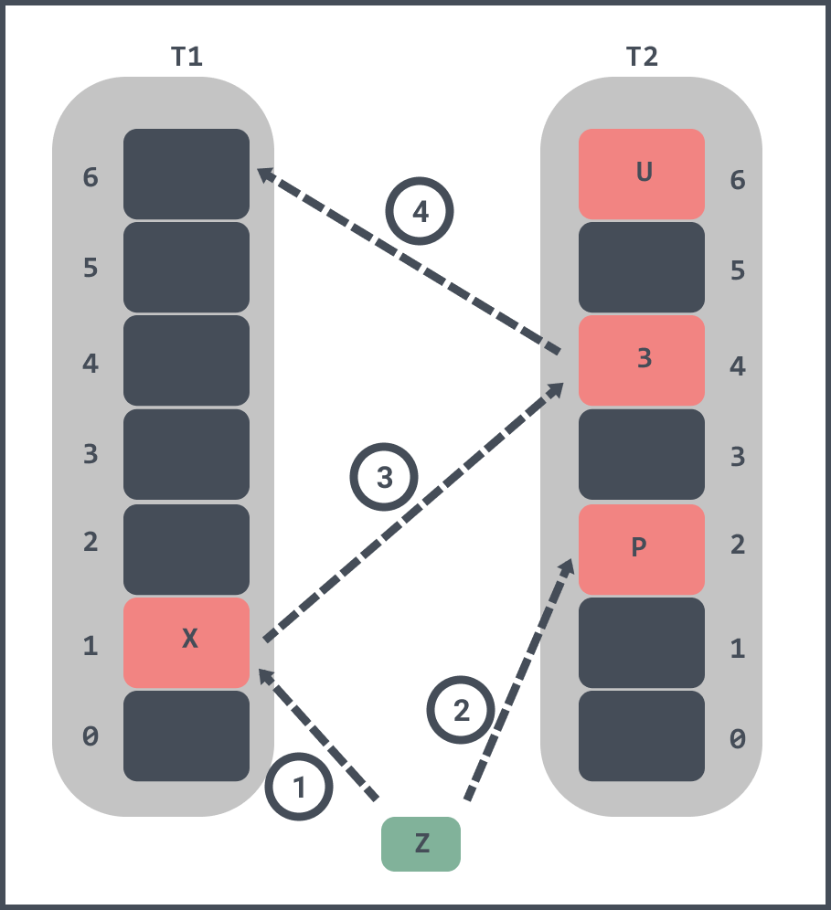
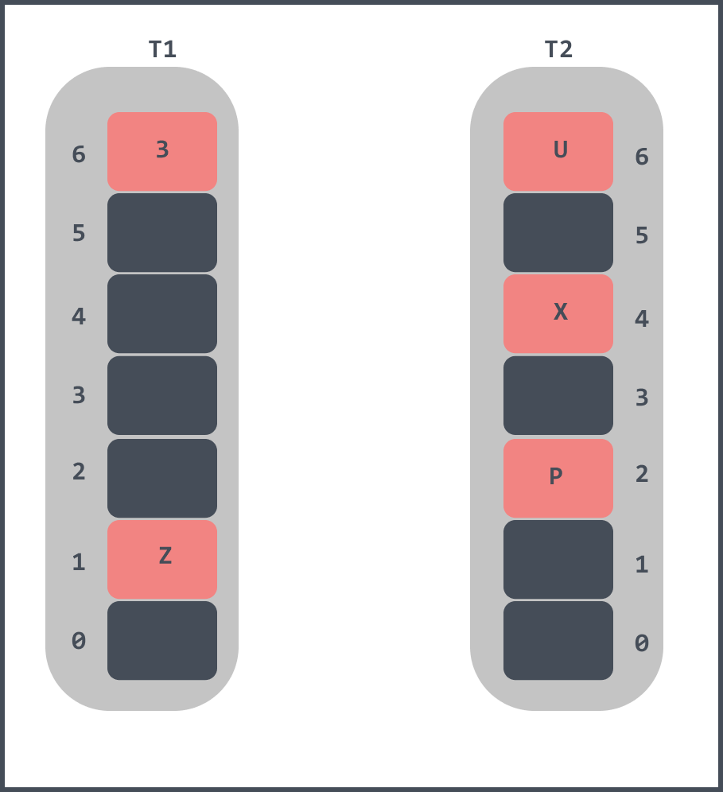
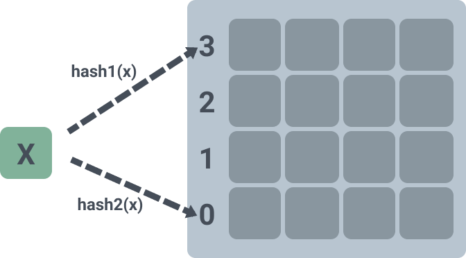
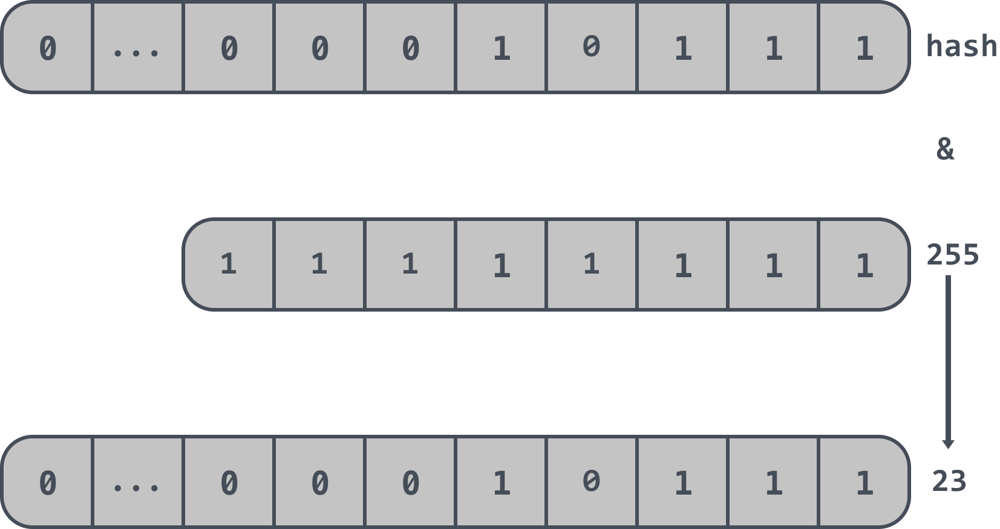
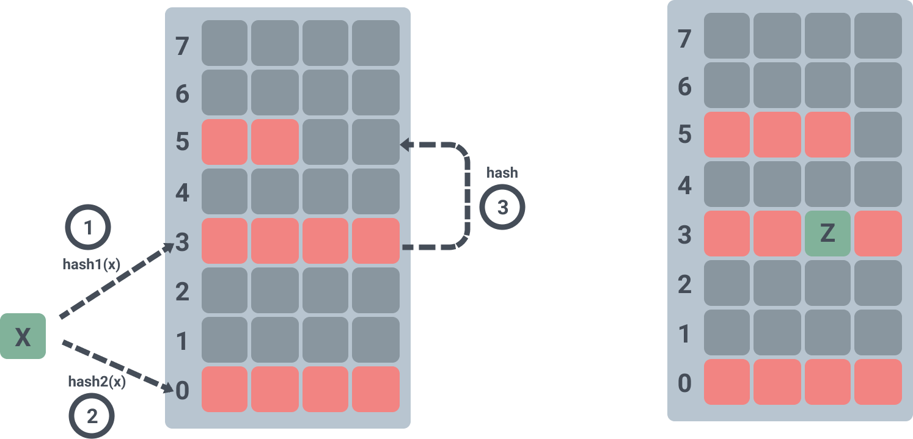
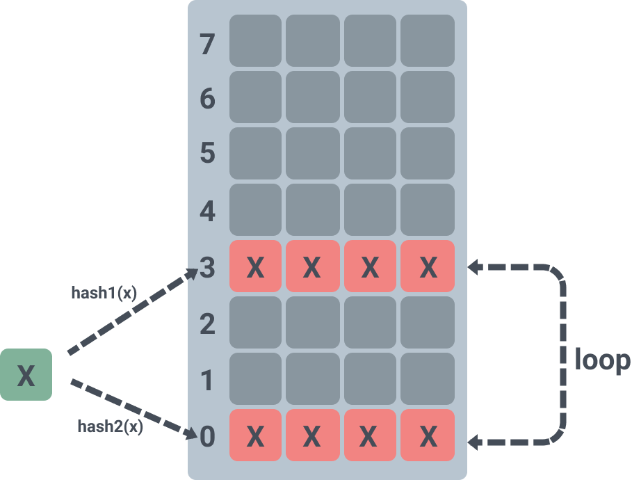

# Go语言实现布谷鸟过滤器

> 转载请声明出处哦~，本篇文章发布于luozhiyun的博客：https://www.luozhiyun.com

## 介绍

在我们工作中，如果遇到如网页 URL 去重、垃圾邮件识别、大集合中重复元素的判断一般想到的是将集合中所有元素保存起来，然后通过比较确定。如果通过性能最好的Hash表来进行判断，那么随着集合中元素的增加，我们需要的存储空间也会呈现线性增长，最终达到瓶颈。

所以很多时候会选择使用布隆过滤器来做这件事。布隆过滤器通过一个固定大小的二进制向量或者位图（bitmap），然后通过映射函数来将存储到 bitmap 中的键值进行映射大大减少了空间成本，布隆过滤器存储空间和插入/查询时间都是常数 O(K)。但是随着存入的元素数量增加，布隆过滤器误算率会随之增加，并且也不能删除元素。

想要体验布隆过滤器的插入步骤的可以看看这里：https://www.jasondavies.com/bloomfilter/

于是布谷鸟过滤器(Cuckoo filter)华丽降世了。在论文《Cuckoo Filter: Practically Better Than Bloom》中直接说到布隆过滤器的缺点：

> A limitation of standard Bloom filters is that one cannot remove existing items without rebuilding the entire filter.

论文中也提到了布谷鸟过滤器4大优点：

> 1. It supports adding and removing items dynamically; 
> 2. 2. It provides higher lookup performance than traditional Bloom filters, even when close to full (e.g., 95% space utilized);
> 3. It is easier to implement than alternatives such as the quotient filter; and
> 4. It uses less space than Bloom filters in many practical applications, if the target false positive rate  is less than 3%.

翻译如下：

1. 支持动态的新增和删除元素；
2. 提供了比传统布隆过滤器更高的查找性能，即使在接近满的情况下（比如空间利用率达到 95% 的时候）；
3. 更容易实现；
4. 如果要求错误率小于3%，那么在许多实际应用中，它比布隆过滤器占用的空间更小。

##  实现原理

### 简单工作原理

可以简单的把布谷鸟过滤器里面有两个 hash 表T1、T2，两个 hash 表对应两个 hash 函数H1、H2。

具体的插入步骤如下：

1. 当一个不存在的元素插入的时候，会先根据 H1 计算出其在 T1 表的位置，如果该位置为空则可以放进去。
2. 如果该位置不为空，则根据 H2 计算出其在 T2 表的位置，如果该位置为空则可以放进去。
3. 如果T1 表和 T2 表的位置元素都不为空，那么就随机的选择一个 hash 表将其元素踢出。
4. 被踢出的元素会循环的去找自己的另一个位置，如果被暂了也会随机选择一个将其踢出，被踢出的元素又会循环找位置；
5. 如果出现循环踢出导致放不进元素的情况，那么会设置一个阈值，超出了某个阈值，就认为这个 hash 表已经几乎满了，这时候就需要对它进行扩容，重新放置所有元素。

下面举一个例子来说明：



如果想要插入一个元素Z到过滤器里：

1. 首先会将Z进行 hash 计算，发现 T1 和 T2 对应的槽位1和槽位2都已经被占了；
2. 随机将 T1 中的槽位1中的元素 X 踢出，X 的 T2 对应的槽位4已经被元素 3 占了；
3. 将 T2 中的槽位4中的元素 3 踢出，元素 3 在 hash 计算之后发现 T1 的槽位6是空的，那么将元素3放入到 T1 的槽位6中。

当 Z 插入完毕之后如下：



### 布谷鸟过滤器

布谷鸟过滤器和上面的实现原理结构是差不多的，不同的是上面的数组结构会存储整个元素，而布谷鸟过滤器中只会存储元素的几个 bit ，称作指纹信息。这里是牺牲了数据的精确性换取了空间效率。

上面的实现方案中，hash 表中每个槽位只能存放一个元素，空间利用率只有50%，而在布谷鸟过滤器中每个槽位可以存放多个元素，从一维变成了二维。论文中表示：

> With k = 2 hash functions, the load factor α is 50% when the bucket size b = 1 (i.e., the hash table is directly mapped), but increases to 84%, 95% or 98% respectively using bucket size b = 2, 4 or 8.

也就是当有两个 hash 函数的时候，使用一维数组空间利用率只有50%，当每个槽位可以存放2，4，8个元素的时候，空间利用率就会飙升到 84%，95%，98%。

如下图，表示的是一个二维数组，每个槽位可以存放 4 个元素，和上面的实现有所不同的是，没有采用两个数组来存放，而是只用了一个：



说完了数据结构的改变，下面再说说位置计算的改变。

我们在上面简单实现的位置计算公式是这样做的：

```
p1 = hash1(x) % 数组长度
p2 = hash2(x) % 数组长度
```

而布谷鸟过滤器计算位置公式可以在论文中看到是这样：

> f = fingerprint(x);
>
> i1 = hash(x);
>
> i2 = i1 ⊕ hash( f);

我们可以看到在计算位置 i2 的时候是通过 i1 和元素 X 对应的指纹信息取异或计算出来。指纹信息在上面已经解释过了，是元素 X 的几个 bit ，牺牲了一定精度，但是换取了空间。

那么这里为什么需要用到异或呢？因为这样可以用到异或的自反性：`A ⊕ B ⊕ B = A`，这样就不需要知道当前的位置是 i1 还是 i2，只需要将当前的位置和 hash(f) 进行异或计算就可以得到另一个位置。

这里有个细节需要注意的是，计算 i2 的时候是需要先将元素 X 的 fingerprint 进行 hash ，然后才取异或，论文也说明了：

> If the alternate location were calculated by “i⊕fingerprint” without hashing the fingerprint, the items kicked out from nearby buckets would land close to each other in the table, if the size of the fingerprint is small compared to the table size.

如果直接进行异或处理，那么很可能 i1 和 i2 的位置相隔很近，尤其是在比较小的 hash 表中，这样无形之中增加了碰撞的概率。

除此之外还有一个约束条件是布谷鸟过滤器强制数组的长度必须是 2 的指数，所以在布谷鸟过滤器中不需要对数组的长度取模，取而代之的是取 hash 值的最后 n 位。

如一个布谷鸟过滤器中数组的长度2^8即256，那么取 hash 值的最后 n 位即：`hash & 255`这样就可以得到最终的位置信息。如下最后得到位置信息是 23 ：



## 代码实现

### 数据结构

```go
const bucketSize = 4
type fingerprint byte
// 二维数组，大小是4
type bucket [bucketSize]fingerprint

type Filter struct {
	// 一维数组
	buckets   []bucket
	// Filter 中已插入的元素
	count     uint
	// 数组buckets长度中对应二进制包含0的个数
	bucketPow uint
}
```

在这里我们假定一个指纹 fingerprint 占用的字节数是 1byte ，每个位置有 4 个座位。

### 初始化

```go
var (
	altHash = [256]uint{}
	masks   = [65]uint{}
)

func init() {
	for i := 0; i < 256; i++ {
        // 用于缓存 256 个fingerprint的hash信息
		altHash[i] = (uint(metro.Hash64([]byte{byte(i)}, 1337)))
	}
	for i := uint(0); i <= 64; i++ {
        // 取 hash 值的最后 n 位
		masks[i] = (1 << i) - 1
	}
}
```

这个 init 函数会缓存初始化两个全局变量 altHash 和 masks。因为 fingerprint 长度是 1byte ，所以在初始化 altHash 的时候使用一个 256 大小的数组取缓存对应的 hash 信息，避免每次都需要重新计算；masks 是用来取 hash 值的最后 n 位，稍后会用到。

我们会使用一个 NewFilter 函数，通过传入过滤器可容纳大小来获取过滤器 Filter：

```go
func NewFilter(capacity uint) *Filter {
    // 计算 buckets 数组大小
	capacity = getNextPow2(uint64(capacity)) / bucketSize
	if capacity == 0 {
		capacity = 1
	}
	buckets := make([]bucket, capacity)
	return &Filter{
		buckets:   buckets,
		count:     0,
        // 获取 buckets 数组大小的二进制中以 0 结尾的个数
		bucketPow: uint(bits.TrailingZeros(capacity)),
	}
}
```

NewFilter 函数会通过 getNextPow2 将 capacity 调整到 2 的指数倍，如果传入的 capacity 是 9 ，那么调用 getNextPow2 后会返回 16；然后计算好 buckets 数组长度，实例化 Filter 返回；bucketPow 返回的是二进制中以 0 结尾的个数，因为 capacity 是 2 的指数倍，所以 bucketPow 是 capacity 二进制的位数减 1。

### 插入元素

```go
func (cf *Filter) Insert(data []byte) bool {
	// 获取 data 的 fingerprint 以及 位置 i1
	i1, fp := getIndexAndFingerprint(data, cf.bucketPow)
	// 将 fingerprint 插入到 Filter 的 buckets 数组中
	if cf.insert(fp, i1) {
		return true
	}
	// 获取位置 i2
	i2 := getAltIndex(fp, i1, cf.bucketPow)
	// 将 fingerprint 插入到 Filter 的 buckets 数组中
	if cf.insert(fp, i2) {
		return true
	}
	// 插入失败，那么进行循环插入踢出元素
	return cf.reinsert(fp, randi(i1, i2))
}

func (cf *Filter) insert(fp fingerprint, i uint) bool {
    // 获取 buckets 中的槽位进行插入
	if cf.buckets[i].insert(fp) {
        // Filter 中元素个数+1
		cf.count++
		return true
	}
	return false
}

func (b *bucket) insert(fp fingerprint) bool {
    // 遍历槽位的 4 个元素，如果为空则插入
	for i, tfp := range b {
		if tfp == nullFp {
			b[i] = fp
			return true
		}
	}
	return false
}
```

1. getIndexAndFingerprint 函数会获取 data 的指纹 fingerprint，以及位置 i1；

2. 然后调用 insert 插入到 Filter 的 buckets 数组中，如果 buckets 数组中对应的槽位 i1 的 4 个元素已经满了，那么尝试获取位置 i2 ，并将元素尝试插入到 buckets 数组中对应的槽位 i2 中；
3. 对应的槽位 i2 也满了，那么 调用 reinsert 方法随机获取槽位 i1、i2 中的某个位置进行抢占，然后将老元素踢出并循环重复插入。

下面看看 getIndexAndFingerprint 是如何获取 fingerprint 以及槽位 i1：

```go
func getIndexAndFingerprint(data []byte, bucketPow uint) (uint, fingerprint) {
    // 将 data 进行hash
	hash := metro.Hash64(data, 1337)
    // 取 hash 的指纹信息
	fp := getFingerprint(hash)
	// 取 hash 高32位，对 hash 的高32位进行取与获取槽位 i1
	i1 := uint(hash>>32) & masks[bucketPow]
	return i1, fingerprint(fp)
}
// 取 hash 的指纹信息
func getFingerprint(hash uint64) byte {
	fp := byte(hash%255 + 1)
	return fp
}
```

getIndexAndFingerprint 中对 data 进行 hash 完后会对其结果取模获取指纹信息，然后再取 hash 值的高 32 位进行取与，获取槽位 i1。masks 在初始化的时候已经看过了，`masks[bucketPow]` 获取的二进制结果全是 1 ，用来取 hash 的低位的值。

假如初始化传入的 capacity 是1024，那么计算到 bucketPow 是 8，对应取到 `masks[8] = (1 << 8) - 1` 结果是 255 ，二进制是`1111，1111`，和 hash 的高 32 取与 得到最后 buckets 中的槽位 i1 ：


```go
func getAltIndex(fp fingerprint, i uint, bucketPow uint) uint {
	mask := masks[bucketPow]
	hash := altHash[fp] & mask
	return i ^ hash
}
```

 getAltIndex 中获取槽位是通过使用 altHash 来获取指纹信息的 hash 值，然后取异或后返回槽位值。需要注意的是，这里由于异或的特性，所以传入的不管是槽位 i1，还是槽位 i2 都可以返回对应的另一个槽位。

下面看看循环踢出插入 reinsert：

```go
const maxCuckooCount = 500

func (cf *Filter) reinsert(fp fingerprint, i uint) bool {
    // 默认循环 500 次
	for k := 0; k < maxCuckooCount; k++ {
        // 随机从槽位中选取一个元素
		j := rand.Intn(bucketSize)
		oldfp := fp
        // 获取槽位中的值 
		fp = cf.buckets[i][j]
        // 将当前循环的值插入
		cf.buckets[i][j] = oldfp

		// 获取另一个槽位
		i = getAltIndex(fp, i, cf.bucketPow)
		if cf.insert(fp, i) {
			return true
		}
	}
	return false
}
```

这里会最大循环 500 次获取槽位信息。因为每个槽位最多可以存放 4 个元素，所以使用 rand 随机从 4 个位置中取一个元素踢出，然后将当次循环的元素插入，再获取被踢出元素的另一个槽位信息，再调用 insert 进行插入。



上图展示了元素 X 在插入到 hash 表的时候，hash 两次发现对应的槽位 0 和 3 都已经满了，那么随机抢占了槽位 3 其中一个元素，被抢占的元素重新 hash 之后插入到槽位 5 的第三个位置上。

### 查询数据

查询数据的时候，就是看看对应的位置上有没有对应的指纹信息：

```go
func (cf *Filter) Lookup(data []byte) bool {
    // 获取槽位 i1 以及指纹信息
	i1, fp := getIndexAndFingerprint(data, cf.bucketPow)
    // 遍历槽位中 4 个位置，查看有没有相同元素
	if cf.buckets[i1].getFingerprintIndex(fp) > -1 {
		return true
	}
    // 获取另一个槽位 i2
	i2 := getAltIndex(fp, i1, cf.bucketPow)
    // 遍历槽位 i2 中 4 个位置，查看有没有相同元素
	return cf.buckets[i2].getFingerprintIndex(fp) > -1
}

func (b *bucket) getFingerprintIndex(fp fingerprint) int {
	for i, tfp := range b {
		if tfp == fp {
			return i
		}
	}
	return -1
}
```

### 删除数据

删除数据的时候，也只是抹掉该槽位上的指纹信息：

```go
func (cf *Filter) Delete(data []byte) bool {
    // 获取槽位 i1 以及指纹信息
	i1, fp := getIndexAndFingerprint(data, cf.bucketPow)
    // 尝试删除指纹信息
	if cf.delete(fp, i1) {
		return true
	}
    // 获取槽位 i2
	i2 := getAltIndex(fp, i1, cf.bucketPow)
    // 尝试删除指纹信息
	return cf.delete(fp, i2)
}

func (cf *Filter) delete(fp fingerprint, i uint) bool {
    // 遍历槽位 4个元素，尝试删除指纹信息
	if cf.buckets[i].delete(fp) {
		if cf.count > 0 {
			cf.count--
		}
		return true
	}
	return false
}

func (b *bucket) delete(fp fingerprint) bool {
	for i, tfp := range b {
        // 指纹信息相同，将此槽位置空
		if tfp == fp {
			b[i] = nullFp
			return true
		}
	}
	return false
}
```

### 缺点

实现完布谷鸟过滤器后，我们不妨想一下，如果布谷鸟过滤器对同一个元素进行多次连续的插入会怎样？

那么这个元素会霸占两个槽位上的所有位置，最后在插入第 9 个相同元素的时候，会一直循环挤兑，直到最大循环次数，然后返回一个 false：



如果插入之前做一次检查能不能解决问题呢？这样确实不会出现循环挤兑的情况，但是会出现一定概率的误判情况。

由上面的实现我们可以知道，在每个位置里设置的指纹信息是 1byte，256 种可能，如果两个元素的 hash 位置相同，指纹相同，那么这个插入检查会认为它们是相等的导致认为元素已存在。

事实上，我们可以通过调整指纹信息的保存量来降低误判情况，如在上面的实现中，指纹信息是 1byte 保存8位信息误判概率是0.03，当指纹信息增加到 2bytes 保存16位信息误判概率会降低至 0.0001。

## Reference

Cuckoo Filter: Practically Better Than Bloom https://www.cs.cmu.edu/~dga/papers/cuckoo-conext2014.pdf

Cuckoo Hashing Visualization http://www.lkozma.net/cuckoo_hashing_visualization/

Cuckoo Filter https://github.com/seiflotfy/cuckoofilter

