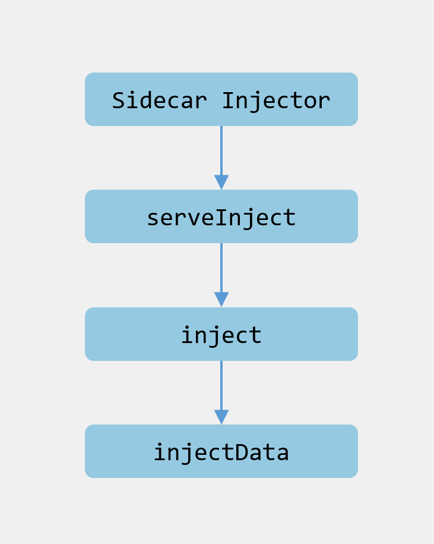

# 1.深入Istio源码：Sidecar注入实现原理


> 转载请声明出处哦~，本篇文章发布于luozhiyun的博客：https://www.luozhiyun.com
>
> 本文使用的Istio源码是 release 1.5。
>

这篇文章打算讲一下sidecar，我在刚学习Istio的时候会有一些疑惑，sidecar是如何做到无感知的注入的，很多学习资料都没有详细去讲这部分的内容，下面打算解析一下。

## Sidecar 介绍

在Sidecar部署方式中会为每个应用的容器部署一个伴生容器。对于Istio，Sidecar接管进出应用程序容器的所有网络流量。

使用 Sidecar 模式部署服务网格时，无需在节点上运行代理，但是集群中将运行多个相同的 Sidecar 副本。在 Kubernetes 的 Pod 中，在原有的应用容器旁边运行一个 Sidecar 容器，可以理解为两个容器共享存储、网络等资源，可以广义的将这个注入了 Sidecar 容器的 Pod 理解为一台主机，两个容器共享主机资源。

### Sidecar 注入过程

注入 Sidecar的时候会在生成pod的时候附加上两个容器：istio-init、istio-proxy。istio-init这个容器从名字上看也可以知道它属于k8s中的Init Containers，主要用于设置iptables规则，让出入流量都转由 Sidecar 进行处理。istio-proxy是基于Envoy实现的一个网络代理容器，是真正的Sidecar，应用的流量会被重定向进入或流出Sidecar。

我们在使用Sidecar自动注入的时候只需要给对应的应用部署的命名空间打个istio-injection=enabled标签，这个命名空间中新建的任何 Pod 都会被 Istio 注入 Sidecar。

应用部署后我们可以通过kubectl describe查看pod内的容器：

```shell
 [root@localhost ~]# kubectl describe pod details-v1-6c9f8bcbcb-shltm
 
 Name:         details-v1-6c9f8bcbcb-shltm
Namespace:    default
...
Labels:       app=details
              pod-template-hash=6c9f8bcbcb
              security.istio.io/tlsMode=istio
              service.istio.io/canonical-name=details
              service.istio.io/canonical-revision=v1
              version=v1
Annotations:  sidecar.istio.io/status:
                {"version":"3bc68d1f27d8b6b9bf1cb3e9904f5d5f8c2ecab1c93d933fbb3d0db76fae2633","initContainers":["istio-init"],"containers":["istio-proxy"]...
Status:       Running
IP:           172.20.0.14
IPs:
  IP:           172.20.0.14
Controlled By:  ReplicaSet/details-v1-6c9f8bcbcb
Init Containers:
  istio-init:
    Container ID:  docker://6d14ccc83bd119236bf8fda13f6799609c87891be9b2c5af7cbf7d8c913ce17e
    Image:         docker.io/istio/proxyv2:1.5.10
    Image ID:      docker-pullable://istio/proxyv2@sha256:abbe8ad6d50474814f1aa9316dafc2401fbba89175638446f01afc36b5a37919
    ...
    Ready:          True
    Restart Count:  0
    ...
Containers:
  details:
    Container ID:   docker://ed216429216ea1b8a1ba20960590edb7322557467c38cceff3c3e847bcff0a14
    Image:          docker.io/istio/examples-bookinfo-details-v1:1.15.1
    Image ID:       docker-pullable://istio/examples-bookinfo-details-v1@sha256:344b1c18703ab1e51aa6d698f459c95ea734f8317d779189f4638de7a00e61ae
    ...
  istio-proxy:
    Container ID:  docker://a3862cc8f53198c8f86a911089e73e00f4cc4aa02eea05aaeb0bd267a8e98482
    Image:         docker.io/istio/proxyv2:1.5.10
    Image ID:      docker-pullable://istio/proxyv2@sha256:abbe8ad6d50474814f1aa9316dafc2401fbba89175638446f01afc36b5a37919
    ...
    Ready:          True
```

details-v1-6c9f8bcbcb-shltm这个应用是我们在上篇文章中创建的一个details服务，里面有istio-init、istio-proxy、details这三个container。

## Sidecar 注入原理

Sidecar 注入主要是依托k8s的准入控制器Admission Controller来实现的。

准入控制器会拦截 Kubernetes API Server 收到的请求，拦截发生在认证和鉴权完成之后，对象进行持久化之前。可以定义两种类型的 Admission webhook：Validating 和 Mutating。Validating 类型的 Webhook 可以根据自定义的准入策略决定是否拒绝请求；Mutating 类型的 Webhook 可以根据自定义配置来对请求进行编辑。

我们可以看看配置详情：

```shell
[root@localhost ~]# kubectl get mutatingwebhookconfiguration istio-sidecar-injector -o yaml

apiVersion: admissionregistration.k8s.io/v1
kind: MutatingWebhookConfiguration
metadata:
  annotations:
    ...
  creationTimestamp: "2020-10-18T08:22:01Z"
  generation: 2
  labels:
    app: sidecar-injector
    operator.istio.io/component: Pilot
    operator.istio.io/managed: Reconcile
    operator.istio.io/version: 1.5.10
    release: istio
  ... 
webhooks:
- admissionReviewVersions:
  - v1beta1
  clientConfig:
    caBundle: ...
    service:
      name: istiod
      namespace: istio-system
      path: /inject
      port: 443
  failurePolicy: Fail
  matchPolicy: Exact
  name: sidecar-injector.istio.io
  namespaceSelector:
    matchLabels:
      istio-injection: enabled
  rules:
  - apiGroups:
    - ""
    apiVersions:
    - v1
    operations:
    - CREATE
    resources:
    - pods
    scope: '*'
  ...
```

这里有一个namespaceSelector，match的标签是istio-injection: enabled的命名空间，请求规则rules是CREATE，表示匹配所有pod的创建请求。当apiserver收到一个符合规则的请求时，apiserver会给 Webhook 服务发送一个准入审核的请求，在上面的配置中webhook指定的是一个叫istiod的service。

```shell
[root@localhost ~]# kubectl get svc --namespace=istio-system | grep istiod
istiod                      ClusterIP      10.68.222.38    <none>        15012/TCP,443/TCP
                                                  32h
```


通常Sidecar注入由以下步骤完成：

1. 解析Webhook REST请求，将AdmissionReview原始数据反序列化；
2. 解析pod，将AdmissionReview中的AdmissionRequest反序列化；
3. 利用Pod及网格配置渲染Sidecar配置模板；
4. 利用Pod及渲染后的模板创建Json Patch；
5. 构造AdmissionResponse；
6. 构造AdmissionReview，将其发给apiserver；

源码流程差不多是这个样子：



下面我们来看看源码。

源码位置：pkg/kube/inject/webhook.go

```go
func NewWebhook(p WebhookParameters) (*Webhook, error) {
    wh := &Webhook{
        ...
    }
	...
	if p.Mux != nil {
		p.Mux.HandleFunc("/inject", wh.serveInject)
		mux = p.Mux
	} else {
		wh.server = &http.Server{
			Addr: fmt.Sprintf(":%v", p.Port), 
			TLSConfig: &tls.Config{GetCertificate: wh.getCert},
		}
		mux = http.NewServeMux()
		mux.HandleFunc("/inject", wh.serveInject)
		wh.server.Handler = mux
	}
	...
}
```

在初始化Webhook实例的时候会注册/inject对应的处理器，也就是当apiserver回调/inject请求的时候会调用到serveInject方法中。

然后我们进入到serveInject方法中：

文件位置：pkg/kube/inject/webhook.go

```go
func (wh *Webhook) serveInject(w http.ResponseWriter, r *http.Request) {
	totalInjections.Increment()
	var body []byte
	if r.Body != nil {
		//读取请求体
		if data, err := ioutil.ReadAll(r.Body); err == nil {
			body = data
		}
	}
	... 
	var reviewResponse *v1beta1.AdmissionResponse
	ar := v1beta1.AdmissionReview{}
	//解码请求体
	if _, _, err := deserializer.Decode(body, nil, &ar); err != nil {
		handleError(fmt.Sprintf("Could not decode body: %v", err))
		reviewResponse = toAdmissionResponse(err)
	} else {
		//解码成功调用inject方法，并传入AdmissionReview
		reviewResponse = wh.inject(&ar)
	}
	//构建AdmissionReview作为参数返回给调用方
	response := v1beta1.AdmissionReview{}
	if reviewResponse != nil {
		response.Response = reviewResponse
		if ar.Request != nil {
			response.Response.UID = ar.Request.UID
		}
	}

	resp, err := json.Marshal(response)
	if err != nil {
		log.Errorf("Could not encode response: %v", err)
		http.Error(w, fmt.Sprintf("could not encode response: %v", err), http.StatusInternalServerError)
	}
	if _, err := w.Write(resp); err != nil {
		log.Errorf("Could not write response: %v", err)
		http.Error(w, fmt.Sprintf("could not write response: %v", err), http.StatusInternalServerError)
	}
}
```

这个方法很简单，主要就是读取请求体并解码，然后调用inject方法，构建AdmissionReview作为参数返回给调用方。

主要逻辑从这里可以看出都在inject方法里面，下面看看这个方法：

```go
func (wh *Webhook) inject(ar *v1beta1.AdmissionReview) *v1beta1.AdmissionResponse {
	req := ar.Request
	var pod corev1.Pod
	//json反序列化请求数据
	if err := json.Unmarshal(req.Object.Raw, &pod); err != nil {
		handleError(fmt.Sprintf("Could not unmarshal raw object: %v %s", err,
			string(req.Object.Raw)))
		return toAdmissionResponse(err)
	}

	...
	//封装模板数据
	spec, iStatus, err := InjectionData(wh.Config.Template, wh.valuesConfig, wh.sidecarTemplateVersion, typeMetadata, deployMeta, &pod.Spec, &pod.ObjectMeta, wh.meshConfig.DefaultConfig, wh.meshConfig) // nolint: lll
	if err != nil {
		handleError(fmt.Sprintf("Injection data: err=%v spec=%v\n", err, iStatus))
		return toAdmissionResponse(err)
	} 
	...
	//将需要注入的有istio-init/istio-proxy container封装成patch操作
	//具体可以看这里:https://kubernetes.io/zh/docs/reference/access-authn-authz/extensible-admission-controllers/#response
	patchBytes, err := createPatch(&pod, injectionStatus(&pod), annotations, spec, deployMeta.Name)
	if err != nil {
		handleError(fmt.Sprintf("AdmissionResponse: err=%v spec=%v\n", err, spec))
		return toAdmissionResponse(err)
	}

	log.Debugf("AdmissionResponse: patch=%v\n", string(patchBytes))
	//将需要patch的配置封装成AdmissionResponse返回
	reviewResponse := v1beta1.AdmissionResponse{
		Allowed: true,
		Patch:   patchBytes,
		PatchType: func() *v1beta1.PatchType {
			pt := v1beta1.PatchTypeJSONPatch
			return &pt
		}(),
	}
	totalSuccessfulInjections.Increment()
	return &reviewResponse
}
```

inject方法逻辑主要分为以下几个步骤：

1. json反序列化请求数据到pod中；
2. 调用InjectionData根据模板封装数据，主要是构造istio-init、istio-proxy等容器配置；
3. 调用createPatch方法将模板数据转化成json形式，到时候在创建容器的时候会patch到创建容器的配置中，具体可以看这里：https://kubernetes.io/zh/docs/reference/access-authn-authz/extensible-admission-controllers/#response
4. 最后将数据封装成AdmissionResponse返回；

## 总结

本篇文章重点讲解Sidecar容器注入实现原理，通过使用k8s的准入控制器来做到在每个新建的pod里面都无感知的创建sidecar做流量托管。

## Reference

https://github.com/istio/istio.io/blob/release-1.1/content/blog/2019/data-plane-setup/index.md

https://kubernetes.io/docs/reference/access-authn-authz/extensible-admission-controllers/

https://kubernetes.io/docs/reference/access-authn-authz/admission-controllers/  

https://jimmysong.io/blog/envoy-sidecar-injection-in-istio-service-mesh-deep-dive/