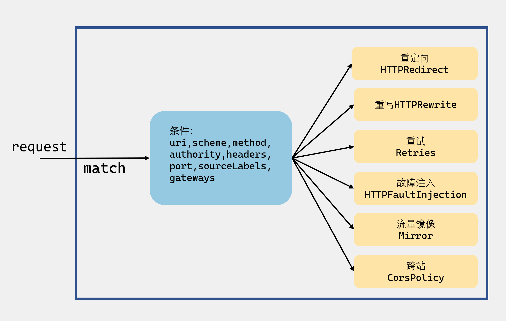

# 2.深入Istio：VirtualService虚拟服务路由


## 概述

我在[从一个例子入手Istio](https://www.luozhiyun.com/archives/393)这篇文章中讲述了一个Bookinfo 示例，在这个示例中通过部署bookinfo-gateway.yaml来实现让应用程序可以从外部访问 k8s 集群中的Bookinfo 应用。

我们先来看看bookinfo-gateway.yaml里面做了什么：

```sh
$ cat samples/bookinfo/networking/bookinfo-gateway.yaml

apiVersion: networking.istio.io/v1alpha3
kind: Gateway
metadata:
  name: bookinfo-gateway
spec:
  selector:
    istio: ingressgateway # use istio default controller
  servers:
  - port:
      number: 80
      name: http
      protocol: HTTP
    hosts:
    - "*"
---
apiVersion: networking.istio.io/v1alpha3
kind: VirtualService
metadata:
  name: bookinfo
spec:
  hosts:
  - "*"
  gateways:
  - bookinfo-gateway
  http:
  - match:
    - uri:
        exact: /productpage
    - uri:
        prefix: /static
    - uri:
        exact: /login
    - uri:
        exact: /logout
    - uri:
        prefix: /api/v1/products
    route:
    - destination:
        host: productpage
        port:
          number: 9080
```

这里面定义了一个VirtualService和一个Gateway。在上面的VirtualService 中定义了对特定目标服务的一组流量规则。从上面的字段名也可以很清楚的看到，VirtualService匹配了哪些url，以及对应的目的地destination的host与port是什么。

VirtualService主要的功能就是将满足条件的流量都转发到对应的服务后端，这个服务后端可以是一个服务，也可以是在DestinationRule中定义的服务子集。

## 设计

### VirtualService的定义

下面我们看看VirtualService的定义：

```go
type VirtualService struct { 
	Hosts []string `protobuf:"bytes,1,rep,name=hosts,proto3" json:"hosts,omitempty"` 
	Gateways []string `protobuf:"bytes,2,rep,name=gateways,proto3" json:"gateways,omitempty"` 
	Http []*HTTPRoute `protobuf:"bytes,3,rep,name=http,proto3" json:"http,omitempty"` 
	Tls []*TLSRoute `protobuf:"bytes,5,rep,name=tls,proto3" json:"tls,omitempty"` 
	Tcp []*TCPRoute `protobuf:"bytes,4,rep,name=tcp,proto3" json:"tcp,omitempty"` 
	ExportTo             []string `protobuf:"bytes,6,rep,name=export_to,json=exportTo,proto3" json:"export_to,omitempty"` 
}
```

透过上面的定义，我们可以很清楚的看到VirtualService的路由规则是通过Hosts、Gateways、HTTPRoute、TLSRoute、TCPRoute来设置的。

* Hosts：表示流量发送的目标，用于匹配访问地址，可以是一个DNS名称或IP地址。DNS名称可以使用通配符前缀，也可以只使用短域名或全限定域名FQDN。
*  Gateways：表示应用这些流量规则的Gateways。VirtualService描述的规则可以作用到网格里的Sidecar和入口处的Gateway，表示将路由规则应用于网格内的访问还是网格外经过Gateway的访问。
* Http：是一个HTTPRoute类似的路由集合，用于处理HTTP的流量。
* Tls：是TLSRoute类型的路由集合，用于处理非终结的TLS和HTTPS的流量。
* Tcp：是一个TCPRoute类型的路由集合，用于处理TCP的流量，应用于所有其他非HTTP和TLS端口的流量。
* ExportTo：用于控制跨命名空间的可见性，可以用来控制在一个命名空间下定义的VirtualService是否可以被其他命名空间下的Sidecar和Gateway使用。

### HTTPRoute规则

下面来专门看看HTTPRoute，Http是当前最通用的协议，也是Istio上支持最完整的一种协议。

下面看看HTTPRoute的定义：

```go
type HTTPRoute struct { 
	Name string `protobuf:"bytes,17,opt,name=name,proto3" json:"name,omitempty"` 
	Match []*HTTPMatchRequest `protobuf:"bytes,1,rep,name=match,proto3" json:"match,omitempty"` 
	Route []*HTTPRouteDestination `protobuf:"bytes,2,rep,name=route,proto3" json:"route,omitempty"`
	Redirect *HTTPRedirect `protobuf:"bytes,3,opt,name=redirect,proto3" json:"redirect,omitempty"`  
	Rewrite *HTTPRewrite `protobuf:"bytes,4,opt,name=rewrite,proto3" json:"rewrite,omitempty"` 
	Timeout *types.Duration `protobuf:"bytes,6,opt,name=timeout,proto3" json:"timeout,omitempty"` 
	Retries *HTTPRetry `protobuf:"bytes,7,opt,name=retries,proto3" json:"retries,omitempty"` 
	Fault *HTTPFaultInjection `protobuf:"bytes,8,opt,name=fault,proto3" json:"fault,omitempty"` 
	Mirror *Destination `protobuf:"bytes,9,opt,name=mirror,proto3" json:"mirror,omitempty"`  
	CorsPolicy *CorsPolicy `protobuf:"bytes,10,opt,name=cors_policy,json=corsPolicy,proto3" json:"cors_policy,omitempty"` 
	Headers              *Headers `protobuf:"bytes,16,opt,name=headers,proto3" json:"headers,omitempty"` 
}
```

单单只看这个结构体的定义就大概可以知道，HTTPRoute可以实现：重定向（HTTPRedirect）、重写（HTTPRewrite）、重试（Retries）、故障注入（HTTPFaultInjection）、流量镜像（Mirror）、跨站（CorsPolicy）等功能。



#### HTTPMatchRequest


virtualService

文件位置：galley/pkg/config/processor/transforms/ingress/virtualService.go


## Reference

https://istio.io/latest/docs/reference/config/networking/virtual-service/

https://www.servicemesher.com/istio-handbook/practice/traffic-control.html

https://istio.io/latest/zh/docs/ops/diagnostic-tools/proxy-cmd/

https://istio.io/v1.5/docs/ops/diagnostic-tools/proxy-cmd/