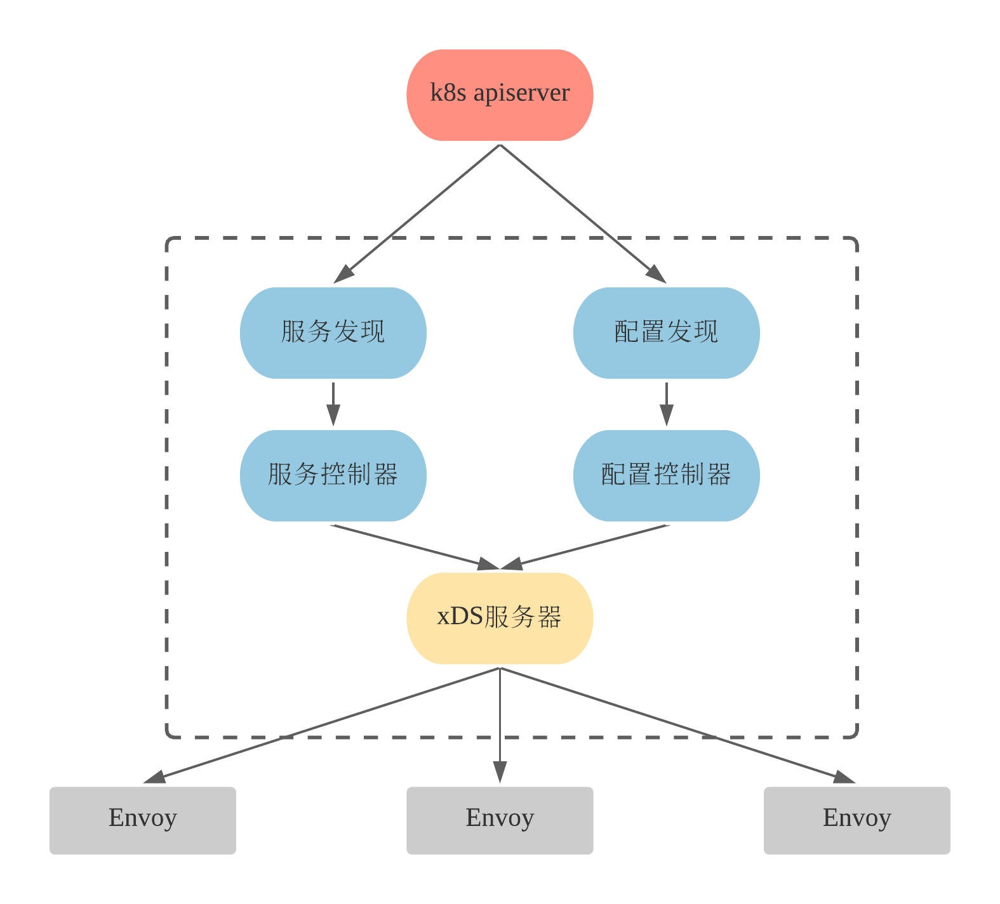
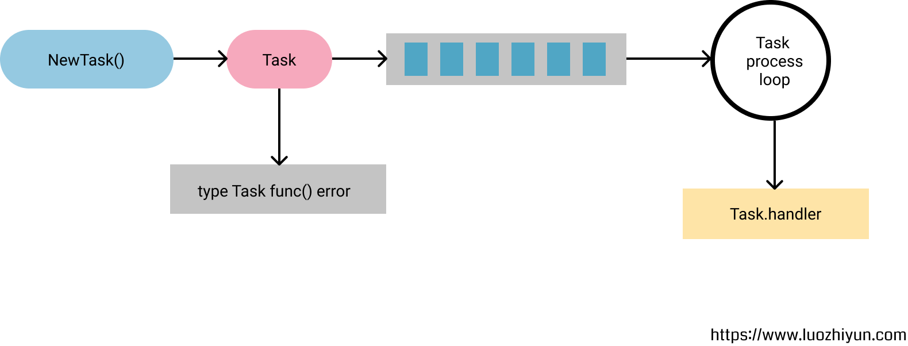
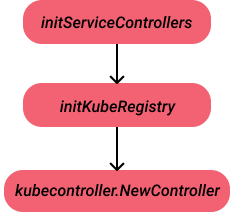
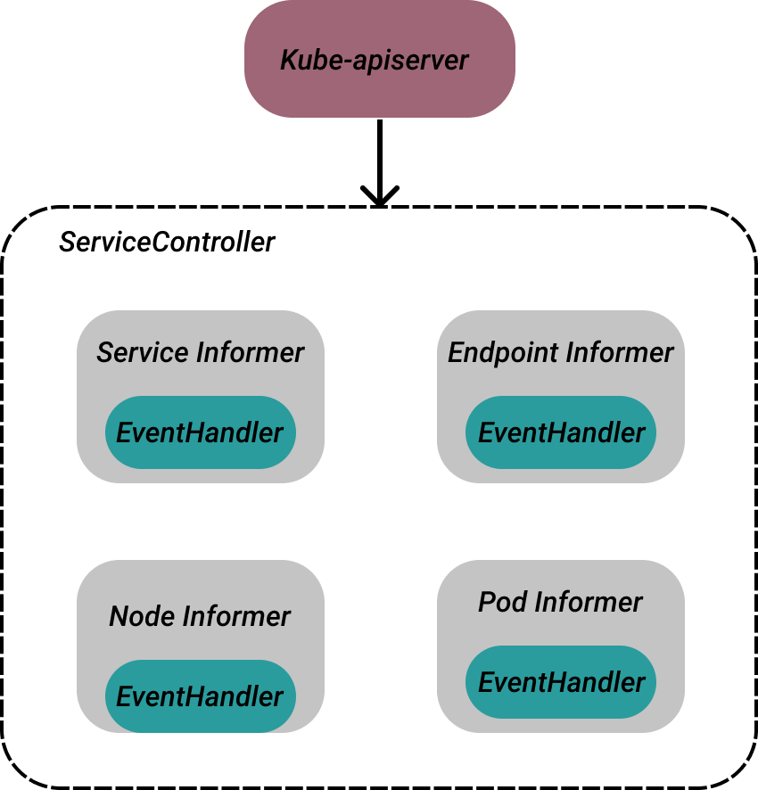

# 2.深入Istio源码：Pilot服务发现

>  转载请声明出处哦~，本篇文章发布于luozhiyun的博客：https://www.luozhiyun.com
>
> 本文使用的Istio源码是 release 1.5。

## 介绍

pilot-discovery是在Pilot中的核心服务，在Pilot中名为pilot-discovery，主要功能是从注册中心（如 kubernetes 或者 consul）获取信息并汇集，从 Kubernetes API Server 中获取流量规则，并将服务信息和流量规则转化为数据面可以理解的格式，通过标准的数据面 API 下发到网格中的各个SideCar中。

pilot-discovery包含了服务发现、配置规则发现、xDS配置下发。总体上打算分三篇来进行讲解，这一篇主要看看服务发现部分的实现。文章中有涉及xDS协议的一些东西，大家可以看看这篇文章：[深入解读Service Mesh背后的技术细节](https://www.cnblogs.com/163yun/p/8962278.html)。



Pilot服务发现指通过监听底层平台的服务注册中心来缓存Istio服务模型，并且监视服务模型的变化，再服务模型更新时触发相关事件回调处理函数的执行。

## 服务发现工作机制

### Pilot初始化

```go
	discoveryCmd = &cobra.Command{
		Use:   "discovery",
		Short: "Start Istio proxy discovery service.",
		Args:  cobra.ExactArgs(0),
		RunE: func(c *cobra.Command, args []string) error {
			...
			//日志配置
			if err := log.Configure(loggingOptions); err != nil {
				return err
			} 
			... 
			stop := make(chan struct{})
 
			// 创建xDs服务器
			discoveryServer, err := bootstrap.NewServer(&serverArgs)
			if err != nil {
				return fmt.Errorf("failed to create discovery service: %v", err)
			} 
			// 启动服务器
			if err := discoveryServer.Start(stop); err != nil {
				return fmt.Errorf("failed to start discovery service: %v", err)
			}
			//等待进程推出
			cmd.WaitSignal(stop) 
			discoveryServer.WaitUntilCompletion()
			return nil
		},
	}
```

Pilot服务在初始化的时候首先会初始化日志配置，然后创建xDs服务器，这里的xDs指的是x Discovery Service的意思，x代表了一系列的组件如：Cluster、Endpoint、Listener、Route 等。

```go
func NewServer(args *PilotArgs) (*Server, error) {
	 
	args.Default()
	e := &model.Environment{
		ServiceDiscovery: aggregate.NewController(),
		PushContext:      model.NewPushContext(),
	}

	s := &Server{
		basePort:       args.BasePort,
		clusterID:      getClusterID(args),
		environment:    e,
		EnvoyXdsServer: envoyv2.NewDiscoveryServer(e, args.Plugins),
		forceStop:      args.ForceStop,
		mux:            http.NewServeMux(),
	}
 
	// 初始化处理Istio Config的控制器
	if err := s.initConfigController(args); err != nil {
		return nil, fmt.Errorf("config controller: %v", err)
	}
	// 初始化处理Service Discovery的控制器
	if err := s.initServiceControllers(args); err != nil {
		return nil, fmt.Errorf("service controllers: %v", err)
	} 
	... 
	//初始化xDS服务端
	if err := s.initDiscoveryService(args); err != nil {
		return nil, fmt.Errorf("discovery service: %v", err)
	}
	... 
	// Webhook 回调服务
	if err := s.initHTTPSWebhookServer(args); err != nil {
		return nil, fmt.Errorf("injectionWebhook server: %v", err)
	}
    //sidecar注入相关
	if err := s.initSidecarInjector(args); err != nil {
		return nil, fmt.Errorf("sidecar injector: %v", err)
	}

	... 
	return s, nil
}
```

NewServer方法里面初始化了很多模块，这里挑相关的看看initConfigController是和配置服务相关的，我们之后再看，这里我们主要看initServiceControllers。

### ServiceControllers

服务发现的主要逻辑在Pilot中由ServiceController（服务控制器）实现，通过监听底层平台的服务注册中心来缓存Istio服务模型，并监视服务模型的变化，在服务模型更新时触发相关事件回调处理函数的执行。



#### 初始化

Controller的初始化执行流程很简单，这里用一张图来描述，initServiceControllers方法最后会调用到NewController方法来进行初始化。



```go
func NewController(client kubernetes.Interface, options Options) *Controller {
	log.Infof("Service controller watching namespace %q for services, endpoints, nodes and pods, refresh %s",
		options.WatchedNamespace, options.ResyncPeriod)

	// The queue requires a time duration for a retry delay after a handler error
	// 初始化Controller
	c := &Controller{
		domainSuffix:               options.DomainSuffix,
		client:                     client,
		//控制器任务队列
		queue:                      queue.NewQueue(1 * time.Second),
		clusterID:                  options.ClusterID,
		xdsUpdater:                 options.XDSUpdater,
		servicesMap:                make(map[host.Name]*model.Service),
		externalNameSvcInstanceMap: make(map[host.Name][]*model.ServiceInstance),
		networksWatcher:            options.NetworksWatcher,
		metrics:                    options.Metrics,
	}
	//获取informer
	sharedInformers := informers.NewSharedInformerFactoryWithOptions(client, options.ResyncPeriod, informers.WithNamespace(options.WatchedNamespace))
	//注册 informer处理器
	c.services = sharedInformers.Core().V1().Services().Informer()
	//Services Handler
	registerHandlers(c.services, c.queue, "Services", c.onServiceEvent)
	//endpoints Handler
	switch options.EndpointMode {
	case EndpointsOnly:
		c.endpoints = newEndpointsController(c, sharedInformers)
	case EndpointSliceOnly:
		c.endpoints = newEndpointSliceController(c, sharedInformers)
	}
	//Nodes Handler
	c.nodes = sharedInformers.Core().V1().Nodes().Informer()
	registerHandlers(c.nodes, c.queue, "Nodes", c.onNodeEvent)

	podInformer := sharedInformers.Core().V1().Pods().Informer()
	c.pods = newPodCache(podInformer, c)
	//Pods Handler
	registerHandlers(podInformer, c.queue, "Pods", c.pods.onEvent)

	return c
}
```

NewController方法里面首先是初始化Controller，然后获取informer后分别注册Services Handler、endpoints Handler、Nodes Handler、Pods Handler。

核心功能就是监听k8s相关资源（Service、Endpoint、Pod、Node）的更新事件，执行相应的事件处理回调函数。

这里的Controller结构体实现了Controller接口：

```go
type Controller interface {
	// AppendServiceHandler notifies about changes to the service catalog.
	AppendServiceHandler(f func(*Service, Event)) error

	// AppendInstanceHandler notifies about changes to the service instances
	// for a service.
	AppendInstanceHandler(f func(*ServiceInstance, Event)) error

	// Run until a signal is received
	Run(stop <-chan struct{})
}
```

再注册完毕后会调用其Run方法异步执行。

```go
//异步调用Run方法
go serviceControllers.Run(stop)
//run方法里面会遍历GetRegistries列表，并异步执行其Run方法
func (c *Controller) Run(stop <-chan struct{}) {

	for _, r := range c.GetRegistries() {
		go r.Run(stop)
	}

	<-stop
	log.Info("Registry Aggregator terminated")
}
```

到这里ServiceController为四种资源分别创建了一个监听器，用于监听K8s的资源更新，并注册EventHandler。



#### Service处理器

```go
func (c *Controller) onServiceEvent(curr interface{}, event model.Event) error {
	if err := c.checkReadyForEvents(); err != nil {
		return err
	}

	svc, ok := curr.(*v1.Service)
	if !ok {
		tombstone, ok := curr.(cache.DeletedFinalStateUnknown)
		if !ok {
			log.Errorf("Couldn't get object from tombstone %#v", curr)
			return nil
		}
		svc, ok = tombstone.Obj.(*v1.Service)
		if !ok {
			log.Errorf("Tombstone contained object that is not a service %#v", curr)
			return nil
		}
	}

	log.Debugf("Handle event %s for service %s in namespace %s", event, svc.Name, svc.Namespace)
	//将k8s service 转换成 istio service
	svcConv := kube.ConvertService(*svc, c.domainSuffix, c.clusterID)
	//根据事件类型处理事件
	switch event {
	//删除事件
	case model.EventDelete:
		c.Lock()
		delete(c.servicesMap, svcConv.Hostname)
		delete(c.externalNameSvcInstanceMap, svcConv.Hostname)
		c.Unlock()
		// EDS needs to just know when service is deleted.
		//更新服务缓存
		c.xdsUpdater.SvcUpdate(c.clusterID, svc.Name, svc.Namespace, event)
	default:
		// instance conversion is only required when service is added/updated.
		instances := kube.ExternalNameServiceInstances(*svc, svcConv)
		c.Lock()
		c.servicesMap[svcConv.Hostname] = svcConv
		if instances == nil {
			delete(c.externalNameSvcInstanceMap, svcConv.Hostname)
		} else {
			c.externalNameSvcInstanceMap[svcConv.Hostname] = instances
		}
		c.Unlock()
		//更新服务缓存
		c.xdsUpdater.SvcUpdate(c.clusterID, svc.Name, svc.Namespace, event)
	}

	// Notify service handlers.
	// 触发XDS事件处理器
	for _, f := range c.serviceHandlers {
		f(svcConv, event)
	}

	return nil
}
```

Service事件处理器会将根据事件的类型更新缓存，然后调用serviceHandlers的事件处理器进行回调。serviceHandlers事件处理器是在初始化DiscoveryService的时候设置的。

```go
serviceHandler := func(svc *model.Service, _ model.Event) {
		pushReq := &model.PushRequest{
			Full:               true,
			NamespacesUpdated:  map[string]struct{}{svc.Attributes.Namespace: {}},
			ConfigTypesUpdated: map[resource.GroupVersionKind]struct{}{collections.IstioNetworkingV1Alpha3Serviceentries.Resource().GroupVersionKind(): {}},
			Reason:             []model.TriggerReason{model.ServiceUpdate},
		}
        //配置更新
		s.EnvoyXdsServer.ConfigUpdate(pushReq)
	}
```

#### Endpoint处理器

Endpoint处理器会在调用newEndpointsController创建endpointsController的时候进行注册

```go
func newEndpointsController(c *Controller, sharedInformers informers.SharedInformerFactory) *endpointsController {
	informer := sharedInformers.Core().V1().Endpoints().Informer()
	out := &endpointsController{
		kubeEndpoints: kubeEndpoints{
			c:        c,
			informer: informer,
		},
	}
	//注册处理器
	out.registerEndpointsHandler()
	return out
}
```

在回调的时候会调用到endpointsController的onEvent方法：

```go
func (e *endpointsController) onEvent(curr interface{}, event model.Event) error {
	... 
	return e.handleEvent(ep.Name, ep.Namespace, event, curr, func(obj interface{}, event model.Event) {
		ep := obj.(*v1.Endpoints)
		//EDS更新处理
		e.c.updateEDS(ep, event)
	})
}
```

这里会调用updateEDS进行EDS（Endpoint Discovery service）更新处理。

```go
func (c *Controller) updateEDS(ep *v1.Endpoints, event model.Event) {
	hostname := kube.ServiceHostname(ep.Name, ep.Namespace, c.domainSuffix)

	endpoints := make([]*model.IstioEndpoint, 0)
	if event != model.EventDelete {
		for _, ss := range ep.Subsets {
			for _, ea := range ss.Addresses {
				//获取Endpoint对应的Pod实例
				pod := c.pods.getPodByIP(ea.IP)
				...   
				// 将Endpoint转换成Istio模型IstioEndpoint
				for _, port := range ss.Ports {
					endpoints = append(endpoints, &model.IstioEndpoint{
						Address:         ea.IP,
						EndpointPort:    uint32(port.Port),
						ServicePortName: port.Name,
						Labels:          labelMap,
						UID:             uid,
						ServiceAccount:  sa,
						Network:         c.endpointNetwork(ea.IP),
						Locality:        locality,
						Attributes:      model.ServiceAttributes{Name: ep.Name, Namespace: ep.Namespace},
						TLSMode:         tlsMode,
					})
				}
			}
		}
	} 
	//使用xdsUpdater更新EDS
	_ = c.xdsUpdater.EDSUpdate(c.clusterID, string(hostname), ep.Namespace, endpoints)
}
```

在这里会重新封装endpoints然后调用EDSUpdate进行更新。

```go
func (s *DiscoveryServer) EDSUpdate(clusterID, serviceName string, namespace string,
	istioEndpoints []*model.IstioEndpoint) error {
	inboundEDSUpdates.Increment()
	s.edsUpdate(clusterID, serviceName, namespace, istioEndpoints, false)
	return nil
}

func (s *DiscoveryServer) edsUpdate(clusterID, serviceName string, namespace string,
	istioEndpoints []*model.IstioEndpoint, internal bool) { 
	s.mutex.Lock()
	defer s.mutex.Unlock()
	requireFull := false
 
	...
	//找到之前缓存的服务
	if _, f := s.EndpointShardsByService[serviceName]; !f { 
		s.EndpointShardsByService[serviceName] = map[string]*EndpointShards{}
	}
	ep, f := s.EndpointShardsByService[serviceName][namespace]
	//不存在则初始化
	if !f { 
		ep = &EndpointShards{
			Shards:          map[string][]*model.IstioEndpoint{},
			ServiceAccounts: map[string]bool{},
		}
		s.EndpointShardsByService[serviceName][namespace] = ep
		if !internal {
			adsLog.Infof("Full push, new service %s", serviceName)
			requireFull = true
		}
	} 
	... 
	ep.mutex.Lock()
	ep.Shards[clusterID] = istioEndpoints
	ep.ServiceAccounts = serviceAccounts
	ep.mutex.Unlock() 
	
	if !internal {
		var edsUpdates map[string]struct{}
		if !requireFull {
			edsUpdates = map[string]struct{}{serviceName: {}}
		}
		//配置更新
		s.ConfigUpdate(&model.PushRequest{
			Full:               requireFull,
			NamespacesUpdated:  map[string]struct{}{namespace: {}},
			ConfigTypesUpdated: map[resource.GroupVersionKind]struct{}{collections.IstioNetworkingV1Alpha3Serviceentries.Resource().GroupVersionKind(): {}},
			EdsUpdates:         edsUpdates,
			Reason:             []model.TriggerReason{model.EndpointUpdate},
		})
	}
}
```

edsUpdate方法里面实际上就是做了两件事，一是更新缓存，二是调用ConfigUpdate进行配置更新。

ConfigUpdate资源更新实际上就是通过事件分发执行xDS分发，这块的细节我们稍后再讲。 

## 总结

通过这篇我们掌握了服务发现是通过k8s的Informer来注册监听Service、EndPoint、nodes、pods等资源的更新事件，然后通过事件驱动模型执行回调函数，再调用xDS的ConfigUpdate来执行异步更新配置的操作。

## Reference

https://www.servicemesher.com/blog/istio-analysis-4/

https://www.cnblogs.com/163yun/p/8962278.html

https://www.servicemesher.com/blog/envoy-proxy-config-deep-dive/