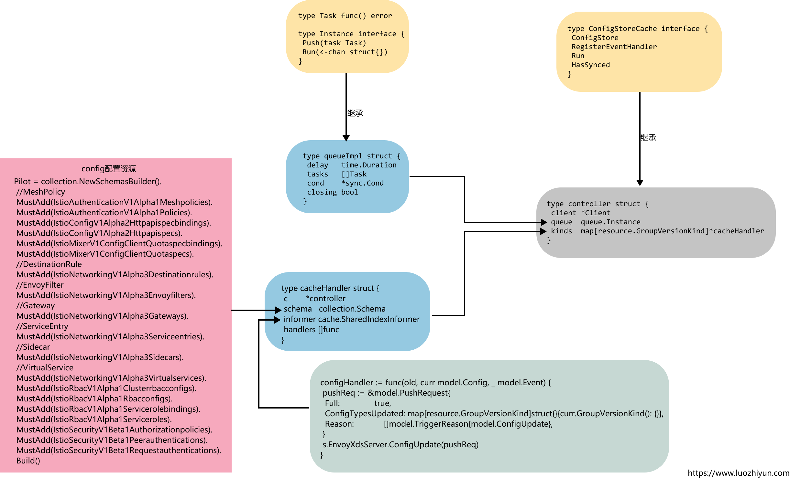

# 3.深入Istio源码：Pilot配置规则ConfigController

Config Controller用于管理各种配置数据，包括用户创建的流量管理规则和策略。Istio目前支持三种类型的Config Controller：

* MCP：是一种网络配置协议，用于隔离Pilot和底层平台（文件系统、K8s），使得Pilot无须感知底层平台的差异，从而达到解耦的目的。
* File：通过监视器周期性地读取本地配置文件，将配置规则缓存在内存中，并维护配置的增加、更新、删除事件，当缓存由变化的时候，异步通知执行事件回调。
* Kubernetes：基于k8s的Config发现利用了k8s Informer的监听能力。在k8s集群中，Config以CustomResource的形式存在。通过监听apiserver配置规则资源，维护所有资源的缓存Store，并触发事件处理回调函数。

## ConfigController初始化

ConfigController是在initConfigController中被初始化的，在initConfigController方法中会调用makeKubeConfigController进行controller的初始化。

```go
func (s *Server) makeKubeConfigController(args *PilotArgs) (model.ConfigStoreCache, error) {
	//创建configClient
	configClient, err := controller.NewClient(args.Config.KubeConfig, "", collections.Pilot,
		args.Config.ControllerOptions.DomainSuffix, buildLedger(args.Config), args.Revision)
	if err != nil {
		return nil, multierror.Prefix(err, "failed to open a config client.")
	}
	//创建controller，并为config资源设置监听
	return controller.NewController(configClient, args.Config.ControllerOptions), nil
}

func NewController(client *Client, options controller2.Options) model.ConfigStoreCache {
	log.Infof("CRD controller watching namespaces %q", options.WatchedNamespace)

	// The queue requires a time duration for a retry delay after a handler error
	out := &controller{
		client: client,
		queue:  queue.NewQueue(1 * time.Second),
		kinds:  make(map[resource.GroupVersionKind]*cacheHandler),
	}

	// add stores for CRD kinds
	//获取所有的CRD类型
	for _, s := range client.Schemas().All() {
		//为每一种Config资源都创建一个informer，监听所有的Config资源
		out.addInformer(s, options.WatchedNamespace, options.ResyncPeriod)
	} 
	return out
}
```

初始化完controller之后会获取所有的CRD类型，为每一种Config资源都创建一个informer，监听所有的Config资源。

```go
	Pilot = collection.NewSchemasBuilder().
		//MeshPolicy
		MustAdd(IstioAuthenticationV1Alpha1Meshpolicies).
		MustAdd(IstioAuthenticationV1Alpha1Policies).
		MustAdd(IstioConfigV1Alpha2Httpapispecbindings).
		MustAdd(IstioConfigV1Alpha2Httpapispecs).
		MustAdd(IstioMixerV1ConfigClientQuotaspecbindings).
		MustAdd(IstioMixerV1ConfigClientQuotaspecs).
		//DestinationRule
		MustAdd(IstioNetworkingV1Alpha3Destinationrules).
		//EnvoyFilter
		MustAdd(IstioNetworkingV1Alpha3Envoyfilters).
		//Gateway
		MustAdd(IstioNetworkingV1Alpha3Gateways).
		//ServiceEntry
		MustAdd(IstioNetworkingV1Alpha3Serviceentries).
		//Sidecar
		MustAdd(IstioNetworkingV1Alpha3Sidecars).
		//VirtualService
		MustAdd(IstioNetworkingV1Alpha3Virtualservices).
		MustAdd(IstioRbacV1Alpha1Clusterrbacconfigs).
		MustAdd(IstioRbacV1Alpha1Rbacconfigs).
		MustAdd(IstioRbacV1Alpha1Servicerolebindings).
		MustAdd(IstioRbacV1Alpha1Serviceroles).
		MustAdd(IstioSecurityV1Beta1Authorizationpolicies).
		MustAdd(IstioSecurityV1Beta1Peerauthentications).
		MustAdd(IstioSecurityV1Beta1Requestauthentications).
		Build()
```

这里定义好了所有要用到的Config资源类型，主要涉及网络配置、认证、鉴权、策略管理等。

## ConfigController事件处理

下面我们看一下controller定义：

```go
type controller struct {
	client *Client
	queue  queue.Instance
	kinds  map[resource.GroupVersionKind]*cacheHandler
}
```

client是调用`controller.NewClient`初始化的client；queue会在Informer监听到资源的变动的时候将数据push到队列中，controller在调用run方法的时候单独运行一个线程运行queue中的函数；kinds在调用addInformer方法的时候初始化进去。

queue.Instance的定义如下：

```go
type Task func() error

type Instance interface { 
	Push(task Task) 
	Run(<-chan struct{})
}

type queueImpl struct {
	delay   time.Duration
	tasks   []Task
	cond    *sync.Cond
	closing bool
}
```

queueImpl继承了Instance接口，在调用push方法的时候，会将Task放入到tasks数组中，并在调用Run方法的时候消费数组中的数据。

controller继承了ConfigStoreCache接口：

```go
type ConfigStoreCache interface {
	ConfigStore 
	// 注册规则事件处理函数
	RegisterEventHandler(kind resource.GroupVersionKind, handler func(Config, Config, Event)) 
	// 运行
	Run(stop <-chan struct{})
 
	// 配置缓存是否已同步
	HasSynced() bool
}
```

ConfigStoreCache通过RegisterEventHandler接口为上面提到的配置资源都注册事件处理函数，通过Run方法启动控制器。

```go
func (c *controller) Run(stop <-chan struct{}) {
	log.Infoa("Starting Pilot K8S CRD controller")
	go func() {
		cache.WaitForCacheSync(stop, c.HasSynced)
		//单独启动一个线程运行queue里面的函数
		c.queue.Run(stop)
	}()

	for _, ctl := range c.kinds {
		go ctl.informer.Run(stop)
	}

	<-stop
	log.Info("controller terminated")
}
```

在调用Run方法的时候会单独的启动一个线程调用queue的Run方法消费队列中的数据，并遍历所有的配置信息，调用informer的Run方法开启监听。

监听器的EventHandler通过如下代码注册：

```go
func (c *controller) newCacheHandler(
	schema collection.Schema,
	o runtime.Object,
	otype string,
	resyncPeriod time.Duration,
	lf cache.ListFunc,
	wf cache.WatchFunc) *cacheHandler { 
	informer := cache.NewSharedIndexInformer(
		&cache.ListWatch{ListFunc: lf, WatchFunc: wf}, o,
		resyncPeriod, cache.Indexers{})

	h := &cacheHandler{
		c:        c,
		schema:   schema,
		informer: informer,
	}

	informer.AddEventHandler(
		cache.ResourceEventHandlerFuncs{ 
			AddFunc: func(obj interface{}) {
				incrementEvent(otype, "add")
				//将ADD事件发送至队列
				c.queue.Push(func() error {
					return h.onEvent(nil, obj, model.EventAdd)
				})
			},
			UpdateFunc: func(old, cur interface{}) {
				if !reflect.DeepEqual(old, cur) {
					incrementEvent(otype, "update")
					//将Update事件发送至队列
					c.queue.Push(func() error {
						return h.onEvent(old, cur, model.EventUpdate)
					})
				} else {
					incrementEvent(otype, "updatesame")
				}
			},
			DeleteFunc: func(obj interface{}) {
				incrementEvent(otype, "delete")
				//将Delete事件发送至队列
				c.queue.Push(func() error {
					return h.onEvent(nil, obj, model.EventDelete)
				})
			},
		})

	return h
}
```

当Config资源创建、更新、删除时，EventHandler创建任务对象并将其发送到任务队列中，然后由任务处理线程处理。当对应的事件被调用的时候会触发onEvent方法，会调用到cacheHandler的onEvent方法，最后设置完毕后将cacheHandler返回，controller会将此cacheHandler设置到kinds数组中存下来。

下面我们看一下cacheHandler的定义：

```go
type cacheHandler struct {
	c        *controller
	schema   collection.Schema
	informer cache.SharedIndexInformer
	handlers []func(model.Config, model.Config, model.Event)
}
```

cacheHandler在上面初始化的时候，会传入对应的controller、Schema、informer，然后在调用configController的RegisterEventHandler方法的时候会初始化对应的configHandler。

configController的RegisterEventHandler方法会在初始化DiscoveryService的时候调用initEventHandlers方法进行初始化：

```go
func (s *Server) initEventHandlers() error {
	...  
	if s.configController != nil { 
		configHandler := func(old, curr model.Config, _ model.Event) {
			pushReq := &model.PushRequest{
				Full:               true,
				ConfigTypesUpdated: map[resource.GroupVersionKind]struct{}{curr.GroupVersionKind(): {}},
				Reason:             []model.TriggerReason{model.ConfigUpdate},
			}
			s.EnvoyXdsServer.ConfigUpdate(pushReq)
		}
		//遍历所有的资源
		for _, schema := range collections.Pilot.All() {
			// This resource type was handled in external/servicediscovery.go, no need to rehandle here.
			//ServiceEntry 这个资源不在这里注册，感兴趣的朋友可以自己找一下
			if schema.Resource().GroupVersionKind() == collections.IstioNetworkingV1Alpha3Serviceentries.
				Resource().GroupVersionKind() {
				continue
			}
			//注册configHandler到configController中
			s.configController.RegisterEventHandler(schema.Resource().GroupVersionKind(), configHandler)
		}
	}

	return nil
}
```

initEventHandlers会调用collections.Pilot.All方法获取所有的资源配置，然后遍历调用RegisterEventHandler方法将configHandler函数注册到cacheHandler的handlers中，至于configHandler函数做了什么，我们到下一篇讲XdsServer的时候再讲。

这一部分的代码是比较绕的，这里画个图理解一下吧。




整个执行流程为：

.png)


## 总结

至此，ConfigController的核心原理及工作流程就介绍完毕了。本篇主要讲解了我们常用的Istio的Gateway、DestinationRule及VirtualService等配置是如何被Istio监听到并作出相应改变的。希望大家能有所收获。

## Reference

https://ruofeng.me/2018/11/08/how-does-istio-pilot-push-eds-config/

https://zhaohuabing.com/post/2019-10-21-pilot-discovery-code-analysi

https://www.servicemesher.com/blog/envoy-proxy-config-deep-dive/

https://www.cnblogs.com/163yun/p/8962278.html