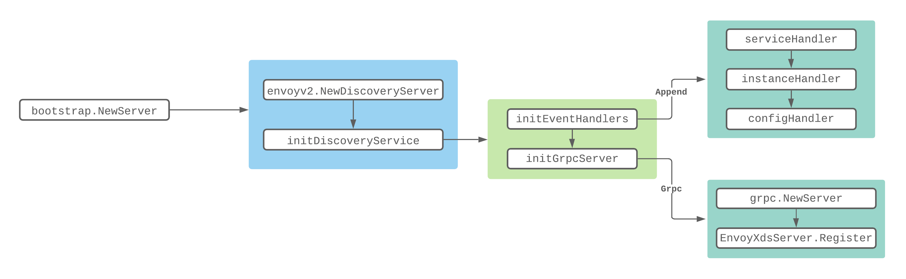
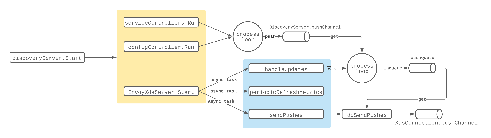
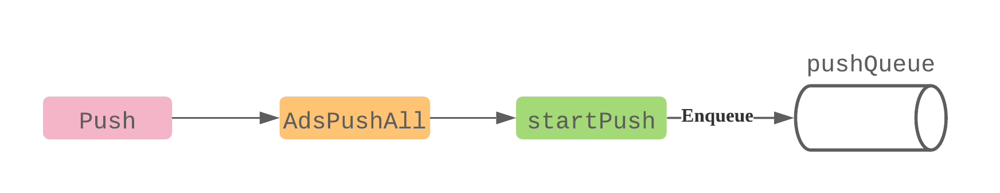
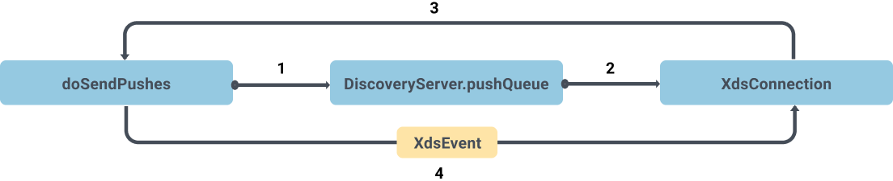
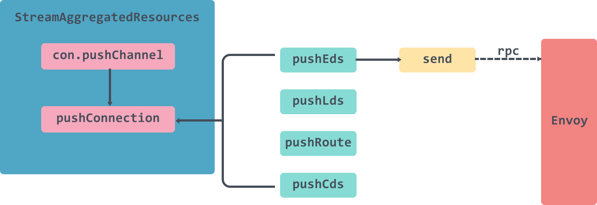
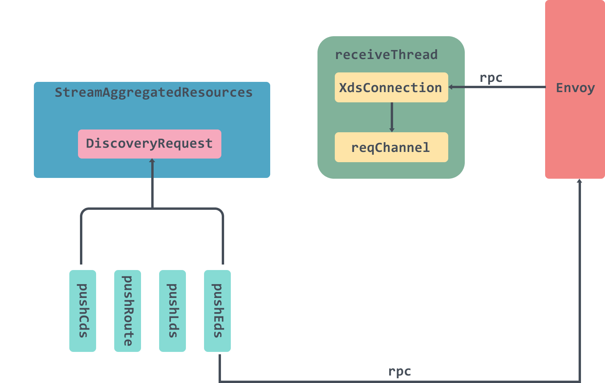

# 4.深入Istio源码：Pilot的Discovery Server如何执行xDS异步分发？

> 转载请声明出处哦~，本篇文章发布于luozhiyun的博客：https://www.luozhiyun.com
>
> 本文使用的Istio源码是 release 1.5。


## 介绍

Discovery Service主要为数据面（运行在 sidecar 中的 Envoy 等 proxy 组件）提供控制信息服务。Discovery Service为数据面提供的信息叫做xds ，这里的 `x` 是一个代词，在 Istio 中，xds 包括 `cds`(cluster discovery service)、`lds`(listener discovery service)、`rds`(route discovery service)、`eds`(endpoint discovery service)，而 `ads`(aggregated discovery service) 是对这些服务的一个统一封装。

Discovery Service中主要包含下述逻辑：

* 启动GRPC Server并接收来自Envoy端的连接请求；
* 接收Envoy端的xDS请求，从Config Controller和Service Controller中获取配置和服务信息，生成响应消息发送给Envoy；
* 监听来自Config Controller的配置变化和来自Service Controller的服务变化消息，并将配置和服务变化内容通过xDS接口推送到Envoy。

## Discovery Service初始化



从上面的流程图可以知道，在调用NewServer创建XdsServer的时候会做很多初始化的工作。如初始化Pilot Server、网格初始化、初始化Istio Config的控制器、初始化Service Discovery的控制器等。我们下面列出和Discovery Service初始化相关的代码：

```go
func NewServer(args *PilotArgs) (*Server, error) {
	//创建Pilot Server
	s := &Server{
		basePort:       args.BasePort,
		clusterID:      getClusterID(args),
		environment:    e,
		//初始化XdsServer
		EnvoyXdsServer: envoyv2.NewDiscoveryServer(e, args.Plugins),
		forceStop:      args.ForceStop,
		mux:            http.NewServeMux(),
	}
	...
	//初始化xDS服务端
	if err := s.initDiscoveryService(args); err != nil {
		return nil, fmt.Errorf("discovery service: %v", err)
	}
	...
}
```

从上面的代码可以看出XdsServer是通过调用NewDiscoveryServer方法来进行初始化的，返回的是一个DiscoveryServer实例，具体字段的使用会在后面说到。

```go
type DiscoveryServer struct {
	...
	// Endpoint 的缓存，以服务名和 namespace 作为索引，主要用于 EDS 更新
	EndpointShardsByService map[string]map[string]*EndpointShards
	//统一接收其他组件发来的 PushRequest 的 channel
	pushChannel chan *model.PushRequest 
	updateMutex sync.RWMutex 
	//pushQueue 主要是在真正 xDS 推送前做防抖缓存
	pushQueue *PushQueue  
}
```

创建完Server后会调用initDiscoveryService方法：

```go
func (s *Server) initDiscoveryService(args *PilotArgs) error {
	...
	//初始化Service Controller和Config Controller的Handler，用于informer回调
	if err := s.initEventHandlers(); err != nil {
		return err
	}
	...
	// 会在初始化完毕之后调用Start方法，启动XdsServer
	s.addStartFunc(func(stop <-chan struct{}) error {
		s.EnvoyXdsServer.Start(stop)
		return nil
	}) 
	//初始化Grpc Server服务，并注册到XdsServer中
	s.initGrpcServer(args.KeepaliveOptions)
	s.httpServer = &http.Server{
		Addr:    args.DiscoveryOptions.HTTPAddr,
		Handler: s.mux,
	}
	...
}
```

这个方法主要做了这么几件事：

1. 初始化各种回调处理器；
2. 将XdsServer启动函数添加到Server的startFuncs队列中，会在初始化完毕之后调用；
3. 调用initGrpcServer方法初始化Grpc Server服务，并注册到XdsServer中。

在初始化 grpcServer 的时候，调用了 `DiscoveryServer.Register()` 方法，向 grpcServer 注册了以下几个服务：

```go
func (s *DiscoveryServer) Register(rpcs *grpc.Server) {
    //注册的时候传入grpc server 和 DiscoveryServer
	ads.RegisterAggregatedDiscoveryServiceServer(rpcs, s)
}
```

DiscoveryServer实际上实现了AggregatedDiscoveryServiceServer接口：

```go
type AggregatedDiscoveryServiceServer interface {
	 // 全量 ADS Stream 接口
	StreamAggregatedResources(AggregatedDiscoveryService_StreamAggregatedResourcesServer) error
	// 增量 ADS Stream 接口
	DeltaAggregatedResources(AggregatedDiscoveryService_DeltaAggregatedResourcesServer) error
}
}
```

StreamAggregatedResources 接收DiscoveryRequest ，返回 DiscoveryResponse 流，包含全量的 xDS 数据，DeltaAggregatedResources方法目前没有具体实现。

大致调用流程如下：


## Discovery Service启动



discoveryServer.Start方法还是在pilot discovery的main方法中被调用。main方法会在调用完bootstrap.NewServer方法后，进行Start方法的调用：

```go
discoveryCmd = &cobra.Command{
	...
	RunE: func(c *cobra.Command, args []string) error {
		...
		stop := make(chan struct{})
		// 创建xDs服务器
		discoveryServer, err := bootstrap.NewServer(&serverArgs)
		if err != nil {
			return fmt.Errorf("failed to create discovery service: %v", err)
		}
 
		// 启动服务器
		if err := discoveryServer.Start(stop); err != nil {
			return fmt.Errorf("failed to start discovery service: %v", err)
		} 
		...
		return nil
	},
}
```

在调用Start方法的时候会获取到Server的startFuncs集合，然后依次执行里面设置的函数：

```go
func (s *Server) Start(stop <-chan struct{}) error {
	// Now start all of the components.
	for _, fn := range s.startFuncs {
		if err := fn(stop); err != nil {
			return err
		}
	}
	...
}
```

遍历调用完毕后会分别启动server Controller和config Controller的run函数，以及调用xdsServer的Start方法，Start方法主要分别启动了三个线程：

```go
func (s *DiscoveryServer) Start(stopCh <-chan struct{}) {
	adsLog.Infof("Starting ADS server")
	go s.handleUpdates(stopCh)
	go s.periodicRefreshMetrics(stopCh)
	go s.sendPushes(stopCh)
}
```

比较重要的是handleUpdates方法和sendPushes方法。

handleUpdates方法主要是处理 pushChannel 中收到的推送请求，最后会调用startPush将数据推入到DiscoveryServer的pushQueue管道中；sendPushes方法则是获取pushQueue管道中的数据，封装成XdsEvent推入到XdsConnection的pushChannel进行异步处理。

### handleUpdates

```go
func (s *DiscoveryServer) handleUpdates(stopCh <-chan struct{}) {
	debounce(s.pushChannel, stopCh, s.Push)
}

func debounce(ch chan *model.PushRequest, stopCh <-chan struct{}, pushFn func(req *model.PushRequest)) {
	var timeChan <-chan time.Time
	var startDebounce time.Time
	var lastConfigUpdateTime time.Time

	pushCounter := 0
	debouncedEvents := 0
 
	var req *model.PushRequest

	free := true
	freeCh := make(chan struct{}, 1)

	push := func(req *model.PushRequest) {
		pushFn(req)
		freeCh <- struct{}{}
	}

	pushWorker := func() {
		eventDelay := time.Since(startDebounce)
		quietTime := time.Since(lastConfigUpdateTime) 
		// debounceMax为10s ，debounceAfter为100毫秒
		//延迟时间大于等于最大延迟时间 或者 静默时间大于等于最小静默时间
		if eventDelay >= debounceMax || quietTime >= debounceAfter {
			if req != nil {
				pushCounter++
				adsLog.Infof("Push debounce stable[%d] %d: %v since last change, %v since last push, full=%v",
					pushCounter, debouncedEvents,
					quietTime, eventDelay, req.Full)

				free = false
				go push(req)
				req = nil
				debouncedEvents = 0
			}
		} else {
			timeChan = time.After(debounceAfter - quietTime)
		}
	}

	for {
		select {
		case <-freeCh:
			free = true
			pushWorker()
		case r := <-ch:
			// If reason is not set, record it as an unknown reason
			if len(r.Reason) == 0 {
				r.Reason = []model.TriggerReason{model.UnknownTrigger}
			}
			if !enableEDSDebounce && !r.Full {
				// trigger push now, just for EDS
				go pushFn(r)
				continue
			}

			lastConfigUpdateTime = time.Now()
			//首次进入会调用延时器 timeChan 先延迟一个最小静默时间（100 毫秒）
			if debouncedEvents == 0 {
				timeChan = time.After(debounceAfter)
				startDebounce = lastConfigUpdateTime
			}
			debouncedEvents++
			//合并请求
			req = req.Merge(r)
		case <-timeChan:
			if free {
				pushWorker()
			}
		case <-stopCh:
			return
		}
	}
}
```

handleUpdates是直接调用了debounce方法，并将pushChannel以及DiscoveryServer的Push函数传入内。

debounce这个方法里面的处理非常的有意思，我们下面来讲一下它的一个执行流程：

1. 进入到这个方法的时候，pushWorker函数以及push函数都不会被立即调用，而是会走到一个for循环中，里面有select执行语句，这个for循环会一直等待，直到ch有数据`case r := <-ch`被执行；
2. 首次进入到`case r := <-ch`代码块的时候，debouncedEvents是等于0的，那么会直接调用time.After等待debounceAfter设置的时间，也就是100毫秒，被唤醒之后会将timeChan设值，并执行合并请求；
3. 第二次循环的时候会执行到`case <-timeChan`这块逻辑中，执行pushWorker函数，在函数里面会判断是否等待超过了最大延迟时间debounceMax（10s）或 静默时间超过了debounceAfter（100ms），如果是的话，那么执行push函数，调用pushFn进行推送，并将freeCh设置一个空的结构体；
4. 下次循环的时候会执行到`case <-freeCh:`这块逻辑中，再执行下次的pushWorker操作；

push方法会一直往下调用，直到把数据推入到DiscoveryServer的pushQueue管道中：



### send Pushes

```go
func (s *DiscoveryServer) sendPushes(stopCh <-chan struct{}) {
	doSendPushes(stopCh, s.concurrentPushLimit, s.pushQueue)
}
```

sendPushes会调用doSendPushes方法传入PushQueue，以及concurrentPushLimit，它是由环境变量 `PILOT_PUSH_THROTTLE` 控制的，默认为 100 。

```go
func doSendPushes(stopCh <-chan struct{}, semaphore chan struct{}, queue *PushQueue) {
	for {
		select {
		case <-stopCh:
			return
		default: 
			// 这里semaphore容量只有100，用来控制速率
			semaphore <- struct{}{}

			// Get the next proxy to push. This will block if there are no updates required.
			client, info := queue.Dequeue()
			recordPushTriggers(info.Reason...)
			// Signals that a push is done by reading from the semaphore, allowing another send on it.
			doneFunc := func() {
				queue.MarkDone(client)
				<-semaphore
			}

			proxiesQueueTime.Record(time.Since(info.Start).Seconds())

			go func() {
				edsUpdates := info.EdsUpdates
				if info.Full {
					// Setting this to nil will trigger a full push
					edsUpdates = nil
				}

				select {
				case client.pushChannel <- &XdsEvent{
					push:               info.Push,
					edsUpdatedServices: edsUpdates,
					done:               doneFunc,
					start:              info.Start,
					namespacesUpdated:  info.NamespacesUpdated,
					configTypesUpdated: info.ConfigTypesUpdated,
					noncePrefix:        info.Push.Version,
				}:
					return
				case <-client.stream.Context().Done(): // grpc stream was closed
					doneFunc()
					adsLog.Infof("Client closed connection %v", client.ConID)
				}
			}()
		}
	}
}
```

在doSendPushes方法内启动了一个无限循环，在default代码块中实现了主要的功能逻辑。semaphore参数可以看出是用来控制速率用的，当semaphore满了之后会阻塞。然后会启动一个线程将XdsEvent初始化后放入到pushChannel中。

总体来说流程如下：

1. 从pushQueue出队一个xdsConnection；
2. 然后初始化一个XdsEvent入队到xdsConnection的pushChannel管道中；



这里放入到pushChannel管道中的消息会在StreamAggregatedResources方法中被处理：

```go
func (s *DiscoveryServer) StreamAggregatedResources(stream ads.AggregatedDiscoveryService_StreamAggregatedResourcesServer) error {
	...
	con := newXdsConnection(peerAddr, stream)
 
	var receiveError error
	reqChannel := make(chan *xdsapi.DiscoveryRequest, 1)
	//从XdsConnection中接收来自Envoy的DiscoveryRequest
	go receiveThread(con, reqChannel, &receiveError)

	for { 
		select {
		//reqChannel处理部分
		case discReq, ok := <-reqChannel:
			...
		//pushChannel处理部分
		case pushEv := <-con.pushChannel: 

			err := s.pushConnection(con, pushEv)
			pushEv.done()
			if err != nil {
				return nil
			}
		}
	}
}
```

这里总体来说分为两部分，一个是 reqChannel的数据处理这部分稍放到Client Request中说，另一部分是pushChannel的数据处理。

在获取到pushChannel管道的数据后会调用pushConnection进行处理。

```go
func (s *DiscoveryServer) pushConnection(con *XdsConnection, pushEv *XdsEvent) error { 
	//处理增量推送 EDS 的情况
	if pushEv.edsUpdatedServices != nil {
		if !ProxyNeedsPush(con.node, pushEv) {
			adsLog.Debugf("Skipping EDS push to %v, no updates required", con.ConID)
			return nil
		} 
		if len(con.Clusters) > 0 {
			if err := s.pushEds(pushEv.push, con, versionInfo(), pushEv.edsUpdatedServices); err != nil {
				return err
			}
		}
		return nil
	}
	...
	currentVersion := versionInfo()
	pushTypes := PushTypeFor(con.node, pushEv)
	// 根据类型判断推送类型
	if con.CDSWatch && pushTypes[CDS] {
		err := s.pushCds(con, pushEv.push, currentVersion)
		if err != nil {
			return err
		}
	}

	if len(con.Clusters) > 0 && pushTypes[EDS] {
		err := s.pushEds(pushEv.push, con, currentVersion, nil)
		if err != nil {
			return err
		}
	}
	if con.LDSWatch && pushTypes[LDS] {
		err := s.pushLds(con, pushEv.push, currentVersion)
		if err != nil {
			return err
		}
	}
	if len(con.Routes) > 0 && pushTypes[RDS] {
		err := s.pushRoute(con, pushEv.push, currentVersion)
		if err != nil {
			return err
		}
	}
	proxiesConvergeDelay.Record(time.Since(pushEv.start).Seconds())
	return nil
}
```

这里会根据pushEv的类型来判断，需要推送什么类型的配置信息，下面以EDS为例看一下pushEds里面做了什么：

```go
func (s *DiscoveryServer) pushEds(push *model.PushContext, con *XdsConnection, version string, edsUpdatedServices map[string]struct{}) error {
	pushStart := time.Now()
	loadAssignments := make([]*xdsapi.ClusterLoadAssignment, 0)
	endpoints := 0
	empty := 0

	for _, clusterName := range con.Clusters {
		// 构建生成器生成 EDS
		l := s.generateEndpoints(clusterName, con.node, push, edsUpdatedServices)
		if l == nil {
			continue
		}

		for _, e := range l.Endpoints {
			endpoints += len(e.LbEndpoints)
		}

		if len(l.Endpoints) == 0 {
			empty++
		}
		loadAssignments = append(loadAssignments, l)
	}
	//构建DiscoveryResponse
	response := endpointDiscoveryResponse(loadAssignments, version, push.Version)
	//发送响应
	err := con.send(response)
	edsPushTime.Record(time.Since(pushStart).Seconds())
	...
	return nil
}
```

pushEds里面主要就是构建DiscoveryResponse，然后调用send方法发送响应。



### Client Request

这部分的代码和上面的其实差不多，主要是数据的获取是从reqChannel管道中获取。

```go
//从XdsConnection中接收来自Envoy的DiscoveryRequest
go receiveThread(con, reqChannel, &receiveError)

for { 
	select {
	case discReq, ok := <-reqChannel:
		if !ok {
			// Remote side closed connection.
			return receiveError
		}
		// This should be only set for the first request. Guard with ID check regardless.
		if discReq.Node != nil && discReq.Node.Id != "" {
			if cancel, err := s.initConnection(discReq.Node, con); err != nil {
				return err
			} else if cancel != nil {
				defer cancel()
			}
		}

		switch discReq.TypeUrl {
		case ClusterType:
			...
			err := s.pushCds(con, s.globalPushContext(), versionInfo())
			if err != nil {
				return err
			}

		case ListenerType:
			...
			err := s.pushLds(con, s.globalPushContext(), versionInfo())
			if err != nil {
				return err
			}

		case RouteType:
			...
			con.Routes = routes
			adsLog.Debugf("ADS:RDS: REQ %s %s routes:%d", peerAddr, con.ConID, len(con.Routes))
			err := s.pushRoute(con, s.globalPushContext(), versionInfo())
			if err != nil {
				return err
			}

		case EndpointType:
			...
			err := s.pushEds(s.globalPushContext(), con, versionInfo(), nil)
			if err != nil {
				return err
			}

		default:
			adsLog.Warnf("ADS: Unknown watched resources %s", discReq.String())
		}

	case pushEv := <-con.pushChannel:
		...
}
```

这部分会异步掉启动一个线程用来循环的接受grpc的请求，然后将数据存放到reqChannel管道中，然后在for循环中消费管道中的数据。




## 总结

到这里Pilot部分的源码解析就差不多结束了，回顾一下前两篇的内容，第一篇主要是讲通过service controller来监听Service、EndPoint、nodes、pods等资源的更新事件；第二篇主要是讲通过config controller来监听Istio的Gateway、DestinationRule及VirtualService等配置变动情况；这篇文章主要讲解了xDS协议管理服务器端是如何做的，通过接受service controller以及config controller中的消息，从中获取各种各样的资源变动情况，然后建立RPC连接Envoy端的，并告知配置变动。

## Reference

https://www.servicemesher.com/blog/istio-analysis-4/

https://zhaohuabing.com/post/2019-10-21-pilot-discovery-code-analysis/

https://jimmysong.io/blog/service-mesh-the-microservices-in-post-kubernetes-era/

https://blog.gmem.cc/interaction-between-istio-pilot-and-envoy

https://www.envoyproxy.io/docs/envoy/latest/api-docs/xds_protocol

https://cloudnative.to/blog/istio-pilot-3/