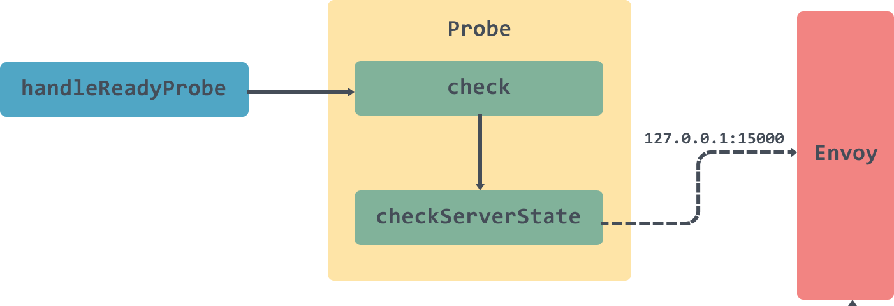
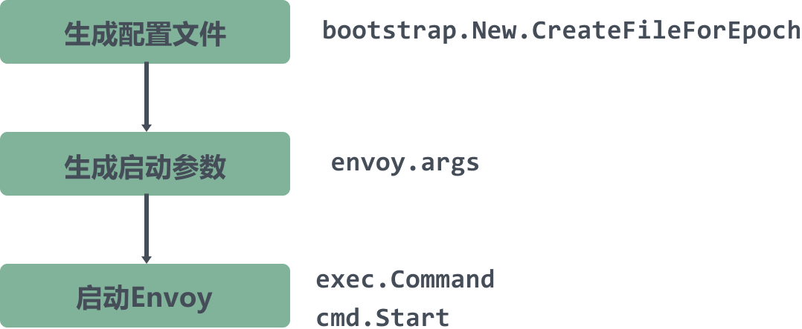

# 5.深入Istio源码：Pilot-agent作用及其源码分析

> 转载请声明出处哦~，本篇文章发布于luozhiyun的博客：https://www.luozhiyun.com
>
> 本文使用的Istio源码是 release 1.5。

## 介绍

Sidecar在注入的时候会注入istio-init和istio-proxy两个容器。Pilot-agent就是启动istio-proxy的入口。通过kubectl命令我们可以看到启动命令：

```sh
[root@localhost ~]# kubectl exec -it details-v1-6c9f8bcbcb-shltm -c istio-proxy -- ps -efww
UID         PID   PPID  C STIME TTY          TIME CMD

istio-p+      1      0  0 08:52 ?        00:00:13 /usr/local/bin/pilot-agent proxy sidecar --domain default.svc.cluster.local --configPath /etc/istio/proxy --binaryPath /usr/local/bin/envoy --serviceCluster details.default --drainDuration 45s --parentShutdownDuration 1m0s --discoveryAddress istiod.istio-system.svc:15012 --zipkinAddress zipkin.istio-system:9411 --proxyLogLevel=warning --proxyComponentLogLevel=misc:error --connectTimeout 10s --proxyAdminPort 15000 --concurrency 2 --controlPlaneAuthPolicy NONE --dnsRefreshRate 300s --statusPort 15020 --trust-domain=cluster.local --controlPlaneBootstrap=false

istio-p+     18      1  0 08:52 ?        00:01:11 /usr/local/bin/envoy -c /etc/istio/proxy/envoy-rev0.json --restart-epoch 0 --drain-time-s 45 --parent-shutdown-time-s 60 --service-cluster details.default --service-node sidecar~172.20.0.14~details-v1-6c9f8bcbcb-shltm.default~default.svc.cluster.local --max-obj-name-len 189 --local-address-ip-version v4 --log-format [Envoy (Epoch 0)] [%Y-%m-%d %T.%e][%t][%l][%n] %v -l warning --component-log-level misc:error --concurrency 2
```

Pilot-agent除了启动istio-proxy以外还有以下能力：

* 生成Envoy的Bootstrap配置文件；
* 健康检查；
* 监视证书的变化，通知Envoy进程热重启，实现证书的热加载；
* 提供Envoy守护功能，当Envoy异常退出的时候重启Envoy；
* 通知Envoy优雅退出；

## 代码执行流程分析

```go
	proxyCmd = &cobra.Command{
		Use:   "proxy",
		Short: "Envoy proxy agent",
		FParseErrWhitelist: cobra.FParseErrWhitelist{ 
			UnknownFlags: true,
		},
		RunE: func(c *cobra.Command, args []string) error {
			...
			// 用于设置默认配置文件的默认配置相关参数
			proxyConfig := mesh.DefaultProxyConfig()

			// set all flags
			proxyConfig.CustomConfigFile = customConfigFile
			proxyConfig.ProxyBootstrapTemplatePath = templateFile
			proxyConfig.ConfigPath = configPath
			proxyConfig.BinaryPath = binaryPath
			proxyConfig.ServiceCluster = serviceCluster
			proxyConfig.DrainDuration = types.DurationProto(drainDuration)
			proxyConfig.ParentShutdownDuration = types.DurationProto(parentShutdownDuration)
			proxyConfig.DiscoveryAddress = discoveryAddress
			proxyConfig.ConnectTimeout = types.DurationProto(connectTimeout)
			proxyConfig.StatsdUdpAddress = statsdUDPAddress
			...
			ctx, cancel := context.WithCancel(context.Background()) 
			// 启动 status server
			if statusPort > 0 {
				localHostAddr := localHostIPv4
				if proxyIPv6 {
					localHostAddr = localHostIPv6
				}
				prober := kubeAppProberNameVar.Get()
				//健康探测
				statusServer, err := status.NewServer(status.Config{
					LocalHostAddr:  localHostAddr,
					AdminPort:      proxyAdminPort,
                    //通过参数--statusPort 15020设置
					StatusPort:     statusPort,
					KubeAppProbers: prober,
					NodeType:       role.Type,
				})
				if err != nil {
					cancel()
					return err
				}
				go waitForCompletion(ctx, statusServer.Run)
			} 
			... 
			//构造Proxy实例,包括配置，启动参数等
			envoyProxy := envoy.NewProxy(envoy.ProxyConfig{
				Config:              proxyConfig,
				Node:                role.ServiceNode(),
				LogLevel:            proxyLogLevel,
				ComponentLogLevel:   proxyComponentLogLevel,
				PilotSubjectAltName: pilotSAN,
				MixerSubjectAltName: mixerSAN,
				NodeIPs:             role.IPAddresses,
				DNSRefreshRate:      dnsRefreshRate,
				PodName:             podName,
				PodNamespace:        podNamespace,
				PodIP:               podIP,
				SDSUDSPath:          sdsUDSPath,
				SDSTokenPath:        sdsTokenPath,
				STSPort:             stsPort,
				ControlPlaneAuth:    controlPlaneAuthEnabled,
				DisableReportCalls:  disableInternalTelemetry,
				OutlierLogPath:      outlierLogPath,
				PilotCertProvider:   pilotCertProvider,
			})
			//构造agent实例，实现了Agent接口
			agent := envoy.NewAgent(envoyProxy, features.TerminationDrainDuration())

			if nodeAgentSDSEnabled {
				tlsCertsToWatch = []string{}
			}
			//构造watcher实例
			watcher := envoy.NewWatcher(tlsCertsToWatch, agent.Restart)
			//启动 watcher
			go watcher.Run(ctx)

			// 优雅退出
			go cmd.WaitSignalFunc(cancel)
			//启动 agent
			return agent.Run(ctx)
		},
	}
```

执行流程大概分成这么几步：

1. 用于设置默认配置文件的默认配置相关参数；
2. 启动 status server进行健康检测；
3. 构造Proxy实例,包括配置，启动参数，并构造构造agent实例；
4. 构造watcher实例，并启动；
5. 开启线程监听信号，进行优雅退出；
6. 启动 agent；

### 默认配置相关参数

```go
kubectl exec -it details-v1-6c9f8bcbcb-shltm -c istio-proxy -- /usr/local/bin/pilot-agent proxy --help
Envoy proxy agent

Usage:
	pilot-agent proxy [flags]

Flags:
		--binaryPath string                 Path to the proxy binary (default "/usr/local/bin/envoy")
		--concurrency int                   number of worker threads to run
		--configPath string                 Path to the generated configuration file directory (default "/etc/istio/proxy")
		--connectTimeout duration           Connection timeout used by Envoy for supporting services (default 1s)
		--controlPlaneAuthPolicy string     Control Plane Authentication Policy (default "NONE")
		--controlPlaneBootstrap             Process bootstrap provided via templateFile to be used by control plane components. (default true)
		--customConfigFile string           Path to the custom configuration file
		--datadogAgentAddress string        Address of the Datadog Agent
		--disableInternalTelemetry          Disable internal telemetry
		--discoveryAddress string           Address of the discovery service exposing xDS (e.g. istio-pilot:8080) (default "istio-pilot:15010")
		--dnsRefreshRate string             The dns_refresh_rate for bootstrap STRICT_DNS clusters (default "300s")
		--domain string                     DNS domain suffix. If not provided uses ${POD_NAMESPACE}.svc.cluster.local
		--drainDuration duration            The time in seconds that Envoy will drain connections during a hot restart (default 45s)
		--envoyAccessLogService string      Settings of an Envoy gRPC Access Log Service API implementation
		--envoyMetricsService string        Settings of an Envoy gRPC Metrics Service API implementation
	-h, --help                              help for proxy
		--id string                         Proxy unique ID. If not provided uses ${POD_NAME}.${POD_NAMESPACE} from environment variables
		--ip string                         Proxy IP address. If not provided uses ${INSTANCE_IP} environment variable.
		--lightstepAccessToken string       Access Token for LightStep Satellite pool
		--lightstepAddress string           Address of the LightStep Satellite pool
		--lightstepCacertPath string        Path to the trusted cacert used to authenticate the pool
		--lightstepSecure                   Should connection to the LightStep Satellite pool be secure
		--mixerIdentity string              The identity used as the suffix for mixer's spiffe SAN. This would only be used by pilot all other proxy would get this value from pilot
		--outlierLogPath string             The log path for outlier detection
		--parentShutdownDuration duration   The time in seconds that Envoy will wait before shutting down the parent process during a hot restart (default 1m0s)
		--pilotIdentity string              The identity used as the suffix for pilot's spiffe SAN
		--proxyAdminPort uint16             Port on which Envoy should listen for administrative commands (default 15000)
		--proxyComponentLogLevel string     The component log level used to start the Envoy proxy (default "misc:error")
		--proxyLogLevel string              The log level used to start the Envoy proxy (choose from {trace, debug, info, warning, error, critical, off}) (default "warning")
		--serviceCluster string             Service cluster (default "istio-proxy")
		--serviceregistry string            Select the platform for service registry, options are {Kubernetes, Consul, Mock} (default "Kubernetes")
		--statsdUdpAddress string           IP Address and Port of a statsd UDP listener (e.g. 10.75.241.127:9125)
		--statusPort uint16                 HTTP Port on which to serve pilot agent status. If zero, agent status will not be provided.
		--stsPort int                       HTTP Port on which to serve Security Token Service (STS). If zero, STS service will not be provided.
		--templateFile string               Go template bootstrap config
		--tokenManagerPlugin string         Token provider specific plugin name. (default "GoogleTokenExchange")
		--trust-domain string               The domain to use for identities
		--zipkinAddress string              Address of the Zipkin service (e.g. zipkin:9411)
```

从上面输出我们也可以看到proxy参数的含义以及对应的默认值。

```go
func DefaultProxyConfig() meshconfig.ProxyConfig {
	return meshconfig.ProxyConfig{
		ConfigPath:             constants.ConfigPathDir,
		BinaryPath:             constants.BinaryPathFilename,
		ServiceCluster:         constants.ServiceClusterName,
		DrainDuration:          types.DurationProto(45 * time.Second),
		ParentShutdownDuration: types.DurationProto(60 * time.Second),
		DiscoveryAddress:       constants.DiscoveryPlainAddress,
		ConnectTimeout:         types.DurationProto(1 * time.Second),
		StatsdUdpAddress:       "",
		EnvoyMetricsService:    &meshconfig.RemoteService{Address: ""},
		EnvoyAccessLogService:  &meshconfig.RemoteService{Address: ""},
		ProxyAdminPort:         15000,
		ControlPlaneAuthPolicy: meshconfig.AuthenticationPolicy_NONE,
		CustomConfigFile:       "",
		Concurrency:            0,
		StatNameLength:         189,
		Tracing:                nil,
	}
}
```

默认的启动参数都在DefaultProxyConfig方法中设置，默认的启动配置如下所示：

- ConfigPath：/etc/istio/proxy
- BinaryPath：/usr/local/bin/envoy
- ServiceCluster：istio-proxy
- DrainDuration：45s
- ParentShutdownDuration：60s
- DiscoveryAddress：istio-pilot:15010
- ConnectTimeout：1s
- StatsdUdpAddress：""
- EnvoyMetricsService：meshconfig.RemoteService
- EnvoyAccessLogService：meshconfig.RemoteService
- ProxyAdminPort：15000
- ControlPlaneAuthPolicy：0
- CustomConfigFile：""
- Concurrency：0
- StatNameLength：189
- Tracing：nil

### status server健康检查

初始化status server：

```go
func NewServer(config Config) (*Server, error) {
	s := &Server{
		statusPort: config.StatusPort,
		ready: &ready.Probe{
			LocalHostAddr: config.LocalHostAddr,
			AdminPort:     config.AdminPort,
			NodeType:      config.NodeType,
		},
	}
	...
	return s, nil
}
```

初始化完成之后会开启一个线程调用statusServer的 Run方法：

```go
go waitForCompletion(ctx, statusServer.Run)


func (s *Server) Run(ctx context.Context) {
	log.Infof("Opening status port %d\n", s.statusPort)

	mux := http.NewServeMux()

	// Add the handler for ready probes.
	// 初始化探针的回调处理器
	// /healthz/ready
	mux.HandleFunc(readyPath, s.handleReadyProbe)
	mux.HandleFunc(quitPath, s.handleQuit)
	//应用端口检查
	mux.HandleFunc("/app-health/", s.handleAppProbe)
	//端口通过参数--statusPort 15020设置
	l, err := net.Listen("tcp", fmt.Sprintf(":%d", s.statusPort))
	if err != nil {
		log.Errorf("Error listening on status port: %v", err.Error())
		return
	}
	...
	defer l.Close()
	//开启监听
	go func() {
		if err := http.Serve(l, mux); err != nil {
			log.Errora(err) 
			notifyExit()
		}
	}()
 
	<-ctx.Done()
	log.Info("Status server has successfully terminated")
}
```

Run方法会开启一个线程并监听15020端口，调用路径为 /healthz/ready，并通过调用handleReadyProbe处理器来调用Envoy的15000端口判断Envoy是否已经 ready 接受相对应的流量。调用过程如下：



### watcher监控管理

在进行watcher监控之前会通过NewAgent生成agent实例：

```go
func NewAgent(proxy Proxy, terminationDrainDuration time.Duration) Agent {
	return &agent{
		proxy:                    proxy,
		//用于管理启动 Envoy 后的状态通道，用于监视 Envoy 进程的状态
		statusCh:                 make(chan exitStatus),
		//活跃的Epoch 集合
		activeEpochs:             map[int]chan error{},
		//默认5s
		terminationDrainDuration: terminationDrainDuration,
		//当前的Epoch
		currentEpoch:             -1,
	}
}
```

然后构建watcher实例：

```go
//构造watcher实例
watcher := envoy.NewWatcher(tlsCertsToWatch, agent.Restart)

type watcher struct {
	//证书列表
	certs   []string
	//envoy 重启函数
	updates func(interface{})
}
 
func NewWatcher(certs []string, updates func(interface{})) Watcher {
	return &watcher{
		certs:   certs,
		updates: updates,
	}
}
```

watcher里面总共就两个参数certs是监听的证书列表，updates是envoy 重启函数，如果证书文件发生变化则调用updates来reload envoy。

启动watcher：

```go
go watcher.Run(ctx)

func (w *watcher) Run(ctx context.Context) { 
	//启动envoy
	w.SendConfig()
 
	//监听证书变化
	go watchCerts(ctx, w.certs, watchFileEvents, defaultMinDelay, w.SendConfig)

	<-ctx.Done()
	log.Info("Watcher has successfully terminated")
}
```

watcher的Run方法首先会调用SendConfig启动Envoy，然后启动一个线程监听证书的变化。

```go
func (w *watcher) SendConfig() {
	h := sha256.New()
	generateCertHash(h, w.certs)
	w.updates(h.Sum(nil))
}
```

SendConfig方法会获取当前的证书集合hash之后传入到updates方法中，updates方法就是在初始化NewWatcher的时候传入的，这里是会调用到agent的Restart方法的：

```go
func (a *agent) Restart(config interface{}) { 
	a.restartMutex.Lock()
	defer a.restartMutex.Unlock()
 
	a.mutex.Lock()
	//校验传入的参数是否产生了变化
	if reflect.DeepEqual(a.currentConfig, config) {
		// Same configuration - nothing to do.
		a.mutex.Unlock()
		return
	}
	//活跃的Epoch
	hasActiveEpoch := len(a.activeEpochs) > 0
	//获取当前的Epoch
	activeEpoch := a.currentEpoch
 
	//因为配置变了,所以Epoch加1
	epoch := a.currentEpoch + 1
	log.Infof("Received new config, creating new Envoy epoch %d", epoch)
	//更新当前的配置以及Epoch
	a.currentEpoch = epoch
	a.currentConfig = config
 
	// 用来做做主动退出
	abortCh := make(chan error, 1)
    // 设置当前活跃Epoch的abortCh管道，用于优雅关闭
	a.activeEpochs[a.currentEpoch] = abortCh
 
	a.mutex.Unlock()
 
	if hasActiveEpoch {
		a.waitUntilLive(activeEpoch)
	}
	//启动envoy,会将结果放入到statusCh管道中
	go a.runWait(config, epoch, abortCh)
}
```

Restart方法会判断传入的配置是否和当前的配置一致，如果不一致，那么设置好当前的配置后调用runWait方法启动Envoy，并将启动结果放入到statusCh管道中：

```go
func (a *agent) runWait(config interface{}, epoch int, abortCh <-chan error) {
	log.Infof("Epoch %d starting", epoch)
	//启动envoy
	err := a.proxy.Run(config, epoch, abortCh)
	//删除当前 epoch 对应的配置文件
	a.proxy.Cleanup(epoch)
	a.statusCh <- exitStatus{epoch: epoch, err: err}
}
```

### envoy启动流程



在上面讲了，envoy的启动会在runWait方法中进行，通过调用proxy的Run方法会通过模板文件创建/etc/istio/proxy/envoy-rev0.json配置文件，然会直接使用exec包调用envoy启动命令启动envoy。

```go
func (e *envoy) Run(config interface{}, epoch int, abort <-chan error) error {
	var fname string
	//如果指定了模板文件，则使用用户指定的，否则则使用默认的
	if len(e.Config.CustomConfigFile) > 0 { 
		fname = e.Config.CustomConfigFile
	} else {
		out, err := bootstrap.New(bootstrap.Config{
			Node:                e.Node,
			DNSRefreshRate:      e.DNSRefreshRate,
			Proxy:               &e.Config,
			PilotSubjectAltName: e.PilotSubjectAltName,
			MixerSubjectAltName: e.MixerSubjectAltName,
			LocalEnv:            os.Environ(),
			NodeIPs:             e.NodeIPs,
			PodName:             e.PodName,
			PodNamespace:        e.PodNamespace,
			PodIP:               e.PodIP,
			SDSUDSPath:          e.SDSUDSPath,
			SDSTokenPath:        e.SDSTokenPath,
			STSPort:             e.STSPort,
			ControlPlaneAuth:    e.ControlPlaneAuth,
			DisableReportCalls:  e.DisableReportCalls,
			OutlierLogPath:      e.OutlierLogPath,
			PilotCertProvider:   e.PilotCertProvider,
		}).CreateFileForEpoch(epoch)
		if err != nil {
			log.Errora("Failed to generate bootstrap config: ", err)
			os.Exit(1) // Prevent infinite loop attempting to write the file, let k8s/systemd report
		}
		fname = out
	} 
	//设置启动参数
	args := e.args(fname, epoch, istioBootstrapOverrideVar.Get())
	log.Infof("Envoy command: %v", args)

	//直接使用exec包调用envoy启动命令
	cmd := exec.Command(e.Config.BinaryPath, args...)
	cmd.Stdout = os.Stdout
	cmd.Stderr = os.Stderr
	if err := cmd.Start(); err != nil {
		return err
	}
	done := make(chan error, 1)
	go func() {
		done <- cmd.Wait()
	}()
	//等待 abort channel 和 done，用于结束 Envoy 和正确返回当前的启动状态
	select {
    //用于优雅关闭，后面会讲到
	case err := <-abort:
		log.Warnf("Aborting epoch %d", epoch)
		if errKill := cmd.Process.Kill(); errKill != nil {
			log.Warnf("killing epoch %d caused an error %v", epoch, errKill)
		}
		return err
	case err := <-done:
		return err
	}
}
```

Run方法会通过调用CreateFileForEpoch方法获取到模板文件：/var/lib/istio/envoy/envoy_bootstrap_tmpl.json，然后生成/etc/istio/proxy/envoy-rev0.json文件并返回路径；通过调用args方法来配置envoy的启动参数，然后调用exec.Command启动envoy，BinaryPath为/usr/local/bin/envoy。

最后异步获取cmd的返回结果，存入到done管道中作为方法的参数返回。返回的参数在runWait方法中会被接受到，存入到statusCh管道中。

在调用agent的run方法的时候会监听statusCh管道中的数据：

```go
agent.Run(ctx)

func (a *agent) Run(ctx context.Context) error {
	log.Info("Starting proxy agent")
	for {
		select {
		//如果 proxy-Envoy 的状态发生了变化
		case status := <-a.statusCh:
			a.mutex.Lock()
			if status.err != nil {
				if status.err.Error() == errOutOfMemory {
					log.Warnf("Envoy may have been out of memory killed. Check memory usage and limits.")
				}
				log.Errorf("Epoch %d exited with error: %v", status.epoch, status.err)
			} else {
				//正常退出
				log.Infof("Epoch %d exited normally", status.epoch)
			}
			//删除当前 epoch 对应的配置文件
			delete(a.activeEpochs, status.epoch)

			active := len(a.activeEpochs)
			a.mutex.Unlock()

			if active == 0 {
				log.Infof("No more active epochs, terminating")
				return nil
			} 
		...
	}
}
```

### 优雅退出

pilot-agent会开启一个线程调用WaitSignalFunc方法监听syscall.SIGINT、syscall.SIGTERM信号，然后调用context的cancel来实现优化关闭的效果：

```go
func WaitSignalFunc(cancel func()) {
	sigs := make(chan os.Signal, 1)
	signal.Notify(sigs, syscall.SIGINT, syscall.SIGTERM)
	<-sigs
	cancel()
	_ = log.Sync()
}
```

当context的cancel方法被调用的时候，agent的Run方法里面select监听的ctx.Done()方法也会立即返回，调用terminate方法：

```go
func (a *agent) Run(ctx context.Context) error { 
	for {
		select {
		//如果 proxy-Envoy 的状态发生了变化
		case status := <-a.statusCh:
			... 
		case <-ctx.Done():
			a.terminate()
			log.Info("Agent has successfully terminated")
			return nil
		}
	}
}

func (a *agent) terminate() {
	log.Infof("Agent draining Proxy")
	e := a.proxy.Drain()
	if e != nil {
		log.Warnf("Error in invoking drain listeners endpoint %v", e)
	}
	log.Infof("Graceful termination period is %v, starting...", a.terminationDrainDuration)
	//睡眠5s
	time.Sleep(a.terminationDrainDuration)
	log.Infof("Graceful termination period complete, terminating remaining proxies.")
	a.abortAll()
}
```

terminate方法会调用sleep休眠5s，然后调用abortAll通知所有活跃Epoch进行优雅关闭。

```go
var errAbort = errors.New("epoch aborted")

func (a *agent) abortAll() {
	a.mutex.Lock()
	defer a.mutex.Unlock()
	for epoch, abortCh := range a.activeEpochs {
		log.Warnf("Aborting epoch %d...", epoch)
		abortCh <- errAbort
	}
	log.Warnf("Aborted all epochs")
}
```

abortAll会获取到所有活跃的Epoch对应的abortCh管道，并插入一条数据。如果这个时候有活跃的Epoch正在等待cmd返回结果，那么会直接调用kill方法将进程杀死：

```go
func (e *envoy) Run(config interface{}, epoch int, abort <-chan error) error {
	...
	//等待 abort channel 和 done，用于结束 Envoy 和正确返回当前的启动状态
	select {
    //用于优雅关闭，后面会讲到
	case err := <-abort:
		log.Warnf("Aborting epoch %d", epoch)
		if errKill := cmd.Process.Kill(); errKill != nil {
			log.Warnf("killing epoch %d caused an error %v", epoch, errKill)
		}
		return err
	case err := <-done:
		return err
	}
}
```

## 总结

本篇文章讲解了pilot-agent有什么作用，在整个istio中起到了什么样的作用，以及Envoy是如何被监控，被重启的。

## Reference

https://blog.csdn.net/zhonglinzhang/article/details/86551795

https://www.do1618.com/archives/1561/pilot-agent-%E6%BA%90%E7%A0%81%E5%88%86%E6%9E%90%EF%BC%88%E5%8E%9F%E5%88%9B%EF%BC%89/

https://www.servicemesher.com/blog/istio-service-mesh-source-code-pilot-agent-deepin/