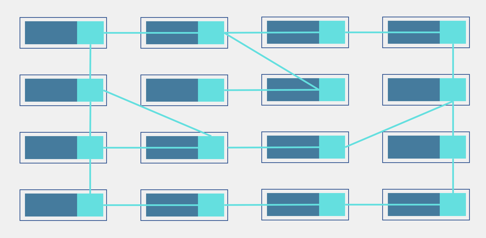
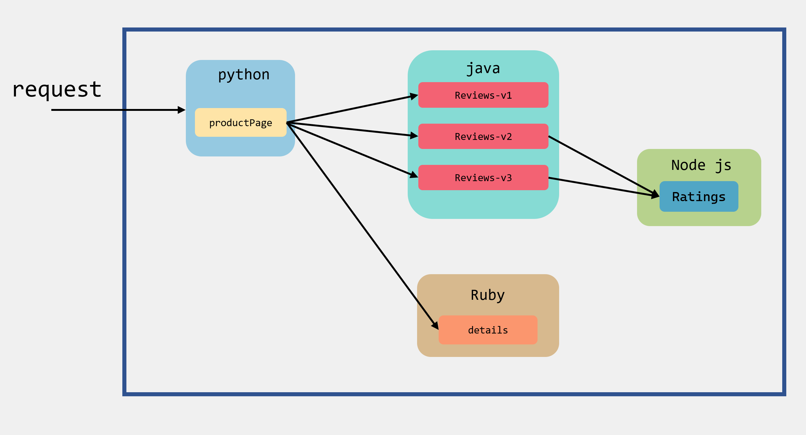

# 从一个例子入手Istio


> 转载请声明出处哦~，本篇文章发布于luozhiyun的博客：https://www.luozhiyun.com
>
> 本文使用的Istio源码是 release 1.5。
>
> 本篇是Istio系列的第一篇，希望大家接下来能和我一起学习进步。

封面图是[Klegs](https://www.pixiv.net/users/20345732)的作品，颜色有一种深邃感，我很喜欢。这篇文章是Istio系列文章的开篇，主要从一个例子入手讲一下Istio，并讲解一些基础概念，后面会基于这个例子来展开讲解istio里面的实现原理。

Istio里面有很多有趣的内容，希望大家能一起来学习，感受Istio的魅力，当然Istio是和k8s是分不开的，所以也需要掌握了一定k8s知识能力才能进行学习，还没有掌握的同学不妨看看我的系列文章来进行学习：[深入k8s系列文章](https://www.luozhiyun.com/archives/tag/%e6%b7%b1%e5%85%a5k8s)。


## 基本概念

先来说一下什么是Service Mesh（服务网格），一般来说Service Mesh是一种控制处理服务间通信的基础设施层，可以在云原生场景下帮助应用程序在复杂的服务拓扑间可靠的传递请求。在实际使用中，服务网格一般是通过一组轻量网络代理来执行治理逻辑的，并且网络代理和应用绑定在一起，但是对应用来说是无感的。

下面用一张经典的网络示意图来表示一下Service Mesh：



那么Istio又是什么呢？Istio就是一个Service Mesh实现的形态，用于服务治理的开放平台，并且Istio是与K8s紧密结合的适用于云原生场景的平台。

下面我们看看Istio的架构图：


Istio分别由数据平面（Data plane）和控制平面（Control plane）组成。

数据平面由网格内的Proxy代理和应用组成，这些代理以sidecar的形式和应用服务一起部署。每一个 sidecar会接管进入和离开服务的流量，并配合控制平面完成流量控制等方面的功能。

控制平面用于控制和管理数据平面中的sidecar代理，完成配置的分发、服务发现、和授权鉴权等功能，可以统一的对数据平面进行管理。

在上面的组件中，Proxy代理默认使用Envoy作为sidecar代理，Envoy是由Lyft内部于2016年开发的，其性能和资源占用都有着很好的表现，能够满足服务网格中对透明代理的轻量高性能的要求。

Pilot组件主要功能是将路由规则等配置信息转换为sidecar可以识别的信息，并下发给数据平面，完成流量控制相关的功能。

Citadel是专门负责安全的组件，内置有身份和证书管理功能，可以实现较为强大的授权和认证等操作。

Galley主要负责配置的验证、提取和处理等功能。

# 安装 Istio

本地需要准备一台机器上面安装有K8s，可以使用我在讲k8s的时候部署的机器：[1.深入k8s：k8s部署&在k8s中运行第一个程序](https://www.luozhiyun.com/archives/314)。

因为Istio的发展太过于迅速了，我这里是使用1.5.10的版本进行举例，大家可以去这里下载好应用包：https://github.com/istio/istio/releases/tag/1.5.10。

解压好之后里面会包含如下文件目录：

| 目录      | 包含内容                                                     |
| --------- | ------------------------------------------------------------ |
| `bin`     | 包含 istioctl 的客户端文件                                   |
| `install` | 包含 Consul、GCP 和 Kubernetes 平台的 [Istio](https://www.servicemesher.com/istio-handbook/GLOSSARY.html#istio) 安装脚本和文件 |
| `samples` | 包含示例应用程序                                             |
| `tools`   | 包含用于性能测试和在本地机器上进行测试的脚本                 |

然后我们将istioctl客户端路径加入环境变量中：

```sh
[root@localhost ~]# export PATH=$PATH:$(pwd)/istio-1.5.10/bin
```

istio不同的版本会有不同的差异，如下表格：

|                  | default  | demo       | minimal  | remote         |
| ---------------- | -------- | ---------- | -------- | -------------- |
| 使用场景         | 生产环境 | 展示、学习 | 基本流控 | 多网格共享平面 |
| **核心组件**     |          |            |          |                |
| - pilot          | Y        | Y          | Y        |                |
| - ingressgateway | Y        | Y          |          |                |
| - engressgateway |          | Y          |          |                |

我们这里用于学习使用，所以使用demo进行安装：

```sh
[root@localhost ~]# istioctl manifest apply --set profile=demo
```

运行完命令后显示：Installation compelte代表安装完成。

安装好之后会安装一个新的namespace：istio-system

我们可以指定ns来获取它下面的pod：

```sh
[root@localhost ~]# kubectl get pod -n istio-system
NAME                                   READY   STATUS    RESTARTS   AGE
grafana-764dbb499-pxs84                1/1     Running   0          17h
istio-egressgateway-775f9cd579-lsw5q   1/1     Running   0          17h
istio-ingressgateway-5d75d8897-dn8vz   1/1     Running   0          17h
istio-tracing-9dd6c4f7c-pwq22          1/1     Running   0          17h
istiod-749c4cf7f8-xgnv8                1/1     Running   0          17h
kiali-869c6894c5-l72sc                 1/1     Running   0          17h
prometheus-79757ffc4-qxccg             2/2     Running   0          17h
```

# Bookinfo 示例

Bookinfo 是 Istio 社区官方推荐的示例应用之一。它可以用来演示多种Istio的特性，并且它是一个异构的微服务应用。应用由四个单独的微服务构成：productpage、details、reviews、ratings。

- `productpage` 会调用 `details` 和 `reviews` 两个微服务，用来生成页面由python来编写。
- `details` 中包含了书籍的信息由，Ruby来编写
- `reviews` 中包含了书籍相关的评论。它还会调用 `ratings` 微服务，由java编写。
- `ratings` 中包含了由书籍评价组成的评级信息，由Node js编写。

下面这个图展示了调用关系：



如果我们的应用要接入Istio服务，那么就需要在这些应用里面都打上sidecar，使服务所有的出入流量都被sidecar所劫持，然后就可以利用istio为应用提供服务路由、遥测数据收集以及策略实施等功能。

### 启动服务

要实现注入sidecar有两种方式，一个是手动注入，一个是自动注入。

手动注入可以通过使用：`istioctl kube-inject -f xxx.yaml | kubectl apply -f - `来实现。

自动注入的需要为应用部署的命令空间打上标签 `istio-injection=enabled`，如果在default空间部署应用，那么可以这么做：

```sh
[root@localhost ~]# kubectl label namespace default istio-injection=enabled
```

这里istio会利用k8s的webhook机制为每个创建的pod都自动注入sidecar，具体是如何做的，下一篇我们再讲。

然后我们使用istio中自带的例子部署应用：

```sh
[root@localhost ~]# kubectl apply -f samples/bookinfo/platform/kube/bookinfo.yaml
```

过一段时间后确认应用都已启动和部署成功：

```sh
[root@localhost ~]#  kubectl get pod
NAME                              READY   STATUS    RESTARTS   AGE
details-v1-6c9f8bcbcb-shltm       2/2     Running   0          17h
productpage-v1-7df7cb7f86-h75dd   2/2     Running   0          17h
ratings-v1-65cff55fb8-9vh2x       2/2     Running   0          17h
reviews-v1-7bccdbbf96-m2xbf       2/2     Running   0          17h
reviews-v2-7c9685df46-lljzt       2/2     Running   0          17h
reviews-v3-58fc46b64-294f4        2/2     Running   0          17h
sleep-8f795f47d-6pw96             2/2     Running   0          16h
```

我们可以用describe命令查看其中的pod：

```sh
[root@localhost ~]#  kubectl describe pod details-v1-6c9f8bcbcb-shltm
...
Init Containers:
  istio-init:
    Container ID:  docker://6d14ccc83bd119236bf8fda13f6799609c87891be9b2c5af7cbf7d8c913ce17e
    Image:         docker.io/istio/proxyv2:1.5.10
    Image ID:      docker-pullable://istio/proxyv2@sha256:abbe8ad6d50474814f1aa9316dafc2401fbba89175638446f01afc36b5a37919
    Port:          <none>
    Host Port:     <none>
    Command:
      istio-iptables
      -p
      15001
      -z
      15006
      -u
      1337
      -m
      REDIRECT
      -i
      *
      -x

      -b
      *
      -d
      15090,15020
...
Containers:
  details:
    Container ID:   docker://ed216429216ea1b8a1ba20960590edb7322557467c38cceff3c3e847bcff0a14
    Image:          docker.io/istio/examples-bookinfo-details-v1:1.15.1
    Image ID:       docker-pullable://istio/examples-bookinfo-details-v1@sha256:344b1c18703ab1e51aa6d698f459c95ea734f8317d779189f4638de7a00e61ae
  	...
  istio-proxy:
    Container ID:  docker://a3862cc8f53198c8f86a911089e73e00f4cc4aa02eea05aaeb0bd267a8e98482
    Image:         docker.io/istio/proxyv2:1.5.10
    Image ID:      docker-pullable://istio/proxyv2@sha256:abbe8ad6d50474814f1aa9316dafc2401fbba89175638446f01afc36b5a37919
    Port:          15090/TCP
    Host Port:     0/TCP
    Args:
    ...
```

可以看到里面有一个初始化的Init Containers，用于设置 `iptables` 规则。还注入了istio-proxy，这个容器是真正的 Sidecar。

为了能让应用程序可以从外部访问 k8s 集群，需要安装gateway：

```sh
[root@localhost ~]# kubectl apply -f samples/bookinfo/networking/bookinfo-gateway.yaml
```

检查gateway：

```sh
[root@localhost ~]# kubectl get gateway
NAME               AGE
bookinfo-gateway   17h
```

因为我是单机环境，未使用外部负载均衡器，需要通过 node port 访问，然后我们查看node port：

```sh
[root@localhost ~]# kubectl -n istio-system get service istio-ingressgateway -o jsonpath='{.spec.ports[?(@.name=="http2")].nodePort}'
22412
```

我的k8snode地址是192.168.13.129，然后我们在浏览器输入：http://192.168.13.129:22412/productpage就可以访到对应的页面了，多刷新几次，会发现访问到不同的Book Reviews，因为默认使用的轮询策略。

## 总结

这一篇讲了一下如何安装istio，以及如何部署应用，使用istio来完成一个实例，比较简单和基础，里面的很多细节我这里都一笔带过了，但是在后面的一些内容会基于这个例子来进行讲解里面的具体实现原理，所以这篇文章还是有些必要的。

## Reference

[What's a service mesh?](https://www.redhat.com/en/topics/microservices/what-is-a-service-mesh)

[What is Istio?](https://istio.io/latest/docs/concepts/what-is-istio/)

https://istio.io/latest/docs/examples/bookinfo/