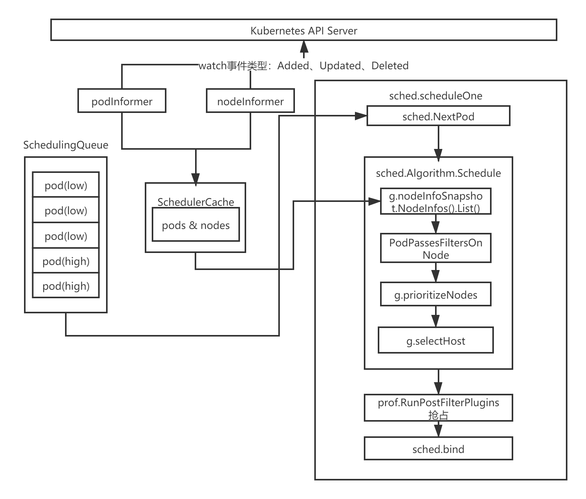
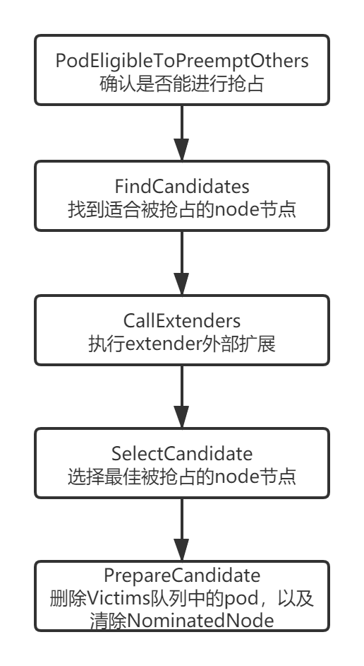

# 10.深入k8s：调度的优先级及抢占机制源码分析

> 转载请声明出处哦~，本篇文章发布于luozhiyun的博客：https://www.luozhiyun.com
>
> 源码版本是[1.19](https://github.com/kubernetes/kubernetes/tree/release-1.19)


上一篇我们将了获取node成功的情况，如果是一个优先pod获取node失败，那么就会进入到抢占环节中，那么抢占环节k8s会做什么呢，抢占是如何发生的，哪些资源会被抢占这些都是我们这篇要研究的内容。


## 调度的优先级与抢占机制

正常情况下，当一个 Pod 调度失败后，它就会被暂时“搁置”起来，直到 Pod 被更新，或者集群状态发生变化，调度器才会对这个 Pod 进行重新调度。但是我们可以通过PriorityClass优先级来避免这种情况。通过设置优先级一些优先级比较高的pod，如果pod 调度失败，那么并不会被”搁置”，而是会”挤走”某个 node 上的一些低优先级的 pod，这样就可以保证高优先级的 pod 调度成功。

要使用PriorityClass，首先我们要定义一个PriorityClass对象，例如：

```yaml
apiVersion: v1
kind: PriorityClass
metadata:
  name: high-priority
value: 1000000
globalDefault: false
description: "This priority class should be used for XYZ service pods only."
```

value越高则优先级越高；globalDefault 被设置为 true 的话，那就意味着这个 PriorityClass 的值会成为系统的默认值，如果是false则表示我们只希望声明使用该 PriorityClass 的 Pod 拥有值为 1000000 的优先级，而对于没有声明 PriorityClass 的 Pod 来说，它们的优先级就是 0。

Pod 就可以声明使用它了：

```yaml
apiVersion: v1
kind: Pod
metadata:
  name: nginx
  labels:
    env: test
spec:
  containers:
  - name: nginx
    image: nginx
    imagePullPolicy: IfNotPresent
  priorityClassName: high-priority
```

高优先级的 Pod 调度失败的时候，调度器的抢占能力就会被触发。调度器就会试图从当前集群里寻找一个节点，使得当这个节点上的一个或者多个低优先级 Pod 被删除后，待调度的高优先级 Pod 就可以被调度到这个节点上。

高优先级Pod进行抢占的时候会将pod的 nominatedNodeName 字段，设置为被抢占的 Node 的名字。然后，在下一周期中决定是不是要运行在被抢占的节点上，当这个Pod在等待的时候，如果有其他更高优先级的 Pod 也要抢占同一个节点，那么调度器就会清空原抢占者的 spec.nominatedNodeName 字段，从而允许更高优先级的抢占者执行抢占。

## 源码解析

这里我依旧拿出这张图来进行讲解，上一篇我们将了获取node成功的情况，如果是一个优先pod获取node失败，那么就会进入到抢占环节中。



通过上一篇的分析，我们知道，在scheduleOne方法中执行sched.Algorithm.Schedule会选择一个合适的node节点，如果获取node失败，那么就会进入到一个if逻辑中执行抢占。

代码路径：pkg/scheduler/scheduler.go

```go
func (sched *Scheduler) scheduleOne(ctx context.Context) {
	...
	//为pod资源对象选择一个合适的节点
	scheduleResult, err := sched.Algorithm.Schedule(schedulingCycleCtx, prof, state, pod)
	//获取node失败，抢占逻辑
	if err != nil { 
		//上面调用失败之后，下面会根据pod执行抢占
		nominatedNode := ""
		if fitError, ok := err.(*core.FitError); ok {
			if !prof.HasPostFilterPlugins() {
				klog.V(3).Infof("No PostFilter plugins are registered, so no preemption will be performed.")
			} else { 
				result, status := prof.RunPostFilterPlugins(ctx, state, pod, fitError.FilteredNodesStatuses)
				if status.Code() == framework.Error {
					klog.Errorf("Status after running PostFilter plugins for pod %v/%v: %v", pod.Namespace, pod.Name, status)
				} else {
					klog.V(5).Infof("Status after running PostFilter plugins for pod %v/%v: %v", pod.Namespace, pod.Name, status)
				}
				//抢占成功后，将nominatedNodeName设置为被抢占的 Node 的名字，然后重新进入下一个调度周期
				if status.IsSuccess() && result != nil {
					nominatedNode = result.NominatedNodeName
				}
			} 
			metrics.PodUnschedulable(prof.Name, metrics.SinceInSeconds(start))
		} else if err == core.ErrNoNodesAvailable { 
			metrics.PodUnschedulable(prof.Name, metrics.SinceInSeconds(start))
		} else {
			klog.ErrorS(err, "Error selecting node for pod", "pod", klog.KObj(pod))
			metrics.PodScheduleError(prof.Name, metrics.SinceInSeconds(start))
		}
		sched.recordSchedulingFailure(prof, podInfo, err, v1.PodReasonUnschedulable, nominatedNode)
		return
	}
	...
}
```

在这个方法里面RunPostFilterPlugins会执行具体的抢占逻辑，然后返回被抢占的node节点。抢占者并不会立刻被调度到被抢占的 node 上，调度器只会将抢占者的 status.nominatedNodeName 字段设置为被抢占的 node 的名字。然后，抢占者会重新进入下一个调度周期，在新的调度周期里来决定是不是要运行在被抢占的节点上，当然，即使在下一个调度周期，调度器也不会保证抢占者一定会运行在被抢占的节点上。

这样设计的一个重要原因是调度器只会通过标准的 DELETE API 来删除被抢占的 pod，所以，这些 pod 必然是有一定的“优雅退出”时间（默认是 30s）的。而在这段时间里，其他的节点也是有可能变成可调度的，或者直接有新的节点被添加到这个集群中来。

而在抢占者等待被调度的过程中，如果有其他更高优先级的 pod 也要抢占同一个节点，那么调度器就会清空原抢占者的 status.nominatedNodeName 字段，从而允许更高优先级的抢占者执行抢占，并且，这也使得原抢占者本身也有机会去重新抢占其他节点。


接着我们继续看，RunPostFilterPlugins会遍历所有的postFilterPlugins，然后执行runPostFilterPlugin方法：

```go
func (f *frameworkImpl) RunPostFilterPlugins(ctx context.Context, state *framework.CycleState, pod *v1.Pod, filteredNodeStatusMap framework.NodeToStatusMap) (_ *framework.PostFilterResult, status *framework.Status) {
	startTime := time.Now()
	defer func() {
		metrics.FrameworkExtensionPointDuration.WithLabelValues(postFilter, status.Code().String(), f.profileName).Observe(metrics.SinceInSeconds(startTime))
	}()

	statuses := make(framework.PluginToStatus)
	//postFilterPlugins里面只有一个defaultpreemption
	for _, pl := range f.postFilterPlugins {
		r, s := f.runPostFilterPlugin(ctx, pl, state, pod, filteredNodeStatusMap)
		if s.IsSuccess() {
			return r, s
		} else if !s.IsUnschedulable() {
			// Any status other than Success or Unschedulable is Error.
			return nil, framework.NewStatus(framework.Error, s.Message())
		}
		statuses[pl.Name()] = s
	}

	return nil, statuses.Merge()
}
```

根据我们上一节看的scheduler的初始化可以知道设置的PostFilter如下：

代码路径：pkg/scheduler/algorithmprovider/registry.go

```
	PostFilter: &schedulerapi.PluginSet{
			Enabled: []schedulerapi.Plugin{
				{Name: defaultpreemption.Name},
			},
		},
```

可见，目前只有一个defaultpreemption来执行抢占逻辑，在postFilterPlugins循环里面会调用到runPostFilterPlugin然后运行defaultpreemption的PostFilter方法，最后执行到preempt执行具体抢占逻辑。

代码路径：pkg/scheduler/framework/plugins/defaultpreemption/default_preemption.go

```go
func (pl *DefaultPreemption) PostFilter(...) (*framework.PostFilterResult, *framework.Status) {
	...
	//执行抢占
	nnn, err := pl.preempt(ctx, state, pod, m)
	...
	return &framework.PostFilterResult{NominatedNodeName: nnn}, framework.NewStatus(framework.Success)
}
```

抢占的执行流程图如下：



代码路径：pkg/scheduler/framework/plugins/defaultpreemption/default_preemption.go

```go
func (pl *DefaultPreemption) preempt(ctx context.Context, state *framework.CycleState, pod *v1.Pod, m framework.NodeToStatusMap) (string, error) {
	cs := pl.fh.ClientSet()
	ph := pl.fh.PreemptHandle()
	//返回node列表
	nodeLister := pl.fh.SnapshotSharedLister().NodeInfos()
 
	pod, err := util.GetUpdatedPod(cs, pod)
	if err != nil {
		klog.Errorf("Error getting the updated preemptor pod object: %v", err)
		return "", err
	}
 
	//确认抢占者是否能够进行抢占，如果对应的node节点上的pod正在优雅退出（Graceful Termination ），那么就不应该进行抢占
	if !PodEligibleToPreemptOthers(pod, nodeLister, m[pod.Status.NominatedNodeName]) {
		klog.V(5).Infof("Pod %v/%v is not eligible for more preemption.", pod.Namespace, pod.Name)
		return "", nil
	}
 
	// 查找所有抢占候选者
	candidates, err := FindCandidates(ctx, cs, state, pod, m, ph, nodeLister, pl.pdbLister)
	if err != nil || len(candidates) == 0 {
		return "", err
	}
 
	//若有 extender 则执行
	candidates, err = CallExtenders(ph.Extenders(), pod, nodeLister, candidates)
	if err != nil {
		return "", err
	}
 
	// 查找最佳抢占候选者
	bestCandidate := SelectCandidate(candidates)
	if bestCandidate == nil || len(bestCandidate.Name()) == 0 {
		return "", nil
	}
 
	// 在抢占一个node之前做一些准备工作
	if err := PrepareCandidate(bestCandidate, pl.fh, cs, pod); err != nil {
		return "", err
	}

	return bestCandidate.Name(), nil
}
```

preempt方法首先会去获取node列表，然后获取最新的要执行抢占的pod信息，接着分下面几步执行抢占：

1. 调用PodEligibleToPreemptOthers方法，检查抢占者是否能够进行抢占，如果当前的pod已经抢占了一个node节点或者在被抢占node节点中有pod正在执行优雅退出，那么不应该执行抢占；
2. 调用FindCandidates找到所有node中能被抢占的node节点，并返回候选列表以及node节点中需要被删除的pod；
3. 若有 extender 则执行CallExtenders；
4. 调用SelectCandidate方法在所有候选列表中找出最合适的node节点执行抢占；
5. 调用PrepareCandidate方法删除被抢占的node节点中victim（牺牲者），以及清除NominatedNodeName字段信息；


**PodEligibleToPreemptOthers**

```go
func PodEligibleToPreemptOthers(pod *v1.Pod, nodeInfos framework.NodeInfoLister, nominatedNodeStatus *framework.Status) bool {
	if pod.Spec.PreemptionPolicy != nil && *pod.Spec.PreemptionPolicy == v1.PreemptNever {
		klog.V(5).Infof("Pod %v/%v is not eligible for preemption because it has a preemptionPolicy of %v", pod.Namespace, pod.Name, v1.PreemptNever)
		return false
	}
	//查看抢占者是否已经抢占过
	nomNodeName := pod.Status.NominatedNodeName
	if len(nomNodeName) > 0 { 
		if nominatedNodeStatus.Code() == framework.UnschedulableAndUnresolvable {
			return true
		}
		//获取被抢占的node节点
		if nodeInfo, _ := nodeInfos.Get(nomNodeName); nodeInfo != nil {
			//查看是否存在正在被删除并且优先级比抢占者pod低的pod
			podPriority := podutil.GetPodPriority(pod)
			for _, p := range nodeInfo.Pods {
				if p.Pod.DeletionTimestamp != nil && podutil.GetPodPriority(p.Pod) < podPriority {
					// There is a terminating pod on the nominated node.
					return false
				}
			}
		}
	}
	return true
}
```

这个方法会检查该pod是否已经抢占过其他node节点，如果是的话就遍历节点上的所有pod对象，如果发现节点上有pod资源对象的优先级小于待调度pod资源对象并处于终止状态，则返回false，不会发生抢占。


接下来看FindCandidates方法：

**FindCandidates**

```go
func FindCandidates(ctx context.Context, cs kubernetes.Interface, state *framework.CycleState, pod *v1.Pod,
	m framework.NodeToStatusMap, ph framework.PreemptHandle, nodeLister framework.NodeInfoLister,
	pdbLister policylisters.PodDisruptionBudgetLister) ([]Candidate, error) {
	allNodes, err := nodeLister.List()
	if err != nil {
		return nil, err
	}
	if len(allNodes) == 0 {
		return nil, core.ErrNoNodesAvailable
	}

	//找 predicates 阶段失败但是通过抢占也许能够调度成功的 nodes
	potentialNodes := nodesWherePreemptionMightHelp(allNodes, m)
	if len(potentialNodes) == 0 {
		klog.V(3).Infof("Preemption will not help schedule pod %v/%v on any node.", pod.Namespace, pod.Name) 
		if err := util.ClearNominatedNodeName(cs, pod); err != nil {
			klog.Errorf("Cannot clear 'NominatedNodeName' field of pod %v/%v: %v", pod.Namespace, pod.Name, err) 
		}
		return nil, nil
	}
	if klog.V(5).Enabled() {
		var sample []string
		for i := 0; i < 10 && i < len(potentialNodes); i++ {
			sample = append(sample, potentialNodes[i].Node().Name)
		}
		klog.Infof("%v potential nodes for preemption, first %v are: %v", len(potentialNodes), len(sample), sample)
	}
	//获取PDB对象，PDB能够限制同时终端的pod资源对象的数量，以保证集群的高可用性
	pdbs, err := getPodDisruptionBudgets(pdbLister)
	if err != nil {
		return nil, err
	}
	//寻找符合条件的node，并封装成candidate数组返回
	return dryRunPreemption(ctx, ph, state, pod, potentialNodes, pdbs), nil
}
```

FindCandidates方法首先会获取node列表，然后调用nodesWherePreemptionMightHelp方法来找出predicates 阶段失败但是通过抢占也许能够调度成功的nodes，因为并不是所有的node都可以通过抢占来调度成功。最后调用dryRunPreemption方法来获取符合条件的node节点。


**dryRunPreemption**

```go
func dryRunPreemption(ctx context.Context, fh framework.PreemptHandle, state *framework.CycleState,
	pod *v1.Pod, potentialNodes []*framework.NodeInfo, pdbs []*policy.PodDisruptionBudget) []Candidate {
	var resultLock sync.Mutex
	var candidates []Candidate

	checkNode := func(i int) {
		nodeInfoCopy := potentialNodes[i].Clone()
		stateCopy := state.Clone()
		//找到node上被抢占的pod，也就是victims
		pods, numPDBViolations, fits := selectVictimsOnNode(ctx, fh, stateCopy, pod, nodeInfoCopy, pdbs)
		if fits {
			resultLock.Lock()
			victims := extenderv1.Victims{
				Pods:             pods,
				NumPDBViolations: int64(numPDBViolations),
			}
			c := candidate{
				victims: &victims,
				name:    nodeInfoCopy.Node().Name,
			}
			candidates = append(candidates, &c)
			resultLock.Unlock()
		}
	}
	parallelize.Until(ctx, len(potentialNodes), checkNode)
	return candidates
}
```

这里会开启16个线程调用checkNode方法，checkNode方法里面会调用selectVictimsOnNode方法来检查这个node是不是能被执行抢占，如果能执行抢占返回的pods表示需要删除的节点，然后封装成candidate添加到candidates列表中返回。


**selectVictimsOnNode**

```go
func selectVictimsOnNode(
	ctx context.Context,
	ph framework.PreemptHandle,
	state *framework.CycleState,
	pod *v1.Pod,
	nodeInfo *framework.NodeInfo,
	pdbs []*policy.PodDisruptionBudget,
) ([]*v1.Pod, int, bool) {
	var potentialVictims []*v1.Pod

	//移除node节点的pod
	removePod := func(rp *v1.Pod) error {
		if err := nodeInfo.RemovePod(rp); err != nil {
			return err
		}
		status := ph.RunPreFilterExtensionRemovePod(ctx, state, pod, rp, nodeInfo)
		if !status.IsSuccess() {
			return status.AsError()
		}
		return nil
	}
	//将node节点添加pod
	addPod := func(ap *v1.Pod) error {
		nodeInfo.AddPod(ap)
		status := ph.RunPreFilterExtensionAddPod(ctx, state, pod, ap, nodeInfo)
		if !status.IsSuccess() {
			return status.AsError()
		}
		return nil
	} 
	// 获取pod的优先级，并将node中所有优先级低于该pod的调用removePod方法pod移除
	podPriority := podutil.GetPodPriority(pod)
	for _, p := range nodeInfo.Pods {
		if podutil.GetPodPriority(p.Pod) < podPriority {
			potentialVictims = append(potentialVictims, p.Pod)
			if err := removePod(p.Pod); err != nil {
				return nil, 0, false
			}
		}
	}
 
	//没有优先级低的node，直接返回
	if len(potentialVictims) == 0 {
		return nil, 0, false
	}
 
	if fits, _, err := core.PodPassesFiltersOnNode(ctx, ph, state, pod, nodeInfo); !fits {
		if err != nil {
			klog.Warningf("Encountered error while selecting victims on node %v: %v", nodeInfo.Node().Name, err)
		}

		return nil, 0, false
	}
	var victims []*v1.Pod
	numViolatingVictim := 0
	//将potentialVictims集合里的pod按照优先级进行排序
	sort.Slice(potentialVictims, func(i, j int) bool { return util.MoreImportantPod(potentialVictims[i], potentialVictims[j]) }) 
	//将pdb的pod分离出来
	//基于 pod 是否有 PDB 被分为两组 violatingVictims 和 nonViolatingVictims
	//PDB：https://kubernetes.io/docs/concepts/workloads/pods/disruptions/
	violatingVictims, nonViolatingVictims := filterPodsWithPDBViolation(potentialVictims, pdbs)
	reprievePod := func(p *v1.Pod) (bool, error) {
		if err := addPod(p); err != nil {
			return false, err
		}
		fits, _, _ := core.PodPassesFiltersOnNode(ctx, ph, state, pod, nodeInfo)
		if !fits {
			if err := removePod(p); err != nil {
				return false, err
			}
			// 加入到 victims 中
			victims = append(victims, p)
			klog.V(5).Infof("Pod %v/%v is a potential preemption victim on node %v.", p.Namespace, p.Name, nodeInfo.Node().Name)
		}
		return fits, nil
	}
	//删除pod，并记录删除个数
	for _, p := range violatingVictims {
		if fits, err := reprievePod(p); err != nil {
			klog.Warningf("Failed to reprieve pod %q: %v", p.Name, err)
			return nil, 0, false
		} else if !fits {
			numViolatingVictim++
		}
	} 
	//删除pod
	for _, p := range nonViolatingVictims {
		if _, err := reprievePod(p); err != nil {
			klog.Warningf("Failed to reprieve pod %q: %v", p.Name, err)
			return nil, 0, false
		}
	}
	return victims, numViolatingVictim, true
}
```

这个方法首先定义了两个方法，一个是removePod，另一个是addPod，这两个方法都差不多，如果是removePod就会将pod从node中移除，然后修改node一些属性，如将Requested.MilliCPU、Requested.Memory中减去，表示已用资源大小，将该pod从node节点的Pods列表中移除等等。

回到selectVictimsOnNode继续往下，会遍历node里面的pod列表，如果找到优先级小于抢占pod的就加入到potentialVictims集合中，并调用removePod方法，将当前被遍历的pod从node中移除。

接着会调用PodPassesFiltersOnNode方法，这个方法会运行两次。第一次会调用addNominatedPods方法将调度队列中找到节点上优先级大于或等于当前pod资源对象的nominatedPods加入到nodeInfo对象中，然后执行FilterPlugin列表；第二次则直接执行FilterPlugins列表。之所以要这么做，是由于亲和性的关系，k8s需要判断当前调度的pod亲和性是否依赖了nominatedPods。

继续往下会对potentialVictims按照优先级进行排序，优先级高的在前面。

接着会调用filterPodsWithPDBViolation方法，将 PDB 约束的 Pod和未约束的Pod分离成两个组，然后会分别遍历violatingVictims和nonViolatingVictims调用reprievePod方法对pod进行移除。这里我们在[官方文档](https://kubernetes.io/docs/concepts/configuration/pod-priority-preemption/#poddisruptionbudget-%E6%98%AF%E8%A2%AB%E6%94%AF%E6%8C%81%E7%9A%84-%E4%BD%86%E4%B8%8D%E6%8F%90%E4%BE%9B%E4%BF%9D%E8%AF%81)也可以看其设计理念，PodDisruptionBudget 是在抢占中被支持的，但不提供保证，然后将被移除的pod添加到victims列表中，并记录好被删除的删除pod个数，最后返回。


到这里整个FindCandidates方法就探索完毕了，还是比较长的，我们继续回到preempt方法中往下看，SelectCandidate方法会查找最佳抢占候选者。

**SelectCandidate**

```go
func SelectCandidate(candidates []Candidate) Candidate {
	if len(candidates) == 0 {
		return nil
	}
	if len(candidates) == 1 {
		return candidates[0]
	}

	victimsMap := candidatesToVictimsMap(candidates)
	// 选择1个 node 用于 schedule
	candidateNode := pickOneNodeForPreemption(victimsMap)
 
	for _, candidate := range candidates {
		if candidateNode == candidate.Name() {
			return candidate
		}
	} 
	klog.Errorf("None candidate can be picked from %v.", candidates) 
	return candidates[0]
}
```

这个方法里面会调用candidatesToVictimsMap方法做一个name和victims映射map，然后调用pickOneNodeForPreemption执行主要过滤逻辑。


**pickOneNodeForPreemption**

```go
func pickOneNodeForPreemption(nodesToVictims map[string]*extenderv1.Victims) string {
	//若该 node 没有 victims 则返回
	if len(nodesToVictims) == 0 {
		return ""
	}
	minNumPDBViolatingPods := int64(math.MaxInt32)
	var minNodes1 []string
	lenNodes1 := 0
	//寻找 PDB violations 数量最小的 node
	for node, victims := range nodesToVictims {
		numPDBViolatingPods := victims.NumPDBViolations
		if numPDBViolatingPods < minNumPDBViolatingPods {
			minNumPDBViolatingPods = numPDBViolatingPods
			minNodes1 = nil
			lenNodes1 = 0
		}
		if numPDBViolatingPods == minNumPDBViolatingPods {
			minNodes1 = append(minNodes1, node)
			lenNodes1++
		}
	}
	//如果最小的node只有一个，直接返回
	if lenNodes1 == 1 {
		return minNodes1[0]
	}
 
	minHighestPriority := int32(math.MaxInt32)
	var minNodes2 = make([]string, lenNodes1)
	lenNodes2 := 0
	// 找到node里面pods 最高优先级最小的
	for i := 0; i < lenNodes1; i++ {
		node := minNodes1[i]
		victims := nodesToVictims[node] 
		highestPodPriority := podutil.GetPodPriority(victims.Pods[0])
		if highestPodPriority < minHighestPriority {
			minHighestPriority = highestPodPriority
			lenNodes2 = 0
		}
		if highestPodPriority == minHighestPriority {
			minNodes2[lenNodes2] = node
			lenNodes2++
		}
	}
	if lenNodes2 == 1 {
		return minNodes2[0]
	}
 
	// 找出node里面Victims列表优先级加和最小的
	minSumPriorities := int64(math.MaxInt64)
	lenNodes1 = 0
	for i := 0; i < lenNodes2; i++ {
		var sumPriorities int64
		node := minNodes2[i]
		for _, pod := range nodesToVictims[node].Pods { 
			sumPriorities += int64(podutil.GetPodPriority(pod)) + int64(math.MaxInt32+1)
		}
		if sumPriorities < minSumPriorities {
			minSumPriorities = sumPriorities
			lenNodes1 = 0
		}
		if sumPriorities == minSumPriorities {
			minNodes1[lenNodes1] = node
			lenNodes1++
		}
	}
	if lenNodes1 == 1 {
		return minNodes1[0]
	}
 
	// 找到node列表中需要牺牲的pod数量最小的
	minNumPods := math.MaxInt32
	lenNodes2 = 0
	for i := 0; i < lenNodes1; i++ {
		node := minNodes1[i]
		numPods := len(nodesToVictims[node].Pods)
		if numPods < minNumPods {
			minNumPods = numPods
			lenNodes2 = 0
		}
		if numPods == minNumPods {
			minNodes2[lenNodes2] = node
			lenNodes2++
		}
	}
	if lenNodes2 == 1 {
		return minNodes2[0]
	}
 
	//若多个 node 的 pod 数量相等，则选出高优先级 pod 启动时间最短的
	latestStartTime := util.GetEarliestPodStartTime(nodesToVictims[minNodes2[0]])
	if latestStartTime == nil { 
		klog.Errorf("earliestStartTime is nil for node %s. Should not reach here.", minNodes2[0])
		return minNodes2[0]
	}
	nodeToReturn := minNodes2[0]
	for i := 1; i < lenNodes2; i++ {
		node := minNodes2[i] 
		earliestStartTimeOnNode := util.GetEarliestPodStartTime(nodesToVictims[node])
		if earliestStartTimeOnNode == nil {
			klog.Errorf("earliestStartTime is nil for node %s. Should not reach here.", node)
			continue
		}
		if earliestStartTimeOnNode.After(latestStartTime.Time) {
			latestStartTime = earliestStartTimeOnNode
			nodeToReturn = node
		}
	}

	return nodeToReturn
}
```

这个方法看起来很长，其实逻辑十分的清晰：

1. 找出最少的的PDB violations的node节点，如果找出的node集合大于1则往下走；
2. 找出找到node里面pods 最高优先级最小的node，如果还是找出的node集合大于1则往下走；
3. 找出node里面Victims列表优先级加和最小的，如果还是找出的node集合大于1则往下走；
4. 找到node列表中需要牺牲的pod数量最小的，如果还是找出的node集合大于1则往下走；
5. 若多个 node 的 pod 数量相等，则选出高优先级 pod 启动时间最短的，然后返回。


然后preempt方法往下走到调用PrepareCandidate方法：

**PrepareCandidate**

```go
func PrepareCandidate(c Candidate, fh framework.FrameworkHandle, cs kubernetes.Interface, pod *v1.Pod) error {
	for _, victim := range c.Victims().Pods {
		if err := util.DeletePod(cs, victim); err != nil {
			klog.Errorf("Error preempting pod %v/%v: %v", victim.Namespace, victim.Name, err)
			return err
		} 
		if waitingPod := fh.GetWaitingPod(victim.UID); waitingPod != nil {
			waitingPod.Reject("preempted")
		}
		fh.EventRecorder().Eventf(victim, pod, v1.EventTypeNormal, "Preempted", "Preempting", "Preempted by %v/%v on node %v",
			pod.Namespace, pod.Name, c.Name())
	}
	metrics.PreemptionVictims.Observe(float64(len(c.Victims().Pods)))
 
	//移除低优先级 pod 的 Nominated，更新这些 pod，移动到 activeQ 队列中，让调度器为这些 pod 重新 bind node
	nominatedPods := getLowerPriorityNominatedPods(fh.PreemptHandle(), pod, c.Name())
	if err := util.ClearNominatedNodeName(cs, nominatedPods...); err != nil {
		klog.Errorf("Cannot clear 'NominatedNodeName' field: %v", err)
		// We do not return as this error is not critical.
	}

	return nil
}
```

这个方法会调用DeletePod删除Victims列表里面的pod，然后将这些pod中的Status.NominatedNodeName属性置空。


到这里整个抢占过程就讲解完毕了~

### 总结

看完这一篇我们对k8s的抢占可以说有一个全局的了解，心里应该非常清楚k8s在抢占的时候会发生什么，例如什么时候时候哪些pod会执行抢占，以及为什么执行抢占，以及抢占了哪些pod的资源，对于被抢占的pod会不会重新被调度等等。

## Reference

https://kubernetes.io/docs/concepts/scheduling-eviction/scheduling-framework/

https://kubernetes.io/docs/concepts/configuration/pod-priority-preemption/

https://kubernetes.io/docs/concepts/configuration/pod-overhead/

https://kubernetes.io/docs/concepts/workloads/pods/disruptions/

https://kubernetes.io/docs/tasks/run-application/configure-pdb/

https://kubernetes.io/docs/tasks/configure-pod-container/assign-pods-nodes-using-node-affinity/