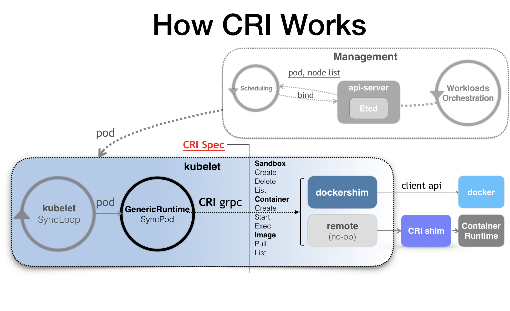
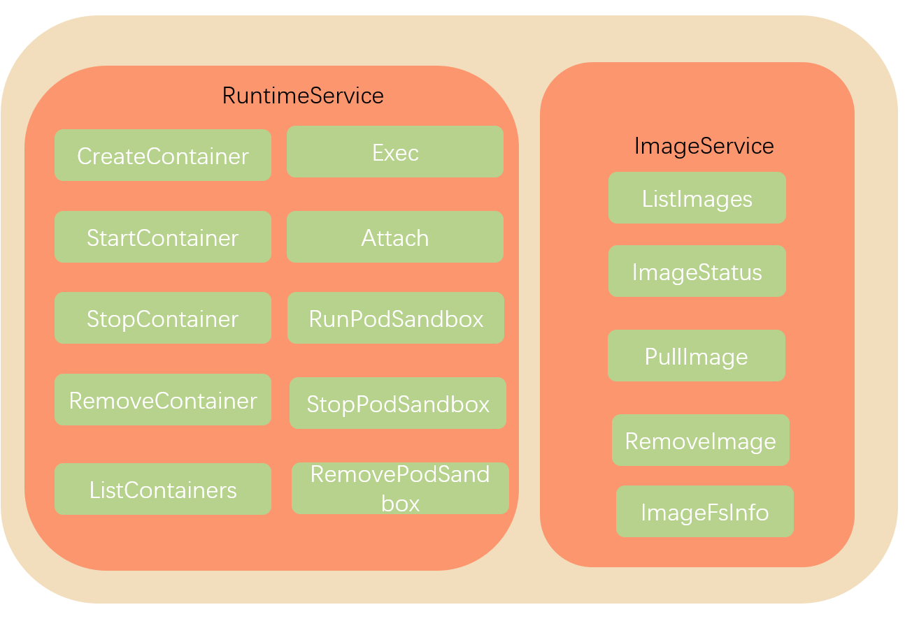
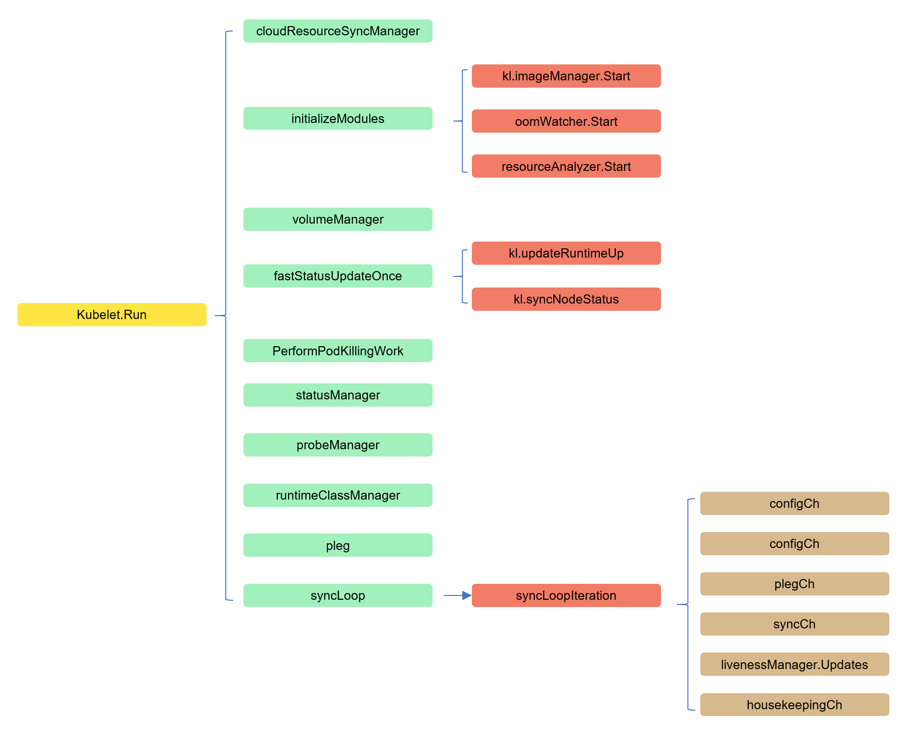

# 11.深入k8s：kubelet工作原理及其初始化源码分析


> 转载请声明出处哦~，本篇文章发布于luozhiyun的博客：https://www.luozhiyun.com
>
> 源码版本是[1.19](https://github.com/kubernetes/kubernetes/tree/release-1.19)

kubelet信息量是很大的，通过我这一篇文章肯定是讲不全的，大家可以根据自己的情况到Reference或文章的链接补录自己缺失的知识。

## kubelet 主要功能

在kubernetes集群中，每个Node节点都会启动kubelet进程，用来处理Master节点下发到本节点的任务，管理Pod和其中的容器。

### pod 管理

Kubelet 以 PodSpec 的方式工作。PodSpec 是描述一个 Pod 的 YAML 或 JSON 对象。 kubelet 采用一组通过各种机制提供的 PodSpecs（主要通过 apiserver），并确保这些 PodSpecs 中描述的 Pod 正常健康运行。

官方提供了4中方式来获取容器信息：

* apiserver：通过 API Server 监听 etcd 目录获取数据；
* File：启动参数 --config 指定的配置目录下的文件；
* 通过 url 从网络上某个地址来获取信息

拿apiserver来说，如果Kubelet 监听到etcd中有新的绑定到本节点的 Pod，则按照 Pod 清单的要求创建该 Pod；如果发现本地的 Pod 被修改，则 Kubelet 会做出相应的修改。

### 容器健康检查

容器健康检查这个我们在前面已经聊过，主要是通过LivenessProbe 与ReadinessProbe来判断容器是否健康。

* LivenessProbe ：用于判断容器是否健康，告诉 Kubelet 一个容器什么时候处于不健康的状态。如果 LivenessProbe 探针探测到容器不健康，则 Kubelet 将删除该容器，并根据容器的重启策略做相应的处理。如果一个容器不包含 LivenessProbe 探针，那么 Kubelet 认为该容器的 LivenessProbe 探针返回的值永远是 “Success”；
* ReadinessProbe：用于判断容器是否启动完成且准备接收请求。如果 ReadinessProbe 探针探测到失败，则 Pod 的状态将被修改。Endpoint Controller 将从 Service 的 Endpoint 中删除包含该容器所在 Pod 的 IP 地址的 Endpoint 条目。

### 容器监控

Kubelet 通过 cAdvisor 获取其所在节点及容器的数据。cAdvisor 是一个开源的分析容器资源使用率和性能特性的代理工具，集成到 Kubelet中，当Kubelet启动时会同时启动cAdvisor，且一个cAdvisor只监控一个Node节点的信息。cAdvisor 自动查找所有在其所在节点上的容器，自动采集 CPU、内存、文件系统和网络使用的统计信息。cAdvisor 通过它所在节点机的 Root 容器，采集并分析该节点机的全面使用情况。 

### kubelet 工作原理

这里借用网上的一张图来说明情况：


由图我们可以看到kubelet 的工作核心，就是一个控制循环，即：SyncLoop。驱动整个控制循环的事件有：pod更新事件、pod生命周期变化、kubelet本身设置的执行周期、定时清理事件等。

在SyncLoop循环上还有很多xxManager，例如probeManager 会定时去监控 pod 中容器的健康状况，当前支持两种类型的探针：livenessProbe 和readinessProbe；statusManager 负责维护状态信息，并把 pod 状态更新到 apiserver；containerRefManager 容器引用的管理，相对简单的Manager，用来报告容器的创建，失败等事件等等。

kubelet 调用下层容器运行时的执行过程，并不会直接调用 Docker 的 API，而是通过一组叫作 CRI（Container Runtime Interface，容器运行时接口）的 gRPC 接口来间接执行的。



CRI是k8s对容器的操作抽离出的一系列的接口，kubelet 就只需要跟这个接口打交道，而不需要关注底层的容器时docker还是rkt，底层的容器只需要自己提供一个该接口的实现，然后对 kubelet 暴露出 gRPC 服务即可。有关CRI的可以内容可以看看这篇：[Introducing Container Runtime Interface](https://kubernetes.io/blog/2016/12/container-runtime-interface-cri-in-kubernetes/)。

一般来说CRI接口可以分为两组：

一组是ImageService，主要是容器镜像相关的操作，比如拉取镜像、删除镜像等。

另一组是RuntimeService，主要是跟容器相关的操作，比如创建、启动、删除Container、Exec等。

如下图（没有列全）：




## kubelet执行源码分析

### **Run**



文件地址：kubernetes\pkg\kubelet\kubelet.go

```go
func (kl *Kubelet) Run(updates <-chan kubetypes.PodUpdate) {
	//注册 logServer
	if kl.logServer == nil {
		kl.logServer = http.StripPrefix("/logs/", http.FileServer(http.Dir("/var/log/")))
	}
	if kl.kubeClient == nil {
		klog.Warning("No api server defined - no node status update will be sent.")
	}
 
	//Cloud Provider 扩展相关：https://kubernetes.feisky.xyz/extension/cloud-provider
	if kl.cloudResourceSyncManager != nil {
		go kl.cloudResourceSyncManager.Run(wait.NeverStop)
	}
	//调用 kl.initializeModules 首先启动不依赖 container runtime 的一些模块
	if err := kl.initializeModules(); err != nil {
		kl.recorder.Eventf(kl.nodeRef, v1.EventTypeWarning, events.KubeletSetupFailed, err.Error())
		klog.Fatal(err)
	}
 
	//启动 volume manager
	go kl.volumeManager.Run(kl.sourcesReady, wait.NeverStop)

	if kl.kubeClient != nil { 
		//执行 kl.syncNodeStatus 定时同步 Node 状态
		go wait.Until(kl.syncNodeStatus, kl.nodeStatusUpdateFrequency, wait.NeverStop)
		//调用 kl.fastStatusUpdateOnce 更新容器运行时启动时间以及执行首次状态同步
		go kl.fastStatusUpdateOnce()

		// start syncing lease
		//NodeLease 机制
		go kl.nodeLeaseController.Run(wait.NeverStop)
	}
	//执行 kl.updateRuntimeUp 定时更新 Runtime 状态
	go wait.Until(kl.updateRuntimeUp, 5*time.Second, wait.NeverStop)

	// Set up iptables util rules
	//执行 kl.syncNetworkUtil 定时同步 iptables 规则
	if kl.makeIPTablesUtilChains {
		kl.initNetworkUtil()
	}
 
	//获取 pk.podKillingCh异常pod， 并定时清理异常 pod
	go wait.Until(kl.podKiller.PerformPodKillingWork, 1*time.Second, wait.NeverStop)

	// Start component sync loops.
	//启动 statusManager、probeManager、runtimeClassManager
	kl.statusManager.Start()
	kl.probeManager.Start()

	// Start syncing RuntimeClasses if enabled.
	if kl.runtimeClassManager != nil {
		kl.runtimeClassManager.Start(wait.NeverStop)
	}

	// Start the pod lifecycle event generator.
	//启动 pleg 该模块主要用于周期性地向 container runtime 刷新当前所有容器的状态
	//https://github.com/kubernetes/community/blob/master/contributors/design-proposals/node/pod-lifecycle-event-generator.md
	kl.pleg.Start()
	kl.syncLoop(updates, kl)
}
```

这个方法会做以下事情：

1. 注册logServer；
2. 如果设置了Cloud Provider，那么会启动云资源管理器，具体的可以查看文章：[cloud-provider](https://kubernetes.feisky.xyz/extension/cloud-provider)；
3. 调用kl.initializeModules启动不依赖 container runtime 的一些模块，这个方法我们下面再分析；
4. 启动 volume manager；
5. 执行 kl.syncNodeStatus 定时同步 Node 状态；
6. 调用kl.fastStatusUpdateOnce启动一个循环更新pod CIDR、runtime状态以及node状态；
7. 调用kl.nodeLeaseController.Run启动NodeLease机制，NodeLease机制是一种上报心跳的方式，可以通过更加轻量化节约资源的方式，并提升性能上报node的心跳信息，具体看： [Lease object](https://kubernetes.io/docs/concepts/architecture/nodes/#heartbeats)；
8. 执行 kl.updateRuntimeUp 定时更新 Runtime 状态；
9. 执行 kl.syncNetworkUtil 定时同步 iptables 规则；
10. 获取 pk.podKillingCh异常pod， 并定时清理异常 pod；
11. 然后启动 statusManager、probeManager、runtimeClassManager；
12. 启动 pleg模块，该模块主要用于周期性地向 container runtime 上报当前所有容器的状态，具体可以看：[Pod Lifecycle Event Generator (PLEG)](https://github.com/kubernetes/community/blob/master/contributors/design-proposals/node/pod-lifecycle-event-generator.md)；
13. 调用kl.syncLoop启动kublet事件循环；

#### initializeModules

下面我们看看initializeModules方法做了些什么。

```go
func (kl *Kubelet) initializeModules() error {
	...
	//创建文件目录
	if err := kl.setupDataDirs(); err != nil {
		return err
	}
 
	//创建 ContainerLogsDir
	if _, err := os.Stat(ContainerLogsDir); err != nil {
		if err := kl.os.MkdirAll(ContainerLogsDir, 0755); err != nil {
			return fmt.Errorf("failed to create directory %q: %v", ContainerLogsDir, err)
		}
	}
 
	//启动 imageManager
	kl.imageManager.Start()
 
	//启动 certificate manager ，证书相关
	if kl.serverCertificateManager != nil {
		kl.serverCertificateManager.Start()
	}
 
	//启动 oomWatcher.
	if err := kl.oomWatcher.Start(kl.nodeRef); err != nil {
		return fmt.Errorf("failed to start OOM watcher %v", err)
	}
 
	//启动 resource analyzer,刷新volume stats到缓存中
	kl.resourceAnalyzer.Start()

	return nil
}
```

initializeModules方法主要做了以下几件事：

1. 创建创建文件目录、Container的log目录；
2. 启动 imageManager，这个管理器实际上是realImageGCManager，我们待会看；
3. 启动 certificate manager ，证书相关；
4. 启动 oomWatcher监视器；
5. 启动 resource analyzer,定时刷新volume stats到缓存中；

**realImageGCManager#Start**

文件路径：pkg/kubelet/images/image_gc_manager.go

```go
func (im *realImageGCManager) Start() {
	go wait.Until(func() { 
		var ts time.Time
		if im.initialized {
			ts = time.Now()
		}
		//找出所有的image，并删除不再使用的image
		_, err := im.detectImages(ts)
		if err != nil {
			klog.Warningf("[imageGCManager] Failed to monitor images: %v", err)
		} else {
			im.initialized = true
		}
	}, 5*time.Minute, wait.NeverStop)
 
	//更新image的缓存
	go wait.Until(func() {
		//调用容器接口，获取最新的image
		images, err := im.runtime.ListImages()
		if err != nil {
			klog.Warningf("[imageGCManager] Failed to update image list: %v", err)
		} else {
			im.imageCache.set(images)
		}
	}, 30*time.Second, wait.NeverStop)

}
```

realImageGCManager的start方法会启动两个协程，然后分别定时调用detectImages方法与imageCache的set方法。detectImages方法里面主要就是调用ImageService和RuntimeService的方法找出所有正在使用的image，然后删除不再使用的image。

这里ListImages和detectImages里面用到的GetPods方法都是调用了CRI的方法，


#### fastStatusUpdateOnce

```go
func (kl *Kubelet) fastStatusUpdateOnce() {
	for {
		time.Sleep(100 * time.Millisecond)
		node, err := kl.GetNode()
		if err != nil {
			klog.Errorf(err.Error())
			continue
		}
		if len(node.Spec.PodCIDRs) != 0 {
			podCIDRs := strings.Join(node.Spec.PodCIDRs, ",")
			if _, err := kl.updatePodCIDR(podCIDRs); err != nil {
				klog.Errorf("Pod CIDR update to %v failed %v", podCIDRs, err)
				continue
			}
			//更新 Runtime 状态
			kl.updateRuntimeUp()
            //更新 节点 状态
			kl.syncNodeStatus()
			return
		}
	}
}
```

 FastStatusUpdateOnce 函数启动一个循环，尝试立即更新POD CIDR。更新pod CIDR后，它会触发运行时更新和节点状态更新。函数在一次成功的节点状态更新后直接返回。该功能仅在 kubelet 启动期间执行，通过尽快更新 pod cidr、运行时状态和节点状态来提高准备就绪节点的延迟。


**updateRuntimeUp**

```go
//首次执行的时候会初始化runtime依赖模块，然后更新runtimeState
func (kl *Kubelet) updateRuntimeUp() {
	kl.updateRuntimeMux.Lock()
	defer kl.updateRuntimeMux.Unlock()
	//获取 containerRuntime Status
	s, err := kl.containerRuntime.Status()
	if err != nil {
		klog.Errorf("Container runtime sanity check failed: %v", err)
		return
	}
	if s == nil {
		klog.Errorf("Container runtime status is nil")
		return
	} 
	klog.V(4).Infof("Container runtime status: %v", s)
	//检查 network 和 runtime 是否处于 ready 状态
	networkReady := s.GetRuntimeCondition(kubecontainer.NetworkReady)
	if networkReady == nil || !networkReady.Status {
		klog.Errorf("Container runtime network not ready: %v", networkReady)
		kl.runtimeState.setNetworkState(fmt.Errorf("runtime network not ready: %v", networkReady))
	} else {
		// Set nil if the container runtime network is ready.
		kl.runtimeState.setNetworkState(nil)
	}
	// information in RuntimeReady condition will be propagated to NodeReady condition.
	//获取运行时状态
	runtimeReady := s.GetRuntimeCondition(kubecontainer.RuntimeReady)
	// If RuntimeReady is not set or is false, report an error.
	if runtimeReady == nil || !runtimeReady.Status {
		err := fmt.Errorf("Container runtime not ready: %v", runtimeReady)
		klog.Error(err)
		kl.runtimeState.setRuntimeState(err)
		return
	}
	kl.runtimeState.setRuntimeState(nil)
	//调用 kl.initializeRuntimeDependentModules 启动依赖模块
	kl.oneTimeInitializer.Do(kl.initializeRuntimeDependentModules)
	kl.runtimeState.setRuntimeSync(kl.clock.Now())
}
```

updateRuntimeUp会获取container运行状态信息，然后根据返回RuntimeStatus检查网络、runtime是不是已经处于ready状态；接着调用kl.initializeRuntimeDependentModules初始化依赖模块，这里会启动cadvisor、containerManager、evictionManager、containerLogManager、pluginManager；最后设置Runtime同步时间。


最后看看syncLoop方法

#### syncLoop

```go
func (kl *Kubelet) syncLoop(updates <-chan kubetypes.PodUpdate, handler SyncHandler) {
	...
    syncTicker := time.NewTicker(time.Second)
	defer syncTicker.Stop()
	housekeepingTicker := time.NewTicker(housekeepingPeriod)
	defer housekeepingTicker.Stop()
	plegCh := kl.pleg.Watch()
	for {
		...
		kl.syncLoopMonitor.Store(kl.clock.Now())
		if !kl.syncLoopIteration(updates, handler, syncTicker.C, housekeepingTicker.C, plegCh) {
			break
		}
		kl.syncLoopMonitor.Store(kl.clock.Now())
	}
}
```

syncLoop方法在一个循环中不断的调用syncLoopIteration方法执行主要逻辑。


#### **syncLoopIteration**

syncLoopIteration方法比较长，拆开来看。

#### syncCh

```go
func (kl *Kubelet) syncLoopIteration(configCh <-chan kubetypes.PodUpdate, handler SyncHandler,
	//方法会监听多个 channel，当发现任何一个 channel 有数据就交给 handler 去处理，在 handler 中通过调用 dispatchWork 分发任务
	syncCh <-chan time.Time, housekeepingCh <-chan time.Time, plegCh <-chan *pleg.PodLifecycleEvent) bool {
	select {
		//该模块将同时 watch 3 个不同来源的 pod 信息的变化（file，http，apiserver），
		//一旦某个来源的 pod 信息发生了更新（创建/更新/删除），这个 channel 中就会出现被更新的 pod 信息和更新的具体操作；
	case u, open := <-configCh: 
		if !open {
			klog.Errorf("Update channel is closed. Exiting the sync loop.")
			return false
		}

		switch u.Op {
		case kubetypes.ADD:
			klog.V(2).Infof("SyncLoop (ADD, %q): %q", u.Source, format.Pods(u.Pods)) 
			handler.HandlePodAdditions(u.Pods)
		case kubetypes.UPDATE:
			klog.V(2).Infof("SyncLoop (UPDATE, %q): %q", u.Source, format.PodsWithDeletionTimestamps(u.Pods))
			handler.HandlePodUpdates(u.Pods)
		case kubetypes.REMOVE:
			klog.V(2).Infof("SyncLoop (REMOVE, %q): %q", u.Source, format.Pods(u.Pods))
			handler.HandlePodRemoves(u.Pods)
		case kubetypes.RECONCILE:
			klog.V(4).Infof("SyncLoop (RECONCILE, %q): %q", u.Source, format.Pods(u.Pods))
			handler.HandlePodReconcile(u.Pods)
		case kubetypes.DELETE:
			klog.V(2).Infof("SyncLoop (DELETE, %q): %q", u.Source, format.Pods(u.Pods)) 
			handler.HandlePodUpdates(u.Pods)
		case kubetypes.SET: 
			klog.Errorf("Kubelet does not support snapshot update")
		default:
			klog.Errorf("Invalid event type received: %d.", u.Op)
		}

		kl.sourcesReady.AddSource(u.Source)

	 ...
}
```

configCh读取配置事件的管道，该模块将同时 watch 3 个不同来源的 pod 信息的变化（file，http，apiserver），一旦某个来源的 pod 信息发生了更新（创建/更新/删除），这个 channel 中就会出现被更新的 pod 信息和更新的具体操作。这里对于pod的操作我们下一篇再讲。


#### plegCh

```go
func (kl *Kubelet) syncLoopIteration(configCh <-chan kubetypes.PodUpdate, handler SyncHandler,
	//方法会监听多个 channel，当发现任何一个 channel 有数据就交给 handler 去处理，在 handler 中通过调用 dispatchWork 分发任务
	syncCh <-chan time.Time, housekeepingCh <-chan time.Time, plegCh <-chan *pleg.PodLifecycleEvent) bool {
	...
	case e := <-plegCh:
		if e.Type == pleg.ContainerStarted {
			kl.lastContainerStartedTime.Add(e.ID, time.Now())
		}
		if isSyncPodWorthy(e) { 
			if pod, ok := kl.podManager.GetPodByUID(e.ID); ok {
				klog.V(2).Infof("SyncLoop (PLEG): %q, event: %#v", format.Pod(pod), e)
				handler.HandlePodSyncs([]*v1.Pod{pod})
			} else { 
				klog.V(4).Infof("SyncLoop (PLEG): ignore irrelevant event: %#v", e)
			}
		} 
		if e.Type == pleg.ContainerDied {
			if containerID, ok := e.Data.(string); ok {
				kl.cleanUpContainersInPod(e.ID, containerID)
			}
		}
	...
}
```

PLEG.Start的时候会每秒钟启动调用一次relist，根据最新的PodStatus生成PodLiftCycleEvent，然后存入到PLE Channel中。

syncLoop会调用pleg.Watch方法获取PLE Channel管道，然后传给syncLoopIteration方法，在syncLoopIteration方法中也就是plegCh这个管道，syncLoopIteration会消费plegCh中的数据，在 handler 中通过调用 dispatchWork 分发任务。


#### syncCh

```go
func (kl *Kubelet) syncLoopIteration(configCh <-chan kubetypes.PodUpdate, handler SyncHandler,
	syncCh <-chan time.Time, housekeepingCh <-chan time.Time, plegCh <-chan *pleg.PodLifecycleEvent) bool {
	...
	//	每秒钟会执行到一次
	case <-syncCh:
		// Sync pods waiting for sync
		podsToSync := kl.getPodsToSync()
		if len(podsToSync) == 0 {
			break
		}
		klog.V(4).Infof("SyncLoop (SYNC): %d pods; %s", len(podsToSync), format.Pods(podsToSync))
		//同步最新保存的 pod 状态
		handler.HandlePodSyncs(podsToSync)
	...
}
```

syncCh是由syncLoop方法里面创建的一个定时任务，每秒钟会向syncCh添加一个数据，然后就会执行到这里。这个方法会同步所有等待同步的pod。


#### livenessManager.Updates

```go
func (kl *Kubelet) syncLoopIteration(configCh <-chan kubetypes.PodUpdate, handler SyncHandler,
	syncCh <-chan time.Time, housekeepingCh <-chan time.Time, plegCh <-chan *pleg.PodLifecycleEvent) bool {
	...
	case update := <-kl.livenessManager.Updates():
		//如果探针检测失败，需要更新pod的状态
		if update.Result == proberesults.Failure { 
			pod, ok := kl.podManager.GetPodByUID(update.PodUID)
			if !ok { 
				klog.V(4).Infof("SyncLoop (container unhealthy): ignore irrelevant update: %#v", update)
				break
			}
			klog.V(1).Infof("SyncLoop (container unhealthy): %q", format.Pod(pod))
			handler.HandlePodSyncs([]*v1.Pod{pod})
		}
	...
}
```

对失败的pod或者liveness检查失败的pod进行sync操作。


#### housekeepingCh

```go
func (kl *Kubelet) syncLoopIteration(configCh <-chan kubetypes.PodUpdate, handler SyncHandler,
	syncCh <-chan time.Time, housekeepingCh <-chan time.Time, plegCh <-chan *pleg.PodLifecycleEvent) bool {
	...
	//	每两秒钟执行一次
	case <-housekeepingCh:
		if !kl.sourcesReady.AllReady() { 
			klog.V(4).Infof("SyncLoop (housekeeping, skipped): sources aren't ready yet.")
		} else {
			klog.V(4).Infof("SyncLoop (housekeeping)")
			//执行一些清理工作，包括终止pod workers、删除不想要的pod，移除volumes、pod目录
			if err := handler.HandlePodCleanups(); err != nil {
				klog.Errorf("Failed cleaning pods: %v", err)
			}
		}
	...
}
```

housekeepingCh这个管道也是由syncLoop创建，每两秒钟会触发清理。


## 总结

kubelet.Run部分主要执行kubelet包含的各种manager的运行，大部分会以一部线程的方式定时运行。了解了CRI是怎么一回事，通过CRI接口可以做什么。

接下来看了syncLoop主函数，这个函数主要对pod的生命周期进行管理，包括对pod进行add 、update、remove、delete等操作，这些具体的代码执行过程留到下一篇，pod的初始化时再讲，syncLoop还需要更新根据不同的channel触发不同的操作，如更新runtime缓存、同步pod、触发清理pod、liveness检查失败的pod进行sync操作等。


## Reference

https://kubernetes.io/docs/reference/command-line-tools-reference/kubelet/

https://kubernetes.io/docs/tasks/configure-pod-container/configure-liveness-readiness-startup-probes/   

https://developer.ibm.com/technologies/containers/blogs/kube-cri-overview/

https://kubernetes.io/docs/concepts/architecture/cloud-controller/

https://kubernetes.feisky.xyz/extension/cloud-provider 

https://kubernetes.io/blog/2016/12/container-runtime-interface-cri-in-kubernetes/

https://developers.redhat.com/blog/2019/11/13/pod-lifecycle-event-generator-understanding-the-pleg-is-not-healthy-issue-in-kubernetes/

https://zhuanlan.zhihu.com/p/110980720

https://kubernetes.io/docs/concepts/architecture/nodes/#heartbeats

https://github.com/kubernetes/community/blob/master/contributors/design-proposals/node/pod-lifecycle-event-generator.md