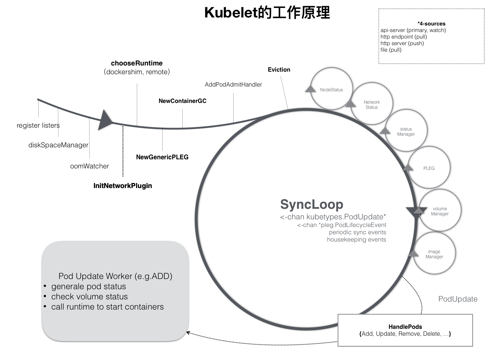
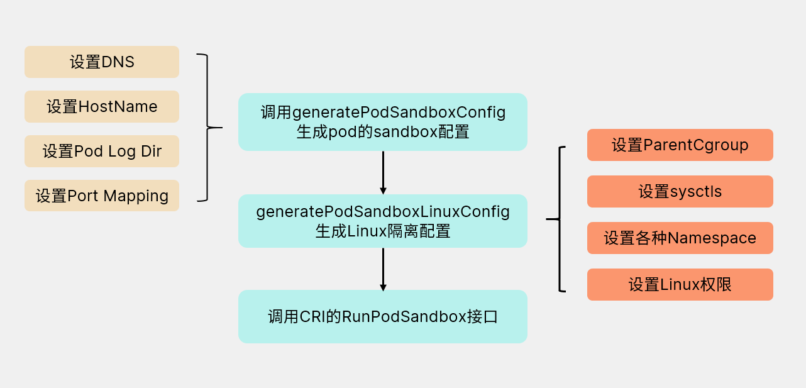
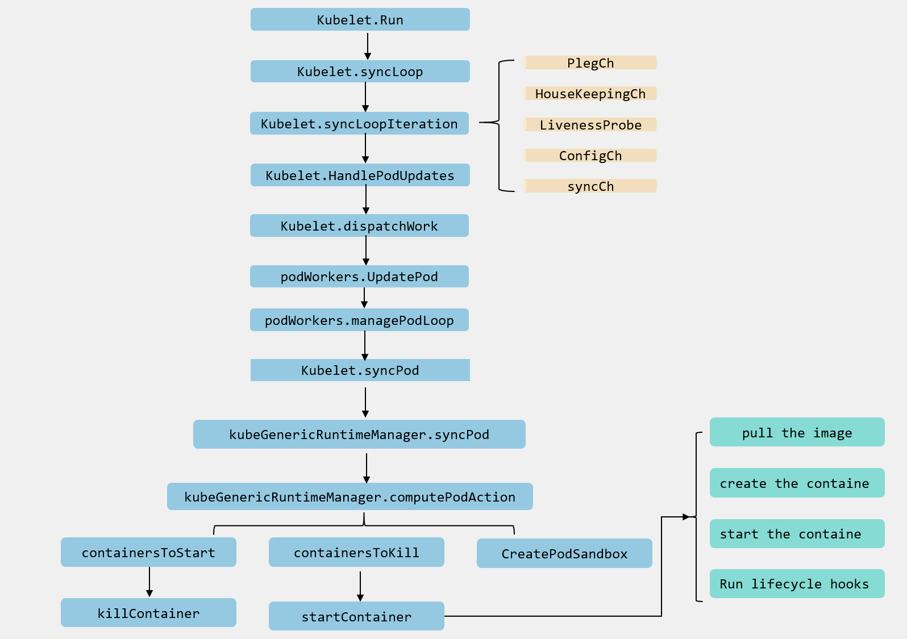

# 12.深入k8s：kubelet创建pod流程源码分析


>  转载请声明出处哦~，本篇文章发布于luozhiyun的博客：https://www.luozhiyun.com
>
> 源码版本是[1.19](https://github.com/kubernetes/kubernetes/tree/release-1.19)

在上一篇中，我们知道在kubelet中，工作核心就是围绕着整个syncLoop来完成不同的工作的。syncLoop会根据不同的上报信息管理pod的生命周期，这些操作都是通过HandlePods来实现的。



整个事件循环的代码在Kubelet调用run方法最后会通过调用kl.syncLoop方法启动事件循环。

## kubelet创建pod流程

### syncLoop循环监听管道信息

文件位置：pkg/kubelet/kubelet.go

```go
func (kl *Kubelet) syncLoop(updates <-chan kubetypes.PodUpdate, handler SyncHandler) {
	...
    syncTicker := time.NewTicker(time.Second)
	defer syncTicker.Stop()
	housekeepingTicker := time.NewTicker(housekeepingPeriod)
	defer housekeepingTicker.Stop()
	plegCh := kl.pleg.Watch()
	for {
		...
		kl.syncLoopMonitor.Store(kl.clock.Now())
		if !kl.syncLoopIteration(updates, handler, syncTicker.C, housekeepingTicker.C, plegCh) {
			break
		}
		kl.syncLoopMonitor.Store(kl.clock.Now())
	}
}
```

syncLoop的主要逻辑是在syncLoopIteration中实现，由于本文主要探讨的是pod创建相关代码，所以我们只需要看处理configCh管道部分的代码就好了。

### syncLoopIteration处理事件循环中的逻辑

```go
func (kl *Kubelet) syncLoopIteration(configCh <-chan kubetypes.PodUpdate, handler SyncHandler,
	//方法会监听多个 channel，当发现任何一个 channel 有数据就交给 handler 去处理，在 handler 中通过调用 dispatchWork 分发任务
	syncCh <-chan time.Time, housekeepingCh <-chan time.Time, plegCh <-chan *pleg.PodLifecycleEvent) bool {
	select {
		//该模块将同时 watch 3 个不同来源的 pod 信息的变化（file，http，apiserver），
		//一旦某个来源的 pod 信息发生了更新（创建/更新/删除），这个 channel 中就会出现被更新的 pod 信息和更新的具体操作；
	case u, open := <-configCh: 
		if !open {
			klog.Errorf("Update channel is closed. Exiting the sync loop.")
			return false
		}

		switch u.Op {
		case kubetypes.ADD:
			klog.V(2).Infof("SyncLoop (ADD, %q): %q", u.Source, format.Pods(u.Pods)) 
			handler.HandlePodAdditions(u.Pods)
		case kubetypes.UPDATE:
			klog.V(2).Infof("SyncLoop (UPDATE, %q): %q", u.Source, format.PodsWithDeletionTimestamps(u.Pods))
			handler.HandlePodUpdates(u.Pods)
		case kubetypes.REMOVE:
			klog.V(2).Infof("SyncLoop (REMOVE, %q): %q", u.Source, format.Pods(u.Pods))
			handler.HandlePodRemoves(u.Pods)
		case kubetypes.RECONCILE:
			klog.V(4).Infof("SyncLoop (RECONCILE, %q): %q", u.Source, format.Pods(u.Pods))
			handler.HandlePodReconcile(u.Pods)
		case kubetypes.DELETE:
			klog.V(2).Infof("SyncLoop (DELETE, %q): %q", u.Source, format.Pods(u.Pods)) 
			handler.HandlePodUpdates(u.Pods)
		case kubetypes.SET: 
			klog.Errorf("Kubelet does not support snapshot update")
		default:
			klog.Errorf("Invalid event type received: %d.", u.Op)
		}

		kl.sourcesReady.AddSource(u.Source)

	 ...
}
```

该模块将同时 watch 3 个不同来源的 pod 信息的变化（file，http，apiserver），一旦某个来源的 pod 信息发生了更新（创建/更新/删除），这个 channel 中就会出现被更新的 pod 信息和更新的具体操作。


### HandlePodAdditions执行创建pod

```go
func (kl *Kubelet) HandlePodAdditions(pods []*v1.Pod) {
	start := kl.clock.Now()
	sort.Sort(sliceutils.PodsByCreationTime(pods))
	for _, pod := range pods {
		existingPods := kl.podManager.GetPods() 
		//将pod添加到pod管理器中，如果有pod不存在在pod管理器中，那么这个pod表示已经被删除了
		kl.podManager.AddPod(pod)
		
		if kubetypes.IsMirrorPod(pod) {
			kl.handleMirrorPod(pod, start)
			continue
		}
		//如果该pod没有被Terminate
		if !kl.podIsTerminated(pod) { 
			// 获取目前还在active状态的pod
			activePods := kl.filterOutTerminatedPods(existingPods)
 
			//验证 pod 是否能在该节点运行，如果不可以直接拒绝
			if ok, reason, message := kl.canAdmitPod(activePods, pod); !ok {
				kl.rejectPod(pod, reason, message)
				continue
			}
		}
		mirrorPod, _ := kl.podManager.GetMirrorPodByPod(pod)
		//把 pod 分配给给 worker 做异步处理,创建pod
		kl.dispatchWork(pod, kubetypes.SyncPodCreate, mirrorPod, start)
		//在 probeManager 中添加 pod，如果 pod 中定义了 readiness 和 liveness 健康检查，启动 goroutine 定期进行检测
		kl.probeManager.AddPod(pod)
	}
}
```

HandlePodAdditions主要任务是：

1. 按照创建时间给pods进行排序；
2. 将pod添加到pod管理器中，如果有pod不存在在pod管理器中，那么这个pod表示已经被删除了；
3. 校验pod 是否能在该节点运行，如果不可以直接拒绝；
4. 调用dispatchWork把 pod 分配给给 worker 做异步处理,创建pod；
5. 将pod添加到probeManager中，如果 pod 中定义了 readiness 和 liveness 健康检查，启动 goroutine 定期进行检测；


#### dispatchWork

```go
func (kl *Kubelet) dispatchWork(pod *v1.Pod, syncType kubetypes.SyncPodType, mirrorPod *v1.Pod, start time.Time) {
	...
	kl.podWorkers.UpdatePod(&UpdatePodOptions{
		Pod:        pod,
		MirrorPod:  mirrorPod,
		UpdateType: syncType,
		OnCompleteFunc: func(err error) {
			if err != nil {
				metrics.PodWorkerDuration.WithLabelValues(syncType.String()).Observe(metrics.SinceInSeconds(start))
			}
		},
	})
	...
}
```

dispatchWork会封装一个UpdatePodOptions结构体丢给podWorkers.UpdatePod去执行。


#### UpdatePod

文件位置：pkg/kubelet/pod_workers.go

```go
func (p *podWorkers) UpdatePod(options *UpdatePodOptions) {
	pod := options.Pod
	uid := pod.UID
	var podUpdates chan UpdatePodOptions
	var exists bool

	p.podLock.Lock()
	defer p.podLock.Unlock()
	//如果该pod在podUpdates数组里面找不到，那么就创建channel，并启动异步线程
	if podUpdates, exists = p.podUpdates[uid]; !exists { 
		podUpdates = make(chan UpdatePodOptions, 1)
		p.podUpdates[uid] = podUpdates
 
		go func() {
			defer runtime.HandleCrash()
			p.managePodLoop(podUpdates)
		}()
	}
	// 下发更新事件
	if !p.isWorking[pod.UID] {
		p.isWorking[pod.UID] = true
		podUpdates <- *options
	} else { 
		update, found := p.lastUndeliveredWorkUpdate[pod.UID]
		if !found || update.UpdateType != kubetypes.SyncPodKill {
			p.lastUndeliveredWorkUpdate[pod.UID] = *options
		}
	}
}
```

这个方法会加锁之后获取podUpdates数组里面数据，如果不存在那么会创建一个channel然后执行一个异步协程。


#### managePodLoop

```go
func (p *podWorkers) managePodLoop(podUpdates <-chan UpdatePodOptions) {
	var lastSyncTime time.Time
	//遍历channel
	for update := range podUpdates {
		err := func() error {
			podUID := update.Pod.UID 
			// 直到cache里面有新数据之前这段代码会阻塞，这保证worker在cache里面有新的数据之前不会提前开始。
			status, err := p.podCache.GetNewerThan(podUID, lastSyncTime)
			if err != nil { 
				p.recorder.Eventf(update.Pod, v1.EventTypeWarning, events.FailedSync, "error determining status: %v", err)
				return err
			}
			//syncPodFn会在kubelet初始化的时候设置，调用的是kubelet的syncPod方法
			err = p.syncPodFn(syncPodOptions{
				mirrorPod:      update.MirrorPod,
				pod:            update.Pod,
				podStatus:      status,
				killPodOptions: update.KillPodOptions,
				updateType:     update.UpdateType,
			})
			lastSyncTime = time.Now()
			return err
		}() 
		if update.OnCompleteFunc != nil {
			update.OnCompleteFunc(err)
		}
		if err != nil { 
			klog.Errorf("Error syncing pod %s (%q), skipping: %v", update.Pod.UID, format.Pod(update.Pod), err)
		}
		p.wrapUp(update.Pod.UID, err)
	}
}
```

这个方法会遍历channel里面的数据，然后调用syncPodFn方法并传入一个syncPodOptions，kubelet会在执行NewMainKubelet方法的时候调用newPodWorkers方法设置syncPodFn为Kubelet的syncPod方法。

如下：

```go
func NewMainKubelet(...){
...
	klet := &Kubelet{...}
...
	klet.podWorkers = newPodWorkers(klet.syncPod, kubeDeps.Recorder, klet.workQueue, klet.resyncInterval, backOffPeriod, klet.podCache)
...
}
```

#### syncPod

文件位置：pkg/kubelet/kubelet.go

```go
func (kl *Kubelet) syncPod(o syncPodOptions) error {
	// pull out the required options
	pod := o.pod
	mirrorPod := o.mirrorPod
	podStatus := o.podStatus
	updateType := o.updateType 

	...

	apiPodStatus := kl.generateAPIPodStatus(pod, podStatus)
	
	// 校验该pod能否运行
	runnable := kl.canRunPod(pod)
	//如果不能运行，那么回写container的等待原因
	if !runnable.Admit {
		// Pod is not runnable; update the Pod and Container statuses to why.
		apiPodStatus.Reason = runnable.Reason
		apiPodStatus.Message = runnable.Message
		// Waiting containers are not creating.
		const waitingReason = "Blocked"
		for _, cs := range apiPodStatus.InitContainerStatuses {
			if cs.State.Waiting != nil {
				cs.State.Waiting.Reason = waitingReason
			}
		}
		for _, cs := range apiPodStatus.ContainerStatuses {
			if cs.State.Waiting != nil {
				cs.State.Waiting.Reason = waitingReason
			}
		}
	}

	// 更新状态管理器中的状态
	kl.statusManager.SetPodStatus(pod, apiPodStatus)
 
	// 如果校验没通过或pod已被删除或pod跑失败了，那么kill掉pod
	if !runnable.Admit || pod.DeletionTimestamp != nil || apiPodStatus.Phase == v1.PodFailed {
		var syncErr error
        ...
		kl.killPod(pod, nil, podStatus, nil)
        ....
		return syncErr
	}
 
	//校验网络插件是否已准备好
	if err := kl.runtimeState.networkErrors(); err != nil && !kubecontainer.IsHostNetworkPod(pod) {
		kl.recorder.Eventf(pod, v1.EventTypeWarning, events.NetworkNotReady, "%s: %v", NetworkNotReadyErrorMsg, err)
		return fmt.Errorf("%s: %v", NetworkNotReadyErrorMsg, err)
	}

	// 创建
	pcm := kl.containerManager.NewPodContainerManager()

	// 校验该pod是否已被Terminate
	if !kl.podIsTerminated(pod) { 
		firstSync := true
		// 校验该pod是否首次创建
		for _, containerStatus := range apiPodStatus.ContainerStatuses {
			if containerStatus.State.Running != nil {
				firstSync = false
				break
			}
		} 
		podKilled := false
		// 如果该pod 的cgroups不存在，并且不是首次启动，那么kill掉
		if !pcm.Exists(pod) && !firstSync {
			if err := kl.killPod(pod, nil, podStatus, nil); err == nil {
				podKilled = true
			}
		} 
		// 如果该pod在上面没有被kill掉，或重启策略不是永不重启
		if !(podKilled && pod.Spec.RestartPolicy == v1.RestartPolicyNever) {
			// 如果该pod的cgroups不存在，那么就创建cgroups
			if !pcm.Exists(pod) {
				if err := kl.containerManager.UpdateQOSCgroups(); err != nil {
					klog.V(2).Infof("Failed to update QoS cgroups while syncing pod: %v", err)
				}
				if err := pcm.EnsureExists(pod); err != nil {
					kl.recorder.Eventf(pod, v1.EventTypeWarning, events.FailedToCreatePodContainer, "unable to ensure pod container exists: %v", err)
					return fmt.Errorf("failed to ensure that the pod: %v cgroups exist and are correctly applied: %v", pod.UID, err)
				}
			}
		}
	} 

	//为静态pod 创建 镜像
	if kubetypes.IsStaticPod(pod) {
		...
	}
 
	// 创建pod的文件目录
	if err := kl.makePodDataDirs(pod); err != nil {
		kl.recorder.Eventf(pod, v1.EventTypeWarning, events.FailedToMakePodDataDirectories, "error making pod data directories: %v", err)
		klog.Errorf("Unable to make pod data directories for pod %q: %v", format.Pod(pod), err)
		return err
	}
 
	// 如果该pod没有被终止，那么需要等待attach/mount volumes
	if !kl.podIsTerminated(pod) {
		// Wait for volumes to attach/mount
		if err := kl.volumeManager.WaitForAttachAndMount(pod); err != nil {
			kl.recorder.Eventf(pod, v1.EventTypeWarning, events.FailedMountVolume, "Unable to attach or mount volumes: %v", err)
			klog.Errorf("Unable to attach or mount volumes for pod %q: %v; skipping pod", format.Pod(pod), err)
			return err
		}
	}
 
	// 如果有 image secrets，去 apiserver 获取对应的 secrets 数据
	pullSecrets := kl.getPullSecretsForPod(pod)
    // 真正的容器创建逻辑
	result := kl.containerRuntime.SyncPod(pod, podStatus, pullSecrets, kl.backOff)
	kl.reasonCache.Update(pod.UID, result)
	if err := result.Error(); err != nil { 
		for _, r := range result.SyncResults {
			if r.Error != kubecontainer.ErrCrashLoopBackOff && r.Error != images.ErrImagePullBackOff { 
				return err
			}
		}

		return nil
	}

	return nil
}
```

该方法主要是为创建pod前做一些准备工作。主要准备工作如下：

1. 校验该pod能否运行，如果不能运行，那么回写container的等待原因，然后更新状态管理器中的状态；
2. 如果校验没通过或pod已被删除或pod跑失败了，那么kill掉pod，然后返回；
3. 校验网络插件是否已准备好，如果没有，直接返回；
4. 如果该pod的cgroups不存在，那么就创建cgroups；
5. 为静态pod创建镜像；
6. 创建pod的文件目录，等待volumes attach/mount；
7. 拉取这个pod的Secret；
8. 调用containerRuntime.SyncPod真正创建pod；

#### syncPod

文件位置：pkg/kubelet/kuberuntime/kuberuntime_manager.go

```go
func (m *kubeGenericRuntimeManager) SyncPod(pod *v1.Pod, podStatus *kubecontainer.PodStatus, pullSecrets []v1.Secret, backOff *flowcontrol.Backoff) (result kubecontainer.PodSyncResult) {
	// 计算一下有哪些pod中container有没有变化，有哪些container需要创建,有哪些container需要kill掉
	podContainerChanges := m.computePodActions(pod, podStatus)
	...
 
	// kill掉 sandbox 已经改变的 pod
	if podContainerChanges.KillPod {
		...
		//kill容器操作
		killResult := m.killPodWithSyncResult(pod, kubecontainer.ConvertPodStatusToRunningPod(m.runtimeName, podStatus), nil)
		result.AddPodSyncResult(killResult)
		...
	} else { 
		// kill掉ContainersToKill列表中的container
		for containerID, containerInfo := range podContainerChanges.ContainersToKill {
			... 
			if err := m.killContainer(pod, containerID, containerInfo.name, containerInfo.message, nil); err != nil {
				killContainerResult.Fail(kubecontainer.ErrKillContainer, err.Error())
				klog.Errorf("killContainer %q(id=%q) for pod %q failed: %v", containerInfo.name, containerID, format.Pod(pod), err)
				return
			}
		}
	}
 
	//清理同名的 Init Container
	m.pruneInitContainersBeforeStart(pod, podStatus)
 
	var podIPs []string
	if podStatus != nil {
		podIPs = podStatus.IPs
	} 
	podSandboxID := podContainerChanges.SandboxID 
	if podContainerChanges.CreateSandbox {
		var msg string
		var err error
		...
		//为pod创建sandbox 
		podSandboxID, msg, err = m.createPodSandbox(pod, podContainerChanges.Attempt)
		if err != nil {
			...
			return
		} 
		... 
	}
 
	podIP := ""
	if len(podIPs) != 0 {
		podIP = podIPs[0]
	}
	...
	//生成Sandbox的config配置，如pod的DNS、hostName、端口映射
	podSandboxConfig, err := m.generatePodSandboxConfig(pod, podContainerChanges.Attempt)
	if err != nil {
		...
		return
	}
 
	start := func(typeName string, spec *startSpec) error {
		...
		// 启动容器
		if msg, err := m.startContainer(podSandboxID, podSandboxConfig, spec, pod, podStatus, pullSecrets, podIP, podIPs); err != nil {
			...
		} 
		return nil
	}

	// 临时容器相关
	if utilfeature.DefaultFeatureGate.Enabled(features.EphemeralContainers) {
		for _, idx := range podContainerChanges.EphemeralContainersToStart {
			start("ephemeral container", ephemeralContainerStartSpec(&pod.Spec.EphemeralContainers[idx]))
		}
	}
 
	// 启动init container
	if container := podContainerChanges.NextInitContainerToStart; container != nil { 
		if err := start("init container", containerStartSpec(container)); err != nil {
			return
		}
 
		klog.V(4).Infof("Completed init container %q for pod %q", container.Name, format.Pod(pod))
	} 
	// 启动containers列表
	for _, idx := range podContainerChanges.ContainersToStart {
		start("container", containerStartSpec(&pod.Spec.Containers[idx]))
	}

	return
}
```

1. 首先会调用computePodActions计算一下有哪些pod中container有没有变化，有哪些container需要创建,有哪些container需要kill掉；
2. kill掉 sandbox 已经改变的 pod；
3. 如果有container已改变，那么需要调用killContainer方法kill掉ContainersToKill列表中的container；
4. 调用pruneInitContainersBeforeStart方法清理同名的 Init Container；
5. 调用createPodSandbox方法，创建需要被创建的Sandbox，关于Sandbox我们再下面说到；
6. 如果开启了临时容器Ephemeral Container，那么需要创建相应的临时容器，临时容器可以看这篇：https://kubernetes.io/docs/concepts/workloads/pods/ephemeral-containers/；
7. 获取NextInitContainerToStart中的container，调用startContainer启动init container；
8. 获取ContainersToStart列表中的container，调用startContainer启动containers列表；


#### computePodActions

文件路径：pkg/kubelet/kuberuntime/kuberuntime_manager.go

```go
func (m *kubeGenericRuntimeManager) computePodActions(pod *v1.Pod, podStatus *kubecontainer.PodStatus) podActions {
	klog.V(5).Infof("Syncing Pod %q: %+v", format.Pod(pod), pod)
	//判断哪些pod的Sandbox已经改变，如果改变需要重新创建
	createPodSandbox, attempt, sandboxID := m.podSandboxChanged(pod, podStatus)
	changes := podActions{
		KillPod:           createPodSandbox,
		CreateSandbox:     createPodSandbox,
		SandboxID:         sandboxID,
		Attempt:           attempt,
		ContainersToStart: []int{},
		ContainersToKill:  make(map[kubecontainer.ContainerID]containerToKillInfo),
	}
 
	//需要新建sandbox
	if createPodSandbox {
		if !shouldRestartOnFailure(pod) && attempt != 0 && len(podStatus.ContainerStatuses) != 0 {
			 
			// 如果pod已经存在了，那么不应该创建sandbox
			// 如果所有的containers 都已完成，那么也不应该创建一个新的sandbox
			// 如果ContainerStatuses是空的，那么我们可以认定，我们从没有成功创建过containers，所以我们应该重试创建sandbox
			changes.CreateSandbox = false
			return changes
		}
		//如果InitContainers 不为空，那么将InitContainers的第一个设置成第一个创建的container
		if len(pod.Spec.InitContainers) != 0 { 
			changes.NextInitContainerToStart = &pod.Spec.InitContainers[0]
			return changes
		} 
		// 将所有container加入到需要启动的队列中，除了已启动，并且重启策略为RestartPolicyOnFailure的pod
		for idx, c := range pod.Spec.Containers {
			if containerSucceeded(&c, podStatus) && pod.Spec.RestartPolicy == v1.RestartPolicyOnFailure {
				continue
			}
			changes.ContainersToStart = append(changes.ContainersToStart, idx)
		}
		return changes
	}
 
	//临时容器相关：https://kubernetes.io/zh/docs/concepts/workloads/pods/ephemeral-containers/
	if utilfeature.DefaultFeatureGate.Enabled(features.EphemeralContainers) {
		for i := range pod.Spec.EphemeralContainers {
			c := (*v1.Container)(&pod.Spec.EphemeralContainers[i].EphemeralContainerCommon)

			// Ephemeral Containers are never restarted
			if podStatus.FindContainerStatusByName(c.Name) == nil {
				changes.EphemeralContainersToStart = append(changes.EphemeralContainersToStart, i)
			}
		}
	} 
	// 检查Init Container运行状态
	initLastStatus, next, done := findNextInitContainerToRun(pod, podStatus)
	if !done {
		if next != nil {
			initFailed := initLastStatus != nil && isInitContainerFailed(initLastStatus)
			if initFailed && !shouldRestartOnFailure(pod) {
				changes.KillPod = true
			} else {
				// Always try to stop containers in unknown state first.
				if initLastStatus != nil && initLastStatus.State == kubecontainer.ContainerStateUnknown {
					changes.ContainersToKill[initLastStatus.ID] = containerToKillInfo{
						name:      next.Name,
						container: next,
						message: fmt.Sprintf("Init container is in %q state, try killing it before restart",
							initLastStatus.State),
					}
				}
				changes.NextInitContainerToStart = next
			}
		} 
		// 若init未完成，直接返回
		return changes
	}
 
	// init已完成，计算需要kill&start的工作container
	keepCount := 0 
	// 校验containers列表的状态
	for idx, container := range pod.Spec.Containers {
		containerStatus := podStatus.FindContainerStatusByName(container.Name)
 
		//调用post-stop生命周期钩子,这样如果container重启了,那么可以马上分配资源
		if containerStatus != nil && containerStatus.State != kubecontainer.ContainerStateRunning {
			if err := m.internalLifecycle.PostStopContainer(containerStatus.ID.ID); err != nil {
				klog.Errorf("internal container post-stop lifecycle hook failed for container %v in pod %v with error %v",
					container.Name, pod.Name, err)
			}
		}
 
		// 如果container不存在或没有在运行,那么根据RestartPolicy决定是否需要重启
		if containerStatus == nil || containerStatus.State != kubecontainer.ContainerStateRunning {
			if kubecontainer.ShouldContainerBeRestarted(&container, pod, podStatus) {
				message := fmt.Sprintf("Container %+v is dead, but RestartPolicy says that we should restart it.", container)
				klog.V(3).Infof(message)
				changes.ContainersToStart = append(changes.ContainersToStart, idx)
				// 如果container 状态是unknown,那么我们不知道是否它在启动,所以我们先kill掉,再启动,避免同时有两个一样的container
				if containerStatus != nil && containerStatus.State == kubecontainer.ContainerStateUnknown { 
					changes.ContainersToKill[containerStatus.ID] = containerToKillInfo{
						name:      containerStatus.Name,
						container: &pod.Spec.Containers[idx],
						message: fmt.Sprintf("Container is in %q state, try killing it before restart",
							containerStatus.State),
					}
				}
			}
			continue
		} 
		var message string
		//到这里,说明container处于running状态,那么当满足下面条件时需要kill掉重启
		restart := shouldRestartOnFailure(pod)
		// 如果container的 spec已经改变了,那么直接重启
		if _, _, changed := containerChanged(&container, containerStatus); changed {
			message = fmt.Sprintf("Container %s definition changed", container.Name)
			// Restart regardless of the restart policy because the container
			// spec changed.
			restart = true
		//	如果liveness探针检测失败,那么需要kill掉container,并且不需要重启
		} else if liveness, found := m.livenessManager.Get(containerStatus.ID); found && liveness == proberesults.Failure {
			// If the container failed the liveness probe, we should kill it.
			message = fmt.Sprintf("Container %s failed liveness probe", container.Name)
		//	如果startup 探针检测失败,那么需要kill掉container,并且不需要重启
		} else if startup, found := m.startupManager.Get(containerStatus.ID); found && startup == proberesults.Failure {
			// If the container failed the startup probe, we should kill it.
			message = fmt.Sprintf("Container %s failed startup probe", container.Name)
		//	到这里，如果探针检测又没问题，container又没改变，那么不需要重启
		} else {
			// Keep the container.
			keepCount++
			continue
		}
 
		// 如果需要重启，那么加入队列
		if restart {
			message = fmt.Sprintf("%s, will be restarted", message)
			changes.ContainersToStart = append(changes.ContainersToStart, idx)
		}
		//这里时设置需要kill掉的container的列表
		changes.ContainersToKill[containerStatus.ID] = containerToKillInfo{
			name:      containerStatus.Name,
			container: &pod.Spec.Containers[idx],
			message:   message,
		}
		klog.V(2).Infof("Container %q (%q) of pod %s: %s", container.Name, containerStatus.ID, format.Pod(pod), message)
	}

	if keepCount == 0 && len(changes.ContainersToStart) == 0 {
		changes.KillPod = true
	}

	return changes
}
```

computePodActions方法主要做这么几件事：

1. 检查PodSandbox有没有改变，如果改变了，那么需要创建PodSandbox；
2. 找到需要运行的Init Container设置到NextInitContainerToStart字段中；
3. 找到需要被kill掉的Container列表ContainersToKill；
4. 找到需要被启动的Container列表ContainersToStart；


#### Sandbox

Sandbox沙箱是一种程序的隔离运行机制，其目的是限制不可信进程的权限。k8s 中每个 pod 共享一个 sandbox定义了其 cgroup 及各种 namespace，所以同一个 pod 的所有容器才能够互通，且与外界隔离。我们在调用createPodSandbox方法创建sandbox的时候分为如下几步：



#### startContainer

文件位置：pkg/kubelet/kuberuntime/kuberuntime_container.go

```go
func (m *kubeGenericRuntimeManager) startContainer(podSandboxID string, podSandboxConfig *runtimeapi.PodSandboxConfig, spec *startSpec, pod *v1.Pod, podStatus *kubecontainer.PodStatus, pullSecrets []v1.Secret, podIP string, podIPs []string) (string, error) {
	container := spec.container
 
	// 拉取镜像
	imageRef, msg, err := m.imagePuller.EnsureImageExists(pod, container, pullSecrets, podSandboxConfig)
	if err != nil {
		...
		return msg, err
	}
 
	//如果是个新的container，那么restartCount应该为0
	restartCount := 0
	containerStatus := podStatus.FindContainerStatusByName(container.Name)
	if containerStatus != nil {
		restartCount = containerStatus.RestartCount + 1
	}

	target, err := spec.getTargetID(podStatus)
	if err != nil {
		...
		return s.Message(), ErrCreateContainerConfig
	}
	//生成Container config
	containerConfig, cleanupAction, err := m.generateContainerConfig(container, pod, restartCount, podIP, imageRef, podIPs, target)
	if cleanupAction != nil {
		defer cleanupAction()
	}
	if err != nil {
		...
		return s.Message(), ErrCreateContainerConfig
	}
	//调用CRI接口创建Container
	containerID, err := m.runtimeService.CreateContainer(podSandboxID, containerConfig, podSandboxConfig)
	if err != nil {
		...
		return s.Message(), ErrCreateContainer
	}
	//调用生命周期的钩子，预启动Pre Start Container
	err = m.internalLifecycle.PreStartContainer(pod, container, containerID)
	if err != nil {
		...
		return s.Message(), ErrPreStartHook
	}
	m.recordContainerEvent(pod, container, containerID, v1.EventTypeNormal, events.CreatedContainer, fmt.Sprintf("Created container %s", container.Name))

	// Step 3: start the container.
	// 调用CRI接口启动container
	err = m.runtimeService.StartContainer(containerID)
	if err != nil {
		...
		return s.Message(), kubecontainer.ErrRunContainer
	}
	... 
	// Step 4: execute the post start hook.
	//依然是调用生命周期中设置的钩子 post start
	if container.Lifecycle != nil && container.Lifecycle.PostStart != nil {
		kubeContainerID := kubecontainer.ContainerID{
			Type: m.runtimeName,
			ID:   containerID,
		}
		//执行预处理工作
		msg, handlerErr := m.runner.Run(kubeContainerID, pod, container, container.Lifecycle.PostStart)
		if handlerErr != nil {
			m.recordContainerEvent(pod, container, kubeContainerID.ID, v1.EventTypeWarning, events.FailedPostStartHook, msg)
			// 如果预处理失败，那么需要kill掉Container
			if err := m.killContainer(pod, kubeContainerID, container.Name, "FailedPostStartHook", nil); err != nil {
				...
			}
			return msg, fmt.Errorf("%s: %v", ErrPostStartHook, handlerErr)
		}
	}

	return "", nil
}
```

这个方法是比较清晰的：

1. 拉取镜像；
2. 计算一下Container重启次数，如果是首次创建，那么应该是0；
3. 生成Container config，用于创建container；
4. 调用CRI接口CreateContainer创建Container；
5. 在启动之前调用PreStartContainer做预处理工作；
6. 调用CRI接口StartContainer启动container；
7. 调用生命周期中设置的钩子 post start；

上面涉及了很多pod生命周期相关的操作，具体可以看：[Attach Handlers to Container Lifecycle Events](https://kubernetes.io/docs/tasks/configure-pod-container/attach-handler-lifecycle-event/)。

## 总结

这里我直接放上一个流程图来作为这一篇的结尾。




## Reference

https://kubernetes.io/docs/concepts/workloads/pods/

https://draveness.me/kubernetes-pod/

https://kubernetes.io/docs/tasks/configure-pod-container/attach-handler-lifecycle-event/

https://kubernetes.io/docs/concepts/workloads/pods/ephemeral-containers/