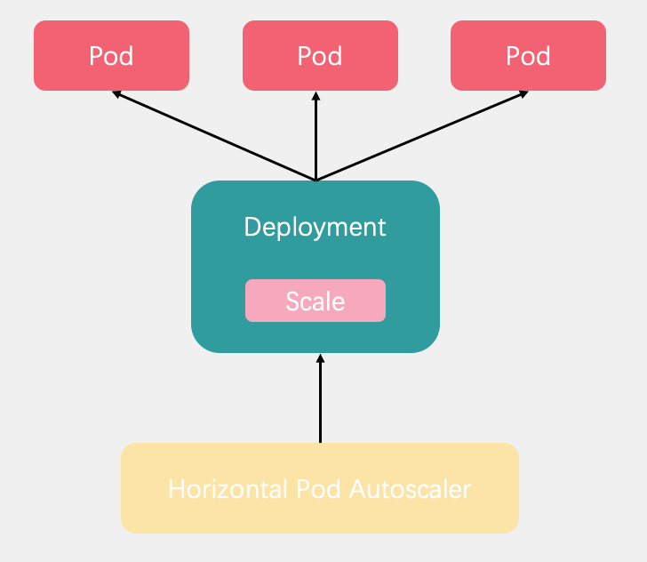

# 13.深入k8s：Pod 水平自动扩缩HPA及其源码分析


> 转载请声明出处哦~，本篇文章发布于luozhiyun的博客：https://www.luozhiyun.com
>
> 源码版本是[1.19](https://github.com/kubernetes/kubernetes/tree/release-1.19)

## Pod 水平自动扩缩

### Pod 水平自动扩缩工作原理

Pod 水平自动扩缩全名是Horizontal Pod Autoscaler简称HPA。它可以基于 CPU 利用率或其他指标自动扩缩 ReplicationController、Deployment 和 ReplicaSet 中的 Pod 数量。



Pod 水平自动扩缩器由--horizontal-pod-autoscaler-sync-period 参数指定周期（默认值为 15 秒）。每个周期内，控制器管理器根据每个 HorizontalPodAutoscaler 定义中指定的指标查询资源利用率。

Pod 水平自动扩缩控制器跟据当前指标和期望指标来计算扩缩比例，公式为：

```
desiredReplicas = ceil[currentReplicas * ( currentMetricValue / desiredMetricValue )]
```

currentReplicas表示当前度量值，desiredMetricValue表示期望度量值，desiredReplicas表示期望副本数。例如，当前度量值为 200m，目标设定值为 100m，那么由于 200.0/100.0 == 2.0， 副本数量将会翻倍。 如果当前指标为 50m，副本数量将会减半，因为50.0/100.0 == 0.5。 

我们可以通过使用kubectl来创建HPA。如通过 kubectl create 命令创建一个 HPA 对象， 通过 kubectl get hpa 命令来获取所有 HPA 对象， 通过 kubectl describe hpa 命令来查看 HPA 对象的详细信息。 最后，可以使用 kubectl delete hpa 命令删除对象。

也可以通过kubectl autoscale来创建 HPA 对象。 例如，命令 kubectl autoscale rs foo --min=2 --max=5 --cpu-percent=80 将会为名 为 foo 的 ReplicationSet 创建一个 HPA 对象， 目标 CPU 使用率为 80%，副本数量配置为 2 到 5 之间。

如果指标变化太频繁，我们也可以使用`--horizontal-pod-autoscaler-downscale-stabilization`指令设置扩缩容延迟时间，表示的是自从上次缩容执行结束后，多久可以再次执行缩容，默认是5m。

### Pod 水平自动扩缩示例

编写用于测试的Deployment：

```yaml
apiVersion: apps/v1 
kind: Deployment
metadata:
  name: hpatest
spec:
  replicas: 1
  selector:
    matchLabels:
      app: hpatest     
  template: 
    metadata:
      labels:
        app: hpatest
    spec:
      containers:
      - name: hpatest
        image: nginx
        imagePullPolicy: IfNotPresent
        command: ["/bin/sh"]
        args: ["-c","/usr/sbin/nginx; while true;do echo `hostname -I` > /usr/share/nginx/html/index.html; sleep 120;done"]
        ports: 
        - containerPort: 80
        resources:
          requests:
            cpu: 1m
            memory: 100Mi
          limits:
            cpu: 3m
            memory: 400Mi  
---
apiVersion: v1
kind: Service
metadata:
  name: hpatest-svc
spec:
  selector:
    app: hpatest
  ports:
  - port: 80
    targetPort: 80
    protocol: TCP
```

编写HPA，用于水平扩展，当cpu达到50%的利用率的时候开始扩展：

```yaml
apiVersion: autoscaling/v1
kind: HorizontalPodAutoscaler
metadata:
  name: haptest-nginx
spec:
  scaleTargetRef:
    apiVersion: apps/v1
    kind: Deployment
    name: hpatest
  minReplicas: 2
  maxReplicas: 6
  targetCPUUtilizationPercentage: 50
```

写一个简单的压测脚本：

```sh
[root@localhost HPA]# vim hpatest.sh
while true
do
    wget -q -O- http://10.68.50.65
done
```

观察一下hpa的TARGETS情况：

```sh
[root@localhost ~]# kubectl get hpa -w
NAME      REFERENCE            TARGETS   MINPODS   MAXPODS   REPLICAS   AGE
hpatest   Deployment/hpatest   0%/50%    1         5         1          5m47s
hpatest   Deployment/hpatest   400%/50%   1         5         1          5m49s
hpatest   Deployment/hpatest   400%/50%   1         5         4          6m4s
hpatest   Deployment/hpatest   400%/50%   1         5         5          6m19s
hpatest   Deployment/hpatest   500%/50%   1         5         5          6m49s
```

观察是否会自动扩容：

```sh
[root@localhost ~]# kubectl get pods -o wide -w
 
NAME                      READY   STATUS    RESTARTS   AGE    IP             NODE             NOMINATED NODE   READINESS GATES
hpatest-bbb44c476-jv8zr   0/1     ContainerCreating   0          0s     <none>         192.168.13.130   <none>           <none>
hpatest-bbb44c476-sk6qb   0/1     ContainerCreating   0          0s     <none>         192.168.13.130   <none>           <none>
hpatest-bbb44c476-7s5qn   0/1     ContainerCreating   0          0s     <none>         192.168.13.130   <none>           <none>
hpatest-bbb44c476-7s5qn   1/1     Running             0          6s     172.20.0.23    192.168.13.130   <none>           <none>
hpatest-bbb44c476-sk6qb   1/1     Running             0          6s     172.20.0.22    192.168.13.130   <none>           <none>
hpatest-bbb44c476-jv8zr   1/1     Running             0          6s     172.20.0.21    192.168.13.130   <none>           <none>
hpatest-bbb44c476-dstnf   0/1     Pending             0          0s     <none>         <none>           <none>           <none>
hpatest-bbb44c476-dstnf   0/1     Pending             0          0s     <none>         192.168.13.130   <none>           <none>
hpatest-bbb44c476-dstnf   0/1     ContainerCreating   0          0s     <none>         192.168.13.130   <none>           <none>
hpatest-bbb44c476-dstnf   1/1     Running             0          6s     172.20.0.24    192.168.13.130   <none>           <none>
```

停止压测之后，HPA开始自动缩容：

```sh
[root@localhost HPA]# kubectl get pod -w
hpatest-bbb44c476-dstnf   0/1     Terminating         0          9m52s
hpatest-bbb44c476-jv8zr   0/1     Terminating         0          10m
hpatest-bbb44c476-7s5qn   0/1     Terminating         0          10m
hpatest-bbb44c476-sk6qb   0/1     Terminating         0          10m
hpatest-bbb44c476-sk6qb   0/1     Terminating         0          10m
hpatest-bbb44c476-dstnf   0/1     Terminating         0          10m
hpatest-bbb44c476-dstnf   0/1     Terminating         0          10m
hpatest-bbb44c476-7s5qn   0/1     Terminating         0          10m
hpatest-bbb44c476-7s5qn   0/1     Terminating         0          10m
hpatest-bbb44c476-jv8zr   0/1     Terminating         0          10m
hpatest-bbb44c476-jv8zr   0/1     Terminating         0          10m
```

## 源码分析

### 初始化

文件位置:cmd/kube-controller-manager/app/controllermanager.go

```go
func NewControllerInitializers(loopMode ControllerLoopMode) map[string]InitFunc {
	...
	controllers["horizontalpodautoscaling"] = startHPAController
	...
}
```

HPA Controller和其他的Controller一样，都在NewControllerInitializers方法中进行注册，然后通过startHPAController来启动。


#### startHPAController

文件位置：cmd/kube-controller-manager/app/autoscaling.go

```go
func startHPAController(ctx ControllerContext) (http.Handler, bool, error) {
	...
	return startHPAControllerWithLegacyClient(ctx)
}

func startHPAControllerWithLegacyClient(ctx ControllerContext) (http.Handler, bool, error) {
	hpaClient := ctx.ClientBuilder.ClientOrDie("horizontal-pod-autoscaler")
	metricsClient := metrics.NewHeapsterMetricsClient(
		hpaClient,
		metrics.DefaultHeapsterNamespace,
		metrics.DefaultHeapsterScheme,
		metrics.DefaultHeapsterService,
		metrics.DefaultHeapsterPort,
	)
	return startHPAControllerWithMetricsClient(ctx, metricsClient)
}


func startHPAControllerWithMetricsClient(ctx ControllerContext, metricsClient metrics.MetricsClient) (http.Handler, bool, error) {
	hpaClient := ctx.ClientBuilder.ClientOrDie("horizontal-pod-autoscaler")
	hpaClientConfig := ctx.ClientBuilder.ConfigOrDie("horizontal-pod-autoscaler")
 
	scaleKindResolver := scale.NewDiscoveryScaleKindResolver(hpaClient.Discovery())
	scaleClient, err := scale.NewForConfig(hpaClientConfig, ctx.RESTMapper, dynamic.LegacyAPIPathResolverFunc, scaleKindResolver)
	if err != nil {
		return nil, false, err
	}
	// 初始化
	go podautoscaler.NewHorizontalController(
		hpaClient.CoreV1(),
		scaleClient,
		hpaClient.AutoscalingV1(),
		ctx.RESTMapper,
		metricsClient,
		ctx.InformerFactory.Autoscaling().V1().HorizontalPodAutoscalers(),
		ctx.InformerFactory.Core().V1().Pods(),
		ctx.ComponentConfig.HPAController.HorizontalPodAutoscalerSyncPeriod.Duration,
		ctx.ComponentConfig.HPAController.HorizontalPodAutoscalerDownscaleStabilizationWindow.Duration,
		ctx.ComponentConfig.HPAController.HorizontalPodAutoscalerTolerance,
		ctx.ComponentConfig.HPAController.HorizontalPodAutoscalerCPUInitializationPeriod.Duration,
		ctx.ComponentConfig.HPAController.HorizontalPodAutoscalerInitialReadinessDelay.Duration,
	).Run(ctx.Stop)
	return nil, true, nil
}
```

最后会调用到startHPAControllerWithMetricsClient方法，启动一个线程来调用NewHorizontalController方法初始化一个HPA Controller，然后执行Run方法。

#### Run

文件位置：pkg/controller/podautoscaler/horizontal.go

```go
func (a *HorizontalController) Run(stopCh <-chan struct{}) {
	defer utilruntime.HandleCrash()
	defer a.queue.ShutDown()

	klog.Infof("Starting HPA controller")
	defer klog.Infof("Shutting down HPA controller")

	if !cache.WaitForNamedCacheSync("HPA", stopCh, a.hpaListerSynced, a.podListerSynced) {
		return
	}
  // 启动异步线程，每秒执行一次
	go wait.Until(a.worker, time.Second, stopCh)

	<-stopCh
}
```

这里会调用worker执行具体的扩缩容的逻辑。


### 核心代码分析

worker里面一路执行下来会走到reconcileAutoscaler方法里面，这里是HPA的核心。下面我们专注看看这部分。

#### reconcileAutoscaler：计算副本数

```go
func (a *HorizontalController) reconcileAutoscaler(hpav1Shared *autoscalingv1.HorizontalPodAutoscaler, key string) error {
	...
    //副本数为0，不启动自动扩缩容
	if scale.Spec.Replicas == 0 && minReplicas != 0 {
		// Autoscaling is disabled for this resource
		desiredReplicas = 0
		rescale = false
		setCondition(hpa, autoscalingv2.ScalingActive, v1.ConditionFalse, "ScalingDisabled", "scaling is disabled since the replica count of the target is zero")
	//	如果当前副本数大于最大期望副本数，那么设置期望副本数为最大副本数
	} else if currentReplicas > hpa.Spec.MaxReplicas {
		rescaleReason = "Current number of replicas above Spec.MaxReplicas"
		desiredReplicas = hpa.Spec.MaxReplicas
	//	同上
	} else if currentReplicas < minReplicas {
		rescaleReason = "Current number of replicas below Spec.MinReplicas"
		desiredReplicas = minReplicas
	} else {
		var metricTimestamp time.Time
		//计算需要扩缩容的数量
		metricDesiredReplicas, metricName, metricStatuses, metricTimestamp, err = a.computeReplicasForMetrics(hpa, scale, hpa.Spec.Metrics)
		if err != nil {
			...
		}

		klog.V(4).Infof("proposing %v desired replicas (based on %s from %s) for %s", metricDesiredReplicas, metricName, metricTimestamp, reference)

		rescaleMetric := ""
		if metricDesiredReplicas > desiredReplicas {
			desiredReplicas = metricDesiredReplicas
			rescaleMetric = metricName
		}
		if desiredReplicas > currentReplicas {
			rescaleReason = fmt.Sprintf("%s above target", rescaleMetric)
		}
		if desiredReplicas < currentReplicas {
			rescaleReason = "All metrics below target"
		}
		//从1.18开始支持behavior字段
		//可以在扩缩容的时候指定一个稳定窗口，以防止缩放目标中的副本数量出现波动
		//doc：https://kubernetes.io/docs/tasks/run-application/horizontal-pod-autoscale/#support-for-configurable-scaling-behavior
		if hpa.Spec.Behavior == nil {
			desiredReplicas = a.normalizeDesiredReplicas(hpa, key, currentReplicas, desiredReplicas, minReplicas)
		} else {
			desiredReplicas = a.normalizeDesiredReplicasWithBehaviors(hpa, key, currentReplicas, desiredReplicas, minReplicas)
		}
		rescale = desiredReplicas != currentReplicas
	}
    ...
}
```

这一段代码是reconcileAutoscaler里面的核心代码，在这里会确定一个区间，首先根据当前的scale对象和当前hpa里面配置的对应的参数的值，决策当前的副本数量，其中针对于超过设定的maxReplicas和小于minReplicas两种情况，只需要简单的修正为对应的值，直接更新对应的scale对象即可，而scale副本为0的对象，则hpa不会在进行任何操作。

对于当前副本数在maxReplicas和minReplicas之间的时候，则需要计算是否需要扩缩容，计算则是调用computeReplicasForMetrics方法来实现。

最后如果设置了Behavior则调用normalizeDesiredReplicasWithBehaviors函数来修正最后的结果，Behavior相关可以看文档：https://kubernetes.io/docs/tasks/run-application/horizontal-pod-autoscale/#support-for-configurable-scaling-behavior。

下面我们一步步分析。

#### computeReplicasForMetrics：遍历度量目标

```go
func (a *HorizontalController) computeReplicasForMetrics(hpa *autoscalingv2.HorizontalPodAutoscaler, scale *autoscalingv1.Scale,
	metricSpecs []autoscalingv2.MetricSpec) (replicas int32, metric string, statuses []autoscalingv2.MetricStatus, timestamp time.Time, err error) {
	...
	//这里的度量目标可以是一个列表，所以遍历之后取最大的需要扩缩容的数量
	for i, metricSpec := range metricSpecs {
		//根据type类型计算需要扩缩容的数量
		replicaCountProposal, metricNameProposal, timestampProposal, condition, err := a.computeReplicasForMetric(hpa, metricSpec, specReplicas, statusReplicas, selector, &statuses[i])

		if err != nil {
			if invalidMetricsCount <= 0 {
				invalidMetricCondition = condition
				invalidMetricError = err
			}
			invalidMetricsCount++
		}
		//记录最大的需要扩缩容的数量
		if err == nil && (replicas == 0 || replicaCountProposal > replicas) {
			timestamp = timestampProposal
			replicas = replicaCountProposal
			metric = metricNameProposal
		}
	}
    ...
    return replicas, metric, statuses, timestamp, nil
}
```

因为我们在设置metrics的时候实际上是一个数组，如下：

```yaml
apiVersion: autoscaling/v2beta2
kind: HorizontalPodAutoscaler
metadata:
  name: php-apache
spec:
  scaleTargetRef:
    apiVersion: apps/v1
    kind: Deployment
    name: php-apache
  minReplicas: 1
  maxReplicas: 10
  metrics:
  - type: Resource
    resource:
      name: cpu
      target:
        type: Utilization
        averageUtilization: 50
  - type: Pods
    pods:
      metric:
        name: packets-per-second
      target:
        type: AverageValue
        averageValue: 1k
  - type: Object
    object:
      metric:
        name: requests-per-second
      describedObject:
        apiVersion: networking.k8s.io/v1beta1
        kind: Ingress
        name: main-route
      target:
        type: Value
        value: 10k
```

例如这个官方的例子中，设置了三个metric，所以我们在上面的代码中遍历所有的metrics，然后选取返回副本数最大的那个。主要计算逻辑都在computeReplicasForMetric中，下面我们看看这个方法。


#### computeReplicasForMetric：根据type计算副本数

```go
func (a *HorizontalController) computeReplicasForMetric(hpa *autoscalingv2.HorizontalPodAutoscaler, spec autoscalingv2.MetricSpec,
	specReplicas, statusReplicas int32, selector labels.Selector, status *autoscalingv2.MetricStatus) (replicaCountProposal int32, metricNameProposal string,
	timestampProposal time.Time, condition autoscalingv2.HorizontalPodAutoscalerCondition, err error) {
	//根据不同的类型来进行计量
	switch spec.Type {
	//表示如果是一个k8s对象，如Ingress对象
	case autoscalingv2.ObjectMetricSourceType:
		...
	//	表示pod度量类型
	case autoscalingv2.PodsMetricSourceType:
		metricSelector, err := metav1.LabelSelectorAsSelector(spec.Pods.Metric.Selector)
		if err != nil {
			condition := a.getUnableComputeReplicaCountCondition(hpa, "FailedGetPodsMetric", err)
			return 0, "", time.Time{}, condition, fmt.Errorf("failed to get pods metric value: %v", err)
		}
		//仅支持AverageValue度量目标,计算需要扩缩容的数量
		replicaCountProposal, timestampProposal, metricNameProposal, condition, err = a.computeStatusForPodsMetric(specReplicas, spec, hpa, selector, status, metricSelector)
		if err != nil {
			return 0, "", time.Time{}, condition, fmt.Errorf("failed to get pods metric value: %v", err)
		}
	//	表示Resource度量类型
	case autoscalingv2.ResourceMetricSourceType:
		...
	case autoscalingv2.ExternalMetricSourceType:
		...
	default:
		errMsg := fmt.Sprintf("unknown metric source type %q", string(spec.Type))
		err = fmt.Errorf(errMsg)
		condition := a.getUnableComputeReplicaCountCondition(hpa, "InvalidMetricSourceType", err)
		return 0, "", time.Time{}, condition, err
	}
	return replicaCountProposal, metricNameProposal, timestampProposal, autoscalingv2.HorizontalPodAutoscalerCondition{}, nil
}
```

这里会根据不同的度量类型来进行统计，目前度量类型有四种，分别是Pods、Object、Resource、External，解释如下：

```go
const (
	// ObjectMetricSourceType is a metric describing a kubernetes object
	// (for example, hits-per-second on an Ingress object).
	// 这种度量专门用来描述k8s的内置对象
	ObjectMetricSourceType MetricSourceType = "Object"
	// PodsMetricSourceType is a metric describing each pod in the current scale
	// target (for example, transactions-processed-per-second).  The values
	// will be averaged together before being compared to the target value.
	// 这种度量描述在目前被统计的每个pod平均期望值
	PodsMetricSourceType MetricSourceType = "Pods"
	// ResourceMetricSourceType is a resource metric known to Kubernetes, as
	// specified in requests and limits, describing each pod in the current
	// scale target (e.g. CPU or memory).  Such metrics are built in to
	// Kubernetes, and have special scaling options on top of those available
	// to normal per-pod metrics (the "pods" source).
	// Resource描述的是每个pod中资源，如CPU或内存
	ResourceMetricSourceType MetricSourceType = "Resource"
	// ExternalMetricSourceType is a global metric that is not associated
	// with any Kubernetes object. It allows autoscaling based on information
	// coming from components running outside of cluster
	// (for example length of queue in cloud messaging service, or
	// QPS from loadbalancer running outside of cluster).
	// External类型表示的是一种全局的度量，和k8s对象无关，主要依赖外部集群提供信息
	ExternalMetricSourceType MetricSourceType = "External"
)
```

我们这里不会全部都介绍，挑选pod度量类型作为例子。pod这个分支会调用computeStatusForPodsMetric方法来计算需要扩缩容的数量。

#### computeStatusForPodsMetric&GetMetricReplicas：计算需要扩缩容的数量 

文件位置：pkg/controller/podautoscaler/replica_calculator.go

```go
func (a *HorizontalController) computeStatusForPodsMetric(currentReplicas int32, metricSpec autoscalingv2.MetricSpec, hpa *autoscalingv2.HorizontalPodAutoscaler, selector labels.Selector, status *autoscalingv2.MetricStatus, metricSelector labels.Selector) (replicaCountProposal int32, timestampProposal time.Time, metricNameProposal string, condition autoscalingv2.HorizontalPodAutoscalerCondition, err error) {
	//计算需要扩缩容的数量
	replicaCountProposal, utilizationProposal, timestampProposal, err := a.replicaCalc.GetMetricReplicas(currentReplicas, metricSpec.Pods.Target.AverageValue.MilliValue(), metricSpec.Pods.Metric.Name, hpa.Namespace, selector, metricSelector)
	if err != nil {
		condition = a.getUnableComputeReplicaCountCondition(hpa, "FailedGetPodsMetric", err)
		return 0, timestampProposal, "", condition, err
	}
	...
	return replicaCountProposal, timestampProposal, fmt.Sprintf("pods metric %s", metricSpec.Pods.Metric.Name), autoscalingv2.HorizontalPodAutoscalerCondition{}, nil
}

func (c *ReplicaCalculator) GetMetricReplicas(currentReplicas int32, targetUtilization int64, metricName string, namespace string, selector labels.Selector, metricSelector labels.Selector) (replicaCount int32, utilization int64, timestamp time.Time, err error) {
	//获取pod中度量数据
	metrics, timestamp, err := c.metricsClient.GetRawMetric(metricName, namespace, selector, metricSelector)
	if err != nil {
		return 0, 0, time.Time{}, fmt.Errorf("unable to get metric %s: %v", metricName, err)
	}
	//通过结合度量数据来计算希望扩缩容的数量是多少
	replicaCount, utilization, err = c.calcPlainMetricReplicas(metrics, currentReplicas, targetUtilization, namespace, selector, v1.ResourceName(""))
	return replicaCount, utilization, timestamp, err
}
```

这里会调用GetRawMetric方法来获取pod对应的度量数据，然后再调用calcPlainMetricReplicas方法结合度量数据与目标期望来计算希望扩缩容的数量是多少。


#### calcPlainMetricReplicas：计算副本数具体实现

calcPlainMetricReplicas方法逻辑比较多，下面分开来讲解。

```go
func (c *ReplicaCalculator) calcPlainMetricReplicas(metrics metricsclient.PodMetricsInfo, currentReplicas int32, targetUtilization int64, namespace string, selector labels.Selector, resource v1.ResourceName) (replicaCount int32, utilization int64, err error) {

	podList, err := c.podLister.Pods(namespace).List(selector)
	...
	//将pod分成三类进行统计，得到ready的pod数量、ignored Pod集合、missing Pod集合
	readyPodCount, ignoredPods, missingPods := groupPods(podList, metrics, resource, c.cpuInitializationPeriod, c.delayOfInitialReadinessStatus)
	//在度量的数据里移除ignored Pods集合的数据
	removeMetricsForPods(metrics, ignoredPods)
	//计算pod中container request 设置的资源之和
	requests, err := calculatePodRequests(podList, resource)
	...
}
```

这里会调用groupPods将pod列表的进行一个分类统计。ignoredPods集合里面包含了pod状态为PodPending的数据；missingPods列表里面包含了在度量数据里面根据pod名找不到的数据。

因为missingPods的度量数据已经在metrics里是找不到的，然后只需要剔除掉ignored Pods集合中度量的资源就好了。

接下来调用calculatePodRequests方法统计pod中container request 设置的资源之和。

我们继续往下看：

```go
func (c *ReplicaCalculator) calcPlainMetricReplicas(metrics metricsclient.PodMetricsInfo, currentReplicas int32, targetUtilization int64, namespace string, selector labels.Selector, resource v1.ResourceName) (replicaCount int32, utilization int64, err error) {
	...
	//获取资源使用率
	usageRatio, utilization := metricsclient.GetMetricUtilizationRatio(metrics, targetUtilization)
	...
}
```

到这里会调用GetMetricUtilizationRatio方法计算资源使用率。 这个方法比较简单:

usageRatio=currentUtilization/targetUtilization;

currentUtilization = metrics值之和metricsTotal/metrics的长度；

继续往下：

```go
func (c *ReplicaCalculator) calcPlainMetricReplicas(metrics metricsclient.PodMetricsInfo, currentReplicas int32, targetUtilization int64, namespace string, selector labels.Selector, resource v1.ResourceName) (replicaCount int32, utilization int64, err error) {
	...
	rebalanceIgnored := len(ignoredPods) > 0 && usageRatio > 1.0

	if !rebalanceIgnored && len(missingPods) == 0 {
		if math.Abs(1.0-usageRatio) <= c.tolerance {
			// return the current replicas if the change would be too small
			return currentReplicas, utilization, nil
		} 
		//如果没有unready 或 missing 的pod，那么使用 usageRatio*readyPodCount计算需要扩缩容数量
		return int32(math.Ceil(usageRatio * float64(readyPodCount))), utilization, nil
	}

	if len(missingPods) > 0 {
		if usageRatio < 1.0 { 
			//如果是缩容，那么将missing pod使用率设置为目标资源使用率
			for podName := range missingPods {
				metrics[podName] = metricsclient.PodMetric{Value: targetUtilization}
			}
		} else { 
			//如果是扩容，那么将missing pod使用率设置为0
			for podName := range missingPods {
				metrics[podName] = metricsclient.PodMetric{Value: 0}
			}
		}
	}

	if rebalanceIgnored { 
		// 将unready pods使用率设置为0
		for podName := range ignoredPods {
			metrics[podName] = metricsclient.PodMetric{Value: 0}
		}
	}
	...
}
```

这里逻辑比较清晰，首先是判断如果missingPods和ignoredPods集合为空，那么检查一下是否在tolerance容忍度之内默认是0.1，如果在的话直接返回不进行扩缩容，否则返回usageRatio*readyPodCount表示需要扩缩容的容量；

如果missingPods集合不为空，那么需要判断一下是扩容还是缩容，相应调整metrics里面的值；

最后如果是扩容，还需要将ignoredPods集合的pod在metrics集合里设置为空。

接着看最后一部分：

```go
func (c *ReplicaCalculator) calcPlainMetricReplicas(metrics metricsclient.PodMetricsInfo, currentReplicas int32, targetUtilization int64, namespace string, selector labels.Selector, resource v1.ResourceName) (replicaCount int32, utilization int64, err error) {
	... 
	//重新计算资源利用率
	newUsageRatio, _ := metricsclient.GetMetricUtilizationRatio(metrics, targetUtilization)

	if math.Abs(1.0-newUsageRatio) <= c.tolerance || (usageRatio < 1.0 && newUsageRatio > 1.0) || (usageRatio > 1.0 && newUsageRatio < 1.0) {
		return currentReplicas, utilization, nil
	}
	return int32(math.Ceil(newUsageRatio * float64(len(metrics)))), utilization, nil
}
```

因为上面重新对missingPods列表和ignoredPods列表中的metrics值进行了重新设置，所以这里需要重新计算资源利用率。

如果变化在容忍度之内，或者usageRatio与newUsageRatio一个大于一个小于零表示两者伸缩方向不一致，那么直接返回。否则返回newUsageRatio* metrics的长度作为扩缩容的具体值。

介绍完了这一块我们再来看看整个逻辑流程图：


讲完了computeReplicasForMetrics方法，下面我们继续回到reconcileAutoscaler方法中往下看。

继续往下就到了检查是否设置了Behavior，如果没有设置那么走的是normalizeDesiredReplicas方法，这个方法较为简单，我们直接看看normalizeDesiredReplicasWithBehaviors方法做了什么，以及是怎么实现的。

#### normalizeDesiredReplicasWithBehaviors：Behavior限制

关于Behavior具体的例子可以到这里看：https://kubernetes.io/docs/tasks/run-application/horizontal-pod-autoscale/#default-behavior。

```go
func (a *HorizontalController) normalizeDesiredReplicasWithBehaviors(hpa *autoscalingv2.HorizontalPodAutoscaler, key string, currentReplicas, prenormalizedDesiredReplicas, minReplicas int32) int32 {
	//如果StabilizationWindowSeconds设置为空，那么给一个默认的值,默认300s
	a.maybeInitScaleDownStabilizationWindow(hpa)
	normalizationArg := NormalizationArg{
		Key:               key,
		ScaleUpBehavior:   hpa.Spec.Behavior.ScaleUp,
		ScaleDownBehavior: hpa.Spec.Behavior.ScaleDown,
		MinReplicas:       minReplicas,
		MaxReplicas:       hpa.Spec.MaxReplicas,
		CurrentReplicas:   currentReplicas,
		DesiredReplicas:   prenormalizedDesiredReplicas}
	//根据参数获取建议副本数
	stabilizedRecommendation, reason, message := a.stabilizeRecommendationWithBehaviors(normalizationArg)
	normalizationArg.DesiredReplicas = stabilizedRecommendation
	... 
	//根据scaleDown或scaleUp指定的参数做限制
	desiredReplicas, reason, message := a.convertDesiredReplicasWithBehaviorRate(normalizationArg)
	... 
	return desiredReplicas
}
```

这个方法主要分为两部分，一部分是调用stabilizeRecommendationWithBehaviors方法来根据时间窗口来获取一个建议副本数；另一部分convertDesiredReplicasWithBehaviorRate方法是根据scaleDown或scaleUp指定的参数做限制。


**stabilizeRecommendationWithBehaviors**

```go
func (a *HorizontalController) stabilizeRecommendationWithBehaviors(args NormalizationArg) (int32, string, string) {
	recommendation := args.DesiredReplicas
	foundOldSample := false
	oldSampleIndex := 0
	var scaleDelaySeconds int32
	var reason, message string

	var betterRecommendation func(int32, int32) int32

	// 如果期望的副本数大于等于当前的副本数,则延迟时间=scaleUpBehaviro的稳定窗口时间
	if args.DesiredReplicas >= args.CurrentReplicas {
		scaleDelaySeconds = *args.ScaleUpBehavior.StabilizationWindowSeconds
		betterRecommendation = min
		reason = "ScaleUpStabilized"
		message = "recent recommendations were lower than current one, applying the lowest recent recommendation"
	} else {
		// 期望副本数<当前的副本数
		scaleDelaySeconds = *args.ScaleDownBehavior.StabilizationWindowSeconds
		betterRecommendation = max
		reason = "ScaleDownStabilized"
		message = "recent recommendations were higher than current one, applying the highest recent recommendation"
	}
	//获取一个最大的时间窗口
	maxDelaySeconds := max(*args.ScaleUpBehavior.StabilizationWindowSeconds, *args.ScaleDownBehavior.StabilizationWindowSeconds)
	obsoleteCutoff := time.Now().Add(-time.Second * time.Duration(maxDelaySeconds))

	cutoff := time.Now().Add(-time.Second * time.Duration(scaleDelaySeconds))
	for i, rec := range a.recommendations[args.Key] {
		if rec.timestamp.After(cutoff) {
			// 在截止时间之后，则当前建议有效, 则根据之前的比较函数来决策最终的建议副本数
			recommendation = betterRecommendation(rec.recommendation, recommendation)
		}
		//如果被遍历到的建议时间是在obsoleteCutoff之前，那么需要重新设置建议
		if rec.timestamp.Before(obsoleteCutoff) {
			foundOldSample = true
			oldSampleIndex = i
		}
	}
	//如果被遍历到的建议时间是在obsoleteCutoff之前，那么需要重新设置建议
	if foundOldSample {
		a.recommendations[args.Key][oldSampleIndex] = timestampedRecommendation{args.DesiredReplicas, time.Now()}
	} else {
		a.recommendations[args.Key] = append(a.recommendations[args.Key], timestampedRecommendation{args.DesiredReplicas, time.Now()})
	}
	return recommendation, reason, message
}
```

这个方法首先会去校验当前是扩容还是缩容，如果是扩容，那么将scaleDelaySeconds设置为ScaleUpBehavior的时间，并将betterRecommendation方法设置为min；如果是缩容那么则相反。

然后会遍历建议，如果建议时间在窗口时间cutoff之后，那么需要调用betterRecommendation方法来获取建议值，然后将获取到的最终结果返回。


**convertDesiredReplicasWithBehaviorRate**

```go
func (a *HorizontalController) convertDesiredReplicasWithBehaviorRate(args NormalizationArg) (int32, string, string) {
	var possibleLimitingReason, possibleLimitingMessage string
	//如果期望副本数大于当前副本数
	if args.DesiredReplicas > args.CurrentReplicas {
		//获取预期扩容的pod数量
		scaleUpLimit := calculateScaleUpLimitWithScalingRules(args.CurrentReplicas, a.scaleUpEvents[args.Key], args.ScaleUpBehavior)
		if scaleUpLimit < args.CurrentReplicas {
			// We shouldn't scale up further until the scaleUpEvents will be cleaned up
			scaleUpLimit = args.CurrentReplicas
		}
		maximumAllowedReplicas := args.MaxReplicas
		if maximumAllowedReplicas > scaleUpLimit {
			maximumAllowedReplicas = scaleUpLimit
			possibleLimitingReason = "ScaleUpLimit"
			possibleLimitingMessage = "the desired replica count is increasing faster than the maximum scale rate"
		} else {
			possibleLimitingReason = "TooManyReplicas"
			possibleLimitingMessage = "the desired replica count is more than the maximum replica count"
		}
		if args.DesiredReplicas > maximumAllowedReplicas {
			return maximumAllowedReplicas, possibleLimitingReason, possibleLimitingMessage
		}
	} else if args.DesiredReplicas < args.CurrentReplicas {
		//获取预期缩容的pod数量
		scaleDownLimit := calculateScaleDownLimitWithBehaviors(args.CurrentReplicas, a.scaleDownEvents[args.Key], args.ScaleDownBehavior)
		if scaleDownLimit > args.CurrentReplicas {
			// We shouldn't scale down further until the scaleDownEvents will be cleaned up
			scaleDownLimit = args.CurrentReplicas
		}
		minimumAllowedReplicas := args.MinReplicas
		if minimumAllowedReplicas < scaleDownLimit {
			minimumAllowedReplicas = scaleDownLimit
			possibleLimitingReason = "ScaleDownLimit"
			possibleLimitingMessage = "the desired replica count is decreasing faster than the maximum scale rate"
		} else {
			possibleLimitingMessage = "the desired replica count is less than the minimum replica count"
			possibleLimitingReason = "TooFewReplicas"
		}
		if args.DesiredReplicas < minimumAllowedReplicas {
			return minimumAllowedReplicas, possibleLimitingReason, possibleLimitingMessage
		}
	}
	return args.DesiredReplicas, "DesiredWithinRange", "the desired count is within the acceptable range"
}
```

这个方法和上面的方法有些类似，不过是根据behavior具体行为来做一个约束。如果是scaleUp，那么需要调用calculateScaleUpLimitWithScalingRules来获取预期扩容的pod数量，calculateScaleUpLimitWithScalingRules方法里面会根据behavior设置的selectPolicy以及scaleUp.type参数来做一个计算，如下：

```go
func calculateScaleUpLimitWithScalingRules(currentReplicas int32, scaleEvents []timestampedScaleEvent, scalingRules *autoscalingv2.HPAScalingRules) int32 {
	var result int32
	var proposed int32
	var selectPolicyFn func(int32, int32) int32
	if *scalingRules.SelectPolicy == autoscalingv2.DisabledPolicySelect {
		return currentReplicas // Scaling is disabled
	} else if *scalingRules.SelectPolicy == autoscalingv2.MinPolicySelect {
		selectPolicyFn = min // For scaling up, the lowest change ('min' policy) produces a minimum value
	} else {
		selectPolicyFn = max // Use the default policy otherwise to produce a highest possible change
	}
	for _, policy := range scalingRules.Policies {
        //获取最近变更的副本数
		replicasAddedInCurrentPeriod := getReplicasChangePerPeriod(policy.PeriodSeconds, scaleEvents)
		periodStartReplicas := currentReplicas - replicasAddedInCurrentPeriod
		//根据不同的policy类型，决定不同的预期值
		if policy.Type == autoscalingv2.PodsScalingPolicy {
			proposed = int32(periodStartReplicas + policy.Value)
		} else if policy.Type == autoscalingv2.PercentScalingPolicy { 
			proposed = int32(math.Ceil(float64(periodStartReplicas) * (1 + float64(policy.Value)/100)))
		}
		result = selectPolicyFn(result, proposed)
	}
	return result
}

func getReplicasChangePerPeriod(periodSeconds int32, scaleEvents []timestampedScaleEvent) int32 {
	period := time.Second * time.Duration(periodSeconds)
	cutoff := time.Now().Add(-period)
	var replicas int32
	//遍历最近变更
	for _, rec := range scaleEvents {
		if rec.timestamp.After(cutoff) {
			// 更新副本修改的数量, 会有正负，最终replicas就是最近变更的数量
			replicas += rec.replicaChange
		}
	}
	return replicas
}
```

如果没有设置selectPolicy那么selectPolicyFn默认就是max方法，然后在遍历Policies的时候，如果type是pod，那么就加上一个具体值，如果是Percent，那么就加上一个百分比。

如果当前的副本数已经大于scaleUpLimit，那么则设置scaleUpLimit为当前副本数，如果期望副本数超过了最大允许副本数，那么直接返回，否则返回期望副本数就好了。

下面来一张图理一下逻辑：


## 总结

水平扩展大体逻辑可以用下面这两张图来进行一个概括，如果感兴趣的话，其中有很多细微的逻辑还是需要参照文档和代码一起理解起来才会更加的好。


## Reference

https://kubernetes.io/docs/tasks/run-application/horizontal-pod-autoscale/

https://kubernetes.io/docs/tasks/run-application/horizontal-pod-autoscale-walkthrough/

https://github.com/kubernetes/community/blob/master/contributors/design-proposals/instrumentation/custom-metrics-api.md 
