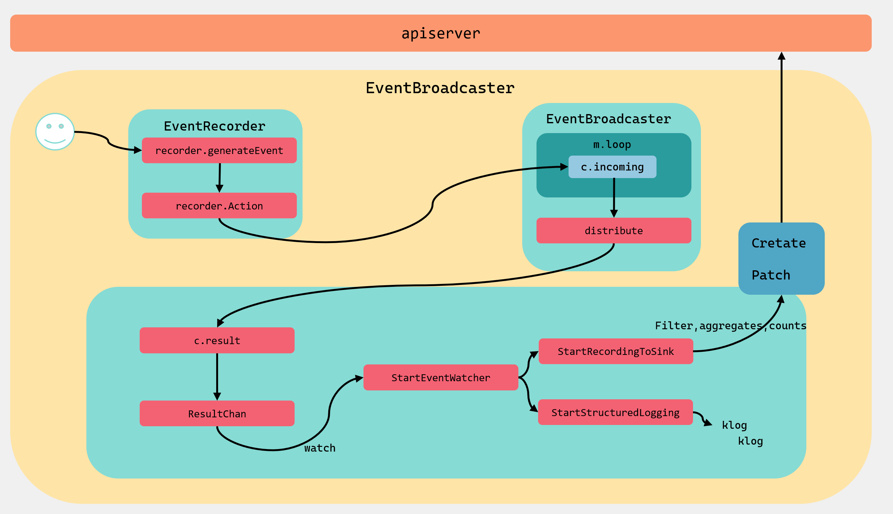
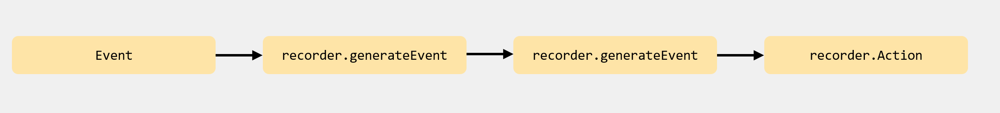
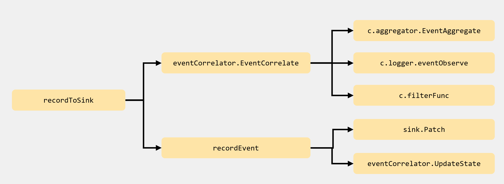

# 15.深入k8s：Event事件处理及其源码分析


> 转载请声明出处哦~，本篇文章发布于luozhiyun的博客：https://www.luozhiyun.com
>
> 源码版本是[1.19](https://github.com/kubernetes/kubernetes/tree/release-1.19)

## 概述

k8s的Event事件是一种资源对象，用于展示集群内发生的情况，k8s系统中的各个组件会将运行时发生的各种事件上报给apiserver 。可以通过kubectl get event 或 kubectl describe pod podName 命令显示事件，查看k8s集群中发生了哪些事件。

apiserver 会将Event事件存在etcd集群中，为避免磁盘空间被填满，故强制执行保留策略：在最后一次的事件发生后，删除1小时之前发生的事件。

如：

```
Events:
  Type    Reason     Age   From                     Message
  ----    ------     ----  ----                     -------
  Normal  Scheduled  19s   default-scheduler        Successfully assigned default/hpatest-bbb44c476-8d45v to 192.168.13.130
  Normal  Pulled     15s   kubelet, 192.168.13.130  Container image "nginx" already present on machine
  Normal  Created    15s   kubelet, 192.168.13.130  Created container hpatest
  Normal  Started    13s   kubelet, 192.168.13.130  Started container hpatest
```

当集群中的 node 或 pod 异常时，大部分用户会使用 kubectl 查看对应的 events，我们通过前面章节的代码分析可以看到这样的代码：

```go
recorder.Eventf(cj, v1.EventTypeWarning, "FailedNeedsStart", "Cannot determine if job needs to be started: %v", err)
```

通过查找也可以确认基本上与node 或 pod相关的模块都会涉及到事件，如：controller-manage、kube-proxy、kube-scheduler、kubelet 等。

Event事件管理机制主要有三部分组成：

* EventRecorder：是事件生成者，k8s组件通过调用它的方法来生成事件；
* EventBroadcaster：事件广播器，负责消费EventRecorder产生的事件，然后分发给broadcasterWatcher；
* broadcasterWatcher：用于定义事件的处理方式，如上报apiserver；

整个事件管理机制的流程大致如图：



下面我们以kubelet 中的Event事件来作为分析的例子进行讲解。

## 源码分析

kubelet 在初始化的时候会调用makeEventRecorder进行Event初始化。

**makeEventRecorder**

文件位置：cmd/kubelet/app/server.go

```go
func makeEventRecorder(kubeDeps *kubelet.Dependencies, nodeName types.NodeName) {
	if kubeDeps.Recorder != nil {
		return
	}
	// 初始化 EventBroadcaster
	eventBroadcaster := record.NewBroadcaster()
	// 初始化 EventRecorder
	kubeDeps.Recorder = eventBroadcaster.NewRecorder(legacyscheme.Scheme, v1.EventSource{Component: componentKubelet, Host: string(nodeName)})
	//记录Event到log
	eventBroadcaster.StartStructuredLogging(3)
	if kubeDeps.EventClient != nil {
		klog.V(4).Infof("Sending events to api server.")
		//上报Event到apiserver并存储至etcd集群
		eventBroadcaster.StartRecordingToSink(&v1core.EventSinkImpl{Interface: kubeDeps.EventClient.Events("")})
	} else {
		klog.Warning("No api server defined - no events will be sent to API server.")
	}
}
```

这个方法创建了一个EventBroadcaster，这是一个事件广播器，会消费EventRecorder记录的事件并通过StartStructuredLogging和StartRecordingToSink分别将event发送给log和apiserver；EventRecorder，用作事件记录器，k8s系统组件通过它记录关键性事件；

### EventRecorder记录事件

```go
type EventRecorder interface {  
	Event(object runtime.Object, eventtype, reason, message string) 
	Eventf(object runtime.Object, eventtype, reason, messageFmt string, args ...interface{}) 
	AnnotatedEventf(object runtime.Object, annotations map[string]string, eventtype, reason, messageFmt string, args ...interface{})
}
```

EventRecorder接口非常的简单，就3个方法。其中Event是可以用来记录刚发生的事件；Eventf通过使用fmt.Sprintf格式化输出事件的格式；AnnotatedEventf功能和Eventf一致，但是附加了注释字段。

我们记录事件的时候上面也提到了，一般如下记录：

```go
recorder.Eventf(cj, v1.EventTypeWarning, "FailedNeedsStart", "Cannot determine if job needs to be started: %v", err)
```

Eventf会调用到EventRecorder的实现类recorderImpl中去，最后调用到generateEvent方法中：

**Event**

文件位置：client-go/tools/record/event.go

```go
func (recorder *recorderImpl) Event(object runtime.Object, eventtype, reason, message string) {
	recorder.generateEvent(object, nil, metav1.Now(), eventtype, reason, message)
}

func (recorder *recorderImpl) Eventf(object runtime.Object, eventtype, reason, messageFmt string, args ...interface{}) {
	recorder.Event(object, eventtype, reason, fmt.Sprintf(messageFmt, args...))
}
```

**generateEvent**

```go
func (recorder *recorderImpl) generateEvent(object runtime.Object, annotations map[string]string, timestamp metav1.Time, eventtype, reason, message string) {
	...
	//实例化Event
	event := recorder.makeEvent(ref, annotations, eventtype, reason, message)
	event.Source = recorder.source
	//异步调用Action方法将事件写入到incoming中
	go func() {
		// NOTE: events should be a non-blocking operation
		defer utilruntime.HandleCrash()
		recorder.Action(watch.Added, event)
	}()
}
```

generateEvent方法会异步的调用Action方法，将事件写入到incoming中：

```go
func (m *Broadcaster) Action(action EventType, obj runtime.Object) {
	m.incoming <- Event{action, obj}
}
```

调用步骤如下：



### EventBroadcaster事件广播

EventBroadcaster初始化的时候会调用NewBroadcaster方法：

文件位置：client-go/tools/record/event.go

```go
func NewBroadcaster() EventBroadcaster {
	return &eventBroadcasterImpl{
		Broadcaster:   watch.NewBroadcaster(maxQueuedEvents, watch.DropIfChannelFull),
		sleepDuration: defaultSleepDuration,
	}
}
```

这里会创建一个eventBroadcasterImpl实例，并设置两个字段Broadcaster和sleepDuration。Broadcaster是这个方法的核心，我们下面接着看：

```go
func NewBroadcaster(queueLength int, fullChannelBehavior FullChannelBehavior) *Broadcaster {
	m := &Broadcaster{
		watchers:            map[int64]*broadcasterWatcher{},
		incoming:            make(chan Event, incomingQueueLength),
		watchQueueLength:    queueLength,
		fullChannelBehavior: fullChannelBehavior,
	}
	m.distributing.Add(1)
    //开启事件循环
	go m.loop()
	return m
}
```

在这里初始化Broadcaster的时候，会初始化一个broadcasterWatcher，用于定义事件处理方式，如上报apiserver等；初始化incoming，用于EventBroadcaster和EventRecorder进行事件传输。

**loop**

文件位置：k8s.io/apimachinery/pkg/watch/mux.go

```go
func (m *Broadcaster) loop() {
	//获取m.incoming管道中的数据
	for event := range m.incoming {
		if event.Type == internalRunFunctionMarker {
			event.Object.(functionFakeRuntimeObject)()
			continue
		}
        //进行事件分发
		m.distribute(event)
	}
	m.closeAll()
	m.distributing.Done()
}
```

这个方法会一直后台等待获取m.incoming管道中的数据，然后调用distribute方法进行事件分发给broadcasterWatcher。incoming管道中的数据是EventRecorder调用Event方法传入的。


**distribute**

```go
func (m *Broadcaster) distribute(event Event) {
	m.lock.Lock()
	defer m.lock.Unlock()
    //如果是非阻塞，那么使用DropIfChannelFull标识
	if m.fullChannelBehavior == DropIfChannelFull {
		for _, w := range m.watchers {
			select {
			case w.result <- event:
			case <-w.stopped:
			default: // Don't block if the event can't be queued.
			}
		}
	} else {
		for _, w := range m.watchers {
			select {
			case w.result <- event:
			case <-w.stopped:
			}
		}
	}
}
```

如果是非阻塞，那么使用DropIfChannelFull标识，在w.result管道满了之后，事件会丢失。如果没有default关键字，那么，当w.result管道满了之后，分发过程会阻塞并等待。

这里之所以需要丢失事件，是因为随着k8s集群越来越大，上报事件也随之增多，那么每次上报都要对etcd进行读写，这样会给etcd集群带来压力。但是事件丢失并不会影响集群的正常工作，所以非阻塞分发机制下事件会丢失。

### recordToSink事件的处理

调用StartRecordingToSink方法会将数据上报到apiserver。

**StartRecordingToSink**

```go
func (e *eventBroadcasterImpl) StartRecordingToSink(sink EventSink) watch.Interface {
	eventCorrelator := NewEventCorrelatorWithOptions(e.options)
	return e.StartEventWatcher(
		func(event *v1.Event) {
			recordToSink(sink, event, eventCorrelator, e.sleepDuration)
		})
}

func (e *eventBroadcasterImpl) StartEventWatcher(eventHandler func(*v1.Event)) watch.Interface {
	watcher := e.Watch()
	go func() {
		defer utilruntime.HandleCrash()
		for watchEvent := range watcher.ResultChan() {
			event, ok := watchEvent.Object.(*v1.Event)
			if !ok { 
				continue
			}
            //回调传入的方法
			eventHandler(event)
		}
	}()
	return watcher
}
```

StartRecordingToSink会调用StartEventWatcher，StartEventWatcher方法里面会异步的调用 watcher.ResultChan()方法获取到broadcasterWatcher的result管道，result管道里面的数据就是Broadcaster的distribute方法进行分发的。

最后会回调到传入的方法recordToSink中。

**recordToSink**

```go
func recordToSink(sink EventSink, event *v1.Event, eventCorrelator *EventCorrelator, sleepDuration time.Duration) {
	eventCopy := *event
	event = &eventCopy
	//对事件做预处理，聚合相同的事件
	result, err := eventCorrelator.EventCorrelate(event)
	if err != nil {
		utilruntime.HandleError(err)
	}
	if result.Skip {
		return
	}
	tries := 0
	for {
		// 把事件发送到 apiserver
		if recordEvent(sink, result.Event, result.Patch, result.Event.Count > 1, eventCorrelator) {
			break
		}
		tries++
		if tries >= maxTriesPerEvent {
			klog.Errorf("Unable to write event '%#v' (retry limit exceeded!)", event)
			break
		} 
		if tries == 1 {
			time.Sleep(time.Duration(float64(sleepDuration) * rand.Float64()))
		} else {
			time.Sleep(sleepDuration)
		}
	}
}
```

recordToSink方法首先会调用EventCorrelate方法对event做预处理，聚合相同的事件，避免产生的事件过多，增加 etcd 和 apiserver 的压力，如果传入的Event太多了，那么result.Skip 就会返回false；

接下来会调用recordEvent方法把事件发送到 apiserver，它会重试很多次（默认是 12 次），并且每次重试都有一定时间间隔（默认是 10 秒钟）。

下面我们分别来看看EventCorrelate方法和recordEvent方法。

**EventCorrelate**

文件位置：client-go/tools/record/events_cache.go

```go
func (c *EventCorrelator) EventCorrelate(newEvent *v1.Event) (*EventCorrelateResult, error) {
	if newEvent == nil {
		return nil, fmt.Errorf("event is nil")
	}
	aggregateEvent, ckey := c.aggregator.EventAggregate(newEvent)
	observedEvent, patch, err := c.logger.eventObserve(aggregateEvent, ckey)
	if c.filterFunc(observedEvent) {
		return &EventCorrelateResult{Skip: true}, nil
	}
	return &EventCorrelateResult{Event: observedEvent, Patch: patch}, err
}
```

EventCorrelate方法会调用EventAggregate、eventObserve进行聚合，调用filterFunc会调用到spamFilter.Filter方法进行过滤。

```go
func (e *EventAggregator) EventAggregate(newEvent *v1.Event) (*v1.Event, string) {
	now := metav1.NewTime(e.clock.Now())
	var record aggregateRecord 
	eventKey := getEventKey(newEvent) 
	aggregateKey, localKey := e.keyFunc(newEvent)
 
	e.Lock()
	defer e.Unlock()
	// 查找缓存里面是否也存在这样的记录
	value, found := e.cache.Get(aggregateKey)
	if found {
		record = value.(aggregateRecord)
	} 
	// maxIntervalInSeconds默认时间是600s，这里校验缓存里面的记录是否太老了
	// 如果是那么就创建一个新的
	// 如果record在缓存里面找不到，那么lastTimestamp是零，那么也创建一个新的
	maxInterval := time.Duration(e.maxIntervalInSeconds) * time.Second
	interval := now.Time.Sub(record.lastTimestamp.Time)
	if interval > maxInterval {
		record = aggregateRecord{localKeys: sets.NewString()}
	} 
	record.localKeys.Insert(localKey)
	record.lastTimestamp = now
	// 重新加入到LRU缓存中
	e.cache.Add(aggregateKey, record)
 
	// 如果没有达到阈值，那么不进行聚合
	if uint(record.localKeys.Len()) < e.maxEvents {
		return newEvent, eventKey
	}
 
	record.localKeys.PopAny()
 
	eventCopy := &v1.Event{
		ObjectMeta: metav1.ObjectMeta{
			Name:      fmt.Sprintf("%v.%x", newEvent.InvolvedObject.Name, now.UnixNano()),
			Namespace: newEvent.Namespace,
		},
		Count:          1,
		FirstTimestamp: now,
		InvolvedObject: newEvent.InvolvedObject,
		LastTimestamp:  now,
		// 将Message进行聚合
		Message:        e.messageFunc(newEvent),
		Type:           newEvent.Type,
		Reason:         newEvent.Reason,
		Source:         newEvent.Source,
	}
	return eventCopy, aggregateKey
}
```

EventAggregate方法也考虑了很多，首先是去缓存里面查找有没有相同的聚合记录aggregateRecord，如果没有的话，那么会在校验时间间隔的时候顺便创建聚合记录aggregateRecord；

由于缓存时lru缓存，所以再将聚合记录重新Add到缓存的头部；

接下来会判断缓存是否已经超过了阈值，如果没有达到阈值，那么直接返回不进行聚合；

如果达到阈值了，那么会重新copy传入的Event，并调用messageFunc方法聚合Message；

**eventObserve**

```go
func (e *eventLogger) eventObserve(newEvent *v1.Event, key string) (*v1.Event, []byte, error) {
	var (
		patch []byte
		err   error
	)
	eventCopy := *newEvent
	event := &eventCopy

	e.Lock()
	defer e.Unlock()
	// 检查是否在缓存中
	lastObservation := e.lastEventObservationFromCache(key) 
	// 如果大于0说明存在，并且对Count进行自增
	if lastObservation.count > 0 { 
		event.Name = lastObservation.name
		event.ResourceVersion = lastObservation.resourceVersion
		event.FirstTimestamp = lastObservation.firstTimestamp
		event.Count = int32(lastObservation.count) + 1

		eventCopy2 := *event
		eventCopy2.Count = 0
		eventCopy2.LastTimestamp = metav1.NewTime(time.Unix(0, 0))
		eventCopy2.Message = ""

		newData, _ := json.Marshal(event)
		oldData, _ := json.Marshal(eventCopy2)
		patch, err = strategicpatch.CreateTwoWayMergePatch(oldData, newData, event)
	}

	// 最后重新更新缓存记录
	e.cache.Add(
		key,
		eventLog{
			count:           uint(event.Count),
			firstTimestamp:  event.FirstTimestamp,
			name:            event.Name,
			resourceVersion: event.ResourceVersion,
		},
	)
	return event, patch, err
}
```

eventObserve方法里面会去查找缓存中的记录，然后对count进行自增后更新到缓存中。

**Filter**

文件位置：client-go/tools/record/events_cache.go

```go
func (f *EventSourceObjectSpamFilter) Filter(event *v1.Event) bool {
	var record spamRecord 
	eventKey := getSpamKey(event)
 
	f.Lock()
	defer f.Unlock()
	value, found := f.cache.Get(eventKey)
	if found {
		record = value.(spamRecord)
	}
 
	if record.rateLimiter == nil {
		record.rateLimiter = flowcontrol.NewTokenBucketRateLimiterWithClock(f.qps, f.burst, f.clock)
	}
	// 使用令牌桶进行过滤
	filter := !record.rateLimiter.TryAccept()

	// update the cache
	f.cache.Add(eventKey, record)

	return filter
}
```

Filter主要时起到了一个限速的作用，通过令牌桶来进行过滤操作。

**recordEvent**

文件位置：client-go/tools/record/event.go

```go
func recordEvent(sink EventSink, event *v1.Event, patch []byte, updateExistingEvent bool, eventCorrelator *EventCorrelator) bool {
	var newEvent *v1.Event
	var err error
	// 更新已经存在的事件
	if updateExistingEvent {
		newEvent, err = sink.Patch(event, patch)
	}
	// 创建一个新的事件
	if !updateExistingEvent || (updateExistingEvent && util.IsKeyNotFoundError(err)) {
		event.ResourceVersion = ""
		newEvent, err = sink.Create(event)
	}
	if err == nil {
		eventCorrelator.UpdateState(newEvent)
		return true
	}
	// 如果是已知错误，就不要再重试了；否则，返回 false，让上层进行重试
	switch err.(type) {
	case *restclient.RequestConstructionError:
		klog.Errorf("Unable to construct event '%#v': '%v' (will not retry!)", event, err)
		return true
	case *errors.StatusError:
		if errors.IsAlreadyExists(err) {
			klog.V(5).Infof("Server rejected event '%#v': '%v' (will not retry!)", event, err)
		} else {
			klog.Errorf("Server rejected event '%#v': '%v' (will not retry!)", event, err)
		}
		return true
	case *errors.UnexpectedObjectError: 
	default:
	}
	klog.Errorf("Unable to write event: '%v' (may retry after sleeping)", err)
	return false
}
```

recordEvent方法会根据eventCorrelator返回的结果来决定是新建一个事件还是更新已经存在的事件，并根据请求的结果决定是否需要重试。

整个recordToSink调用比较绕，这里我把图画一下：



到这里整个方法算时讲解完毕了。

## 总结

了解完 events 的整个处理流程后，再梳理一下整个流程：

1. 首先是初始化 EventBroadcaster 对象，同时会初始化一个 Broadcaster 对象，并开启一个loop循环接收所有的 events 并进行广播；
2. 然后通过 EventBroadcaster 对象的 NewRecorder() 方法初始化 EventRecorder 对象，EventRecorder 对象会生成 events 并通过 Action() 方法发送 events 到 Broadcaster 的 channel 队列中；
3. EventBroadcaster 会调用StartStructuredLogging、StartRecordingToSink方法调用封装好的StartEventWatcher方法，并执行自己的逻辑；
4. StartRecordingToSink封装的StartEventWatcher方法里面会将所有的 events 广播给每一个 watcher，并调用recordToSink方法对收到 events 后会进行缓存、过滤、聚合而后发送到 apiserver，apiserver 会将 events 保存到 etcd 中。

## Reference

https://www.bluematador.com/blog/kubernetes-events-explained

https://kubernetes.io/docs/tasks/debug-application-cluster/debug-application-introspection/