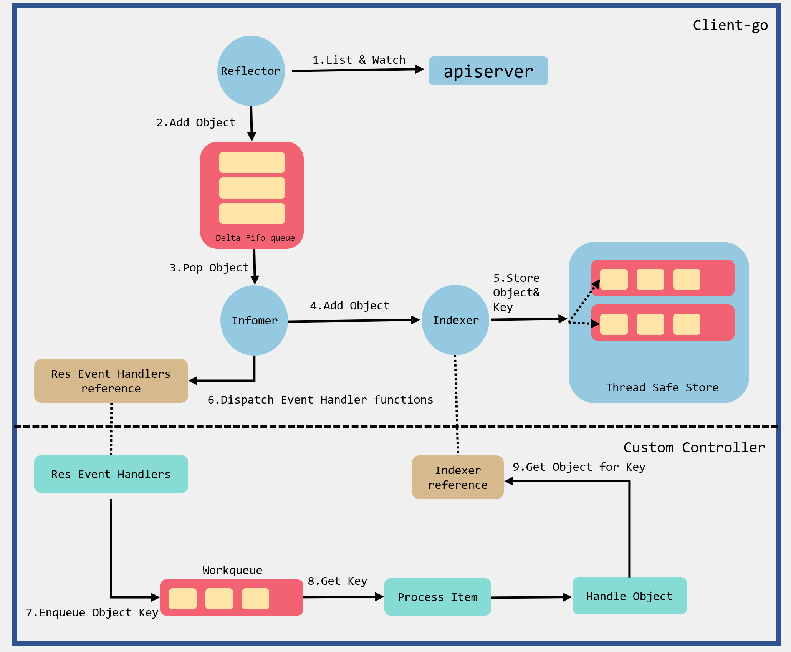
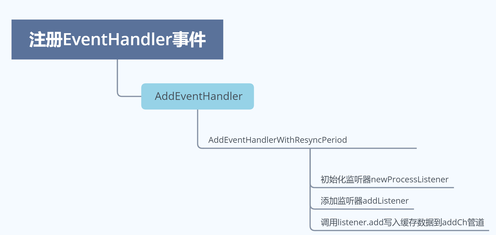

# 16.深入k8s：Informer使用及其源码分析


> 转载请声明出处哦~，本篇文章发布于luozhiyun的博客：https://www.luozhiyun.com
>
> 由于这部分的代码是在client-go 中，所以使用的源码版本是client-go 1.19

## Informer机制

### 机制设计

Informer主要有两个作用：

1. 通过一种叫作 ListAndWatch 的方法，把 APIServer 中的 API 对象缓存在了本地，并负责更新和维护这个缓存。ListAndWatch通过 APIServer 的 LIST API“获取”所有最新版本的 API 对象；然后，再通过 WATCH API 来“监听”所有这些 API 对象的变化；
2. 注册相应的事件，之后如果监听到的事件变化就会调用事件对应的EventHandler，实现回调。


Informer运行原理如下：



根据流程图来解释一下Informer中几个组件的作用：

* Reflector：用于监控指定的k8s资源，当资源发生变化时，触发相应的变更事件，如Added事件、Updated事件、Deleted事件，并将器资源对象放到本地DeltaFIFO Queue中；
* DeltaFIFO：DeltaFIFO是一个先进先出的队列，可以保存资源对象的操作类型；
* Indexer：用来存储资源对象并自带索引功能的本地存储，Reflector从DeltaFIFO中将消费出来的资源对象存储至Indexer；

Reflector 包会和 apiServer 建立长连接，并使用 ListAndWatch 方法获取并监听某一个资源的变化。List 方法将会获取某个资源的所有实例，Watch 方法则监听资源对象的创建、更新以及删除事件，然后将事件放入到DeltaFIFO Queue中；

然后Informer会不断的从 Delta FIFO Queue 中 pop 增量事件，并根据事件的类型来决定新增、更新或者是删除本地缓存；接着Informer 根据事件类型来触发事先注册好的 Event Handler触发回调函数，然后然后将该事件丢到 Work Queue 这个工作队列中。

### 实例

将到了go-client部分的代码，我们可以直接通过实例来进行上手跑动，Informers Example代码示例如下：

```go
package main

import (
	"flag"
	v1 "k8s.io/apimachinery/pkg/apis/meta/v1"
	"k8s.io/client-go/informers"
	"k8s.io/client-go/kubernetes"
	"k8s.io/client-go/tools/cache"
	"k8s.io/client-go/tools/clientcmd"
	"k8s.io/client-go/util/homedir"
	"log"
	"path/filepath"
	"time"
)

func main() {
	var kubeconfig *string
	//如果是windows，那么会读取C:\Users\xxx\.kube\config 下面的配置文件
	//如果是linux，那么会读取~/.kube/config下面的配置文件
	if home := homedir.HomeDir(); home != "" {
		kubeconfig = flag.String("kubeconfig", filepath.Join(home, ".kube", "config"), "(optional) absolute path to the kubeconfig file")
	} else {
		kubeconfig = flag.String("kubeconfig", "", "absolute path to the kubeconfig file")
	}
	flag.Parse()

	config, err := clientcmd.BuildConfigFromFlags("", *kubeconfig)
	if err != nil {
		panic(err)
	}

	clientset, err := kubernetes.NewForConfig(config)
	if err != nil {
		panic(err)
	}

	stopCh := make(chan struct{})
	defer close(stopCh)
	//表示每分钟进行一次resync，resync会周期性地执行List操作
	sharedInformers := informers.NewSharedInformerFactory(clientset, time.Minute)

	informer := sharedInformers.Core().V1().Pods().Informer()

	informer.AddEventHandler(cache.ResourceEventHandlerFuncs{
		AddFunc: func(obj interface{}) {
			mObj := obj.(v1.Object)
			log.Printf("New Pod Added to Store: %s", mObj.GetName())
		},
		UpdateFunc: func(oldObj, newObj interface{}) {
			oObj := oldObj.(v1.Object)
			nObj := newObj.(v1.Object)
			log.Printf("%s Pod Updated to %s", oObj.GetName(),nObj.GetName())
		},
		DeleteFunc: func(obj interface{}) {
			mObj := obj.(v1.Object)
			log.Printf("Pod Deleted from Store: %s", mObj.GetName())
		},
	})

	informer.Run(stopCh)
}
```

要运行这段代码，需要我们将k8s服务器上的~/.kube代码拷贝到本地，我是win10的机器所以拷贝到`C:\Users\xxx\.kube`中。

informers.NewSharedInformerFactory会传入两个参数，第1个参数clientset是用于与k8s apiserver交互的客户端，第2个参数是代表每分钟会执行一次resync，resync会周期性执行List将所有资源存放再Informer Store中，如果该参数是0，则禁用resync功能。

通过informer.AddEventHandler函数可以为pod资源添加资源事件回调方法，支持3种资源事件回调方法：

* AddFunc
* UpdateFunc
* DeleteFunc

通过名称我们就可以知道是新增、更新、删除时会回调这些方法。

在我们初次执行run方法的时候，可以会将监控的k8s上pod存放到本地，并回调AddFunc方法，如下日志：

```
2020/10/17 15:13:10 New Pod Added to Store: dns-test
2020/10/17 15:13:10 New Pod Added to Store: web-1
2020/10/17 15:13:10 New Pod Added to Store: fluentd-elasticsearch-nwqph
2020/10/17 15:13:10 New Pod Added to Store: kube-flannel-ds-amd64-bjmt2
2020/10/17 15:13:10 New Pod Added to Store: kubernetes-dashboard-65665f84db-jrw6k
2020/10/17 15:13:10 New Pod Added to Store: mongodb
2020/10/17 15:13:10 New Pod Added to Store: web-0
....
```

## 源码解析

### 初始化

#### shared Informer初始化

shared Informer初始化的时候会调用到informers.NewSharedInformerFactory进行初始化。

文件位置：informers/factory.go

```go
func NewSharedInformerFactory(client kubernetes.Interface, defaultResync time.Duration) SharedInformerFactory {
	return NewSharedInformerFactoryWithOptions(client, defaultResync)
}

func NewSharedInformerFactoryWithOptions(client kubernetes.Interface, defaultResync time.Duration, options ...SharedInformerOption) SharedInformerFactory {
	factory := &sharedInformerFactory{
		client:           client,
		namespace:        v1.NamespaceAll,
		defaultResync:    defaultResync,
		informers:        make(map[reflect.Type]cache.SharedIndexInformer),
		startedInformers: make(map[reflect.Type]bool),
		customResync:     make(map[reflect.Type]time.Duration),
	}

	// Apply all options
	for _, opt := range options {
		factory = opt(factory)
	}

	return factory
}
```

NewSharedInformerFactory方法最终会调用到NewSharedInformerFactoryWithOptions初始化一个sharedInformerFactory，在初始化的时候会初始化一个informers，用来缓存不同类型的informer。

#### informer 初始化

informer初始化会调用sharedInformerFactory的方法进行初始化，并且可以调用不同资源的Informer。

```go
	podInformer := sharedInformers.Core().V1().Pods().Informer()
	nodeInformer := sharedInformers.Node().V1beta1().RuntimeClasses().Informer()
```

定义不同资源的Informer可以用来监控node或pod。

通过调用Informer方法会根据类型来创建Informer，同一类资源会共享同一个informer。

文件路径：informers/factory.go

```go

func (f *podInformer) defaultInformer(client kubernetes.Interface, resyncPeriod time.Duration) cache.SharedIndexInformer {
    //创建informer
	return NewFilteredPodInformer(client, f.namespace, resyncPeriod, cache.Indexers{cache.NamespaceIndex: cache.MetaNamespaceIndexFunc}, f.tweakListOptions)
}

func (f *podInformer) Informer() cache.SharedIndexInformer {
    //传入上面定义的defaultInformer方法，用于创建informer
	return f.factory.InformerFor(&corev1.Pod{}, f.defaultInformer)
}

func (f *sharedInformerFactory) InformerFor(obj runtime.Object, newFunc internalinterfaces.NewInformerFunc) cache.SharedIndexInformer {
	f.lock.Lock()
	defer f.lock.Unlock()
	//获取informer类型
	informerType := reflect.TypeOf(obj)
    //查找map缓存,如果存在,那么直接返回
	informer, exists := f.informers[informerType]
	if exists {
		return informer
	}
	//根据类型查找resync的周期
	resyncPeriod, exists := f.customResync[informerType]
	if !exists {
		resyncPeriod = f.defaultResync
	}
	//调用defaultInformer方法创建informer
	informer = newFunc(f.client, resyncPeriod)
	f.informers[informerType] = informer

	return informer
}
```

调用InformerFor方法的时候会传入defaultInformer方法用于创建informer。

InformerFor方法里面首先会去sharedInformerFactory的map缓存中根据类型查找对应的informer，如果存在那么直接返回，如果不存在，那么则会调用newFunc方法创建informer，然后设置到informers缓存中。

下面我们看一下NewFilteredPodInformer是如何创建Informer的：

文件位置：informers/core/v1/pod.go

```go
func NewFilteredPodInformer(client kubernetes.Interface, namespace string, resyncPeriod time.Duration, indexers cache.Indexers, tweakListOptions internalinterfaces.TweakListOptionsFunc) cache.SharedIndexInformer {
	return cache.NewSharedIndexInformer(
		&cache.ListWatch{
			ListFunc: func(options metav1.ListOptions) (runtime.Object, error) {
				if tweakListOptions != nil {
					tweakListOptions(&options)
				}
				//调用apiserver获取pod列表
				return client.CoreV1().Pods(namespace).List(context.TODO(), options)
			},
			WatchFunc: func(options metav1.ListOptions) (watch.Interface, error) {
				if tweakListOptions != nil {
					tweakListOptions(&options)
				}
				//调用apiserver监控pod列表
				return client.CoreV1().Pods(namespace).Watch(context.TODO(), options)
			},
		},
		&corev1.Pod{},
		resyncPeriod,
		indexers,
	)
}
```

这里是真正的创建一个informer，并注册了List&Watch的回调函数，list回调函数的api类似下面这样：

```go
	result = &v1.PodList{}
	err = c.client.Get().
		Namespace(c.ns).
		Resource("pods").
		VersionedParams(&opts, scheme.ParameterCodec).
		Timeout(timeout).
		Do(ctx).
		Into(result)
```

构造Informer通过NewSharedIndexInformer完成：

```go
func NewSharedIndexInformer(lw ListerWatcher, exampleObject runtime.Object, defaultEventHandlerResyncPeriod time.Duration, indexers Indexers) SharedIndexInformer {
	realClock := &clock.RealClock{}
	sharedIndexInformer := &sharedIndexInformer{
		processor:                       &sharedProcessor{clock: realClock},
		indexer:                         NewIndexer(DeletionHandlingMetaNamespaceKeyFunc, indexers),
		listerWatcher:                   lw,
		objectType:                      exampleObject,
		resyncCheckPeriod:               defaultEventHandlerResyncPeriod,
		defaultEventHandlerResyncPeriod: defaultEventHandlerResyncPeriod,
		cacheMutationDetector:           NewCacheMutationDetector(fmt.Sprintf("%T", exampleObject)),
		clock:                           realClock,
	}
	return sharedIndexInformer
}
```

sharedIndexInformer里面会创建sharedProcessor，设置List&Watch的回调函数，创建了一个indexer，我们这里看一下NewIndexer是怎么创建indexer的：

```go
func NewIndexer(keyFunc KeyFunc, indexers Indexers) Indexer {
	return &cache{
		cacheStorage: NewThreadSafeStore(indexers, Indices{}),
		keyFunc:      keyFunc,
	}
}
```

NewIndexer方法创建了一个cache，它的keyFunc是DeletionHandlingMetaNamespaceKeyFunc，即接受一个object，生成它的**namepace/name**的字符串。cache里面的数据会存放到cacheStorage中，它是一个threadSafeMap用来存储资源对象并自带索引功能的本地存储。

### 注册EventHandler事件

EventHandler事件的注册是通过informer的AddEventHandler方法进行的。在调用AddEventHandler方法的时候，传入一个cache.ResourceEventHandlerFuncs结构体：

文件位置：tools/cache/shared_informer.go

```go
func (s *sharedIndexInformer) AddEventHandler(handler ResourceEventHandler) {
	s.AddEventHandlerWithResyncPeriod(handler, s.defaultEventHandlerResyncPeriod)
}

func (s *sharedIndexInformer) AddEventHandlerWithResyncPeriod(handler ResourceEventHandler, resyncPeriod time.Duration) {
	s.startedLock.Lock()
	defer s.startedLock.Unlock()

	...
	//初始化监听器
	listener := newProcessListener(handler, resyncPeriod, determineResyncPeriod(resyncPeriod, s.resyncCheckPeriod), s.clock.Now(), initialBufferSize)
	//如果informer还没启动，那么直接将监听器加入到processor监听器列表中
	if !s.started {
		s.processor.addListener(listener)
		return
	} 
	//如果informer已经启动，那么需要加锁
	s.blockDeltas.Lock()
	defer s.blockDeltas.Unlock()

	s.processor.addListener(listener)
	//然后将indexer中缓存的数据写入到listener中
	for _, item := range s.indexer.List() {
		listener.add(addNotification{newObj: item})
	}
}
```

AddEventHandler方法会调用到AddEventHandlerWithResyncPeriod方法中，然后调用newProcessListener初始化listener。

接着会校验informer是否已经启动，如果没有启动，那么直接将监听器加入到processor监听器列表中并返回；如果informer已经启动，那么需要加锁将监听器加入到processor监听器列表中，然后将indexer中缓存的数据写入到listener中。

需要注意的是listener.add方法会调用processorListener的add方法，这个方法会将数据写入到addCh管道中：

```go
func (p *processorListener) add(notification interface{}) {
	p.addCh <- notification
}
```

addCh管道里面数据是用来处理事件回调的，后面我会说到。

大致的流程如下：



### 启动Informer模块

最后我们在上面的demo中会使用sharedIndexInformer的Run方法来启动Informer模块。

文件位置：tools/cache/shared_informer.go

```go
func (s *sharedIndexInformer) Run(stopCh <-chan struct{}) {
	defer utilruntime.HandleCrash()
	//初始化DeltaFIFO队列
	fifo := NewDeltaFIFOWithOptions(DeltaFIFOOptions{
		KnownObjects:          s.indexer,
		EmitDeltaTypeReplaced: true,
	})

	cfg := &Config{
		//设置Queue为DeltaFIFO队列
		Queue:            fifo,
		//设置List&Watch的回调函数
		ListerWatcher:    s.listerWatcher,
		ObjectType:       s.objectType,
		//设置Resync周期
		FullResyncPeriod: s.resyncCheckPeriod,
		RetryOnError:     false,
		//判断有哪些监听器到期需要被Resync
		ShouldResync:     s.processor.shouldResync,
		Process:           s.HandleDeltas,
		WatchErrorHandler: s.watchErrorHandler,
	}

	func() {
		s.startedLock.Lock()
		defer s.startedLock.Unlock()
		//异步创建controller
		s.controller = New(cfg)
		s.controller.(*controller).clock = s.clock
		s.started = true
	}()
 
	processorStopCh := make(chan struct{})
	var wg wait.Group
	defer wg.Wait()              // Wait for Processor to stop
	defer close(processorStopCh) // Tell Processor to stop
	wg.StartWithChannel(processorStopCh, s.cacheMutationDetector.Run)
    //调用run方法启动processor
	wg.StartWithChannel(processorStopCh, s.processor.run)

	defer func() {
		s.startedLock.Lock()
		defer s.startedLock.Unlock()
		s.stopped = true  
	}()
	//启动controller
	s.controller.Run(stopCh)
}
```

这段代码主要做了以下几件事：

1. 调用NewDeltaFIFOWithOptions方法初始化DeltaFIFO队列；
2. 初始化Config结果体，作为创建controller的参数；
3. 异步创建controller；
4. 调用run方法启动processor；
5. 调用run方法启动controller；

下面我们看看sharedProcessor的run方法做了什么：

```go
func (p *sharedProcessor) run(stopCh <-chan struct{}) {
	func() {
		...
		//遍历监听器
		for _, listener := range p.listeners {
			//下面两个方法是核心的事件call back的方法
			p.wg.Start(listener.run)
			p.wg.Start(listener.pop)
		}
		p.listenersStarted = true
	}()
	...
}
```

run方法会调用processorListener的run方法和pop方法，这两个方法合在一起完成了事件回调。

```go
func (p *processorListener) add(notification interface{}) {
	p.addCh <- notification
}

func (p *processorListener) pop() {
	defer utilruntime.HandleCrash()
	defer close(p.nextCh) // Tell .run() to stop

	var nextCh chan<- interface{}
	var notification interface{}
	for {
		select {
		case nextCh <- notification:
			// Notification dispatched
			var ok bool
			notification, ok = p.pendingNotifications.ReadOne()
			if !ok { // Nothing to pop
				nextCh = nil // Disable this select case
			}
		case notificationToAdd, ok := <-p.addCh:
			if !ok {
				return
			}
			if notification == nil {  
				notification = notificationToAdd
				nextCh = p.nextCh
			} else {  
				p.pendingNotifications.WriteOne(notificationToAdd)
			}
		}
	}
}
```

这段代码，我把add方法也贴到这里了，是因为监听的事件都是从这个方法传入的，然后写入到addCh管道中。

pop方法在select代码块中会获取addCh管道中的数据，第一个循环的时候notification是nil，所以会将nextCh设置为p.nextCh；第二个循环的时候会将数据写入到nextCh中。

当notification不为空的时候是直接将数据存入pendingNotifications缓存中的，取也是从pendingNotifications中读取。

下面我们看看run方法：

```go
func (p *processorListener) run() { 
	stopCh := make(chan struct{})
	wait.Until(func() {
		for next := range p.nextCh {
			switch notification := next.(type) {
			case updateNotification:
				p.handler.OnUpdate(notification.oldObj, notification.newObj)
			case addNotification:
				p.handler.OnAdd(notification.newObj)
			case deleteNotification:
				p.handler.OnDelete(notification.oldObj)
			default:
				utilruntime.HandleError(fmt.Errorf("unrecognized notification: %T", next))
			}
		}
		// the only way to get here is if the p.nextCh is empty and closed
		close(stopCh)
	}, 1*time.Second, stopCh)
}
```

run每秒遍历一次nextCh中的数据，然后根据不同的notification类型执行不同的回调方法，这里会回调到我们在main方法中注册的eventHandler。

下面我们再回到sharedIndexInformer的Run方法中往下走，会运行controller的Run方法。

文件位置：tools/cache/controller.go

```go
func (c *controller) Run(stopCh <-chan struct{}) {
	...
	//创建Reflector
	r := NewReflector(
		c.config.ListerWatcher,
		c.config.ObjectType,
		c.config.Queue,
		c.config.FullResyncPeriod,
	)
	...
	//启动Reflector
	wg.StartWithChannel(stopCh, r.Run)
	//每秒中循环调用DeltaFIFO队列的pop方法，
	wait.Until(c.processLoop, time.Second, stopCh)
	wg.Wait()
}
```

这里对应Informer运行原理里面Informer上部分创建Reflector并进行监听，和下部分循环调用DeltaFIFO队列的pop方法进行分发。

### 启动Reflector进行监听

Reflector的Run方法最后会调用到Reflector的ListAndWatch方法进行监听获取资源。ListAndWatch代码会分为两部分，一部分是List，一部分是Watch。

我们先看List部分代码：

代码位置：tools/cache/reflector.go

```go
func (r *Reflector) ListAndWatch(stopCh <-chan struct{}) error {
	...
	if err := func() error {
		...
		go func() {
			defer func() {
				if r := recover(); r != nil {
					panicCh <- r
				}
			}() 
			pager := pager.New(pager.SimplePageFunc(func(opts metav1.ListOptions) (runtime.Object, error) {
				//根据参数获取pod 列表
				return r.listerWatcher.List(opts)
			}))
			...

			list, paginatedResult, err = pager.List(context.Background(), options)
			...
			close(listCh)
		}()
		...
		//获取资源版本号
		resourceVersion = listMetaInterface.GetResourceVersion()
		initTrace.Step("Resource version extracted")
		//将资源数据转换成资源对象列表
		items, err := meta.ExtractList(list)
		...
		//将资源对象列表中的资源对象和资源版本号存储至DeltaFIFO队列中
		if err := r.syncWith(items, resourceVersion); err != nil {
			return fmt.Errorf("unable to sync list result: %v", err)
		}
		...
		r.setLastSyncResourceVersion(resourceVersion)
		return nil
	}(); err != nil {
		return err
	}
	...
}
```

这部分的代码会分为如下几个部分：

1. 调用listerWatcher.List方法，获取资源下的所有对象的数据，这个方法会通过api调用到apiServer获取资源列表，代码我在上面已经贴出来了；
2. 调用listMetaInterface.GetResourceVersion获取资源版本号；
3. 调用meta.ExtractList方法将资源数据转换成资源对象列表；
4. 将资源对象列表中的资源对象和资源版本号存储至DeltaFIFO队列中；
5. 最后调用setLastSyncResourceVersion方法更新资源版本号；

下面看看Watch部分的代码：

```go
func (r *Reflector) ListAndWatch(stopCh <-chan struct{}) error {
	...
	for {
		...
		//调用clientset客户端api与apiServer建立长连接，监控指定资源的变更
		w, err := r.listerWatcher.Watch(options)
		...
		//处理资源的变更事件
		if err := r.watchHandler(start, w, &resourceVersion, resyncerrc, stopCh); err != nil {
			...
			return nil
		}
	} 
}
```

这里会循环调用clientset客户端api与apiServer建立长连接，监控指定资源的变更，如果监控到有资源变更，那么会调用watchHandler处理资源的变更事件。

```go
func (r *Reflector) watchHandler(start time.Time, w watch.Interface, resourceVersion *string, errc chan error, stopCh <-chan struct{}) error {
	... 
loop:
	for {
		select {
		case <-stopCh:
			return errorStopRequested
		case err := <-errc:
			return err
		case event, ok := <-w.ResultChan():
			...
			// 获取资源版本号
			newResourceVersion := meta.GetResourceVersion()
			switch event.Type {
			//将添加资源事件添加到DeltaFIFO队列中
			case watch.Added:
				err := r.store.Add(event.Object)
				if err != nil {
					utilruntime.HandleError(fmt.Errorf("%s: unable to add watch event object (%#v) to store: %v", r.name, event.Object, err))
				}
			//将更新资源事件添加到DeltaFIFO队列中
			case watch.Modified:
				err := r.store.Update(event.Object)
				if err != nil {
					utilruntime.HandleError(fmt.Errorf("%s: unable to update watch event object (%#v) to store: %v", r.name, event.Object, err))
				}
			//将删除资源事件添加到DeltaFIFO队列中
			case watch.Deleted: 
				err := r.store.Delete(event.Object)
				if err != nil {
					utilruntime.HandleError(fmt.Errorf("%s: unable to delete watch event object (%#v) from store: %v", r.name, event.Object, err))
				}
			...
			*resourceVersion = newResourceVersion
			r.setLastSyncResourceVersion(newResourceVersion)
			eventCount++
		}
	}
	...	
}
```

watchHandler方法会根据传入的资源类型调用不同的方法转换成不同的Delta然后存入到DeltaFIFO队列中。

### processLoop分发DeltaFIFO队列中任务

processLoop方法，以1s为周期，周期性的执行。

文件位置：tools/cache/controller.go

```go
func (c *controller) processLoop() {
	for {
		obj, err := c.config.Queue.Pop(PopProcessFunc(c.config.Process))
		if err != nil {
			if err == ErrFIFOClosed {
				return
			}
			if c.config.RetryOnError {
				// This is the safe way to re-enqueue.
				c.config.Queue.AddIfNotPresent(obj)
			}
		}
	}
}
```

这里会循环将DeltaFIFO队列中数据pop出队，然后交给Process方法进行处理，Process方法是在上面调用sharedIndexInformer的Run方法的数据设置，设置的方法是sharedIndexInformer的HandleDeltas方法。

```go
func (s *sharedIndexInformer) HandleDeltas(obj interface{}) error {
	s.blockDeltas.Lock()
	defer s.blockDeltas.Unlock()

	// from oldest to newest
	//根据obj的Type类型进行分发
	for _, d := range obj.(Deltas) {
		switch d.Type {
		case Sync, Replaced, Added, Updated:
			s.cacheMutationDetector.AddObject(d.Object)
			//如果缓存中存在该对象
			if old, exists, err := s.indexer.Get(d.Object); err == nil && exists {
				//更新indexr
				if err := s.indexer.Update(d.Object); err != nil {
					return err
				}

				isSync := false
				switch {
				case d.Type == Sync:
					// Sync events are only propagated to listeners that requested resync
					isSync = true
				case d.Type == Replaced:
					//新老对象获取版本号进行比较
					if accessor, err := meta.Accessor(d.Object); err == nil {
						if oldAccessor, err := meta.Accessor(old); err == nil {
							// Replaced events that didn't change resourceVersion are treated as resync events
							// and only propagated to listeners that requested resync
							isSync = accessor.GetResourceVersion() == oldAccessor.GetResourceVersion()
						}
					}
				}
				s.processor.distribute(updateNotification{oldObj: old, newObj: d.Object}, isSync)
			//	如果缓存中不存在该对象
			} else {
				if err := s.indexer.Add(d.Object); err != nil {
					return err
				}
				s.processor.distribute(addNotification{newObj: d.Object}, false)
			}
		case Deleted:
			if err := s.indexer.Delete(d.Object); err != nil {
				return err
			}
			s.processor.distribute(deleteNotification{oldObj: d.Object}, false)
		}
	}
	return nil
}
```

HandleDeltas会与indexer缓存交互更新我们从Delta FIFO中取到的内容，之后通过`s.processor.distribute()`进行消息的分发。

在distribute中，sharedProcesser通过`listener.add(obj)`向每个listener分发该object。而该函数中又执行了`p.addCh <- notification`。

```go
func (p *sharedProcessor) distribute(obj interface{}, sync bool) {
	p.listenersLock.RLock()
	defer p.listenersLock.RUnlock()

	if sync {
		for _, listener := range p.syncingListeners {
			listener.add(obj)
		}
	} else {
		for _, listener := range p.listeners {
			listener.add(obj)
		}
	}
}
```

这里可以结合上面的`p.wg.Start(listener.run)`和`p.wg.Start(listener.pop)`方法来进行理解，这里将notification传入到addCh管道之后会触发EventHandler事件。

这里我用一张图总结一下informer的Run方法流程：


至此，我们分析完了informer的所有机制。

## 总结

通过上面分析，我们全面熟悉了k8s是如何通过Informer机制实现ListAndWatch获取并监视 API 对象变化。

熟悉了Informer与Reflector是如何协同进行数据的传递，但是我这里有点遗憾的是限于篇幅，没有去详细的讲解DeltaFIFO队列里面是如何进行数据的存储与获取，实际上这个队列的实现也是非常的有意思的。

对于Indexer来说，我在文章里面也只说到了获取DeltaFIFO队列的数据后更新到Indexer的ThreadSafeMap中，但是并没有讲ThreadSafeMap这个存储是如何做的，里面的索引又是如何建立的，这些各位同学感兴趣的也可以去研究一下。

## Reference

https://www.kubernetes.org.cn/2693.html

https://github.com/kubernetes/sample-controller/blob/master/docs/controller-client-go.md

https://kubernetes.io/docs/concepts/extend-kubernetes/api-extension/custom-resources/

https://mp.weixin.qq.com/s?__biz=MzU1OTAzNzc5MQ==&mid=2247484052&idx=1&sn=cec9f4a1ee0d21c5b2c51bd147b8af59&chksm=fc1c2ea4cb6ba7b283eef5ac4a45985437c648361831bc3e6dd5f38053be1968b3389386e415&scene=21#wechat_redirect
