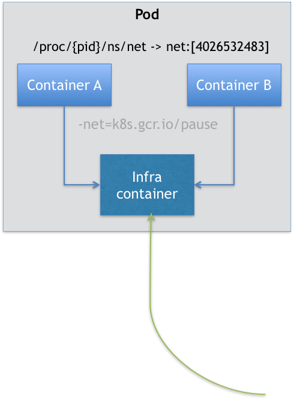

# 2.深入k8s：Pod对象中重要概念及用法


## Pod对象基本概念

Pod，实际上是在扮演传统基础设施里“虚拟机”的角色；而容器，则是这个虚拟机里运行的用户程序。

Kubernetes 集群中的 Pod 可被用于以下两个主要用途：

- **运行单个容器的 Pod**。"每个 Pod 一个容器"模型是最常见的 Kubernetes 用例；在这种情况下，可以将 Pod 看作单个容器的包装器，并且 Kubernetes 直接管理 Pod，而不是容器。
- **运行多个协同工作的容器的 Pod**。 Pod 可能封装由多个紧密耦合且需要共享资源的共处容器组成的应用程序。一个Pod可能包含一个或者多个紧密相连的应用，这些应用可能是在同一个物理主机或虚拟机上。同一个Pod中的应用可以共享磁盘，磁盘是Pod级的，应用可以通过文件系统调用，额外的，一个Pod可能会定义顶级的cgroup隔离。

### Pod的生命周期

Pod 生命周期的变化，主要体现在 Pod API 对象的 Status 部分，它有如下几种可能的情况：

1. Pending。这个状态意味着，Pod 的 YAML 文件已经提交给了 Kubernetes，API 对象已经被创建并保存在 Etcd 当中。但是，这个 Pod 里有些容器因为某种原因而不能被顺利创建。比如，调度不成功。
2. Running。这个状态下，Pod 已经调度成功，跟一个具体的节点绑定。它包含的容器都已经创建成功，并且至少有一个正在运行中。
3. Succeeded。这个状态意味着，Pod 里的所有容器都正常运行完毕，并且已经退出了。这种情况在运行一次性任务时最为常见。
4. Failed。这个状态下，Pod 里至少有一个容器以不正常的状态（非 0 的返回码）退出。这个状态的出现，意味着你得想办法 Debug 这个容器的应用，比如查看 Pod 的 Events 和日志。
5. Unknown。这是一个异常状态，意味着 Pod 的状态不能持续地被 kubelet 汇报给 kube-apiserver，这很有可能是主从节点（Master 和 Kubelet）间的通信出现了问题。

Pod 对象的 Status 字段，还可以再细分出一组 Conditions。这些细分状态的值包括：PodScheduled、Ready、Initialized，以及 Unschedulable。它们主要用于描述造成当前 Status 的具体原因是什么。

### Pod中的资源限制

Kubernetes通过cgroups限制容器的CPU和内存等计算资源，包括requests和limits。

如果 Pod 运行所在的节点具有足够的可用资源，容器可能（且可以）使用超出对应资源 `request` 属性所设置的资源量，request属性主要目的是为容器预留资源。不过，容器不可以使用超出其资源 `limit` 属性所设置的资源量。


Pod 中的每个容器都可以指定以下的一个或者多个值：

- `spec.containers[].resources.limits.cpu`
- `spec.containers[].resources.limits.memory`
- `spec.containers[].resources.limits.hugepages-<size>`
- `spec.containers[].resources.requests.cpu`
- `spec.containers[].resources.requests.memory`
- `spec.containers[].resources.requests.hugepages-<size>`


CPU 资源的约束和请求以 *cpu* 为单位。Kubernetes 中的一个 cpu 等于云平台上的 **1 个 vCPU/核**和裸机 Intel 处理器上的 **1 个超线程 **。CPU 总是按绝对数量来请求的，不可以使用相对数量； 0.1 的 CPU 在单核、双核、48 核的机器上的意义是一样的。


内存的约束和请求以字节为单位。你可以使用以下后缀之一以一般整数或定点整数形式来表示内存： E、P、T、G、M、K。


如果没有设置一个CPU或内存的限制，那么这个container在当节点使用的资源是没有上限的。但是如果设置了默认container资源限制，那么就会被限制在默认值之下。

### Pod中的网络资源

Pod是一个逻辑概念，是一组共享了某些资源的容器。Pod 里的所有容器，共享的是同一个 Network Namespace，并且可以声明共享同一个 Volume。

在 Kubernetes 项目里有一个中间容器，这个容器叫作 Infra 容器。Infra 容器永远都是第一个被创建的容器，而其他用户定义的容器，则通过 Join Network Namespace 的方式，与 Infra 容器关联在一起。

在 Kubernetes 项目里，Infra 容器一定要占用极少的资源，所以它使用的是一个非常特殊的镜像，叫作：k8s.gcr.io/pause。这个镜像是一个用汇编语言编写的、永远处于“暂停”状态的容器，解压后的大小也只有 100~200 KB 左右。



如上图所示，这个 Pod 里有两个用户容器 A 和 B，还有一个 Infra 容器。在 Infra 容器“Hold 住”Network Namespace 后，用户容器就可以加入到 Infra 容器的 Network Namespace 当中了。

这也就意味着，对于 Pod 里的容器 A 和容器 B 来说：

* 它们可以直接使用 localhost 进行通信；
* 它们可以直接使用 localhost 进行通信；
* 它们看到的网络设备跟 Infra 容器看到的完全一样；
* 一个 Pod 只有一个 IP 地址，也就是这个 Pod 的 Network Namespace 对应的 IP 地址；
* 当然，其他的所有网络资源，都是一个 Pod 一份，并且被该 Pod 中的所有容器共享；
* Pod 的生命周期只跟 Infra 容器一致，而与容器 A 和 B 无关。

所以对于同一个 Pod 里面的所有用户容器来说，它们的进出流量，也可以认为都是通过 Infra 容器完成的。

### Pod中的Volume

Volume也是设计在 Pod 层级。一个 Volume 对应的宿主机目录对于 Pod 来说就只有一个，Pod 里的容器只要声明挂载这个 Volume，就一定可以共享这个 Volume 对应的宿主机目录。

```yaml
apiVersion: v1
kind: Pod
metadata:
  name: two-containers
spec:
  restartPolicy: Never
  volumes:
  - name: shared-data
    hostPath:      
      path: /data
  containers:
  - name: nginx-container
    image: nginx
    volumeMounts:
    - name: shared-data
      mountPath: /usr/share/nginx/html
  - name: debian-container
    image: debian
    volumeMounts:
    - name: shared-data
      mountPath: /pod-data
    command: ["/bin/sh"]
    args: ["-c", "echo Hello from the debian container > /pod-data/index.html"]
```

在这个例子中，debian-container 和 nginx-container 都声明挂载了 shared-data 这个 Volume。而 shared-data 是 hostPath 类型。所以，它对应在宿主机上的目录就是：/data。而这个目录，其实就被同时绑定挂载进了上述两个容器当中。这样，nginx-container 可以从它的 /usr/share/nginx/html 目录中，读取到 debian-container 生成的 index.html 文件。


注意：这里有多个container，那么如果想进入其中一个container中，可以用如下命令：

```
kubectl exec -it two-containers  --container  debian-container -- /bin/bash
```

## Pod中重要字段含义与用法

**NodeSelector**

是一个供用户将 Pod 与 Node 进行绑定的字段，用法如下所示：

```
apiVersion: v1
kind: Pod
...
spec:
 nodeSelector:
   disktype: ssd
```

这样所创建的Pod只能运行在携带了“disktype: ssd”标签（Label）的节点上；否则，它将调度失败。

**HostAliases**

定义了 Pod 的 hosts 文件（比如 /etc/hosts）里的内容

```yaml
apiVersion: v1
kind: Pod
...
spec:
  hostAliases:
  - ip: "10.1.2.3"
    hostnames:
    - "foo.remote"
    - "bar.remote"
...
```

这样，这个 Pod 启动后，/etc/hosts 文件的内容将如下所示：

```
cat /etc/hosts
# Kubernetes-managed hosts file.
127.0.0.1 localhost
...
10.244.135.10 hostaliases-pod
10.1.2.3 foo.remote
10.1.2.3 bar.remote
```

在k8s项目中， 如果要设置hosts 文件里的内容，一定要通过这种方法。否则，如果直接修改了 hosts 文件的话，在 Pod 被删除重建之后，kubelet 会自动覆盖掉被修改的内容。

**shareProcessNamespace**

表示这个 Pod 里的容器要共享 PID Namespace。

```yaml
apiVersion: v1
kind: Pod
metadata:
  name: nginx
spec:
  shareProcessNamespace: true
  containers:
  - name: nginx
    image: nginx
  - name: shell
    image: busybox
    stdin: true
    tty: true
```

在这个 YAML 文件中定义了两个容器：一个是 nginx 容器，一个是开启了 tty 和 stdin 的 shell 容器。

在这个pod被创建后，我们可以使用attach命令进入到container中与之进行交互：

```sh
# 创建
$ kubectl create -f nginx.yaml
# 连接到shell
$ kubectl attach -it nginx -c shell
#查看正在运行的进程
/ # ps ax
PID   USER     TIME  COMMAND
    1 root      0:00 /pause
    8 root      0:00 nginx: master process nginx -g daemon off;
   14 101       0:00 nginx: worker process
   15 root      0:00 sh
   21 root      0:00 ps ax
```

从上面输出结果可以看到整个 Pod 里的每个容器的进程，对于所有容器来说都是可见的：它们共享了同一个 PID Namespace。

除此之外，我们还可以定义共享宿主机的 Network、IPC 和 PID Namespace。

```yaml
apiVersion: v1
kind: Pod
metadata:
  name: nginx
spec:
  hostNetwork: true
  hostIPC: true
  hostPID: true
  containers:
  - name: nginx
    image: nginx
  - name: shell
    image: busybox
    stdin: true
    tty: true
```

这个 Pod 里的所有容器，会直接使用宿主机的网络、直接与宿主机进行 IPC 通信、看到宿主机里正在运行的所有进程。

**ImagePullPolicy**

定义了镜像拉取的策略，它是一个 Container 级别的属性。

ImagePullPolicy 的值默认是 IfNotPresent，即每次创建 Pod 都重新拉取一次镜像。另外，当容器的镜像是类似于 nginx 或者 nginx:latest 这样的名字时，ImagePullPolicy 会被认为Always ，即总是会去拉取最新的镜像。

**Lifecycle**

可以在容器状态发生变化时触发一系列“钩子”。

```yaml
apiVersion: v1
kind: Pod
metadata:
  name: lifecycle-demo
spec:
  containers:
  - name: lifecycle-demo-container
    image: nginx
    lifecycle:
      postStart:
        exec:
          command: ["/bin/sh", "-c", "echo Hello from the postStart handler > /usr/share/message"]
      preStop:
        exec:
          command: ["/usr/sbin/nginx","-s","quit"]
```

上面的配置中，postStart指的是在容器启动后，立刻执行一个指定的操作；preStop是容器被杀死之前（比如，收到了 SIGKILL 信号）。

## Pod中的init containers

一个Pod中可以有多个container，所以它也能有一个或多个init container，init container能在其他container开始前运行。每个init container都会运行完成后下一个container才能开始。

如果Pod中的init container运行失败，Kubernetes 会重启Pod直到init container运行成功；如果这个Pod的restartPolicy策略是Never，那么Kubernetes 在init container运行失败后将不会启动。


下面我们举个例子：

```yaml
apiVersion: v1
kind: Pod
metadata:
  name: myapp-pod
  labels:
    app: myapp
spec:
  containers:
  - name: myapp-container
    image: busybox:1.28
    command: ['sh', '-c', 'echo The app is running! && sleep 3600']
  initContainers:
  - name: init-myservice
    image: busybox:1.28
    command: ['sh', '-c', "until nslookup myservice.$(cat /var/run/secrets/kubernetes.io/serviceaccount/namespace).svc.cluster.local; do echo waiting for myservice; sleep 2; done"]
  - name: init-mydb
    image: busybox:1.28
    command: ['sh', '-c', "until nslookup mydb.$(cat /var/run/secrets/kubernetes.io/serviceaccount/namespace).svc.cluster.local; do echo waiting for mydb; sleep 2; done"]
```

这个pod中运行了两个init container，init-myservice和init-mydb，他们都会在容器运行时执行一个命令，只有当这个命令执行完成了才能继续往下运行。

启动这个pod：

```
kubectl apply -f myapp.yaml
```

查看pod状态：

```
kubectl get -f myapp.yaml

NAME        READY     STATUS     RESTARTS   AGE
myapp-pod   0/1       Init:0/2   0          6m
```

可以看到这个pod一直在init中。

我们查看一下详情：

```shell
kubectl describe -f myapp.yaml

...
Init Containers:
  init-myservice:
[...]
    State:         Running
[...]
  init-mydb:
[...]
    State:         Waiting
      Reason:      PodInitializing
    Ready:         False
...
Containers:
  myapp-container:
    ...
    State:          Waiting
      Reason:       PodInitializing
    Ready:          False
    Restart Count:  0
    Environment:    <none>
...
Events:
  Type    Reason     Age        From                     Message
  ----    ------     ----       ----                     -------
  Normal  Scheduled  <unknown>  default-scheduler        Successfully assigned default/myapp-pod to 192.168.13.130
  Normal  Pulling    41s        kubelet, 192.168.13.130  Pulling image "busybox:1.28"
  Normal  Pulled     27s        kubelet, 192.168.13.130  Successfully pulled image "busybox:1.28"
  Normal  Created    27s        kubelet, 192.168.13.130  Created container init-myservice
  Normal  Started    27s        kubelet, 192.168.13.130  Started container init-myservice
```

我们可以看到init container是依次往下执行，init-myservice处于running，init-mydb处于Waiting状态。myapp-container也是处于Waiting状态。

我们查看一下日志：

```
kubectl logs myapp-pod -c init-myservice

Server:    10.68.0.2
Address 1: 10.68.0.2 kube-dns.kube-system.svc.cluster.local

waiting for myservice
nslookup: can't resolve 'myservice.default.svc.cluster.local'
Server:    10.68.0.2
Address 1: 10.68.0.2 kube-dns.kube-system.svc.cluster.local
...


kubectl logs myapp-pod -c init-mydb

Error from server (BadRequest): container "init-mydb" in pod "myapp-pod" is waiting to start: PodInitializing

```

可以看到init-myservice一直在循环执行nslookup，init-mydb还没初始化。

现在我们实现两个service：

```yaml
---
apiVersion: v1
kind: Service
metadata:
  name: myservice
spec:
  ports:
  - protocol: TCP
    port: 80
    targetPort: 9376
---
apiVersion: v1
kind: Service
metadata:
  name: mydb
spec:
  ports:
  - protocol: TCP
    port: 80
    targetPort: 9377
```

在上面这个yaml运行之后，我们在看看myapp pod状态

```
kubectl get -f myapp.yaml

NAME        READY     STATUS    RESTARTS   AGE
myapp-pod   1/1       Running   0          9m
```

发现已经成功运行。


## Pod中的Projected Volume

Projected Volume是用来为容器提供预先定义好的数据。

到目前为止，Kubernetes 支持的 Projected Volume 一共有四种：

1. Secret；
2. ConfigMap；
3. Downward API；
4. ServiceAccountToken。

### Secret

作用是把 Pod 想要访问的加密数据，存放到 Etcd 中。然后，你就可以通过在 Pod 的容器里挂载 Volume 的方式，访问到这些 Secret 里保存的信息了。

先申明一下user和pass：

```
$ cat ./username.txt
admin
$ cat ./password.txt
c1oudc0w!

$ kubectl create secret generic user --from-file=./username.txt
$ kubectl create secret generic pass --from-file=./password.txt
```

username.txt 和 password.txt 文件里，存放的就是用户名和密码；而 user 和 pass，则是我为 Secret 对象指定的名字。

如果要查看secret的话，使用kubectl get就可以

```
$ kubectl get secrets
NAME           TYPE                                DATA      AGE
user          Opaque                                1         51s
pass          Opaque                                1         51s
```

除此之外，还可以使用YAML 文件的方式来创建这个 Secret 对象，比如：

```yaml
apiVersion: v1
kind: Secret
metadata:
  name: mysecret
type: Opaque
data:
  user: YWRtaW4=
  pass: MWYyZDFlMmU2N2Rm
```

需要注意的是，Secret 对象要求这些数据必须是经过 Base64 转码的，以免出现明文密码的安全隐患。

然后创建一个pod，使用secret

如下：

```yaml
apiVersion: v1
kind: Pod
metadata:
  name: test-projected-volume 
spec:
  containers:
  - name: test-secret-volume
    image: busybox
    args:
    - sleep
    - "86400"
    volumeMounts:
    - name: mysql-cred
      mountPath: "/projected-volume"
      readOnly: true
  volumes:
  - name: mysql-cred
    projected:
      sources:
      - secret:
          name: user
      - secret:
          name: pass
```

然后在容器中，查看：

```
$ kubectl exec -it test-projected-volume -- /bin/sh
$ ls /projected-volume/
user
pass
$ cat /projected-volume/user
root
$ cat /projected-volume/pass
1f2d1e2e67df
```

像这样通过挂载方式进入到容器里的 Secret，一旦其对应的 Etcd 里的数据被更新，这些 Volume 里的文件内容，同样也会被更新。

### ConfigMap

ConfigMap 保存的是不需要加密的、应用所需的配置信息。

比如，一个 Java 应用所需的配置文件（.properties 文件），就可以通过下面这样的方式保存在 ConfigMap 里：

```
# .properties文件的内容
$ cat example/ui.properties
color.good=purple
color.bad=yellow
allow.textmode=true
how.nice.to.look=fairlyNice

# 从.properties文件创建ConfigMap
$ kubectl create configmap ui-config --from-file=example/ui.properties

# 查看这个ConfigMap里保存的信息(data)
$ kubectl get configmaps ui-config -o yaml
apiVersion: v1
data:
  ui.properties: |
    color.good=purple
    color.bad=yellow
    allow.textmode=true
    how.nice.to.look=fairlyNice
kind: ConfigMap
metadata:
  name: ui-config
  ...
```


### Downward API

可以让 Pod 里的容器能够直接获取到这个 Pod API 对象本身的信息。

```yaml
apiVersion: v1
kind: Pod
metadata:
  name: test-downwardapi-volume
  labels:
    zone: us-est-coast
    cluster: test-cluster1
    rack: rack-22
spec:
  containers:
    - name: client-container
      image: k8s.gcr.io/busybox
      command: ["sh", "-c"]
      args:
      - while true; do
          if [[ -e /etc/podinfo/labels ]]; then
            echo -en '\n\n'; cat /etc/podinfo/labels; fi;
          sleep 5;
        done;
      volumeMounts:
        - name: podinfo
          mountPath: /etc/podinfo
          readOnly: false
  volumes:
    - name: podinfo
      projected:
        sources:
        - downwardAPI:
            items:
              - path: "labels"
                fieldRef:
                  fieldPath: metadata.labels
```

通过这样的声明方式，当前 Pod 的 Labels 字段的值，就会被 Kubernetes 自动挂载成为容器里的 /etc/podinfo/labels 文件。

Downward API 支持的字段已经非常丰富了，比如：

```
1. 使用fieldRef可以声明使用:
spec.nodeName - 宿主机名字
status.hostIP - 宿主机IP
metadata.name - Pod的名字
metadata.namespace - Pod的Namespace
status.podIP - Pod的IP
spec.serviceAccountName - Pod的Service Account的名字
metadata.uid - Pod的UID
metadata.labels['<KEY>'] - 指定<KEY>的Label值
metadata.annotations['<KEY>'] - 指定<KEY>的Annotation值
metadata.labels - Pod的所有Label
metadata.annotations - Pod的所有Annotation

2. 使用resourceFieldRef可以声明使用:
容器的CPU limit
容器的CPU request
容器的memory limit
容器的memory request
```

### Service Account

Service Account 对象的作用，就是 Kubernetes 系统内置的一种“服务账户”，它是 Kubernetes 进行权限分配的对象。

Service Account 的授权信息和文件保存在它所绑定的一个特殊的 Secret 对象ServiceAccountToken中。

如果你查看一下任意一个运行在 Kubernetes 集群里的 Pod，就会发现，每一个 Pod，都已经自动声明一个类型是 Secret、名为 default-token-xxxx 的 Volume，然后 自动挂载在每个容器的一个固定目录上。比如：

```
$ kubectl describe pod nginx-deployment-5c678cfb6d-lg9lw
Containers:
...
  Mounts:
    /var/run/secrets/kubernetes.io/serviceaccount from default-token-s8rbq (ro)
Volumes:
  default-token-s8rbq:
  Type:       Secret (a volume populated by a Secret)
  SecretName:  default-token-s8rbq
  Optional:    false
```

这个 Secret 类型的 Volume，正是默认 Service Account 对应的 ServiceAccountToken。

一旦 Pod 创建完成，容器里的应用就可以直接从这个默认 ServiceAccountToken 的挂载目录里访问到授权信息和文件。这个容器内的路径在 Kubernetes 里是固定的，即：/var/run/secrets/kubernetes.io/serviceaccount。

## Pod中的健康检查和恢复机制

Pod中的健康检查是kubectl在对Container的一个定期的检查。主要有三种实现方式：

* 命令执行ExecAction：在Container中会定期的执行一行命令，如果这个命令能执行成功，那么就认为是健康的；
* TCP Socket Action：对Container中的ip和端口进行TCP检查，如果端口是通的，那么就认为是健康的；
* HTTP GET Action：通过http请求的方式来检查Container中的服务是否正常。


下面我们看一个命令执行的例子：

```yaml
apiVersion: v1
kind: Pod
metadata:
  labels:
    test: liveness
  name: test-liveness-exec
spec:
  containers:
  - name: liveness
    image: busybox
    args:
    - /bin/sh
    - -c
    - touch /tmp/healthy; sleep 30; rm -rf /tmp/healthy; sleep 600
    livenessProbe:
      exec:
        command:
        - cat
        - /tmp/healthy
      initialDelaySeconds: 5
      periodSeconds: 5
```

在这个 Pod 中在 /tmp 目录下创建了一个 healthy 文件30 s 过后，它会把这个文件删除掉。并且还定义了livenessProbe，然后会根据执行的命令在容器启动 5 s 后开始执行（initialDelaySeconds: 5），每 5 s 执行一次（periodSeconds: 5），如果命令执行成功就认为是健康的。


创建好后，可以过30s看一下状态：

```
kubectl describe pod test-liveness-exec


FirstSeen LastSeen    Count   From            SubobjectPath           Type        Reason      Message
--------- --------    -----   ----            -------------           --------    ------      -------
2s        2s      1   {kubelet worker0}   spec.containers{liveness}   Warning     Unhealthy   Liveness probe failed: cat: can't open '/tmp/healthy': No such file or directory
```

event里面会报告容器是不健康的。

然后在看一下Pod状态：

```
$ kubectl get pod test-liveness-exec
NAME           READY     STATUS    RESTARTS   AGE
liveness-exec   1/1       Running   1          1m
```

发现Pod已经被重启过一次了。这也就是Pod 恢复机制，它是 Pod 的 Spec 部分的一个标准字段（pod.spec.restartPolicy），默认值是 Always，即：任何时候这个容器发生了异常，它一定会被重新创建。

注意：Pod 的恢复过程，永远都是发生在当前节点上，而不会跑到别的节点上去。


Pod 恢复机制有以下几种：

* Always：在任何情况下，只要容器不在运行状态，就自动重启容器；

* OnFailure: 只在容器 异常时才自动重启容器；

* Never: 从来不重启容器

**只要 Pod 的 restartPolicy 指定的策略允许重启异常的容器（比如：Always），那么这个 Pod 就会保持 Running 状态，并进行容器重启。**

**对于包含多个容器的 Pod，只有它里面所有的容器都进入异常状态后，Pod 才会进入 Failed 状态。**


## Pod 预设置：PodPreset

比如可以先定义一个 PodPreset 对象：

```yaml

apiVersion: settings.k8s.io/v1alpha1
kind: PodPreset
metadata:
  name: allow-database
spec:
  selector:
    matchLabels:
      role: frontend
  env:
    - name: DB_PORT
      value: "6379"
  volumeMounts:
    - mountPath: /cache
      name: cache-volume
  volumes:
    - name: cache-volume
      emptyDir: {}
```

在这个 PodPreset 的定义中，首先是一个 selector，表示只会作用于 selector 所定义的、带有“role: frontend”标签的 Pod 对象。

然后定义了env、volumeMounts等。

然后我们再写一个yaml：

```yaml
apiVersion: v1
kind: Pod
metadata:
  name: website
  labels:
    app: website
    role: frontend
spec:
  containers:
    - name: website
      image: nginx
      ports:
        - containerPort: 80
```

那么创建的适合，先创建PodPreset，然后再创建website的Pod，然后查看一下这个 Pod 的 API 对象：

```yaml
$ kubectl get pod website -o yaml
apiVersion: v1
kind: Pod
metadata:
  name: website
  labels:
    app: website
    role: frontend
  annotations:
    podpreset.admission.kubernetes.io/podpreset-allow-database: "resource version"
spec:
  containers:
    - name: website
      image: nginx
      volumeMounts:
        - mountPath: /cache
          name: cache-volume
      ports:
        - containerPort: 80
      env:
        - name: DB_PORT
          value: "6379"
  volumes:
    - name: cache-volume
      emptyDir: {}
```

PodPreset 里定义的内容，只会在 Pod API 对象被创建之前追加在这个对象本身上，而不会影响任何 Pod 的控制器的定义。