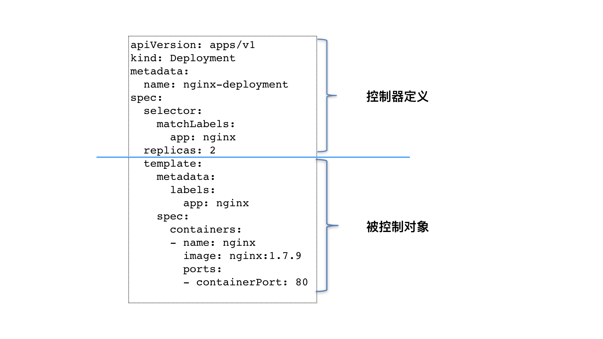

# 3.深入k8s：Deployment控制器


Deployment可以做到很便捷的管理Pod，只需要在Deployment中描述一下希望的Pod状态时什么，包括定义Pod副本数、滚动升级和回滚应用、扩容和缩容、暂停和继续Deployment等，然后Deployment Controller就可以帮我们实现我们想要达到的状态。

我们从一个例子入手：

```yaml
apiVersion: apps/v1
kind: Deployment
metadata:
  name: nginx-deployment
spec:
  selector:
    matchLabels:
      app: nginx
  replicas: 2
  template:
    metadata:
      labels:
        app: nginx
    spec:
      containers:
      - name: nginx
        image: nginx:1.7.9
        ports:
        - containerPort: 80
```

这个例子中：

* 我们定义了一个Deployment，名字叫nginx-deployment；

* 通过spec.replicas字段定义了Pod的副本数是2；

* 通过spec.selector字段定义了被打上app: nginx的标签的Pod才会被管理；

* tmplate字段定义了这个Deployment管理的Pod应该是怎样的，具有怎样的属性；

总的来说一个Deploymet控制器可以由两部分组成：



### ReplicaSet

ReplicaSet是一个副本控制器，ReplicaSet可以用selector来控制Pod的数量，而Deployments是一个更高层次的概念，它管理ReplicaSets，并提供对pod的声明性更新以及许多其他的功能。

Deployment通过控制ReplicaSet的个数来和属性，进而实现“水平扩展 / 收缩”和“滚动更新”这两个编排动作。

### 水平扩展与滚动更新

我们可以通过下面这个命令来创建Deployment：

```
kubectl create -f nginx-deployment.yaml --record
```

这里–record 参数作用是记录下你每次操作所执行的命令，以方便后面查看。

检查一下Deployment状态：

```
kubectl get deployments

NAME               READY   UP-TO-DATE   AVAILABLE   AGE
nginx-deployment   2/2     2            2           33m
```

* NAME：列举出Deployments 的名字；
* READY：显示了多少个应用的副本是可用的，目前副本数/期望副本数；
* UP-TO-DATE：显示了副本更新的次数，这里显示为2，说明已经做过2此更新；
* AVAILABLE：显示了多少个应用的副本是可用的；
* AGE：显示了应用运行的时间。

现在我们使用kubectl scale来做一个水平扩展：

```
kubectl scale deployment nginx-deployment --replicas=4

deployment.apps/nginx-deployment scaled
```

然后我们可以使用rollout status来查看滚动更新的状态：

```
kubectl rollout status deployment/nginx-deployment


Waiting for deployment "nginx-deployment" rollout to finish: 2 of 4 updated replicas are available...
Waiting for deployment "nginx-deployment" rollout to finish: 3 of 4 updated replicas are available...
deployment "nginx-deployment" successfully rolled out
```

上面的3 of 4 updated replicas are available表示已经有3个Pod进入了UP-TO-DATE 状态。

然后我们还可以查看一下ReplicaSet状态：

```
kubectl get rs

NAME                         DESIRED   CURRENT   READY   AGE
nginx-deployment-9754ccbdf   4         4         4       44m
```

在运行了一个Deployment修改后，Deployment Controller会创建一个副本为ReplicaSet，并会生成一串随机字符，ReplicaSet 会把这个随机字符串加在它所控制的所有 Pod 的标签里，从而保证这些 Pod 不会与集群里的其他 Pod 混淆。

我们可以通过 kubectl get pods --show-labels来查看：

```
NAME                               READY   STATUS    RESTARTS   AGE    LABELS
nginx-deployment-9754ccbdf-5pl2j   1/1     Running   0          5m4s   app=nginx,pod-template-hash=9754ccbdf
nginx-deployment-9754ccbdf-67d4g   1/1     Running   0          48m    app=nginx,pod-template-hash=9754ccbdf
nginx-deployment-9754ccbdf-9drgb   1/1     Running   0          48m    app=nginx,pod-template-hash=9754ccbdf
nginx-deployment-9754ccbdf-fdmrx   1/1     Running   0          5m4s   app=nginx,pod-template-hash=9754ccbdf
```

下面我们看看Deployment的滚动更新是如何做的：

我们使用set image 来修改deployment中的镜像

```
kubectl set image deployment/nginx-deployment nginx=nginx:1.16.1 --record

deployment.apps/nginx-deployment image updated
```

然后我们可以通过kubectl describe查看滚动更新的过程：

```
 
$ kubectl describe deployment nginx-deployment
...
Events:
  Type    Reason             Age   From                   Message
  ----    ------             ----  ----                   -------
...
 Normal  ScalingReplicaSet  29s                 deployment-controller  Scaled down replica set nginx-deployment-9754ccbdf to 3
  Normal  ScalingReplicaSet  29s                 deployment-controller  Scaled up replica set nginx-deployment-dc46b5ffc to 2
  Normal  ScalingReplicaSet  12s (x2 over 11m)   deployment-controller  Scaled down replica set nginx-deployment-9754ccbdf to 2
  Normal  ScalingReplicaSet  12s                 deployment-controller  Scaled up replica set nginx-deployment-dc46b5ffc to 3
  Normal  ScalingReplicaSet  11s                 deployment-controller  Scaled down replica set nginx-deployment-9754ccbdf to 1
  Normal  ScalingReplicaSet  11s                 deployment-controller  Scaled up replica set nginx-deployment-dc46b5ffc to 4
  Normal  ScalingReplicaSet  11s                 deployment-controller  Scaled down replica set nginx-deployment-9754ccbdf to 0
```

可以看到Deployment Controller控制ReplicaSet将旧的Pod 副本数一个个减少，并创建一个新的ReplicaSet：nginx-deployment-dc46b5ffc，并将其控制的Pod副本数一个个增加。

在这个“滚动更新”过程完成之后，你可以查看一下新、旧两个 ReplicaSet 的最终状态：

```
kubectl get rs

NAME                         DESIRED   CURRENT   READY   AGE
nginx-deployment-9754ccbdf   0         0         0       57m
nginx-deployment-dc46b5ffc   4         4         4       5m9s
```

默认的情况下，Deployment 会保至少有75%的Pod还是可用的，所以我们的例子中，会保证至少有3个Pod是出于可用的状态。

这个策略，是 Deployment 对象的一个字段，名叫 RollingUpdateStrategy，如下所示：

```
 kubectl describe deployment
 
 
Name:                   nginx-deployment
...
Selector:               app=nginx
Replicas:               4 desired | 4 updated | 4 total | 4 available | 0 unavailable
StrategyType:           RollingUpdate
MinReadySeconds:        0
RollingUpdateStrategy:  25% max unavailable, 25% max surge
...
```

25% max unavailable表示最大25%不可用；25% max surge表示最多可以创建多少个新的Pod。

### 版本控制与回滚

在上面的操作中，我们将nginx的版本设置成了1.16.1，现在我们可以通过rollout undo来进行版本的回滚：

```
kubectl rollout undo deployment/nginx-deployment

deployment.apps/nginx-deployment rolled back
```


当然除了这个命令以外由于我们使用了--record，所以我们可以通过kubectl rollout history 来查看版本信息：

```
kubectl rollout history deployment/nginx-deployment

deployment.apps/nginx-deployment
REVISION  CHANGE-CAUSE
2         kubectl set image deployment/nginx-deployment nginx=nginx:1.16.1 --record=true
3         kubectl apply --filename=nginx-deployment.yaml --record=true
```

我们可以通过kubectl rollout history来看到相应版本的具体信息：

```
kubectl rollout history deployment/nginx-deployment --revision=2
```

通过kubectl rollout undo命令来回滚到相应的版本：

```
kubectl rollout undo deployment/nginx-deployment --to-revision=2
```

### Pausing 和Resuming 一个Deployment

我们在上面的操作中，每进行一步操作都会进行一次滚动更新，如果我们想一次性执行多条命令然后再一次性滚动更新，那么可以先pause Deployment然后操作完之后再resume 它。

如下：

```
kubectl rollout pause deployment/nginx-deployment

deployment.apps/nginx-deployment paused
```

然后就可以随意的修改这个 Deployment 的内容了。由于此时 Deployment 正处于“暂停”状态，所以我们对 Deployment 的所有修改，都不会触发新的“滚动更新”，也不会创建新的 ReplicaSet。


操作完之后再执行：

```
kubectl rollout resume deployment/nginx-deployment

deployment.apps/nginx-deployment resumed
```

在 kubectl rollout pause 指令之后的这段时间里，我们对 Deployment 进行的所有修改，最后只会触发一次“滚动更新”。

