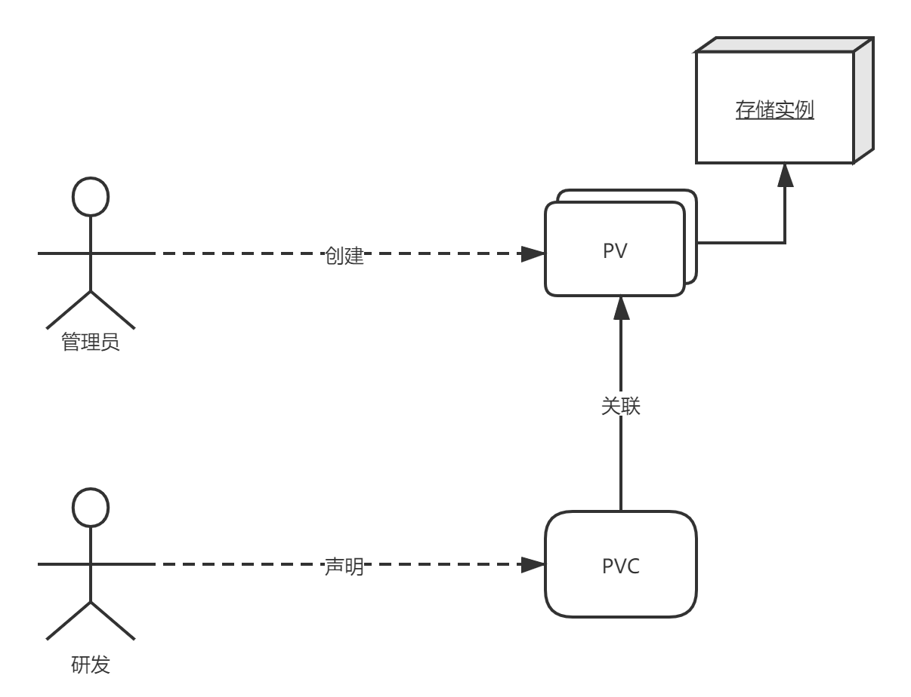

# 4.深入k8s：持久卷PV、PVC及其源码分析


### 从一个例子入手PV、PVC

Kubernetes 项目引入了一组叫作 Persistent Volume Claim（PVC）和 Persistent Volume（PV）的 API 对象用于管理存储卷。

下面举个例子看看，这个例子来自《k8s in Action》：

```yaml
apiVersion: v1
kind: PersistentVolumeClaim
metadata:
  name: mongodb-pvc
spec:
  resources:
    requests:
      storage: 1Gi
  accessModes:
  - ReadWriteOnce
  storageClassName: ""
```

yaml文件中定义了storage为1 GiB表示PVC需要的容量；

Access Modes表示需要的volume存储类型，ReadWriteOnce表示只能在一个node节点上进行读写操作，其他的Access Modes详见：https://kubernetes.io/docs/concepts/storage/persistent-volumes/#access-modes；

storageClassName为空，表示的是storageClass的名称，我们下面会说到。

然后获取一下PVC的状态：

```SHELL
$ kubectl get pvc
NAME                   STATUS   VOLUME              CAPACITY   ACCESS MODES   STORAGECLASS   AGE
mongodb-pvc            Available    mongodb-pv          1Gi        RWO,ROX                       2m25s
```

此时可以看到，我们的PVC处于可用状态。


然后再定义一个PV：

```yaml
apiVersion: v1
kind: PersistentVolume
metadata:
  name: mongodb-pv
spec:
  capacity:
    storage: 1Gi
  accessModes:
  - ReadWriteOnce
  - ReadOnlyMany
  persistentVolumeReclaimPolicy: Retain
  gcePersistentDisk:
    pdName: mongodb
    fsType: ext4
```

这个 PV 对象中会详细定义存储的类型是GCE，以及大小是1 GiB，这里没有声明storageClassName，是因为storageClassName默认就为空。


然后我们看一下PV和PVC的状态：

```shell
$ kubectl get pv
NAME                CAPACITY   ACCESS MODES   RECLAIM POLICY   STATUS      CLAIM                          STORAGECLASS   REASON   AGE
mongodb-pv          1Gi        RWO,ROX        Retain           Bound       default/mongodb-pvc                                    77m

$ kubectl get pvc
NAME                   STATUS   VOLUME              CAPACITY   ACCESS MODES   STORAGECLASS   AGE
mongodb-pvc            Bound    mongodb-pv          1Gi        RWO,ROX                       7m7s
```

可以看到PV和PVC已经相互绑定了。


PVC和PV相当于“接口”和“实现”，所以我们需要将PVC和PV绑定起来才可以使用，而PVC和PV绑定的时候需要满足：

1. PV 和 PVC 的 spec 字段要匹配，比如PV 的存储（storage）大小，就必须满足 PVC 的要求。
2. PV 和 PVC 的 storageClassName 字段必须一样才能进行绑定。storageClassName表示的是StorageClass的name属性。


如果我们想要在Pod中使用这个PVC，那么我们可以这么做：

```yaml
apiVersion: v1
kind: Pod
metadata:
  name: mongodb
spec:
  containers:
  - image: mongo
    name: mongodb
    volumeMounts:
    - name: mongodb-data
      mountPath: /data/db
    ports:
    - containerPort: 27017
      protocol: TCP
  volumes:
  - name: mongodb-data
    persistentVolumeClaim:
      claimName: mongodb-pvc
```

在Pod中只需要声明PVC的名字，等Pod创建后kubelet 就会把这个 PVC 所对应的 PV，也就是一个 GCE类型的 Volume，挂载在这个 Pod 容器内的目录上。


PersistentVolumeController会不断地查看当前每一个 PVC，是不是已经处于 Bound（已绑定）状态。如果不是，那它就会遍历所有的、可用的 PV，并尝试将其与这个“单身”的 PVC 进行绑定。这个PersistentVolumeController的源码我们下面会进行分析。那么问题来了，k8s为什么要将一个存储卷分成两部分呢？

 

因为实际上，我们项目当中，研发人员和集群的管理人员是分开的，研发人员只管使用，但是并不关心底层到底用的是什么存储技术，所以研发人员只要声明一个PVC，表示我需要多大的一个存储，以及读写类型就可以了。



### StorageClass的Dynamic Provisioning

在上面我们说的PV和PVC绑定的过程称为Static Provisioning，需要手动的创建PV，我们在研发中可能有这样的情况，就是管理员没有及时给我们创建对应的PV，难道一直等着吗？所以这个时候就需要用到StorageClass了，StorageClass提供了Dynamic Provisioning机制，可以根据模板创建PV。

StorageClass 对象会定义如下两个部分内容：

1. PV 的属性。比如，存储类型、Volume 的大小等等。
2. 创建这种 PV 需要用到的存储插件。比如，Ceph 等等。


这样k8s就能够根据用户提交的 PVC，找到一个对应的 StorageClass ，然后调用该 StorageClass 声明的存储插件，创建出需要的 PV。

例如声明如下StorageClass：

```yaml
apiVersion: storage.k8s.io/v1
kind: StorageClass
metadata:
  name: block-service
provisioner: kubernetes.io/gce-pd
parameters:
  type: pd-ssd
```

这里定义了名叫 block-service 的 StorageClass，provisioner 字段的值是：kubernetes.io/gce-pd，这是k8s内置的存储插件，type字段也是跟着provisioner定义的，官方默认支持 Dynamic Provisioning 的内置存储插件：https://kubernetes.io/docs/concepts/storage/storage-classes/。


然后就可以在PVC中声明storageClassName为block-service，当创建好PVC 对象之后，k8s就会调用相应的存储插件API创建一个PV对象。

如下：

```yaml
apiVersion: v1
kind: PersistentVolumeClaim
metadata:
  name: claim1
spec:
  accessModes:
    - ReadWriteOnce
  storageClassName: block-service
  resources:
    requests:
      storage: 30Gi
```


这种自动创建PV的机制就是Dynamic Provisioning，Kubernetes 就能够根据用户提交的 PVC，找到一个对应的 StorageClass ，然后会调用StorageClass 声明的存储插件，创建出需要的 PV。


需要注意的是，如果没有声明StorageClassName在PVC中，PVC 的 storageClassName 的值就是""，这也意味着它只能够跟 storageClassName 也是""的 PV 进行绑定。


### PV和PVC的生命周期

 PV和PVC之间的相互作用遵循这个生命周期:

Provisioning --->Binding --->Using --->Reclaiming

#### Provisioning

k8s提供了两种PV生成方式： statically or dynamically

statically：由管理员创建PV，它们携带可供集群用户使用的真实存储的详细信息。 它们存在于Kubernetes API中，可用于消费。

dynamically：当管理员创建的静态PV都不匹配用户的PersistentVolumeClaim时，集群可能会尝试为PVC动态配置卷。 此配置基于StorageClasses，PVC必须请求一个StorageClasses，并且管理员必须已创建并配置该类才能进行动态配置。

#### Binding

由用户创建好PersistentVolumeClaim 后，PersistentVolumeController会不断地查看当前每一个 PVC，是不是已经处于 Bound（已绑定）状态。如果不是，那它就会遍历所有的、可用的 PV，并尝试将其与这个“单身”的 PVC 进行绑定。

#### Using

Pods声明并使用PVC作为volume后，集群会找到该PVC，如果该PVC已经绑定了PV，那么会将该volume挂载到Pod中。

#### Reclaiming

当用户已经不再使用该volume，可以将该PVC删除，以便让资源得以回收。相应的在PVC删除后，PV的回收策略可以是Retained, Recycled, or Deleted，这个策略可以在字段spec.persistentVolumeReclaimPolicy中设置。

* Retain：这个策略允许手动回收资源，当PVC被删除后，PV仍然可以存在，管理员可以手动的执行删除PV，并且和PV绑定的存储资源也不会被删除，如果想要删除相应的存储资源的数据，需要手动删除对应存储资源的数据。
* Delete：这个策略会在PVC被删除之后，连带将PV以及PV管理的存储资源也删除。
* Recycle：相当于在volume中执行rm -rf /thevolume/*命令，以便让volume可以重复利用。


一般的情况下，我们遵循这个删除流程：

1. 删除使用这个 PV 的 Pod；
2. 从宿主机移除本地磁盘（比如，umount 它）；
3. 删除 PVC；
4. 删除 PV。


### Local Persistent Volume实战

Local Persistent Volume适用于类似分布式数据存储比如 MongoDB、Cassandra等需要在多个不同节点上存储数据，并且对I/O 较为敏感的应用。但是相比于正常的 PV，一旦这些节点宕机且不能恢复时，Local Persistent Volume 的数据就可能丢失。


在我们的实验环境中，在宿主机上挂载几个 RAM Disk（内存盘）来模拟本地磁盘。例如：

我们在node1节点上挂载几个磁盘

```shell
$ mkdir /mnt/disks
$ for vol in vol1 vol2 vol3; do
    mkdir /mnt/disks/$vol
    mount -t tmpfs $vol /mnt/disks/$vol
done
```


然后创建相应的PV：

```yaml
apiVersion: v1
kind: PersistentVolume
metadata:
  name: example-pv
spec:
  capacity:
    storage: 512Mi
  volumeMode: Filesystem
  accessModes:
  - ReadWriteOnce
  persistentVolumeReclaimPolicy: Delete
  storageClassName: local-storage
  local:
    path: /mnt/disks/vol1
  nodeAffinity:
    required:
      nodeSelectorTerms:
      - matchExpressions:
        - key: kubernetes.io/hostname
          operator: In
          values:
          - node1
```

这个 PV 的定义里：local 字段指定了它是一个 Local Persistent Volume；而 path 字段，指定的正是这个 PV 对应的本地磁盘的路径，即：/mnt/disks/vol1。并且用nodeAffinity指定这个PV必须运行在node1节点上。

运行上面的PV：

```yaml
$ kubectl create -f local-pv.yaml 
persistentvolume/example-pv created

$ kubectl get pv
NAME         CAPACITY   ACCESS MODES   RECLAIM POLICY  STATUS      CLAIM             STORAGECLASS    REASON    AGE
example-pv   512Mi        RWO            Delete           Available                     local-storage             16s
```

然后创建一个StorageClass 来描述这个 PV：

```yaml
kind: StorageClass
apiVersion: storage.k8s.io/v1
metadata:
  name: local-storage
provisioner: kubernetes.io/no-provisioner
volumeBindingMode: WaitForFirstConsumer
```

这个 StorageClass叫local-storage，provisioner为no-provisioner表示不需要自动创建PV。

volumeBindingMode=WaitForFirstConsumer表示需要等到Pod运行之后才让PVC和PV绑定。因为在使用Local Persistent Volume的时候PV和对应的PVC必须要跟随Pod在同一node下面，否则会调度失败。


然后我们运行StorageClass：

```shell
$ kubectl create -f local-sc.yaml 
storageclass.storage.k8s.io/local-storage created
```


再创建一个PVC：

```yaml
kind: PersistentVolumeClaim
apiVersion: v1
metadata:
  name: example-local-claim
spec:
  accessModes:
  - ReadWriteOnce
  resources:
    requests:
      storage: 512Mi
  storageClassName: local-storage
```

这里注意声明storageClassName需要是我们上面创建的StorageClass。


然后创建PVC：

```shell
$ kubectl create -f local-pvc.yaml 
persistentvolumeclaim/example-local-claim created

$ kubectl get pvc
NAME                  STATUS    VOLUME    CAPACITY   ACCESS MODES   STORAGECLASS    AGE
example-local-claim   Pending                                       local-storage   7s
```

这个时候因为还没创建Pod，所以状态还是Pending。


创建一个pod：

```yaml
kind: Pod
apiVersion: v1
metadata:
  name: example-pv-pod
spec:
  volumes:
    - name: example-pv-storage
      persistentVolumeClaim:
       claimName: example-local-claim
  containers:
    - name: example-pv-container
      image: nginx
      ports:
        - containerPort: 80
          name: "http-server"
      volumeMounts:
        - mountPath: "/usr/share/nginx/html"
          name: example-pv-storage
```


然后我们创建pod后再看看PVC绑定状态：

```shell
$ kubectl create -f local-pod.yaml 
pod/example-pv-pod created

$ kubectl get pvc
NAME                  STATUS    VOLUME       CAPACITY   ACCESS MODES   STORAGECLASS    AGE
example-local-claim   Bound     example-pv   512Mi        RWO            local-storage   6h
```


然后我们试着写入一个文件到/usr/share/nginx/html中：

```shell
$ kubectl exec -it example-pv-pod -- /bin/sh
# cd /usr/share/nginx/html
# touch test.txt


# 在node1上
$ ls /mnt/disks/vol1
test.txt
```

### 源码分析

PV和PVC的源码处理逻辑都在pv_controller_base.go和pv_controller.go这两个文件中。我们直接看核心代码是怎样的。


首先来看看PersistentVolumeController的Run方法，这是入口：

```go
func (ctrl *PersistentVolumeController) Run(stopCh <-chan struct{}) {
	... 
	go wait.Until(ctrl.resync, ctrl.resyncPeriod, stopCh)
	go wait.Until(ctrl.volumeWorker, time.Second, stopCh)
	go wait.Until(ctrl.claimWorker, time.Second, stopCh)
	...
}
```

这个代码主要就是起了三个Goroutine，分别运行不同的方法。resync方法十分简单，主要作用是找出pv和pvc列表然后放入到队列volumeQueue和claimQueue中，给volumeWorker和claimWorker进行消费。所以下面我们主要看volumeWorker以及claimWorker


#### volumeWorker

volumeWorker会不断循环消费volumeQueue队列里面的数据，然后获取到相应的PV执行updateVolume操作。

```go
func (ctrl *PersistentVolumeController) updateVolume(volume *v1.PersistentVolume) {
	// Store the new volume version in the cache and do not process it if this
	// is an old version.
	//更新缓存
	new, err := ctrl.storeVolumeUpdate(volume)
	if err != nil {
		klog.Errorf("%v", err)
	}
	if !new {
		return
	}
	//核心方法，根据当前 PV 对象的规格对 PV 和 PVC 进行绑定或者解绑
	err = ctrl.syncVolume(volume)
	if err != nil {
		if errors.IsConflict(err) {
			// Version conflict error happens quite often and the controller
			// recovers from it easily.
			klog.V(3).Infof("could not sync volume %q: %+v", volume.Name, err)
		} else {
			klog.Errorf("could not sync volume %q: %+v", volume.Name, err)
		}
	}
}
```

updateVolume方法会调用syncVolume方法，执行核心流程。

我们继续：

```go
func (ctrl *PersistentVolumeController) syncVolume(volume *v1.PersistentVolume) error {
	klog.V(4).Infof("synchronizing PersistentVolume[%s]: %s", volume.Name, getVolumeStatusForLogging(volume)) 
	...
	//如果spec.claimRef未设置，则是未使用过的pv，则调用updateVolumePhase函数更新状态设置 phase 为 available
	if volume.Spec.ClaimRef == nil { 
		klog.V(4).Infof("synchronizing PersistentVolume[%s]: volume is unused", volume.Name)
		if _, err := ctrl.updateVolumePhase(volume, v1.VolumeAvailable, ""); err != nil { 
			return err
		}
		return nil
	} else /* pv.Spec.ClaimRef != nil */ { 
		//正在被bound中，更新状态available
		if volume.Spec.ClaimRef.UID == "" { 
			klog.V(4).Infof("synchronizing PersistentVolume[%s]: volume is pre-bound to claim %s", volume.Name, claimrefToClaimKey(volume.Spec.ClaimRef))
			if _, err := ctrl.updateVolumePhase(volume, v1.VolumeAvailable, ""); err != nil { 
				return err
			}
			return nil
		}
		klog.V(4).Infof("synchronizing PersistentVolume[%s]: volume is bound to claim %s", volume.Name, claimrefToClaimKey(volume.Spec.ClaimRef))
		// Get the PVC by _name_
		var claim *v1.PersistentVolumeClaim
		//根据 pv 的 claimRef 获得 pvc
		claimName := claimrefToClaimKey(volume.Spec.ClaimRef)
		obj, found, err := ctrl.claims.GetByKey(claimName)
		if err != nil {
			return err
		}
		//如果在队列未发现，可能是volume被删除了，或者失败了，重新同步pvc
		if !found && metav1.HasAnnotation(volume.ObjectMeta, pvutil.AnnBoundByController) { 
			if volume.Status.Phase != v1.VolumeReleased && volume.Status.Phase != v1.VolumeFailed {
				obj, err = ctrl.claimLister.PersistentVolumeClaims(volume.Spec.ClaimRef.Namespace).Get(volume.Spec.ClaimRef.Name)
				if err != nil && !apierrors.IsNotFound(err) {
					return err
				}
				found = !apierrors.IsNotFound(err)
				if !found {
					obj, err = ctrl.kubeClient.CoreV1().PersistentVolumeClaims(volume.Spec.ClaimRef.Namespace).Get(context.TODO(), volume.Spec.ClaimRef.Name, metav1.GetOptions{})
					if err != nil && !apierrors.IsNotFound(err) {
						return err
					}
					found = !apierrors.IsNotFound(err)
				}
			}
		}
		if !found {
			klog.V(4).Infof("synchronizing PersistentVolume[%s]: claim %s not found", volume.Name, claimrefToClaimKey(volume.Spec.ClaimRef)) 
		} else {
			var ok bool
			claim, ok = obj.(*v1.PersistentVolumeClaim)
			if !ok {
				return fmt.Errorf("Cannot convert object from volume cache to volume %q!?: %#v", claim.Spec.VolumeName, obj)
			}
			klog.V(4).Infof("synchronizing PersistentVolume[%s]: claim %s found: %s", volume.Name, claimrefToClaimKey(volume.Spec.ClaimRef), getClaimStatusForLogging(claim))
		}
		if claim != nil && claim.UID != volume.Spec.ClaimRef.UID { 
			klog.V(4).Infof("synchronizing PersistentVolume[%s]: claim %s has different UID, the old one must have been deleted", volume.Name, claimrefToClaimKey(volume.Spec.ClaimRef))
			// Treat the volume as bound to a missing claim.
			claim = nil
		}
		//claim可能被删除了，或者pv被删除了
		if claim == nil { 
			if volume.Status.Phase != v1.VolumeReleased && volume.Status.Phase != v1.VolumeFailed {
				// Also, log this only once:
				klog.V(2).Infof("volume %q is released and reclaim policy %q will be executed", volume.Name, volume.Spec.PersistentVolumeReclaimPolicy)
				if volume, err = ctrl.updateVolumePhase(volume, v1.VolumeReleased, ""); err != nil { 
					return err
				}
			}
			//根据persistentVolumeReclaimPolicy配置做相应的处理，Retain 保留/ Delete 删除/ Recycle 回收
			if err = ctrl.reclaimVolume(volume); err != nil { 
				return err
			}
			if volume.Spec.PersistentVolumeReclaimPolicy == v1.PersistentVolumeReclaimRetain {
				// volume is being retained, it references a claim that does not exist now.
				klog.V(4).Infof("PersistentVolume[%s] references a claim %q (%s) that is not found", volume.Name, claimrefToClaimKey(volume.Spec.ClaimRef), volume.Spec.ClaimRef.UID)
			}
			return nil
		} else if claim.Spec.VolumeName == "" {
			if pvutil.CheckVolumeModeMismatches(&claim.Spec, &volume.Spec) { 
				volumeMsg := fmt.Sprintf("Cannot bind PersistentVolume to requested PersistentVolumeClaim %q due to incompatible volumeMode.", claim.Name)
				ctrl.eventRecorder.Event(volume, v1.EventTypeWarning, events.VolumeMismatch, volumeMsg)
				claimMsg := fmt.Sprintf("Cannot bind PersistentVolume %q to requested PersistentVolumeClaim due to incompatible volumeMode.", volume.Name)
				ctrl.eventRecorder.Event(claim, v1.EventTypeWarning, events.VolumeMismatch, claimMsg)
				// Skipping syncClaim
				return nil
			}

			if metav1.HasAnnotation(volume.ObjectMeta, pvutil.AnnBoundByController) { 
				klog.V(4).Infof("synchronizing PersistentVolume[%s]: volume not bound yet, waiting for syncClaim to fix it", volume.Name)
			} else { 
				klog.V(4).Infof("synchronizing PersistentVolume[%s]: volume was bound and got unbound (by user?), waiting for syncClaim to fix it", volume.Name)
			} 
			ctrl.claimQueue.Add(claimToClaimKey(claim))
			return nil
		//	已经绑定更新状态status phase为Bound
		} else if claim.Spec.VolumeName == volume.Name {
			// Volume is bound to a claim properly, update status if necessary
			klog.V(4).Infof("synchronizing PersistentVolume[%s]: all is bound", volume.Name)
			if _, err = ctrl.updateVolumePhase(volume, v1.VolumeBound, ""); err != nil {
				// Nothing was saved; we will fall back into the same
				// condition in the next call to this method
				return err
			}
			return nil
		//	PV绑定到PVC上，但是PVC被绑定到其他PV上，重置
		} else {
			// Volume is bound to a claim, but the claim is bound elsewhere
			if metav1.HasAnnotation(volume.ObjectMeta, pvutil.AnnDynamicallyProvisioned) && volume.Spec.PersistentVolumeReclaimPolicy == v1.PersistentVolumeReclaimDelete {
				 
				if volume.Status.Phase != v1.VolumeReleased && volume.Status.Phase != v1.VolumeFailed { 
					klog.V(2).Infof("dynamically volume %q is released and it will be deleted", volume.Name)
					if volume, err = ctrl.updateVolumePhase(volume, v1.VolumeReleased, ""); err != nil { 
						return err
					}
				}
				if err = ctrl.reclaimVolume(volume); err != nil { 
					return err
				}
				return nil
			} else { 
				if metav1.HasAnnotation(volume.ObjectMeta, pvutil.AnnBoundByController) { 
					klog.V(4).Infof("synchronizing PersistentVolume[%s]: volume is bound by controller to a claim that is bound to another volume, unbinding", volume.Name)
					if err = ctrl.unbindVolume(volume); err != nil {
						return err
					}
					return nil
				} else { 
					klog.V(4).Infof("synchronizing PersistentVolume[%s]: volume is bound by user to a claim that is bound to another volume, waiting for the claim to get unbound", volume.Name) 
					if err = ctrl.unbindVolume(volume); err != nil {
						return err
					}
					return nil
				}
			}
		}
	}
}
```

这个方法有点长，我们一步步分析：

这个方法首先会校验一个ClaimRef有没有被设置，因为如果一个PV被绑定了，那么它的ClaimRef属性是会被赋值的，我们可以使用kubectl edit pv mongodb-pv 进入到实例中查看当前的PV属性，会发现：

```yaml
  claimRef:
    apiVersion: v1
    kind: PersistentVolumeClaim
    name: mongodb-pvc
    namespace: default
    resourceVersion: "824043"
    uid: 5cf34ad0-2181-4d99-9875-0d4559e58f42
```

所以如果这个属性为空，那么需要更新PV的状态为Available。


如果ClaimRef不为空，接下来会校验UID属性，UID为空说明PV绑定了PVC，但是PVC却没有绑定PV，所以需要重新设置PV的状态为Available；

然后获取PV对应的PVC，如果在PVC集合里没有找到对应的PVC，那么为了防止本地缓存还未刷新，所以再通过apiserver再去找一下，然后给found变量打上标记；

如果找到了对应的PVC，那么需要比较一下UID是否相等，如果不相等，那么说明不是被绑定的那个PVC，可以认为PVC是被删除了，那么需要更新释放PV，将PV的状态改为Released；

然后会调用reclaimVolume方法，这个方法里面会根据persistentVolumeReclaimPolicy配置做相应的处理：

**PersistentVolumeController#reclaimVolume**

```go
func (ctrl *PersistentVolumeController) reclaimVolume(volume *v1.PersistentVolume) error {
	...
	switch volume.Spec.PersistentVolumeReclaimPolicy {
	//这个策略允许手动回收资源，当PVC被删除后，PV仍然可以存在，管理员可以手动的执行删除PV
	case v1.PersistentVolumeReclaimRetain:
		klog.V(4).Infof("reclaimVolume[%s]: policy is Retain, nothing to do", volume.Name)
	//回收PV，如果没有pod在使用PV，那么将该PV的状态设置为Available
	case v1.PersistentVolumeReclaimRecycle:
		...
		ctrl.scheduleOperation(opName, func() error {
			ctrl.recycleVolumeOperation(volume)
			return nil
		})
	//这个策略会在PVC被删除之后，连带将PV以及PV管理的存储资源也删除
	case v1.PersistentVolumeReclaimDelete:
		...
		ctrl.scheduleOperation(opName, func() error {
			_, err := ctrl.deleteVolumeOperation(volume)
			if err != nil { 
				metrics.RecordMetric(volume.Name, &ctrl.operationTimestamps, err)
			}
			return err
		})

	default:
		...
	}
	return nil
}
```

这个方法里面是用了一个switch case来处理PersistentVolumeReclaimPolicy策略，如果是Retain策略，那么需要手动执行删除，这里只记录了一个log；如果是Recycle则调用recycleVolumeOperation执行解绑操作；如果是Delete则调用deleteVolumeOperation方法将对应的PV删除。

下面我们来挑deleteVolumeOperation看一下这个方法的具体实现：

```go
func (ctrl *PersistentVolumeController) deleteVolumeOperation(volume *v1.PersistentVolume) (string, error) {
	klog.V(4).Infof("deleteVolumeOperation [%s] started", volume.Name)

	//这里先读取最新的PV实例
	newVolume, err := ctrl.kubeClient.CoreV1().PersistentVolumes().Get(context.TODO(), volume.Name, metav1.GetOptions{})
	if err != nil {
		klog.V(3).Infof("error reading persistent volume %q: %v", volume.Name, err)
		return "", nil
	}
	//如果已经被删除了，直接返回
	if newVolume.GetDeletionTimestamp() != nil {
		klog.V(3).Infof("Volume %q is already being deleted", volume.Name)
		return "", nil
	}
	//看一下是否还能找得到对应的PVC
	needsReclaim, err := ctrl.isVolumeReleased(newVolume)
	if err != nil {
		klog.V(3).Infof("error reading claim for volume %q: %v", volume.Name, err)
		return "", nil
	}
	//如果还有PVC与之关联，那么就不能删除这个PV
	if !needsReclaim {
		klog.V(3).Infof("volume %q no longer needs deletion, skipping", volume.Name)
		return "", nil
	}
	//调用相应的plugin删除PV
	pluginName, deleted, err := ctrl.doDeleteVolume(volume) 
	...
	return pluginName, nil
}
```

可见在执行删除的时候先会进行一系列的校验，会去确认这个PV是否已手动删除、PV所对应的PVC是否还存在然后才调用对应的插件执行删除。


我们继续回到PersistentVolumeController的syncVolume方法中。对claim进行校验之后会继续检查VolumeName是否为空，这种情况是表明正在绑定中；

如果PVC的VolumeName等于PV的name，那么说明已经绑定，那么更新一下状态为Bound；否则表示PV绑定到PVC上，但是PVC被绑定到其他PV上，检查一下是否是dynamically provisioned自动生成的，如果是的话就释放这个PV；如果是手动创建的PV，那么调用unbindVolume进行解绑。


到这里我们volumeWorker已经看完了，接下来看一下claimWorker

#### claimWorker

和volumeWorker一样，claimWorker也在一个循环里不断的获取PVC，然后调用updateClaim方法进入到syncClaim进行具体的操作：

**PersistentVolumeController#syncClaim**

```go
func (ctrl *PersistentVolumeController) syncClaim(claim *v1.PersistentVolumeClaim) error {
	klog.V(4).Infof("synchronizing PersistentVolumeClaim[%s]: %s", claimToClaimKey(claim), getClaimStatusForLogging(claim))
 
	newClaim, err := ctrl.updateClaimMigrationAnnotations(claim)
	if err != nil { 
		return err
	}
	claim = newClaim
	//根据当前对象中的注解决定调用逻辑
	if !metav1.HasAnnotation(claim.ObjectMeta, pvutil.AnnBindCompleted) {
		//处理未绑定的pvc
		return ctrl.syncUnboundClaim(claim)
	} else {
		//处理已经绑定的pvc
		return ctrl.syncBoundClaim(claim)
	}
}
```

这个方法会从缓存里面重新获取一些PVC，然后根据PVC的注解决定调用逻辑。

下面我先从syncUnboundClaim开始，方法比较长，分成两部分：

```go
func (ctrl *PersistentVolumeController) syncUnboundClaim(claim *v1.PersistentVolumeClaim) error {
		//说明pvc处于pending状态，没有完成绑定操作
	if claim.Spec.VolumeName == "" {
		// User did not care which PV they get.
		// 是否是延迟绑定
		delayBinding, err := pvutil.IsDelayBindingMode(claim, ctrl.classLister)
		if err != nil {
			return err
		}

		// [Unit test set 1]
		//根据声明的PVC设置的字段找到对应的PV
		volume, err := ctrl.volumes.findBestMatchForClaim(claim, delayBinding)
		if err != nil {
			klog.V(2).Infof("synchronizing unbound PersistentVolumeClaim[%s]: Error finding PV for claim: %v", claimToClaimKey(claim), err)
			return fmt.Errorf("Error finding PV for claim %q: %v", claimToClaimKey(claim), err)
		}
		//如果没有可用volume情况
		if volume == nil {
			klog.V(4).Infof("synchronizing unbound PersistentVolumeClaim[%s]: no volume found", claimToClaimKey(claim)) 
			switch {
			case delayBinding && !pvutil.IsDelayBindingProvisioning(claim):
				if err = ctrl.emitEventForUnboundDelayBindingClaim(claim); err != nil {
					return err
				}
			//	找对应的storageclass
			case v1helper.GetPersistentVolumeClaimClass(claim) != "":
				//根据对应的插件创建PV
				if err = ctrl.provisionClaim(claim); err != nil {
					return err
				}
				return nil
			default:
				ctrl.eventRecorder.Event(claim, v1.EventTypeNormal, events.FailedBinding, "no persistent volumes available for this claim and no storage class is set")
			}
 
			// 等待下次循环再查找匹配的PV进行绑定
			if _, err = ctrl.updateClaimStatus(claim, v1.ClaimPending, nil); err != nil {
				return err
			}
			return nil
		//	找到volume，进行绑定操作
		} else /* pv != nil */ { 
			claimKey := claimToClaimKey(claim)
			klog.V(4).Infof("synchronizing unbound PersistentVolumeClaim[%s]: volume %q found: %s", claimKey, volume.Name, getVolumeStatusForLogging(volume))
			//执行绑定操作
			if err = ctrl.bind(volume, claim); err != nil { 
				metrics.RecordMetric(claimKey, &ctrl.operationTimestamps, err)
				return err
			} 
			metrics.RecordMetric(claimKey, &ctrl.operationTimestamps, nil)
			return nil
		}
	}
	...
}
```

这个方法首先会校验VolumeName是否为空，如果为空，那么检查一下是否设置了延迟绑定，想要知道延迟绑定是什么的，可以看这篇：https://izsk.me/2020/05/12/Kubernetes-why-local-PV-need-bound-delay/；

然后去PV集合里面查看是否能找到符合要求的PV，如果没有可用的PV，那么看一下是否是dynamically provisioned，如果是的话异步创建PV后设置PVC状态为Binding，然后等待下次循环再查找匹配的PV进行绑定；

如果找到相匹配的PV，那么调用bind方法执行绑定，bind方法就不贴出来了，里面会更新ClaimRef字段、status phase、VolumeName等。


接下来看看syncUnboundClaim下半部分代码：

```go
func (ctrl *PersistentVolumeController) syncUnboundClaim(claim *v1.PersistentVolumeClaim) error {
	...
	} else /* pvc.Spec.VolumeName != nil */ { 
		klog.V(4).Infof("synchronizing unbound PersistentVolumeClaim[%s]: volume %q requested", claimToClaimKey(claim), claim.Spec.VolumeName)
		//若VolumeName不为空，那么找到相应的PV
		obj, found, err := ctrl.volumes.store.GetByKey(claim.Spec.VolumeName)
		if err != nil {
			return err
		}
		//说明对应的PV已经不存在了，更新状态为Pending
		if !found { 
			klog.V(4).Infof("synchronizing unbound PersistentVolumeClaim[%s]: volume %q requested and not found, will try again next time", claimToClaimKey(claim), claim.Spec.VolumeName)
			if _, err = ctrl.updateClaimStatus(claim, v1.ClaimPending, nil); err != nil {
				return err
			}
			return nil
		} else {
			volume, ok := obj.(*v1.PersistentVolume)
			if !ok {
				return fmt.Errorf("Cannot convert object from volume cache to volume %q!?: %+v", claim.Spec.VolumeName, obj)
			}
			klog.V(4).Infof("synchronizing unbound PersistentVolumeClaim[%s]: volume %q requested and found: %s", claimToClaimKey(claim), claim.Spec.VolumeName, getVolumeStatusForLogging(volume))
			//PV的ClaimRef字段为空，那么调用bind执行绑定操作
			if volume.Spec.ClaimRef == nil { 
				klog.V(4).Infof("synchronizing unbound PersistentVolumeClaim[%s]: volume is unbound, binding", claimToClaimKey(claim))
				if err = checkVolumeSatisfyClaim(volume, claim); err != nil {
					klog.V(4).Infof("Can't bind the claim to volume %q: %v", volume.Name, err) 
					msg := fmt.Sprintf("Cannot bind to requested volume %q: %s", volume.Name, err)
					ctrl.eventRecorder.Event(claim, v1.EventTypeWarning, events.VolumeMismatch, msg) 
					if _, err = ctrl.updateClaimStatus(claim, v1.ClaimPending, nil); err != nil {
						return err
					}
				} else if err = ctrl.bind(volume, claim); err != nil { 
					return err
				} 
				return nil
			//	这里主要校验volume是否已绑定了别的PVC，如果没有的话，执行绑定
			} else if pvutil.IsVolumeBoundToClaim(volume, claim) { 
				klog.V(4).Infof("synchronizing unbound PersistentVolumeClaim[%s]: volume already bound, finishing the binding", claimToClaimKey(claim))
 
				if err = ctrl.bind(volume, claim); err != nil {
					return err
				} 
				return nil
			} else {
				//这里是PV绑定了其他PVC，等待下次循环再重试
				...
			}
		}
	}
}
```

这里说明VolumeName不为空，那么自然需要取出对应的PV，如果对应的PV已经不存在了，那么等待下次调用再执行绑定；

如果找到对应的PV，那么如果ClaimRef字段为空，那么调用bind执行绑定操作；

如果ClaimRef不为空，那么调用IsVolumeBoundToClaim校验一下PV是否已绑定了别的PVC，如果没有的话，执行绑定

**IsVolumeBoundToClaim**

```go
func IsVolumeBoundToClaim(volume *v1.PersistentVolume, claim *v1.PersistentVolumeClaim) bool {
	if volume.Spec.ClaimRef == nil {
		return false
	}
	if claim.Name != volume.Spec.ClaimRef.Name || claim.Namespace != volume.Spec.ClaimRef.Namespace {
		return false
	}
	if volume.Spec.ClaimRef.UID != "" && claim.UID != volume.Spec.ClaimRef.UID {
		return false
	}
	return true
}
```

我们可以看到这个方法主要是校验相应字段是否相等，如果不相等则返回false，说明PV绑定了其他PVC，等待下次循环再重试。


下面我们看一下syncBoundClaim进行了什么操作：

```go
func (ctrl *PersistentVolumeController) syncBoundClaim(claim *v1.PersistentVolumeClaim) error { 
	if claim.Spec.VolumeName == "" { 
		//这里说明以前被绑定过，但现在已经找不到对应的PV了，说明数据丢失，在变更状态的同时，需要发出一个警告事件
		if _, err := ctrl.updateClaimStatusWithEvent(claim, v1.ClaimLost, nil, v1.EventTypeWarning, "ClaimLost", "Bound claim has lost reference to PersistentVolume. Data on the volume is lost!"); err != nil {
			return err
		}
		return nil
	}
	obj, found, err := ctrl.volumes.store.GetByKey(claim.Spec.VolumeName)
	if err != nil {
		return err
	}
	//绑定到不存在的pv情况
	if !found { 
		//这里说明以前被绑定过，但现在已经找不到对应的PV了，说明数据丢失，在变更状态的同时，需要发出一个警告事件
		if _, err = ctrl.updateClaimStatusWithEvent(claim, v1.ClaimLost, nil, v1.EventTypeWarning, "ClaimLost", "Bound claim has lost its PersistentVolume. Data on the volume is lost!"); err != nil {
			return err
		}
		return nil
	//	存在pv情况
	} else {
		volume, ok := obj.(*v1.PersistentVolume)
		if !ok {
			return fmt.Errorf("Cannot convert object from volume cache to volume %q!?: %#v", claim.Spec.VolumeName, obj)
		}

		klog.V(4).Infof("synchronizing bound PersistentVolumeClaim[%s]: volume %q found: %s", claimToClaimKey(claim), claim.Spec.VolumeName, getVolumeStatusForLogging(volume))
		//更新绑定关系，这里说明PVC是绑定的，但是PV处于未绑定
		if volume.Spec.ClaimRef == nil { 
			klog.V(4).Infof("synchronizing bound PersistentVolumeClaim[%s]: volume is unbound, fixing", claimToClaimKey(claim))
			if err = ctrl.bind(volume, claim); err != nil {
				// Objects not saved, next syncPV or syncClaim will try again
				return err
			}
			return nil
		//	更新绑定关系
		} else if volume.Spec.ClaimRef.UID == claim.UID { 
			klog.V(4).Infof("synchronizing bound PersistentVolumeClaim[%s]: claim is already correctly bound", claimToClaimKey(claim))
			if err = ctrl.bind(volume, claim); err != nil { 
				return err
			}
			return nil
		} else { 
			//这里说明两个PVC绑定到同一个PV上了
			if _, err = ctrl.updateClaimStatusWithEvent(claim, v1.ClaimLost, nil, v1.EventTypeWarning, "ClaimMisbound", "Two claims are bound to the same volume, this one is bound incorrectly"); err != nil {
				return err
			}
			return nil
		}
	}
}
```

这个方法主要是处理PVC已经绑定的各种异常情况，例如检查VolumeName字段是否为空，检查是否能找到对应的PV，检查对应的PV是否已经绑定当前的PVC，检查是否有多个PVC绑定到同一个PV上等等。


### 总结

这篇一开始通过一个例子讲解了PV和PVC的使用，然后讲解了动态绑定的过程，最后讲解了PV和PVC一些基本概念。接下来我们通过源码了解到了PV和PVC对应的处理流程，已经互相绑定的细节，不过这篇文章有些遗憾的地方是没有讲解volume 的attach和detach对应的AD controller是如何进行的，后面有机会补上。


### References

https://draveness.me/kubernetes-volume/

https://kubernetes.io/docs/concepts/storage/persistent-volumes/ 

https://here2say.com/45/

https://izsk.me/2020/05/12/Kubernetes-why-local-PV-need-bound-delay/