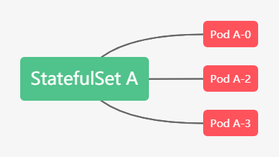
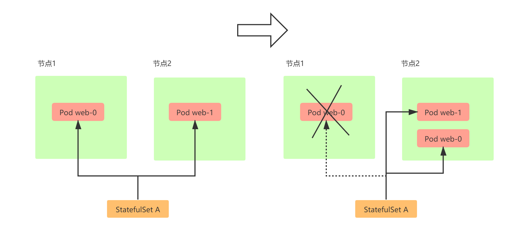

# 5.深入k8s：StatefulSet控制器及其源码分析

> 转载请声明出处哦~，本篇文章发布于luozhiyun的博客：https://www.luozhiyun.com


在上一篇中，讲解了容器持久化存储，从中我们知道什么是PV和PVC，这一篇我们讲通过StatefulSet来使用它们。

这一篇中会添加讲解源码的部分，希望能加深对k8s的理解，源码版本是[1.19](https://github.com/kubernetes/kubernetes/tree/release-1.19)，在阅读源码的时候可以参照着一起看会比较便于理解。

### StatefulSet概念

我们在第三篇讲的Deployment控制器是应用于无状态的应用的，所有的Pod启动之间没有顺序，Deployment可以任意的kill一个Pod不会影响到业务数据，但是这到了有状态的应用中就不管用了。

而StatefulSet就是用来对有状态应用提供支持的控制器。


StatefulSet创建的pod具有唯一的标识和创建和删除顺序的保障，从而主要做到了两件事情：

1. 提供稳定的网络标识。一个StatefulSet创建的每个pod都有一个从零开始的顺序索引。这样可以方便通过主机名来定位pod，例如我们可以创建一个headless Service，通过Service记录每个pod的独立DNS记录来定位到不同的pod，由于pod主机名固定，所以DNS记录也不会变。如下：




2. 提供稳定的专属存储。一个StatefulSet在创建的时候也可以声明需要一个或多个PVC，然后pvc会在创建pod前绑定到pod上。StatefulSet在缩容的时候依然会保留pvc，这样不会导致数据的丢失，在扩容的时候也可以让pvc挂载到相同的pod上。

StatefulSet 的核心功能，就是通过某种方式记录这些状态，然后在 Pod 被重新创建时，能够为新 Pod 恢复这些状态。

### 提供稳定的网络标识

在k8s中，Service是用来将一组 Pod 暴露给外界访问的一种机制。Service可以通过DNS的方式，代理到某一个Pod，然后通过DNS记录的方式解析出被代理 Pod 的 IP 地址。

如下：

```yaml

apiVersion: v1
kind: Service
metadata:
  name: nginx
  labels:
    app: nginx
spec:
  ports:
  - port: 80
    name: web
  clusterIP: None
  selector:
    app: nginx
```

这个Service会通过Label Selector选择所有携带了 app=nginx 标签的 Pod，都会被这个 Service 代理起来。


它所代理的所有 Pod 的 IP 地址，都会被绑定一个这样格式的 DNS 记录，如下所示：

```
<pod-name>.<svc-name>.<namespace>.svc.cluster.local
```

所以通过这个DNS记录，StatefulSet就可以使用到DNS 记录来维持 Pod 的网络状态。

如下：

```yaml
apiVersion: apps/v1
kind: StatefulSet
metadata:
  name: web
spec:
  serviceName: "nginx"
  replicas: 2  # by default is 1
  selector:
    matchLabels:
      app: nginx  # has to match .spec.template.metadata.labels
  template:
    metadata:
      labels:
        app: nginx # has to match .spec.selector.matchLabels
    spec:
      containers:
      - name: nginx
        image: nginx:1.9.1
        ports:
        - containerPort: 80
          name: web
```

这里使用了serviceName=nginx，表明StatefulSet 控制器会使用nginx 这个Service来进行网络代理。


我们可以如下创建：

```shell
$ kubectl create -f svc.yaml
$ kubectl get service nginx
NAME      TYPE         CLUSTER-IP   EXTERNAL-IP   PORT(S)   AGE
nginx     ClusterIP    None         <none>        80/TCP    10s

$ kubectl create -f statefulset.yaml
$ kubectl get statefulset web
NAME      DESIRED   CURRENT   AGE
web       2         1         19s
```

然后我们可以观察pod的创建情况：

```shell
$ kubectl get pods -w -l app=nginx

NAME    READY   STATUS    RESTARTS   AGE
web-0   1/1     Running   0          76m
web-1   1/1     Running   0          76m
```

我们通过-w命令可以看到pod创建情况，StatefulSet所创建的pod编号都是从0开始累加，在 web-0 进入到 Running 状态、并且细分状态（Conditions）成为 Ready 之前，web-1 会一直处于 Pending 状态。


然后我们使用exec查看pod的hostname：

```shell
$ kubectl exec web-0 -- sh -c 'hostname'
web-0
$ kubectl exec web-1 -- sh -c 'hostname'
web-1
```

然后我们可以启动一个一次性的pod用 nslookup 命令，解析一下 Pod 对应的 Headless Service：

```shell
$ kubectl run -i --tty --image busybox:1.28.4 dns-test --restart=Never --rm /bin/sh
$ nslookup web-0.nginx
Server:    10.68.0.2
Address 1: 10.68.0.2 kube-dns.kube-system.svc.cluster.local

Name:      web-0.nginx
Address 1: 172.20.0.56 web-0.nginx.default.svc.cluster.local

$ nslookup web-1.nginx
Server:    10.68.0.2
Address 1: 10.68.0.2 kube-dns.kube-system.svc.cluster.local

Name:      web-1.nginx
Address 1: 172.20.0.57 web-1.nginx.default.svc.cluster.local
```

如果我们删除了这两个pod，然后观察pod情况：

```shell
$ kubectl delete pod -l app=nginx

$ kubectl get pod -w -l app=nginx
web-0   1/1     Terminating   0          83m
web-1   1/1     Terminating   0          83m
web-0   0/1     Pending       0          0s
web-1   0/1     Terminating   0          83m
web-0   0/1     ContainerCreating   0          0s
web-0   1/1     Running             0          1s
web-1   0/1     Pending             0          0s
web-1   0/1     ContainerCreating   0          0s
web-1   1/1     Running             0          1s
```

当我们把这两个 Pod 删除之后，Kubernetes 会按照原先编号的顺序，创建出了两个新的 Pod。并且，Kubernetes 依然为它们分配了与原来相同的“网络身份”：web-0.nginx 和 web-1.nginx。



但是网络结构虽然没变，但是pod对应的ip是改变了的，我们再进入到pod进行DNS解析：

```shell
$ nslookup web-0.nginx
Server:    10.68.0.2
Address 1: 10.68.0.2 kube-dns.kube-system.svc.cluster.local

Name:      web-0.nginx
Address 1: 172.20.0.59 web-0.nginx.default.svc.cluster.local

$ nslookup web-1.nginx
Server:    10.68.0.2
Address 1: 10.68.0.2 kube-dns.kube-system.svc.cluster.local

Name:      web-1.nginx
Address 1: 172.20.0.60 web-1.nginx.default.svc.cluster.local
```


### 提供稳定的专属存储

在讲存储状态的时候，需要大家掌握上一节有关pv和pvc的知识才好往下继续，建议大家看完再来看本节。

在上一节中，我们了解到Kubernetes 中 PVC 和 PV 的设计，实际上类似于“接口”和“实现”的思想。而 PVC、PV 的设计，也使得 StatefulSet 对存储状态的管理成为了可能。


比如我们声明一个如下的StatefulSet：

```yaml
apiVersion: apps/v1
kind: StatefulSet
metadata:
  name: web
spec:
  serviceName: "nginx"
  replicas: 1
  selector:
    matchLabels:
      app: nginx
  template:
    metadata:
      labels:
        app: nginx
    spec:
      containers:
      - name: nginx
        image: nginx:1.9.1
        ports:
        - containerPort: 80
          name: web
        volumeMounts:
        - name: local-volume-a
          mountPath: /usr/share/nginx/html
  volumeClaimTemplates:
  - metadata:
      name: local-volume-a
    spec:
      accessModes:
      - ReadWriteMany
      storageClassName: "local-volume"
      resources:
        requests:
          storage: 512Mi
      selector:
        matchLabels:
          key: local-volume-a-0
```

在这个StatefulSet中添加了volumeClaimTemplates字段，用来声明对应的PVC的定义；也就是说这个PVC中使用的storageClass必须是local-volume，需要的存储空间是512Mi，并且这个pvc对应的pv的标签必须是key: local-volume-a-0。


然后我们准备一个PV：

```yaml
apiVersion: v1
kind: PersistentVolume
metadata:
  name: local-volume-pv-0
  labels:
    key: local-volume-a-0
spec:
  capacity:
    storage: 0.5Gi
  volumeMode: Filesystem
  accessModes:
  - ReadWriteMany
  persistentVolumeReclaimPolicy: Retain
  storageClassName: local-volume
  local:
    path: /mnt/disks/vol1
  nodeAffinity:
    required:
      nodeSelectorTerms:
      - matchExpressions:
        - key: kubernetes.io/hostname
          operator: In
          values:
          - node1
```

我把这个PV创建在node1节点上，并且将本地磁盘挂载声明为PV。

然后我们创建这个PV：

```shell
$ kubectl apply -f local-pv-web-0.yaml

$ kubectl get pv
NAME                CAPACITY   ACCESS MODES   RECLAIM POLICY   STATUS      CLAIM
               STORAGECLASS   REASON   AGE
local-volume-pv-0   512Mi      RWX            Retain           Available       default/local-vo
```


然后我们在创建这个StatefulSet的时候，会自动创建PVC：

```shell
$ kubectl apply -f statefulset2.yaml

$ kubectl get pvc
NAME                   STATUS   VOLUME              CAPACITY   ACCESS MODES   STORAGECLASS   AGE
local-volume-a-web-0   Bound    local-volume-pv-0   512Mi      RWX            local-volume   15m
```

创建的PVC名字都是由：<PVC 名字 >-<StatefulSet 名字 >-< 编号 >构成，编号从0开始，并且我们可以看到上面的PV已经处于Bound**状态**。


这个时候我们进入到Pod中，写入一个文件：

```shell
$ kubectl exec -it web-0  -- /bin/bash

$ echo helloword >/usr/share/nginx/html/index.html
```

这样就会在Pod 的 Volume 目录里写入一个文件。

#### StatefulSet的缩容与扩容

如果我们把StatefulSet进行缩容，那么StatefulSet会删除将pod的顺序由大到小删除。在删除完相应的pod之后，对应的PVC并不会被删除，如果需要释放特定的持久卷时，需要手动删除对应的持久卷声明。

如果我们再把StatefulSet进行扩容，新创建的pod还是会和原来的PVC相互绑定，新的pod实例会运行到与之前完全一致的状态。

### 更新策略

在 Kubernetes 1.7 及之后的版本中，可以为 StatefulSet 设定 `.spec.updateStrategy` 字段。

#### OnDelete

如果 StatefulSet 的 `.spec.updateStrategy.type` 字段被设置为 OnDelete，当您修改 `.spec.template` 的内容时，StatefulSet Controller 将不会自动更新其 Pod。您必须手工删除 Pod，此时 StatefulSet Controller 在重新创建 Pod 时，使用修改过的 `.spec.template` 的内容创建新 Pod。

例如我们执行下面的语句更新上面例子中创建的web：

```shell
$ kubectl set image statefulset web nginx=nginx:1.18.0

$ kubectl describe pod web-0
....
Containers:
  nginx:
    Container ID:   docker://7e45cd509db74a96b4f6ca4d9f7424b3c4794f56e28bfc3fbf615525cd2ecadb
    Image:          nginx:1.9.1
....
```

然后我们发现pod的nginx版本并没有发生改变，需要我们手动删除pod之后才能生效。

```shell
$ kubectl delete pod web-0
pod "web-0" deleted

$ kubectl describe pod web-0
...
Containers:
  nginx:
    Container ID:   docker://0f58b112601a39f3186480aa97e72767b05fdfa6f9ca02182d3fb3b75c159ec0
    Image:          nginx:1.18.0
...
```

#### Rolling Updates

`.spec.updateStrategy.type` 字段的默认值是 RollingUpdate，该策略为 StatefulSet 实现了 Pod 的自动滚动更新。在更新完`.spec.tempalte` 字段后StatefulSet Controller 将自动地删除并重建 StatefulSet 中的每一个 Pod。

删除和重建的顺序也是有讲究的：

* 删除的时候从序号最大的开始删，每删除一个会更新一个。
* 只有更新完的pod已经是ready状态了才往下继续更新。

#### 为 RollingUpdate 进行分区

当为StatefulSet 的 `RollingUpdate` 字段的指定 `partition` 字段的时候，则所有序号大于或等于 `partition` 值的 Pod 都会更新。序号小于 `partition` 值的所有 Pod 都不会更新，即使它们被删除，在重新创建时也会使用以前的版本。

如果 `partition` 值大于其 `replicas` 数，则更新不会传播到其 Pod。这样可以实现金丝雀发布Canary Deploy或者灰度发布。

如下，因为我们的web是2个pod组成，所以可以将`partition`设置为1：

```shell
$ kubectl patch statefulset web -p '{"spec":{"updateStrategy":{"type":"RollingUpdate","rollingUpdate":{"partition":1}}}}'
```

在这里，我使用了 kubectl patch 命令。它的意思是，以“补丁”的方式（JSON 格式的）修改一个 API 对象的指定字段。

下面我们执行更新：

```shell
$ kubectl set image statefulset  web nginx=nginx:1.19.1
statefulset.apps/web image updated
```

并在另一个终端中watch pod的变化：

```shell
$ kubectl get pods -l app=nginx -w
NAME    READY   STATUS    RESTARTS   AGE
web-0   1/1     Running   0          13m
web-1   1/1     Running   0          93s
web-1   0/1     Terminating   0          2m16s
web-1   0/1     Pending       0          0s
web-1   0/1     ContainerCreating   0          0s
web-1   1/1     Running             0          16s
```

可见上面只有一个web-1进行了版本的发布。

### 源码分析

在k8s中，有三个文件stateful_pod_control.go、stateful_set.go、stateful_set_control.go共同完成了对statefulset的实现。主要实现是stateful_pod_control.go中的realStatefulPodControl执行pod具体创建、删除、更新等操作；stateful_set_control.go的defaultStatefulSetControl实现了StatefulSet各个策略逻辑的处理；stateful_set.go的StatefulSetController是StatefulSet的执行入口。


调用次序是：StatefulSetController#sync-->StatefulSetController#syncStatefulSet-->defaultStatefulSetControl#UpdateStatefulSet-->defaultStatefulSetControl#performUpdate-->defaultStatefulSetControl#updateStatefulSet-->realStatefulPodControl中的各个pod操作方法

stateful_set.go中的StatefulSetController是statefulset启动初始化的地方，所有的controller都是会执行到核心sync方法中，然后才对相应的pod进行操作，所以我们直接先看这个方法。


**StatefulSetController#sync**

```go
func (ssc *StatefulSetController) sync(key string) error {
	...
	//获取选择器
	selector, err := metav1.LabelSelectorAsSelector(set.Spec.Selector)
	if err != nil {
		utilruntime.HandleError(fmt.Errorf("error converting StatefulSet %v selector: %v", key, err))
		// This is a non-transient error, so don't retry.
		return nil
	}

	if err := ssc.adoptOrphanRevisions(set); err != nil {
		return err
	}
	//根据选择器拿到对应的pod列表
	pods, err := ssc.getPodsForStatefulSet(set, selector)
	if err != nil {
		return err
	}
	//往下执行sync操作
	return ssc.syncStatefulSet(set, pods)
}
```

然后我们接着往下看：

```go
func (ssc *StatefulSetController) syncStatefulSet(set *apps.StatefulSet, pods []*v1.Pod) error {
	klog.V(4).Infof("Syncing StatefulSet %v/%v with %d pods", set.Namespace, set.Name, len(pods)) 
	//这里会调用到StatefulSetControlInterface的实现的UpdateStatefulSet方法中
	if err := ssc.control.UpdateStatefulSet(set.DeepCopy(), pods); err != nil {
		return err
	}
	klog.V(4).Infof("Successfully synced StatefulSet %s/%s successful", set.Namespace, set.Name)
	return nil
}
```

这里会调用到stateful_set_control.go文件中的StatefulSetControlInterface的实现defaultStatefulSetControl类中的UpdateStatefulSet方法中。


**defaultStatefulSetControl#UpdateStatefulSet**

```go
func (ssc *defaultStatefulSetControl) UpdateStatefulSet(set *apps.StatefulSet, pods []*v1.Pod) error {

	// list all revisions and sort them
	revisions, err := ssc.ListRevisions(set)
	if err != nil {
		return err
	}
	history.SortControllerRevisions(revisions)
	//StatefulSet主要的更新逻辑
	currentRevision, updateRevision, err := ssc.performUpdate(set, pods, revisions)
	if err != nil {
		return utilerrors.NewAggregate([]error{err, ssc.truncateHistory(set, pods, revisions, currentRevision, updateRevision)})
	}

	// maintain the set's revision history limit
	return ssc.truncateHistory(set, pods, revisions, currentRevision, updateRevision)
}
```

在UpdateStatefulSet方法中具体的逻辑都放在了performUpdate中，继续往下走：

**defaultStatefulSetControl#performUpdate**

```go
func (ssc *defaultStatefulSetControl) performUpdate(
	set *apps.StatefulSet, pods []*v1.Pod, revisions []*apps.ControllerRevision) (*apps.ControllerRevision, *apps.ControllerRevision, error) {

	// get the current, and update revisions
	//获取各个Revision，通过不同的Revision来进行版本的控制
	currentRevision, updateRevision, collisionCount, err := ssc.getStatefulSetRevisions(set, revisions)
	if err != nil {
		return currentRevision, updateRevision, err
	}

	// perform the main update function and get the status
	//主要执行更新操作，包括pod的创建、更新、删除，并返回最后的StatefulSet执行状态
	status, err := ssc.updateStatefulSet(set, currentRevision, updateRevision, collisionCount, pods)
	if err != nil {
		return currentRevision, updateRevision, err
	}

	// update the set's status
	//最后更新StatefulSet的状态
	err = ssc.updateStatefulSetStatus(set, status)
	if err != nil {
		return currentRevision, updateRevision, err
	}
	...
}
```

这个方法主要分三步：

1. 获取目前StatefulSet各个Revision的情况；
2. 执行具体的更新操作；
3. 最后将StatefulSet的运行状态进行更新；


接下来进入到核心的方法中，这个方法很长，会分成几段进行说明：

**defaultStatefulSetControl#updateStatefulSet**

```go
func (ssc *defaultStatefulSetControl) updateStatefulSet(
	set *apps.StatefulSet,
	currentRevision *apps.ControllerRevision,
	updateRevision *apps.ControllerRevision,
	collisionCount int32,
	pods []*v1.Pod) (*apps.StatefulSetStatus, error) {
    ...
	//将pod列表区分为有效的和失效的列表
	for i := range pods {
		status.Replicas++

		// count the number of running and ready replicas
		//如果已经ready了，那么计数加一
		if isRunningAndReady(pods[i]) {
			status.ReadyReplicas++
		}

		// count the number of current and update replicas
		//为需要更新的pod计数
		if isCreated(pods[i]) && !isTerminating(pods[i]) {
			if getPodRevision(pods[i]) == currentRevision.Name {
				status.CurrentReplicas++
			}
			if getPodRevision(pods[i]) == updateRevision.Name {
				status.UpdatedReplicas++
			}
		}
		//getOrdinal是获取pod的序号
		if ord := getOrdinal(pods[i]); 0 <= ord && ord < replicaCount {
			// if the ordinal of the pod is within the range of the current number of replicas,
			// insert it at the indirection of its ordinal
			replicas[ord] = pods[i]
		//	如果序号大于statefulset设置的副本数，那么放入到condemned集合中，等待销毁
		} else if ord >= replicaCount {
			// if the ordinal is greater than the number of replicas add it to the condemned list
			condemned = append(condemned, pods[i])
		}
		// If the ordinal could not be parsed (ord < 0), ignore the Pod.
	}

	// for any empty indices in the sequence [0,set.Spec.Replicas) create a new Pod at the correct revision
	//如果对应的序号中没有对应的pod，那么需要创建新的pod
	for ord := 0; ord < replicaCount; ord++ {
		if replicas[ord] == nil {
			replicas[ord] = newVersionedStatefulSetPod(
				currentSet,
				updateSet,
				currentRevision.Name,
				updateRevision.Name, ord)
		}
	}

	// sort the condemned Pods by their ordinals
	sort.Sort(ascendingOrdinal(condemned))

	// find the first unhealthy Pod
	//找到副本集合中状态不正常的pod
	for i := range replicas {
		if !isHealthy(replicas[i]) {
			unhealthy++
			//找到第一个不正常的pod的序号
			if ord := getOrdinal(replicas[i]); ord < firstUnhealthyOrdinal {
				firstUnhealthyOrdinal = ord
				firstUnhealthyPod = replicas[i]
			}
		}
	}
	//从失效pod集合中找到第一个不正常pod的序号
	for i := range condemned {
		if !isHealthy(condemned[i]) {
			unhealthy++
			if ord := getOrdinal(condemned[i]); ord < firstUnhealthyOrdinal {
				firstUnhealthyOrdinal = ord
				firstUnhealthyPod = condemned[i]
			}
		}
	}
    ...
}
```

这段代码会遍历pod列表，然后将pod分表存到replicas列表和condemned列表中，在condemned列表中的pod表示这些pod是多余的，超过了statefulset设置的副本数，需要被删除掉的；

然后会继续遍历replicas列表和condemned列表，找到pod中序号最小的不健康的pod，不健康的pod定义如下：

```go
func isHealthy(pod *v1.Pod) bool {
	return isRunningAndReady(pod) && !isTerminating(pod)
}
```


然后我们继续往下：

```go
func (ssc *defaultStatefulSetControl) updateStatefulSet(
	set *apps.StatefulSet,
	currentRevision *apps.ControllerRevision,
	updateRevision *apps.ControllerRevision,
	collisionCount int32,
	pods []*v1.Pod) (*apps.StatefulSetStatus, error) {
	...
	//检查StatefulSet是否已经被删除
	if set.DeletionTimestamp != nil {
		return &status, nil
	}
	//我们默认的状态是OrderedReady，所以monotonic是true
	//也就是说在扩缩容的时候会等待pod状态为ready才会继续
	monotonic := !allowsBurst(set)

	// Examine each replica with respect to its ordinal
	//检查副本集合里面是不是所有的pod都遵循序号递增原则
	for i := range replicas {
		// delete and recreate failed pods
		//删除然后创新创建 fail状态的pod
		if isFailed(replicas[i]) {
			ssc.recorder.Eventf(set, v1.EventTypeWarning, "RecreatingFailedPod",
				"StatefulSet %s/%s is recreating failed Pod %s",
				set.Namespace,
				set.Name,
				replicas[i].Name)
			if err := ssc.podControl.DeleteStatefulPod(set, replicas[i]); err != nil {
				return &status, err
			}
			if getPodRevision(replicas[i]) == currentRevision.Name {
				status.CurrentReplicas--
			}
			if getPodRevision(replicas[i]) == updateRevision.Name {
				status.UpdatedReplicas--
			}
			status.Replicas--
			replicas[i] = newVersionedStatefulSetPod(
				currentSet,
				updateSet,
				currentRevision.Name,
				updateRevision.Name,
				i)
		}
		// If we find a Pod that has not been created we create the Pod
		//如果发现一个pod还没被创建，那么创建一下这个pod
		if !isCreated(replicas[i]) {
			if err := ssc.podControl.CreateStatefulPod(set, replicas[i]); err != nil {
				return &status, err
			}
			status.Replicas++
			if getPodRevision(replicas[i]) == currentRevision.Name {
				status.CurrentReplicas++
			}
			if getPodRevision(replicas[i]) == updateRevision.Name {
				status.UpdatedReplicas++
			}

			// if the set does not allow bursting, return immediately
			if monotonic {
				return &status, nil
			}
			// pod created, no more work possible for this round
			continue
		}
		// If we find a Pod that is currently terminating, we must wait until graceful deletion
		// completes before we continue to make progress.
		//如果发现这个pod处于terminating状态，需要等到这个pod被优雅的删除后才继续执行，所以先return
		if isTerminating(replicas[i]) && monotonic {
			klog.V(4).Infof(
				"StatefulSet %s/%s is waiting for Pod %s to Terminate",
				set.Namespace,
				set.Name,
				replicas[i].Name)
			return &status, nil
		}
		// If we have a Pod that has been created but is not running and ready we can not make progress.
		// We must ensure that all for each Pod, when we create it, all of its predecessors, with respect to its
		// ordinal, are Running and Ready.
		//如果一个pod不是处于running和ready中动态，那么也不能继续
		if !isRunningAndReady(replicas[i]) && monotonic {
			klog.V(4).Infof(
				"StatefulSet %s/%s is waiting for Pod %s to be Running and Ready",
				set.Namespace,
				set.Name,
				replicas[i].Name)
			return &status, nil
		}
		// Enforce the StatefulSet invariants
		if identityMatches(set, replicas[i]) && storageMatches(set, replicas[i]) {
			continue
		}
		// Make a deep copy so we don't mutate the shared cache
		replica := replicas[i].DeepCopy()
		//指定更新操作
		if err := ssc.podControl.UpdateStatefulPod(updateSet, replica); err != nil {
			return &status, err
		}
	}
    ...
}
```

首先会检查StatefulSet是否已经被删除，如果被删除了直接返回就好了；

在遍历replicas之前会获取一个monotonic参数，表示是否串行更新，默认是OrderedReady，表示串行执行，也就是说如果是那么在扩缩容的时候，如果发现有pod不是处于ready状态都会等待。

在遍历replicas的时候如果发现pod处于fail状态，那么会删除之后重新创建；

如果该pod还没有创建，那么会直接创建，如果pod处于Terminating，那么需要等待直到这个pod被优雅的删除后才继续执行，所以先return，等待下一次的syncLoop继续处理；

如果一个pod不是处于running和ready中动态，那么也不能继续，先return，等待下一次的syncLoop继续处理；


继续往下：

```go
func (ssc *defaultStatefulSetControl) updateStatefulSet(
	set *apps.StatefulSet,
	currentRevision *apps.ControllerRevision,
	updateRevision *apps.ControllerRevision,
	collisionCount int32,
	pods []*v1.Pod) (*apps.StatefulSetStatus, error) {
	...
	//遍历condemned列表的时候是从后往前遍历的，扩容将优于更新
	for target := len(condemned) - 1; target >= 0; target-- {
		// wait for terminating pods to expire
		//等待处于Terminating的pod终止
		if isTerminating(condemned[target]) {
			klog.V(4).Infof(
				"StatefulSet %s/%s is waiting for Pod %s to Terminate prior to scale down",
				set.Namespace,
				set.Name,
				condemned[target].Name)
			// block if we are in monotonic mode
			if monotonic {
				return &status, nil
			}
			continue
		}
		// if we are in monotonic mode and the condemned target is not the first unhealthy Pod block
		//如果pod没有处于Running 或Ready状态，并且这个pod不是第一个不正常的pod，那么等待此pod运行
		if !isRunningAndReady(condemned[target]) && monotonic && condemned[target] != firstUnhealthyPod {
			klog.V(4).Infof(
				"StatefulSet %s/%s is waiting for Pod %s to be Running and Ready prior to scale down",
				set.Namespace,
				set.Name,
				firstUnhealthyPod.Name)
			return &status, nil
		}
		klog.V(2).Infof("StatefulSet %s/%s terminating Pod %s for scale down",
			set.Namespace,
			set.Name,
			condemned[target].Name)
		//删除此pod
		if err := ssc.podControl.DeleteStatefulPod(set, condemned[target]); err != nil {
			return &status, err
		}
		if getPodRevision(condemned[target]) == currentRevision.Name {
			status.CurrentReplicas--
		}
		if getPodRevision(condemned[target]) == updateRevision.Name {
			status.UpdatedReplicas--
		}
		if monotonic {
			return &status, nil
		}
	}
    ...
}
```

遍历condemned的时候是从后往前遍历，然后校验pod的状态；

如果pod处于处于Terminating，那么需要等待pod终止，先return；

如果pod没有处于Running 或Ready状态，并且这个pod不是第一个不正常的pod，那么等待此pod运行；

状态没有异常之后删除该pod，然后return，等待下一次的syncLoop 。


继续：

```go
func (ssc *defaultStatefulSetControl) updateStatefulSet(
	set *apps.StatefulSet,
	currentRevision *apps.ControllerRevision,
	updateRevision *apps.ControllerRevision,
	collisionCount int32,
	pods []*v1.Pod) (*apps.StatefulSetStatus, error) {
	...
	//如果UpdateStrategy是OnDelete，那么pod需要手动删除，所以直接返回
	if set.Spec.UpdateStrategy.Type == apps.OnDeleteStatefulSetStrategyType {
		return &status, nil
	}

	// we compute the minimum ordinal of the target sequence for a destructive update based on the strategy.
	updateMin := 0
	//滚动更新策略，没有设置Partition，那么默认是0
	if set.Spec.UpdateStrategy.RollingUpdate != nil {
		updateMin = int(*set.Spec.UpdateStrategy.RollingUpdate.Partition)
	}
	// we terminate the Pod with the largest ordinal that does not match the update revision.
	//只会更新序号大于updateMin的pod，并且是倒序更新
	for target := len(replicas) - 1; target >= updateMin; target-- {

		// delete the Pod if it is not already terminating and does not match the update revision.、
		//如果该pod状态不是terminating，并且该pod没有被更新，那么删除该pod
		if getPodRevision(replicas[target]) != updateRevision.Name && !isTerminating(replicas[target]) {
			klog.V(2).Infof("StatefulSet %s/%s terminating Pod %s for update",
				set.Namespace,
				set.Name,
				replicas[target].Name)
			err := ssc.podControl.DeleteStatefulPod(set, replicas[target])
			status.CurrentReplicas--
			return &status, err
		}

		// wait for unhealthy Pods on update
		if !isHealthy(replicas[target]) {
			klog.V(4).Infof(
				"StatefulSet %s/%s is waiting for Pod %s to update",
				set.Namespace,
				set.Name,
				replicas[target].Name)
			return &status, nil
		}

	}
	return &status, nil
}
```

到这里的时候校验UpdateStrategy策略是不是OnDelete，如果是，那么pod需要手动删除，所以直接返回；

然后校验是不是滚动更新，并且查看有没有设置Partition，Partition没有设置默认为0；

然后遍历更新replicas，顺序也是从后往前进行更新，但是会只会更新序号大于Partition的pod。滚动更新的时候会都会判断当前的状态是不是terminating，然后删除该pod，而不会再去看monotonic这个值，这里需要注意一下。

### 总结

StatefulSet把有状态的应用抽象为两种情况：拓扑状态和存储状态。

拓扑状态指的是应用的多个实例之间不是完全对等的关系，包含启动的顺序、创建之后的网络标识等必须保证。

存储状态指的是不同的实例绑定了不同的存储，如Pod A在它的生命周期中读取的数据必须是一致的，哪怕是重启之后还是需要读取到同一个存储。

然后讲解了一下StatefulSet发布更新该如何做，`updateStrategy`策略以及通过`partition`如果实现金丝雀发布等。

最后通过源码，我们更清晰的了解到了statefulset中的创建、更新、删除等操作是如何实现的。

### Reference

https://kubernetes.io/docs/concepts/workloads/controllers/statefulset/

https://github.com/kubernetes/kubernetes/tree/release-1.19

https://draveness.me/kubernetes-statefulset/

https://blog.tianfeiyu.com/source-code-reading-notes/kubernetes/statefulset_controller.html

《 K8s in Action》

《深入理解k8s》