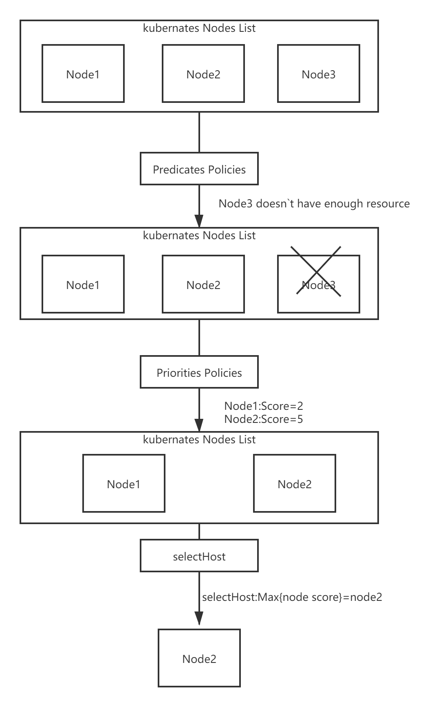

# 9.深入k8s：调度器及其源码分析

> 转载请声明出处哦~，本篇文章发布于luozhiyun的博客：https://www.luozhiyun.com
>
> 源码版本是[1.19](https://github.com/kubernetes/kubernetes/tree/release-1.19)

这次讲解的是k8s的调度器部分的代码，相对来说比较复杂，慢慢的梳理清楚逻辑花费了不少的时间，不过在梳理过程中也对k8s有了一个更深刻的理解。


## 调度的逻辑介绍 

调度器的主要职责，就是为一个新创建出来的 Pod，寻找一个最合适的节点（Node）。[kube-scheduler](https://kubernetes.io/docs/reference/command-line-tools-reference/kube-scheduler/) 就是 Kubernetes 集群的默认调度器。

默认调度器会首先调用一组Filter过滤器，也就是使用相应的Predicates的调度算法来进行过滤。然后，再调用一组叫作 Priority 的调度算法，来给上一步得到的结果里的每个 Node 打分，然后根据打分来对Node进行排序，找出最优节点，如果多个节点都有最高的优先级分数，那么则循环分配，确保平均分配给pod。

调度算法执行完成后，调度器就需要将 Pod 对象的 nodeName 字段的值，修改为上述 Node 的名字。

Filter过滤器的作用主要是从当前集群的所有节点中，“过滤”出一系列符合条件的节点，有如下几种调度策略：

1. GeneralPredicates

   这一组过滤规则，负责的是最基础的调度策略。比如，计算宿主机的 CPU 和内存资源等是否够用； ，等等。

2. Volume过滤规则

   这一组过滤规则，负责的是跟容器持久化 Volume 相关的调度策略。如：检查多个 Pod 声明挂载的持久化 Volume 是否有冲突；检查一个节点上某种类型的持久化 Volume 是不是已经超过了一定数目；检查Pod 对应的 PV 的 nodeAffinity 字段，是否跟某个节点的标签相匹配等等。

3. 检查调度 Pod 是否满足 Node 本身的某些条件

   如PodToleratesNodeTaints负责检查的就是我们前面经常用到的 Node 的“污点”机制。NodeMemoryPressurePredicate，检查的是当前节点的内存是不是已经不够充足。

4. 检查亲密与反亲密关系

   检查待调度 Pod 与 Node 上的已有 Pod 之间的亲密（affinity）和反亲密（anti-affinity）关系。

在调用Filter过滤器的时候需要关注整个集群的信息，Kubernetes 调度器会在为每个待调度 Pod 执行该调度算法之前，先将算法需要的集群信息初步计算一遍，然后缓存起来。这样也可以加快执行速度。

而Priorities里的打分规则包含如：空闲资源（CPU 和 Memory）多的宿主机可以得高权重；CPU和Memory使用都比较均衡则可以得高权重；为了避免这个算法引发调度堆叠如果大镜像分布的节点数目很少，那么这些节点的权重就会被调低等。

整个的流程图如下：



## 源码分析

整个调度过程如流程图：


### 实例化Scheduler对象

代码路径：pkg/scheduler/scheduler.go

Scheduler对象是运行kube-scheduler组件的主对象，所以kube-scheduler会在运行的时候创建一个scheduler对象：

```go
sched, err := scheduler.New(...)
```

调用的scheduler的New方法，这个方法会实例化scheduler对象并返回。

在创建scheduler实例的时候会根据Schedule rAlgorithm Source来实例化调度算法函数：

代码路径：pkg/scheduler/apis/config/types.go

```go
type SchedulerAlgorithmSource struct {
	Policy *SchedulerPolicySource 
	Provider *string
}
```

Policy是通过参数--policy-config-file参数指定调度策略文件来定义策略。

Providre是通用调度器，是kube-scheduler默认调度方式。

然后会根据设置的策略来创建不同的scheduler：

```go
func New(...) (*Scheduler, error) {
    ...
	case source.Provider != nil: 
		sc, err := configurator.createFromProvider(*source.Provider)
		...
	case source.Policy != nil:
		...
		sc, err := configurator.createFromConfig(*policy)       
    ...
}
```

createFromProvider方法里面设置好Filter和Score，也就是过滤策略和打分策略：

代码路径：pkg/scheduler/algorithmprovider/registry.go

```go
func getDefaultConfig() *schedulerapi.Plugins {
	return &schedulerapi.Plugins{
		...
		Filter: &schedulerapi.PluginSet{
			Enabled: []schedulerapi.Plugin{
				{Name: nodeunschedulable.Name},
				{Name: noderesources.FitName},
				{Name: nodename.Name},
				{Name: nodeports.Name},
				{Name: nodeaffinity.Name},
				{Name: volumerestrictions.Name},
				{Name: tainttoleration.Name},
				{Name: nodevolumelimits.EBSName},
				{Name: nodevolumelimits.GCEPDName},
				{Name: nodevolumelimits.CSIName},
				{Name: nodevolumelimits.AzureDiskName},
				{Name: volumebinding.Name},
				{Name: volumezone.Name},
				{Name: podtopologyspread.Name},
				{Name: interpodaffinity.Name},
			},
		},
		...
		Score: &schedulerapi.PluginSet{
			Enabled: []schedulerapi.Plugin{
				{Name: noderesources.BalancedAllocationName, Weight: 1},
				{Name: imagelocality.Name, Weight: 1},
				{Name: interpodaffinity.Name, Weight: 1},
				{Name: noderesources.LeastAllocatedName, Weight: 1},
				{Name: nodeaffinity.Name, Weight: 1},
				{Name: nodepreferavoidpods.Name, Weight: 10000},
				// Weight is doubled because:
				// - This is a score coming from user preference.
				// - It makes its signal comparable to NodeResourcesLeastAllocated.
				{Name: podtopologyspread.Name, Weight: 2},
				{Name: tainttoleration.Name, Weight: 1},
			},
		},
        ...
	}
}
```

最后kube-scheduler处理完一系列的逻辑，最后会调用到Scheduler的run方法：

```go
func (sched *Scheduler) Run(ctx context.Context) {
	if !cache.WaitForCacheSync(ctx.Done(), sched.scheduledPodsHasSynced) {
		return
	}
	sched.SchedulingQueue.Run()
	wait.UntilWithContext(ctx, sched.scheduleOne, 0)
	sched.SchedulingQueue.Close()
}
```

### 调度主逻辑

sched.scheduleOne会被wait.UntilWithContext定时调用，直到ctx.Done()返回true为止。sched.scheduleOne是核心实现，主要做了以下几件事：

1. 通过sched.NextPod()函数从优先队列中获取一个优先级最高的待调度Pod资源对象，如果没有获取到，那么该方法会阻塞住；
2. 通过sched.Algorithm.Schedule调度函数执行Predicates的调度算法与Priorities算法，挑选出一个合适的节点；
3. 当没有找到合适的节点时，调度器会尝试调用prof.RunPostFilterPlugins抢占低优先级的Pod资源对象的节点；
4. 当调度器为Pod资源对象选择了一个合适的节点时，通过sched.bind函数将合适的节点与Pod资源对象绑定在一起；


下面我们直接看一下sched.Algorithm.Schedule方法的实现：

代码路径：pkg/scheduler/core/generic_scheduler.go

```go
//将pod调度到某一node上，如果成功则返回node的名称，如果成功则返回失败信息
func (g *genericScheduler) Schedule(ctx context.Context, prof *profile.Profile, state *framework.CycleState, pod *v1.Pod) (result ScheduleResult, err error) {
	trace := utiltrace.New("Scheduling", utiltrace.Field{Key: "namespace", Value: pod.Namespace}, utiltrace.Field{Key: "name", Value: pod.Name})
	defer trace.LogIfLong(100 * time.Millisecond)
	//检查pod上声明的pvc，包括pvc是否存在，是否已被删除等
	if err := podPassesBasicChecks(pod, g.pvcLister); err != nil {
		return result, err
	}
	trace.Step("Basic checks done")

	if err := g.snapshot(); err != nil {
		return result, err
	}
	trace.Step("Snapshotting scheduler cache and node infos done")

	if g.nodeInfoSnapshot.NumNodes() == 0 {
		return result, ErrNoNodesAvailable
	}

	startPredicateEvalTime := time.Now()
	//这里是Predicates部分的逻辑，负责选出一系列符合条件的节点
	feasibleNodes, filteredNodesStatuses, err := g.findNodesThatFitPod(ctx, prof, state, pod)
	if err != nil {
		return result, err
	}
	trace.Step("Computing predicates done")
	//表示没有 找到合适的节点
	if len(feasibleNodes) == 0 {
		return result, &FitError{
			Pod:                   pod,
			NumAllNodes:           g.nodeInfoSnapshot.NumNodes(),
			FilteredNodesStatuses: filteredNodesStatuses,
		}
	}

	metrics.DeprecatedSchedulingAlgorithmPredicateEvaluationSecondsDuration.Observe(metrics.SinceInSeconds(startPredicateEvalTime))
	metrics.DeprecatedSchedulingDuration.WithLabelValues(metrics.PredicateEvaluation).Observe(metrics.SinceInSeconds(startPredicateEvalTime))

	startPriorityEvalTime := time.Now()
	// When only one node after predicate, just use it.
	//找到唯一的node节点，并返回
	if len(feasibleNodes) == 1 {
		metrics.DeprecatedSchedulingAlgorithmPriorityEvaluationSecondsDuration.Observe(metrics.SinceInSeconds(startPriorityEvalTime))
		return ScheduleResult{
			SuggestedHost:  feasibleNodes[0].Name,
			EvaluatedNodes: 1 + len(filteredNodesStatuses),
			FeasibleNodes:  1,
		}, nil
	}
	//如果节点不是唯一，那么需要进行打分排序
	priorityList, err := g.prioritizeNodes(ctx, prof, state, pod, feasibleNodes)
	if err != nil {
		return result, err
	}

	metrics.DeprecatedSchedulingAlgorithmPriorityEvaluationSecondsDuration.Observe(metrics.SinceInSeconds(startPriorityEvalTime))
	metrics.DeprecatedSchedulingDuration.WithLabelValues(metrics.PriorityEvaluation).Observe(metrics.SinceInSeconds(startPriorityEvalTime))
	//选择最佳的节点
	host, err := g.selectHost(priorityList)
	trace.Step("Prioritizing done")

	return ScheduleResult{
		SuggestedHost:  host,
		EvaluatedNodes: len(feasibleNodes) + len(filteredNodesStatuses),
		FeasibleNodes:  len(feasibleNodes),
	}, err
}
```

这个方法逻辑还是比较清晰的，总共分为如下几部分：

1. 对pod进行校验，检查是否声明了pvc，以及对应的pvc是否已经被删除等；
2. 调用findNodesThatFitPod方法，负责选出一系列符合条件的节点；
3. 如果没有找到节点或唯一节点，那么直接返回；
4. 如果找到的节点数超过1，那么需要调用prioritizeNodes方法，进行打分排序；
5. 最后调用selectHost选出合适的唯一节点，并返回。

### Filter过滤筛选节点

下面我们看看findNodesThatFitPod时如何实现筛选过滤的。

代码位置：pkg/scheduler/core/generic_scheduler.go

```go
func (g *genericScheduler) findNodesThatFitPod(ctx context.Context, prof *profile.Profile, state *framework.CycleState, pod *v1.Pod) ([]*v1.Node, framework.NodeToStatusMap, error) {
	filteredNodesStatuses := make(framework.NodeToStatusMap)
 
	//前置过滤插件用于预处理 Pod 的相关信息，或者检查集群或 Pod 必须满足的某些条件。
	//如果 PreFilter 插件返回错误，则调度周期将终止
	s := prof.RunPreFilterPlugins(ctx, state, pod)
	if !s.IsSuccess() {
		if !s.IsUnschedulable() {
			return nil, nil, s.AsError()
		}
		// All nodes will have the same status. Some non trivial refactoring is
		// needed to avoid this copy.
		allNodes, err := g.nodeInfoSnapshot.NodeInfos().List()
		if err != nil {
			return nil, nil, err
		}
		for _, n := range allNodes {
			filteredNodesStatuses[n.Node().Name] = s
		}
		return nil, filteredNodesStatuses, nil

	}
	//过滤掉不符合条件的node
	feasibleNodes, err := g.findNodesThatPassFilters(ctx, prof, state, pod, filteredNodesStatuses)
	if err != nil {
		return nil, nil, err
	}
	//SchdulerExtender是kubernets外部扩展方式，用户可以根据需求独立构建调度服务
	feasibleNodes, err = g.findNodesThatPassExtenders(pod, feasibleNodes, filteredNodesStatuses)
	if err != nil {
		return nil, nil, err
	}
	return feasibleNodes, filteredNodesStatuses, nil
}
```

这个方法首先会通过前置过滤器来校验pod是否符合条件，然后调用findNodesThatPassFilters方法过滤掉不符合条件的node。findNodesThatPassExtenders是kubernets留给用户的外部扩展方式，暂且不表。

下面我们接着看findNodesThatPassFilters方法：

```go
func (g *genericScheduler) findNodesThatPassFilters(ctx context.Context, prof *profile.Profile, state *framework.CycleState, pod *v1.Pod, statuses framework.NodeToStatusMap) ([]*v1.Node, error) {
	allNodes, err := g.nodeInfoSnapshot.NodeInfos().List()
	if err != nil {
		return nil, err
	}
	//根据集群节点数量选择参与调度的节点的数量
	numNodesToFind := g.numFeasibleNodesToFind(int32(len(allNodes)))
 
	//初始化一个大小和numNodesToFind一样的数组，用来存放node节点
	feasibleNodes := make([]*v1.Node, numNodesToFind)
	...
	checkNode := func(i int) { 
		//我们从上一个调度周期中离开的节点开始检查节点，以确保所有节点在Pod中被检查的机会相同。
		nodeInfo := allNodes[(g.nextStartNodeIndex+i)%len(allNodes)]
		fits, status, err := PodPassesFiltersOnNode(ctx, prof.PreemptHandle(), state, pod, nodeInfo)
		if err != nil {
			errCh.SendErrorWithCancel(err, cancel)
			return
		}
		//如果该节点合适，那么放入到feasibleNodes列表中
		if fits {
			length := atomic.AddInt32(&feasibleNodesLen, 1)
			if length > numNodesToFind {
				cancel()
				atomic.AddInt32(&feasibleNodesLen, -1)
			} else {
				feasibleNodes[length-1] = nodeInfo.Node()
			}
		} else {
			statusesLock.Lock()
			if !status.IsSuccess() {
				statuses[nodeInfo.Node().Name] = status
			}
			statusesLock.Unlock()
		}
	} 
	... 
	//开启16个线程寻找符合条件的node节点，数量等于feasibleNodes
	parallelize.Until(ctx, len(allNodes), checkNode)
	processedNodes := int(feasibleNodesLen) + len(statuses)
	//设置下次开始寻找node的位置
	g.nextStartNodeIndex = (g.nextStartNodeIndex + processedNodes) % len(allNodes)

	feasibleNodes = feasibleNodes[:feasibleNodesLen]
	if err := errCh.ReceiveError(); err != nil {
		statusCode = framework.Error
		return nil, err
	}
	return feasibleNodes, nil
}
```

在这个方法中首先会根据numFeasibleNodesToFind方法选择参与调度的节点的数量，然后调用parallelize.Until方法开启16个线程来调用checkNode方法寻找合适的节点。


对于numFeasibleNodesToFind的逻辑如下：

```go
func (g *genericScheduler) numFeasibleNodesToFind(numAllNodes int32) (numNodes int32) {
	//对于一个小于100的节点，全部节点参与调度
	//percentageOfNodesToScore参数值是一个集群中所有节点的百分比，范围是1和100之间，0表示不启用
	if numAllNodes < minFeasibleNodesToFind || g.percentageOfNodesToScore >= 100 {
		return numAllNodes
	}

	adaptivePercentage := g.percentageOfNodesToScore
	//当numAllNodes大于100时，如果没有设置percentageOfNodesToScore，那么这里需要计算出一个值
	if adaptivePercentage <= 0 {
		basePercentageOfNodesToScore := int32(50)
		adaptivePercentage = basePercentageOfNodesToScore - numAllNodes/125
		if adaptivePercentage < minFeasibleNodesPercentageToFind {
			adaptivePercentage = minFeasibleNodesPercentageToFind
		}
	}

	numNodes = numAllNodes * adaptivePercentage / 100
	if numNodes < minFeasibleNodesToFind {
		return minFeasibleNodesToFind
	}

	return numNodes
}
```

找出能够进行调度的节点，如果节点小于100，那么全部节点参与调度。

percentageOfNodesToScore参数值是一个集群中所有节点的百分比，范围是1和100之间，0表示不启用。如果集群节点数大于100，那么就会根据这个值来计算让合适的节点数参与调度。

如果一个5000个节点的集群，percentageOfNodesToScore会默认设置为10%，也就是500个节点参与调度。

因为如果一个5000节点的集群来进行调度的话，不进行控制时，每个pod调度都需要尝试5000次的节点预选过程时非常消耗资源的。


然后我们回到findNodesThatPassFilters方法中，我们看一下PodPassesFiltersOnNode是如何筛选出合适的节点的：

```go
func PodPassesFiltersOnNode(
	ctx context.Context,
	ph framework.PreemptHandle,
	state *framework.CycleState,
	pod *v1.Pod,
	info *framework.NodeInfo,
) (bool, *framework.Status, error) {
	var status *framework.Status

	podsAdded := false 
	//待检查的 Node 是一个即将被抢占的节点，调度器就会对这个 Node ，将同样的 Predicates 算法运行两遍。
	for i := 0; i < 2; i++ {
		stateToUse := state
		nodeInfoToUse := info
		//处理优先级pod的逻辑
		if i == 0 {
			var err error
			//查找是否有优先级大于或等于当前pod的NominatedPods，然后加入到nodeInfoToUse中
			podsAdded, stateToUse, nodeInfoToUse, err = addNominatedPods(ctx, ph, pod, state, info)
			if err != nil {
				return false, nil, err
			}
		} else if !podsAdded || !status.IsSuccess() {
			break
		}
		//运行过滤器检查该pod是否能运行在该节点上
		statusMap := ph.RunFilterPlugins(ctx, stateToUse, pod, nodeInfoToUse)
		status = statusMap.Merge()
		if !status.IsSuccess() && !status.IsUnschedulable() {
			return false, status, status.AsError()
		}
	}

	return status.IsSuccess(), status, nil
}
```

这个方法用来检测node是否能通过过滤器，此方法会在调度Schedule和抢占Preempt的时被调用，如果在Schedule时被调用，那么会测试nod，能否可以让所有存在的pod以及更高优先级的pod在该node上运行。如果在抢占时被调用，那么我们首先要移除抢占失败的pod，添加将要抢占的pod。

然后RunFilterPlugins会调用runFilterPlugin方法来运行我们上面讲的getDefaultConfig中设置的过滤器：

```go
func (f *frameworkImpl) runFilterPlugin(ctx context.Context, pl framework.FilterPlugin, state *framework.CycleState, pod *v1.Pod, nodeInfo *framework.NodeInfo) *framework.Status {
	if !state.ShouldRecordPluginMetrics() {
		return pl.Filter(ctx, state, pod, nodeInfo)
	}
	startTime := time.Now()
	status := pl.Filter(ctx, state, pod, nodeInfo)
	f.metricsRecorder.observePluginDurationAsync(Filter, pl.Name(), status, metrics.SinceInSeconds(startTime))
	return status
}
```

过滤器总共有这些：nodeunschedulable,noderesources,nodename,nodeports,nodeaffinity,volumerestrictions,tainttoleration,nodevolumelimits,nodevolumelimits,nodevolumelimits,nodevolumelimits,volumebinding,volumezone,podtopologyspread,interpodaffinity

过滤器太多就不一一看了，里面的逻辑还是很清晰的，感兴趣的自己可以看看具体实现。

### prioritize为节点打分

下面我们继续回到Schedule方法，运行完findNodesThatFitPod后会找到一系列符合条件的node节点，然后会调用prioritizeNodes进行打分排序：

```go
func (g *genericScheduler) prioritizeNodes(
	ctx context.Context,
	prof *profile.Profile,
	state *framework.CycleState,
	pod *v1.Pod,
	nodes []*v1.Node,
) (framework.NodeScoreList, error) {
	... 
	scoresMap, scoreStatus := prof.RunScorePlugins(ctx, state, pod, nodes)
	if !scoreStatus.IsSuccess() {
		return nil, scoreStatus.AsError()
	} 

	// Summarize all scores.
	result := make(framework.NodeScoreList, 0, len(nodes))
	//将分数按照node维度进行汇总
	for i := range nodes {
		result = append(result, framework.NodeScore{Name: nodes[i].Name, Score: 0})
		for j := range scoresMap {
			result[i].Score += scoresMap[j][i].Score
		}
	}
	...
	return result, nil
}
```

prioritizeNodes里面会调用RunScorePlugins方法，里面会遍历一系列的插件的方式为node打分。然后遍历scoresMap将结果按照node维度进行聚合。

```go
func (f *frameworkImpl) RunScorePlugins(ctx context.Context, state *framework.CycleState, pod *v1.Pod, nodes []*v1.Node) (ps framework.PluginToNodeScores, status *framework.Status) {
	...
	//开启16个线程为node进行打分
	parallelize.Until(ctx, len(nodes), func(index int) {
		for _, pl := range f.scorePlugins {
			nodeName := nodes[index].Name
			s, status := f.runScorePlugin(ctx, pl, state, pod, nodeName)
			if !status.IsSuccess() {
				errCh.SendErrorWithCancel(fmt.Errorf(status.Message()), cancel)
				return
			}
			pluginToNodeScores[pl.Name()][index] = framework.NodeScore{
				Name:  nodeName,
				Score: int64(s),
			}
		}
	})
	if err := errCh.ReceiveError(); err != nil {
		msg := fmt.Sprintf("error while running score plugin for pod %q: %v", pod.Name, err)
		klog.Error(msg)
		return nil, framework.NewStatus(framework.Error, msg)
	}
 
	//用于在调度程序计算节点的最终排名之前修改分数,保证 Score 插件的输出必须是 [MinNodeScore，MaxNodeScore]（[0-100]） 范围内的整数
	parallelize.Until(ctx, len(f.scorePlugins), func(index int) {
		pl := f.scorePlugins[index]
		nodeScoreList := pluginToNodeScores[pl.Name()]
		if pl.ScoreExtensions() == nil {
			return
		}
		status := f.runScoreExtension(ctx, pl, state, pod, nodeScoreList)
		if !status.IsSuccess() {
			err := fmt.Errorf("normalize score plugin %q failed with error %v", pl.Name(), status.Message())
			errCh.SendErrorWithCancel(err, cancel)
			return
		}
	})
	if err := errCh.ReceiveError(); err != nil {
		msg := fmt.Sprintf("error while running normalize score plugin for pod %q: %v", pod.Name, err)
		klog.Error(msg)
		return nil, framework.NewStatus(framework.Error, msg)
	}
 
	// 为每个节点的分数乘上一个权重
	parallelize.Until(ctx, len(f.scorePlugins), func(index int) {
		pl := f.scorePlugins[index]
		// Score plugins' weight has been checked when they are initialized.
		weight := f.pluginNameToWeightMap[pl.Name()]
		nodeScoreList := pluginToNodeScores[pl.Name()]

		for i, nodeScore := range nodeScoreList {
			// return error if score plugin returns invalid score.
			if nodeScore.Score > int64(framework.MaxNodeScore) || nodeScore.Score < int64(framework.MinNodeScore) {
				err := fmt.Errorf("score plugin %q returns an invalid score %v, it should in the range of [%v, %v] after normalizing", pl.Name(), nodeScore.Score, framework.MinNodeScore, framework.MaxNodeScore)
				errCh.SendErrorWithCancel(err, cancel)
				return
			}
			nodeScoreList[i].Score = nodeScore.Score * int64(weight)
		}
	})
   	...
	return pluginToNodeScores, nil
}
```

RunScorePlugins里面分别调用parallelize.Until方法跑三次来进行打分：

第一次会调用runScorePlugin方法，里面会调用getDefaultConfig里面设置的score的Plugin来进行打分；

第二次会调用runScoreExtension方法，里面会调用Plugin的NormalizeScore方法，用来保证分数必须是0到100之间，不是每一个plugin都会实现NormalizeScore方法。

第三此会调用遍历所有的scorePlugins，并对对应的算出的来的分数乘以一个权重。

打分的plugin共有：noderesources,imagelocality,interpodaffinity,noderesources,nodeaffinity,nodepreferavoidpods,podtopologyspread,tainttoleration

### selectHost选择合适的节点

在为所有node打完分之后就会调用selectHost方法来挑选一个合适的node：

```go
func (g *genericScheduler) selectHost(nodeScoreList framework.NodeScoreList) (string, error) {
	if len(nodeScoreList) == 0 {
		return "", fmt.Errorf("empty priorityList")
	}
	maxScore := nodeScoreList[0].Score
	selected := nodeScoreList[0].Name
	cntOfMaxScore := 1
	for _, ns := range nodeScoreList[1:] {
		if ns.Score > maxScore {
			maxScore = ns.Score
			selected = ns.Name
			cntOfMaxScore = 1
		} else if ns.Score == maxScore {
			cntOfMaxScore++
			if rand.Intn(cntOfMaxScore) == 0 {
				// Replace the candidate with probability of 1/cntOfMaxScore
				selected = ns.Name
			}
		}
	}
	return selected, nil
}
```

这个方法十分简单，就是挑选分数高的，如果分数相同，那么则随机挑选一个。

## 总结

通过这篇文章我们深入分析了k8s是如何调度节点的，以及调度节点的时候具体做了什么事情，熟悉了整个调度流程。通过对调度流程的掌握，可以直到一个pod被调度到node节点上需要经过Predicates的过滤，然后通过对node的打分，最终选择一个合适的节点进行调度。不过介于Filter以及Score的plugin太多，没有一一去介绍，感兴趣的可以自己去逐个看看。


## Reference

https://kubernetes.io/docs/concepts/scheduling-eviction/kube-scheduler/

https://kubernetes.io/docs/concepts/scheduling-eviction/scheduler-perf-tuning/

https://kubernetes.io/docs/concepts/scheduling-eviction/scheduling-framework/

https://kubernetes.io/docs/concepts/configuration/pod-priority-preemption/

https://www.huweihuang.com/k8s-source-code-analysis/kube-scheduler/preempt.html 

https://my.oschina.net/u/4131034/blog/3162549

https://www.servicemesher.com/blog/202003-k8s-scheduling-framework/