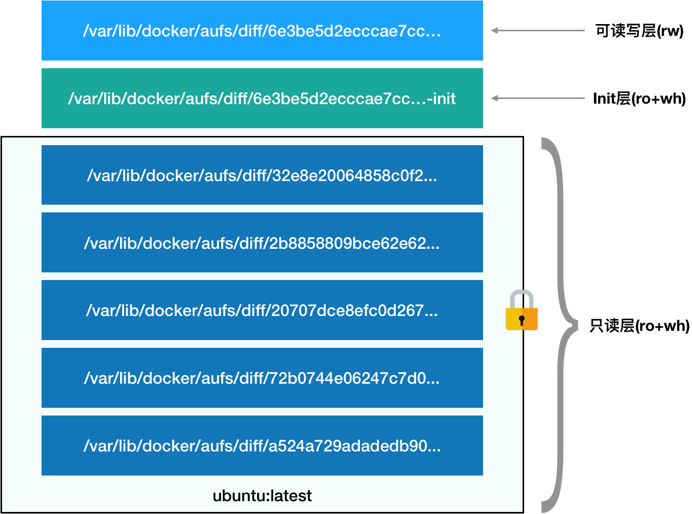
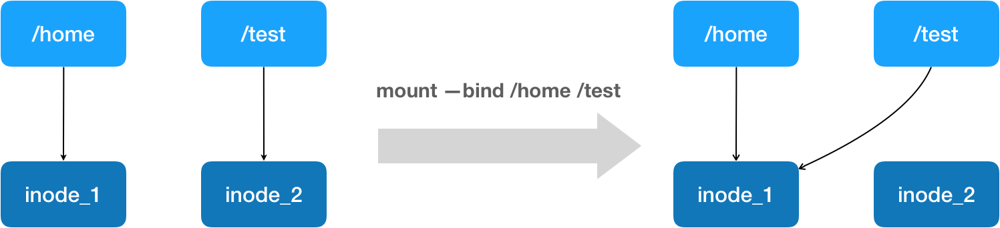

# Docker容器实现原理

### 容器中的进程隔离

容器技术的核心功能，就是通过约束和修改进程的动态表现，从而为其创造出一个“边界”。在Docker中使用了Namespace 技术来修改进程视图从而达到进程隔离的目的。


首先创建一个容器作为例子：

```
$ docker run -it busybox /bin/sh
/ #
```

-it 参数告诉了 Docker 项目在启动容器后，需要给我们分配一个文本输入 / 输出环境，也就是 TTY，跟容器的标准输入相关联，这样我们就可以和这个 Docker 容器进行交互了。而 /bin/sh 就是我们要在 Docker 容器里运行的程序。


如果我们执行如下命令：

```
/ # ps
PID  USER   TIME COMMAND
  1 root   0:00 /bin/sh
  10 root   0:00 ps
```

可以看到，我们在 Docker 里最开始执行的 /bin/sh，就是这个容器内部的第 1 号进程（PID=1）。这就意味着，前面执行的 /bin/sh，以及我们刚刚执行的 ps，已经被 Docker 隔离在了一个跟宿主机完全不同的世界当中。


本来，每当我们在宿主机上运行了一个 /bin/sh 程序，操作系统都会给它分配一个进程编号，比如 PID=100。而现在，我们要通过 Docker 把这个 /bin/sh 程序运行在一个容器当中。


Docker会将宿主机的操作系统里，还是原来的第 100 号进程通过Linux 里面的 Namespace 机制重新进行进程编号。如下：

```
int pid = clone(main_function, stack_size, SIGCHLD, NULL);
```

当我们用 clone() 系统调用创建一个新进程时，就可以在参数中指定 CLONE_NEWPID 参数，比如：

```
int pid = clone(main_function, stack_size, CLONE_NEWPID | SIGCHLD, NULL);
```

新创建的这个进程将会“看到”一个全新的进程空间，在这个进程空间里，它的 PID 是 1。


每个 Namespace 里的应用进程，都会认为自己是当前容器里的第 1 号进程，它们既看不到宿主机里真正的进程空间，也看不到其他 PID Namespace 里的具体情况。


除了我们刚刚用到的 PID Namespace，Linux 操作系统还提供了 Mount、UTS、IPC、Network 和 User 这些 Namespace，用来对各种不同的进程上下文进行“障眼法”操作。


但是，基于 Linux Namespace 的隔离机制相比于虚拟化技术也有很多不足之处，其中最主要的问题就是：隔离得不彻底。

首先，既然容器只是运行在宿主机上的一种特殊的进程，那么多个容器之间使用的就还是同一个宿主机的操作系统内核。


其次，在 Linux 内核中，有很多资源和对象是不能被 Namespace 化的，最典型的例子就是：时间。

这就意味着，如果你的容器中的程序使用 settimeofday(2) 系统调用修改了时间，整个宿主机的时间都会被随之修改，这显然不符合用户的预期。


### 容器中隔离中的资源限制

Linux Cgroups 就是 Linux 内核中用来为进程设置资源限制的一个重要功能。

Linux Cgroups 的全称是 Linux Control Group。它最主要的作用，就是限制一个进程组能够使用的资源上限，包括 CPU、内存、磁盘、网络带宽等等。

此外，Cgroups 还能够对进程进行优先级设置、审计，以及将进程挂起和恢复等操作。


在 Linux 中，Cgroups 给用户暴露出来的操作接口是文件系统，即它以文件和目录的方式组织在操作系统的 /sys/fs/cgroup 路径下。用 mount 指令把它们展示出来，这条命令是：

```
$ mount -t cgroup 
cpuset on /sys/fs/cgroup/cpuset type cgroup (rw,nosuid,nodev,noexec,relatime,cpuset)
cpu on /sys/fs/cgroup/cpu type cgroup (rw,nosuid,nodev,noexec,relatime,cpu)
cpuacct on /sys/fs/cgroup/cpuacct type cgroup (rw,nosuid,nodev,noexec,relatime,cpuacct)
blkio on /sys/fs/cgroup/blkio type cgroup (rw,nosuid,nodev,noexec,relatime,blkio)
memory on /sys/fs/cgroup/memory type cgroup (rw,nosuid,nodev,noexec,relatime,memory)
...
```

可以看到，在 /sys/fs/cgroup 下面有很多诸如 cpuset、cpu、 memory 这样的子目录，也叫子系统。这些都是我这台机器当前可以被 Cgroups 进行限制的资源种类。

比如，对 CPU 子系统来说，我们就可以看到如下几个配置文件，这个指令是：

```
$ ls /sys/fs/cgroup/cpu
cgroup.clone_children cpu.cfs_period_us cpu.rt_period_us  cpu.shares notify_on_release
cgroup.procs      cpu.cfs_quota_us  cpu.rt_runtime_us cpu.stat  tasks
```


下面我们来使用一下cgroup，看看它是如何限制CPU的使用率的。

现在进入 /sys/fs/cgroup/cpu 目录下：

```
root@ubuntu:/sys/fs/cgroup/cpu$ mkdir container
root@ubuntu:/sys/fs/cgroup/cpu$ ls container/
cgroup.clone_children cpu.cfs_period_us cpu.rt_period_us  cpu.shares notify_on_release
cgroup.procs      cpu.cfs_quota_us  cpu.rt_runtime_us cpu.stat  tasks
```

这个目录就称为一个“控制组”。你会发现，操作系统会在你新创建的 container 目录下，自动生成该子系统对应的资源限制文件。


现在，我们在后台执行这样一条脚本：

```shell
$ while : ; do : ; done &
[1] 226
```

显然，它执行了一个死循环，可以把计算机的 CPU 吃到 100%，根据它的输出，我们可以看到这个脚本在后台运行的进程号（PID）是 226。

这样，我们可以用 top 指令来确认一下 CPU 有没有被打满：

```
$ top
%Cpu0 :100.0 us, 0.0 sy, 0.0 ni, 0.0 id, 0.0 wa, 0.0 hi, 0.0 si, 0.0 st
```


下面我们进入到container，看到 container 控制组里的 CPU quota 还没有任何限制（即：-1），CPU period 则是默认的 100 ms（100000 us）：

```
$ cat /sys/fs/cgroup/cpu/container/cpu.cfs_quota_us 
-1
$ cat /sys/fs/cgroup/cpu/container/cpu.cfs_period_us 
100000
```


接下来，我们可以通过修改这些文件的内容来设置限制。比如，向 container 组里的 cfs_quota 文件写入 20 ms（20000 us）：

```
$ echo 20000 > /sys/fs/cgroup/cpu/container/cpu.cfs_quota_us
```

它意味着在每 100 ms 的时间里，被该控制组限制的进程只能使用 20 ms 的 CPU 时间，也就是说这个进程只能使用到 20% 的 CPU 带宽。


接下来，我们把被限制的进程的 PID 写入 container 组里的 tasks 文件，上面的设置就会对该进程生效了：

```
$ echo 226 > /sys/fs/cgroup/cpu/container/tasks 
```

我们可以用 top 指令查看一下：

```
$ top
%Cpu0 : 20.3 us, 0.0 sy, 0.0 ni, 79.7 id, 0.0 wa, 0.0 hi, 0.0 si, 0.0 st
```

可以看到，计算机的 CPU 使用率立刻降到了 20%。


对于 Docker 等 Linux 容器项目来说，它们只需要在每个子系统下面，为每个容器创建一个控制组（即创建一个新目录），然后在启动容器进程之后，把这个进程的 PID 填写到对应控制组的 tasks 文件中就可以了。

想要了解更多的信息，可以看这篇：[Linux 资源管理指南](https://access.redhat.com/documentation/zh-cn/red_hat_enterprise_linux/6/html-single/resource_management_guide/index#idm140538582929664)


### 容器中隔离中的文件系统

如果一个容器需要启动，那么它一定需要提供一个根文件系统（rootfs），容器需要使用这个文件系统来创建一个新的进程，所有二进制的执行都必须在这个根文件系统中。


一个最常见的 rootfs，会包括如下所示的一些目录和文件，比如 /bin，/etc，/proc 等等：

```
$ ls /
bin dev etc home lib lib64 mnt opt proc root run sbin sys tmp usr var
```


为了保证当前的容器进程没有办法访问宿主机器上其他目录，我们在这里还需要通过 libcontainer 提供的 pivot_root 或者 chroot 函数改变进程能够访问个文件目录的根节点。不过，Docker 项目在最后一步的切换上会优先使用 pivot_root 系统调用，如果系统不支持，才会使用 chroot。


通过pivot_root或chroot将容器需要的目录挂载到了容器中，同时也禁止当前的容器进程访问宿主机器上的其他目录，保证了不同文件系统的隔离。


但是rootfs 只是一个操作系统所包含的文件、配置和目录，并不包括操作系统内核。在 Linux 操作系统中，这两部分是分开存放的，操作系统只有在开机启动时才会加载指定版本的内核镜像。


这就意味着，如果你的应用程序需要配置内核参数、加载额外的内核模块，以及跟内核进行直接的交互，你就需要注意了：这些操作和依赖的对象，都是宿主机操作系统的内核，它对于该机器上的所有容器来说是一个“全局变量”，牵一发而动全身。 


我们首先来解释一下，什么是Mount Namespace：

Mount Namespace用来隔离文件系统的挂载点，这样进程就只能看到自己的 mount namespace 中的文件系统挂载点。

进程的Mount Namespace中的挂载点信息可以在 /proc/[pid]/mounts、/proc/[pid]/mountinfo 和 /proc/[pid]/mountstats 这三个文件中找到。


然后我们再来看看什么是根文件系统rootfs：

根文件系统首先是一种文件系统，该文件系统不仅具有普通文件系统的存储数据文件的功能，但是相对于普通的文件系统，它的特殊之处在于，它是内核启动时所挂载（mount）的第一个文件系统，内核代码的映像文件保存在根文件系统中，系统引导启动程序会在根文件系统挂载之后从中把一些初始化脚本（如rcS,inittab）和服务加载到内存中去运行。 


Linux启动时，第一个必须挂载的是根文件系统；若系统不能从指定设备上挂载根文件系统，则系统会出错而退出启动。成功之后可以自动或手动挂载其他的文件系统。 

基于上面两个基础知识，我们知道一个Linux容器，首先应该要有一个文件隔离环境，并且还要实现rootfs。

而在 Linux 操作系统里，有一个名为 chroot 的命令可以实现改变进程的根目录到指定的位置的目的从而实现rootfs。

所以我们的容器进程启动之前重新挂载它的整个根目录“/”。而由于 Mount Namespace 的存在，这个挂载对宿主机不可见，所以就创建了一个独立的隔离环境。


而挂载在容器根目录上、用来为容器进程提供隔离后执行环境的文件系统就是叫做rootfs。

所以，一个最常见的 rootfs，或者说容器镜像，会包括如下所示的一些目录和文件，比如 /bin，/etc，/proc 等等：

```
$ ls /
bin dev etc home lib lib64 mnt opt proc root run sbin sys tmp usr var
```

 

由于有了rootfs之后，所以rootfs 里打包的不只是应用，而是整个操作系统的文件和目录，也就意味着，应用以及它运行所需要的所有依赖，都被封装在了一起。这也就为容器镜像提供了“打包操作系统”的能力。

#### 层（layer）

Docker 在镜像的设计中，引入了层（layer）的概念。也就是说，用户制作镜像的每一步操作，都会生成一个层，也就是一个增量 rootfs。

layer是使用了一种叫作联合文件系统（Union File System）的能力。


Union File System 也叫 UnionFS，最主要的功能是将多个不同位置的目录联合挂载（union mount）到同一个目录下。比如，我现在有两个目录 A 和 B，它们分别有两个文件：

```
$ tree
.
├── A
│  ├── a
│  └── x
└── B
  ├── b
  └── x
```

使用联合挂载的方式，将这两个目录挂载到一个公共的目录 C 上：

```
$ mkdir C
$ mount -t aufs -o dirs=./A:./B none ./C


$ tree ./C
./C
├── a
├── b
└── x
```

比如我们拉取一个镜像：

```
$ docker run -d ubuntu:latest sleep 3600
```

在Docker中，这个所谓的“镜像”，实际上就是一个 Ubuntu 操作系统的 rootfs，它的内容是 Ubuntu 操作系统的所有文件和目录。但是Docker 镜像使用的 rootfs，往往由多个“层”组成：

```
$ docker image inspect ubuntu:latest
...
     "RootFS": {
      "Type": "layers",
      "Layers": [
        "sha256:f49017d4d5ce9c0f544c...",
        "sha256:8f2b771487e9d6354080...",
        "sha256:ccd4d61916aaa2159429...",
        "sha256:c01d74f99de40e097c73...",
        "sha256:268a067217b5fe78e000..."
      ]
    }
```

可以看到，这个 Ubuntu 镜像，实际上由五个层组成。这五个层就是五个增量 rootfs，每一层都是 Ubuntu 操作系统文件与目录的一部分；而在使用镜像时，Docker 会把这些增量联合挂载在一个统一的挂载点上。

这个挂载点就是 /var/lib/docker/aufs/mnt/，比如，这个目录里面正是一个完整的 Ubuntu 操作系统：

```
$ ls /var/lib/docker/aufs/mnt/6e3be5d2ecccae7cc0fcfa2a2f5c89dc21ee30e166be823ceaeba15dce645b3e
bin boot dev etc home lib lib64 media mnt opt proc root run sbin srv sys tmp usr var
```

我们可以在/sys/fs/aufs 下查看被联合挂载在一起的各个层的信息：

```
$ cat /sys/fs/aufs/si_972c6d361e6b32ba/br[0-9]*
/var/lib/docker/aufs/diff/6e3be5d2ecccae7cc...=rw
/var/lib/docker/aufs/diff/6e3be5d2ecccae7cc...-init=ro+wh
/var/lib/docker/aufs/diff/32e8e20064858c0f2...=ro+wh
/var/lib/docker/aufs/diff/2b8858809bce62e62...=ro+wh
/var/lib/docker/aufs/diff/20707dce8efc0d267...=ro+wh
/var/lib/docker/aufs/diff/72b0744e06247c7d0...=ro+wh
/var/lib/docker/aufs/diff/a524a729adadedb90...=ro+wh
```

从这个结构可以看出来，这个容器的 rootfs 由如下图所示的三部分组成：



**第一部分，只读层。**

对应的正是 ubuntu:latest 镜像的五层。它们的挂载方式都是只读（ro+wh）的。

```
$ ls /var/lib/docker/aufs/diff/72b0744e06247c7d0...
etc sbin usr var
$ ls /var/lib/docker/aufs/diff/32e8e20064858c0f2...
run
$ ls /var/lib/docker/aufs/diff/a524a729adadedb900...
bin boot dev etc home lib lib64 media mnt opt proc root run sbin srv sys tmp usr var
```

**第二部分，可读写层。**

它是这个容器的 rootfs 最上面的一层（6e3be5d2ecccae7cc），它的挂载方式为：rw，即 read write。在没有写入文件之前，这个目录是空的。而一旦在容器里做了写操作，你修改产生的内容就会以增量的方式出现在这个层中。


如果删除一个只读的文件，AuFS 会在可读写层创建一个 whiteout 文件，把只读层里的文件“遮挡”起来。

比如，你要删除只读层里一个名叫 foo 的文件，那么这个删除操作实际上是在可读写层创建了一个名叫.wh.foo 的文件。


最上面这个可读写层的作用，就是专门用来存放你修改 rootfs 后产生的增量，无论是增、删、改，都发生在这里。

**第三部分，Init 层。**

它是一个以“-init”结尾的层，夹在只读层和读写层之间。Init 层是 Docker 项目单独生成的一个内部层，专门用来存放 /etc/hosts、/etc/resolv.conf 等信息。

需要这样一层的原因是，这些文件本来属于只读的 Ubuntu 镜像的一部分，但是用户往往需要在启动容器时写入一些指定的值比如 hostname，所以就需要在可读写层对它们进行修改。

但是这些修改往往只对当前的容器有效，并不会执行 docker commit 时，把这些信息连同可读写层一起提交掉。


上面的这张图片非常好的展示了组装的过程，每一个镜像层都是建立在另一个镜像层之上的，同时所有的镜像层都是只读的，只有每个容器最顶层的容器层才可以被用户直接读写，所有的容器都建立在一些底层服务（Kernel）上，包括命名空间、控制组、rootfs 等等，这种容器的组装方式提供了非常大的灵活性，只读的镜像层通过共享也能够减少磁盘的占用。


在最新的 Docker 中，overlay2 取代了 aufs 成为了推荐的存储驱动，但是在没有 overlay2 驱动的机器上仍然会使用 aufs作为 Docker 的默认驱动。

这篇官方文章里详细的介绍了存储驱动：[Docker storage drivers](https://docs.docker.com/storage/storagedriver/select-storage-driver/)。

### Docker exec的实现原理

比如说我们运行了一个Docker容器，我们如果想进入到容器内部进行操作，一般会使用如下命令：

```
docker exec -it {container id} /bin/sh
```

通过使用docker exec 命令进入到了容器当中，那么docker exec 是怎么做到进入容器里的呢？


实际上，Linux Namespace 创建的隔离空间虽然看不见摸不着，但一个进程的 Namespace 信息在宿主机上是确确实实存在的，并且是以一个文件的方式存在。


比如，通过如下指令，你可以看到当前正在运行的 Docker 容器的进程号（PID）：

```
# docker inspect --format '{{ .State.Pid }}' 6e27dcd23489
29659
```

这时，你可以通过查看宿主机的 proc 文件，看到这个 29659 进程的所有 Namespace 对应的文件：

```
(base) [root@VM_243_186_centos ~]# ls -l /proc/29659/ns
总用量 0
lrwxrwxrwx 1 root root 0 7月  14 15:18 cgroup -> cgroup:[4026531835]
lrwxrwxrwx 1 root root 0 7月  14 15:18 ipc -> ipc:[4026532327]
lrwxrwxrwx 1 root root 0 7月  14 15:09 mnt -> mnt:[4026532325]
lrwxrwxrwx 1 root root 0 7月  14 15:09 net -> net:[4026532330]
lrwxrwxrwx 1 root root 0 7月  14 15:18 pid -> pid:[4026532328]
lrwxrwxrwx 1 root root 0 7月  14 15:18 uts -> uts:[4026532326]
```

这也就意味着：一个进程，可以选择加入到某个进程已有的 Namespace 当中，从而达到“进入”这个进程所在容器的目的，这正是 docker exec 的实现原理。

#### setns() 函数

通过 setns() 函数可以将当前进程加入到已有的 namespace 中。setns() 在 C 语言库中的声明如下：

```
#define _GNU_SOURCE
#include <sched.h>
int setns(int fd, int nstype);
```

* fd：表示要加入 namespace 的文件描述符。
* nstype：参数 nstype 让调用者可以检查 fd 指向的 namespace 类型是否符合实际要求。若把该参数设置为 0 表示不检查。


所以说docker exec 这个操作背后，其实是利用了setns调用进入到 namespace从而进行相关的操作。

#### Volume 机制

Volume 机制，允许你将宿主机上指定的目录或者文件，挂载到容器里面进行读取和修改操作。

在 Docker 项目里，它支持两种 Volume 声明方式，可以把宿主机目录挂载进容器的 /test 目录当中：

```
$ docker run -v /test ...
$ docker run -v /home:/test ...
```

在第一种情况下，由于你并没有显示声明宿主机目录，那么 Docker 就会默认在宿主机上创建一个临时目录 /var/lib/docker/volumes/[VOLUME_ID]/_data，然后把它挂载到容器的 /test 目录上。而在第二种情况下，Docker 就直接把宿主机的 /home 目录挂载到容器的 /test 目录上。


镜像的各个层，保存在 /var/lib/docker/aufs/diff 目录下，在容器进程启动后，它们会被联合挂载在 /var/lib/docker/aufs/mnt/ 目录中，这样容器所需的 rootfs 就准备好了。


容器会在 rootfs 准备好之后，在执行 chroot 之前，把 Volume 指定的宿主机目录（比如 /home 目录），挂载到指定的容器目录（比如 /test 目录）在宿主机上对应的目录（即 /var/lib/docker/aufs/mnt/[可读写层 ID]/test）上，这个 Volume 的挂载工作就完成了。


由于执行这个挂载操作时，“容器进程”已经创建了，也就意味着此时 Mount Namespace 已经开启了。所以，这个挂载事件只在这个容器里可见。你在宿主机上，是看不见容器内部的这个挂载点的。从而保证了容器的隔离性不会被 Volume 打破。


这里的挂载技术就是Linux 的绑定挂载（bind mount）机制。它的主要作用就是，允许你将一个目录或者文件，而不是整个设备，挂载到一个指定的目录上。并且，这时你在该挂载点上进行的任何操作，只是发生在被挂载的目录或者文件上，而原挂载点的内容则会被隐藏起来且不受影响。



mount --bind /home /test，会将 /home 挂载到 /test 上。其实相当于将 /test 的 dentry，重定向到了 /home 的 inode。这样当我们修改 /test 目录时，实际修改的是 /home 目录的 inode。


## Reference

* [Docker overview](https://docs.docker.com/get-started/overview/)

* [DOCKER基础技术：LINUX NAMESPACE](https://coolshell.cn/articles/17010.html)

* [DOCKER基础技术：AUFS](https://coolshell.cn/articles/17061.html)

* [DOCKER基础技术：LINUX CGROUP](https://coolshell.cn/articles/17049.html)

* [白话容器基础（二）：隔离与限制](https://time.geekbang.org/column/article/14653)

* [白话容器基础（三）：深入理解容器镜像](https://time.geekbang.org/column/article/17921)

* [白话容器基础（四）：重新认识Docker容器](https://time.geekbang.org/column/article/18119)

  

