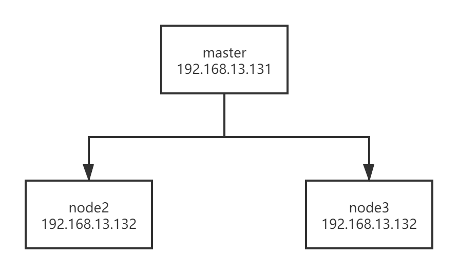

# 1.深入k8s：在k8s中运行第一个程序


## 搭建k8s单点实验环境

由于在国内网络问题，我们无法很好的使用minikube进行部署k8s实验环境，所以可以使用阿里提供的[minikube](https://github.com/AliyunContainerService/minikube)进行搭建。除了minikube，也可以使用[kubeasz](https://github.com/easzlab/kubeasz)进行部署。

下面我基于kubeaze给出部署方法，部署方法都参照https://github.com/easzlab/kubeasz，其中附上我的踩坑经验。

### 1.基础系统配置

- 准备一台虚机配置内存2G/硬盘30G以上
- 最小化安装`Ubuntu 16.04 server`或者`CentOS 7 Minimal`
- 配置基础网络、更新源、SSH登录等

**注意:** 确保在干净的系统上开始安装，不能使用曾经装过kubeadm或其他k8s发行版的环境

### 2.下载文件

- 下载工具脚本easzup，举例使用kubeasz版本2.2.1

``` bash
export release=2.2.1
curl -C- -fLO --retry 3 https://github.com/easzlab/kubeasz/releases/download/${release}/easzup
chmod +x ./easzup
```

- 使用工具脚本下载

默认下载最新推荐k8s/docker等版本，使用命令`./easzup` 查看工具脚本的帮助信息

设置docker源：

```json
{
  "registry-mirrors": [
    "https://eig40bb2.mirror.aliyuncs.com",
    "https://docker.mirrors.ustc.edu.cn",
    "http://hub-mirror.c.163.com",
    "https://reg-mirror.qiniu.com"
  ],
  "max-concurrent-downloads": 10,
  "log-driver": "json-file",
  "log-level": "warn",
  "log-opts": {
    "max-size": "10m",
    "max-file": "3"
    },
  "data-root": "/var/lib/docker"
}
```

添加完之后刷新一下配置：

```
systemctl daemon-reload
systemctl restart docker
```

``` bash
# 举例使用 k8s 版本 v1.18.2，docker 19.03.5
./easzup -D -d 19.03.5 -k v1.18.2
```

- 可选下载离线系统包 (适用于无法使用yum/apt仓库情形)

``` bash
./easzup -P
```

上述脚本运行成功后，所有文件（kubeasz代码、二进制、离线镜像）均已整理好放入目录`/etc/ansible`

- `/etc/ansible` 包含 kubeasz 版本为 ${release} 的发布代码
- `/etc/ansible/bin` 包含 k8s/etcd/docker/cni 等二进制文件
- `/etc/ansible/down` 包含集群安装时需要的离线容器镜像
- `/etc/ansible/down/packages` 包含集群安装时需要的系统基础软件

### 3.安装集群

- 容器化运行 kubeasz，详见[文档](docker_kubeasz.md)

```
./easzup -S
```

- 使用默认配置安装 aio 集群

```
docker exec -it kubeasz easzctl start-aio
```

### 4.验证安装

如果提示kubectl: command not found，退出重新ssh登录一下，环境变量生效即可

``` bash
$ kubectl version         # 验证集群版本     
$ kubectl get node        # 验证节点就绪 (Ready) 状态
$ kubectl get pod -A      # 验证集群pod状态，默认已安装网络插件、coredns、metrics-server等
$ kubectl get svc -A      # 验证集群服务状态
```

## 搭建k8s集群环境

我们打算搭建一个这样的三节点的集群：



### 1. 准备服务器

首先3台虚机，搭建一个多主高可用集群。

- 推荐内存2G/硬盘30G以上
- 最小化安装`Ubuntu 16.04 server`或者`CentOS 7 Minimal`
- 配置基础网络、更新源、SSH登录等

### 2. 在每个节点安装ansible依赖工具

CentOS 7 请执行以下脚本：

```
# 文档中脚本默认均以root用户执行
yum update
# 安装python
yum install python -y
```

安装pip的时候先安装

```
yum -y install epel-release
```

安装pip

```
yum install git python-pip -y
```

pip 安装 ansible

```
# CentOS 7
yum install git python-pip -y
# pip安装ansible(国内如果安装太慢可以直接用pip阿里云加速)
pip install pip --upgrade -i https://mirrors.aliyun.com/pypi/simple/
pip install ansible==2.6.18 netaddr==0.7.19 -i https://mirrors.aliyun.com/pypi/simple/
```

在ansible控制端配置免密码登录

```
# 更安全 Ed25519 算法
ssh-keygen -t ed25519 -N '' -f ~/.ssh/id_ed25519
# 或者传统 RSA 算法
ssh-keygen -t rsa -b 2048 -N '' -f ~/.ssh/id_rsa

ssh-copy-id 192.168.13.131
ssh-copy-id 192.168.13.132
ssh-copy-id 192.168.13.133
```

如果这一步不设置，那么在部署的时候无法访问到相应的节点会报如下错：

```
192.168.13.130 | UNREACHABLE! => {
    "changed": false,
    "msg": "SSH Error: data could not be sent to remote host \"192.168.13.130\". Make sure this host can be reached over ssh",
    "unreachable": true
}
```

### 3.在ansible控制端编排k8s安装

- 4.0 下载项目源码
- 4.1 下载二进制文件
- 4.2 下载离线docker镜像

推荐使用 easzup 脚本下载 4.0/4.1/4.2 所需文件；运行成功后，所有文件（kubeasz代码、二进制、离线镜像）均已整理好放入目录`/etc/ansible`

```
# 下载工具脚本easzup，举例使用kubeasz版本2.0.2
export release=2.0.2
curl -C- -fLO --retry 3 https://github.com/easzlab/kubeasz/releases/download/${release}/easzup
chmod +x ./easzup
# 使用工具脚本下载
./easzup -D
```

### 4.配置集群参数

* 必要配置：`cd /etc/ansible && cp example/hosts.multi-node hosts`, 然后实际情况修改此hosts文件

  根据我们上图的介绍，我们将hosts改成如下：

  ```
  # 'etcd' cluster should have odd member(s) (1,3,5,...)
  # variable 'NODE_NAME' is the distinct name of a member in 'etcd' cluster
  [etcd]
  192.168.13.131 NODE_NAME=etcd1
  192.168.13.132 NODE_NAME=etcd2
  192.168.13.133 NODE_NAME=etcd3
  
  # master node(s)
  [kube-master]
  192.168.13.131
  
  # work node(s)
  [kube-node]
  192.168.13.131
  192.168.13.132
  192.168.13.133
  
  ...
  ```

  只改如上配置，其他的可不动。

* 验证ansible 安装：`ansible all -m ping` 正常能看到节点返回 SUCCESS

* 开始安装 如果你对集群安装流程不熟悉，请阅读项目首页 **安装步骤** 讲解后分步安装，并对 **每步都进行验证**

  ```
  # 分步安装
  ansible-playbook 01.prepare.yml
  ansible-playbook 02.etcd.yml
  ansible-playbook 03.docker.yml
  ansible-playbook 04.kube-master.yml
  ansible-playbook 05.kube-node.yml
  ansible-playbook 06.network.yml
  ansible-playbook 07.cluster-addon.yml
  ```

* 如果不想分步安装，那么可以一步安装：

  ```
  # 一步安装
  #ansible-playbook 90.setup.yml
  ```

  

## 在k8s中运行一个程序

### 编写YAML文件

Kubernetes 跟 Docker 等很多项目最大的不同，就在于它不推荐你使用命令行的方式直接运行容器，而是希望你用 YAML 文件的方式，然后用这样一句指令把它运行起来：

```
$ kubectl create -f 我的配置文件
```

yaml如下：

```yaml
apiVersion: apps/v1
kind: Deployment
metadata:
  name: nginx-deployment
spec:
  selector:
    matchLabels:
      app: nginx
  replicas: 2
  template:
    metadata:
      labels:
        app: nginx
    spec:
      containers:
      - name: nginx
        image: nginx:1.7.9
        ports:
        - containerPort: 80
```

Kind 字段，指定了这个 API 对象的类型（Type），是一个 Deployment。Deployment，是一个定义多副本应用的对象，Deployment 还负责在 Pod 定义发生变化时，对每个副本进行滚动更新。

像这样使用一种 API 对象（Deployment）管理另一种 API 对象（Pod）的方法，在Kubernetes 中，叫作“控制器”模式（controller pattern）。

一个 Kubernetes 的 API 对象的定义，大多可以分为 Metadata 和 Spec 两个部分。前者存放的是这个对象的元数据，对所有 API 对象来说，这一部分的字段和格式基本上是一样的；而后者存放的，则是属于这个对象独有的定义，用来描述它所要表达的功能。

spec.replicas是2，表示定义的 Pod 副本个数。

spec.template作用是描述了我想要创建的 Pod 的细节。spec.containers.image表示容器镜像是nginx:1.7.9，containerPort表示监听的端口是80。

Labels 字段可以用来过滤控制对象，在上面这个 YAML 文件中，Deployment 会把所有正在运行的、携带“app: nginx”标签的 Pod 识别为被管理的对象，并确保这些 Pod 的总数严格等于两个。

spec.selector.matchLabels是用来定义过滤规则的，一般称之为：Label Selector。

### 创建一个pod

在理解完上面的知识后，我们可以运行起来：

```
$ kubectl create -f nginx-deployment.yaml
```

然后，通过 kubectl get 命令检查这个 YAML 运行起来的状态是不是与我们预期的一致：

```
$ kubectl get pods -l app=nginx
NAME                                READY     STATUS    RESTARTS   AGE
nginx-deployment-67594d6bf6-9gdvr   1/1       Running   0          10m
nginx-deployment-67594d6bf6-v6j7w   1/1       Running   0          10m
```

-l表示获取所有匹配 app: nginx 标签的 Pod。

注意：在命令行中，所有 key-value 格式的参数，都使用“=”而非“:”表示。

此外，我们还可以使用kubectl describe 命令，查看一个 API 对象的细节：

```
$ kubectl describe pod nginx-deployment-67594d6bf6-9gdvr
Name:               nginx-deployment-67594d6bf6-9gdvr
Namespace:          default
Priority:           0
PriorityClassName:  <none>
Node:               node-1/10.168.0.3
Start Time:         Thu, 16 Aug 2018 08:48:42 +0000
Labels:             app=nginx
                    pod-template-hash=2315082692
Annotations:        <none>
Status:             Running
IP:                 10.32.0.23
Controlled By:      ReplicaSet/nginx-deployment-67594d6bf6
...
Events:

  Type     Reason                  Age                From               Message

  ----     ------                  ----               ----               -------
  
  Normal   Scheduled               1m                 default-scheduler  Successfully assigned default/nginx-deployment-67594d6bf6-9gdvr to node-1
  Normal   Pulling                 25s                kubelet, node-1    pulling image "nginx:1.7.9"
  Normal   Pulled                  17s                kubelet, node-1    Successfully pulled image "nginx:1.7.9"
  Normal   Created                 17s                kubelet, node-1    Created container
  Normal   Started                 17s                kubelet, node-1    Started container
```

上面详细信息中，在 Kubernetes 执行的过程中，对 API 对象的所有重要操作都会记录到Events里面。

### 为pod进行版本升级

如果我们要对这个 Nginx 服务进行升级，把它的镜像版本从 1.7.9 升级为 1.8，那么我们可以修改一下YAML文件：

```yaml
...    
    spec:
      containers:
      - name: nginx
        image: nginx:1.8 #这里被从1.7.9修改为1.8
        ports:
      - containerPort: 80
```

然后使用kubectl replace 指令来完成k8s集群中更新：

```
$ kubectl replace -f nginx-deployment.yaml
```

我们也可以使用kubectl apply 命令，来统一进行 Kubernetes 对象的创建和更新操作，具体做法如下所示：

```
$ kubectl apply -f nginx-deployment.yaml

# 修改nginx-deployment.yaml的内容

$ kubectl apply -f nginx-deployment.yaml
```

使用kubectl apply 命令是 Kubernetes“声明式 API”所推荐的使用方法。也就是说，作为用户，你不必关心当前的操作是创建，还是更新，你执行的命令始终是 kubectl apply，而 Kubernetes 则会根据 YAML 文件的内容变化，自动进行具体的处理。

### 声明一个 Volume

在 Kubernetes 中，Volume 是属于 Pod 对象的一部分。所以，我们就需要修改这个 YAML 文件里的 template.spec 字段，如下所示：

```yaml
apiVersion: apps/v1
kind: Deployment
metadata:
  name: nginx-deployment
spec:
  selector:
    matchLabels:
      app: nginx
  replicas: 2
  template:
    metadata:
      labels:
        app: nginx
    spec:
      containers:
      - name: nginx
        image: nginx:1.8
        ports:
        - containerPort: 80
        volumeMounts:
        - mountPath: "/usr/share/nginx/html"
          name: nginx-vol
      volumes:
      - name: nginx-vol
        emptyDir: {}
```

我们在上面定义了volumes字段，名字叫做nginx-vol，类型是 emptyDir。Pod 中的容器，使用的是 volumeMounts 字段来声明自己要挂载哪个 Volume，并通过 mountPath 字段来定义容器内的 Volume 目录，比如：/usr/share/nginx/html。

emptyDir表示，Kubernetes 也会在宿主机上创建一个临时目录，这个目录将来就会被绑定挂载到容器所声明的 Volume 目录上。

然后使用kubectl apply 指令，更新这个Deployment，然后使用 kubectl describe 查看一下最新的 Pod：

```yaml
...
Containers:
  nginx:
    Container ID:   docker://07b4f89248791c2aa47787e3da3cc94b48576cd173018356a6ec8db2b6041343
    Image:          nginx:1.8
    ...
    Environment:    <none>
    Mounts:
      /usr/share/nginx/html from nginx-vol (rw)
...
Volumes:
  nginx-vol:
    Type:    EmptyDir (a temporary directory that shares a pod's lifetime)
```

最后，你还可以使用 kubectl exec 指令，进入到这个 Pod 当中（即容器的 Namespace 中）查看这个 Volume 目录：

```
$ kubectl exec -it nginx-deployment-5c678cfb6d-lg9lw -- /bin/bash
# ls /usr/share/nginx/html
```

如果要删除这个Nginx Deployment 的话，直接执行：

```
$ kubectl delete -f nginx-deployment.yaml
```

## 总结

1. 与k8s进行交互尽量选择yaml文件交互；
2. 我们可以使用kubectl create 命令创建一个pod；
3. 想要获取目前pod的状态可以使用kubectl get pods命令；
4. 使用kubectl describe pod 可以查看某个pod的详细信息；
5. 如果想要对pod更新最好使用kubectl apply -f ，这样可以做到更加无感的创建pod或更新；
6. 我们可以使用Volumes来挂载卷；
7. 使用kubectl delete -f可以删除一个pod；